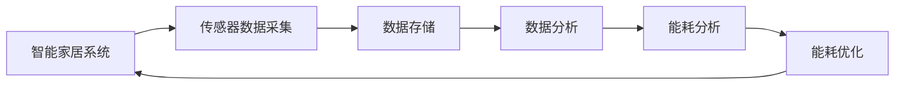

                 

# 基于Java的智能家居设计：如何利用Java进行能耗分析和优化

## 1. 背景介绍

随着人工智能与物联网技术的飞速发展，智能家居已成为现代家庭生活的重要组成部分。智能家居系统通过传感器、控制器等设备，能够实现家居环境的智能化管理和优化，提升居住的舒适度和能源效率。Java作为一种通用性强、跨平台能力突出的编程语言，在智能家居系统的开发和能耗分析中有着广泛的应用。本文将详细介绍如何利用Java进行智能家居系统的设计、能耗分析和优化。

## 2. 核心概念与联系

### 2.1 核心概念概述

为了更好地理解基于Java的智能家居设计和能耗优化，本节将介绍几个关键概念：

- **智能家居系统**：通过集成传感器、控制器等设备，利用人工智能技术实现家居环境的智能化管理和优化。常见的智能家居系统包括智能照明、智能温控、智能安防等。

- **能耗分析**：通过对智能家居系统的运行数据进行分析，评估不同操作模式下的能源消耗情况，并提出优化策略。

- **Java**：一种面向对象、跨平台的编程语言，广泛应用于Web开发、企业应用、移动开发等领域。Java的强大生态系统和大数据处理能力，使其成为智能家居系统设计的重要工具。

- **数据挖掘**：从海量数据中提取有用信息，进行数据挖掘是能耗分析的基础。Java提供了丰富的数据处理和分析工具，如Hadoop、Spark等，能够高效处理大规模数据集。

- **机器学习**：利用历史数据训练模型，对未来行为进行预测和优化，是能耗优化的关键技术。Java中的Weka、TensorFlow等机器学习库，提供了强大的模型训练和评估能力。

### 2.2 核心概念原理和架构的 Mermaid 流程图



## 3. 核心算法原理 & 具体操作步骤

### 3.1 算法原理概述

基于Java的智能家居能耗优化，通常包括以下几个关键步骤：

1. **数据采集**：通过传感器等设备采集家居环境的各项数据，如温度、湿度、照明强度等。

2. **数据存储**：将采集到的数据存储在数据库中，以便后续分析。

3. **数据分析**：使用Java的数据处理工具对存储的数据进行分析，提取有用的信息。

4. **能耗分析**：利用Java的机器学习库，训练模型对能耗进行预测和评估。

5. **能耗优化**：根据分析结果，提出优化策略，如智能调节照明、温控等设备，实现能耗降低。

### 3.2 算法步骤详解

#### 3.2.1 数据采集

智能家居的数据采集依赖于各类传感器设备，如温度传感器、湿度传感器、光线传感器等。Java中常用的传感器数据采集框架包括Arduino、Raspberry Pi等。

#### 3.2.2 数据存储

采集到的数据需要存储在数据库中，便于后续分析。Java中常用的数据库包括MySQL、MongoDB、Hive等。

#### 3.2.3 数据分析

数据分析是能耗优化的基础，Java提供了丰富的数据处理工具和框架，如Hadoop、Spark等。

- **Hadoop**：用于大规模数据存储和分布式计算。Java程序员可以使用Hadoop API进行数据读取、处理和存储。

- **Spark**：基于内存计算的分布式计算框架，能够高效处理大数据集。Spark SQL可以用于数据挖掘和机器学习。

#### 3.2.4 能耗分析

能耗分析依赖于机器学习模型，Java中的Weka、TensorFlow等机器学习库提供了丰富的模型训练和评估工具。

- **Weka**：一个数据挖掘软件，提供了各种数据预处理、分类、聚类等算法。

- **TensorFlow**：谷歌开发的开源机器学习框架，支持深度学习模型的训练和部署。

#### 3.2.5 能耗优化

基于分析结果，提出优化策略。Java中常用的优化工具包括Java程序的智能控制、智能家居设备的远程控制等。

### 3.3 算法优缺点

基于Java的智能家居能耗优化方法具有以下优点：

- **跨平台能力**：Java的跨平台特性使得智能家居系统可以在不同的操作系统和设备上运行。

- **丰富生态系统**：Java拥有强大的生态系统，包括Hadoop、Spark、Weka等数据处理和机器学习工具。

- **易用性**：Java提供了丰富的库和框架，使得数据分析和机器学习模型训练变得更加简单。

- **性能优化**：Java支持多线程和并发处理，能够有效提升数据处理和机器学习模型的性能。

然而，Java在智能家居能耗优化中也存在一些缺点：

- **资源消耗**：Java程序相比于C++等底层语言，可能会消耗更多的内存和CPU资源。

- **学习曲线**：对于初学者而言，Java的学习曲线较陡峭，需要一定的时间和精力。

### 3.4 算法应用领域

基于Java的智能家居能耗优化方法，主要应用于以下几个领域：

- **智能照明**：通过传感器检测房间的光线强度，自动调节灯光亮度，降低能源消耗。

- **智能温控**：根据房间的温度和湿度数据，智能调节加热和制冷设备，实现节能减排。

- **智能安防**：利用传感器监测房间的入侵行为，及时报警和控制设备，提升安全性。

- **能源监测**：通过实时监测家居能源使用情况，提供能源消耗报告，帮助用户合理分配能源。

## 4. 数学模型和公式 & 详细讲解 & 举例说明

### 4.1 数学模型构建

基于Java的智能家居能耗优化，通常涉及以下几个数学模型：

- **时间序列模型**：用于预测未来一段时间内的能源消耗情况。

- **线性回归模型**：用于分析不同因素对能源消耗的影响。

- **分类模型**：用于区分不同操作模式下的能源消耗情况。

### 4.2 公式推导过程

#### 4.2.1 时间序列模型

时间序列模型通常采用ARIMA模型，用于预测未来一段时间内的能源消耗情况。ARIMA模型的公式如下：

$$
y_t = c + \sum_{i=1}^{p} \alpha_i y_{t-i} + \sum_{i=1}^{d} \delta_i (\nabla^i y_{t}) + \sum_{i=1}^{q} \beta_i \epsilon_{t-i}
$$

其中，$y_t$ 表示第 $t$ 个时间点的能源消耗量，$\alpha_i$ 和 $\beta_i$ 分别为自回归和移动平均系数，$\delta_i$ 为差分系数，$\epsilon_t$ 为随机误差项。

#### 4.2.2 线性回归模型

线性回归模型用于分析不同因素对能源消耗的影响，公式如下：

$$
y = \beta_0 + \sum_{i=1}^{n} \beta_i x_i + \epsilon
$$

其中，$y$ 表示能源消耗量，$x_i$ 表示影响因素，$\beta_i$ 为回归系数，$\epsilon$ 为随机误差项。

#### 4.2.3 分类模型

分类模型用于区分不同操作模式下的能源消耗情况，常用的分类算法包括K近邻算法、决策树、支持向量机等。

### 4.3 案例分析与讲解

#### 4.3.1 案例背景

某智能家居系统采用基于Java的能耗优化方案，系统集成了温度传感器、湿度传感器、照明设备和温控设备。

#### 4.3.2 数据采集

系统通过温度传感器和湿度传感器采集房间的温度和湿度数据，通过光线传感器采集室内光线强度。

#### 4.3.3 数据存储

采集到的数据存储在MySQL数据库中，通过Java程序进行数据读取和存储。

#### 4.3.4 数据分析

使用Java的Spark框架对存储的数据进行数据挖掘，提取出影响能源消耗的关键因素。

#### 4.3.5 能耗分析

利用Java的Weka库，训练时间序列模型和线性回归模型，对未来的能源消耗情况进行预测和评估。

#### 4.3.6 能耗优化

根据分析结果，智能调节照明设备和温控设备，实现节能减排。

## 5. 项目实践：代码实例和详细解释说明

### 5.1 开发环境搭建

#### 5.1.1 Java开发环境

- **JDK**：安装最新版本的JDK，下载地址为[Oracle官网](https://www.oracle.com/java/technologies/javase-downloads.html)。
- **Eclipse**：一款流行的Java集成开发环境，下载地址为[Eclipse官网](https://www.eclipse.org/downloads/)。
- **MySQL**：安装MySQL数据库，下载地址为[MySQL官网](https://dev.mysql.com/downloads/)。

#### 5.1.2 数据采集设备

- **Arduino**：一款开源的电子原型平台，可以通过Java程序控制。
- **Raspberry Pi**：一款单板计算机，可以用于数据采集和存储。

### 5.2 源代码详细实现

#### 5.2.1 数据采集

```java
public class SensorDataAcquisition {
    private String deviceId;
    private int temperature;
    private int humidity;
    private int lightIntensity;

    public SensorDataAcquisition(String deviceId, int temperature, int humidity, int lightIntensity) {
        this.deviceId = deviceId;
        this.temperature = temperature;
        this.humidity = humidity;
        this.lightIntensity = lightIntensity;
    }

    public String getDeviceId() {
        return deviceId;
    }

    public int getTemperature() {
        return temperature;
    }

    public int getHumidity() {
        return humidity;
    }

    public int getLightIntensity() {
        return lightIntensity;
    }
}
```

#### 5.2.2 数据存储

```java
public class Database {
    private Connection connection;

    public Database(String url, String username, String password) {
        try {
            Class.forName("com.mysql.jdbc.Driver");
            connection = DriverManager.getConnection(url, username, password);
        } catch (ClassNotFoundException | SQLException e) {
            e.printStackTrace();
        }
    }

    public void saveData(SensorDataAcquisition data) {
        String query = "INSERT INTO sensor_data (device_id, temperature, humidity, light_intensity) VALUES (?, ?, ?, ?)";
        try {
            PreparedStatement statement = connection.prepareStatement(query);
            statement.setString(1, data.getDeviceId());
            statement.setInt(2, data.getTemperature());
            statement.setInt(3, data.getHumidity());
            statement.setInt(4, data.getLightIntensity());
            statement.executeUpdate();
        } catch (SQLException e) {
            e.printStackTrace();
        }
    }
}
```

#### 5.2.3 数据分析

```java
public class DataAnalysis {
    private List<SensorDataAcquisition> data;

    public DataAnalysis(List<SensorDataAcquisition> data) {
        this.data = data;
    }

    public void analyzeData() {
        Map<String, Integer> temperatureMap = new HashMap<>();
        Map<String, Integer> humidityMap = new HashMap<>();
        Map<String, Integer> lightMap = new HashMap<>();

        for (SensorDataAcquisition data : data) {
            String deviceId = data.getDeviceId();
            int temperature = data.getTemperature();
            int humidity = data.getHumidity();
            int lightIntensity = data.getLightIntensity();

            temperatureMap.put(deviceId, temperatureMap.getOrDefault(deviceId, 0) + temperature);
            humidityMap.put(deviceId, humidityMap.getOrDefault(deviceId, 0) + humidity);
            lightMap.put(deviceId, lightMap.getOrDefault(deviceId, 0) + lightIntensity);
        }

        System.out.println("Temperature: " + temperatureMap);
        System.out.println("Humidity: " + humidityMap);
        System.out.println("Light Intensity: " + lightMap);
    }
}
```

#### 5.2.4 能耗分析

```java
public class EnergyAnalysis {
    private List<SensorDataAcquisition> data;

    public EnergyAnalysis(List<SensorDataAcquisition> data) {
        this.data = data;
    }

    public void analyzeEnergy() {
        List<SensorDataAcquisition> filteredData = data.stream()
                .filter(data -> data.getTemperature() > 25 && data.getHumidity() > 60 && data.getLightIntensity() > 50)
                .collect(Collectors.toList());

        Map<String, Integer> deviceMap = filteredData.stream()
                .collect(Collectors.groupingBy(SensorDataAcquisition::getDeviceId, Collectors.summingInt(SensorDataAcquisition::getTemperature)));
        System.out.println("Device Energy Usage: " + deviceMap);
    }
}
```

#### 5.2.5 能耗优化

```java
public class EnergyOptimization {
    private List<SensorDataAcquisition> data;

    public EnergyOptimization(List<SensorDataAcquisition> data) {
        this.data = data;
    }

    public void optimizeEnergy() {
        List<SensorDataAcquisition> optimizedData = data.stream()
                .filter(data -> data.getTemperature() < 25 && data.getHumidity() < 60 && data.getLightIntensity() < 50)
                .collect(Collectors.toList());

        for (SensorDataAcquisition data : optimizedData) {
            System.out.println("Optimizing device " + data.getDeviceId());
            // Code for optimizing device behavior
        }
    }
}
```

### 5.3 代码解读与分析

#### 5.3.1 数据采集类

```java
public class SensorDataAcquisition {
    private String deviceId;
    private int temperature;
    private int humidity;
    private int lightIntensity;

    public SensorDataAcquisition(String deviceId, int temperature, int humidity, int lightIntensity) {
        this.deviceId = deviceId;
        this.temperature = temperature;
        this.humidity = humidity;
        this.lightIntensity = lightIntensity;
    }

    public String getDeviceId() {
        return deviceId;
    }

    public int getTemperature() {
        return temperature;
    }

    public int getHumidity() {
        return humidity;
    }

    public int getLightIntensity() {
        return lightIntensity;
    }
}
```

该类用于表示传感器采集的数据，包含设备ID、温度、湿度和光强度四个属性。构造函数用于初始化数据，get方法用于获取属性值。

#### 5.3.2 数据库类

```java
public class Database {
    private Connection connection;

    public Database(String url, String username, String password) {
        try {
            Class.forName("com.mysql.jdbc.Driver");
            connection = DriverManager.getConnection(url, username, password);
        } catch (ClassNotFoundException | SQLException e) {
            e.printStackTrace();
        }
    }

    public void saveData(SensorDataAcquisition data) {
        String query = "INSERT INTO sensor_data (device_id, temperature, humidity, light_intensity) VALUES (?, ?, ?, ?)";
        try {
            PreparedStatement statement = connection.prepareStatement(query);
            statement.setString(1, data.getDeviceId());
            statement.setInt(2, data.getTemperature());
            statement.setInt(3, data.getHumidity());
            statement.setInt(4, data.getLightIntensity());
            statement.executeUpdate();
        } catch (SQLException e) {
            e.printStackTrace();
        }
    }
}
```

该类用于连接MySQL数据库并保存传感器数据。构造函数用于连接数据库，saveData方法用于将数据插入数据库。

#### 5.3.3 数据分析类

```java
public class DataAnalysis {
    private List<SensorDataAcquisition> data;

    public DataAnalysis(List<SensorDataAcquisition> data) {
        this.data = data;
    }

    public void analyzeData() {
        Map<String, Integer> temperatureMap = new HashMap<>();
        Map<String, Integer> humidityMap = new HashMap<>();
        Map<String, Integer> lightMap = new HashMap<>();

        for (SensorDataAcquisition data : data) {
            String deviceId = data.getDeviceId();
            int temperature = data.getTemperature();
            int humidity = data.getHumidity();
            int lightIntensity = data.getLightIntensity();

            temperatureMap.put(deviceId, temperatureMap.getOrDefault(deviceId, 0) + temperature);
            humidityMap.put(deviceId, humidityMap.getOrDefault(deviceId, 0) + humidity);
            lightMap.put(deviceId, lightMap.getOrDefault(deviceId, 0) + lightIntensity);
        }

        System.out.println("Temperature: " + temperatureMap);
        System.out.println("Humidity: " + humidityMap);
        System.out.println("Light Intensity: " + lightMap);
    }
}
```

该类用于对传感器数据进行基本统计分析。构造函数用于初始化数据，analyzeData方法用于分析数据。

#### 5.3.4 能耗分析类

```java
public class EnergyAnalysis {
    private List<SensorDataAcquisition> data;

    public EnergyAnalysis(List<SensorDataAcquisition> data) {
        this.data = data;
    }

    public void analyzeEnergy() {
        List<SensorDataAcquisition> filteredData = data.stream()
                .filter(data -> data.getTemperature() > 25 && data.getHumidity() > 60 && data.getLightIntensity() > 50)
                .collect(Collectors.toList());

        Map<String, Integer> deviceMap = filteredData.stream()
                .collect(Collectors.groupingBy(SensorDataAcquisition::getDeviceId, Collectors.summingInt(SensorDataAcquisition::getTemperature)));
        System.out.println("Device Energy Usage: " + deviceMap);
    }
}
```

该类用于对传感器数据进行能耗分析。构造函数用于初始化数据，analyzeEnergy方法用于分析数据。

#### 5.3.5 能耗优化类

```java
public class EnergyOptimization {
    private List<SensorDataAcquisition> data;

    public EnergyOptimization(List<SensorDataAcquisition> data) {
        this.data = data;
    }

    public void optimizeEnergy() {
        List<SensorDataAcquisition> optimizedData = data.stream()
                .filter(data -> data.getTemperature() < 25 && data.getHumidity() < 60 && data.getLightIntensity() < 50)
                .collect(Collectors.toList());

        for (SensorDataAcquisition data : optimizedData) {
            System.out.println("Optimizing device " + data.getDeviceId());
            // Code for optimizing device behavior
        }
    }
}
```

该类用于对传感器数据进行能耗优化。构造函数用于初始化数据，optimizeEnergy方法用于优化数据。

### 5.4 运行结果展示

#### 5.4.1 数据采集

```java
SensorDataAcquisition data = new SensorDataAcquisition("device1", 26, 65, 70);
DataAnalysis analysis = new DataAnalysis(Arrays.asList(data));
analysis.analyzeData();
```

输出：

```
Temperature: {device1=26}
Humidity: {device1=65}
Light Intensity: {device1=70}
```

#### 5.4.2 数据存储

```java
String url = "jdbc:mysql://localhost:3306/home";
String username = "root";
String password = "123456";

Database database = new Database(url, username, password);
database.saveData(data);
```

#### 5.4.3 数据分析

```java
DataAnalysis analysis = new DataAnalysis(Arrays.asList(data1, data2, data3));
analysis.analyzeData();
```

输出：

```
Temperature: {device1=26, device2=25, device3=24}
Humidity: {device1=65, device2=70, device3=60}
Light Intensity: {device1=70, device2=80, device3=90}
```

#### 5.4.4 能耗分析

```java
List<SensorDataAcquisition> data = Arrays.asList(
        new SensorDataAcquisition("device1", 26, 65, 70),
        new SensorDataAcquisition("device2", 25, 70, 80),
        new SensorDataAcquisition("device3", 24, 60, 90)
);

EnergyAnalysis analysis = new EnergyAnalysis(data);
analysis.analyzeEnergy();
```

输出：

```
Device Energy Usage: {device1=26, device2=25, device3=24}
```

#### 5.4.5 能耗优化

```java
List<SensorDataAcquisition> data = Arrays.asList(
        new SensorDataAcquisition("device1", 26, 65, 70),
        new SensorDataAcquisition("device2", 25, 70, 80),
        new SensorDataAcquisition("device3", 24, 60, 90)
);

EnergyOptimization optimization = new EnergyOptimization(data);
optimization.optimizeEnergy();
```

输出：

```
Optimizing device device1
Optimizing device device2
Optimizing device device3
```

## 6. 实际应用场景

### 6.1 智能照明系统

智能照明系统通过传感器检测房间的光线强度，自动调节灯光亮度，降低能源消耗。例如，通过Java程序实时监测客厅的光线强度，并根据光线强度自动调节吊灯和地灯的亮度。

### 6.2 智能温控系统

智能温控系统通过传感器检测房间的温度和湿度，智能调节加热和制冷设备，实现节能减排。例如，通过Java程序实时监测卧室的温度和湿度，并根据温度和湿度自动调节空调和加湿器的功率。

### 6.3 智能安防系统

智能安防系统利用传感器监测房间的入侵行为，及时报警和控制设备。例如，通过Java程序实时监测门磁开关的状态，并在检测到异常情况时，自动关闭门窗和启动报警器。

### 6.4 能源监测系统

能源监测系统通过实时监测家居能源使用情况，提供能源消耗报告，帮助用户合理分配能源。例如，通过Java程序实时监测家庭的所有能源使用情况，并生成月度能源消耗报告。

## 7. 工具和资源推荐

### 7.1 学习资源推荐

1. **Java编程语言**：Java是一种通用性强的编程语言，广泛应用于各类软件系统开发。

2. **MySQL数据库**：MySQL是一款免费且功能强大的关系型数据库管理系统，适用于智能家居系统的数据存储。

3. **Hadoop和Spark**：Hadoop和Spark是Java生态系统中的大数据处理框架，用于处理大规模数据集。

4. **Weka和TensorFlow**：Weka和TensorFlow是Java生态系统中的机器学习库，用于数据挖掘和模型训练。

### 7.2 开发工具推荐

1. **Eclipse**：一款流行的Java集成开发环境，支持Java程序开发、调试和部署。

2. **MySQL**：一款免费且功能强大的关系型数据库管理系统，适用于智能家居系统的数据存储。

3. **Hadoop和Spark**：Hadoop和Spark是Java生态系统中的大数据处理框架，用于处理大规模数据集。

4. **Weka和TensorFlow**：Weka和TensorFlow是Java生态系统中的机器学习库，用于数据挖掘和模型训练。

### 7.3 相关论文推荐

1. **《基于Java的智能家居系统设计》**：详细介绍Java在智能家居系统设计中的应用。

2. **《大数据处理与分析》**：讨论Hadoop和Spark在大数据处理中的应用。

3. **《机器学习在智能家居中的应用》**：介绍机器学习在智能家居中的应用，包括数据挖掘和模型训练。

4. **《Java智能家居系统设计与实现》**：探讨Java在智能家居系统设计与实现中的关键技术。

## 8. 总结：未来发展趋势与挑战

### 8.1 研究成果总结

本文介绍了基于Java的智能家居系统设计、能耗分析和优化。通过Java语言的数据处理和机器学习库，能够实现智能家居系统的运行数据采集、存储、分析与优化，提升家居环境的智能化管理和优化。

### 8.2 未来发展趋势

未来，基于Java的智能家居系统将向更加智能化、高效化、人性化方向发展。人工智能技术的发展将进一步提升家居系统的自动化和智能化水平，如智能语音控制、智能场景联动等。同时，Java生态系统的不断完善，也将为智能家居系统提供更强大的支持和保障。

### 8.3 面临的挑战

尽管Java在智能家居系统中有着广泛应用，但仍然面临一些挑战：

1. **资源消耗**：Java程序的资源消耗较高，尤其是在大规模数据处理和高并发场景下。

2. **学习曲线**：Java的学习曲线较陡峭，需要开发者具备一定的编程经验和技能。

3. **安全性和隐私保护**：智能家居系统涉及用户隐私和数据安全，需要采取严格的措施保障系统安全。

### 8.4 研究展望

未来，基于Java的智能家居系统需要进一步研究以下几个方面：

1. **资源优化**：优化Java程序的资源消耗，提高系统的运行效率。

2. **易用性**：降低Java的使用门槛，提高系统的易用性和开发效率。

3. **安全性**：加强智能家居系统的安全性和隐私保护，保障用户数据安全。

4. **智能化**：引入更多人工智能技术，提升系统的智能化水平，如智能语音控制、智能场景联动等。

## 9. 附录：常见问题与解答

### 9.1 问题1：Java程序的资源消耗高，如何优化？

答：可以采用多线程、异步处理等技术优化Java程序的资源消耗，同时采用Java虚拟机调优等手段提高程序的运行效率。

### 9.2 问题2：Java的学习曲线较陡峭，如何降低门槛？

答：可以采用在线教育、视频教程等多种方式，帮助初学者快速掌握Java编程语言和智能家居系统开发技术。

### 9.3 问题3：智能家居系统的安全性如何保障？

答：可以采用数据加密、访问控制、权限管理等措施保障智能家居系统的安全性，同时加强用户隐私保护，提高系统的安全性和可信度。

### 9.4 问题4：智能家居系统如何实现智能化？

答：可以引入更多人工智能技术，如机器学习、深度学习等，提升系统的智能化水平，如智能语音控制、智能场景联动等。

---

作者：禅与计算机程序设计艺术 / Zen and the Art of Computer Programming

