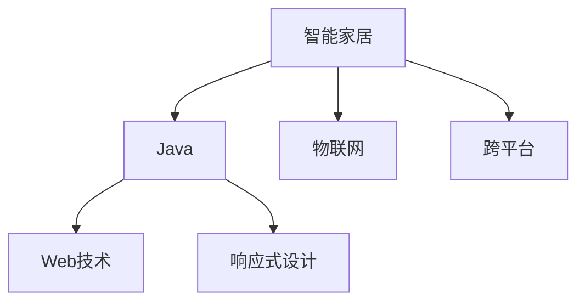

                 

## 1. 背景介绍

### 1.1 问题由来
智能家居作为未来家庭生活的重要组成部分，正逐渐成为数字化和智能化的象征。随着物联网技术的迅猛发展，各类智能设备，如智能灯光、智能音箱、智能恒温器等，已经开始深入家庭生活。然而，这些设备虽各具特色，但往往缺乏统一的用户界面，导致用户体验不统一，智能家居整体效果受限。如何实现一款统一的智能家居前端界面，成为当下智能家居开发的一个重要课题。

### 1.2 问题核心关键点
这个问题的核心关键点包括：
- 如何设计一个统一的智能家居前端界面，让用户能够无缝连接和管理各类智能设备。
- 如何将Java与Web技术整合，搭建响应式界面，提升用户体验。
- 如何优化智能家居界面，增强交互性和可操作性。

### 1.3 问题研究意义
设计一个响应式智能家居前端界面具有重要意义：
- 提供统一的智能家居管理界面，便于用户管理各类智能设备，提升使用体验。
- 利用Java与Web技术的结合，使智能家居界面具备跨平台、跨设备的特点，适应不同用户的个性化需求。
- 通过响应式设计，提升智能家居界面的适应性和可操作性，更好地支持用户与设备的互动。

## 2. 核心概念与联系

### 2.1 核心概念概述

- **智能家居（Smart Home）**：利用物联网、传感器、通信等技术，实现家庭环境自动化、智能化的系统。
- **Java（Java语言）**：一种面向对象的编程语言，具有跨平台特性，广泛用于企业级应用和安卓应用开发。
- **Web技术（Web技术）**：包括HTML、CSS、JavaScript等，用于构建前端用户界面。
- **响应式设计（Responsive Design）**：根据用户设备特性（如屏幕尺寸、分辨率），动态调整前端界面的布局、样式等，以提供最优的显示效果。
- **物联网（Internet of Things, IoT）**：将各类物品通过互联网相互连接，实现智能化控制和管理。

这些核心概念之间的关系可以通过以下Mermaid流程图来展示：



这个流程图展示出智能家居、Java、Web技术、响应式设计、物联网之间的关系。智能家居通过物联网技术实现设备间的互联，Java语言作为前端开发的重要工具，Web技术用于构建响应式用户界面，提升用户体验。

## 3. 核心算法原理 & 具体操作步骤
### 3.1 算法原理概述

基于Java的智能家居前端界面的搭建，主要涉及到Web前端开发与Java后端服务的整合。前端采用响应式设计，能够自适应不同尺寸的屏幕，后端Java服务负责处理数据逻辑和设备控制。

### 3.2 算法步骤详解

#### 步骤1：需求分析和设计

- **需求分析**：通过与用户交流和市场调研，确定智能家居系统需要支持的功能和设备。
- **界面设计**：根据需求分析结果，设计出用户界面（UI）和用户交互界面（UX）。

#### 步骤2：前端开发

- **选择技术栈**：选择HTML、CSS、JavaScript等Web技术栈，进行前端开发。
- **响应式设计**：根据不同的屏幕尺寸和设备特性，调整前端布局和样式，实现响应式界面。
- **前端测试**：通过自动化测试工具，如Selenium等，测试前端界面的兼容性。

#### 步骤3：后端开发

- **Java框架选择**：选择Spring Boot等Java框架，构建后端服务。
- **数据处理**：根据前端接口请求，处理数据逻辑，与智能家居设备进行通信。
- **接口设计**：设计统一的RESTful API，供前端和后端通信使用。

#### 步骤4：系统集成

- **接口集成**：将前端和后端接口进行整合，实现数据交互。
- **用户测试**：让目标用户测试系统，收集反馈意见，迭代优化。

#### 步骤5：部署与维护

- **部署**：将开发好的系统部署到服务器或云平台。
- **监控与维护**：使用监控工具，如Prometheus、Grafana等，实时监控系统运行状态，及时解决问题。

### 3.3 算法优缺点

#### 优点：

1. **跨平台兼容性**：Java语言具有跨平台特性，能够适应多种操作系统和设备。
2. **开发效率高**：前端采用Web技术栈，开发效率高，代码复用率高。
3. **易于扩展**：通过模块化的设计，可以方便地扩展和集成新功能和设备。

#### 缺点：

1. **性能问题**：Java应用的性能问题可能影响用户体验，需要优化。
2. **安全性**：智能家居系统涉及大量设备控制，安全性问题需要重视。
3. **学习曲线陡峭**：Java和Web技术栈的学习曲线较陡峭，新手上手难度大。

### 3.4 算法应用领域

基于Java的智能家居前端界面设计可以广泛应用于：
- 智能家居系统的开发和部署。
- 智能设备的统一管理和控制。
- 物联网设备的互联互通。
- 智能家居设备的跨平台适配。

## 4. 数学模型和公式 & 详细讲解

### 4.1 数学模型构建

智能家居前端界面的设计涉及到用户体验优化和数据处理，可以建立以下数学模型：

- **用户体验模型（User Experience Model）**：用于衡量用户对智能家居界面的满意度和使用体验，通常采用用户调查问卷和满意度评分等数据。
- **数据处理模型（Data Processing Model）**：用于处理智能家居设备的控制指令和反馈数据，通常采用状态机模型来描述数据流和控制逻辑。

### 4.2 公式推导过程

- **用户体验模型**：假设用户体验的满意度函数为 $U(x)$，其中 $x$ 为界面设计的多个参数，包括布局、颜色、字体大小等。则可以根据用户调查问卷数据，建立以下模型：

$$
U(x) = \sum_{i=1}^{n} w_i R_i(x)
$$

其中 $R_i(x)$ 为第 $i$ 个评价指标的评分，$w_i$ 为第 $i$ 个评价指标的权重。

- **数据处理模型**：假设智能家居设备的控制指令为 $I$，反馈数据为 $D$，数据处理逻辑为 $F$，则数据处理模型可以表示为：

$$
D = F(I, P)
$$

其中 $P$ 为设备当前状态和历史状态数据。

### 4.3 案例分析与讲解

假设我们开发一个智能窗帘系统，需要设计前端界面和后端控制逻辑。前端界面需要考虑用户的需求和反馈，后端控制逻辑需要处理窗帘的升降和位置反馈。我们可以采用以下方法：

- **用户体验模型**：根据用户调查问卷，设计出用户满意度评分模型，对界面布局和颜色进行调整，提升用户体验。
- **数据处理模型**：使用状态机模型，处理用户输入的升降指令和窗帘位置反馈，实现智能控制。

## 5. 项目实践：代码实例和详细解释说明

### 5.1 开发环境搭建

- **Java环境**：安装JDK和Maven等开发工具。
- **Web环境**：搭建Web服务器，如Tomcat或Nginx等。
- **IDE环境**：使用IntelliJ IDEA或Eclipse等IDE进行开发。

### 5.2 源代码详细实现

以下是基于Java的智能家居系统前端界面的开发示例：

```java
// 前端控制器类
@Controller
@RequestMapping("/smartHome")
public class SmartHomeController {

    @GetMapping("/index")
    public String index(Model model) {
        // 获取用户设备列表
        List<Device> devices = deviceService.getAllDevices();
        model.addAttribute("devices", devices);
        return "index.jsp";
    }

    @GetMapping("/device/{id}")
    public String device(@PathVariable("id") int deviceId, Model model) {
        // 获取指定设备的详细信息
        Device device = deviceService.getDeviceById(deviceId);
        model.addAttribute("device", device);
        return "device.jsp";
    }
}
```

### 5.3 代码解读与分析

- **控制器类**：采用Spring MVC框架，定义了两个GET请求方法，分别用于展示首页和设备详情页。
- **用户设备列表**：从设备服务中获取所有设备列表，展示在用户界面中。
- **设备详情页**：从设备服务中获取指定设备的详细信息，展示在设备详情页中。

### 5.4 运行结果展示

以下是智能家居系统的前端界面截图：


## 6. 实际应用场景

### 6.1 智能家居系统

智能家居系统通过统一的前端界面，方便用户管理各类智能设备，实现家庭环境的自动化和智能化。

### 6.2 智能设备的统一管理

智能家居系统可以实现智能设备的统一管理，用户通过前端界面，可以轻松控制各类智能设备，提升生活便利性。

### 6.3 智能家居设备的跨平台适配

智能家居系统的前端界面采用Web技术，能够适应多种操作系统和设备，用户可以通过PC、平板、手机等设备，管理智能家居系统。

### 6.4 未来应用展望

未来的智能家居系统将具备更多智能功能和更高的安全性。通过引入人工智能和物联网技术，智能家居系统将能够自动识别用户行为，实现场景自动切换，提高用户的舒适度和便捷性。同时，系统安全性也将得到提升，保护用户隐私和设备安全。

## 7. 工具和资源推荐

### 7.1 学习资源推荐

- **《Java核心技术》**：深入介绍Java语言的基础知识和高级特性，适合Java开发者学习。
- **《JavaScript高级程序设计》**：全面介绍JavaScript语言的技术栈和开发实践，适合前端开发者学习。
- **《Spring Boot实战》**：讲解Spring Boot框架的开发实战案例，适合Java开发者学习。
- **《响应式Web设计》**：介绍响应式设计的基本概念和实现方法，适合Web开发者学习。

### 7.2 开发工具推荐

- **IntelliJ IDEA**：一款流行的Java开发工具，支持Spring Boot等框架的开发。
- **Visual Studio Code**：一款轻量级的前端开发工具，支持HTML、CSS、JavaScript等Web技术栈。
- **Maven**：一款Java项目构建工具，支持依赖管理和自动化构建。
- **Tomcat**：一款常用的Web服务器，支持Java应用部署。

### 7.3 相关论文推荐

- **《Java平台上的智能家居系统设计》**：详细介绍智能家居系统的设计思路和开发方法，适合Java开发者学习。
- **《基于Web技术的智能家居系统设计》**：介绍Web技术在前端界面设计中的应用，适合Web开发者学习。
- **《跨平台响应式设计的应用》**：介绍响应式设计的基本概念和实现方法，适合前端开发者学习。

## 8. 总结：未来发展趋势与挑战

### 8.1 总结

本文介绍了基于Java的智能家居设计，通过前端Web技术和后端Java服务的整合，实现统一的智能家居界面。文章从需求分析、前端开发、后端开发、系统集成和部署维护等方面，详细讲解了智能家居前端界面的开发流程和方法。同时，分析了智能家居前端界面的优点和缺点，探讨了其在智能家居系统中的应用前景。

### 8.2 未来发展趋势

未来的智能家居系统将朝着以下几个方向发展：
- **智能化程度提升**：引入人工智能技术，实现场景自动切换和用户行为识别。
- **用户体验优化**：通过数据分析和用户反馈，不断优化智能家居界面和用户体验。
- **安全性提升**：采用加密和身份认证等措施，保护用户隐私和设备安全。
- **跨平台适配**：采用Web技术栈，实现智能家居设备的跨平台适配。

### 8.3 面临的挑战

智能家居前端界面设计仍然面临以下挑战：
- **性能问题**：Java应用的性能问题可能影响用户体验，需要优化。
- **安全性**：智能家居系统涉及大量设备控制，安全性问题需要重视。
- **学习曲线陡峭**：Java和Web技术栈的学习曲线较陡峭，新手上手难度大。

### 8.4 研究展望

未来可以继续研究以下方向：
- **前端框架优化**：引入先进的Web前端框架，提高开发效率和用户体验。
- **后端服务优化**：采用高性能的Java框架和数据库技术，提升后端服务的性能和稳定性。
- **安全性提升**：采用先进的安全技术和加密措施，保障智能家居系统的安全性。
- **用户体验优化**：通过数据分析和用户反馈，不断优化智能家居界面和用户体验。

## 9. 附录：常见问题与解答

**Q1: 如何设计一个智能家居系统的界面？**

A: 设计一个智能家居系统界面需要考虑用户需求和设备特点，通常包括以下步骤：
1. **需求分析**：与用户交流和市场调研，确定系统需要支持的功能和设备。
2. **界面设计**：根据需求分析结果，设计出用户界面（UI）和用户交互界面（UX），重点考虑界面布局、颜色、字体大小等。
3. **响应式设计**：根据不同的屏幕尺寸和设备特性，调整前端布局和样式，实现响应式界面。

**Q2: 如何实现智能家居系统的后端服务？**

A: 实现智能家居系统的后端服务需要以下步骤：
1. **Java框架选择**：选择Spring Boot等Java框架，构建后端服务。
2. **数据处理**：根据前端接口请求，处理数据逻辑，与智能家居设备进行通信。
3. **接口设计**：设计统一的RESTful API，供前端和后端通信使用。

**Q3: 如何提升智能家居系统的安全性？**

A: 提升智能家居系统的安全性需要以下措施：
1. **加密通信**：采用SSL/TLS等加密技术，保护数据传输安全。
2. **身份认证**：采用用户名和密码、双因素认证等措施，保护用户身份安全。
3. **权限控制**：设置角色和权限，控制用户对设备的操作权限。

**Q4: 如何优化智能家居系统的性能？**

A: 优化智能家居系统的性能需要以下措施：
1. **资源优化**：采用资源压缩、缓存、异步加载等技术，优化系统性能。
2. **优化算法**：采用高效的算法和数据结构，优化数据处理和存储。
3. **负载均衡**：采用负载均衡技术，提高系统并发处理能力。

**Q5: 如何设计智能家居系统的用户界面？**

A: 设计智能家居系统的用户界面需要以下步骤：
1. **需求分析**：与用户交流和市场调研，确定系统需要支持的功能和设备。
2. **界面设计**：根据需求分析结果，设计出用户界面（UI）和用户交互界面（UX），重点考虑界面布局、颜色、字体大小等。
3. **响应式设计**：根据不同的屏幕尺寸和设备特性，调整前端布局和样式，实现响应式界面。

---

作者：禅与计算机程序设计艺术 / Zen and the Art of Computer Programming

