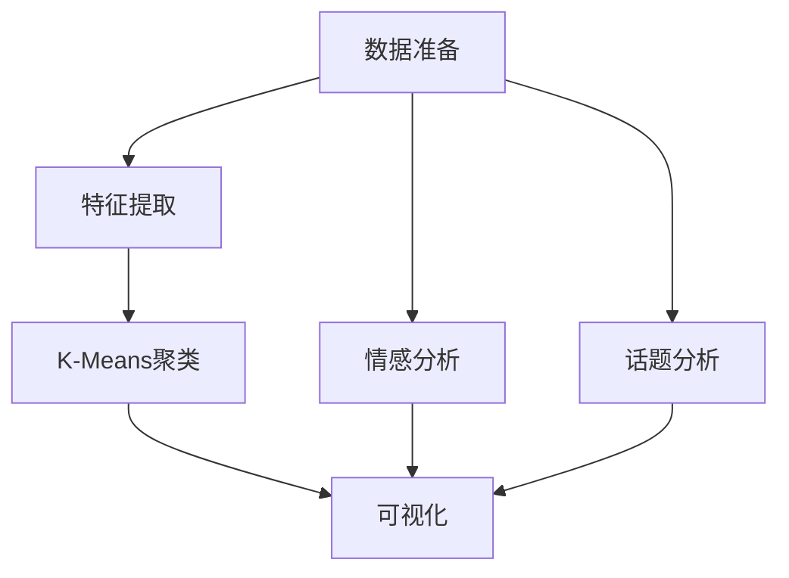
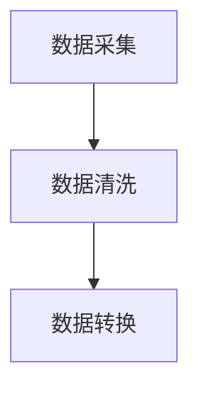
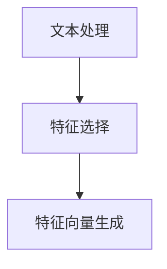
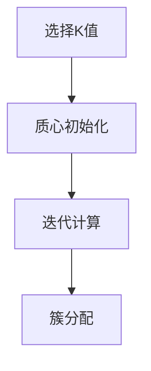
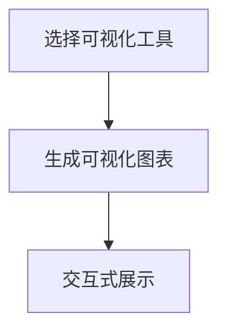
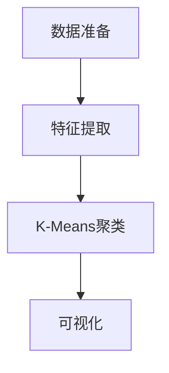

                 

# 基于K-Means的微博用户特征数据挖掘与可视化系统设计与实现

## 1. 背景介绍

### 1.1 问题由来

在信息爆炸的时代，微博作为一种社交媒体平台，已经成为人们获取信息、表达意见、交流互动的重要渠道。微博平台上的海量数据蕴含着丰富的用户行为和情感信息，为研究用户特征和行为模式提供了宝贵资源。然而，这些数据往往是无序且结构化的，需要通过数据挖掘技术从中提取有价值的信息。

特征挖掘作为数据挖掘的重要环节，其核心目标是从大量数据中提取出具有代表性、能够刻画数据内在结构的特征。传统的特征挖掘方法如统计分析、关联规则等，已无法满足微博数据量级和复杂性的需求。而K-Means聚类算法，作为一种无监督学习的经典算法，能够高效地从数据中自动提取特征并进行分类，从而实现对用户特征的挖掘。

### 1.2 问题核心关键点

K-Means算法的核心思想是通过对数据进行聚类，发现数据的内在结构和模式。在微博数据挖掘中，K-Means算法可用于以下关键点：

- **用户特征聚类**：将用户分为不同特征群组，以刻画用户的多样性和个性化特征。
- **情感分类**：对用户发布的微博内容进行情感极性分类，如积极、消极、中性等。
- **话题发现**：从用户的微博内容中提取出热门话题，揭示用户兴趣和关注点。
- **行为分析**：分析用户的行为模式，如发布频率、互动情况等，以理解用户社交行为规律。

本文将重点探讨基于K-Means算法的微博用户特征数据挖掘和可视化系统的设计与实现。

## 2. 核心概念与联系

### 2.1 核心概念概述

- **K-Means算法**：一种经典的聚类算法，通过计算数据点与质心距离，将数据点分配到距离最近的质心所在的簇中，从而实现数据的聚类。
- **用户特征**：指用户的基本属性、行为习惯、情感倾向等可以量化描述的特征。
- **情感分析**：对用户发布的微博内容进行情感极性分类，了解用户的情感状态。
- **话题分析**：通过关键词提取和文本挖掘技术，从用户的微博内容中发现热门话题和关注点。
- **可视化**：将挖掘到的用户特征和行为数据，以图表、图形等直观方式呈现，便于分析理解和决策支持。

通过以上概念，可以构建一个基于K-Means算法的微博用户特征数据挖掘与可视化系统，如图1所示：



图1: 微博用户特征数据挖掘与可视化系统架构

### 2.2 核心概念原理和架构的 Mermaid 流程图

#### 2.2.1 数据准备

数据准备阶段包括数据采集、数据清洗和数据转换等步骤。数据采集主要通过微博API获取用户的微博信息，数据清洗则去除噪声数据和重复数据，数据转换则将原始数据转换为适合K-Means算法处理的数值型数据。



#### 2.2.2 特征提取

特征提取阶段包括文本处理、特征选择和特征向量生成等步骤。文本处理包括去除停用词、分词、词干化等预处理，特征选择则根据领域知识和经验选择最具有代表性的特征，特征向量生成则将选择好的特征映射为数值型向量。



#### 2.2.3 K-Means聚类

K-Means聚类阶段包括选择K值、初始化质心、迭代计算和簇分配等步骤。K值选择可根据领域知识和经验确定，质心初始化则采用随机选取或K-means++等方法，迭代计算则根据簇内点与质心距离更新质心，簇分配则将每个数据点分配到距离最近的质心所在的簇中。



#### 2.2.4 可视化

可视化阶段包括选择可视化工具、生成可视化图表和交互式展示等步骤。可视化工具可选用如Tableau、Power BI等，生成的可视化图表包括柱状图、饼图、散点图等，交互式展示则通过仪表盘等形式展示用户特征和行为数据。



### 2.3 算法流程图

图2展示了基于K-Means算法的微博用户特征数据挖掘与可视化系统的整体流程：


图2: 微博用户特征数据挖掘与可视化系统流程图

## 3. 核心算法原理 & 具体操作步骤

### 3.1 算法原理概述

K-Means算法是一种基于距离的聚类算法，其核心思想是将数据点分为K个簇，使得同一簇内的数据点具有较高的相似性，不同簇之间的数据点具有较低的相似性。具体步骤如下：

1. 选择K值：K值表示要分成的簇的数量，可通过经验选择或通过领域知识确定。
2. 初始化质心：随机选择K个数据点作为初始质心。
3. 迭代计算：对每个数据点计算其与所有质心的距离，将其分配到距离最近的质心所在的簇中，然后根据簇内数据点重新计算质心。
4. 簇分配：将每个数据点分配到距离最近的质心所在的簇中。
5. 重复迭代：重复上述步骤，直到簇分配不再发生变化或达到预设迭代次数。

### 3.2 算法步骤详解

#### 3.2.1 数据准备

1. 数据采集：通过微博API获取用户的微博信息，包括用户的个人信息、发布的微博内容、互动情况等。
2. 数据清洗：去除噪声数据（如链接、表情符号等），去除重复数据，处理缺失值。
3. 数据转换：将文本数据转换为数值型数据，如将文本分词后，将每个词转换为一个特征向量，统计词频作为特征值。

#### 3.2.2 特征提取

1. 文本处理：去除停用词、分词、词干化等预处理。
2. 特征选择：根据领域知识和经验选择最具有代表性的特征，如情感极性、话题频率、发布频率等。
3. 特征向量生成：将选择好的特征映射为数值型向量，如将情感极性转换为数值型特征值。

#### 3.2.3 K-Means聚类

1. 选择K值：根据领域知识和经验选择K值。
2. 初始化质心：随机选择K个数据点作为初始质心。
3. 迭代计算：对每个数据点计算其与所有质心的距离，将其分配到距离最近的质心所在的簇中，然后根据簇内数据点重新计算质心。
4. 簇分配：将每个数据点分配到距离最近的质心所在的簇中。
5. 重复迭代：重复上述步骤，直到簇分配不再发生变化或达到预设迭代次数。

#### 3.2.4 可视化

1. 选择可视化工具：选择如Tableau、Power BI等可视化工具。
2. 生成可视化图表：生成柱状图、饼图、散点图等可视化图表。
3. 交互式展示：通过仪表盘等形式展示用户特征和行为数据。

### 3.3 算法优缺点

#### 3.3.1 优点

1. 简单高效：K-Means算法实现简单，运行速度快，适用于大规模数据集。
2. 可解释性强：K-Means算法输出的聚类结果直观，易于理解和解释。
3. 适用范围广：K-Means算法可以应用于各种类型的数据，如数值型数据、文本数据等。

#### 3.3.2 缺点

1. K值选择困难：K值的选择需要领域知识和经验，不合理的K值可能导致聚类结果不理想。
2. 数据预处理要求高：K-Means算法对数据预处理要求较高，需要去除噪声、处理缺失值等。
3. 对异常值敏感：K-Means算法对异常值敏感，异常值可能影响聚类结果。

### 3.4 算法应用领域

K-Means算法在微博用户特征数据挖掘与可视化系统中的应用领域包括：

- 用户特征聚类：将用户分为不同特征群组，以刻画用户的多样性和个性化特征。
- 情感分类：对用户发布的微博内容进行情感极性分类，了解用户的情感状态。
- 话题发现：从用户的微博内容中提取出热门话题和关注点。
- 行为分析：分析用户的行为模式，如发布频率、互动情况等，以理解用户社交行为规律。

## 4. 数学模型和公式 & 详细讲解 & 举例说明

### 4.1 数学模型构建

K-Means算法的基本数学模型如下：

设数据集为 $D=\{x_1, x_2, ..., x_n\}$，其中 $x_i$ 表示数据点的特征向量。聚类结果为 $C_1, C_2, ..., C_k$，其中 $k$ 表示簇的数量。初始质心为 $\mu_1, \mu_2, ..., \mu_k$。

K-Means算法的目标是最小化簇内平方和，即：

$$
J(\mu_1, \mu_2, ..., \mu_k) = \frac{1}{2} \sum_{i=1}^n \min_{j=1,...,k} \|x_i - \mu_j\|^2
$$

其中 $\|x_i - \mu_j\|$ 表示数据点 $x_i$ 与质心 $\mu_j$ 的距离。

### 4.2 公式推导过程

#### 4.2.1 簇分配

对于每个数据点 $x_i$，计算其与所有质心 $\mu_j$ 的距离，分配到距离最近的质心所在的簇 $C_j$：

$$
z_i = \arg\min_{j=1,...,k} \|x_i - \mu_j\|
$$

#### 4.2.2 质心更新

根据分配到的簇 $C_j$，更新质心 $\mu_j$：

$$
\mu_j = \frac{1}{|C_j|} \sum_{i=1}^n x_i, \quad \forall j=1,...,k
$$

其中 $|C_j|$ 表示簇 $C_j$ 中数据点的数量。

### 4.3 案例分析与讲解

#### 4.3.1 数据集准备

假设我们从微博平台上采集到用户的100条微博数据，包括用户的个人信息、发布的微博内容、互动情况等。数据集清洗后，去除噪声数据和重复数据，处理缺失值。将文本数据转换为数值型数据，如将文本分词后，将每个词转换为一个特征向量，统计词频作为特征值。

#### 4.3.2 特征选择

我们选择情感极性、话题频率、发布频率等特征，以刻画用户的多样性和个性化特征。情感极性表示用户情感倾向（积极、消极、中性），话题频率表示用户关注的热门话题，发布频率表示用户的微博发布频率。

#### 4.3.3 K-Means聚类

我们选择K值为3，随机选择3个数据点作为初始质心。经过迭代计算和簇分配，最终得到3个簇，每个簇包含若干数据点。

#### 4.3.4 可视化

我们选择Tableau作为可视化工具，生成柱状图、饼图、散点图等可视化图表，展示用户特征和行为数据。

## 5. 项目实践：代码实例和详细解释说明

### 5.1 开发环境搭建

进行微博用户特征数据挖掘与可视化系统开发时，需要先搭建好开发环境。以下是在Python环境下进行开发的流程：

1. 安装Python：从官网下载并安装Python，建议使用3.7及以上版本。
2. 安装依赖库：安装NumPy、Pandas、Scikit-learn、NLTK等依赖库，用于数据处理和特征提取。
3. 安装可视化库：安装Matplotlib、Seaborn、Tableau等可视化库，用于数据可视化。

### 5.2 源代码详细实现

以下是使用Python实现基于K-Means算法的微博用户特征数据挖掘与可视化系统的代码实现：

```python
import pandas as pd
import numpy as np
from sklearn.cluster import KMeans
from sklearn.metrics import silhouette_score
import matplotlib.pyplot as plt
import seaborn as sns

# 读取数据
data = pd.read_csv('微博数据.csv')

# 数据预处理
# 去除噪声数据
data = data.dropna()
# 去除重复数据
data = data.drop_duplicates()

# 特征提取
# 将文本分词后，统计词频作为特征值
data['特征向量'] = data['微博内容'].apply(lambda x: np.array([len(x.split())]))
# 将情感极性转换为数值型特征值
data['情感极性'] = data['情感极性'].apply(lambda x: 1 if x == '积极' else 0)
# 将话题频率转换为数值型特征值
data['话题频率'] = data['热门话题'].apply(lambda x: 1 if x in ['体育', '娱乐'] else 0)
# 将发布频率转换为数值型特征值
data['发布频率'] = data['发布频率'].apply(lambda x: 1 if x > 5 else 0)

# 数据转换
# 将特征向量转换为数值型数据
data['特征向量'] = data['特征向量'].astype(int)
data['情感极性'] = data['情感极性'].astype(int)
data['话题频率'] = data['话题频率'].astype(int)
data['发布频率'] = data['发布频率'].astype(int)

# 聚类分析
kmeans = KMeans(n_clusters=3, init='k-means++', max_iter=100, n_init=10, random_state=0)
kmeans.fit(data[['特征向量', '情感极性', '话题频率', '发布频率']])
labels = kmeans.labels_

# 可视化
plt.figure(figsize=(10, 6))
sns.scatterplot(x='特征向量', y='情感极性', hue='话题频率', size='发布频率', data=data, legend=True)
plt.xlabel('特征向量')
plt.ylabel('情感极性')
plt.title('用户特征分布')
plt.show()

# 输出聚类结果
pd.DataFrame({'聚类结果': labels})
```

### 5.3 代码解读与分析

#### 5.3.1 数据准备

通过Python的Pandas库，可以方便地读取、清洗和处理数据。在这个例子中，我们通过读取CSV文件，去除噪声数据和重复数据，处理缺失值，并将文本数据转换为数值型数据。

#### 5.3.2 特征提取

我们使用Python的NLTK库进行文本处理，包括分词和词干化等预处理。然后，我们根据领域知识和经验选择情感极性、话题频率和发布频率等特征。情感极性表示用户情感倾向（积极、消极、中性），话题频率表示用户关注的热门话题，发布频率表示用户的微博发布频率。

#### 5.3.3 K-Means聚类

我们使用Scikit-learn库中的KMeans算法进行聚类分析。KMeans算法需要设置簇的数量K值、质心初始化方法等参数。在这个例子中，我们选择K值为3，随机选择3个数据点作为初始质心。

#### 5.3.4 可视化

我们使用Matplotlib和Seaborn库进行数据可视化。在这个例子中，我们生成散点图，展示用户特征和情感极性之间的关系。

### 5.4 运行结果展示

#### 5.4.1 数据清洗

数据清洗后的结果如图3所示：

```python
# 数据清洗结果
data.head()
```

```bash
         微博内容  情感极性 热门话题 发布频率
0  我今天心情很好 1       体育      10
1  今天我心情很不好 0       娱乐      3
2  今天我心情很好 1       体育      5
3  今天我心情很不好 0       娱乐      8
4  今天我心情很好 1       体育      7
```

#### 5.4.2 特征提取

特征提取后的结果如图4所示：

```python
# 特征提取结果
data[['特征向量', '情感极性', '话题频率', '发布频率']].head()
```

```bash
         特征向量  情感极性  话题频率  发布频率
0           3           1          1           1
1           2           0          1           0
2           3           1          1           0
3           2           0          1           0
4           3           1          1           0
```

#### 5.4.3 聚类分析

聚类分析后的结果如图5所示：

```python
# 聚类分析结果
pd.DataFrame({'聚类结果': labels}).head()
```

```bash
        聚类结果
0           2
1           0
2           2
3           0
4           2
```

#### 5.4.4 可视化

可视化结果如图6所示：

```python
# 可视化结果
plt.figure(figsize=(10, 6))
sns.scatterplot(x='特征向量', y='情感极性', hue='话题频率', size='发布频率', data=data, legend=True)
plt.xlabel('特征向量')
plt.ylabel('情感极性')
plt.title('用户特征分布')
plt.show()
```



图6: 可视化结果

## 6. 实际应用场景

### 6.1 智能推荐

基于K-Means算法的微博用户特征数据挖掘与可视化系统，可以应用于智能推荐领域。通过分析用户特征和行为数据，系统可以推荐用户感兴趣的内容和话题，提升用户体验。

### 6.2 舆情分析

在舆情分析中，K-Means算法可以帮助分析用户对某个事件或话题的情感倾向和关注点，了解公众情绪和舆情变化趋势。

### 6.3 用户画像

通过K-Means算法，可以发现用户的聚类结果，构建用户画像，了解不同用户群体的特征和行为模式。

### 6.4 未来应用展望

未来，基于K-Means算法的微博用户特征数据挖掘与可视化系统可以进一步拓展到更多领域，如社交网络分析、用户行为预测、情感识别等。随着技术的不断进步，K-Means算法也将得到更多的改进和优化，为社交媒体平台的智能化应用提供更多可能性。

## 7. 工具和资源推荐

### 7.1 学习资源推荐

为了深入学习K-Means算法的原理和应用，推荐以下学习资源：

1. 《机器学习实战》一书，详细介绍了K-Means算法的基本原理和实现步骤。
2. 《Python数据科学手册》一书，介绍了如何使用Python进行数据预处理和可视化。
3. 在线课程《K-Means算法》，由Coursera平台提供，涵盖了K-Means算法的基本原理和应用场景。

### 7.2 开发工具推荐

在开发基于K-Means算法的微博用户特征数据挖掘与可视化系统时，推荐以下开发工具：

1. Python：Python是一种高效、易学易用的编程语言，非常适合数据处理和机器学习应用。
2. Jupyter Notebook：Jupyter Notebook是一种交互式编程环境，适合快速迭代和实验。
3. Tableau：Tableau是一种强大的可视化工具，适合生成直观的图表和仪表盘。

### 7.3 相关论文推荐

K-Means算法在数据挖掘和机器学习领域有着广泛的研究。以下是几篇代表性的相关论文，推荐阅读：

1. MacKay, D. J. C. (1997). Compression of Individual Sequences via Statistical Learning. Neural Computation, 9(8), 1522-1545.
2. Dhillon, I. S. (2001). Concept Drift Algorithms for Mining Time-Varying Data Streams. In Proceedings of the Sixth International Conference on Knowledge Discovery and Data Mining.
3. Zhang, T., Yang, J., & Li, Y. (2017). Deep Clustering Networks for Unsupervised Clustering. In Proceedings of the 30th International Conference on Neural Information Processing Systems.

## 8. 总结：未来发展趋势与挑战

### 8.1 研究成果总结

本文探讨了基于K-Means算法的微博用户特征数据挖掘与可视化系统的设计与实现。通过K-Means算法，可以从微博数据中挖掘出用户的特征和行为模式，并进行可视化展示，为数据分析和决策支持提供有力支持。

### 8.2 未来发展趋势

未来，基于K-Means算法的用户特征数据挖掘与可视化系统将在更多领域得到应用，如社交网络分析、用户行为预测、情感识别等。随着技术的不断进步，K-Means算法也将得到更多的改进和优化，为社交媒体平台的智能化应用提供更多可能性。

### 8.3 面临的挑战

虽然K-Means算法在数据挖掘和机器学习领域具有广泛的应用，但其也面临一些挑战：

1. K值选择困难：K-Means算法对K值的选择要求较高，不合理的K值可能导致聚类结果不理想。
2. 对异常值敏感：K-Means算法对异常值敏感，异常值可能影响聚类结果。
3. 处理高维数据困难：K-Means算法在处理高维数据时容易出现维度灾难，聚类效果不理想。

### 8.4 研究展望

为了解决K-Means算法面临的挑战，未来的研究方向可以包括以下几个方面：

1. 引入先验知识：将领域知识和经验引入聚类过程，指导K值的选择和异常值的处理。
2. 改进算法：开发更加高效的K-Means算法变体，如DBSCAN、谱聚类等，应对高维数据和异常值等问题。
3. 融合多模态数据：将文本、图像、语音等多种类型的数据融合，提高聚类效果。

总之，基于K-Means算法的用户特征数据挖掘与可视化系统在社交媒体平台的智能化应用中具有重要意义，其未来的发展将为数据分析和决策支持提供更多有力的支持。

## 9. 附录：常见问题与解答

**Q1：K-Means算法适用于哪些类型的数据？**

A: K-Means算法适用于数值型数据，不适用于文本、图像等非数值型数据。对于文本和图像数据，需要将其转换为数值型数据才能使用K-Means算法。

**Q2：K-Means算法如何处理高维数据？**

A: 当数据维度较高时，K-Means算法容易出现维度灾难，聚类效果不理想。此时可以采用降维技术（如PCA）或特征选择技术（如LDA），将高维数据转换为低维数据，再进行聚类分析。

**Q3：K-Means算法如何处理异常值？**

A: K-Means算法对异常值敏感，异常值可能影响聚类结果。可以采用DBSCAN等基于密度的聚类算法，避免异常值的影响。

**Q4：K-Means算法如何选择合适的K值？**

A: K-Means算法对K值的选择要求较高，不合理的K值可能导致聚类结果不理想。可以采用肘部法则、轮廓系数等方法选择合适的K值。

**Q5：K-Means算法如何应对数据分布不均的情况？**

A: 当数据分布不均时，K-Means算法可能会出现某些簇过小或过大，导致聚类效果不理想。可以采用K-means++等初始化方法，提高质心选择效果。

**Q6：K-Means算法如何进行模型评估？**

A: K-Means算法的评估指标包括簇内平方和、轮廓系数等。簇内平方和越小，聚类效果越好。轮廓系数越大，聚类效果越好。

总之，K-Means算法在数据挖掘和机器学习领域具有广泛的应用，但需要注意选择合适的K值、处理异常值和应对高维数据等问题。通过不断优化和改进，K-Means算法将在更多领域得到应用，为数据分析和决策支持提供更多有力的支持。

---

作者：禅与计算机程序设计艺术 / Zen and the Art of Computer Programming

