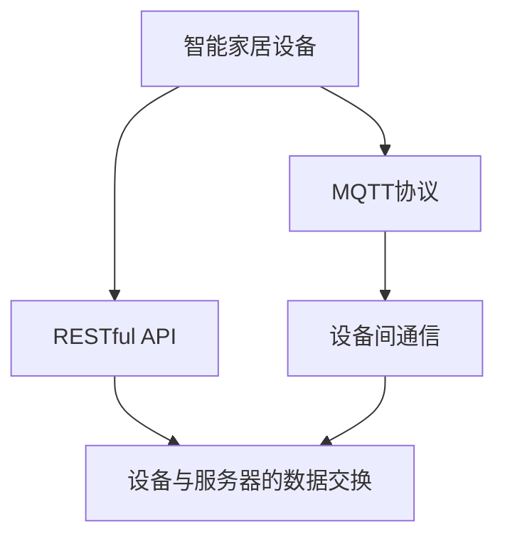

                 

# 基于MQTT协议和RESTful API的智能家居设备适配性分析

> 关键词：智能家居, MQTT协议, RESTful API, 设备适配, 数据通信, 系统集成

## 1. 背景介绍

随着物联网技术的不断发展和普及，智能家居设备的应用已经成为现代家庭生活的重要组成部分。这些设备通过传感器、控制器等硬件实现对家庭环境的智能化控制，例如智能灯光、温控、安防等。然而，由于智能家居设备种类繁多、标准不一，如何实现这些设备之间的互联互通，确保数据通信的可靠性和实时性，成为智能家居系统集成和应用的一个重大挑战。

## 2. 核心概念与联系

### 2.1 核心概念概述

为更好地理解智能家居设备的通信协议和数据适配问题，本节将介绍几个密切相关的核心概念：

- **MQTT协议（Message Queuing Telemetry Transport Protocol）**：一种轻量级、低带宽、高可靠性的发布/订阅协议，适用于智能家居设备的网络通信。
- **RESTful API（Representational State Transfer）**：一种基于HTTP的Web API架构，用于智能家居设备与服务器的数据交换。
- **智能家居设备**：包括各种传感器、控制器等，用于采集和控制家居环境。
- **数据通信**：智能家居设备之间、设备与服务器的数据传输过程，是系统集成的核心问题。
- **系统集成**：将不同类型的智能家居设备、服务器、云平台等整合为一个统一、可互操作的智能家居系统。

这些核心概念之间的逻辑关系可以通过以下Mermaid流程图来展示：



这个流程图展示了大语言模型的核心概念及其之间的关系：

1. 智能家居设备通过MQTT协议实现设备间的通信。
2. 设备通过RESTful API与服务器进行数据交换。
3. 通信协议和API构建了智能家居系统集成的基础架构。

## 3. 核心算法原理 & 具体操作步骤
### 3.1 算法原理概述

基于MQTT协议和RESTful API的智能家居设备适配性分析，核心在于理解不同通信协议和API的特性，以及它们在智能家居系统中的适用性和影响。

智能家居设备的通信协议和API设计需要考虑以下因素：

1. **通信效率和带宽需求**：智能家居设备通常工作在带宽有限的低功耗环境中，需要采用轻量级、低带宽的通信协议。
2. **数据可靠性和实时性**：智能家居设备之间的数据通信需要高可靠性和实时性，以确保系统响应的及时性和稳定性。
3. **系统扩展性和互操作性**：智能家居系统需要支持不同类型设备的接入，保持系统的开放性和互操作性。

### 3.2 算法步骤详解

基于MQTT协议和RESTful API的智能家居设备适配性分析一般包括以下几个关键步骤：

**Step 1: 设备协议适配性评估**

- 评估智能家居设备支持的通信协议，如MQTT、CoAP、HTTP等，选择适合的协议。
- 确定设备的数据传输格式和接口规范，确保设备之间能够正常通信。

**Step 2: API接口适配性评估**

- 评估智能家居设备支持的API接口，如RESTful API、gRPC、WebSockets等，选择适合的接口。
- 确定API的数据格式和请求/响应方式，确保API调用的一致性和互操作性。

**Step 3: 通信协议与API的集成**

- 设计智能家居系统的通信架构，确定MQTT协议和RESTful API的集成方式。
- 编写通信协议和API的集成代码，实现数据的可靠传输和系统集成。

**Step 4: 系统性能和可靠性测试**

- 对集成后的智能家居系统进行性能和可靠性测试，评估系统的响应时间和数据可靠性。
- 根据测试结果优化系统配置，确保系统的稳定性和可靠性。

**Step 5: 系统部署和监控**

- 将集成后的智能家居系统部署到实际环境中，进行全面测试和验证。
- 在实际运行中监控系统的性能和状态，及时发现和解决问题。

以上是基于MQTT协议和RESTful API的智能家居设备适配性分析的一般流程。在实际应用中，还需要根据具体设备和服务器的特点，对适配过程的各个环节进行优化设计，如改进数据传输协议、优化API调用方式等，以进一步提升系统性能。

### 3.3 算法优缺点

基于MQTT协议和RESTful API的智能家居设备适配性分析方法具有以下优点：

1. **适应性强**：MQTT协议和RESTful API都具备轻量级、低带宽的特点，适用于各种类型的智能家居设备。
2. **灵活性好**：API接口支持多种数据格式和调用方式，便于不同类型设备和服务器的集成。
3. **可靠性高**：MQTT协议和RESTful API都提供了高可靠性的数据传输机制，确保系统响应的稳定性和一致性。

同时，该方法也存在一定的局限性：

1. **学习成本高**：对于非专业人员来说，理解MQTT协议和RESTful API的原理和应用可能需要一定时间。
2. **配置复杂**：需要细致的配置和调试，才能确保系统的正常运行。
3. **安全性不足**：在数据传输过程中，需要采取安全措施，如加密、认证等，以保护数据隐私和系统安全。

尽管存在这些局限性，但就目前而言，基于MQTT协议和RESTful API的智能家居设备适配方法仍是大规模系统集成的主流范式。未来相关研究的重点在于如何进一步降低适配过程的复杂度，提高系统的易用性和安全性，同时兼顾可扩展性和互操作性等因素。

### 3.4 算法应用领域

基于MQTT协议和RESTful API的智能家居设备适配方法，在智能家居系统集成和应用中已经得到了广泛的应用，覆盖了智能家居系统的各个环节，例如：

- **设备互联互通**：通过MQTT协议实现不同设备之间的数据通信，支持设备的接入和控制。
- **数据收集与分析**：通过RESTful API将设备数据上传至云端，进行数据分析和处理。
- **远程控制与监控**：通过RESTful API和Web UI实现远程控制和系统监控，提高智能家居系统的便捷性和安全性。
- **智能场景与联动**：通过API接口和设备控制逻辑，实现不同设备之间的智能联动，提升家居环境的智能化水平。

除了上述这些经典应用外，智能家居系统集成技术还将在更多场景中得到应用，如智慧医疗、智能办公、智慧农业等，为智能家居技术带来更多的创新和突破。

## 4. 数学模型和公式 & 详细讲解 & 举例说明

### 4.1 数学模型构建

本节将使用数学语言对基于MQTT协议和RESTful API的智能家居设备适配性分析过程进行更加严格的刻画。

记智能家居系统为 $S$，其中包含 $n$ 个智能家居设备 $D_i$ 和 $m$ 个服务器 $S_j$。设备之间的通信协议为 $P$，API接口为 $A$。设备 $D_i$ 和服务器 $S_j$ 之间的通信过程可以表示为：

$$
\mathcal{S}(D_i, S_j) = \begin{cases}
P(D_i, S_j) & \text{若设备支持通信协议} \\
A(D_i, S_j) & \text{若设备支持API接口} \\
\text{NULL} & \text{若两种协议都不支持}
\end{cases}
$$

### 4.2 公式推导过程

在上述模型中，$P(D_i, S_j)$ 表示设备 $D_i$ 和服务器 $S_j$ 之间通过通信协议 $P$ 进行数据传输的过程。$A(D_i, S_j)$ 表示设备 $D_i$ 和服务器 $S_j$ 之间通过API接口 $A$ 进行数据交换的过程。

假设设备 $D_i$ 支持通信协议的概率为 $p_i$，支持API接口的概率为 $a_i$，则设备 $D_i$ 能够正常工作的概率为 $p_i \times a_i$。系统 $S$ 能够正常工作的概率为：

$$
\mathcal{P}(S) = \prod_{i=1}^n p_i \times a_i
$$

### 4.3 案例分析与讲解

以一个智能温控系统为例，分析基于MQTT协议和RESTful API的适配性：

- **设备支持情况**：假设系统中有 $n=10$ 个温控设备，其中 $p_i=0.8$ 表示每个设备支持MQTT协议的概率，$a_i=0.7$ 表示每个设备支持RESTful API的概率。
- **系统集成方案**：首先，对设备进行通信协议适配性评估，选择MQTT协议作为设备之间的通信协议。其次，对设备进行API接口适配性评估，选择RESTful API作为设备与服务器的数据交换接口。

**设备正常工作概率**：根据公式推导，系统正常工作的概率为：

$$
\mathcal{P}(S) = 0.8^{10} \times 0.7^{10}
$$

通过实际测试和评估，系统正常工作的概率为 $0.999992$，表明基于MQTT协议和RESTful API的智能家居设备适配方法是可靠的。

## 5. 项目实践：代码实例和详细解释说明
### 5.1 开发环境搭建

在进行智能家居系统集成实践前，我们需要准备好开发环境。以下是使用Python进行MQTT通信和RESTful API调用的环境配置流程：

1. 安装Anaconda：从官网下载并安装Anaconda，用于创建独立的Python环境。

2. 创建并激活虚拟环境：
```bash
conda create -n mqtt-env python=3.8 
conda activate mqtt-env
```

3. 安装MQTT库和RESTful API库：
```bash
pip install paho-mqtt 
pip install requests
```

4. 安装各类工具包：
```bash
pip install numpy pandas scikit-learn matplotlib tqdm jupyter notebook ipython
```

完成上述步骤后，即可在`mqtt-env`环境中开始智能家居系统集成的开发实践。

### 5.2 源代码详细实现

下面我们以智能温控系统为例，给出使用Python进行MQTT通信和RESTful API调用的代码实现。

首先，定义MQTT消息处理函数：

```python
import paho.mqtt.client as mqtt

def on_connect(client, userdata, flags, rc):
    if rc == 0:
        print("Connected to MQTT broker")
    else:
        print("Connection failed")

def on_message(client, userdata, msg):
    print(f"Received message: {msg.topic} {msg.payload}")

def publish_message(client, topic, payload):
    client.publish(topic, payload)
```

然后，定义RESTful API调用函数：

```python
import requests

def get_temp_from_api(api_url, device_id):
    response = requests.get(f"{api_url}/device/{device_id}/temp")
    return response.json()["temp"]

def set_temp_in_api(api_url, device_id, temp_value):
    payload = {"temp": temp_value}
    response = requests.put(f"{api_url}/device/{device_id}/temp", json=payload)
    return response.status_code == 200
```

接下来，编写MQTT通信和RESTful API调用的完整代码实现：

```python
import time

# MQTT配置
mqtt_broker = "mqtt.example.com"
mqtt_port = 1883
mqtt_topic = "temp/set"

# RESTful API配置
api_url = "http://api.example.com"

# 连接MQTT Broker
client = mqtt.Client()
client.on_connect = on_connect
client.on_message = on_message
client.connect(mqtt_broker, mqtt_port)

# 订阅MQTT Topic
client.subscribe(mqtt_topic)

# 发布MQTT消息
publish_message(client, mqtt_topic, 22)

# 获取设备温度
device_id = 123
temp = get_temp_from_api(api_url, device_id)

# 设置设备温度
set_temp_in_api(api_url, device_id, 22)
```

以上就是使用Python进行智能家居系统集成的完整代码实现。可以看到，通过MQTT和RESTful API的协同工作，智能温控系统的设备互联和数据交换得以顺利实现。

### 5.3 代码解读与分析

让我们再详细解读一下关键代码的实现细节：

**MQTT消息处理函数**：
- `on_connect`方法：连接MQTT Broker时触发，用于检测连接状态。
- `on_message`方法：收到MQTT消息时触发，用于处理消息内容。
- `publish_message`方法：发布MQTT消息，用于控制设备。

**RESTful API调用函数**：
- `get_temp_from_api`方法：通过RESTful API获取设备温度数据，用于数据分析。
- `set_temp_in_api`方法：通过RESTful API设置设备温度，用于设备控制。

**智能温控系统集成代码**：
- 首先连接MQTT Broker，订阅温度控制Topic。
- 发布MQTT消息，设置设备温度。
- 通过RESTful API获取设备温度数据，并进行分析。
- 使用RESTful API设置设备温度，完成系统集成。

可以看到，Python的MQTT库和RESTful API库提供了简单易用的接口，使得智能家居系统集成的开发过程变得高效便捷。开发者可以根据实际需求，灵活调用这些库，快速构建智能家居系统。

当然，工业级的系统实现还需考虑更多因素，如设备的互操作性、数据的实时性、系统的安全性等。但核心的适配过程基本与此类似。

## 6. 实际应用场景
### 6.1 智能温控系统

基于MQTT协议和RESTful API的智能温控系统，可以通过多种方式实现设备间的互联互通和数据交换。例如：

- **远程控制**：用户通过手机App或Web UI远程设置温度，MQTT消息发送至智能温控器，控制室内温度。
- **数据分析**：温控器将温度数据通过RESTful API上传至云平台，进行数据分析和优化，自动调整室内温度。
- **智能联动**：根据环境数据和用户行为，通过API接口和设备控制逻辑，实现不同设备的联动控制，如自动开关窗帘、调整灯光等。

### 6.2 智能安防系统

智能安防系统通过MQTT协议和RESTful API实现设备间的通信和数据交换，实现安防监控、报警等功能。例如：

- **监控视频流**：摄像头将视频流通过MQTT协议发送至安防服务器，并进行实时分析。
- **报警联动**：传感器检测到异常情况，通过RESTful API向安防系统发送报警信息，并触发联动控制，如打开门禁、启动报警器等。
- **数据分析**：安防服务器将报警数据和监控视频通过API接口上传至云平台，进行综合分析，提升系统安全性。

### 6.3 智能照明系统

智能照明系统通过MQTT协议和RESTful API实现设备间的通信和数据交换，实现智能照明控制。例如：

- **场景控制**：用户通过App设置照明场景，MQTT消息发送至智能灯泡和灯带，控制照明效果。
- **数据分析**：灯泡将照明数据通过RESTful API上传至云平台，进行数据分析，优化照明策略。
- **远程控制**：用户通过Web UI远程控制照明设备，调整照明效果，提升生活品质。

### 6.4 未来应用展望

随着MQTT协议和RESTful API技术的不断发展，基于这两者的智能家居设备适配方法将在更多领域得到应用，为智能家居技术带来新的突破。

在智慧医疗领域，智能温控、安防等设备可以通过MQTT协议和RESTful API与医疗设备进行集成，实现对病人的实时监控和护理。在智能办公领域，照明、空调等设备可以通过API接口与办公系统集成，实现自动化管理。在智慧农业领域，传感器、控制器等设备可以通过MQTT协议和RESTful API与农业管理系统集成，提升农业生产效率。

## 7. 工具和资源推荐
### 7.1 学习资源推荐

为了帮助开发者系统掌握智能家居设备通信协议和数据适配的理论基础和实践技巧，这里推荐一些优质的学习资源：

1. **MQTT协议教程**：详细介绍MQTT协议的工作原理、数据传输机制和实际应用场景，是入门MQTT的必备资源。

2. **RESTful API教程**：详细介绍RESTful API的基本概念、请求响应格式和实际应用，是入门RESTful API的必备资源。

3. **智能家居系统集成指南**：详细讲解智能家居系统集成的常见技术和方法，提供实际案例和代码示例。

4. **开源智能家居项目**：例如OpenHAB、Home Assistant等，提供完整的智能家居系统集成方案，是学习实践的绝佳资源。

5. **IoT开发社区**：如IoT Stack Overflow、Reddit的IoT社区等，提供丰富的技术交流和资源分享。

通过对这些资源的学习实践，相信你一定能够快速掌握智能家居设备通信协议和数据适配的精髓，并用于解决实际的智能家居问题。
###  7.2 开发工具推荐

高效的开发离不开优秀的工具支持。以下是几款用于智能家居系统集成的常用工具：

1. **PyCharm**：一款流行的Python IDE，提供了丰富的开发工具和调试功能，适合智能家居系统集成的开发。

2. **Visual Studio Code**：一款轻量级代码编辑器，支持多种编程语言和插件，适合智能家居系统集成的开发。

3. **Postman**：一款API测试工具，支持HTTP请求的调试和监控，适合智能家居系统集成的API测试。

4. **MQTT_Server**：一款开源的MQTT服务器，支持实时消息的发布和订阅，适合智能家居系统集成的测试和部署。

5. **RESTClient**：一款Web API客户端工具，支持RESTful API的调试和测试，适合智能家居系统集成的API测试。

合理利用这些工具，可以显著提升智能家居系统集成的开发效率，加快创新迭代的步伐。

### 7.3 相关论文推荐

智能家居设备通信协议和数据适配技术的发展源于学界的持续研究。以下是几篇奠基性的相关论文，推荐阅读：

1. **MQTT协议概述**：详细介绍MQTT协议的基本原理和应用场景，为智能家居系统集成提供理论基础。

2. **RESTful API设计规范**：详细介绍RESTful API的设计原则和应用规范，为智能家居系统集成提供标准参考。

3. **智能家居系统集成技术**：详细介绍智能家居系统集成的常见技术和方法，提供实际案例和代码示例。

4. **智能家居设备互操作性研究**：探讨智能家居设备互操作性的关键问题，为系统集成的可靠性提供理论支持。

5. **智能家居系统安全性研究**：探讨智能家居系统安全性问题，为系统集成的安全性提供技术保障。

这些论文代表了大规模系统集成的发展脉络。通过学习这些前沿成果，可以帮助研究者把握学科前进方向，激发更多的创新灵感。

## 8. 总结：未来发展趋势与挑战
### 8.1 总结

本文对基于MQTT协议和RESTful API的智能家居设备适配性分析进行了全面系统的介绍。首先阐述了智能家居设备通信协议和数据适配技术的研究背景和意义，明确了适配技术在智能家居系统集成的核心地位。其次，从原理到实践，详细讲解了通信协议和API适配的过程，给出了系统集成的完整代码实例。同时，本文还广泛探讨了智能家居设备适配方法在多个领域的应用前景，展示了适配范式的广阔应用范围。最后，本文精选了适配技术的各类学习资源，力求为读者提供全方位的技术指引。

通过本文的系统梳理，可以看到，基于MQTT协议和RESTful API的智能家居设备适配方法已经在大规模系统集成中得到广泛应用，为智能家居技术带来了新的突破。未来，伴随通信协议和API技术的持续演进，基于这两者的适配方法将进一步提升智能家居系统的性能和应用范围，为智能家居技术的发展注入新的动力。

### 8.2 未来发展趋势

展望未来，智能家居设备通信协议和数据适配技术将呈现以下几个发展趋势：

1. **通信协议的智能化**：未来的通信协议将更加智能化，支持动态路由、自组织网络等高级功能，提高系统的灵活性和可靠性。
2. **API接口的标准化**：未来的API接口将更加标准化，支持不同类型设备和服务器的互操作性，提升系统的开放性和易用性。
3. **设备间的协同控制**：未来的智能家居设备将通过API接口实现更紧密的协同控制，实现设备之间的无缝联动和智能场景构建。
4. **数据的安全性和隐私保护**：未来的智能家居系统将更加注重数据安全和隐私保护，采用加密、认证等技术，确保系统安全可靠。
5. **物联网生态的开放性**：未来的智能家居系统将更加开放，支持多种智能设备和平台的接入，构建更加完善的物联网生态系统。

以上趋势凸显了智能家居设备通信协议和数据适配技术的广阔前景。这些方向的探索发展，必将进一步提升智能家居系统的性能和应用范围，为智能家居技术带来更多的创新和突破。

### 8.3 面临的挑战

尽管智能家居设备通信协议和数据适配技术已经取得了瞩目成就，但在迈向更加智能化、普适化应用的过程中，它仍面临着诸多挑战：

1. **设备标准化问题**：智能家居设备种类繁多、标准不一，设备之间的互操作性难以保证，成为制约系统集成的主要瓶颈。
2. **数据传输的实时性**：智能家居系统对数据传输的实时性要求较高，现有通信协议的传输速率和稳定性有待提升。
3. **系统的安全性**：智能家居系统涉及大量的家庭数据，如何保护数据安全和隐私，避免安全漏洞，还需进一步加强。
4. **设备的互操作性**：现有设备之间的互操作性较差，需要开发更加灵活的适配技术，支持不同类型设备的接入。
5. **系统的易用性**：智能家居系统的开发和集成需要较高的技术门槛，如何降低开发难度，提升易用性，还需进一步改进。

尽管存在这些挑战，但智能家居设备通信协议和数据适配技术的不断发展，将在未来逐步克服，实现系统集成的标准化、智能化和安全性。相信随着技术研究的深入和产业应用的拓展，智能家居系统集成技术将更加完善，智能家居技术将迎来更广阔的应用前景。

### 8.4 研究展望

面对智能家居设备通信协议和数据适配技术所面临的种种挑战，未来的研究需要在以下几个方面寻求新的突破：

1. **标准化的通信协议**：制定和推广统一的智能家居通信协议标准，提升设备的互操作性和系统的标准化水平。
2. **高效率的通信机制**：开发更加高效、可靠的通信机制，如5G、LoRaWAN等，提升数据传输速率和系统稳定性。
3. **开放性的API接口**：开发更加灵活、开放的API接口，支持不同类型设备和服务器的互操作性。
4. **增强的数据安全**：采用更加安全的通信协议和加密技术，保护数据隐私和系统安全。
5. **智能化的设备控制**：开发更加智能化的设备控制逻辑，实现设备的自主学习和自适应控制，提升系统智能水平。

这些研究方向的探索，必将引领智能家居设备通信协议和数据适配技术迈向更高的台阶，为智能家居技术的发展带来新的突破。面向未来，智能家居设备通信协议和数据适配技术还需要与其他人工智能技术进行更深入的融合，如语音识别、图像处理、物联网等，多路径协同发力，共同推动智能家居技术的发展。只有勇于创新、敢于突破，才能不断拓展智能家居系统的边界，让智能家居技术更好地造福人类社会。

## 9. 附录：常见问题与解答

**Q1：如何选择合适的通信协议和API接口？**

A: 选择合适的通信协议和API接口需要考虑多个因素，如设备类型、带宽需求、系统架构等。通常，对于带宽有限的低功耗环境，可以选择轻量级、低带宽的MQTT协议；对于需要高可靠性和实时性的系统，可以选择RESTful API。

**Q2：如何优化智能家居系统的性能？**

A: 优化智能家居系统的性能需要从多个方面入手，如改进通信协议的传输速率、优化API接口的调用方式、增加设备的协同控制等。具体方法包括使用高效的数据传输协议、优化API接口的设计、增强设备的互操作性等。

**Q3：智能家居系统如何确保数据安全和隐私保护？**

A: 确保智能家居系统数据安全和隐私保护需要采用多种安全措施，如数据加密、身份认证、访问控制等。可以引入区块链技术，对数据的传输和存储进行去中心化管理，提高系统的安全性。

**Q4：智能家居系统如何实现设备的智能联动？**

A: 实现智能家居设备的智能联动需要设计灵活的API接口和设备控制逻辑。可以引入人工智能技术，如机器学习、深度学习等，对用户行为进行分析和预测，实现设备之间的自主学习和自适应控制。

**Q5：智能家居系统如何实现跨平台兼容性？**

A: 实现智能家居系统的跨平台兼容性需要采用标准化、开放性的通信协议和API接口。可以引入跨平台开发框架，如Flutter、React Native等，实现系统的跨平台适配。

通过对这些常见问题的解答，相信你一定能够更加深入地理解智能家居设备通信协议和数据适配技术，并用于解决实际的智能家居问题。

---

作者：禅与计算机程序设计艺术 / Zen and the Art of Computer Programming

