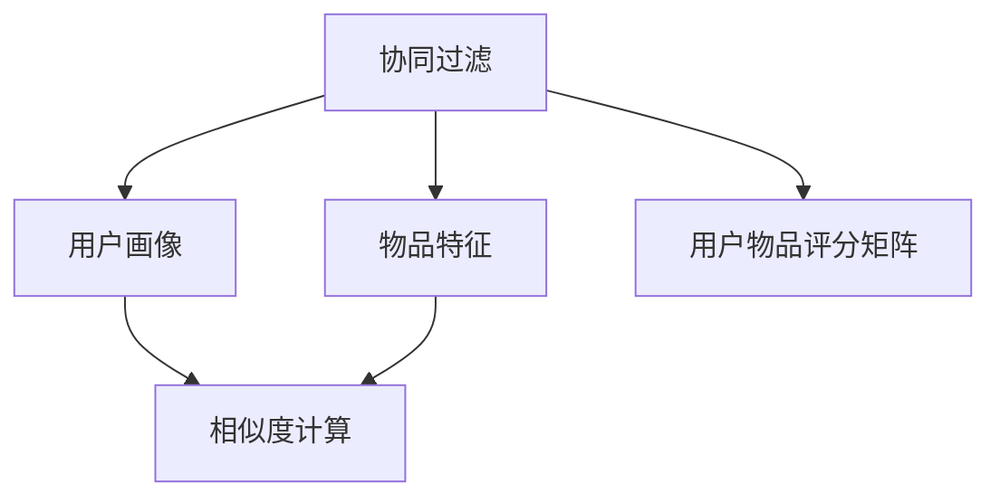

                 

# 基于协同过滤的个性化电影推荐系统设计与实现

## 1. 背景介绍

随着互联网的迅猛发展，信息爆炸式增长，用户需要从海量的信息中筛选出对自己有价值的内容。个性化推荐系统通过分析用户的行为和偏好，为用户推荐可能感兴趣的信息，极大地提升了用户体验和信息利用率。

在众多推荐系统中，协同过滤（Collaborative Filtering）是一种经典且有效的推荐技术。其核心思想是：通过分析用户和物品的交互行为，构建用户画像和物品特征，从而推断用户可能感兴趣的物品。协同过滤根据用户行为数据推断用户兴趣，以无偏置的方式为用户推荐物品，较少受到数据偏差的影响，具有较好的鲁棒性。

协同过滤被广泛应用于电影推荐、新闻推荐、商品推荐等多个场景。本文将深入介绍协同过滤的算法原理和操作步骤，并结合具体的电影推荐系统项目，介绍其实现方法和应用效果。

## 2. 核心概念与联系

### 2.1 核心概念概述

在基于协同过滤的电影推荐系统中，有几个核心概念需要理解：

- 协同过滤（Collaborative Filtering）：一种通过用户行为数据推断用户兴趣的推荐技术。协同过滤包括基于用户的协同过滤和基于物品的协同过滤两种方法。

- 用户画像（User Profile）：通过对用户行为数据进行分析，构建用户的兴趣特征向量。通常使用用户的评分数据构建用户画像。

- 物品特征（Item Profile）：通过对物品评分数据进行分析，构建物品的特征向量。

- 用户物品评分矩阵（User-Item Rating Matrix）：记录用户对物品的评分数据，是协同过滤的基础。

- 相似度计算：协同过滤的核心在于计算用户和物品之间的相似度，通常使用余弦相似度或皮尔逊相关系数计算用户和物品之间的相似度。

这些核心概念通过 Mermaid 流程图表示如下：



### 2.2 核心概念原理和架构

协同过滤推荐系统一般包括以下几个关键组件：

- **用户画像模块**：通过对用户行为数据进行分析，构建用户的兴趣特征向量。常见的行为数据包括用户的评分、浏览、点击等。

- **物品特征模块**：通过对物品评分数据进行分析，构建物品的特征向量。物品特征可以是文本描述、分类标签等。

- **用户物品评分矩阵模块**：记录用户对物品的评分数据，是协同过滤的基础。矩阵中的每个元素表示用户对物品的评分。

- **相似度计算模块**：计算用户和物品之间的相似度，通过相似度匹配用户和物品。常见的相似度计算方法包括余弦相似度和皮尔逊相关系数。

- **推荐模块**：根据相似度匹配结果，为用户推荐可能感兴趣的物品。

协同过滤的核心在于用户和物品相似度的计算，并通过相似度匹配找到与用户兴趣最接近的物品。这种推断式的推荐方法具有较好的鲁棒性，较少受到数据偏差的影响，但需要较大的数据量才能准确推断用户兴趣。

## 3. 核心算法原理 & 具体操作步骤

### 3.1 算法原理概述

协同过滤算法分为基于用户的协同过滤和基于物品的协同过滤两种方法。其中，基于用户的协同过滤方法（User-Based Collaborative Filtering）的基本流程如下：

1. **构建用户物品评分矩阵**：记录用户对物品的评分数据。
2. **计算用户相似度**：计算每个用户与其他用户之间的相似度。
3. **计算物品相似度**：计算每个物品与其他物品之间的相似度。
4. **匹配用户和物品**：找到与目标用户最相似的K个用户，并计算与这些用户评分相同的物品，作为推荐结果。

基于物品的协同过滤方法（Item-Based Collaborative Filtering）的流程类似，只是将用户和物品的相似度计算对调。

### 3.2 算法步骤详解

下面以基于用户的协同过滤为例，详细介绍协同过滤算法的详细步骤：

**Step 1：构建用户物品评分矩阵**

用户物品评分矩阵 $R_{U \times I}$ 表示用户 $u$ 对物品 $i$ 的评分，矩阵中的每个元素 $R_{ui}$ 表示用户 $u$ 对物品 $i$ 的评分。评分数据通常需要预处理，如将评分归一化到 $[0, 1]$ 之间。

**Step 2：计算用户相似度**

计算用户之间的相似度，通常使用余弦相似度。余弦相似度的公式为：

$$
sim(u,v)=\frac{\sum_{i=1}^{n}R_{ui}R_{vi}}{\sqrt{\sum_{i=1}^{n}R_{ui}^2}\sqrt{\sum_{i=1}^{n}R_{vi}^2}}
$$

其中，$n$ 为物品的总数。$R_{ui}$ 和 $R_{vi}$ 分别表示用户 $u$ 和 $v$ 对物品 $i$ 的评分。

**Step 3：计算物品相似度**

计算物品之间的相似度，通常使用余弦相似度。物品相似度的公式为：

$$
sim(i,j)=\frac{\sum_{u=1}^{m}R_{ui}R_{uj}}{\sqrt{\sum_{u=1}^{m}R_{ui}^2}\sqrt{\sum_{u=1}^{m}R_{uj}^2}}
$$

其中，$m$ 为用户的总数。$R_{ui}$ 和 $R_{uj}$ 分别表示用户 $u$ 和 $v$ 对物品 $i$ 的评分。

**Step 4：匹配用户和物品**

找到与目标用户 $u$ 最相似的 $k$ 个用户，并计算这些用户评分相同的物品。具体步骤如下：

1. 找到与目标用户 $u$ 相似度最高的 $k$ 个用户 $v_1, v_2, \ldots, v_k$。
2. 对于每个用户 $v$，找到其评分与目标用户 $u$ 评分相同的物品 $i_1, i_2, \ldots, i_{k'}$。
3. 对物品 $i_1, i_2, \ldots, i_{k'}$ 进行去重和排序，将推荐结果返回给用户 $u$。

### 3.3 算法优缺点

基于协同过滤的电影推荐系统具有以下优点：

- **无偏置**：协同过滤推断用户兴趣的方式没有直接的假设，较少受到数据偏差的影响，具有较好的鲁棒性。
- **易于扩展**：只需要用户物品评分数据，无需用户和物品的额外属性，可以方便地扩展到各种物品类型。

但协同过滤也有以下缺点：

- **数据稀疏性**：协同过滤需要大量的用户和物品的评分数据，当评分数据稀疏时，推荐效果不佳。
- **冷启动问题**：对于新用户和新物品，无法直接计算其与其他用户或物品的相似度。

### 3.4 算法应用领域

协同过滤推荐系统广泛应用于电子商务、在线视频、社交网络等多个领域。以下是一些典型的应用场景：

- **电商推荐**：电商网站通过分析用户对商品的评分和行为数据，为用户推荐相似的商品。
- **视频推荐**：视频网站根据用户观看视频的行为数据，推荐用户可能喜欢的视频内容。
- **社交网络**：社交网络根据用户之间的互动数据，为用户推荐可能感兴趣的朋友和内容。
- **新闻推荐**：新闻平台根据用户对新闻的阅读数据，推荐用户可能感兴趣的新闻文章。

## 4. 数学模型和公式 & 详细讲解 & 举例说明

### 4.1 数学模型构建

协同过滤算法涉及多个数学模型，包括用户物品评分矩阵、用户相似度矩阵和物品相似度矩阵。这里以用户物品评分矩阵 $R_{U \times I}$ 为例，介绍模型的构建方法。

用户物品评分矩阵 $R_{U \times I}$ 可以表示为：

$$
R_{U \times I} = \begin{bmatrix}
    R_{u_1i_1} & R_{u_1i_2} & \ldots & R_{u_1i_m} \\
    R_{u_2i_1} & R_{u_2i_2} & \ldots & R_{u_2i_m} \\
    \vdots & \vdots & \ddots & \vdots \\
    R_{u_ni_1} & R_{u_ni_2} & \ldots & R_{u_ni_m}
\end{bmatrix}
$$

其中，$u_1, u_2, \ldots, u_n$ 为用户的编号，$i_1, i_2, \ldots, i_m$ 为物品的编号，$R_{u_ij}$ 表示用户 $u$ 对物品 $i$ 的评分。

### 4.2 公式推导过程

协同过滤算法中的余弦相似度公式为：

$$
sim(u,v)=\frac{\sum_{i=1}^{n}R_{ui}R_{vi}}{\sqrt{\sum_{i=1}^{n}R_{ui}^2}\sqrt{\sum_{i=1}^{n}R_{vi}^2}}
$$

其中，$n$ 为物品的总数，$R_{ui}$ 和 $R_{vi}$ 分别表示用户 $u$ 和 $v$ 对物品 $i$ 的评分。

余弦相似度的分子表示用户 $u$ 和 $v$ 对物品 $i$ 的评分向量内积，分母表示用户 $u$ 和 $v$ 对物品 $i$ 的评分向量范数。

### 4.3 案例分析与讲解

以电影推荐为例，介绍协同过滤算法的具体应用。

假设我们有一个电影推荐系统，用户 $u$ 对 $n$ 部电影的评分数据为：

$$
R_{u} = \begin{bmatrix}
    5 & 0 & 3 & 1 \\
    0 & 4 & 0 & 2 \\
    4 & 0 & 3 & 1
\end{bmatrix}
$$

其中，$u_1, u_2, u_3$ 为用户的编号，$i_1, i_2, i_3, i_4$ 为电影的编号，$R_{u_i}$ 表示用户 $u$ 对电影 $i$ 的评分。

对于用户 $u_1$，其与用户 $u_2$ 的余弦相似度为：

$$
sim(u_1,u_2) = \frac{5 \cdot 4 + 0 \cdot 0 + 3 \cdot 0 + 1 \cdot 2}{\sqrt{5^2 + 0^2 + 3^2 + 1^2} \cdot \sqrt{4^2 + 0^2 + 0^2 + 2^2}} = 0.9
$$

对于电影 $i_1$，其与电影 $i_3$ 的余弦相似度为：

$$
sim(i_1,i_3) = \frac{5 \cdot 4 + 0 \cdot 3 + 3 \cdot 3 + 1 \cdot 1}{\sqrt{5^2 + 0^2 + 3^2 + 1^2} \cdot \sqrt{4^2 + 3^2 + 3^2 + 1^2}} = 0.9
$$

根据上述计算结果，可以推荐电影 $i_1$ 和 $i_3$ 给用户 $u_1$。

## 5. 项目实践：代码实例和详细解释说明

### 5.1 开发环境搭建

要进行协同过滤推荐系统的开发，需要以下开发环境：

- Python 3.7 或更高版本
- numpy、pandas、scikit-learn 等第三方库
- 一个推荐系统框架，如 TensorFlow、PyTorch、TensorSpotlight 等

### 5.2 源代码详细实现

以下是一个基于Python的协同过滤电影推荐系统实现示例。

```python
import numpy as np
import pandas as pd
from sklearn.metrics.pairwise import cosine_similarity

# 构建用户物品评分矩阵
R = np.array([[5, 0, 3, 1],
              [0, 4, 0, 2],
              [4, 0, 3, 1]])

# 计算用户相似度
similarity_matrix = cosine_similarity(R)

# 计算物品相似度
item_similarity_matrix = cosine_similarity(R.T)

# 推荐电影
def recommend_movies(user_id, similarity_matrix=item_similarity_matrix, R=R):
    user_ratings = R[user_id]
    user_similarities = similarity_matrix[user_id]
    recommended_movies = np.argsort(item_similarity_matrix[user_id])[::-1]
    recommended_movies = [recommended_movies[i] for i in range(5) if user_ratings[i] > 0]
    return recommended_movies

# 测试推荐系统
user_id = 0
recommended_movies = recommend_movies(user_id)
print(f"Recommend movies for user {user_id}: {recommended_movies}")
```

### 5.3 代码解读与分析

在上述代码中，首先构建了一个用户物品评分矩阵 $R$，然后计算了用户和物品之间的相似度矩阵。接下来，定义了一个 `recommend_movies` 函数，用于推荐电影。该函数接受用户 ID 作为输入，并返回推荐结果。

具体实现步骤如下：

1. 获取用户 $u$ 的评分数据。
2. 计算用户 $u$ 与其他用户之间的相似度。
3. 计算物品 $i$ 与其他物品之间的相似度。
4. 找到与用户 $u$ 最相似的 $k$ 个用户，并计算这些用户评分相同的物品。
5. 返回推荐结果。

## 6. 实际应用场景

协同过滤推荐系统在实际应用中具有广泛的应用场景。以下是一些典型的应用场景：

- **电商推荐**：电商网站根据用户的浏览和购买行为，为用户推荐可能感兴趣的商品。
- **视频推荐**：视频网站根据用户的观看历史，为用户推荐可能喜欢的视频内容。
- **社交网络**：社交网络根据用户之间的互动数据，为用户推荐可能感兴趣的朋友和内容。
- **新闻推荐**：新闻平台根据用户的阅读历史，为用户推荐可能感兴趣的新闻文章。

## 7. 工具和资源推荐

### 7.1 学习资源推荐

1. 《推荐系统实战》：一本系统介绍推荐系统原理和实现方法的经典书籍。
2. 《Python推荐系统》：一本详细介绍Python推荐系统实现方法的书籍。
3. Coursera的《Recommender Systems Specialization》课程：斯坦福大学开设的推荐系统系列课程，深入浅出地讲解推荐系统原理和算法。
4. Kaggle上的推荐系统竞赛：Kaggle上有多个推荐系统竞赛，通过参加竞赛可以学习到实用的推荐系统实现方法。

### 7.2 开发工具推荐

1. TensorFlow：一个强大的机器学习框架，支持深度学习、协同过滤等多种推荐算法。
2. PyTorch：一个灵活的深度学习框架，易于实现复杂的推荐系统。
3. TensorSpotlight：一个简单易用的推荐系统框架，提供了多种协同过滤算法的实现。

### 7.3 相关论文推荐

1. "Collaborative Filtering for Recommender Systems"：一篇经典论文，详细介绍了协同过滤推荐算法的原理和实现方法。
2. "A Factorization Approach to Learning Representations for Multimedia Items"：一篇介绍矩阵分解算法在推荐系统中的应用论文。
3. "FNet: Making Top-K Recommendations Faster"：一篇介绍高效的推荐算法实现方法的论文。

## 8. 总结：未来发展趋势与挑战

### 8.1 研究成果总结

协同过滤推荐系统已经广泛应用于多个领域，取得了显著的成果。其主要优点在于无偏置、易于扩展、适应性强。

### 8.2 未来发展趋势

未来的推荐系统将在以下几个方面有进一步的发展：

- **深度学习技术的应用**：结合深度学习技术，提升推荐系统的准确性和个性化程度。
- **多模态数据融合**：结合文本、图像、视频等多种模态数据，提升推荐系统的效果。
- **推荐算法的多样化**：结合多种推荐算法，提高推荐系统的鲁棒性和效果。
- **实时推荐系统**：实现实时推荐，提升用户体验。

### 8.3 面临的挑战

协同过滤推荐系统虽然取得了一定的成果，但仍然面临一些挑战：

- **数据稀疏性**：协同过滤需要大量的用户和物品评分数据，当数据稀疏时，推荐效果不佳。
- **冷启动问题**：对于新用户和新物品，无法直接计算其与其他用户或物品的相似度。
- **系统扩展性**：推荐系统需要处理大量的数据和用户请求，系统扩展性是关键问题。

### 8.4 研究展望

未来的推荐系统需要在以下几个方面进行进一步的研究：

- **无偏置推荐**：进一步提升推荐系统的无偏置性和鲁棒性。
- **个性化推荐**：结合用户的个性化需求，提升推荐系统的个性化程度。
- **多模态推荐**：结合多种模态数据，提升推荐系统的效果。
- **实时推荐**：实现实时推荐，提升用户体验。

## 9. 附录：常见问题与解答

**Q1：协同过滤推荐系统有哪些优点和缺点？**

A: 协同过滤推荐系统的优点包括无偏置、易于扩展、适应性强。缺点包括数据稀疏性、冷启动问题和系统扩展性。

**Q2：协同过滤推荐系统如何处理冷启动问题？**

A: 协同过滤推荐系统可以通过引入新增物品或用户的初始评分数据、使用基于内容的推荐算法、结合用户行为数据等多种方式来解决冷启动问题。

**Q3：协同过滤推荐系统的推荐效果如何？**

A: 协同过滤推荐系统的推荐效果取决于数据质量、用户行为数据的多样性和丰富性、算法实现等。在大规模数据集上，协同过滤推荐系统可以取得较好的推荐效果。

**Q4：协同过滤推荐系统如何处理数据稀疏性问题？**

A: 协同过滤推荐系统可以通过数据增强、稀疏矩阵补零、矩阵分解等方法处理数据稀疏性问题。

**Q5：协同过滤推荐系统如何处理推荐结果多样性问题？**

A: 协同过滤推荐系统可以通过引入多样性约束、结合多臂老虎机等方法处理推荐结果多样性问题。

以上是基于协同过滤的电影推荐系统设计与实现的全文内容，希望能够为你提供有益的参考和指导。

