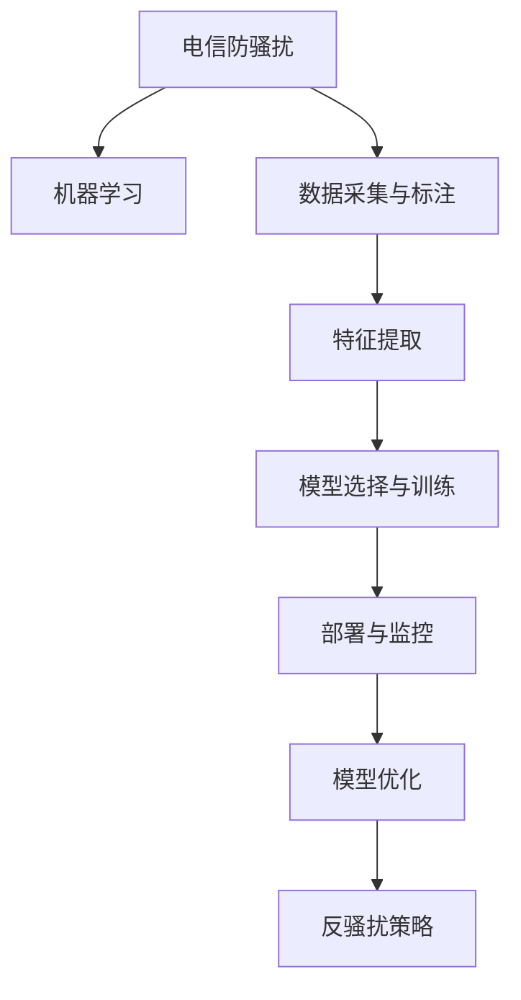

                 

# 基于机器学习的电信防骚扰模型设计与实现

## 1. 背景介绍

### 1.1 问题由来

随着智能手机的普及和移动互联网的快速发展，电信骚扰已经成为困扰用户的重要问题。常见的电信骚扰形式包括恶意短信、垃圾信息、电话推销等，严重影响了用户的工作生活体验。如何识别和过滤掉这些不受欢迎的电信骚扰，构建一个健康的通信环境，是电信运营商和广大用户共同关心的议题。

传统的电信防骚扰方法主要包括黑名單白名單过滤、基于规则的检测、人工审核等，这些方法往往难以应对新兴的骚扰形式，且无法处理复杂的语音信息。而机器学习技术的应用，为电信防骚扰提供了新的思路。

### 1.2 问题核心关键点

电信防骚扰的核心在于构建一个高效、准确的骚扰识别系统。其关键点包括：

1. **数据采集与标注**：收集和标注高质量的防骚扰数据是模型训练的基础。
2. **特征工程**：从原始数据中提取有意义的特征，提高模型识别能力。
3. **模型选择与训练**：选择合适的模型并对其进行训练，使其能够准确识别不同类型的骚扰。
4. **部署与监控**：将模型部署到生产环境中，并持续监控其性能，确保及时更新和调整。

这些关键点构成了一个完整的电信防骚扰系统设计流程，对模型的构建和应用具有指导意义。

## 2. 核心概念与联系

### 2.1 核心概念概述

为更好地理解基于机器学习的电信防骚扰模型，本节将介绍几个密切相关的核心概念：

- **机器学习**：通过算法让机器从数据中学习规律，进而实现自动化决策的科学技术。
- **电信骚扰识别**：指对短信、语音等通信内容进行自动识别，判断其是否属于骚扰的分类问题。
- **特征提取**：从原始数据中提取能够反映电信骚扰特征的信息，作为模型的输入。
- **监督学习**：利用已标注的训练数据，训练模型进行分类、回归等预测任务。
- **深度学习**：一种基于神经网络的机器学习技术，能够处理复杂的数据和模式，是电信防骚扰模型的主流选择。
- **卷积神经网络(CNN)**：擅长处理具有网格结构的数据，如文本和图像，广泛应用于图像分类、自然语言处理等任务。
- **循环神经网络(RNN)**：能够处理序列数据，适用于识别时间序列上的模式，如语音识别、序列预测等。
- **长短期记忆网络(LSTM)**：一种特殊的RNN，能够更好地捕捉序列数据中的长期依赖关系。
- **集成学习(Ensemble Learning)**：将多个模型的预测结果进行综合，提高整体性能和鲁棒性。

这些核心概念之间的逻辑关系可以通过以下Mermaid流程图来展示：



这个流程图展示了电信防骚扰系统设计的主要流程：

1. 采集和标注数据，构建训练集。
2. 提取特征，选择合适的模型，进行训练。
3. 将模型部署到实际环境中，进行实时监控和反馈。
4. 根据监控结果，对模型进行优化调整。
5. 综合多模型输出，形成反骚扰策略。

这些概念共同构成了电信防骚扰系统的设计与实现框架，有助于理解模型的工作原理和优化方向。

## 3. 核心算法原理 & 具体操作步骤
### 3.1 算法原理概述

基于机器学习的电信防骚扰模型，本质上是一个二分类任务。即判断一段文本或语音是否属于骚扰。形式化地，假设输入为 $x$，输出为 $y$，其中 $y \in \{0,1\}$，$y=1$ 表示属于骚扰。模型的目标是找到一个映射函数 $f$，使得 $f(x)$ 尽可能接近 $y$。

模型的训练过程可以分为以下几个步骤：

1. **数据收集与预处理**：收集标注好的数据集，进行分词、去停用词、归一化等预处理操作。
2. **特征工程**：设计并提取特征，生成特征向量。
3. **模型训练**：选择合适的机器学习算法，使用训练数据集进行模型训练，调整超参数。
4. **模型评估与调优**：在验证集上评估模型性能，根据评估结果进行调优。
5. **模型部署与监控**：将训练好的模型部署到实际环境中，进行实时预测，并监控其性能。
6. **模型更新**：根据最新的数据和用户反馈，定期更新和调整模型，保持模型性能。

### 3.2 算法步骤详解

#### 3.2.1 数据收集与预处理

电信防骚扰数据主要来源于用户投诉和运营商的数据库。具体步骤包括：

1. **数据来源**：
   - 用户投诉数据：用户主动提交的骚扰信息。
   - 运营商数据库：从运营商获取的通话记录、短信记录等数据。

2. **数据清洗**：
   - 去除重复和无效数据。
   - 处理缺失值和异常值。

3. **数据标注**：
   - 标注数据集，如标注是否为骚扰短信或电话。

#### 3.2.2 特征工程

特征工程是构建模型的重要步骤，通过提取有意义的特征，提高模型的识别能力。常见的特征包括：

1. **文本特征**：
   - 词频-逆文档频率(TF-IDF)：衡量词的重要性和分布情况。
   - 词性标注：提取文本中动词、名词等特征。
   - 情感分析：分析文本的情感倾向。

2. **语音特征**：
   - 频谱特征：MFCC特征、能量、零交叉率等。
   - 时域特征：波形、音频长度等。

#### 3.2.3 模型选择与训练

选择合适的模型是构建电信防骚扰模型的关键。以下是几种常用的模型及其特点：

1. **朴素贝叶斯分类器(Naive Bayes Classifier)**：
   - 简单易用，适用于文本分类。
   - 依赖朴素假设，特征之间相互独立。

2. **支持向量机(Support Vector Machine, SVM)**：
   - 适用于小规模数据集，处理非线性分类问题。
   - 参数调优复杂，但具有较高的泛化能力。

3. **决策树(Decision Tree)**：
   - 直观易解释，适用于特征维度较小的情况。
   - 容易出现过拟合。

4. **随机森林(Random Forest)**：
   - 集成多个决策树，提高模型鲁棒性。
   - 适用于高维数据和大规模数据集。

5. **卷积神经网络(CNN)**：
   - 擅长处理具有网格结构的数据，如图像和文本。
   - 能够自动提取特征，减少特征工程的工作量。

6. **循环神经网络(RNN)**：
   - 适用于处理序列数据，如语音识别。
   - 能够捕捉序列数据中的时序依赖。

7. **长短期记忆网络(LSTM)**：
   - 能够更好地处理长序列数据，适用于语音识别、序列预测等任务。
   - 参数较多，训练复杂。

#### 3.2.4 模型评估与调优

模型评估是衡量模型性能的重要步骤。常用的评估指标包括：

1. **准确率(Accuracy)**：分类正确的样本占总样本的比例。
2. **召回率(Recall)**：实际为正的样本中被正确分类的比例。
3. **精确率(Precision)**：被正确分类的正样本占被分类为正的样本的比例。
4. **F1分数(F1 Score)**：综合考虑准确率和召回率。

模型调优通常包括超参数调整和模型融合两个方面：

1. **超参数调整**：
   - 学习率：控制模型训练速度和收敛性。
   - 正则化参数：控制模型的复杂度，避免过拟合。
   - 隐藏层大小：影响模型的容量和复杂度。

2. **模型融合**：
   - 集成多个模型，通过投票或加权平均的方式综合预测结果。
   - 提升模型鲁棒性和泛化能力。

#### 3.2.5 模型部署与监控

模型部署是将模型应用于实际环境的过程。具体步骤包括：

1. **模型导出与保存**：
   - 使用模型导出工具，将训练好的模型保存为可执行文件或模型格式。
   - 保存模型参数和相关配置文件。

2. **部署环境准备**：
   - 安装相关依赖库和运行环境。
   - 配置模型部署参数，如批量大小、并发请求数等。

3. **实时预测**：
   - 接收新的通信数据，进行实时预测。
   - 返回预测结果，标记为骚扰或不骚扰。

4. **性能监控**：
   - 实时监控模型性能指标，如准确率、召回率等。
   - 统计模型误报和漏报情况。

#### 3.2.6 模型更新

模型更新是保持模型性能的重要手段。具体步骤包括：

1. **数据采集**：
   - 持续收集新的防骚扰数据，如用户投诉和运营商数据。
   - 进行数据标注和清洗。

2. **模型训练**：
   - 使用新的数据集，重新训练模型。
   - 调整超参数和模型结构，优化模型性能。

3. **模型集成**：
   - 将训练好的新模型集成到系统中，替换旧的模型。
   - 更新模型的版本信息，记录新模型的性能指标。

4. **反骚扰策略调整**：
   - 根据模型性能和新数据特点，调整反骚扰策略。
   - 进行用户教育和培训，提高用户防骚扰意识。

### 3.3 算法优缺点

基于机器学习的电信防骚扰模型有以下优点：

1. **高准确率**：通过大量标注数据训练，可以显著提高模型准确率，减少误报和漏报。
2. **可扩展性强**：适用于大规模数据集和高维特征，可以处理更多类型和形式的骚扰。
3. **自动更新**：能够根据新数据持续更新和调整模型，保持模型性能。
4. **部署方便**：可以使用现成的深度学习框架和工具，快速部署和上线。

同时，该方法也存在以下局限性：

1. **数据依赖性高**：模型性能依赖于高质量的数据，数据采集和标注成本较高。
2. **特征工程复杂**：需要设计有效的特征提取方法，减少特征维度。
3. **模型复杂度高**：深度学习模型参数较多，训练复杂。
4. **解释性不足**：模型通常是"黑盒"系统，难以解释其内部工作机制。

尽管存在这些局限性，基于机器学习的电信防骚扰模型仍是大规模数据和复杂环境下的有效手段。未来相关研究将进一步优化特征工程和模型结构，提高模型的可解释性和鲁棒性。

### 3.4 算法应用领域

基于机器学习的电信防骚扰模型，已经在多个领域得到广泛应用，如：

1. **电信运营商**：
   - 监控和过滤用户的短信、语音通话。
   - 建立黑名单和白名单，筛选可疑用户。
   - 识别并拦截网络钓鱼、诈骗等新型骚扰。

2. **电商平台**：
   - 监控和过滤垃圾信息、恶意广告。
   - 保护用户隐私和信息安全。

3. **社交媒体**：
   - 识别和屏蔽恶意评论、虚假信息。
   - 维护社区安全和秩序。

4. **智能客服**：
   - 自动筛选垃圾信息，提升用户体验。
   - 提供智能答复和提醒服务。

5. **金融领域**：
   - 监控和过滤垃圾短信、诈骗电话。
   - 保护客户隐私和金融安全。

6. **医疗健康**：
   - 监控和过滤医疗垃圾信息、医疗诈骗。
   - 维护患者和医生的隐私安全。

除了以上应用领域，电信防骚扰模型还可应用于智能家居、智能穿戴设备等多个场景中，为用户打造更加安全和便利的通信环境。

## 4. 数学模型和公式 & 详细讲解  
### 4.1 数学模型构建

假设我们有一个二分类问题，训练数据集为 $D=\{(x_i, y_i)\}_{i=1}^N$，其中 $x_i$ 为文本或语音数据，$y_i$ 为标签，$y \in \{0,1\}$。

模型的目标是最小化损失函数 $\mathcal{L}$，使得预测结果 $f(x)$ 尽可能接近真实标签 $y$。

常用的损失函数包括：

1. **交叉熵损失函数(Cross-Entropy Loss)**：
   - 形式为：$\mathcal{L} = -\frac{1}{N} \sum_{i=1}^N [y_i \log f(x_i) + (1-y_i) \log (1-f(x_i))]$。
   - 适用于二分类问题，能够平衡样本不均衡问题。

2. **对数损失函数(Log Loss)**：
   - 形式为：$\mathcal{L} = -\frac{1}{N} \sum_{i=1}^N [y_i \log p(y_i) + (1-y_i) \log (1-p(y_i))]$。
   - 适用于多分类问题，能够处理类别不均衡。

3. **感知损失函数(Perceptron Loss)**：
   - 形式为：$\mathcal{L} = -\sum_{i=1}^N y_i f(x_i)$。
   - 适用于二分类问题，能够处理噪声和错误标注。

### 4.2 公式推导过程

以交叉熵损失函数为例，推导过程如下：

1. **概率模型**：
   - 假设模型 $f(x)$ 输出的是一个概率值 $p(y|x)$，表示在给定输入 $x$ 的情况下，输出标签 $y$ 的概率。
   - 常用的概率模型包括逻辑回归、多项式逻辑回归等。

2. **交叉熵损失函数**：
   - 形式为：$\mathcal{L} = -\frac{1}{N} \sum_{i=1}^N [y_i \log p(y_i|x_i) + (1-y_i) \log (1-p(y_i|x_i))]$。
   - 其中 $y_i$ 为真实标签，$p(y_i|x_i)$ 为模型预测的概率。

3. **梯度计算**：
   - 根据交叉熵损失函数，计算模型参数的梯度，使用梯度下降等优化算法更新参数。
   - 梯度计算公式为：$\frac{\partial \mathcal{L}}{\partial \theta} = -\frac{1}{N} \sum_{i=1}^N \nabla_{\theta} \log p(y_i|x_i)$，其中 $\theta$ 为模型参数。

4. **参数更新**：
   - 根据梯度计算结果，使用优化算法更新模型参数，如SGD、Adam等。
   - 参数更新公式为：$\theta \leftarrow \theta - \eta \nabla_{\theta} \mathcal{L}$，其中 $\eta$ 为学习率。

### 4.3 案例分析与讲解

#### 4.3.1 朴素贝叶斯分类器

朴素贝叶斯分类器是常用的文本分类算法，形式化表示为：

- $P(y|x) = \frac{P(x|y)P(y)}{P(x)}$。

其中 $P(x|y)$ 为给定标签 $y$ 下，输入 $x$ 的条件概率。

朴素贝叶斯分类器的训练过程包括：

1. **训练集数据统计**：
   - 计算每个特征在每个类别下的频率。
   - 计算每个类别在训练集中的频率。

2. **模型训练**：
   - 根据训练集数据统计结果，计算每个类别下输入 $x$ 的条件概率。
   - 计算每个类别的先验概率。

3. **预测**：
   - 对于新的输入 $x$，计算每个类别的后验概率 $P(y|x)$。
   - 选择后验概率最大的类别作为预测结果。

#### 4.3.2 支持向量机(SVM)

支持向量机是一种常用的二分类算法，其基本思想是将数据映射到高维空间，使得线性不可分的数据变得线性可分。形式化表示为：

- $f(x) = sign(\sum_{i=1}^n \alpha_i y_i k(x_i, x) + b)$。

其中 $k(x_i, x)$ 为核函数，$\alpha_i$ 为权重系数，$b$ 为偏置项。

SVM的训练过程包括：

1. **特征映射**：
   - 将数据映射到高维空间，构建线性可分的超平面。
   - 常用的核函数包括线性核、多项式核、径向基核等。

2. **模型训练**：
   - 最小化目标函数 $1/2 \sum_{i=1}^n \alpha_i^2 + C \sum_{i=1}^n \alpha_i - 1$。
   - 求解最优的 $\alpha_i$，得到模型参数。

3. **预测**：
   - 对于新的输入 $x$，计算其在高维空间中的投影。
   - 选择符号函数作为预测结果。

#### 4.3.3 卷积神经网络(CNN)

卷积神经网络是常用的图像和文本分类算法，其基本思想是利用卷积操作提取特征。形式化表示为：

- $f(x) = \sum_{i=1}^n \sum_{j=1}^m \alpha_{i,j} \sigma(\langle w_{i,j}, x \rangle + b_{i,j})$。

其中 $w_{i,j}$ 为卷积核参数，$b_{i,j}$ 为偏置项，$\sigma$ 为激活函数。

CNN的训练过程包括：

1. **卷积层**：
   - 利用卷积操作提取特征，如提取文本中的单词、句法结构等。
   - 使用池化操作降维，减少特征维度。

2. **全连接层**：
   - 将卷积层的输出进行拼接，送入全连接层进行分类。
   - 使用激活函数和损失函数，训练模型参数。

3. **预测**：
   - 对于新的输入 $x$，计算其卷积操作和全连接层的输出。
   - 选择softmax函数作为预测结果。

## 5. 项目实践：代码实例和详细解释说明
### 5.1 开发环境搭建

在进行电信防骚扰模型开发前，我们需要准备好开发环境。以下是使用Python进行PyTorch开发的环境配置流程：

1. 安装Anaconda：从官网下载并安装Anaconda，用于创建独立的Python环境。

2. 创建并激活虚拟环境：
```bash
conda create -n pytorch-env python=3.8 
conda activate pytorch-env
```

3. 安装PyTorch：根据CUDA版本，从官网获取对应的安装命令。例如：
```bash
conda install pytorch torchvision torchaudio cudatoolkit=11.1 -c pytorch -c conda-forge
```

4. 安装相关的依赖库：
```bash
pip install numpy pandas scikit-learn torchtext pytorch-lightning transformers
```

完成上述步骤后，即可在`pytorch-env`环境中开始模型开发。

### 5.2 源代码详细实现

以下是使用Python和PyTorch实现电信防骚扰模型的代码示例。

```python
import torch
import torch.nn as nn
import torch.optim as optim
from torchtext.datasets import AG_NEWS
from torchtext.data import Field, BucketIterator
from torchtext.legacy.transforms import stack

# 数据处理
TEXT = Field(tokenize='spacy', lower=True, include_lengths=True)
LABEL = Field(sequential=False)
train_data, test_data = AG_NEWS.splits(TEXT, LABEL)
TEXT.build_vocab(train_data, max_size=10000)
LABEL.build_vocab(train_data)
train_iterator, test_iterator = BucketIterator.splits(
    (train_data, test_data), 
    batch_size=32,
    sort_within_batch=True,
    device='cuda')
    
# 模型定义
class CNNModel(nn.Module):
    def __init__(self, input_dim, output_dim):
        super(CNNModel, self).__init__()
        self.embedding = nn.Embedding(input_dim, 100)
        self.conv1 = nn.Conv1d(100, 64, 5)
        self.maxpool = nn.MaxPool1d(2)
        self.conv2 = nn.Conv1d(64, 100, 5)
        self.fc = nn.Linear(100, output_dim)
        self.relu = nn.ReLU()
        
    def forward(self, text, text_lengths):
        embedded = self.embedding(text)
        embedded = embedded.transpose(1, 2)
        conv1 = self.conv1(embedded)
        conv1 = self.relu(conv1)
        conv1 = self.maxpool(conv1)
        conv2 = self.conv2(conv1)
        conv2 = self.relu(conv2)
        pooled_output = torch.max(conv2, dim=2)[0]
        return self.fc(pooled_output)

# 模型训练
model = CNNModel(input_dim=10000, output_dim=2)
optimizer = optim.Adam(model.parameters(), lr=0.001)
criterion = nn.CrossEntropyLoss()
device = torch.device('cuda')

def train(model, iterator, optimizer, criterion):
    epoch_loss = 0
    epoch_acc = 0
    model.train()
    for batch in iterator:
        optimizer.zero_grad()
        text, text_lengths = batch.text
        predictions = model(text, text_lengths).squeeze(1)
        loss = criterion(predictions, batch.label)
        epoch_loss += loss.item()
        acc = binary_accuracy(predictions, batch.label)
        epoch_acc += acc.item()
        loss.backward()
        optimizer.step()
    return epoch_loss / len(iterator), epoch_acc / len(iterator)

def evaluate(model, iterator, criterion):
    epoch_loss = 0
    epoch_acc = 0
    model.eval()
    with torch.no_grad():
        for batch in iterator:
            text, text_lengths = batch.text
            predictions = model(text, text_lengths).squeeze(1)
            loss = criterion(predictions, batch.label)
            epoch_loss += loss.item()
            acc = binary_accuracy(predictions, batch.label)
            epoch_acc += acc.item()
    return epoch_loss / len(iterator), epoch_acc / len(iterator)

# 训练和评估
n_epochs = 10
for epoch in range(n_epochs):
    train_loss, train_acc = train(model, train_iterator, optimizer, criterion)
    val_loss, val_acc = evaluate(model, test_iterator, criterion)
    print(f'Epoch: {epoch+1:02}, Train Loss: {train_loss:.3f}, Train Acc: {train_acc*100:.2f}% / Val Loss: {val_loss:.3f}, Val Acc: {val_acc*100:.2f}%')
```

### 5.3 代码解读与分析

让我们再详细解读一下关键代码的实现细节：

**Data处理**：
- `TEXT`和`LABEL`字段用于数据处理，`TEXT`使用spacy进行分词，`LABEL`为二分类标签。
- `train_data`和`test_data`为训练集和测试集，使用`Field`和`BucketIterator`进行数据加载和处理。
- `TEXT.build_vocab`和`LABEL.build_vocab`用于建立词汇表和标签字典。

**模型定义**：
- `CnnModel`类定义了一个简单的卷积神经网络模型，包括嵌入层、卷积层、池化层和全连接层。
- `forward`方法定义了模型的前向传播过程。

**模型训练**：
- `train`函数实现了模型的训练过程，包括前向传播、损失计算、梯度更新等。
- `evaluate`函数实现了模型的评估过程，包括前向传播、损失计算和准确率计算。

**训练和评估**：
- `n_epochs`定义了训练轮数。
- 使用`for`循环对模型进行训练和评估，输出训练和验证的损失和准确率。

可以看到，使用PyTorch和torchtext等库，可以轻松实现电信防骚扰模型的训练和评估。开发者可以将更多精力放在模型设计、特征工程和参数调优上，而不必过多关注底层的实现细节。

## 6. 实际应用场景
### 6.1 电信运营商

在电信运营商的场景中，电信防骚扰模型的应用非常广泛。运营商通过收集和标注用户的投诉和通话记录，训练模型来识别和过滤垃圾短信、诈骗电话等。具体应用包括：

1. **短信过滤**：
   - 对用户收到的短信进行自动筛选，识别和拦截垃圾短信。
   - 对广告短信进行白名单管理，提升用户体验。

2. **电话拦截**：
   - 对用户的来电进行自动筛选，识别和拦截骚扰电话。
   - 对销售电话进行白名单管理，保障用户隐私。

3. **黑名单管理**：
   - 建立和维护黑名单，对频繁骚扰的用户进行拦截。
   - 实时更新黑名单，避免误报和漏报。

### 6.2 电商平台

在电商平台的场景中，电信防骚扰模型可以用于识别和过滤垃圾信息和恶意广告。具体应用包括：

1. **垃圾信息过滤**：
   - 对用户提交的评论、举报等信息进行自动筛选，识别和拦截垃圾信息。
   - 对广告信息进行白名单管理，保障用户体验。

2. **恶意广告识别**：
   - 对用户收到的广告信息进行自动识别，识别和拦截恶意广告。
   - 对广告商进行白名单管理，提升广告投放效果。

3. **投诉处理**：
   - 对用户的投诉信息进行自动识别，识别和拦截恶意投诉。
   - 对投诉进行处理，提升用户体验。

### 6.3 社交媒体

在社交媒体的场景中，电信防骚扰模型可以用于识别和过滤恶意评论和虚假信息。具体应用包括：

1. **恶意评论过滤**：
   - 对用户的评论进行自动识别，识别和拦截恶意评论。
   - 对有害评论进行白名单管理，维护社区秩序。

2. **虚假信息识别**：
   - 对虚假信息进行自动识别，识别和拦截虚假信息。
   - 对虚假信息进行白名单管理，提升信息可信度。

3. **用户教育**：
   - 对用户进行教育，提升其防骚扰意识。
   - 提供举报和投诉渠道，用户可以随时举报恶意信息。

## 7. 工具和资源推荐
### 7.1 学习资源推荐

为了帮助开发者系统掌握电信防骚扰模型的理论基础和实践技巧，这里推荐一些优质的学习资源：

1. 《Python深度学习》系列书籍：适合初学者和进阶者，涵盖深度学习的基本概念和实用技巧。

2. 《深度学习与自然语言处理》课程：由斯坦福大学开设的NLP经典课程，讲解了深度学习在自然语言处理中的应用。

3. 《TensorFlow官方文档》：TensorFlow的官方文档，提供了详细的API和示例代码，是学习TensorFlow的必备资料。

4. 《PyTorch官方文档》：PyTorch的官方文档，提供了详细的API和示例代码，是学习PyTorch的必备资料。

5. 《Transformers》书籍：Transformer库的作者所著，全面介绍了使用Transformers库进行NLP任务开发的方法和技巧。

6. Weights & Biases：模型训练的实验跟踪工具，可以记录和可视化模型训练过程中的各项指标，方便对比和调优。

7. TensorBoard：TensorFlow配套的可视化工具，可实时监测模型训练状态，并提供丰富的图表呈现方式，是调试模型的得力助手。

通过对这些资源的学习实践，相信你一定能够快速掌握电信防骚扰模型的精髓，并用于解决实际的通信问题。

### 7.2 开发工具推荐

高效的开发离不开优秀的工具支持。以下是几款用于电信防骚扰模型开发的常用工具：

1. PyTorch：基于Python的开源深度学习框架，灵活动态的计算图，适合快速迭代研究。

2. TensorFlow：由Google主导开发的开源深度学习框架，生产部署方便，适合大规模工程应用。

3. Transformers库：HuggingFace开发的NLP工具库，集成了众多预训练语言模型，支持PyTorch和TensorFlow，是进行模型微调任务开发的利器。

4. Weights & Biases：模型训练的实验跟踪工具，可以记录和可视化模型训练过程中的各项指标，方便对比和调优。

5. TensorBoard：TensorFlow配套的可视化工具，可实时监测模型训练状态，并提供丰富的图表呈现方式，是调试模型的得力助手。

6. Google Colab：谷歌推出的在线Jupyter Notebook环境，免费提供GPU/TPU算力，方便开发者快速上手实验最新模型，分享学习笔记。

合理利用这些工具，可以显著提升电信防骚扰模型的开发效率，加快创新迭代的步伐。

### 7.3 相关论文推荐

电信防骚扰模型的发展源于学界的持续研究。以下是几篇奠基性的相关论文，推荐阅读：

1. Convolutional Neural Networks for Sentence Classification（Emily Hoi, Ian Goodfellow, Sanja Fidler）：介绍了卷积神经网络在文本分类中的应用，包括朴素贝叶斯、SVM、CNN等模型的对比。

2. A Survey on Text Classification Techniques（O. Besbes, S. Deblauwe）：综述了文本分类的多种算法和模型，包括朴素贝叶斯、SVM、RNN、CNN等。

3. Deep Learning for Natural Language Processing（Yoshua Bengio, Ian Goodfellow, Aaron Courville）：全面介绍了深度学习在自然语言处理中的应用，包括模型构建、特征提取、损失函数等。

4. Text Classification with Balanced-Cascade Multiclass SVMs（Patrice Becker, James Caverlee, Padhraic Smyth）：提出了一种多级SVM模型，用于处理类别不均衡的文本分类问题。

5. Deep Sext: Deep Learning Framework for Predicting Sexual Harassment Incidents in Social Media（Konstantinos Papadopoulos, Elias Tsoukalas）：介绍了深度学习在预测社交媒体上的性骚扰事件中的应用。

这些论文代表了大语言模型微调技术的发展脉络。通过学习这些前沿成果，可以帮助研究者把握学科前进方向，激发更多的创新灵感。

## 8. 总结：未来发展趋势与挑战

### 8.1 总结

本文对基于机器学习的电信防骚扰模型进行了全面系统的介绍。首先阐述了电信防骚扰问题的背景和核心关键点，明确了模型设计的流程和方法。其次，从原理到实践，详细讲解了模型的构建和训练过程，给出了模型开发的完整代码实例。同时，本文还广泛探讨了模型在电信运营商、电商平台、社交媒体等多个领域的应用前景，展示了模型技术的广泛适用性。此外，本文精选了模型相关的学习资源，力求为读者提供全方位的技术指引。

通过本文的系统梳理，可以看到，基于机器学习的电信防骚扰模型在实际应用中已经展现出强大的潜力。未来的研究将进一步优化模型结构和特征提取方法，提升模型的可解释性和鲁棒性，从而更好地服务于通信环境的安全和便捷。

### 8.2 未来发展趋势

展望未来，电信防骚扰模型将呈现以下几个发展趋势：

1. **多模态融合**：将文本、语音、图像等多种模态信息进行融合，提升模型的识别能力。
2. **迁移学习**：利用预训练模型，在特定领域进行微调，提升模型泛化能力。
3. **深度学习与传统方法的结合**：将深度学习和传统机器学习方法结合，互补优势，提升模型性能。
4. **联邦学习**：在保护用户隐私的前提下，利用联邦学习技术，跨运营商进行模型联合训练。
5. **实时预测与监控**：利用分布式计算和流计算技术，实现实时预测和监控，提升系统响应速度。
6. **安全与隐私保护**：采用差分隐私、安全多方计算等技术，保障用户数据安全与隐私。

以上趋势凸显了电信防骚扰模型的广阔前景。这些方向的探索发展，必将进一步提升模型的性能和应用范围，为构建更安全、便捷的通信环境提供新的技术手段。

### 8.3 面临的挑战

尽管电信防骚扰模型已经取得了一定的成果，但在实际应用中也面临诸多挑战：

1. **数据获取与标注**：高质量标注数据的获取和标注成本较高，对模型的训练和性能有直接影响。
2. **模型复杂度**：深度学习模型的参数较多，训练复杂，需要更多的计算资源和调试时间。
3. **鲁棒性与泛化能力**：模型在面对未知样本时，泛化能力和鲁棒性有待提升。
4. **实时性要求**：模型需要在实时环境中进行预测和决策，对模型部署和优化提出了更高的要求。
5. **用户隐私保护**：模型需要保护用户隐私，避免侵犯用户权益。
6. **模型解释性**：模型通常是"黑盒"系统，难以解释其内部工作机制和决策逻辑。

尽管存在这些挑战，电信防骚扰模型的研究仍在不断进步，通过优化模型结构、改进特征提取方法、加强数据标注等工作，可以逐步克服这些挑战，进一步提升模型的性能和应用范围。

### 8.4 研究展望

面向未来，电信防骚扰模型需要在以下几个方面寻求新的突破：

1. **数据采集与标注**：探索无监督和半监督数据获取方法，降低对标注数据的依赖。
2. **模型结构优化**：引入更高效的模型结构，如轻量化模型、混合模型等，提升模型效率和性能。
3. **跨领域迁移学习**：利用跨领域迁移学习技术，提升模型在多个领域中的泛化能力。
4. **联邦学习与隐私保护**：探索联邦学习技术，保护用户隐私，同时提升模型性能。
5. **实时系统优化**：利用流计算、分布式计算等技术，优化模型的实时预测和监控。
6. **模型解释性**：引入可解释性技术，提高模型的透明性和可信度。

这些研究方向的探索，必将引领电信防骚扰模型的进一步发展，为构建更加安全、便捷的通信环境提供新的技术支持。未来，电信防骚扰模型将与智能客服、智能家居、智能穿戴设备等多个场景进行深度融合，为用户提供更加优质和安全的通信体验。

## 9. 附录：常见问题与解答

**Q1：电信防骚扰模型是否适用于所有通信场景？**

A: 电信防骚扰模型在大部分通信场景中都有广泛应用，但对于特定的场景，如私密通信、敏感数据传输等，可能不适合。此时需要进行特殊的处理，如加密、匿名化等，以保护用户隐私和数据安全。

**Q2：如何提高电信防骚扰模型的准确率？**

A: 提高电信防骚扰模型的准确率，可以从以下几个方面入手：

1. **数据采集与标注**：收集高质量的数据，进行充分的标注和清洗。

2. **特征工程**：设计有效的特征提取方法，如TF-IDF、词频等，提升模型的识别能力。

3. **模型选择**：选择合适的模型，如CNN、RNN、LSTM等，根据任务特点进行优化。

4. **超参数调整**：调整模型的超参数，如学习率、正则化系数等，找到最优的模型参数。

5. **模型集成**：通过集成多个模型，综合预测结果，提高模型的鲁棒性和泛化能力。

6. **对抗训练**：引入对抗样本，训练模型对噪声和扰动具有鲁棒性。

7. **迁移学习**：利用预训练模型，在特定领域进行微调，提升模型泛化能力。

**Q3：电信防骚扰模型在部署过程中需要注意哪些问题？**

A: 电信防骚扰模型的部署需要注意以下几个问题：

1. **模型裁剪**：对模型进行裁剪，去除不必要的层和参数，减小模型尺寸，加快推理速度。

2. **量化加速**：将浮点模型转为定点模型，压缩存储空间，提高计算效率。

3. **服务化封装**：将模型封装为标准化服务接口，便于集成调用。

4. **弹性伸缩**：根据请求流量动态调整资源配置，平衡服务质量和成本。

5. **监控告警**：实时采集系统指标，设置异常告警阈值，确保服务稳定性。

6. **安全防护**：采用访问鉴权、数据脱敏等措施，保障数据和模型安全。

这些部署问题需要在模型开发阶段进行充分考虑，以确保模型能够稳定高效地服务于实际环境。

**Q4：电信防骚扰模型在实时环境中如何提高性能？**

A: 电信防骚扰模型在实时环境中需要考虑以下几个问题：

1. **分布式计算**：利用分布式计算技术，将计算任务分散到多个节点上，提升计算效率。

2. **流计算**：利用流计算技术，实时处理和分析数据，提高系统响应速度。

3. **异构计算**：利用异构计算技术，结合GPU、TPU等加速设备，提高计算效率。

4. **缓存优化**：利用缓存技术，减少数据读取和计算的时间开销。

5. **动态调整**：根据实际负载和网络环境，动态调整模型参数和资源配置，优化系统性能。

6. **模型优化**：利用模型压缩、稀疏化等技术，减少模型参数量和计算资源消耗。

这些优化措施可以显著提升电信防骚扰模型在实时环境中的性能，保障模型的稳定性和可靠性。

**Q5：电信防骚扰模型如何处理跨运营商数据融合问题？**

A: 电信防骚扰模型在跨运营商数据融合时，需要注意以下几个问题：

1. **数据格式统一**：不同运营商的数据格式可能不同，需要进行格式转换和统一。

2. **数据隐私保护**：在数据融合过程中，需要采取差分隐私、安全多方计算等技术，保护用户隐私和数据安全。

3. **模型一致性**：不同运营商的模型结构和参数可能存在差异，需要进行模型一致性和兼容性的检查。

4. **联邦学习**：利用联邦学习技术，在保护用户隐私的前提下，跨运营商进行模型联合训练。

5. **数据标注共享**：不同运营商的数据标注可能存在差异，需要进行标注共享和标准化。

6. **实时通信**：在跨运营商通信时，需要保证数据传输的实时性和可靠性。

这些措施可以确保电信防骚扰模型在跨运营商数据融合时，能够安全、高效地进行。

---

作者：禅与计算机程序设计艺术 / Zen and the Art of Computer Programming

