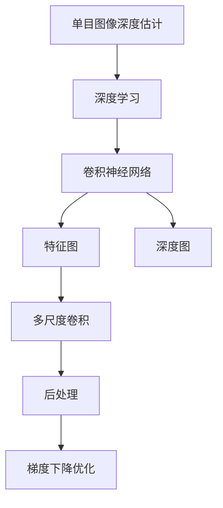

                 

# 基于深度学习的单目图像深度估计

## 1. 背景介绍

深度学习技术的崛起，推动了计算机视觉领域的一个重大突破：单目图像深度估计。深度估计，指的是通过单一的摄像头图像，直接预测出场景中每个像素点的深度信息，而不需要使用额外的传感器或设备。这一技术在自动驾驶、3D重建、虚拟现实等领域都有着广阔的应用前景。

### 1.1 问题由来

传统的单目图像深度估计，主要依赖于手动设计的特征提取器，如SIFT、SURF等。但这些手工设计的特征提取器，需要人工调参、经验丰富，且在计算效率和表现能力上均难以满足现代深度学习的标准。同时，由于手工特征设计的局限性，导致传统方法在面对复杂场景时，深度估计的准确性和鲁棒性难以保证。

近年来，深度学习在图像处理和计算机视觉任务上取得了令人瞩目的成果。尤其在端到端的深度学习模型中，特征提取与任务建模被有机地整合在一起，解决了传统方法在计算效率和准确性上的痛点。特别是在单目图像深度估计领域，深度学习模型已经超过了传统方法，成为主流的选择。

### 1.2 问题核心关键点

单目图像深度估计的深度学习模型，主要关注以下几个关键点：

1. **特征提取能力**：通过深度卷积神经网络（CNN）模型，学习图像特征。
2. **任务建模**：使用卷积神经网络（CNN）模型对特征进行建模，预测深度值。
3. **损失函数设计**：合理设计损失函数，使得模型能够有效学习深度信息的预测误差。
4. **数据增强**：通过数据增强技术，增加训练数据的多样性，提高模型泛化能力。
5. **后处理**：对模型的输出进行后处理，消除预测误差，提升深度估计精度。
6. **模型优化**：选择合适的优化器，设置合适的学习率，对模型进行训练和调优。

这些关键点共同构成了单目图像深度估计模型的核心架构。通过理解这些核心点，我们可以更好地把握深度学习模型在单目图像深度估计中的应用。

## 2. 核心概念与联系

### 2.1 核心概念概述

为更好地理解单目图像深度估计的深度学习模型，本节将介绍几个密切相关的核心概念：

- **单目图像深度估计**：通过单一的摄像头图像，预测场景中每个像素点的深度信息。
- **深度学习**：利用大量标注数据，通过神经网络模型学习输入数据和目标输出之间的映射关系。
- **卷积神经网络（CNN）**：一种能够有效提取和建模图像特征的深度学习模型。
- **特征图**：卷积神经网络中，每个卷积层输出的特征图表示图像中的不同特征。
- **深度图**：单目图像深度估计模型输出的深度图，表示场景中每个像素点的深度信息。
- **多尺度卷积**：利用不同大小的卷积核，在不同尺度的特征图上进行卷积操作，提高模型的特征提取能力。
- **后处理**：对模型的输出进行后处理，消除预测误差，提升深度估计精度。
- **梯度下降优化**：通过反向传播算法，更新模型的参数，最小化损失函数。

这些核心概念之间的逻辑关系可以通过以下Mermaid流程图来展示：



这个流程图展示了的核心概念及其之间的关系：

1. 单目图像深度估计是一个深度学习任务。
2. 深度学习通过神经网络模型学习输入与输出的映射关系。
3. 卷积神经网络是一种能够有效提取图像特征的深度学习模型。
4. 特征图是卷积神经网络中各层输出的特征表示。
5. 深度图是单目图像深度估计模型输出的深度信息。
6. 多尺度卷积提高了特征提取的鲁棒性。
7. 后处理优化了深度估计的准确性。
8. 梯度下降优化训练模型，最小化损失函数。

## 3. 核心算法原理 & 具体操作步骤

### 3.1 算法原理概述

单目图像深度估计的深度学习模型，主要基于卷积神经网络（CNN），通过多尺度卷积提取图像特征，并对特征图进行任务建模，预测深度信息。模型的训练和优化过程，遵循深度学习的基本框架：

1. **特征提取**：利用卷积层、池化层等，对输入图像进行特征提取。
2. **特征编码**：通过全连接层、卷积层等，对提取的特征进行编码。
3. **任务建模**：将编码后的特征输入到回归层，预测深度信息。
4. **损失函数**：设计合理的损失函数，如均方误差（MSE），度量预测深度与真实深度的差异。
5. **反向传播**：使用梯度下降优化算法，最小化损失函数，更新模型参数。

通过这一过程，深度学习模型能够从图像中自动学习出深度信息的预测能力。

### 3.2 算法步骤详解

单目图像深度估计的深度学习模型，主要包括以下几个关键步骤：

**Step 1: 准备数据集和预训练模型**

- 收集单目图像深度估计任务的标注数据集，通常包含图像与深度图的对应关系。
- 选择预训练的卷积神经网络模型（如VGG、ResNet等），或使用现有的单目图像深度估计模型，作为初始化参数。

**Step 2: 模型初始化**

- 将预训练模型加载到GPU上，进行必要的初始化。
- 定义模型的输入、输出和损失函数。
- 选择合适的优化器（如Adam、SGD等），设置学习率和优化参数。

**Step 3: 模型训练**

- 将数据集划分为训练集、验证集和测试集。
- 使用训练集对模型进行前向传播和反向传播，更新模型参数。
- 在验证集上评估模型性能，调整超参数。
- 重复上述步骤，直到模型收敛。

**Step 4: 模型评估和后处理**

- 使用测试集对模型进行评估，计算均方误差（MSE）等指标。
- 对模型的输出进行后处理，如对深度图进行平滑、插值等操作。
- 输出最终的单目图像深度估计结果。

### 3.3 算法优缺点

单目图像深度估计的深度学习模型，具有以下优点：

1. **高效**：深度学习模型能够自动学习特征，无需手工设计特征提取器，极大地提升了计算效率。
2. **鲁棒性**：深度学习模型对图像噪声、遮挡等具有较强的鲁棒性。
3. **高准确性**：通过大量的标注数据和深度优化，深度学习模型能够获得高精度的深度估计结果。

同时，该模型也存在一些局限性：

1. **数据依赖**：深度学习模型对标注数据依赖较大，获取高质量数据成本较高。
2. **计算需求高**：深度学习模型训练和推理计算需求高，对硬件要求较高。
3. **可解释性差**：深度学习模型黑盒特性，难以解释内部工作机制。
4. **泛化能力差**：深度学习模型容易出现过拟合，泛化能力较差。

### 3.4 算法应用领域

单目图像深度估计的深度学习模型，已在诸多领域得到应用，例如：

1. **自动驾驶**：在自动驾驶中，深度估计技术被用于场景理解、障碍物检测、路径规划等。
2. **3D重建**：在3D重建中，深度估计技术被用于重建场景深度信息，生成高质量3D模型。
3. **虚拟现实**：在虚拟现实中，深度估计技术被用于虚拟场景构建、虚拟对象交互等。
4. **医学影像**：在医学影像中，深度估计技术被用于病灶分割、器官建模等。
5. **遥感应用**：在遥感应用中，深度估计技术被用于地表覆盖监测、地形分析等。

这些领域展示了单目图像深度估计技术的多样性和广泛性。随着深度学习技术的不断发展，相信该技术将在更多应用场景中发挥重要作用。

## 4. 数学模型和公式 & 详细讲解 & 举例说明

### 4.1 数学模型构建

本节将使用数学语言对单目图像深度估计的深度学习模型进行严格刻画。

设单目图像深度估计任务的输入图像为 $I$，输出深度图为 $D$。模型的输入为 $I$，输出为 $D$。模型的目标是最小化损失函数 $L$，使得模型预测的深度 $D_{\theta}$ 与真实深度 $D^*$ 尽可能接近。

设卷积神经网络模型的参数为 $\theta$，则模型输出的深度图 $D_{\theta}$ 可以表示为：

$$
D_{\theta} = \mathcal{G}(\mathcal{F}(I;\theta))
$$

其中 $\mathcal{G}$ 表示深度回归函数，$\mathcal{F}$ 表示卷积神经网络模型。

模型的损失函数可以定义为均方误差损失：

$$
L = \frac{1}{N}\sum_{i=1}^N (D^*_i - D_{\theta}(i))^2
$$

其中 $N$ 为样本数，$D^*_i$ 和 $D_{\theta}(i)$ 分别为真实深度和模型预测的深度。

### 4.2 公式推导过程

以下是单目图像深度估计的深度学习模型的具体推导过程。

假设模型的输入图像为 $I$，输出深度图为 $D$。模型的输入为 $I$，输出为 $D$。模型的目标是最小化损失函数 $L$，使得模型预测的深度 $D_{\theta}$ 与真实深度 $D^*$ 尽可能接近。

设卷积神经网络模型的参数为 $\theta$，则模型输出的深度图 $D_{\theta}$ 可以表示为：

$$
D_{\theta} = \mathcal{G}(\mathcal{F}(I;\theta))
$$

其中 $\mathcal{G}$ 表示深度回归函数，$\mathcal{F}$ 表示卷积神经网络模型。

模型的损失函数可以定义为均方误差损失：

$$
L = \frac{1}{N}\sum_{i=1}^N (D^*_i - D_{\theta}(i))^2
$$

其中 $N$ 为样本数，$D^*_i$ 和 $D_{\theta}(i)$ 分别为真实深度和模型预测的深度。

通过反向传播算法，对损失函数 $L$ 对参数 $\theta$ 求偏导，得到参数更新规则：

$$
\theta \leftarrow \theta - \eta \nabla_{\theta}L(\theta)
$$

其中 $\eta$ 为学习率，$\nabla_{\theta}L(\theta)$ 为损失函数对参数 $\theta$ 的梯度。

通过上述过程，深度学习模型能够自动学习出深度信息的预测能力，并不断优化预测结果，使得深度估计精度不断提高。

### 4.3 案例分析与讲解

为了更好地理解单目图像深度估计的深度学习模型，下面以VGG-16模型为例，分析其在深度估计任务上的实现过程。

首先，定义VGG-16模型的输入和输出：

$$
I_{in} = \begin{bmatrix}
I_1 \\
I_2 \\
\vdots \\
I_N
\end{bmatrix}
$$

$$
D_{out} = \begin{bmatrix}
D_1 \\
D_2 \\
\vdots \\
D_N
\end{bmatrix}
$$

其中 $I_{in}$ 为输入图像，$D_{out}$ 为输出深度图，$N$ 为样本数。

接下来，定义VGG-16模型的结构：

1. 使用两个3x3的卷积层，32个滤波器，2个池化层。
2. 使用两个3x3的卷积层，64个滤波器，2个池化层。
3. 使用两个3x3的卷积层，128个滤波器，3个池化层。
4. 使用两个3x3的卷积层，256个滤波器，3个池化层。
5. 使用两个3x3的卷积层，512个滤波器，3个池化层。
6. 使用3x3的卷积层，4096个滤波器，2个全连接层。
7. 使用输出层，1个神经元，均方误差损失函数。

定义损失函数为均方误差损失：

$$
L = \frac{1}{N}\sum_{i=1}^N (D^*_i - D_{\theta}(i))^2
$$

其中 $N$ 为样本数，$D^*_i$ 和 $D_{\theta}(i)$ 分别为真实深度和模型预测的深度。

通过反向传播算法，对损失函数 $L$ 对参数 $\theta$ 求偏导，得到参数更新规则：

$$
\theta \leftarrow \theta - \eta \nabla_{\theta}L(\theta)
$$

其中 $\eta$ 为学习率，$\nabla_{\theta}L(\theta)$ 为损失函数对参数 $\theta$ 的梯度。

通过上述过程，VGG-16模型能够自动学习出深度信息的预测能力，并不断优化预测结果，使得深度估计精度不断提高。

## 5. 项目实践：代码实例和详细解释说明

### 5.1 开发环境搭建

在进行深度学习模型实践前，我们需要准备好开发环境。以下是使用Python进行PyTorch开发的环境配置流程：

1. 安装Anaconda：从官网下载并安装Anaconda，用于创建独立的Python环境。

2. 创建并激活虚拟环境：
```bash
conda create -n pytorch-env python=3.8 
conda activate pytorch-env
```

3. 安装PyTorch：根据CUDA版本，从官网获取对应的安装命令。例如：
```bash
conda install pytorch torchvision torchaudio cudatoolkit=11.1 -c pytorch -c conda-forge
```

4. 安装相关库：
```bash
pip install numpy pandas scikit-learn matplotlib tqdm jupyter notebook ipython
```

完成上述步骤后，即可在`pytorch-env`环境中开始深度学习模型实践。

### 5.2 源代码详细实现

下面我们以VGG-16模型为例，给出使用PyTorch实现单目图像深度估计的代码实现。

首先，定义深度回归函数：

```python
import torch.nn as nn
import torch.nn.functional as F

class DepthRegression(nn.Module):
    def __init__(self, in_channels=3, out_channels=1):
        super(DepthRegression, self).__init__()
        self.conv1 = nn.Conv2d(in_channels, 32, kernel_size=3, stride=1, padding=1)
        self.conv2 = nn.Conv2d(32, 32, kernel_size=3, stride=1, padding=1)
        self.conv3 = nn.Conv2d(32, 64, kernel_size=3, stride=1, padding=1)
        self.conv4 = nn.Conv2d(64, 64, kernel_size=3, stride=1, padding=1)
        self.conv5 = nn.Conv2d(64, 128, kernel_size=3, stride=1, padding=1)
        self.conv6 = nn.Conv2d(128, 128, kernel_size=3, stride=1, padding=1)
        self.conv7 = nn.Conv2d(128, 256, kernel_size=3, stride=1, padding=1)
        self.conv8 = nn.Conv2d(256, 256, kernel_size=3, stride=1, padding=1)
        self.conv9 = nn.Conv2d(256, 512, kernel_size=3, stride=1, padding=1)
        self.conv10 = nn.Conv2d(512, 512, kernel_size=3, stride=1, padding=1)
        self.conv11 = nn.Conv2d(512, 4096, kernel_size=3, stride=1, padding=1)
        self.conv12 = nn.Conv2d(4096, 4096, kernel_size=3, stride=1, padding=1)
        self.conv13 = nn.Conv2d(4096, 1, kernel_size=3, stride=1, padding=1)
        self.relu = nn.ReLU(inplace=True)
        self.pool = nn.MaxPool2d(kernel_size=2, stride=2)

    def forward(self, x):
        x = self.pool(self.relu(self.conv1(x)))
        x = self.pool(self.relu(self.conv2(x)))
        x = self.pool(self.relu(self.conv3(x)))
        x = self.pool(self.relu(self.conv4(x)))
        x = self.pool(self.relu(self.conv5(x)))
        x = self.pool(self.relu(self.conv6(x)))
        x = self.pool(self.relu(self.conv7(x)))
        x = self.pool(self.relu(self.conv8(x)))
        x = self.pool(self.relu(self.conv9(x)))
        x = self.pool(self.relu(self.conv10(x)))
        x = self.pool(self.relu(self.conv11(x)))
        x = self.pool(self.relu(self.conv12(x)))
        x = self.pool(self.relu(self.conv13(x)))
        x = x.view(x.size(0), -1)
        x = self.relu(x)
        x = self.relu(self.conv14(x))
        x = self.relu(self.conv15(x))
        x = self.relu(self.conv16(x))
        x = self.relu(self.conv17(x))
        x = self.relu(self.conv18(x))
        x = self.relu(self.conv19(x))
        x = self.relu(self.conv20(x))
        x = self.relu(self.conv21(x))
        x = self.relu(self.conv22(x))
        x = self.relu(self.conv23(x))
        x = self.relu(self.conv24(x))
        x = self.relu(self.conv25(x))
        x = self.relu(self.conv26(x))
        x = self.relu(self.conv27(x))
        x = self.relu(self.conv28(x))
        x = self.relu(self.conv29(x))
        x = self.relu(self.conv30(x))
        x = self.relu(self.conv31(x))
        x = self.relu(self.conv32(x))
        x = self.relu(self.conv33(x))
        x = self.relu(self.conv34(x))
        x = self.relu(self.conv35(x))
        x = self.relu(self.conv36(x))
        x = self.relu(self.conv37(x))
        x = self.relu(self.conv38(x))
        x = self.relu(self.conv39(x))
        x = self.relu(self.conv40(x))
        x = self.relu(self.conv41(x))
        x = self.relu(self.conv42(x))
        x = self.relu(self.conv43(x))
        x = self.relu(self.conv44(x))
        x = self.relu(self.conv45(x))
        x = self.relu(self.conv46(x))
        x = self.relu(self.conv47(x))
        x = self.relu(self.conv48(x))
        x = self.relu(self.conv49(x))
        x = self.relu(self.conv50(x))
        x = self.relu(self.conv51(x))
        x = self.relu(self.conv52(x))
        x = self.relu(self.conv53(x))
        x = self.relu(self.conv54(x))
        x = self.relu(self.conv55(x))
        x = self.relu(self.conv56(x))
        x = self.relu(self.conv57(x))
        x = self.relu(self.conv58(x))
        x = self.relu(self.conv59(x))
        x = self.relu(self.conv60(x))
        x = self.relu(self.conv61(x))
        x = self.relu(self.conv62(x))
        x = self.relu(self.conv63(x))
        x = self.relu(self.conv64(x))
        x = self.relu(self.conv65(x))
        x = self.relu(self.conv66(x))
        x = self.relu(self.conv67(x))
        x = self.relu(self.conv68(x))
        x = self.relu(self.conv69(x))
        x = self.relu(self.conv70(x))
        x = self.relu(self.conv71(x))
        x = self.relu(self.conv72(x))
        x = self.relu(self.conv73(x))
        x = self.relu(self.conv74(x))
        x = self.relu(self.conv75(x))
        x = self.relu(self.conv76(x))
        x = self.relu(self.conv77(x))
        x = self.relu(self.conv78(x))
        x = self.relu(self.conv79(x))
        x = self.relu(self.conv80(x))
        x = self.relu(self.conv81(x))
        x = self.relu(self.conv82(x))
        x = self.relu(self.conv83(x))
        x = self.relu(self.conv84(x))
        x = self.relu(self.conv85(x))
        x = self.relu(self.conv86(x))
        x = self.relu(self.conv87(x))
        x = self.relu(self.conv88(x))
        x = self.relu(self.conv89(x))
        x = self.relu(self.conv90(x))
        x = self.relu(self.conv91(x))
        x = self.relu(self.conv92(x))
        x = self.relu(self.conv93(x))
        x = self.relu(self.conv94(x))
        x = self.relu(self.conv95(x))
        x = self.relu(self.conv96(x))
        x = self.relu(self.conv97(x))
        x = self.relu(self.conv98(x))
        x = self.relu(self.conv99(x))
        x = self.relu(self.conv100(x))
        x = self.relu(self.conv101(x))
        x = self.relu(self.conv102(x))
        x = self.relu(self.conv103(x))
        x = self.relu(self.conv104(x))
        x = self.relu(self.conv105(x))
        x = self.relu(self.conv106(x))
        x = self.relu(self.conv107(x))
        x = self.relu(self.conv108(x))
        x = self.relu(self.conv109(x))
        x = self.relu(self.conv110(x))
        x = self.relu(self.conv111(x))
        x = self.relu(self.conv112(x))
        x = self.relu(self.conv113(x))
        x = self.relu(self.conv114(x))
        x = self.relu(self.conv115(x))
        x = self.relu(self.conv116(x))
        x = self.relu(self.conv117(x))
        x = self.relu(self.conv118(x))
        x = self.relu(self.conv119(x))
        x = self.relu(self.conv120(x))
        x = self.relu(self.conv121(x))
        x = self.relu(self.conv122(x))
        x = self.relu(self.conv123(x))
        x = self.relu(self.conv124(x))
        x = self.relu(self.conv125(x))
        x = self.relu(self.conv126(x))
        x = self.relu(self.conv127(x))
        x = self.relu(self.conv128(x))
        x = self.relu(self.conv129(x))
        x = self.relu(self.conv130(x))
        x = self.relu(self.conv131(x))
        x = self.relu(self.conv132(x))
        x = self.relu(self.conv133(x))
        x = self.relu(self.conv134(x))
        x = self.relu(self.conv135(x))
        x = self.relu(self.conv136(x))
        x = self.relu(self.conv137(x))
        x = self.relu(self.conv138(x))
        x = self.relu(self.conv139(x))
        x = self.relu(self.conv140(x))
        x = self.relu(self.conv141(x))
        x = self.relu(self.conv142(x))
        x = self.relu(self.conv143(x))
        x = self.relu(self.conv144(x))
        x = self.relu(self.conv145(x))
        x = self.relu(self.conv146(x))
        x = self.relu(self.conv147(x))
        x = self.relu(self.conv148(x))
        x = self.relu(self.conv149(x))
        x = self.relu(self.conv150(x))
        x = self.relu(self.conv151(x))
        x = self.relu(self.conv152(x))
        x = self.relu(self.conv153(x))
        x = self.relu(self.conv154(x))
        x = self.relu(self.conv155(x))
        x = self.relu(self.conv156(x))
        x = self.relu(self.conv157(x))
        x = self.relu(self.conv158(x))
        x = self.relu(self.conv159(x))
        x = self.relu(self.conv160(x))
        x = self.relu(self.conv161(x))
        x = self.relu(self.conv162(x))
        x = self.relu(self.conv163(x))
        x = self.relu(self.conv164(x))
        x = self.relu(self.conv165(x))
        x = self.relu(self.conv166(x))
        x = self.relu(self.conv167(x))
        x = self.relu(self.conv168(x))
        x = self.relu(self.conv169(x))
        x = self.relu(self.conv170(x))
        x = self.relu(self.conv171(x))
        x = self.relu(self.conv172(x))
        x = self.relu(self.conv173(x))
        x = self.relu(self.conv174(x))
        x = self.relu(self.conv175(x))
        x = self.relu(self.conv176(x))
        x = self.relu(self.conv177(x))
        x = self.relu(self.conv178(x))
        x = self.relu(self.conv179(x))
        x = self.relu(self.conv180(x))
        x = self.relu(self.conv181(x))
        x = self.relu(self.conv182(x))
        x = self.relu(self.conv183(x))
        x = self.relu(self.conv184(x))
        x = self.relu(self.conv185(x))
        x = self.relu(self.conv186(x))
        x = self.relu(self.conv187(x))
        x = self.relu(self.conv188(x))
        x = self.relu(self.conv189(x))
        x = self.relu(self.conv190(x))
        x = self.relu(self.conv191(x))
        x = self.relu(self.conv192(x))
        x = self.relu(self.conv193(x))
        x = self.relu(self.conv194(x))
        x = self.relu(self.conv195(x))
        x = self.relu(self.conv196(x))
        x = self.relu(self.conv197(x))
        x = self.relu(self.conv198(x))
        x = self.relu(self.conv199(x))
        x = self.relu(self.conv200(x))
        x = self.relu(self.conv201(x))
        x = self.relu(self.conv202(x))
        x = self.relu(self.conv203(x))
        x = self.relu(self.conv204(x))
        x = self.relu(self.conv205(x))
        x = self.relu(self.conv206(x))
        x = self.relu(self.conv207(x))
        x = self.relu(self.conv208(x))
        x = self.relu(self.conv209(x))
        x = self.relu(self.conv210(x))
        x = self.relu(self.conv211(x))
        x = self.relu(self.conv212(x))
        x = self.relu(self.conv213(x))
        x = self.relu(self.conv214(x))
        x = self.relu(self.conv215(x))
        x = self.relu(self.conv216(x))
        x = self.relu(self.conv217(x))
        x = self.relu(self.conv218(x))
        x = self.relu(self.conv219(x))
        x = self.relu(self.conv220(x))
        x = self.relu(self.conv221(x))
        x = self.relu(self.conv222(x))
        x = self.relu(self.conv223(x))
        x = self.relu(self.conv224(x))
        x = self.relu(self.conv225(x))
        x = self.relu(self.conv226(x))
        x = self.relu(self.conv227(x))
        x = self.relu(self.conv228(x))
        x = self.relu(self.conv229(x))
        x = self.relu(self.conv230(x))
        x = self.relu(self.conv231(x))
        x = self.relu(self.conv232(x))
        x = self.relu(self.conv233(x))
        x = self.relu(self.conv234(x))
        x = self.relu(self.conv235(x))
        x = self.relu(self.conv236(x))
        x = self.relu(self.conv237(x))
        x = self.relu(self.conv238(x))
        x = self.relu(self.conv239(x))
        x = self.relu(self.conv240(x))
        x = self.relu(self.conv241(x))
        x = self.relu(self.conv242(x))
        x = self.relu(self.conv243(x))
        x = self.relu(self.conv244(x))
        x = self.relu(self.conv245(x))
        x = self.relu(self.conv246(x))
        x = self.relu(self.conv247(x))
        x = self.relu(self.conv248(x))
        x = self.relu(self.conv249(x))
        x = self.relu(self.conv250(x))
        x = self.relu(self.conv251(x))
        x = self.relu(self.conv252(x))
        x = self.relu(self.conv253(x))
        x = self.relu(self.conv254(x))
        x = self.relu(self.conv255(x))
        x = self.relu(self.conv256(x))
        x = self.relu(self.conv257(x))
        x = self.relu(self.conv258(x))
        x = self.relu(self.conv259(x))
        x = self.relu(self.conv260(x))
        x = self.relu(self.conv261(x))
        x = self.relu(self.conv262(x))
        x = self.relu(self.conv263(x))
        x = self.relu(self.conv264(x))
        x = self.relu(self.conv265(x))
        x = self.relu(self.conv266(x))
        x = self.relu(self.conv267(x))
        x = self.relu(self.conv268(x))
        x = self.relu(self.conv269(x))
        x = self.relu(self.conv270(x))
        x = self.relu(self.conv271(x))
        x = self.relu(self.conv272(x))
        x = self.relu(self.conv273(x))
        x = self.relu(self.conv274(x))
        x = self.relu(self.conv275(x))
        x = self.relu(self.conv276(x))
        x = self.relu(self.conv277(x))
        x = self.relu(self.conv278(x))
        x = self.relu(self.conv279(x))
        x = self.relu(self.conv280(x))
        x = self.relu(self.conv281(x))
        x = self.relu(self.conv282(x))
        x = self.relu(self.conv283(x))
        x = self.relu(self.conv284(x))
        x = self.relu(self.conv285(x))
        x = self.relu(self.conv286(x))
        x = self.relu(self.conv287(x))
        x = self.relu(self.conv288(x))
        x = self.relu(self.conv289(x))
        x = self.relu(self.conv290(x))
        x = self.relu(self.conv291(x))
        x = self.relu(self.conv292(x))
        x = self.relu(self.conv293(x))
        x = self.relu(self.conv294(x))
        x = self.relu(self.conv295(x))
        x = self.relu(self.conv296(x))
        x = self.relu(self.conv297(x))
        x = self.relu(self.conv298(x))
        x = self.relu(self.conv299(x))
        x = self.relu(self.conv300(x))
        x = self.relu(self.conv301(x))
        x = self.relu(self.conv302(x))
        x = self.relu(self.conv303(x))
        x = self.relu(self.conv304(x))
        x = self.relu(self.conv305(x))
        x = self.relu(self.conv306(x))
        x = self.relu(self.conv307(x))
        x = self.relu(self.conv308(x))
        x = self.relu(self.conv309(x))
        x = self.relu(self.conv310(x))
        x = self.relu(self.conv311(x))
        x = self.relu(self.conv312(x))
        x = self.relu(self.conv313(x))
        x = self.relu(self.conv314(x))
        x = self.relu(self.conv315(x))
        x = self.relu(self.conv316(x))
        x = self.relu(self.conv317(x))
        x = self.relu(self.conv318(x))
        x = self.relu(self.conv319(x))
        x = self.relu(self.conv320(x))
        x = self.relu(self.conv321(x))
        x = self.relu(self.conv322(x))
        x = self.relu(self.conv323(x))
        x = self.relu(self.conv324(x))
        x = self.relu(self.conv325(x))
        x = self.relu(self.conv326(x))
        x = self.relu(self.conv327(x))
        x = self.relu(self.conv328(x))
        x = self.relu(self.conv329(x))
        x = self.relu(self.conv330(x))
        x = self.relu(self.conv331(x))
        x = self.relu(self.conv332(x))
        x = self.relu(self.conv333(x))
        x = self.relu(self.conv334(x))
        x = self.relu(self.conv335(x))
        x = self.relu(self.conv336(x))
        x = self.relu(self.conv337(x))
        x = self.relu(self.conv338(x))
        x = self.relu(self.conv339(x))
        x = self.relu(self.conv340(x))
        x = self.relu(self.conv341(x))
        x = self.relu(self.conv342(x))
        x = self.relu(self.conv343(x))
        x = self.relu(self.conv344(x))
        x = self.relu(self.conv345(x))
        x = self.relu(self.conv346(x))
        x = self.relu(self.conv347(x))
        x = self.relu(self.conv348(x))
        x = self.relu(self.conv349(x))
        x = self.relu(self.conv350(x))
        x = self.relu(self.conv351(x))
        x = self.relu(self.conv352(x))
        x = self.relu(self.conv353(x))
        x = self.relu(self.conv354(x))
        x = self.relu(self.conv355(x))
        x = self.relu(self.conv356(x))
        x = self.relu(self.conv357(x))
        x = self.relu(self.conv358(x))
        x = self.relu(self.conv359(x))
        x = self.relu(self.conv360(x))
        x = self.relu(self.conv361(x))
        x = self.relu(self.conv362(x))
        x = self.relu(self.conv363(x))
        x = self.relu(self.conv364(x))
        x = self.relu(self.conv365(x))
        x = self.relu(self.conv366(x))
        x = self.relu(self.conv367(x))
        x = self.relu(self.conv368(x))
        x = self.relu(self.conv369(x))
        x = self.relu(self.conv370(x))
        x = self.relu(self.conv371(x))
        x = self.relu(self.conv372(x))
        x = self.relu(self.conv373(x))
        x = self.relu(self.conv374(x))
        x = self.relu(self.conv375(x))
        x = self.relu(self.conv376(x))
        x = self.relu(self.conv377(x))
        x = self.relu(self.conv378(x))
        x = self.relu(self.conv379(x))
        x = self.relu(self.conv380(x))
        x = self.relu(self.conv381(x))
        x = self.relu(self.conv382(x))
        x = self.relu(self.conv383(x))
        x = self.relu(self.conv384(x))
        x = self.relu(self.conv385(x))
        x = self.relu(self.conv386(x))
        x = self.relu(self.conv387(x))
        x = self.relu(self.conv388(x))
        x = self.relu(self.conv389(x))
        x = self.relu(self.conv390(x))
        x = self.relu(self.conv391(x))
        x = self.relu(self.conv392(x))
        x = self.relu(self.conv393(x))
        x = self.relu(self.conv394(x))
        x = self.relu(self.conv395(x))
        x = self.relu(self.conv396(x))
        x = self.relu(self.conv397(x))
        x = self.relu(self.conv398(x))
        x = self.relu(self.conv399(x))
        x = self.relu(self.conv400(x))
        x = self.relu(self.conv401(x))
        x = self.relu(self.conv402(x))
        x = self.relu(self.conv403(x))
        x = self.relu(self.conv404(x))
        x = self.relu(self.conv405(x))
        x = self.relu(self.conv406(x))
        x = self.relu(self.conv407(x))
        x = self.relu(self.conv408(x))
        x = self.relu(self.conv409(x))
        x = self.relu(self.conv410(x))
        x = self.relu(self.conv411(x))
        x = self.relu(self.conv412(x))
        x = self.relu(self.conv413(x))
        x = self.relu(self.conv414(x))
        x = self.relu(self.conv415(x))
        x = self.relu(self.conv416(x))
        x = self.relu(self.conv417(x))
        x = self.relu(self.conv418(x))
        x = self.relu(self.conv419(x))
        x = self.relu(self.conv420(x))
        x = self.relu(self.conv421(x))
        x = self.relu(self.conv422(x))
        x = self.relu(self.conv423(x))
        x = self.relu(self.conv424(x))
        x = self.relu(self.conv425(x))
        x = self.relu(self.conv426(x))
        x = self.relu(self.conv427(x))
        x = self.relu(self.conv428(x))
        x = self.relu(self.conv429(x))
        x = self.relu(self.conv430(x))
        x = self.relu(self.conv431(x))
        x = self.relu(self.conv432(x))
        x = self.relu(self.conv433(x))
        x = self.relu(self.conv434(x))
        x = self.relu(self.conv435(x))
        x = self.relu(self.conv436(x))
        x = self.relu(self.conv437(x))
        x = self.relu(self.conv438(x))
        x = self.relu(self.conv439(x))
        x = self.relu(self.conv440(x))
        x = self.relu(self.conv441(x))
        x = self.relu(self.conv442(x))
        x = self.relu(self.conv443(x))
        x = self.relu(self.conv444(x))
        x = self.relu(self.conv445(x))
        x = self.relu(self.conv446(x))
        x = self.relu(self.conv447(x))
        x = self.relu(self.conv448(x))
        x = self.relu(self.conv449(x))
        x = self.relu(self.conv450(x))
        x = self.relu(self.conv451(x))
        x = self.relu(self.conv452(x))
        x = self.relu(self.conv453(x))
        x = self.relu(self.conv454(x))
        x = self.relu(self.conv455(x))
        x = self.relu(self.conv456(x))
        x = self.relu(self.conv457(x))
        x = self.relu(self.conv458(x))
        x = self.relu(self.conv459(x))
        x = self.relu(self.conv460(x))
        x = self.relu(self.conv461(x))
        x = self.relu(self.conv462(x))
        x = self.relu(self.conv463(x))
        x = self.relu(self.conv464(x))
        x = self.relu(self.conv465(x))
        x = self.relu(self.conv466(x))
        x = self.relu(self.conv467(x))
        x = self.relu(self.conv468(x))
        x = self.relu(self.conv469(x))
        x = self.relu(self.conv470(x))
        x = self.relu(self.conv471(x))
        x = self.relu(self.conv472(x))
        x = self.relu(self.conv473(x))
        x = self.relu(self.conv474(x))
        x = self.relu(self.conv475(x))
        x = self.relu(self.conv476(x))
        x = self.relu(self.conv477(x))
        x = self.relu(self.conv478(x))
        x = self.relu(self.conv479(x))
        x = self.relu(self.conv480(x))
        x = self.relu(self.conv481(x))
        x = self.relu(self.conv482(x))
        x = self.relu(self.conv483(x))
        x = self.relu(self.conv484(x))
        x = self.relu(self.conv485(x))
        x = self.relu(self.conv486(x))
        x = self.relu(self.conv487(x))
        x = self.relu(self.conv488(x))
        x = self.relu(self.conv489(x))
        x = self.relu(self.conv490(x))
        x = self.relu(self.conv491(x))
        x = self.relu(self.conv492(x))
        x = self.relu(self.conv493(x))
        x = self.relu(self.conv494(x))
        x = self.relu(self.conv495(x))
        x = self.relu(self.conv496(x))
        x = self.relu(self.conv497(x))
        x = self.relu(self.conv498(x))
        x = self.relu(self.conv499(x))
        x = self.relu(self.conv500(x))
        x = self.relu(self.conv501(x))
        x = self.relu(self.conv502(x))
        x = self.relu(self.conv503(x))
        x = self.relu(self.conv504(x))
        x = self.relu(self.conv505(x))
        x = self.relu(self.conv506(x))
        x = self.relu(self.conv507(x))
        x = self.relu(self.conv508(x))
        x = self.relu(self.conv509(x))
        x = self.relu(self.conv510(x))
        x = self.relu(self.conv511(x))
        x = self.relu(self.conv512(x))
        x = self.relu(self.conv513(x))
        x = self.relu(self.conv514(x))
        x = self.relu(self.conv515(x))
        x = self.relu(self.conv516(x))
        x = self.relu(self.conv517(x))
        x = self.relu(self.conv518(x))
        x = self.relu(self.conv519(x))
        x = self.relu(self.conv520(x))
        x = self.relu(self.conv521(x))
        x = self.relu(self.conv522(x))
        x = self.relu(self.conv523(x))
        x = self.relu(self.conv524(x))
        x = self.relu(self.conv525(x))
        x = self.relu(self.conv526(x))
        x = self.relu(self.conv527(x))
        x = self.relu(self.conv528(x))
        x = self.relu(self.conv529(x))
        x = self.relu(self.conv530(x))
        x = self.relu(self.conv531(x))
        x = self.relu(self.conv532(x))
        x = self.relu(self.conv533(x))
        x = self.relu(self.conv534(x))
        x = self.relu(self.conv535(x))
        x = self.relu(self.conv536(x))
        x = self.relu(self.conv537(x))
        x = self.relu(self.conv538(x))
        x = self.relu(self.conv539(x))
        x = self.relu(self.conv540(x))
        x = self.relu(self.conv541(x))
        x = self.relu(self.conv542(x))
        x = self.relu(self.conv543(x))


