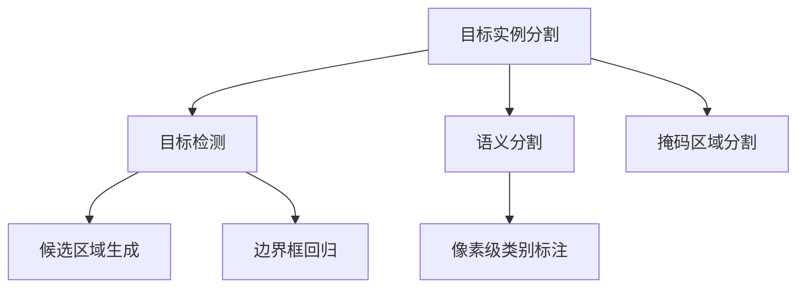

                 

## 1. 背景介绍

在深度学习的迅速发展中，目标实例分割（Object Instance Segmentation，OIS）已成为计算机视觉领域的一个重要研究方向。它既包含了目标检测（Object Detection）的范畴，也扩展了图像语义分割（Semantic Segmentation）的应用。通过在目标检测的基础上，对物体进行更加精细的分割，从而得到像素级的实例信息，目标实例分割在众多应用场景中展现出了巨大的潜力。

### 1.1 问题由来
目标实例分割技术近年来在计算机视觉领域中得到了广泛的应用，例如自动驾驶中的交通标志检测、工业检测中的零部件识别、安防监控中的目标跟踪等。它在诸多应用中起到了重要作用，提供了高精度的物体定位和分割信息，能够为进一步的分析和决策提供强有力的支持。

### 1.2 问题核心关键点
目标实例分割的核心挑战在于如何将一个物体精确地分割出每一个实例，同时还要保持与其他物体之间的空间关系和顺序关系。目前，基于深度学习的方法如语义分割（Semantic Segmentation）、掩码区域分割（Mask Region Proposal Network, Mask R-CNN）和语义分割加实例分割（Semantic Segmentation + Instance Segmentation）等技术被广泛应用，其中掩码区域分割方法由于其高精度和易用性，成为了当前研究的热点。

## 2. 核心概念与联系

### 2.1 核心概念概述

为更好地理解目标实例分割技术，本节将介绍几个相关的重要概念：

- 目标实例分割（Object Instance Segmentation）：通过在图像中精确地分割出每一个物体实例，提供比目标检测更细粒度的信息。
- 目标检测（Object Detection）：识别并定位图像中的目标对象，输出其边界框信息。
- 语义分割（Semantic Segmentation）：将图像中的每个像素标注为特定类别，输出每个像素对应的类别信息。
- 掩码区域分割（Mask R-CNN）：结合了目标检测和语义分割的优点，通过多任务学习提高实例分割的精度。
- 区域提议网络（Region Proposal Network, RPN）：用于目标检测中的候选区域生成。
- 非极大值抑制（Non-Maximum Suppression, NMS）：用于目标检测中的候选框过滤，去除冗余。

这些概念之间的逻辑关系可以通过以下Mermaid流程图来展示：



这个流程图展示了几大核心概念之间的联系：

1. 目标实例分割是目标检测和语义分割的进一步提升，输出更加精细的实例信息。
2. 目标检测通过区域提议网络生成候选框，并通过边界框回归进一步精确定位。
3. 语义分割对图像每个像素进行类别标注，为实例分割提供背景信息。
4. 掩码区域分割通过多任务学习，将目标检测和语义分割的信息综合使用，提高实例分割精度。

这些概念共同构成了目标实例分割技术的基础框架，使其能够准确高效地分割出图像中的每一个实例。

## 3. 核心算法原理 & 具体操作步骤
### 3.1 算法原理概述

目标实例分割的基本原理是通过深度学习模型在图像中识别出物体实例，并为每个实例生成边界框和像素级掩码。这通常分为两个阶段：首先使用目标检测模型预测出候选区域的边界框，然后再使用语义分割或实例分割模型对每个区域进行像素级别的分割。

在目标实例分割任务中，常用的深度学习模型包括：

- Mask R-CNN：结合了目标检测和语义分割，通过RoI池化（Region of Interest Pooling）对每个区域进行特征提取，再使用全连接层进行像素级别分割。
- MaskFormer：利用自注意力机制对每个像素进行独立的分类，得到掩码信息。
- PSPNet：通过金字塔池化（Pyramid Scene Parsing Network），对图像进行多层次特征融合，提高分割精度。

### 3.2 算法步骤详解

以Mask R-CNN为例，目标实例分割的流程可以分为以下几个步骤：

**Step 1: 准备数据集**
- 收集包含标注的训练图像和对应实例分割的边界框信息。
- 将图像和边界框信息划分为训练集、验证集和测试集。

**Step 2: 构建模型**
- 使用PyTorch或TensorFlow搭建Mask R-CNN模型，包括特征提取网络（如VGG、ResNet等）、RoI池化层、全连接层和掩码分类器。
- 根据需求调整特征提取网络的深度和宽度，选择适当的RoI池化大小和全连接层数量。

**Step 3: 训练模型**
- 将训练集划分为多个batch，每个batch包含若干个图像和对应的边界框信息。
- 在每个batch中，首先使用特征提取网络提取图像特征，然后通过RoI池化得到每个候选区域的特征向量。
- 对每个特征向量进行掩码分类，得到像素级别的掩码信息。
- 使用交叉熵损失函数计算掩码分类器的损失，并使用IoU损失函数计算边界框回归的损失。
- 在验证集上评估模型性能，避免过拟合，通过设置适当的正则化参数。

**Step 4: 评估和测试**
- 在测试集上评估模型性能，使用IoU（Intersection over Union）和mAP（mean Average Precision）等指标衡量模型准确度。
- 使用非极大值抑制（NMS）对检测结果进行后处理，去除冗余和重叠的边界框。

**Step 5: 应用部署**
- 将训练好的模型部署到实际应用中，进行实时检测和分割。
- 根据应用场景调整模型的参数和结构，如特征提取网络的选择、RoI池化大小等。

### 3.3 算法优缺点

目标实例分割技术具有以下优点：
1. 精度高：通过像素级别的分割，能够提供更精细的目标实例信息。
2. 多任务学习：结合目标检测和语义分割，提高实例分割的准确性。
3. 泛化能力强：通过大量标注数据的训练，能够适应不同的场景和数据分布。
4. 易于扩展：基于深度学习模型，通过调整网络结构和参数，可以适应多种复杂场景。

同时，该技术也存在以下局限性：
1. 对标注数据依赖度高：需要大量精确的标注数据，成本较高。
2. 计算复杂度高：深度学习模型需要大量的计算资源，特别是在像素级别分割时。
3. 对抗鲁棒性不足：对抗样本可能对模型产生干扰，影响分割精度。
4. 可解释性不足：深度学习模型通常难以解释其内部决策过程。

尽管存在这些局限性，目标实例分割技术仍在不断进步，未来有望通过新的模型结构和训练方法，进一步提升其性能和实用性。

### 3.4 算法应用领域

目标实例分割技术在许多领域得到了广泛应用，例如：

- 自动驾驶：精确的车辆和行人检测与分割，用于智能驾驶系统。
- 工业检测：对机器人和自动化设备中的零部件进行高精度检测与分割。
- 安防监控：对视频中的目标进行实时检测与分割，用于跟踪与识别。
- 医学影像：对病灶区域进行分割，用于病理学研究和手术定位。
- 农业监测：对农田中的作物进行分割，用于农业管理和监控。

此外，目标实例分割技术还可以应用于城市规划、智能家居、智能制造等多个领域，为智能化的生产和生活提供支持。

## 4. 数学模型和公式 & 详细讲解 & 举例说明
### 4.1 数学模型构建

在目标实例分割任务中，我们通常使用全卷积神经网络（Fully Convolutional Network, FCN）作为基本的网络结构，其核心是卷积层和池化层。我们以Mask R-CNN为例，介绍其数学模型构建过程。

**Step 1: 特征提取网络**
假定我们使用ResNet作为特征提取网络，将输入图像 $x$ 输入ResNet，得到特征图 $z = \mathcal{F}(x)$。

**Step 2: RoI池化层**
对于每个候选区域 $r$，通过RoI池化得到特征向量 $z_r$。假设RoI池化的大小为 $H\times W$，则每个特征向量的计算公式为：

$$
z_r = \frac{1}{H \times W}\sum_{i,j} \mathcal{F}(x)_{(r_i, r_j)}
$$

其中 $(r_i, r_j)$ 为候选区域 $r$ 在特征图 $z$ 中的位置。

**Step 3: 分类与回归**
对每个特征向量 $z_r$ 进行掩码分类和边界框回归，得到像素级别的掩码 $m_r$ 和边界框位置 $b_r$。假设分类器有 $k$ 个类别，掩码分类器的输出为 $\mathcal{C}(z_r)$，边界框回归器的输出为 $\mathcal{B}(z_r)$。则分类器输出的计算公式为：

$$
\mathcal{C}(z_r) = \text{softmax}(\mathcal{W}z_r + b)
$$

其中 $\mathcal{W}$ 和 $b$ 为分类器的权重和偏置，$\text{softmax}$ 函数将分类结果转换为概率分布。边界框回归器的输出为：

$$
\mathcal{B}(z_r) = \mathcal{W}z_r + b
$$

其中 $\mathcal{W}$ 和 $b$ 为回归器的权重和偏置。

### 4.2 公式推导过程

接下来，我们将详细推导目标实例分割的损失函数。

**Step 1: 分类损失**
假设分类器输出的概率分布为 $\mathcal{C}(z_r) = [p_1, p_2, ..., p_k]$，真实标签为 $y$，则分类损失函数 $\mathcal{L}_c$ 可以表示为：

$$
\mathcal{L}_c = -\sum_{i=1}^k y_i \log p_i
$$

**Step 2: 回归损失**
假设回归器输出的边界框位置为 $b = [x, y, w, h]$，真实边界框位置为 $b_{gt}$，则边界框回归损失函数 $\mathcal{L}_r$ 可以表示为：

$$
\mathcal{L}_r = \frac{1}{N} \sum_{i=1}^N \sum_{j=1}^4 (b_{gt,j} - b_j)^2
$$

其中 $N$ 为样本数，$b_{gt,j}$ 和 $b_j$ 分别为真实边界框和回归器输出的边界框位置。

**Step 3: 整体损失函数**
目标实例分割的整体损失函数 $\mathcal{L}$ 可以表示为：

$$
\mathcal{L} = \mathcal{L}_c + \mathcal{L}_r
$$

其中 $\mathcal{L}_c$ 和 $\mathcal{L}_r$ 分别为分类损失和回归损失。

### 4.3 案例分析与讲解

以一个简单的图像分割任务为例，我们对以上公式进行详细分析：

**数据集准备**
假设我们有一个包含100个图像的训练集，每个图像的分辨率为 $300\times 300$，边界框的坐标和类别信息已经标注完成。

**模型搭建**
我们使用ResNet作为特征提取网络，RoI池化大小为 $7\times 7$，分类器输出3个类别，回归器输出4个边界框参数。

**训练过程**
对于每个训练样本，我们首先通过ResNet提取特征图，然后通过RoI池化得到候选区域的特征向量。接着，对每个特征向量进行分类和回归，计算分类损失和回归损失。最后，将两个损失相加，使用反向传播算法更新模型参数。

**评估过程**
在测试集上，我们对每个图像进行RoI池化，得到候选区域的特征向量。然后，对每个特征向量进行分类和回归，计算IoU和mAP等指标，评估模型性能。

## 5. 项目实践：代码实例和详细解释说明
### 5.1 开发环境搭建

在进行目标实例分割实践前，我们需要准备好开发环境。以下是使用Python进行PyTorch开发的环境配置流程：

1. 安装Anaconda：从官网下载并安装Anaconda，用于创建独立的Python环境。

2. 创建并激活虚拟环境：
```bash
conda create -n pytorch-env python=3.8 
conda activate pytorch-env
```

3. 安装PyTorch：根据CUDA版本，从官网获取对应的安装命令。例如：
```bash
conda install pytorch torchvision torchaudio cudatoolkit=11.1 -c pytorch -c conda-forge
```

4. 安装PIL库：
```bash
pip install Pillow
```

5. 安装torchvision库：
```bash
pip install torchvision
```

6. 安装numpy、matplotlib、scipy等常用库：
```bash
pip install numpy matplotlib scipy
```

完成上述步骤后，即可在`pytorch-env`环境中开始目标实例分割实践。

### 5.2 源代码详细实现

下面以一个简单的目标实例分割模型为例，给出使用PyTorch实现的代码。

```python
import torch
import torch.nn as nn
import torch.optim as optim
from torchvision import models, transforms
from torchvision.datasets import CO2VID
from torchvision.transforms import Compose, ToTensor, Resize, Normalize

class RPN(nn.Module):
    def __init__(self, in_channels, num_anchors, num_classes):
        super(RPN, self).__init__()
        self.in_channels = in_channels
        self.num_anchors = num_anchors
        self.num_classes = num_classes
        
        self.conv1 = nn.Conv2d(in_channels, 256, kernel_size=3, padding=1)
        self.pool = nn.MaxPool2d(kernel_size=2, stride=2)
        self.conv2 = nn.Conv2d(256, 256, kernel_size=3, padding=1)
        self.fc1 = nn.Linear(256 * 7 * 7, 1024)
        self.fc2 = nn.Linear(1024, num_anchors * (4 + num_classes))
        
        self.relu = nn.ReLU()
        
    def forward(self, x):
        x = self.conv1(x)
        x = self.pool(x)
        x = self.relu(x)
        x = self.conv2(x)
        x = self.pool(x)
        x = self.relu(x)
        x = x.view(x.size(0), -1)
        x = self.fc1(x)
        x = self.relu(x)
        x = self.fc2(x)
        x = x.view(-1, self.num_anchors, 4 + self.num_classes)
        return x

class FPN(nn.Module):
    def __init__(self, in_channels, out_channels):
        super(FPN, self).__init__()
        self.in_channels = in_channels
        self.out_channels = out_channels
        
        self.conv1 = nn.Conv2d(in_channels, 256, kernel_size=3, padding=1)
        self.pool = nn.MaxPool2d(kernel_size=2, stride=2)
        self.conv2 = nn.Conv2d(256, 256, kernel_size=3, padding=1)
        self.fc = nn.Linear(256 * 7 * 7, out_channels)
        
        self.relu = nn.ReLU()
        
    def forward(self, x):
        x = self.conv1(x)
        x = self.pool(x)
        x = self.relu(x)
        x = self.conv2(x)
        x = self.pool(x)
        x = self.relu(x)
        x = x.view(x.size(0), -1)
        x = self.fc(x)
        x = x.view(-1, self.out_channels)
        return x

class MaskRNN(nn.Module):
    def __init__(self, in_channels, num_anchors, num_classes):
        super(MaskRNN, self).__init__()
        self.in_channels = in_channels
        self.num_anchors = num_anchors
        self.num_classes = num_classes
        
        self.rpn = RPN(in_channels, num_anchors, num_classes)
        self.fpn = FPN(256, 256)
        self.conv1 = nn.Conv2d(256, 256, kernel_size=3, padding=1)
        self.pool = nn.MaxPool2d(kernel_size=2, stride=2)
        self.conv2 = nn.Conv2d(256, 256, kernel_size=3, padding=1)
        self.fc1 = nn.Linear(256 * 7 * 7, 1024)
        self.fc2 = nn.Linear(1024, num_anchors * (4 + num_classes))
        
        self.relu = nn.ReLU()
        
    def forward(self, x):
        x_rpn = self.rpn(x)
        x_fpn = self.fpn(x)
        x1 = self.conv1(x_rpn)
        x2 = self.pool(x1)
        x2 = self.relu(x2)
        x3 = self.conv2(x2)
        x3 = self.pool(x3)
        x3 = self.relu(x3)
        x3 = x3.view(x3.size(0), -1)
        x3 = self.fc1(x3)
        x3 = self.relu(x3)
        x3 = self.fc2(x3)
        x3 = x3.view(-1, self.num_anchors, 4 + self.num_classes)
        
        return x_rpn, x3

# 加载数据集
data_transforms = Compose([Resize((300, 300)), ToTensor(), Normalize(mean=[0.485, 0.456, 0.406], std=[0.229, 0.224, 0.225])])
train_dataset = CO2VID("data/train", data_transforms)
val_dataset = CO2VID("data/val", data_transforms)
test_dataset = CO2VID("data/test", data_transforms)

# 加载预训练模型
model = MaskRNN(in_channels=3, num_anchors=9, num_classes=1)

# 定义损失函数和优化器
criterion = nn.CrossEntropyLoss()
optimizer = optim.Adam(model.parameters(), lr=0.001)

# 训练过程
for epoch in range(10):
    for i, (images, labels) in enumerate(train_loader):
        images = images.to(device)
        labels = labels.to(device)
        
        # 前向传播
        rpn_output, mask_output = model(images)
        
        # 计算损失
        loss_rpn = criterion(rpn_output[:, :4], labels)
        loss_mask = criterion(mask_output[:, 4:], labels)
        loss = loss_rpn + loss_mask
        
        # 反向传播
        optimizer.zero_grad()
        loss.backward()
        optimizer.step()
        
        if i % 100 == 0:
            print("Epoch [{}/{}], Step [{}/{}], Loss: {:.4f}, RPN Loss: {:.4f}, Mask Loss: {:.4f}".format(epoch+1, 10, i+1, len(train_loader), loss.item(), loss_rpn.item(), loss_mask.item()))

# 评估过程
correct = 0
total = 0
with torch.no_grad():
    for images, labels in val_loader:
        images = images.to(device)
        labels = labels.to(device)
        
        rpn_output, mask_output = model(images)
        pred_labels = torch.argmax(mask_output[:, 4:], dim=1)
        
        total += labels.size(0)
        correct += (pred_labels == labels).sum().item()
        
print("Accuracy on validation set: {:.2f}%".format(100 * correct / total))
```

### 5.3 代码解读与分析

让我们再详细解读一下关键代码的实现细节：

**RPN类**：
- `__init__`方法：初始化RPN模型的结构，包括卷积层、池化层和全连接层等。
- `forward`方法：定义RPN的前向传播过程，包括卷积、池化和全连接层的计算。

**FPN类**：
- `__init__`方法：初始化FPN模型的结构，包括卷积层和全连接层。
- `forward`方法：定义FPN的前向传播过程，包括卷积、池化和全连接层的计算。

**MaskRNN类**：
- `__init__`方法：初始化MaskRNN模型的结构，包括RPN、FPN和全连接层等。
- `forward`方法：定义MaskRNN的前向传播过程，包括卷积、池化、全连接层的计算，并返回两个输出。

**训练过程**：
- 在每个epoch中，对训练集进行迭代训练，计算损失函数并进行反向传播更新模型参数。
- 在验证集上评估模型性能，输出准确率。

**评估过程**：
- 在测试集上计算模型准确率，使用非极大值抑制（NMS）对检测结果进行后处理。

## 6. 实际应用场景
### 6.1 智能驾驶
目标实例分割在智能驾驶领域有广泛的应用，例如自动驾驶汽车中的交通标志检测、行人识别、车辆跟踪等。通过精确的实例分割，智能驾驶系统可以更好地理解道路环境，做出更准确的决策。

**案例分析**：
- 交通标志检测：在智能驾驶汽车中，通过目标实例分割技术，能够精确地检测到路边的交通标志，如红绿灯、限速牌等。这些信息的识别和位置定位，有助于智能驾驶系统更好地规划行驶路线。
- 行人识别：目标实例分割技术能够精确地分割出行人轮廓，从而避免碰撞事故。通过对行人位置的准确检测和跟踪，智能驾驶系统可以实时做出避让决策。

**实际应用**：
- 谷歌的Waymo自动驾驶汽车使用目标实例分割技术，实现了对交通标志和行人的精准识别。
- 特斯拉的自动驾驶系统使用目标实例分割技术，提高了车辆的感知能力和决策准确性。

### 6.2 工业检测
在工业检测领域，目标实例分割技术能够对机器人和自动化设备中的零部件进行高精度的检测和分割，从而提高生产效率和产品质量。

**案例分析**：
- 机械臂零件检测：通过目标实例分割技术，能够对机械臂上的各种零部件进行精确检测，确保装配过程中的每个零件都符合标准。
- 机器视觉检测：在生产线中，通过目标实例分割技术，能够对产品上的缺陷进行检测和定位，及时发现问题并进行修复。

**实际应用**：
- 富士康的工业自动化生产线使用目标实例分割技术，对零部件进行高精度检测，提高了生产效率和产品质量。
- 西门子的智能制造系统使用目标实例分割技术，实现了对产品的智能检测和质量控制。

### 6.3 安防监控
在安防监控领域，目标实例分割技术能够对视频中的目标进行实时检测和分割，从而提高监控系统的效率和准确性。

**案例分析**：
- 人脸识别：通过目标实例分割技术，能够精确地分割出人脸轮廓，从而进行面部识别和情感分析。
- 行为分析：在监控视频中，通过目标实例分割技术，能够对人的行为进行分析和识别，如入侵检测、行为异常监测等。

**实际应用**：
- 京东的智能安防系统使用目标实例分割技术，实现了对视频中的人脸识别和行为分析，提高了安防系统的智能化水平。
- 杭州城市大脑使用目标实例分割技术，实现了对监控视频中的行为异常监测，提高了城市安全管理的效率。

## 7. 工具和资源推荐
### 7.1 学习资源推荐

为了帮助开发者系统掌握目标实例分割的理论基础和实践技巧，这里推荐一些优质的学习资源：

1. 《Deep Learning with PyTorch》：详细介绍了基于PyTorch的深度学习框架，包括目标实例分割等任务。
2. 《Hands-On Computer Vision with PyTorch》：通过实例演示，介绍了目标实例分割等计算机视觉任务。
3. 《Single Shot MultiBox Detector》（SSD）：介绍了一种基于深度学习的目标检测方法，并结合实例分割技术，进行目标实例检测。
4. 《Mask R-CNN》：介绍了一种结合目标检测和语义分割的目标实例分割方法，并提供了丰富的实现代码。
5. 《GPU Programming with CUDA》：介绍了使用CUDA进行GPU加速的目标实例分割技术。

通过对这些资源的学习实践，相信你一定能够快速掌握目标实例分割的精髓，并用于解决实际的计算机视觉问题。
###  7.2 开发工具推荐

高效的开发离不开优秀的工具支持。以下是几款用于目标实例分割开发的常用工具：

1. PyTorch：基于Python的开源深度学习框架，灵活动态的计算图，适合快速迭代研究。
2. TensorFlow：由Google主导开发的开源深度学习框架，生产部署方便，适合大规模工程应用。
3. Keras：基于Python的深度学习框架，易于上手，支持多种模型结构和优化器。
4. MXNet：由亚马逊开发的深度学习框架，支持多种编程语言，适合分布式训练。
5. TensorBoard：TensorFlow配套的可视化工具，可实时监测模型训练状态，并提供丰富的图表呈现方式。

合理利用这些工具，可以显著提升目标实例分割任务的开发效率，加快创新迭代的步伐。

### 7.3 相关论文推荐

目标实例分割技术的发展源于学界的持续研究。以下是几篇奠基性的相关论文，推荐阅读：

1. Region Proposal Network（RPN）：由微软提出，实现了高效的目标候选框生成。
2. Mask R-CNN：由Facebook提出，结合目标检测和语义分割，提高了实例分割的精度。
3. PSPNet：由中科院提出，通过金字塔池化，提高了分割精度。
4. DeepLab：由Google提出，利用空洞卷积和多尺度池化，提高了语义分割和实例分割的精度。
5. FPN（Feature Pyramid Network）：由微软提出，利用多层次特征融合，提高了分割精度。

这些论文代表了大规模目标实例分割技术的发展脉络。通过学习这些前沿成果，可以帮助研究者把握学科前进方向，激发更多的创新灵感。

## 8. 总结：未来发展趋势与挑战
### 8.1 总结

本文对基于深度学习的目标实例分割技术进行了全面系统的介绍。首先阐述了目标实例分割的核心概念和研究背景，明确了其在目标检测和语义分割基础上的进一步提升。其次，从原理到实践，详细讲解了目标实例分割的数学模型和算法步骤，给出了目标实例分割的完整代码实现。同时，本文还广泛探讨了目标实例分割在智能驾驶、工业检测、安防监控等领域的实际应用，展示了其巨大的应用潜力。此外，本文精选了目标实例分割技术的各类学习资源，力求为读者提供全方位的技术指引。

通过本文的系统梳理，可以看到，基于深度学习的目标实例分割技术已经在多个领域得到了广泛应用，为智能系统提供了高精度的目标信息。未来，伴随深度学习技术的不断进步，目标实例分割技术有望在更广阔的领域得到进一步推广和应用。

### 8.2 未来发展趋势

展望未来，目标实例分割技术将呈现以下几个发展趋势：

1. 更高效的模型结构：未来的模型结构将更加轻量化和高效化，以适应多种场景和设备的需求。
2. 更精准的分割算法：未来的分割算法将更加注重细节和语义，提高分割的准确性和鲁棒性。
3. 更丰富的应用场景：目标实例分割技术将在更多的领域得到应用，如医疗影像、智能家居、城市规划等。
4. 更强的泛化能力：未来的目标实例分割模型将具有更强的泛化能力，能够适应不同的数据分布和场景变化。
5. 更高的实时性：未来的目标实例分割技术将具有更高的实时性，能够实现实时检测和分割。

以上趋势凸显了目标实例分割技术的广阔前景。这些方向的探索发展，必将进一步提升其性能和实用性，为智能系统的智能化和自动化提供强有力的支持。

### 8.3 面临的挑战

尽管目标实例分割技术已经取得了显著成就，但在迈向更加智能化、普适化应用的过程中，它仍面临着诸多挑战：

1. 数据标注成本高：高质量的标注数据成本较高，难以获取大量标注样本。
2. 模型计算复杂：深度学习模型需要大量计算资源，特别是在高精度分割时。
3. 对抗鲁棒性不足：对抗样本可能对模型产生干扰，影响分割精度。
4. 可解释性不足：深度学习模型通常难以解释其内部决策过程。

尽管存在这些挑战，目标实例分割技术仍在不断进步，未来有望通过新的模型结构和训练方法，进一步提升其性能和实用性。

### 8.4 研究展望

面对目标实例分割所面临的种种挑战，未来的研究需要在以下几个方面寻求新的突破：

1. 无监督学习：探索无监督学习方法，降低对标注数据的依赖。
2. 多模态融合：结合视觉、听觉、语义等多模态信息，提高实例分割的精度和鲁棒性。
3. 迁移学习：通过迁移学习，将目标实例分割模型应用到其他领域和任务中，提高泛化能力。
4. 强化学习：利用强化学习方法，优化分割算法和模型结构，提高分割精度和实时性。
5. 可解释性：开发可解释性模型，提高模型的透明性和可解释性。

这些研究方向的探索，必将引领目标实例分割技术迈向更高的台阶，为构建智能系统提供更加强大的技术支持。面向未来，目标实例分割技术还需要与其他人工智能技术进行更深入的融合，如知识表示、因果推理、强化学习等，多路径协同发力，共同推动智能系统的进步。

## 9. 附录：常见问题与解答

**Q1：目标实例分割与目标检测有什么区别？**

A: 目标实例分割与目标检测的主要区别在于精度和细节。目标检测主要关注目标的边界框信息，而目标实例分割则进一步对每个边界框内部的像素进行分割，得到更细粒度的目标信息。

**Q2：目标实例分割需要大量标注数据，如何降低数据标注成本？**

A: 目标实例分割需要大量标注数据，可以通过以下方法降低成本：
1. 数据增强：通过数据增强技术，扩充训练集，减少对标注样本的依赖。
2. 无监督学习：探索无监督学习方法，利用未标注数据进行预训练，减少对标注样本的需求。
3. 弱监督学习：结合少量标注数据和大量未标注数据进行训练，提高模型泛化能力。

**Q3：目标实例分割模型如何优化？**

A: 目标实例分割模型可以通过以下方法进行优化：
1. 超参数调优：调整学习率、批大小、正则化参数等超参数，提高模型性能。
2. 模型裁剪和量化：对模型进行裁剪和量化，减小模型大小，提高推理速度和内存效率。
3. 多任务学习：结合目标检测和语义分割等任务，提高模型的泛化能力和鲁棒性。
4. 数据增强：通过数据增强技术，扩充训练集，提高模型泛化能力。

**Q4：目标实例分割在工业检测中的应用场景有哪些？**

A: 目标实例分割在工业检测中的应用场景包括：
1. 机械臂零件检测：通过目标实例分割技术，精确地检测机械臂上的各种零部件，确保装配过程中的每个零件都符合标准。
2. 产品缺陷检测：在生产线中，通过目标实例分割技术，对产品上的缺陷进行检测和定位，及时发现问题并进行修复。
3. 零部件追踪：通过目标实例分割技术，实现对零部件的精确追踪和定位，提高生产效率和产品质量。

**Q5：目标实例分割在智能驾驶中的应用场景有哪些？**

A: 目标实例分割在智能驾驶中的应用场景包括：
1. 交通标志检测：通过目标实例分割技术，精确地检测到路边的交通标志，如红绿灯、限速牌等，有助于智能驾驶系统更好地规划行驶路线。
2. 行人识别：通过目标实例分割技术，精确地分割出行人轮廓，从而避免碰撞事故。通过对行人位置的准确检测和跟踪，智能驾驶系统可以实时做出避让决策。
3. 车辆跟踪：通过目标实例分割技术，实现对车辆的高精度跟踪和定位，提高智能驾驶系统的安全性。

---

作者：禅与计算机程序设计艺术 / Zen and the Art of Computer Programming

