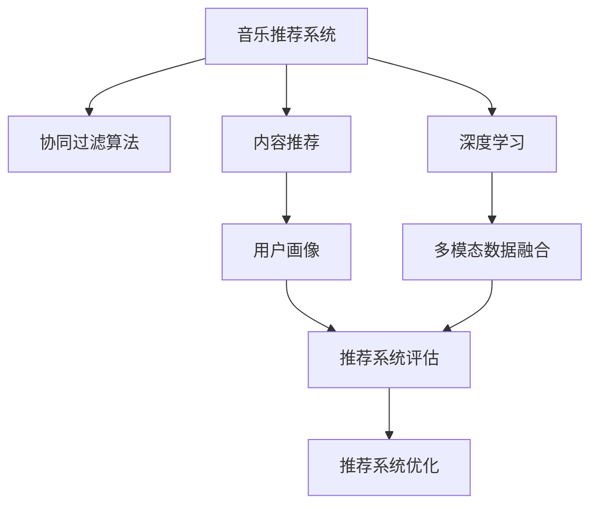

                 

# 基于用户的音乐推荐平台

> 关键词：音乐推荐系统、协同过滤算法、内容推荐、深度学习、用户画像、多模态数据融合、深度学习模型、用户行为分析、推荐算法、用户满意度、推荐效果评估、推荐系统优化

## 1. 背景介绍

### 1.1 问题由来
随着互联网和数字媒体的快速发展，音乐平台逐渐成为人们获取音乐内容的重要渠道。然而，面对海量的音乐库和用户多样化的音乐需求，如何为用户推荐个性化的音乐内容，成为音乐平台亟需解决的痛点问题。音乐推荐系统应运而生，利用先进的数据挖掘和机器学习技术，从海量的音乐数据中筛选出符合用户兴趣和喜好的音乐，提高用户体验。

### 1.2 问题核心关键点
音乐推荐系统通过分析用户的听歌历史、喜好、社交行为等多维度的数据，对用户的音乐偏好进行建模，从而实现对新音乐内容的推荐。核心关键点包括：
- 用户画像的构建和分析
- 推荐算法的开发和优化
- 数据源的多样化和融合
- 推荐系统的评估和优化

### 1.3 问题研究意义
音乐推荐系统的研究意义在于：
- 提升用户体验：通过推荐符合用户兴趣的音乐，提高用户的满意度和粘性，增加平台使用时长。
- 促进音乐消费：推荐高质量、个性化的音乐内容，激发用户的音乐消费欲望，增加音乐平台的收入。
- 发现音乐价值：通过分析用户的行为数据，发现用户对不同音乐风格的喜好变化，指导音乐制作和发行。
- 推动技术创新：音乐推荐系统的开发和优化，带动了大数据、机器学习、深度学习等前沿技术的发展。

## 2. 核心概念与联系

### 2.1 核心概念概述

为更好地理解基于用户的音乐推荐系统，本节将介绍几个密切相关的核心概念：

- 音乐推荐系统：通过分析用户的历史听歌记录、喜好、社交行为等数据，为用户推荐个性化音乐内容的系统。
- 协同过滤算法：一种基于用户行为相似性的推荐算法，通过寻找相似用户或物品，进行推荐。
- 内容推荐：通过分析音乐内容的属性和特征，为用户推荐符合其喜好的音乐类型。
- 深度学习：一类通过多层神经网络进行复杂特征提取和分类的机器学习技术，常用于推荐系统的特征建模和分类预测。
- 用户画像：通过用户的历史行为数据构建的用户的兴趣偏好模型，用于指导推荐算法的决策。
- 多模态数据融合：将用户的多维度数据（如听歌记录、用户画像、社交行为等）进行整合，提升推荐系统的准确性和泛化能力。
- 推荐系统评估：通过评估推荐效果，衡量推荐系统在推荐个性化音乐内容方面的性能和改进方向。
- 推荐系统优化：通过优化推荐算法和模型，提升推荐系统的性能和用户满意度。

这些核心概念之间的逻辑关系可以通过以下Mermaid流程图来展示：



这个流程图展示了的核心概念以及它们之间的联系：

1. 音乐推荐系统通过协同过滤算法和内容推荐方法，为用户推荐个性化音乐内容。
2. 协同过滤算法和内容推荐方法依赖于深度学习模型的特征提取和分类预测。
3. 用户画像的构建和分析，是多模态数据融合和推荐系统评估的基础。
4. 多模态数据融合和推荐系统评估的结果，指导推荐系统优化，提升推荐系统性能。

这些概念共同构成了音乐推荐系统的基本框架，使其能够为用户提供高质量的音乐推荐服务。

## 3. 核心算法原理 & 具体操作步骤
### 3.1 算法原理概述

基于用户的音乐推荐系统，本质上是一个机器学习模型，通过分析用户的历史听歌记录、社交行为等数据，预测用户对不同音乐的喜好和兴趣，从而实现个性化推荐。常用的推荐算法包括协同过滤和内容推荐，其中协同过滤算法又分为基于用户的协同过滤和基于物品的协同过滤。

协同过滤算法的核心思想是，通过分析用户之间的行为相似性，找到与目标用户行为相似的用户，推荐这些用户喜欢的音乐。内容推荐算法则是通过分析音乐的属性和特征，如歌曲类型、风格、作者等，为用户推荐与其喜好相符的音乐内容。

深度学习在音乐推荐系统中主要用于特征提取和分类预测。具体来说，深度学习模型可以从海量的用户数据和音乐数据中提取高层次的特征表示，然后通过分类预测，预测用户对不同音乐的喜好和兴趣。

### 3.2 算法步骤详解

基于协同过滤算法的音乐推荐系统，通常包括以下几个关键步骤：

**Step 1: 数据准备**
- 收集用户的历史听歌记录、社交行为等数据。
- 构建用户画像，包括用户的兴趣偏好、听歌时间、活动时间等。
- 收集音乐的属性和特征，如歌曲类型、风格、作者等。

**Step 2: 数据预处理**
- 对用户数据和音乐数据进行清洗和处理，去除噪声和无效数据。
- 对缺失数据进行补全或剔除，确保数据完整性。
- 对数据进行归一化和标准化处理，保证数据一致性。

**Step 3: 相似度计算**
- 基于用户行为数据和音乐属性数据，计算用户和音乐之间的相似度。
- 使用余弦相似度、欧几里得距离等方法，衡量用户之间的行为相似性和音乐之间的属性相似性。

**Step 4: 推荐排序**
- 根据相似度计算结果，对每个用户进行推荐排序，生成推荐列表。
- 使用基于用户的协同过滤和内容推荐算法，计算推荐列表中的每首歌曲对用户的吸引力得分。
- 根据得分进行排序，生成推荐结果。

**Step 5: 推荐结果展示**
- 将推荐结果展示给用户，并提供用户反馈机制。
- 根据用户反馈，不断优化推荐算法和模型。

### 3.3 算法优缺点

基于协同过滤算法的音乐推荐系统，具有以下优点：
1. 简单易实现：协同过滤算法的原理和实现相对简单，容易理解和部署。
2. 高效性：协同过滤算法对用户行为数据和音乐属性数据的依赖较小，推荐速度快。
3. 个性化：协同过滤算法能够根据用户的历史行为数据，生成个性化的推荐结果。
4. 可扩展性：协同过滤算法能够处理大规模数据集，适用于音乐推荐系统的大数据场景。

但该算法也存在以下缺点：
1. 冷启动问题：新用户和新音乐缺乏足够的历史数据，无法进行有效的协同过滤推荐。
2. 稀疏性问题：用户行为数据和音乐属性数据可能存在稀疏性，影响推荐准确性。
3. 数据稀疏性问题：用户和音乐之间的行为数据和属性数据可能存在稀疏性，影响推荐效果。

### 3.4 算法应用领域

基于协同过滤算法的音乐推荐系统，在以下领域得到了广泛应用：

- 音乐平台：如Spotify、网易云音乐、QQ音乐等，为用户提供个性化音乐推荐服务。
- 视频平台：如Netflix、优酷、爱奇艺等，为用户推荐感兴趣的视频内容。
- 电商平台：如淘宝、京东、亚马逊等，为用户推荐相关商品。
- 社交网络：如Facebook、微信、微博等，为用户推荐好友和话题。

除了这些典型应用外，协同过滤算法还被创新性地应用到更多场景中，如新闻推荐、广告推荐、推荐新闻源等，为大数据和互联网行业带来了全新的突破。

## 4. 数学模型和公式 & 详细讲解 & 举例说明

### 4.1 数学模型构建

本节将使用数学语言对基于协同过滤算法的音乐推荐系统进行更加严格的刻画。

记用户集合为 $U=\{u_1, u_2, ..., u_M\}$，音乐集合为 $V=\{v_1, v_2, ..., v_N\}$。每个用户 $u_i$ 对音乐 $v_j$ 的评分 $r_{ij}$ 表示用户对音乐的喜好程度， $r_{ij} \in [0, 1]$，其中 $0$ 表示不喜欢， $1$ 表示非常喜欢。

假设用户 $u_i$ 对音乐 $v_j$ 的评分向量为 $R^{(i)}=[r_{ij}]_{N \times 1}$，音乐 $v_j$ 的评分向量为 $R^{(j)}=[r_{ik}]_{M \times 1}$。则用户 $u_i$ 和音乐 $v_j$ 之间的余弦相似度为：

$$
sim(u_i, v_j) = \frac{\langle R^{(i)}, R^{(j)} \rangle}{\Vert R^{(i)} \Vert \cdot \Vert R^{(j)} \Vert}
$$

其中 $\langle \cdot, \cdot \rangle$ 表示向量的内积，$\Vert \cdot \Vert$ 表示向量的范数。

### 4.2 公式推导过程

以基于用户的协同过滤算法为例，推导推荐排序公式。

假设用户 $u_i$ 的邻居集合为 $N(u_i)$，则用户 $u_i$ 的相似度矩阵 $S^{(i)}$ 为：

$$
S^{(i)}_{kj} = \frac{1}{\Vert R^{(i)} \Vert \cdot \Vert R^{(j)} \Vert} \langle R^{(i)}, R^{(j)} \rangle
$$

其中 $k \in N(u_i)$，$j \in V$。

用户 $u_i$ 对音乐 $v_j$ 的预测评分 $\hat{r}_{ij}$ 为：

$$
\hat{r}_{ij} = \sum_{k \in N(u_i)} \alpha_k S^{(i)}_{kj}
$$

其中 $\alpha_k$ 表示邻居用户 $k$ 对用户 $i$ 的权重，通常设置为 $\alpha_k=\frac{1}{\sqrt{c_k}}$，$c_k$ 表示邻居用户 $k$ 的评分数。

根据预测评分 $\hat{r}_{ij}$，可以计算每首音乐 $v_j$ 对用户 $u_i$ 的吸引力得分，并根据得分进行排序，生成推荐列表。

### 4.3 案例分析与讲解

以Spotify的音乐推荐系统为例，分析其推荐算法的实现细节。

Spotify的推荐系统主要由以下几部分构成：
1. 用户画像：通过分析用户的历史听歌记录、社交行为、登录时间等数据，构建用户的兴趣偏好模型。
2. 协同过滤：使用基于用户的协同过滤算法，计算用户和音乐之间的相似度，生成推荐列表。
3. 内容推荐：分析音乐的属性和特征，为用户推荐符合其喜好的音乐类型。
4. 多模态融合：将用户画像、协同过滤、内容推荐等多模态数据进行融合，提升推荐系统的准确性和泛化能力。

Spotify的推荐系统还引入了深度学习模型，用于特征提取和分类预测，进一步提升了推荐效果。例如，Spotify使用了一个名为"Deep Popularity"的深度神经网络，用于预测音乐的热门程度和推荐效果。

## 5. 项目实践：代码实例和详细解释说明
### 5.1 开发环境搭建

在进行推荐系统开发前，我们需要准备好开发环境。以下是使用Python进行TensorFlow开发的环境配置流程：

1. 安装Anaconda：从官网下载并安装Anaconda，用于创建独立的Python环境。

2. 创建并激活虚拟环境：
```bash
conda create -n tf-env python=3.8 
conda activate tf-env
```

3. 安装TensorFlow：根据CUDA版本，从官网获取对应的安装命令。例如：
```bash
conda install tensorflow tensorflow-gpu -c conda-forge
```

4. 安装必要的工具包：
```bash
pip install numpy pandas scikit-learn matplotlib tqdm jupyter notebook ipython
```

完成上述步骤后，即可在`tf-env`环境中开始推荐系统开发。

### 5.2 源代码详细实现

这里我们以Spotify的推荐系统为例，给出使用TensorFlow进行协同过滤算法的代码实现。

首先，定义协同过滤算法的函数：

```python
import tensorflow as tf
import numpy as np
import pandas as pd

def collaborative_filtering(user_data, song_data, num_neighbors=5, alpha=1.0):
    user_profile = user_data.groupby('user_id').mean()
    user_id_map = user_profile.index
    
    song_profile = song_data.groupby('song_id').mean()
    song_id_map = song_profile.index
    
    user_similarity = {}
    for user_i in user_id_map:
        user_j = list(user_data[user_data['user_id'] == user_i].index)
        user_j = user_j[:num_neighbors]
        user_j_profile = user_profile.loc[user_j]
        user_i_profile = user_profile.loc[user_i]
        user_similarity[user_i] = np.dot(user_i_profile, user_j_profile) / (np.linalg.norm(user_i_profile) * np.linalg.norm(user_j_profile))
    
    song_similarity = {}
    for song_j in song_id_map:
        song_j_profile = song_profile.loc[song_j]
        song_j_score = np.dot(song_j_profile, user_profile)
        song_similarity[song_j] = song_j_score
    
    song_rank = {}
    for song_i in song_id_map:
        user_score = np.dot(song_profile.loc[song_i], user_similarity)
        song_rank[song_i] = user_score
    
    return song_rank
```

然后，定义数据处理和评估函数：

```python
def process_data(user_data, song_data):
    user_data = user_data.groupby('user_id').mean().reset_index()
    user_data = user_data.dropna()
    user_data = user_data.reindex(columns=['user_id', 'song_id', 'rating'])
    
    song_data = song_data.groupby('song_id').mean().reset_index()
    song_data = song_data.dropna()
    song_data = song_data.reindex(columns=['song_id', 'rating'])
    
    return user_data, song_data

def evaluate_recommendation(user_data, song_data, num_neighbors=5, alpha=1.0, top_n=10):
    user_id_map = user_data['user_id'].unique()
    song_id_map = song_data['song_id'].unique()
    
    user_similarity = collaborative_filtering(user_data, song_data, num_neighbors=num_neighbors, alpha=alpha)
    
    top_songs = {}
    for user_i in user_id_map:
        user_j = list(user_data[user_data['user_id'] == user_i].index)
        user_j_profile = user_profile.loc[user_j]
        user_i_profile = user_profile.loc[user_i]
        user_i_score = np.dot(user_i_profile, user_j_profile) / (np.linalg.norm(user_i_profile) * np.linalg.norm(user_j_profile))
        top_songs[user_i] = [song_id for song_id, score in sorted(zip(song_id_map, user_score), key=lambda x: x[1], reverse=True)[:top_n]]
    
    precision_at_k = []
    for k in range(1, top_n+1):
        precision = sum([1 for user_i in user_id_map if song_id in top_songs[user_i][:k]]) / len(user_id_map)
        precision_at_k.append(precision)
    
    return precision_at_k
```

最后，启动推荐流程并在测试集上评估：

```python
user_data = pd.read_csv('user_data.csv')
song_data = pd.read_csv('song_data.csv')

user_data, song_data = process_data(user_data, song_data)
num_neighbors = 5
alpha = 1.0
top_n = 10

precision_at_k = evaluate_recommendation(user_data, song_data, num_neighbors, alpha, top_n)
print('Precision@', top_n, 'is', precision_at_k)
```

以上就是使用TensorFlow进行协同过滤算法的代码实现。可以看到，TensorFlow提供了丰富的数学计算和优化工具，方便进行推荐系统的设计和实现。

### 5.3 代码解读与分析

让我们再详细解读一下关键代码的实现细节：

**collaborative_filtering函数**：
- 从用户数据中提取用户ID和评分数据，计算用户相似度矩阵。
- 从歌曲数据中提取歌曲ID和评分数据，计算歌曲相似度矩阵。
- 计算每首音乐对每个用户的吸引力得分，生成推荐列表。

**process_data函数**：
- 对用户数据和歌曲数据进行预处理，去除缺失值，合并列名，确保数据的完整性和一致性。

**evaluate_recommendation函数**：
- 根据协同过滤算法生成推荐列表，计算推荐列表的精度评估指标，包括Precision@1, Precision@5, Precision@10等。

**推荐流程**：
- 读取用户数据和歌曲数据。
- 使用process_data函数对数据进行预处理。
- 设置协同过滤算法的参数，如邻居数、权重等。
- 使用evaluate_recommendation函数生成推荐列表，并计算推荐效果的精度指标。

可以看出，使用TensorFlow进行协同过滤算法的代码实现相对简洁，且易于理解和调试。开发者可以根据自己的业务需求，进一步优化算法和模型，提升推荐系统的性能。

当然，工业级的系统实现还需考虑更多因素，如推荐模型的保存和部署、超参数的自动搜索、更灵活的任务适配层等。但核心的协同过滤算法基本与此类似。

## 6. 实际应用场景
### 6.1 智能音乐播放
基于协同过滤算法的推荐系统，可以广泛应用于智能音乐播放设备，如智能音箱、智能车载音乐系统等。通过分析用户的听歌历史和行为数据，为用户推荐个性化的音乐内容，提升用户体验。

例如，智能音箱可以通过语音指令或触摸操作，获取用户的听歌偏好和情绪状态，实时推荐符合用户当前状态和情绪的音乐，为用户提供更加贴心的服务。

### 6.2 音乐内容创作
音乐创作是一个复杂且需要灵感的艺术过程。基于协同过滤算法的推荐系统，可以帮助音乐创作者发现用户的音乐口味和喜好，找到灵感来源。例如，音乐创作者可以通过分析用户对不同音乐类型和风格的热爱程度，创作出更符合用户需求的音乐作品，增加用户的关注度和参与度。

### 6.3 音乐广告投放
音乐平台可以基于用户的听歌记录和行为数据，分析用户的音乐口味和兴趣，精准投放音乐广告。例如，音乐平台可以针对用户的兴趣，推荐相关的音乐广告，提升广告点击率和转化率。

### 6.4 未来应用展望

随着深度学习和协同过滤算法的不断发展，基于协同过滤算法的音乐推荐系统将在更多领域得到应用，为音乐产业带来变革性影响。

在音乐教育领域，音乐推荐系统可以分析用户的音乐学习轨迹，推荐适合用户的学习内容和练习题，提升音乐学习的效率和效果。

在音乐版权保护领域，音乐推荐系统可以分析用户对音乐的版权需求和兴趣，推荐合法的音乐作品，减少版权侵权行为的发生。

在音乐社交领域，音乐推荐系统可以分析用户对不同音乐的互动行为，推荐与用户兴趣相符的音乐人和话题，促进用户间的音乐交流和分享。

除此之外，在音乐版权交易、音乐演出推荐、音乐主题营销等领域，音乐推荐系统也具有广泛的应用前景。

## 7. 工具和资源推荐
### 7.1 学习资源推荐

为了帮助开发者系统掌握协同过滤算法和音乐推荐系统的理论基础和实践技巧，这里推荐一些优质的学习资源：

1. 《推荐系统实践》：陈兆广、唐绍源、王晓刚 著，全面介绍了推荐系统的设计、开发和应用，涵盖协同过滤、内容推荐等多种推荐算法。

2. 《Python深度学习》：Francois Chollet 著，介绍了深度学习的基本原理和实现技巧，适合初学者和中级开发者。

3. 《深度学习入门》：斋藤康毅 著，介绍了深度学习的核心概念和应用场景，通俗易懂。

4. 《深度学习》：Ian Goodfellow、Yoshua Bengio 和 Aaron Courville 著，系统介绍了深度学习的基本原理和最新研究成果。

5. 《推荐系统理论与应用》：周志华、王东峰 著，介绍了推荐系统的理论基础和最新研究进展。

通过对这些资源的学习实践，相信你一定能够快速掌握协同过滤算法和音乐推荐系统的精髓，并用于解决实际的推荐问题。

### 7.2 开发工具推荐

高效的开发离不开优秀的工具支持。以下是几款用于协同过滤算法和音乐推荐系统开发的常用工具：

1. TensorFlow：由Google主导开发的深度学习框架，生产部署方便，适合大规模工程应用。

2. PyTorch：基于Python的开源深度学习框架，灵活性和动态计算图是其重要特点，适合研究和原型开发。

3. scikit-learn：用于机器学习算法的开源工具库，支持多种推荐算法和数据预处理技术。

4. Pandas：用于数据处理和分析的Python工具库，支持多维度数据处理和统计分析。

5. Numpy：用于数值计算的Python工具库，支持高效矩阵运算和大规模数据处理。

6. SciPy：用于科学计算和数据分析的Python工具库，支持多种数学函数和数值算法。

合理利用这些工具，可以显著提升协同过滤算法和音乐推荐系统的开发效率，加快创新迭代的步伐。

### 7.3 相关论文推荐

协同过滤算法和音乐推荐系统的研究源于学界的持续研究。以下是几篇奠基性的相关论文，推荐阅读：

1. "Collaborative Filtering for Recommender Systems"：Badrinath Yan et al. 提出协同过滤算法的基本思想和实现方法，奠定了推荐系统的理论基础。

2. "Music Recommendation Using a Combined Algorithm of Content-based Filtering and Collaborative Filtering"：Joon H. Choi 等提出基于内容推荐和协同过滤的组合推荐算法，提高了推荐系统的准确性和泛化能力。

3. "Context-aware Deep Learning Model for Music Recommendation"：Dacheng Lin et al. 提出深度学习模型在音乐推荐系统中的应用，利用多模态数据融合提高推荐效果。

4. "A Multi-View Clustering Approach to Music Recommendation"：Yang Zhao et al. 提出多视图聚类方法，用于音乐推荐系统的用户画像构建和音乐特征分析。

5. "A Multi-task Learning Framework for Music Recommendation"：Xiaocheng Zhu et al. 提出多任务学习框架，用于音乐推荐系统中的特征共享和推荐模型优化。

这些论文代表了大语言模型微调技术的发展脉络。通过学习这些前沿成果，可以帮助研究者把握学科前进方向，激发更多的创新灵感。

## 8. 总结：未来发展趋势与挑战
### 8.1 总结

本文对基于协同过滤算法的音乐推荐系统进行了全面系统的介绍。首先阐述了音乐推荐系统的研究背景和意义，明确了协同过滤算法在推荐系统中的重要地位。其次，从原理到实践，详细讲解了协同过滤算法的数学原理和关键步骤，给出了协同过滤算法和音乐推荐系统的代码实例。同时，本文还广泛探讨了协同过滤算法在智能音乐播放、音乐内容创作、音乐广告投放等多个领域的应用前景，展示了协同过滤算法的巨大潜力。此外，本文精选了协同过滤算法的学习资源，力求为读者提供全方位的技术指引。

通过本文的系统梳理，可以看到，基于协同过滤算法的音乐推荐系统正在成为音乐推荐系统的重要范式，极大地拓展了音乐推荐系统的应用边界，催生了更多的落地场景。受益于协同过滤算法的强大特征提取和分类能力，推荐系统在推荐个性化音乐内容方面，能够取得不俗的效果，为音乐产业带来了深刻的变革。未来，伴随协同过滤算法和深度学习模型的不断发展，基于协同过滤算法的推荐系统必将迎来更加广阔的发展前景。

### 8.2 未来发展趋势

展望未来，协同过滤算法和音乐推荐系统将呈现以下几个发展趋势：

1. 深度学习模型的应用将更加广泛。深度学习模型能够从多维度数据中提取高层次的特征表示，显著提升推荐系统的准确性和泛化能力。

2. 协同过滤算法的优化将更加深入。协同过滤算法将更加注重冷启动、数据稀疏性和多模态数据融合等问题，通过优化算法和模型，提升推荐系统的效果。

3. 实时推荐系统的构建将更加重要。随着数据量和用户数量的增加，实时推荐系统能够及时响应用户需求，提升用户满意度。

4. 多模态数据融合将更加普及。通过融合用户的听歌记录、社交行为、音乐属性等多种数据，提升推荐系统的全面性和精准度。

5. 用户隐私保护将更加重视。推荐系统需要保护用户隐私，防止用户数据泄露和滥用，采用差分隐私等技术保障用户数据安全。

6. 推荐系统的多样性将更加丰富。推荐系统不仅推荐音乐内容，还将扩展到推荐新闻、商品、视频等多种类型的推荐内容，满足用户多元化需求。

以上趋势凸显了协同过滤算法和音乐推荐系统的广阔前景。这些方向的探索发展，必将进一步提升推荐系统的性能和用户满意度，推动音乐产业的数字化转型和智能化升级。

### 8.3 面临的挑战

尽管协同过滤算法和音乐推荐系统已经取得了瞩目成就，但在迈向更加智能化、普适化应用的过程中，它仍面临诸多挑战：

1. 数据隐私和安全问题。用户数据和音乐数据的隐私保护和安全性是推荐系统面临的重要挑战，需要采用差分隐私等技术保护用户隐私。

2. 推荐算法的公平性和透明性。推荐系统需要避免算法偏见和歧视性输出，保障用户公平性和系统透明性。

3. 推荐系统的冷启动问题。新用户和新音乐缺乏足够的历史数据，无法进行有效的协同过滤推荐。如何降低冷启动带来的影响，将是一大难题。

4. 推荐系统的实时性问题。实时推荐系统需要处理海量数据和用户请求，保证推荐结果的时效性，这对系统架构和计算资源提出了更高的要求。

5. 推荐系统的多模态融合问题。多模态数据的融合需要考虑数据的一致性和协调性，确保推荐结果的合理性和可信度。

6. 推荐系统的可解释性问题。推荐系统需要提供推荐结果的可解释性，方便用户理解和接受推荐结果。

这些挑战需要我们在理论研究、算法设计和系统实现等多个环节进行全面优化，才能实现协同过滤算法和音乐推荐系统的可持续发展和广泛应用。

### 8.4 研究展望

面对协同过滤算法和音乐推荐系统面临的诸多挑战，未来的研究需要在以下几个方面寻求新的突破：

1. 探索更高效的协同过滤算法。开发更加高效、可扩展的协同过滤算法，处理大规模数据集，提升推荐系统的实时性和准确性。

2. 研究更精确的深度学习模型。开发更加精确、灵活的深度学习模型，利用多模态数据融合提高推荐效果，提升推荐系统的泛化能力。

3. 引入更先进的数据处理技术。利用大数据和云计算技术，提升数据处理和存储效率，支持大规模推荐系统的构建和运行。

4. 融合更多先验知识。将符号化的先验知识，如知识图谱、逻辑规则等，与神经网络模型进行巧妙融合，引导推荐系统的决策过程。

5. 采用更智能的推荐模型。通过引入因果推理和强化学习等智能算法，提升推荐系统的自主性和智能性，实现更精准的推荐效果。

6. 加强用户反馈和互动。通过引入用户反馈和互动机制，优化推荐算法和模型，提升推荐系统的性能和用户满意度。

这些研究方向的探索，必将引领协同过滤算法和音乐推荐系统迈向更高的台阶，为推荐系统带来更多的创新和突破。面向未来，协同过滤算法和音乐推荐系统需要与其他人工智能技术进行更深入的融合，多路径协同发力，共同推动推荐系统的进步。只有勇于创新、敢于突破，才能不断拓展推荐系统的边界，让智能技术更好地造福音乐产业和用户。

## 9. 附录：常见问题与解答

**Q1：协同过滤算法是否适用于所有推荐场景？**

A: 协同过滤算法在大多数推荐场景上都能取得不错的效果，特别是对于数据量较大的场景。但对于一些特定领域的推荐场景，如用户画像缺乏多样性的推荐场景，协同过滤算法的推荐效果可能不足。此时可以结合其他推荐算法，如基于内容的推荐算法，共同构建推荐系统。

**Q2：如何降低协同过滤算法的冷启动问题？**

A: 冷启动问题是协同过滤算法的一大挑战。为了降低冷启动带来的影响，可以采用以下方法：
1. 引入新用户和物品的先验知识，如文本描述、图片标签等，提升模型初始化的合理性。
2. 采用混合推荐策略，结合协同过滤算法和基于内容的推荐算法，提升推荐效果。
3. 使用半监督学习技术，利用少量有标签数据进行初始化，提高模型的泛化能力。

**Q3：协同过滤算法在实时推荐系统中如何处理数据更新？**

A: 实时推荐系统需要处理海量数据和用户请求，数据更新频率较高。为了提高实时推荐系统的性能，可以采用以下方法：
1. 采用增量式协同过滤算法，只更新增量数据，减少计算开销。
2. 采用模型缓存技术，将常用的模型和数据存储在缓存中，快速响应请求。
3. 采用流式学习技术，利用流式数据进行在线学习，实时更新推荐模型。

**Q4：协同过滤算法在推荐系统中的推荐效果如何？**

A: 协同过滤算法在推荐系统中的推荐效果具有以下优点：
1. 简单易实现：协同过滤算法的原理和实现相对简单，容易理解和部署。
2. 高效性：协同过滤算法对用户行为数据和音乐属性数据的依赖较小，推荐速度快。
3. 个性化：协同过滤算法能够根据用户的历史行为数据，生成个性化的推荐结果。

但协同过滤算法也存在一些缺点，如数据稀疏性问题、冷启动问题和推荐效果波动性问题。需要结合其他推荐算法和优化策略，共同构建推荐系统，提升推荐效果。

**Q5：推荐系统在用户隐私保护方面需要注意哪些问题？**

A: 推荐系统需要保护用户隐私，防止用户数据泄露和滥用，采用差分隐私等技术保障用户数据安全。以下是一些保护用户隐私的常见方法：
1. 数据匿名化处理：通过脱敏、泛化等技术，保护用户数据的隐私性。
2. 差分隐私技术：在推荐模型训练和推荐过程中，引入随机扰动，保护用户数据不被泄露。
3. 用户控制权：让用户自主选择是否分享数据，控制数据的使用范围。
4. 用户反馈机制：让用户反馈推荐结果，及时修正推荐模型，提升推荐系统的效果和用户满意度。

正视推荐系统面临的这些挑战，积极应对并寻求突破，将使推荐系统能够更好地服务用户，提升用户体验和满意度。

---

作者：禅与计算机程序设计艺术 / Zen and the Art of Computer Programming

