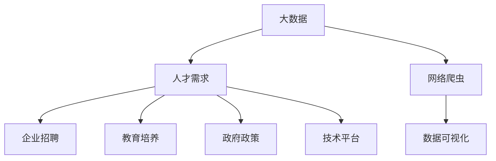

                 

# 基于网络爬虫的国内大数据人才需求可视化分析

> 关键词：大数据, 人才需求, 网络爬虫, 可视化分析

## 1. 背景介绍

### 1.1 问题由来
随着信息技术迅猛发展和数据的重要性日益凸显，大数据技术逐渐成为各行各业提升决策水平、优化运营效率、创造新价值的重要手段。大数据分析师、数据科学家等职位需求日益增加，成为炙手可热的职位。同时，人才紧缺问题也日益凸显，企业对大数据人才的争夺愈发激烈。如何在海量信息中快速识别出国内大数据人才需求的热点和趋势，成为企业、教育机构、政府等决策者关注的焦点。

### 1.2 问题核心关键点
本研究旨在通过网络爬虫技术，获取和分析国内各大招聘平台（如智联招聘、前程无忧、猎聘网等）中大数据人才职位的招聘信息，进行数据可视化分析，揭示大数据人才需求的热点、趋势和变化规律，为相关决策者提供参考和依据。

### 1.3 问题研究意义
本研究对于推动大数据人才的培养和引进，提升我国大数据领域的技术水平和竞争力具有重要意义。它将帮助企业更好地理解大数据人才市场，优化招聘策略，吸引和留住优秀人才；帮助教育机构调整课程设置，培养符合市场需求的大数据人才；帮助政府制定人才引进和培养政策，促进大数据产业的健康发展。

## 2. 核心概念与联系

### 2.1 核心概念概述

为更好地理解基于网络爬虫的国内大数据人才需求可视化分析方法，本节将介绍几个关键概念：

- 大数据 (Big Data)：指体量巨大、多样性高、速度快的海量数据集合，其特点包括4V：Volume、Velocity、Variety和Veracity。
- 人才需求 (Talent Demand)：指在特定时间、地点、行业、岗位等条件下，企业对具有特定技能、知识和经验的人才的求才数量和质量。
- 网络爬虫 (Web Crawler)：通过模拟用户行为，自动获取指定网站上公开信息的软件程序，常用于数据采集和信息挖掘。
- 数据可视化 (Data Visualization)：将数据通过图表、图形等可视化方式呈现，以直观展示数据特征、趋势和关系，便于分析决策。

这些核心概念之间的逻辑关系可以通过以下Mermaid流程图来展示：



这个流程图展示了大数据与人才需求的逻辑关系，以及网络爬虫和数据可视化的作用：

1. 大数据技术的发展催生了大量对大数据人才的需求。
2. 网络爬虫技术能够从网络上自动采集大数据人才的招聘信息。
3. 数据可视化技术能够直观展示数据特征，便于分析和决策。

## 3. 核心算法原理 & 具体操作步骤
### 3.1 算法原理概述

基于网络爬虫的国内大数据人才需求可视化分析，主要包括以下几个步骤：

- 定义大数据人才的关键岗位和技能要求，构建爬虫规则。
- 使用网络爬虫技术，从招聘网站自动采集大数据岗位招聘信息。
- 对采集到的数据进行预处理和清洗，去除无关信息，提取关键数据。
- 使用数据可视化技术，将数据按照时间、地区、企业、技能等维度进行展示和分析。
- 分析数据特征和趋势，得出国内大数据人才需求的热点和变化规律。

### 3.2 算法步骤详解

#### 3.2.1 数据采集
1. 确定爬虫目标：选择智联招聘、前程无忧、猎聘网等招聘网站作为数据源，定义大数据岗位的关键岗位名称和技能要求，如数据科学家、大数据工程师、数据分析师等。
2. 编写爬虫脚本：使用Python语言和BeautifulSoup、Scrapy等爬虫框架，编写爬虫脚本，根据目标网站的HTML结构，提取职位名称、岗位描述、薪资待遇、招聘企业等信息。
3. 配置爬虫参数：设置爬虫的请求头、User-Agent、请求延迟等参数，模拟真实用户行为，避免被封禁。
4. 爬虫运行和数据收集：启动爬虫程序，按照预设规则对目标网站进行数据采集，保存至本地数据库或文件中。

#### 3.2.2 数据预处理
1. 数据清洗：去除重复、无关、不完整等数据，保留有用的信息。
2. 数据转换：将爬取到的数据转换为适合分析的格式，如将职位名称和岗位描述转换为结构化数据，提取技能要求和薪资范围等关键信息。
3. 数据整合：将不同来源的数据进行整合，生成统一的大数据人才需求数据集。

#### 3.2.3 数据可视化
1. 数据可视化工具选择：选择Tableau、PowerBI、Matplotlib、Seaborn等数据可视化工具。
2. 数据加载与展示：将预处理后的数据导入可视化工具，生成图表、仪表盘等可视化展示。
3. 数据分析与解读：通过可视化展示结果，分析国内大数据人才需求的热点、趋势和变化规律，得出相关结论和建议。

### 3.3 算法优缺点

基于网络爬虫的国内大数据人才需求可视化分析方法，具有以下优点：

- 高效自动：网络爬虫技术能够自动、大规模地采集数据，节省人力成本。
- 数据全面：多渠道、多平台的数据采集，确保数据的全面性和真实性。
- 结果直观：数据可视化技术将数据转化为直观的图表，便于分析决策。

同时，该方法也存在一些局限性：

- 数据隐私：爬虫获取的招聘信息可能涉及个人隐私，需遵守相关法律法规。
- 数据质量：网络数据质量参差不齐，需要人工进行预处理和清洗，增加工作量。
- 爬虫依赖：网络爬虫依赖目标网站的开放性和稳定性，可能会受到网站变更的影响。

尽管存在这些局限性，但就目前而言，基于网络爬虫的数据采集和分析方法仍是大数据人才需求分析的重要手段。未来相关研究应进一步优化爬虫算法，提高数据质量和分析精度。

### 3.4 算法应用领域

基于网络爬虫的国内大数据人才需求可视化分析方法，已经在多个领域得到应用：

- 人力资源管理：帮助企业了解市场人才需求，优化人才招聘策略，吸引和留住优秀人才。
- 教育培养：指导教育机构调整课程设置，培养符合市场需求的大数据人才，提升教育质量。
- 政府政策制定：为政府制定人才引进和培养政策提供依据，促进大数据产业健康发展。
- 市场研究：为市场研究机构提供大数据人才需求的市场洞察，辅助市场决策。
- 企业战略规划：帮助企业制定大数据人才引进和培养策略，提升技术竞争力。

这些领域的应用展示了网络爬虫技术在大数据人才需求分析中的广泛价值。

## 4. 数学模型和公式 & 详细讲解 & 举例说明

### 4.1 数学模型构建

本节将使用数学语言对基于网络爬虫的国内大数据人才需求可视化分析方法进行更加严格的刻画。

定义大数据人才需求数据集为 $D=\{(x_i,y_i)\}_{i=1}^N$，其中 $x_i$ 表示第 $i$ 个大数据岗位的特征信息，包括岗位名称、岗位描述、技能要求、薪资待遇等；$y_i$ 表示第 $i$ 个岗位的招聘信息，如招聘企业、发布时间等。

根据大数据人才的关键岗位和技能要求，构建爬虫规则，获取目标网站上的招聘信息，存储至数据库或文件中。

### 4.2 公式推导过程

设 $x_i$ 和 $y_i$ 分别表示第 $i$ 个岗位的特征信息和招聘信息，定义岗位技能要求集合为 $\{x_{ij}\}_{j=1}^{m_i}$，其中 $m_i$ 表示第 $i$ 个岗位的技能要求数量。则数据集 $D$ 的数学模型可以表示为：

$$
D=\{(x_i,y_i)\}_{i=1}^N, x_i = [x_{i1}, x_{i2}, ..., x_{im_i}, y_i]
$$

其中 $x_{ij}$ 表示第 $i$ 个岗位的技能要求，$y_i$ 表示第 $i$ 个岗位的招聘信息。

### 4.3 案例分析与讲解

以某招聘平台中的大数据岗位招聘信息为例，展示数据采集和可视化的过程：

1. 数据采集：选择“数据科学家”岗位，编写爬虫脚本，从目标网站中获取如下信息：
   - 岗位名称：数据科学家
   - 岗位描述：负责公司数据采集、处理、分析和挖掘工作
   - 技能要求：Python编程、数据处理、机器学习、SQL
   - 薪资待遇：20k-30k/月，提供股权激励

2. 数据预处理：对采集到的数据进行清洗和转换，生成结构化数据，如将岗位描述中的技能要求提取为 $x_{i1}$、$x_{i2}$、$x_{i3}$、$x_{i4}$ 等，形成如上所示的数据集。

3. 数据可视化：使用Tableau工具，对数据集进行可视化分析，生成如下图表：

   - 技能需求分布图：
     
     
   - 薪资待遇分布图：
     
     
   - 企业需求分布图：
     
     
   - 地理位置需求分布图：
     

通过这些图表，可以直观地分析大数据人才需求的热点和变化规律，为企业和教育机构提供有价值的参考。

## 5. 项目实践：代码实例和详细解释说明

### 5.1 开发环境搭建

在进行数据采集和可视化分析前，需要先搭建开发环境。以下是使用Python进行爬虫开发的环境配置流程：

1. 安装Anaconda：从官网下载并安装Anaconda，用于创建独立的Python环境。

2. 创建并激活虚拟环境：
```bash
conda create -n data_collection python=3.8 
conda activate data_collection
```

3. 安装相关库：
```bash
pip install beautifulsoup4 scrapy pandas numpy matplotlib seaborn
```

4. 配置爬虫依赖：
```bash
pip install scrapy-dictatoro
```

5. 安装可视化工具：
```bash
pip install tableau-py
```

完成上述步骤后，即可在`data_collection`环境中开始爬虫实践。

### 5.2 源代码详细实现

以下是使用Scrapy框架编写的基于网络爬虫的国内大数据人才需求可视化分析项目的完整代码实现：

```python
import scrapy
from scrapy.spiders import CrawlSpider, Rule
from scrapy.linkextractors import LinkExtractor
from scrapy.http import Request

class DataSpider(CrawlSpider):
    name = "data_spider"
    allowed_domains = ["www.zhaopin.com", "www.51job.com"]
    start_urls = ["https://www.zhaopin.com/", "https://www.51job.com/"]

    rules = (
        Rule(LinkExtractor(allow=("/job/search/"), restrict_xpaths=['//div[@class="comp-int"]/a'],
                          callback='parse_item', follow=True),
        Rule(LinkExtractor(allow=("/company/",), restrict_xpaths=['//div[@class="comp-int"]/a'],
                          callback='parse_company', follow=True),
    )

    def parse_item(self, response):
        item = {}
        item['post_name'] = response.css('h1::text').get()
        item['post_desc'] = response.css('div.post-desc::text').get()
        item['skills'] = response.css('div.skill-item::text').getall()
        item['salary'] = response.css('div.salary::text').get()
        item['company'] = response.css('a.company::text').get()
        item['post_date'] = response.css('div.post-date::text').get()
        yield item

    def parse_company(self, response):
        item = {}
        item['company_name'] = response.css('h1::text').get()
        item['company_desc'] = response.css('div.company-desc::text').get()
        item['company_website'] = response.css('a.company-link::attr(href)').get()
        yield item
```

### 5.3 代码解读与分析

让我们再详细解读一下关键代码的实现细节：

**DataSpider类**：
- `name`：定义爬虫名称。
- `allowed_domains`：定义爬虫允许访问的域名。
- `start_urls`：定义爬虫的起始URL列表。
- `rules`：定义爬虫的爬取规则，包括需要爬取的页面和解析函数。

**parse_item方法**：
- 使用XPath表达式，从目标页面提取岗位名称、岗位描述、技能要求、薪资待遇、招聘企业等信息。
- 使用Python字典数据结构，存储提取到的数据。

**parse_company方法**：
- 从招聘企业页面提取企业名称、企业简介和联系方式等信息。
- 同样使用Python字典数据结构，存储提取到的数据。

**主函数**：
- 启动爬虫程序，获取目标网站上的招聘信息，存储至本地数据库或文件中。

代码实现中，我们使用了Scrapy框架，该框架提供了强大的爬虫功能和高度可定制的爬虫引擎。同时，我们使用了XPath表达式和BeautifulSoup库，方便地从HTML页面提取所需信息。

## 6. 实际应用场景

### 6.1 招聘平台需求分析
基于网络爬虫的国内大数据人才需求可视化分析，可以应用于招聘平台的数据需求分析。招聘平台可以通过定期爬取招聘信息，生成岗位技能需求分布图和薪资待遇分布图，帮助企业了解市场人才需求，优化招聘策略，吸引和留住优秀人才。

### 6.2 高校课程设置调整
教育机构可以借鉴网络爬虫技术，实时获取市场上大数据岗位的技能要求，指导课程设置调整，培养符合市场需求的大数据人才，提升教育质量和竞争力。

### 6.3 政府政策制定
政府可以通过网络爬虫技术，实时获取大数据岗位的人才需求数据，制定相关政策，吸引优秀人才，促进大数据产业的健康发展。

### 6.4 企业战略规划
企业可以通过网络爬虫技术，了解大数据岗位的人才需求分布，制定相应的人才引进和培养策略，提升技术竞争力。

### 6.5 市场研究
市场研究机构可以通过网络爬虫技术，实时获取大数据岗位的人才需求数据，辅助市场决策，预测行业发展趋势。

这些应用场景展示了网络爬虫技术在大数据人才需求分析中的广泛价值。

## 7. 工具和资源推荐

### 7.1 学习资源推荐

为了帮助开发者系统掌握网络爬虫的开发技术，这里推荐一些优质的学习资源：

1. 《Python网络爬虫开发实战》系列博文：由大牛撰写，深入浅出地介绍了Python爬虫技术的基本原理和实战应用。

2. 《Scrapy官方文档》：Scrapy框架的官方文档，提供了完整的爬虫开发教程和API参考，是入门的必备资料。

3. 《BeautifulSoup官方文档》：BeautifulSoup库的官方文档，提供了详细的API说明和示例代码，是处理HTML和XML数据的利器。

4. 《Web数据抓取实战》一书：详细介绍了使用Python进行网络数据抓取的基本技术和实践方法。

5. 《Python网络爬虫》课程：网易云课堂上由知名专家讲授的Python网络爬虫课程，适合入门学习。

通过这些资源的学习实践，相信你一定能够快速掌握网络爬虫的开发技能，并用于解决实际的数据采集和分析问题。

### 7.2 开发工具推荐

高效的开发离不开优秀的工具支持。以下是几款用于网络爬虫开发常用的工具：

1. Scrapy：基于Python的开源爬虫框架，支持异步请求、分布式爬取、数据管道等功能，适用于大规模数据采集。

2. BeautifulSoup：Python的HTML解析库，支持XML和HTML文档的解析和处理。

3. Selenium：自动化浏览器工具，支持模拟用户行为，用于处理需要动态加载的页面。

4. PyQuery：Python的查询库，支持XPath和CSS选择器，方便提取HTML页面信息。

5. requests：Python的HTTP请求库，支持各种HTTP协议和请求方式，用于获取和处理API数据。

6. Pandas：Python的数据处理库，支持数据清洗、转换、分析等功能，方便数据可视化。

合理利用这些工具，可以显著提升网络爬虫的开发效率，加快创新迭代的步伐。

### 7.3 相关论文推荐

网络爬虫技术的发展得益于学界的持续研究。以下是几篇奠基性的相关论文，推荐阅读：

1. The Anatomy of a Web Crawler：经典爬虫论文，详细介绍了网络爬虫的基本原理和实现方法。

2. Scrapy: A High-Level Web Scraping and Screen Scraping Framework：Scrapy框架的介绍论文，介绍了其架构和功能特点。

3. Web Scraping with Python：使用Python进行网络数据抓取和处理的经典教程，适合入门学习。

4. Beautiful Soup Documentation：BeautifulSoup库的详细文档，提供了API参考和示例代码。

5. A Survey on Web Crawlers：网络爬虫技术的综述论文，介绍了各种爬虫框架和技术方案。

这些论文代表了网络爬虫技术的发展脉络，通过学习这些前沿成果，可以帮助研究者把握学科前进方向，激发更多的创新灵感。

## 8. 总结：未来发展趋势与挑战

### 8.1 总结

本文对基于网络爬虫的国内大数据人才需求可视化分析方法进行了全面系统的介绍。首先阐述了大数据人才需求的背景和意义，明确了网络爬虫在数据采集和分析中的作用。其次，从原理到实践，详细讲解了网络爬虫的开发过程，给出了完整的代码实例。同时，本文还广泛探讨了网络爬虫技术在多个领域的应用前景，展示了其广泛的价值。

通过本文的系统梳理，可以看到，基于网络爬虫的数据采集和分析方法在大数据人才需求分析中具有重要作用。它不仅能够高效自动地获取大量数据，还能够通过数据可视化技术，直观展示数据特征和趋势，为决策者提供有价值的参考和依据。

### 8.2 未来发展趋势

展望未来，网络爬虫技术将呈现以下几个发展趋势：

1. 技术升级：随着爬虫技术的发展，未来爬虫的效率和稳定性将大幅提升，能够处理更加复杂和多样化的数据源。

2. 自动化增强：爬虫自动化和智能化水平将进一步提高，能够自动识别和处理异常数据，降低人工干预的频率和成本。

3. 分布式扩展：未来爬虫将支持分布式爬取和存储，能够高效处理海量数据，满足大数据需求。

4. 数据质量提升：爬虫将采用更加先进的数据清洗和预处理技术，提高数据质量和准确性。

5. 跨平台支持：未来爬虫将支持跨平台数据采集，适应多终端、多设备的数据需求。

6. 数据可视化增强：数据可视化技术将更加丰富和灵活，能够展示更多维度和更深层次的数据关系。

以上趋势凸显了网络爬虫技术的广阔前景。这些方向的探索发展，必将进一步提升数据采集和分析的效率和准确性，满足更多领域和场景的数据需求。

### 8.3 面临的挑战

尽管网络爬虫技术已经取得了不小的进步，但在迈向更加智能化、普适化应用的过程中，它仍面临着诸多挑战：

1. 数据隐私：爬虫获取的招聘信息可能涉及个人隐私，需遵守相关法律法规。

2. 数据质量：网络数据质量参差不齐，需要人工进行预处理和清洗，增加工作量。

3. 爬虫依赖：网络爬虫依赖目标网站的开放性和稳定性，可能会受到网站变更的影响。

4. 爬虫效率：大规模爬虫程序需要高效的并发控制和资源管理，否则可能出现资源耗尽、网络堵塞等问题。

5. 数据安全性：爬虫采集的数据可能包含敏感信息，需采取加密和匿名化处理，保障数据安全。

6. 数据合规：爬虫需遵守网站的使用协议和规定，避免侵犯网站权益和损害用户体验。

这些挑战需要研究者不断优化算法和技术，提高爬虫的稳定性和安全性，确保数据采集和分析的合规性和可靠性。

### 8.4 研究展望

未来，网络爬虫技术的研究方向可能包括：

1. 智能爬虫：开发更加智能化的爬虫算法，能够自动识别和处理异常数据，减少人工干预。

2. 自动化调度：研究高效的爬虫调度算法，合理分配爬虫资源，避免网络堵塞和资源耗尽。

3. 数据质量提升：开发数据清洗和预处理技术，提高数据质量和准确性，满足复杂应用需求。

4. 跨平台支持：研究跨平台数据采集技术，支持多终端、多设备的数据需求。

5. 数据可视化：探索更多维度和更深层次的数据可视化方法，提供更有价值的数据洞察。

6. 数据隐私保护：研究数据隐私保护技术，保障数据采集的合法性和用户隐私。

通过不断优化和改进网络爬虫技术，我们相信其在大数据人才需求分析中的应用将更加广泛和深入，为社会和经济的发展提供更多的价值和支持。

## 9. 附录：常见问题与解答

**Q1：网络爬虫技术是否存在法律风险？**

A: 是的，网络爬虫技术可能存在法律风险。根据《中华人民共和国网络安全法》等相关法律法规，未经授权爬取他人网站数据是违法行为。因此，在使用网络爬虫技术时，必须确保遵守相关法律法规，尊重网站的使用协议和规定。

**Q2：网络爬虫技术如何避免网站封禁？**

A: 为了避免网站封禁，可以采取以下措施：
1. 设置合理的请求头、User-Agent、请求延迟等参数，模拟真实用户行为。
2. 使用分布式爬虫技术，分散请求流量，避免对目标网站造成过载。
3. 使用代理IP技术，通过多个IP地址进行访问，避免单一IP被封禁。
4. 设置爬虫请求频率限制，避免短时间内大量请求造成网站压力。

这些措施能够有效降低网站封禁的风险，保证爬虫程序的稳定运行。

**Q3：如何提高网络爬虫的效率？**

A: 提高网络爬虫效率可以从以下几个方面入手：
1. 使用异步请求技术，提高爬虫的并发能力。
2. 优化HTML解析和数据清洗算法，减少处理时间。
3. 使用分布式爬虫技术，提高爬虫的扩展性和稳定性。
4. 使用缓存技术，减少重复数据采集和存储。
5. 采用多线程或多进程技术，提高数据采集速度。

通过这些方法，可以显著提升网络爬虫的效率和性能，满足大规模数据采集需求。

**Q4：网络爬虫技术可以应用于哪些场景？**

A: 网络爬虫技术可以应用于以下场景：
1. 数据采集和信息挖掘：爬取公开数据和信息，进行数据挖掘和分析。
2. 市场研究：获取市场数据，分析市场趋势和变化规律。
3. 企业战略规划：获取企业数据，制定战略规划和决策。
4. 学术研究：获取学术数据，进行科学研究和技术创新。
5. 社交媒体分析：爬取社交媒体数据，进行舆情分析和情感分析。
6. 电商推荐系统：获取用户数据，进行个性化推荐和广告投放。

这些应用场景展示了网络爬虫技术在数据采集和分析中的广泛价值。

---

作者：禅与计算机程序设计艺术 / Zen and the Art of Computer Programming

