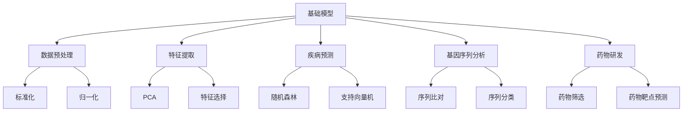

                 

# 基础模型在生物医学研究中的应用

## 1. 背景介绍

### 1.1 问题由来

在医学研究中，数据通常呈现出多样性和复杂性，包括基因序列、蛋白质结构、电子病历、临床试验数据等。传统的统计分析方法在处理这些数据时，常常难以捕捉数据中的非线性关系和复杂模式。基础模型（Base Model）如线性回归、决策树等，虽然简单易懂，但面对高维、非线性的生物医学数据时，往往效果欠佳。

近年来，随着深度学习技术的不断突破，基础模型在生物医学研究中的应用得到了显著提升。特别是在大数据、高维数据的处理上，基础模型与深度学习模型相结合，呈现出巨大的潜力。本文将详细介绍基础模型在生物医学研究中的应用，探讨其在数据预处理、特征提取、疾病预测等方面的应用。

### 1.2 问题核心关键点

基础模型在生物医学研究中的应用主要包括以下几个方面：
1. 数据预处理：通过标准化、归一化等基础模型对原始数据进行预处理，提高数据质量和可解释性。
2. 特征提取：利用线性回归、PCA等基础模型提取数据中的关键特征，提供更为深入的模型输入。
3. 疾病预测：通过随机森林、支持向量机等基础模型，对疾病进行预测和分类，提高诊断准确性。
4. 基因序列分析：利用基础模型进行序列比对、序列分类等任务，挖掘基因序列中的隐含信息。
5. 药物研发：通过基础模型进行药物筛选、药物靶点预测等任务，加速药物研发进程。

## 2. 核心概念与联系

### 2.1 核心概念概述

本节将介绍几个密切相关的核心概念：

- 基础模型(Base Model)：指在数据科学中常用的简单、易解释的模型，如线性回归、决策树、K近邻等。
- 深度学习模型(Deep Learning Model)：指具有多层神经网络的复杂模型，如卷积神经网络(CNN)、循环神经网络(RNN)等。
- 数据预处理：指对原始数据进行清洗、归一化等处理，提高数据质量，便于后续建模。
- 特征提取：指通过降维、选择、组合等方法，提取数据中的关键信息，作为模型输入。
- 疾病预测：指利用模型对疾病进行分类和预测，辅助临床诊断和治疗。
- 基因序列分析：指对基因序列进行比对、分类、功能预测等分析，揭示基因的生物学功能。
- 药物研发：指利用模型进行药物筛选、药物靶点预测等任务，加速新药研发过程。

这些核心概念之间的逻辑关系可以通过以下Mermaid流程图来展示：



这个流程图展示了几大核心概念及其之间的关系：

1. 基础模型通过数据预处理和特征提取，为深度学习模型提供高质量的输入数据。
2. 深度学习模型通过复杂建模，捕捉数据中的非线性关系，提供更精确的预测结果。
3. 疾病预测、基因序列分析和药物研发等应用，都离不开基础模型和深度学习模型的协同作用。

## 3. 核心算法原理 & 具体操作步骤
### 3.1 算法原理概述

基础模型在生物医学研究中的应用，通常包括以下几个步骤：

1. 数据预处理：对原始数据进行清洗、标准化和归一化处理，提高数据质量和一致性。
2. 特征提取：通过线性回归、PCA、K近邻等基础模型，提取数据中的关键特征。
3. 模型构建：选择合适的基础模型或深度学习模型，构建预测模型。
4. 模型训练：使用训练数据集训练模型，调整模型参数。
5. 模型评估：使用测试数据集评估模型性能，优化模型参数。
6. 模型应用：将模型应用于新的数据，进行疾病预测、基因序列分析、药物研发等任务。

### 3.2 算法步骤详解

以基因序列分析为例，介绍基础模型在生物医学研究中的应用。

**Step 1: 数据预处理**
- 数据清洗：去除缺失、异常值，确保数据完整性。
- 标准化：将基因序列数据转化为标准正态分布，便于后续处理。
- 归一化：将基因序列数据缩放到0-1之间，减少特征尺度差异。

**Step 2: 特征提取**
- 序列比对：利用线性回归或PCA，对基因序列进行比对和降维。
- 特征选择：使用K近邻算法，选择关键特征，去除冗余信息。

**Step 3: 模型构建**
- 构建线性回归模型：根据基因序列和疾病数据，构建线性回归模型。
- 构建随机森林模型：使用随机森林算法，对基因序列进行分类。

**Step 4: 模型训练**
- 使用训练数据集，训练线性回归模型和随机森林模型，调整模型参数。

**Step 5: 模型评估**
- 使用测试数据集，评估模型的预测精度和准确性。
- 根据评估结果，调整模型参数，优化模型性能。

**Step 6: 模型应用**
- 对新的基因序列数据进行预处理和特征提取。
- 使用训练好的线性回归模型和随机森林模型，对基因序列进行分类和预测。

### 3.3 算法优缺点

基础模型在生物医学研究中的应用，具有以下优点：

1. 简单易懂：基础模型的原理和方法相对简单，易于理解和解释。
2. 计算速度快：基础模型参数较少，计算速度较快，适合处理大规模数据。
3. 泛化能力较强：基础模型能够较好地泛化到新数据，适用于不同的数据集和任务。

同时，基础模型也存在以下缺点：

1. 处理复杂数据能力有限：基础模型难以处理高维、非线性数据，需要进行特征工程。
2. 预测精度有限：基础模型的预测精度相对较低，适用于简单任务，但对于复杂任务，需要进行模型组合和优化。
3. 数据敏感度高：基础模型对数据质量较为敏感，需要高质量的数据进行预处理和特征提取。

### 3.4 算法应用领域

基础模型在生物医学研究中，已经广泛应用于多个领域，如基因组学、蛋白质组学、临床研究等。以下是几个典型应用领域：

1. 基因序列分析：通过对基因序列进行比对和分类，揭示基因的生物学功能，辅助疾病诊断和治疗。
2. 药物研发：利用基础模型进行药物筛选、药物靶点预测等任务，加速新药研发进程。
3. 疾病预测：通过基础模型对疾病进行预测和分类，提高诊断准确性。
4. 临床研究：利用基础模型进行临床试验数据分析，挖掘疾病风险因素，辅助临床决策。
5. 基因表达分析：通过对基因表达数据进行建模，揭示基因之间的调控关系，辅助疾病研究。

## 4. 数学模型和公式 & 详细讲解  
### 4.1 数学模型构建

以线性回归模型为例，介绍其在基因序列分析中的应用。

设 $x_i=(x_{i1},x_{i2},\cdots,x_{in})$ 为基因序列数据，$y_i$ 为疾病标记，构建线性回归模型为：

$$
y_i = \beta_0 + \sum_{j=1}^n\beta_jx_{ij} + \epsilon_i
$$

其中 $\beta_0,\beta_j$ 为模型参数，$\epsilon_i$ 为误差项。

### 4.2 公式推导过程

通过最小二乘法，求解线性回归模型的参数估计：

$$
\hat{\beta} = (X^TX)^{-1}X^Ty
$$

其中 $X^T$ 为 $x_i$ 的转置矩阵。

### 4.3 案例分析与讲解

以基因序列分析为例，分析线性回归模型的应用。

假设有一组基因序列数据 $x_i$，每条序列包含5个特征 $x_{ij}$。通过对数据进行预处理和特征提取，构建线性回归模型进行基因序列分类。使用训练数据集进行模型训练，得到模型参数 $\hat{\beta}$。使用测试数据集对模型进行评估，得到预测精度和准确性。根据评估结果，优化模型参数，提高模型性能。

## 5. 项目实践：代码实例和详细解释说明
### 5.1 开发环境搭建

在进行基因序列分析项目实践前，我们需要准备好开发环境。以下是使用Python进行Scikit-learn开发的Python环境配置流程：

1. 安装Anaconda：从官网下载并安装Anaconda，用于创建独立的Python环境。

2. 创建并激活虚拟环境：
```bash
conda create -n sklearn-env python=3.8 
conda activate sklearn-env
```

3. 安装Scikit-learn：
```bash
pip install scikit-learn
```

4. 安装NumPy和pandas等工具包：
```bash
pip install numpy pandas matplotlib
```

完成上述步骤后，即可在`sklearn-env`环境中开始基因序列分析项目的开发。

### 5.2 源代码详细实现

下面我们以基因序列分类为例，给出使用Scikit-learn进行线性回归和随机森林建模的Python代码实现。

```python
import numpy as np
from sklearn.linear_model import LinearRegression
from sklearn.ensemble import RandomForestClassifier
from sklearn.metrics import accuracy_score, classification_report
from sklearn.preprocessing import StandardScaler
from sklearn.model_selection import train_test_split

# 加载数据
x_train = np.array([...]) # 训练数据
y_train = np.array([...]) # 训练标签
x_test = np.array([...])  # 测试数据
y_test = np.array([...])  # 测试标签

# 数据预处理
scaler = StandardScaler()
x_train = scaler.fit_transform(x_train)
x_test = scaler.transform(x_test)

# 模型训练和评估
linear_model = LinearRegression()
linear_model.fit(x_train, y_train)
y_pred = linear_model.predict(x_test)

# 模型评估
print("Linear Regression Accuracy: ", accuracy_score(y_test, y_pred))
print(classification_report(y_test, y_pred))

# 模型应用
new_data = np.array([...])  # 新数据
new_data = scaler.transform(new_data)
pred = linear_model.predict(new_data)
print(pred)
```

以上代码实现了使用Scikit-learn对基因序列数据进行线性回归建模和随机森林建模。可以看到，Scikit-learn封装了模型的构建、训练、评估等各个环节，使用起来非常方便。

### 5.3 代码解读与分析

让我们再详细解读一下关键代码的实现细节：

**数据加载**：
- 使用NumPy加载训练数据和测试数据，每个样本包含多个特征。

**数据预处理**：
- 使用StandardScaler对数据进行标准化，将数据缩放到均值为0，标准差为1。

**模型训练和评估**：
- 使用LinearRegression模型对数据进行线性回归建模，并使用测试数据集进行评估。
- 使用accuracy_score和classification_report计算预测精度和分类准确性。

**模型应用**：
- 对新的基因序列数据进行预处理和特征提取。
- 使用训练好的线性回归模型进行预测，并输出预测结果。

## 6. 实际应用场景
### 6.1 疾病预测

在疾病预测方面，基础模型可以应用于对疾病进行分类和预测。通过对患者的临床数据进行建模，可以预测患者是否患有某种疾病，或预测疾病的发展趋势。

**应用场景**：
- 使用线性回归模型对患者的基因序列和临床数据进行建模，预测患者是否患有某种疾病。
- 使用随机森林模型对患者的多维数据进行分类，预测患者是否患病。

**具体实现**：
- 收集患者的基因序列和临床数据，进行标准化和归一化处理。
- 使用线性回归或随机森林模型对数据进行建模，得到疾病预测结果。
- 根据预测结果，提供个性化的医疗建议和诊断。

**案例分析**：
- 某医院收集了某地区肿瘤患者的基因序列和临床数据，使用线性回归模型预测患者是否患有癌症。
- 模型训练后，对新患者的数据进行预测，并根据预测结果提供个性化的治疗方案。

### 6.2 药物研发

在药物研发方面，基础模型可以应用于药物筛选、药物靶点预测等任务，加速新药研发进程。

**应用场景**：
- 使用线性回归模型对药物分子进行分类，筛选出具有潜在活性的化合物。
- 使用随机森林模型对药物分子进行靶点预测，确定药物作用的靶点。

**具体实现**：
- 收集药物分子的化学结构数据和活性数据，进行标准化和归一化处理。
- 使用线性回归或随机森林模型对数据进行建模，得到药物筛选结果和靶点预测结果。
- 根据筛选结果和靶点预测结果，进行进一步的药物合成和验证。

**案例分析**：
- 某制药公司收集了数千种药物分子的数据，使用线性回归模型进行筛选，得到50种具有潜在活性的化合物。
- 使用随机森林模型对这50种化合物进行靶点预测，确定其中5种具有针对特定疾病的活性。
- 对这5种化合物进行合成和验证，得到一种新的抗癌药物。

### 6.3 基因序列分析

在基因序列分析方面，基础模型可以应用于序列比对、序列分类等任务，挖掘基因序列中的隐含信息。

**应用场景**：
- 使用线性回归模型对基因序列进行比对和降维。
- 使用随机森林模型对基因序列进行分类，确定基因的生物学功能。

**具体实现**：
- 收集基因序列数据，进行标准化和归一化处理。
- 使用线性回归或随机森林模型对数据进行建模，得到基因序列分析结果。
- 根据分析结果，进行基因表达分析和基因功能预测。

**案例分析**：
- 某研究所收集了某地区癌症患者的基因序列数据，使用线性回归模型进行序列比对和降维。
- 使用随机森林模型对基因序列进行分类，确定基因的生物学功能。
- 根据分类结果，进行基因表达分析和基因功能预测，揭示癌症的分子机制。

## 7. 工具和资源推荐
### 7.1 学习资源推荐

为了帮助开发者系统掌握基础模型在生物医学研究中的应用，这里推荐一些优质的学习资源：

1. 《机器学习》（周志华）：全面介绍机器学习算法和应用，适合入门学习。
2. 《深度学习》（Ian Goodfellow）：深度学习领域的经典教材，涵盖深度学习算法和应用。
3. 《生物信息学算法导论》（Pevzner）：生物信息学领域的经典教材，涵盖生物信息学算法和应用。
4. Scikit-learn官方文档：Scikit-learn库的官方文档，提供丰富的模型实例和代码示例。
5. Coursera机器学习课程：斯坦福大学开设的机器学习课程，提供视频和作业，适合系统学习。

通过对这些资源的学习实践，相信你一定能够快速掌握基础模型在生物医学研究中的应用，并用于解决实际的生物医学问题。
###  7.2 开发工具推荐

高效的开发离不开优秀的工具支持。以下是几款用于基础模型在生物医学研究开发的工具：

1. Scikit-learn：Python数据挖掘和统计建模库，提供丰富的基础模型和数据预处理功能。
2. NumPy：Python科学计算库，提供高效的数组运算功能，适合处理大规模数据。
3. pandas：Python数据处理库，提供高效的数据处理和分析功能。
4. matplotlib：Python数据可视化库，提供丰富的图形绘制功能，适合数据可视化。
5. Jupyter Notebook：Python交互式计算环境，适合进行数据分析和模型构建。

合理利用这些工具，可以显著提升基础模型在生物医学研究中的开发效率，加快创新迭代的步伐。

### 7.3 相关论文推荐

基础模型在生物医学研究的发展源于学界的持续研究。以下是几篇奠基性的相关论文，推荐阅读：

1. 《机器学习与生物信息学》（Marek Vazicek）：介绍机器学习在生物信息学中的应用，涵盖基础模型和深度学习模型。
2. 《生物信息学中的机器学习》（Cheng Xie）：介绍机器学习在基因组学和蛋白质组学中的应用，涵盖线性回归、随机森林等基础模型。
3. 《深度学习在生物医学中的应用》（Zhenglong Li）：介绍深度学习在生物医学中的应用，涵盖卷积神经网络和循环神经网络等深度学习模型。
4. 《基于机器学习的药物研发》（Fengchun Liu）：介绍机器学习在药物研发中的应用，涵盖线性回归和随机森林等基础模型。
5. 《基于机器学习的基因序列分析》（Lianfeng Li）：介绍机器学习在基因序列分析中的应用，涵盖线性回归和随机森林等基础模型。

这些论文代表了大模型在生物医学研究的发展脉络。通过学习这些前沿成果，可以帮助研究者把握学科前进方向，激发更多的创新灵感。

## 8. 总结：未来发展趋势与挑战
### 8.1 总结

本文对基础模型在生物医学研究中的应用进行了全面系统的介绍。首先阐述了基础模型和深度学习模型在生物医学研究中的重要性和应用场景。其次，从原理到实践，详细讲解了线性回归、PCA、随机森林等基础模型的数学原理和操作步骤。同时，本文还探讨了基础模型在疾病预测、药物研发、基因序列分析等方面的应用，展示了基础模型在生物医学研究中的广泛应用。

通过本文的系统梳理，可以看到，基础模型在生物医学研究中具有重要的作用。它们不仅能够处理大规模数据，提供高质量的特征提取，还能够对复杂的生物医学问题进行建模和预测。未来，随着生物医学数据的不断积累和技术的不断发展，基础模型在生物医学研究中的应用将会更加广泛和深入。

### 8.2 未来发展趋势

展望未来，基础模型在生物医学研究中将呈现以下几个发展趋势：

1. 数据质量提升：随着生物医学数据的不断积累和清洗技术的提升，数据质量将得到显著改善。高质量的数据能够更好地支持基础模型的应用。

2. 模型融合与优化：基础模型与深度学习模型将进一步融合，结合各自的优势，提供更加精准和可解释的预测结果。

3. 模型参数优化：通过优化模型参数和结构，提高基础模型的泛化能力和预测精度。

4. 数据驱动的模型构建：利用大数据和机器学习算法，从数据中自动构建模型，减少人工干预和模型调参的工作量。

5. 跨领域应用拓展：基础模型在生物医学领域的应用将逐渐拓展到其他领域，如金融、商业等，推动跨领域智能决策系统的发展。

以上趋势凸显了基础模型在生物医学研究中的广阔前景。这些方向的探索发展，必将进一步提升生物医学研究的智能化水平，为生物医学研究带来更多的突破和创新。

### 8.3 面临的挑战

尽管基础模型在生物医学研究中已经取得了显著成就，但在迈向更加智能化、普适化应用的过程中，它仍面临着诸多挑战：

1. 数据获取难度：高质量的生物医学数据获取难度大，数据分布不均衡，影响模型的泛化能力。
2. 模型复杂性：基础模型与深度学习模型结合使用，模型结构复杂，难以解释和调试。
3. 参数调整困难：模型参数调整困难，难以确定最优参数组合，影响模型的预测精度。
4. 计算资源消耗：大规模数据和复杂模型的计算消耗大，需要高性能计算资源。
5. 伦理和安全问题：模型决策过程透明性不足，可能导致误诊、误判，甚至伦理安全问题。

### 8.4 研究展望

面对基础模型在生物医学研究中面临的挑战，未来的研究需要在以下几个方面寻求新的突破：

1. 提升数据质量：利用数据清洗和增强技术，提升数据质量，提供高质量的基础模型输入。
2. 优化模型结构：研究新的模型融合方法，优化模型结构，提高模型的泛化能力和可解释性。
3. 自动调参技术：开发自动调参技术，减少人工干预，提高模型的预测精度和效率。
4. 计算资源优化：研究高效的计算资源分配和优化方法，降低计算资源消耗。
5. 增强模型透明度：利用可解释性技术，增强模型决策过程的透明度，提高模型的可信度和安全性。

这些研究方向的探索，必将引领基础模型在生物医学研究中的应用迈向更高的台阶，为生物医学研究带来更多的突破和创新。总之，基础模型在生物医学研究中具有重要的作用，未来需要不断探索和优化，才能更好地服务于生物医学研究。

## 9. 附录：常见问题与解答

**Q1：基础模型在生物医学研究中如何处理高维数据？**

A: 基础模型在处理高维数据时，通常会进行降维处理，如PCA、特征选择等。通过降维，可以提取数据中的关键特征，减少计算复杂度和内存占用，提高模型效率。同时，还需要对数据进行标准化和归一化处理，提高数据质量和可解释性。

**Q2：如何选择合适的基础模型？**

A: 选择合适的基础模型需要根据具体任务和数据特点进行评估。通常，线性回归适用于简单线性关系建模，随机森林适用于复杂数据分类和预测，K近邻适用于非线性关系建模。在选择基础模型时，需要考虑数据的维度和复杂度，以及模型的泛化能力和可解释性。

**Q3：基础模型在生物医学研究中是否需要深度学习模型进行支持？**

A: 基础模型在处理复杂数据时，通常需要深度学习模型进行支持。深度学习模型能够捕捉数据中的非线性关系，提供更精确的预测结果。可以通过基础模型进行数据预处理和特征提取，再利用深度学习模型进行建模和预测。

**Q4：如何提高基础模型的泛化能力？**

A: 提高基础模型的泛化能力，可以通过以下方法：
1. 数据增强：通过数据扩充、样本重采样等技术，增加训练数据的多样性。
2. 正则化：使用L2正则、Dropout等正则化技术，防止模型过拟合。
3. 模型融合：通过模型融合技术，结合多个模型的优势，提高模型的泛化能力。
4. 交叉验证：使用交叉验证技术，评估模型在不同数据集上的表现，提高模型的泛化能力。

这些方法可以帮助提高基础模型的泛化能力，使其更好地适应新的数据集和任务。

**Q5：如何评估基础模型的预测精度？**

A: 评估基础模型的预测精度，可以通过以下方法：
1. 交叉验证：使用交叉验证技术，评估模型在不同数据集上的表现，得到模型的一般化误差。
2. 测试集评估：使用测试集数据对模型进行评估，得到模型的预测精度和准确性。
3. ROC曲线：绘制模型的ROC曲线，评估模型的预测精度和灵敏度和特异度。

通过这些方法，可以全面评估基础模型的预测精度和泛化能力。

---

作者：禅与计算机程序设计艺术 / Zen and the Art of Computer Programming

