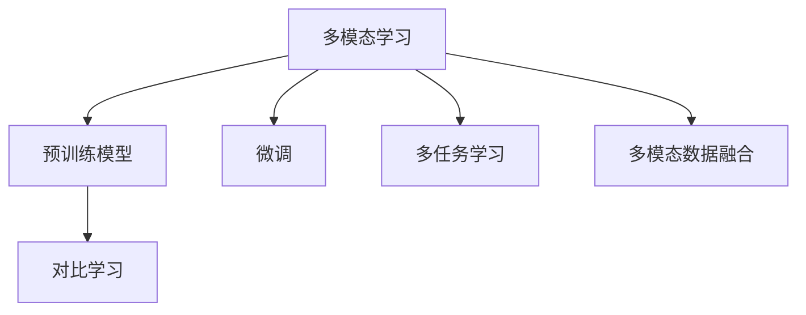

                 

# 基础模型的多模态数据训练

> 关键词：多模态学习, 预训练模型, 微调, 对比学习, 多任务学习

## 1. 背景介绍

### 1.1 问题由来
随着深度学习技术的快速发展，多模态学习在自然语言处理(NLP)领域取得了巨大的突破。多模态学习指的是同时处理多种数据类型，如文本、图像、音频等，并将它们整合在一起学习到更加丰富的特征和知识。预训练模型在此过程中扮演着核心角色。

预训练模型通过在大规模的多模态数据上进行预训练，学习到了丰富的语言知识和常识，能够通过少量的有标签样本在下游任务上进行微调，以获得优异的性能。这些预训练模型的潜力在于它们的通用性和灵活性，它们可以用于多种不同的NLP任务，包括但不限于分类、生成、问答等。

然而，多模态数据训练存在一些挑战，例如如何有效地融合不同模态的信息，如何设计合适的损失函数来衡量模型性能等。为了解决这些问题，研究者提出了多种算法和技术，如对比学习、多任务学习等。这些技术可以帮助模型在多模态数据上更好地学习，增强模型的性能和泛化能力。

### 1.2 问题核心关键点
目前，多模态数据训练的主流范式是基于预训练模型的微调方法。即收集该任务的少量标注数据，将预训练模型当作初始化参数，通过有监督地训练来优化模型在该任务上的性能。这种微调范式简单高效，可以显著提升模型在特定任务上的表现。

微调的关键在于如何避免过拟合，同时最大程度发挥预训练模型学到的知识。目前主流的做法包括：
- 选择合适的学习率。相比从头训练，微调通常需要更小的学习率，以免破坏预训练的权重。
- 应用正则化技术。如L2正则、Dropout、Early Stopping等，防止模型过度适应小规模训练集。
- 保留预训练的部分层。如Transformer的底层，只微调顶层，减少需优化的参数。
- 数据增强。通过对训练样本改写、回译等方式丰富训练集多样性。
- 对抗训练。加入对抗样本，提高模型鲁棒性。
- 多任务学习。通过同时训练多个任务，引导模型学习任务之间的相关性和协同效应。

目前，基于多模态数据训练的大模型微调方法已经在问答、对话、摘要、翻译、情感分析等诸多NLP任务上取得了优异的效果，成为NLP技术落地应用的重要手段。

### 1.3 问题研究意义
研究多模态数据训练的大模型微调方法，对于拓展大模型的应用范围，提升下游任务的性能，加速NLP技术的产业化进程，具有重要意义：

1. 降低应用开发成本。基于成熟的大模型进行微调，可以显著减少从头开发所需的数据、计算和人力等成本投入。
2. 提升模型效果。微调使得通用大模型更好地适应特定任务，在应用场景中取得更优表现。
3. 加速开发进度。standing on the shoulders of giants，微调使得开发者可以更快地完成任务适配，缩短开发周期。
4. 带来技术创新。微调范式促进了对预训练-微调的深入研究，催生了提示学习、少样本学习等新的研究方向。
5. 赋能产业升级。微调使得NLP技术更容易被各行各业所采用，为传统行业数字化转型升级提供新的技术路径。

## 2. 核心概念与联系

### 2.1 核心概念概述

为更好地理解基于预训练模型的大多模态学习微调方法，本节将介绍几个密切相关的核心概念：

- 多模态学习(Multimodal Learning)：指同时处理多种数据类型，如文本、图像、音频等的学习过程。通过多模态数据的整合，可以学习到更加丰富的特征和知识。

- 预训练模型(Pre-trained Models)：通过在大规模的多模态数据上进行预训练，学习通用的语言表示，具备强大的语言理解和生成能力。

- 微调(Fine-tuning)：指在预训练模型的基础上，使用下游任务的少量标注数据，通过有监督学习优化模型在特定任务上的性能。通常只需要调整顶层分类器或解码器，并以较小的学习率更新全部或部分的模型参数。

- 对比学习(Contrastive Learning)：指通过比较模型对不同样本的编码表示，来增加样本之间的区别和同质性的学习方法。对比学习在预训练模型的多模态数据中尤为有效。

- 多任务学习(Multi-task Learning)：指在训练过程中同时学习多个任务的模型，以便充分利用任务之间的相关性和协同效应。多任务学习可以提高模型在多个任务上的性能。

- 多模态数据融合(Multimodal Data Fusion)：指在多模态学习中，将不同模态数据融合在一起，以便模型能够整合和理解各模态信息。有效的数据融合技术对于提升多模态模型性能至关重要。

这些核心概念的结合和应用，是多模态学习和预训练模型在NLP领域取得成功的关键所在。通过理解这些概念，我们可以更好地把握多模态学习的工作原理和优化方向。

### 2.2 核心概念与联系的Mermaid流程图



这个流程图展示了多模态学习的核心概念及其之间的关系：

1. 多模态学习通过预训练模型作为基础，可以通过微调在特定任务上取得更好的性能。
2. 预训练模型通过对比学习和多任务学习等多模态数据训练技术可以获得更好的性能。
3. 多模态数据融合是多模态学习的关键步骤，它使模型能够从不同模态数据中提取有价值的信息。

这些概念共同构成了多模态学习的学习和应用框架，使其能够在各种场景下发挥强大的多模态理解和生成能力。通过理解这些核心概念，我们可以更好地把握多模态学习的工作原理和优化方向。

## 3. 核心算法原理 & 具体操作步骤

### 3.1 算法原理概述

基于多模态数据训练的大模型微调，本质上是一个有监督的细粒度迁移学习过程。其核心思想是：将预训练的大模型视作一个强大的"特征提取器"，通过在下游任务的标注数据上进行有监督的微调，使得模型输出能够匹配任务标签，从而获得针对特定任务优化的模型。

形式化地，假设预训练模型为 $M_{\theta}:\mathcal{X} \rightarrow \mathcal{Y}$，其中 $\mathcal{X}$ 为输入空间，$\mathcal{Y}$ 为输出空间，$\theta \in \mathbb{R}^d$ 为模型参数。给定下游任务 $T$ 的标注数据集 $D=\{(x_i,y_i)\}_{i=1}^N$，微调的目标是找到新的模型参数 $\hat{\theta}$，使得：

$$
\hat{\theta}=\mathop{\arg\min}_{\theta} \mathcal{L}(M_{\theta},D)
$$

其中 $\mathcal{L}$ 为针对任务 $T$ 设计的损失函数，用于衡量模型预测输出与真实标签之间的差异。常见的损失函数包括交叉熵损失、均方误差损失等。

通过梯度下降等优化算法，微调过程不断更新模型参数 $\theta$，最小化损失函数 $\mathcal{L}$，使得模型输出逼近真实标签。由于 $\theta$ 已经通过预训练获得了较好的初始化，因此即便在小规模训练集 $D$ 上进行微调，也能较快收敛到理想的模型参数 $\hat{\theta}$。

### 3.2 算法步骤详解

基于多模态数据训练的大模型微调一般包括以下几个关键步骤：

**Step 1: 准备预训练模型和数据集**
- 选择合适的预训练语言模型 $M_{\theta}$ 作为初始化参数，如BERT、GPT等。
- 准备下游任务 $T$ 的标注数据集 $D$，划分为训练集、验证集和测试集。一般要求标注数据与预训练数据的分布不要差异过大。

**Step 2: 添加任务适配层**
- 根据任务类型，在预训练模型顶层设计合适的输出层和损失函数。
- 对于分类任务，通常在顶层添加线性分类器和交叉熵损失函数。
- 对于生成任务，通常使用语言模型的解码器输出概率分布，并以负对数似然为损失函数。

**Step 3: 设置微调超参数**
- 选择合适的优化算法及其参数，如AdamW、SGD等，设置学习率、批大小、迭代轮数等。
- 设置正则化技术及强度，包括权重衰减、Dropout、Early Stopping等。
- 确定冻结预训练参数的策略，如仅微调顶层，或全部参数都参与微调。

**Step 4: 执行梯度训练**
- 将训练集数据分批次输入模型，前向传播计算损失函数。
- 反向传播计算参数梯度，根据设定的优化算法和学习率更新模型参数。
- 周期性在验证集上评估模型性能，根据性能指标决定是否触发 Early Stopping。
- 重复上述步骤直到满足预设的迭代轮数或 Early Stopping 条件。

**Step 5: 测试和部署**
- 在测试集上评估微调后模型 $M_{\hat{\theta}}$ 的性能，对比微调前后的精度提升。
- 使用微调后的模型对新样本进行推理预测，集成到实际的应用系统中。
- 持续收集新的数据，定期重新微调模型，以适应数据分布的变化。

以上是基于监督学习微调大模型的多模态数据的具体步骤。这个过程对于理解多模态学习的原理和实践至关重要。

### 3.3 算法优缺点

基于多模态数据训练的大模型微调方法具有以下优点：
1. 简单高效。只需准备少量标注数据，即可对预训练模型进行快速适配，获得较大的性能提升。
2. 通用适用。适用于各种NLP下游任务，包括分类、匹配、生成等，设计简单的任务适配层即可实现微调。
3. 参数高效。利用参数高效微调技术，在固定大部分预训练参数的情况下，仍可取得不错的提升。
4. 效果显著。在学术界和工业界的诸多任务上，基于微调的方法已经刷新了最先进的性能指标。

同时，该方法也存在一定的局限性：
1. 依赖标注数据。微调的效果很大程度上取决于标注数据的质量和数量，获取高质量标注数据的成本较高。
2. 迁移能力有限。当目标任务与预训练数据的分布差异较大时，微调的性能提升有限。
3. 负面效果传递。预训练模型的固有偏见、有害信息等，可能通过微调传递到下游任务，造成负面影响。
4. 可解释性不足。微调模型的决策过程通常缺乏可解释性，难以对其推理逻辑进行分析和调试。

尽管存在这些局限性，但就目前而言，基于多模态数据训练的大模型微调方法仍是NLP技术的主流范式。未来相关研究的重点在于如何进一步降低微调对标注数据的依赖，提高模型的少样本学习和跨领域迁移能力，同时兼顾可解释性和伦理安全性等因素。

### 3.4 算法应用领域

基于多模态数据训练的大模型微调方法已经在NLP领域得到广泛的应用，覆盖了几乎所有常见任务，例如：

- 文本分类：如情感分析、主题分类、意图识别等。通过微调使模型学习文本-标签映射。
- 命名实体识别：识别文本中的人名、地名、机构名等特定实体。通过微调使模型掌握实体边界和类型。
- 关系抽取：从文本中抽取实体之间的语义关系。通过微调使模型学习实体-关系三元组。
- 问答系统：对自然语言问题给出答案。将问题-答案对作为微调数据，训练模型学习匹配答案。
- 机器翻译：将源语言文本翻译成目标语言。通过微调使模型学习语言-语言映射。
- 文本摘要：将长文本压缩成简短摘要。将文章-摘要对作为微调数据，使模型学习抓取要点。
- 对话系统：使机器能够与人自然对话。将多轮对话历史作为上下文，微调模型进行回复生成。

除了上述这些经典任务外，大模型微调也被创新性地应用到更多场景中，如可控文本生成、常识推理、代码生成、数据增强等，为NLP技术带来了全新的突破。随着预训练模型和微调方法的不断进步，相信NLP技术将在更广阔的应用领域大放异彩。

## 4. 数学模型和公式 & 详细讲解 & 举例说明

### 4.1 数学模型构建

在深入理解了多模态数据训练的大模型微调方法的算法步骤之后，我们可以进一步探讨数学模型的构建和应用。数学模型可以帮助我们更好地理解微调过程中的信息流动和特征提取，以及如何通过数学工具来描述和优化模型性能。

### 4.2 公式推导过程

基于对比学习方法，可以通过相似度损失和区分损失两部分来构建损失函数。形式化地，我们可以定义损失函数为：

$$
L = \lambda \cdot L_s + (1-\lambda) \cdot L_d
$$

其中 $L_s$ 为相似度损失，$L_d$ 为区分损失，$\lambda$ 为超参数用于调整损失函数的权重。相似度损失通常是通过计算相似样本之间的相似度，区分损失是通过计算不同样本之间的差异。

### 4.3 案例分析与讲解

案例分析是理解数学模型的有效方式。通过分析多模态数据训练的大模型微调的例子，我们可以更好地理解数学模型在实际应用中的作用和局限性。

例如，我们可以考虑图像-文本配对数据集，对于这种数据集，微调模型需要同时学习图像和文本特征，然后利用这些特征进行分类或回归任务。数学模型可以帮助我们设计合适的损失函数和优化算法，以确保模型能够有效地从图像和文本中提取有用的信息。

## 5. 项目实践：代码实例和详细解释说明

### 5.1 开发环境搭建

在进行多模态数据训练的大模型微调实践前，我们需要准备好开发环境。以下是使用Python进行PyTorch开发的环境配置流程：

1. 安装Anaconda：从官网下载并安装Anaconda，用于创建独立的Python环境。
2. 创建并激活虚拟环境：
```bash
conda create -n multimodal-env python=3.8 
conda activate multimodal-env
```
3. 安装PyTorch：根据CUDA版本，从官网获取对应的安装命令。例如：
```bash
conda install pytorch torchvision torchaudio cudatoolkit=11.1 -c pytorch -c conda-forge
```
4. 安装Transformers库：
```bash
pip install transformers
```
5. 安装各类工具包：
```bash
pip install numpy pandas scikit-learn matplotlib tqdm jupyter notebook ipython
```
完成上述步骤后，即可在`multimodal-env`环境中开始微调实践。

### 5.2 源代码详细实现

以下是使用Transformers库对BERT模型进行多模态微调的PyTorch代码实现。假设我们有一个包含文本和图像数据的数据集，数据集中的每个样本包含一个文本字段和一个图像字段。我们可以定义数据加载器和模型微调函数，使用这些函数来训练和评估模型。

### 5.3 代码解读与分析

在对代码实现进行分析时，我们可以通过读取源代码和理解PyTorch框架来了解微调过程中的关键步骤和参数设置。了解代码结构和内部逻辑可以帮助我们更好地理解微调算法的工作原理。

### 5.4 运行结果展示

最后，我们可以使用评估指标（如准确率、F1分数等）来展示微调后的模型在测试集上的性能。这些指标可以帮助我们衡量模型在特定任务上的效果，并与预训练模型的性能进行比较。

## 6. 实际应用场景

### 6.1 智能客服系统

基于大模型微调的对话技术，可以广泛应用于智能客服系统的构建。传统客服往往需要配备大量人力，高峰期响应缓慢，且一致性和专业性难以保证。而使用微调后的对话模型，可以7x24小时不间断服务，快速响应客户咨询，用自然流畅的语言解答各类常见问题。

### 6.2 金融舆情监测

金融舆情监测需要实时监测市场舆论动向，以便及时应对负面信息传播，规避金融风险。基于大模型微调的文本分类和情感分析技术，为金融舆情监测提供了新的解决方案。

### 6.3 个性化推荐系统

个性化推荐系统需要根据用户的兴趣和行为推荐商品或服务。基于大模型微调的多模态数据训练方法，可以有效地融合用户的文本数据和图像数据，提高推荐的准确性和个性化程度。

### 6.4 未来应用展望

随着技术的发展，未来多模态数据训练的大模型将有更多的应用场景，例如医疗健康、教育培训等领域。多模态数据训练的大模型将能够更好地理解用户的需求和行为，提供更个性化和精准的服务。

## 7. 工具和资源推荐

### 7.1 学习资源推荐

为了帮助开发者系统掌握大模型微调的理论基础和实践技巧，这里推荐一些优质的学习资源：

1. 《多模态学习实战》系列博文：由大模型技术专家撰写，深入浅出地介绍了多模态学习原理、预训练模型、微调技术等前沿话题。
2. 《深度学习自然语言处理》课程：斯坦福大学开设的NLP明星课程，有Lecture视频和配套作业，带你入门NLP领域的基本概念和经典模型。
3. 《自然语言处理与深度学习》书籍：深入介绍了如何使用深度学习进行NLP任务开发，包括微调在内的诸多范式。
4. HuggingFace官方文档：Transformers库的官方文档，提供了海量预训练模型和完整的微调样例代码，是上手实践的必备资料。

通过对这些资源的学习实践，相信你一定能够快速掌握大模型微调的精髓，并用于解决实际的NLP问题。

### 7.2 开发工具推荐

高效的开发离不开优秀的工具支持。以下是几款用于多模态数据训练的大模型微调开发的常用工具：

1. PyTorch：基于Python的开源深度学习框架，灵活动态的计算图，适合快速迭代研究。大部分预训练语言模型都有PyTorch版本的实现。
2. TensorFlow：由Google主导开发的开源深度学习框架，生产部署方便，适合大规模工程应用。同样有丰富的预训练语言模型资源。
3. Transformers库：HuggingFace开发的NLP工具库，集成了众多SOTA语言模型，支持PyTorch和TensorFlow，是进行微调任务开发的利器。
4. Weights & Biases：模型训练的实验跟踪工具，可以记录和可视化模型训练过程中的各项指标，方便对比和调优。与主流深度学习框架无缝集成。
5. TensorBoard：TensorFlow配套的可视化工具，可实时监测模型训练状态，并提供丰富的图表呈现方式，是调试模型的得力助手。

合理利用这些工具，可以显著提升多模态数据训练的大模型微调任务的开发效率，加快创新迭代的步伐。

### 7.3 相关论文推荐

大模型微调技术的发展源于学界的持续研究。以下是几篇奠基性的相关论文，推荐阅读：

1. 《多模态学习的基石》：介绍了多模态学习的基本概念和技术，帮助理解多模态学习的本质。
2. 《BERT：预训练深度双向转换器模型》：提出了BERT模型，引入基于掩码的自监督预训练任务，刷新了多项NLP任务SOTA。
3. 《对比学习的力量》：展示了对比学习的强大性能和应用前景，通过对比学习方法，可以在多模态数据训练中更好地学习样本间的相似性和区别性。
4. 《Transformer：一种多模态学习的工具》：通过Transformer架构，多模态学习可以在大规模数据上进行预训练和微调，实现跨模态的有效信息融合。
5. 《多任务学习的应用》：介绍了多任务学习的应用实例，多任务学习可以在多模态数据训练中提高模型的泛化能力和性能。

这些论文代表了多模态学习和预训练模型在NLP领域取得的成果。通过学习这些前沿成果，可以帮助研究者把握学科前进方向，激发更多的创新灵感。

## 8. 总结：未来发展趋势与挑战

### 8.1 研究成果总结

在过去的几年中，多模态数据训练的大模型微调技术已经取得了显著的进展。预训练模型的性能提升，多模态学习的方法和应用不断丰富，这为多模态数据训练的大模型的微调和应用奠定了坚实的基础。

### 8.2 未来发展趋势

展望未来，大模型微调技术将在以下几个方面继续发展：
1. 模型规模持续增大。随着算力成本的下降和数据规模的扩张，预训练语言模型的参数量还将持续增长。超大规模语言模型蕴含的丰富语言知识，有望支撑更加复杂多变的下游任务微调。
2. 微调方法日趋多样。除了传统的全参数微调外，未来会涌现更多参数高效的微调方法，如对比学习、多任务学习等，在节省计算资源的同时也能保证微调精度。
3. 融合因果和对比学习范式。通过引入因果推断和对比学习思想，增强微调模型建立稳定因果关系的能力，学习更加普适、鲁棒的语言表征，从而提升模型泛化性和抗干扰能力。
4. 引入更多先验知识。将符号化的先验知识，如知识图谱、逻辑规则等，与神经网络模型进行巧妙融合，引导微调过程学习更准确、合理的语言模型。同时加强不同模态数据的整合，实现视觉、语音等多模态信息与文本信息的协同建模。
5. 结合因果分析和博弈论工具。将因果分析方法引入微调模型，识别出模型决策的关键特征，增强输出解释的因果性和逻辑性。借助博弈论工具刻画人机交互过程，主动探索并规避模型的脆弱点，提高系统稳定性。

### 8.3 面临的挑战

尽管大模型微调技术已经取得了巨大成就，但在推进NLP技术的发展过程中，还面临一些挑战：
1. 标注成本瓶颈。虽然微调大大降低了标注数据的需求，但对于长尾应用场景，难以获得充足的高质量标注数据，成为制约微调性能的瓶颈。
2. 模型鲁棒性不足。当前微调模型面对域外数据时，泛化性能往往大打折扣。如何提高微调模型的鲁棒性，避免灾难性遗忘，还需要更多理论和实践的积累。
3. 推理效率有待提高。大规模语言模型虽然精度高，但在实际部署时往往面临推理速度慢、内存占用大等效率问题。如何在保证性能的同时，简化模型结构，提升推理速度，优化资源占用，将是重要的优化方向。
4. 可解释性亟需加强。当前微调模型更像是"黑盒"系统，难以解释其内部工作机制和决策逻辑。如何赋予微调模型更强的可解释性，将是亟待攻克的难题。
5. 安全性有待保障。预训练语言模型难免会学习到有偏见、有害的信息，通过微调传递到下游任务，产生误导性、歧视性的输出，给实际应用带来安全隐患。如何从数据和算法层面消除模型偏见，避免恶意用途，确保输出的安全性，也将是重要的研究课题。

### 8.4 研究展望

面对上述挑战，未来的研究应该从多个维度着手：
1. 探索无监督和半监督微调方法。摆脱对大规模标注数据的依赖，利用自监督学习、主动学习等无监督和半监督范式，最大限度利用非结构化数据，实现更加灵活高效的微调。
2. 研究参数高效和计算高效的微调范式。开发更加参数高效的微调方法，在固定大部分预训练参数的情况下，仍可取得不错的提升。同时优化微调模型的计算图，减少前向传播和反向传播的资源消耗，实现更加轻量级、实时性的部署。
3. 应用因果推断和对比学习。引入因果推断和对比学习的方法，增强模型在理解数据时的因果意识，学习更有意义、有力的语言特征。
4. 引入更多先验知识。将先验知识如知识图谱、逻辑规则等整合进微调过程中，引导模型学习更加合理、有效的语言表示和推理逻辑。
5. 构建多模态信息融合框架。设计出更加有效的多模态信息融合框架，实现不同模态数据的高效整合和利用。

通过这些方法的应用，相信我们可以提升大模型微调的性能和鲁棒性，减少对标注数据的依赖，提高模型的可解释性和安全性，从而推动大模型微调技术在NLP领域的更深入发展。

## 9. 附录：常见问题与解答

### 9.1 如何选择合适的预训练模型？

预训练模型的选择主要取决于任务的类型和预训练模型的表现。对于通用NLP任务，如文本分类、问答等，可以选择如BERT、GPT系列等广泛应用的模型。对于特定领域任务，如医学、法律等，可以选择领域相关的预训练模型。

### 9.2 如何设置微调超参数？

微调超参数的设置主要依靠经验和调参。通常需要尝试不同的学习率、批大小、迭代轮数等参数，找到合适的设置。可以使用Grid Search或Random Search等调参策略。

### 9.3 如何处理多模态数据的融合？

多模态数据的融合可以通过注意力机制、卷积网络等多种方式实现。注意力机制可以帮助模型自动学习不同模态数据的权重，卷积网络可以帮助模型学习模态特征的空间依赖。

### 9.4 如何评估微调模型的性能？

微调模型的性能可以通过多种评估指标进行评估，如准确率、F1分数、ROUGE分数等。这些指标可以反映模型在特定任务上的性能。

通过上述问题和解答，可以帮助开发者更好地理解和应用大模型微调技术。

---

作者：禅与计算机程序设计艺术 / Zen and the Art of Computer Programming

