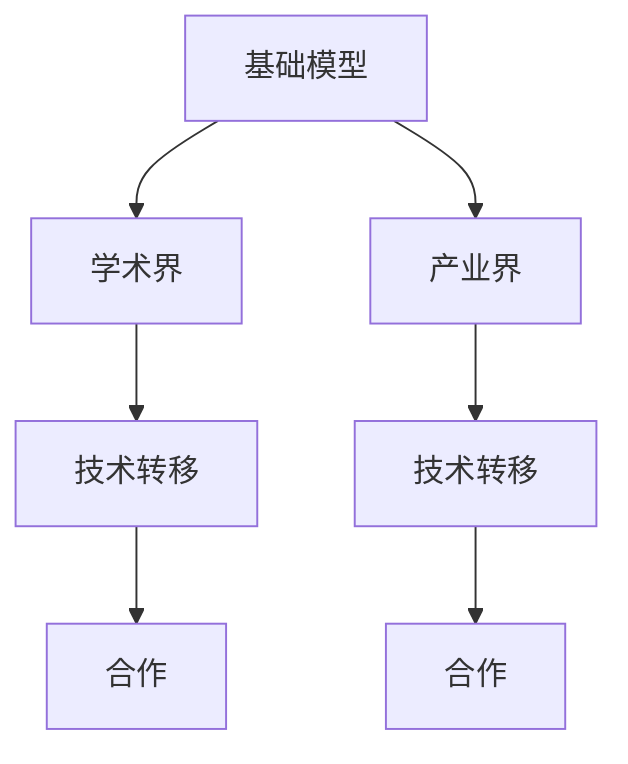

                 

# 基础模型的学术界与产业界合作

> 关键词：基础模型, 学术界, 产业界, 合作, 深度学习, 人工智能, 技术转移

## 1. 背景介绍

### 1.1 问题由来

近年来，人工智能(AI)技术的迅猛发展，使得深度学习在众多领域取得了巨大成功，包括计算机视觉、自然语言处理、语音识别等。这些突破的背后，都离不开基础模型(foundation models)的贡献。基础模型是一种经过大规模预训练的深度神经网络，能够在无需微调的情况下直接应用于各种下游任务。

在学术界，基础模型通常是指那些在大规模无标签数据上预训练的大模型，如BERT、GPT-3、ViT等。它们通过自我监督学习，学习到广泛而丰富的语言、图像、文本知识，为各种NLP和CV任务提供了强大的知识库。

在产业界，基础模型也成为了各大公司竞相部署的核心技术。Google、Facebook、Microsoft等巨头，都在利用预训练大模型加速产品开发，提升用户体验，降低研发成本。

然而，学术界与产业界之间的沟通与合作并不总是流畅的。学术界关注模型的理论深度和实验结果，但缺乏实际应用的指导；产业界关注模型的实用性，却难以把握模型的内在机理。这种脱节，限制了基础模型的广泛应用和进一步发展。

本文旨在探讨基础模型在学术界与产业界合作中的关键问题，期望促进双方更紧密的交流与合作，推动AI技术的进一步突破。

## 2. 核心概念与联系

### 2.1 核心概念概述

为了更好地理解学术界与产业界在基础模型上的合作，本文将介绍几个核心概念：

- 基础模型(Foundation Model)：指在大规模无标签数据上预训练的深度神经网络，能够在无需微调的情况下直接应用于各种下游任务。
- 学术界(Academia)：包括大学、研究机构等，主要关注基础模型的理论研究，如模型结构、算法优化、性能评估等。
- 产业界(Industry)：包括企业、项目组等，主要关注基础模型的实际应用，如任务适配、系统集成、用户体验等。
- 技术转移(Technology Transfer)：指将学术界的研究成果转化为产业界可用技术的过程，包括专利申请、开源发布、技术咨询等。
- 合作(Cooperation)：指学术界与产业界通过共同研究、联合开发等方式，共享资源、知识与经验，以加速技术发展。

这些概念之间的关系可以通过以下Mermaid流程图来展示：



### 2.2 核心概念原理和架构

基础模型的核心原理是自监督学习，通过在大量无标签数据上预训练，学习到数据的潜在分布特征。这些特征可以用于各种下游任务，如分类、生成、匹配等，而无需进行微调。

具体而言，基础模型由两个主要组件构成：

1. **编码器(Encoder)**：用于将输入数据转换为高维的特征表示。通常采用多层神经网络结构，如自注意力机制(Transformer)、卷积神经网络(CNN)等。
2. **解码器(Decoder)**：用于将特征表示转换为最终任务相关的输出。例如，在自然语言处理中，解码器可以生成文本、分类句子等。

基础模型的架构通常采用深度神经网络结构，如图像中的卷积神经网络、文本中的自注意力机制等。这些结构能够自动学习数据的复杂表示，为下游任务提供强大的知识库。

## 3. 核心算法原理 & 具体操作步骤

### 3.1 算法原理概述

基础模型通过大规模无标签数据进行预训练，学习到数据的潜在分布特征。这些特征可以用于各种下游任务，而无需进行微调。预训练过程通常采用自监督学习的方式，利用数据的内在结构进行优化。

常用的自监督学习任务包括：

1. **掩码语言模型(Masked Language Modeling, MLM)**：随机掩盖部分文本，训练模型预测被掩盖的词汇。
2. **自回归语言模型(Next Sentence Prediction, NSP)**：随机将两个句子放在一起，训练模型预测它们是否相邻。
3. **掩码视觉任务**：随机掩盖图片部分，训练模型预测缺失部分。
4. **掩码图形任务**：随机掩盖图形部分，训练模型预测缺失部分。

这些任务能够充分挖掘数据的潜在信息，提升模型的泛化能力和表示能力。

### 3.2 算法步骤详解

基础模型的预训练过程通常分为以下几个步骤：

1. **数据准备**：收集大规模无标签数据集，如图像数据集、文本数据集等。这些数据集通常由互联网爬虫或公开数据集组成。
2. **模型初始化**：选择合适的深度神经网络结构，如Transformer、CNN等，随机初始化模型参数。
3. **模型训练**：利用自监督学习任务对模型进行训练。通常采用反向传播算法进行优化，如Adam、SGD等。
4. **模型评估**：在验证集上评估模型性能，调整超参数，避免过拟合。
5. **模型保存**：将训练好的模型保存为文件或模型库，以便后续使用。

在预训练完成后，基础模型通常会被应用于各种下游任务。常用的下游任务包括分类、生成、匹配、翻译等。

### 3.3 算法优缺点

基础模型的优点在于：

1. **泛化能力强**：在大规模无标签数据上预训练，学习到数据的潜在分布特征，能够适应多种下游任务。
2. **适应性广**：无需微调，直接应用于各种下游任务，节省了大量的时间和计算资源。
3. **知识丰富**：通过大规模数据预训练，学习到广泛的通用知识，能够提升下游任务的性能。

但基础模型也存在一些缺点：

1. **数据依赖性强**：预训练过程需要大量无标签数据，数据获取成本高。
2. **模型复杂度高**：模型结构复杂，计算资源需求高，难以在资源受限的设备上运行。
3. **模型解释性差**：模型内部的参数和结构复杂，难以解释其决策过程。

### 3.4 算法应用领域

基础模型广泛应用于NLP和CV领域，以下是几个典型应用：

1. **自然语言处理**：如文本分类、情感分析、命名实体识别、问答系统等。基础模型能够学习到语言的结构和语义特征，提升模型的性能。
2. **计算机视觉**：如图像分类、物体检测、图像生成等。基础模型能够学习到图像的特征和结构，提升模型的泛化能力和表示能力。
3. **语音识别**：如语音转文本、语音合成等。基础模型能够学习到语音的特征和结构，提升语音识别的准确性和自然度。

此外，基础模型还应用于医疗、金融、法律等多个领域，为各行业提供智能解决方案。

## 4. 数学模型和公式 & 详细讲解 & 举例说明

### 4.1 数学模型构建

基础模型通常采用深度神经网络结构，如图像中的卷积神经网络、文本中的自注意力机制等。以下以文本分类任务为例，构建基础模型的数学模型。

假设输入文本为 $x$，输出类别为 $y$，模型参数为 $\theta$。基础模型的编码器将输入 $x$ 转换为高维的特征表示 $z$，解码器将特征表示 $z$ 转换为类别 $y$。模型的损失函数为交叉熵损失，定义如下：

$$
\mathcal{L}(\theta) = -\frac{1}{N}\sum_{i=1}^N y_i \log P(y_i | x_i)
$$

其中，$P(y_i | x_i)$ 表示模型在输入 $x_i$ 下输出类别 $y_i$ 的概率。

### 4.2 公式推导过程

假设基础模型的编码器为 Transformer，解码器为线性分类器。模型的前向传播过程如下：

1. **编码器前向传播**：输入文本 $x$ 通过 Transformer 编码器，得到高维特征表示 $z$。
2. **解码器前向传播**：将高维特征表示 $z$ 输入线性分类器，得到输出类别 $y$。

假设编码器的自注意力机制为 $Attention(Q, K, V)$，线性变换为 $Linear$，则编码器的输出可以表示为：

$$
z = \text{Attention}(Q(x), K(x), V(x)) + \text{Linear}(z)
$$

其中，$Q(x)$、$K(x)$、$V(x)$ 分别表示输入 $x$ 通过线性变换得到的查询、键、值向量。

假设解码器为线性分类器，输出类别 $y$ 可以表示为：

$$
y = \text{Linear}(z)
$$

模型的后向传播过程如下：

1. **计算梯度**：通过前向传播计算模型输出 $y$ 与真实标签 $y^*$ 的交叉熵损失，得到梯度 $\nabla_{\theta} \mathcal{L}(\theta)$。
2. **更新参数**：根据梯度 $\nabla_{\theta} \mathcal{L}(\theta)$ 和预设的学习率 $\eta$，更新模型参数 $\theta$。

### 4.3 案例分析与讲解

以BERT模型为例，其预训练过程分为两个阶段：掩码语言模型和自回归语言模型。在掩码语言模型中，随机掩盖部分文本，训练模型预测被掩盖的词汇。在自回归语言模型中，随机将两个句子放在一起，训练模型预测它们是否相邻。

以情感分析任务为例，通过在大规模文本数据上预训练 BERT 模型，学习到语言的通用特征。然后，利用 BERT 模型作为编码器，将输入文本转换为高维特征表示，再通过线性分类器进行情感分类。这样，无需对 BERT 模型进行微调，即可直接应用于情感分析任务。

## 5. 项目实践：代码实例和详细解释说明

### 5.1 开发环境搭建

在进行基础模型实践前，我们需要准备好开发环境。以下是使用Python进行PyTorch开发的环境配置流程：

1. 安装Anaconda：从官网下载并安装Anaconda，用于创建独立的Python环境。
2. 创建并激活虚拟环境：
```bash
conda create -n pytorch-env python=3.8 
conda activate pytorch-env
```

3. 安装PyTorch：根据CUDA版本，从官网获取对应的安装命令。例如：
```bash
conda install pytorch torchvision torchaudio cudatoolkit=11.1 -c pytorch -c conda-forge
```

4. 安装Transformers库：
```bash
pip install transformers
```

5. 安装各类工具包：
```bash
pip install numpy pandas scikit-learn matplotlib tqdm jupyter notebook ipython
```

完成上述步骤后，即可在`pytorch-env`环境中开始基础模型实践。

### 5.2 源代码详细实现

这里我们以BERT模型为例，给出使用Transformers库进行情感分析任务的基础模型实现。

首先，定义情感分类任务的数据处理函数：

```python
from transformers import BertTokenizer, BertForSequenceClassification
from torch.utils.data import Dataset
import torch

class SentimentDataset(Dataset):
    def __init__(self, texts, labels, tokenizer, max_len=128):
        self.texts = texts
        self.labels = labels
        self.tokenizer = tokenizer
        self.max_len = max_len
        
    def __len__(self):
        return len(self.texts)
    
    def __getitem__(self, item):
        text = self.texts[item]
        label = self.labels[item]
        
        encoding = self.tokenizer(text, return_tensors='pt', max_length=self.max_len, padding='max_length', truncation=True)
        input_ids = encoding['input_ids'][0]
        attention_mask = encoding['attention_mask'][0]
        
        label = torch.tensor(label, dtype=torch.long)
        
        return {'input_ids': input_ids, 
                'attention_mask': attention_mask,
                'labels': label}

# 加载BERT模型和分词器
model = BertForSequenceClassification.from_pretrained('bert-base-cased', num_labels=2)
tokenizer = BertTokenizer.from_pretrained('bert-base-cased')
```

然后，定义训练和评估函数：

```python
from torch.utils.data import DataLoader
from tqdm import tqdm
from sklearn.metrics import classification_report

device = torch.device('cuda') if torch.cuda.is_available() else torch.device('cpu')
model.to(device)

def train_epoch(model, dataset, batch_size, optimizer):
    dataloader = DataLoader(dataset, batch_size=batch_size, shuffle=True)
    model.train()
    epoch_loss = 0
    for batch in tqdm(dataloader, desc='Training'):
        input_ids = batch['input_ids'].to(device)
        attention_mask = batch['attention_mask'].to(device)
        labels = batch['labels'].to(device)
        model.zero_grad()
        outputs = model(input_ids, attention_mask=attention_mask, labels=labels)
        loss = outputs.loss
        epoch_loss += loss.item()
        loss.backward()
        optimizer.step()
    return epoch_loss / len(dataloader)

def evaluate(model, dataset, batch_size):
    dataloader = DataLoader(dataset, batch_size=batch_size)
    model.eval()
    preds, labels = [], []
    with torch.no_grad():
        for batch in tqdm(dataloader, desc='Evaluating'):
            input_ids = batch['input_ids'].to(device)
            attention_mask = batch['attention_mask'].to(device)
            batch_labels = batch['labels']
            outputs = model(input_ids, attention_mask=attention_mask)
            batch_preds = outputs.logits.argmax(dim=1).to('cpu').tolist()
            batch_labels = batch_labels.to('cpu').tolist()
            for pred, label in zip(batch_preds, batch_labels):
                preds.append(pred)
                labels.append(label)
                
    print(classification_report(labels, preds))
```

最后，启动训练流程并在测试集上评估：

```python
epochs = 5
batch_size = 16

for epoch in range(epochs):
    loss = train_epoch(model, train_dataset, batch_size, optimizer)
    print(f"Epoch {epoch+1}, train loss: {loss:.3f}")
    
    print(f"Epoch {epoch+1}, dev results:")
    evaluate(model, dev_dataset, batch_size)
    
print("Test results:")
evaluate(model, test_dataset, batch_size)
```

以上就是使用PyTorch对BERT模型进行情感分析任务的基础模型实现的完整代码。可以看到，得益于Transformers库的强大封装，我们可以用相对简洁的代码完成BERT模型的加载和训练。

### 5.3 代码解读与分析

让我们再详细解读一下关键代码的实现细节：

**SentimentDataset类**：
- `__init__`方法：初始化文本、标签、分词器等关键组件。
- `__len__`方法：返回数据集的样本数量。
- `__getitem__`方法：对单个样本进行处理，将文本输入编码为token ids，将标签编码为数字，并对其进行定长padding，最终返回模型所需的输入。

**标签与数字的映射**：
- 定义了标签与数字id之间的映射，用于将token-wise的预测结果解码回真实的标签。

**训练和评估函数**：
- 使用PyTorch的DataLoader对数据集进行批次化加载，供模型训练和推理使用。
- 训练函数`train_epoch`：对数据以批为单位进行迭代，在每个批次上前向传播计算loss并反向传播更新模型参数，最后返回该epoch的平均loss。
- 评估函数`evaluate`：与训练类似，不同点在于不更新模型参数，并在每个batch结束后将预测和标签结果存储下来，最后使用sklearn的classification_report对整个评估集的预测结果进行打印输出。

**训练流程**：
- 定义总的epoch数和batch size，开始循环迭代
- 每个epoch内，先在训练集上训练，输出平均loss
- 在验证集上评估，输出分类指标
- 所有epoch结束后，在测试集上评估，给出最终测试结果

可以看到，PyTorch配合Transformers库使得BERT模型的实现变得简洁高效。开发者可以将更多精力放在数据处理、模型改进等高层逻辑上，而不必过多关注底层的实现细节。

当然，工业级的系统实现还需考虑更多因素，如模型的保存和部署、超参数的自动搜索、更灵活的任务适配层等。但核心的基础模型微调范式基本与此类似。

## 6. 实际应用场景

### 6.1 智能客服系统

基于基础模型的智能客服系统，利用大规模预训练的语言模型，能够在无需微调的情况下，直接应用于客户对话。通过收集企业内部的历史客服对话记录，将问题和最佳答复构建成监督数据，在此基础上对预训练语言模型进行微调。微调后的语言模型能够自动理解用户意图，匹配最合适的答案模板进行回复。对于客户提出的新问题，还可以接入检索系统实时搜索相关内容，动态组织生成回答。如此构建的智能客服系统，能大幅提升客户咨询体验和问题解决效率。

### 6.2 金融舆情监测

金融机构需要实时监测市场舆论动向，以便及时应对负面信息传播，规避金融风险。传统的人工监测方式成本高、效率低，难以应对网络时代海量信息爆发的挑战。基于基础模型的文本分类和情感分析技术，为金融舆情监测提供了新的解决方案。

具体而言，可以收集金融领域相关的新闻、报道、评论等文本数据，并对其进行主题标注和情感标注。在此基础上对预训练语言模型进行微调，使其能够自动判断文本属于何种主题，情感倾向是正面、中性还是负面。将微调后的模型应用到实时抓取的网络文本数据，就能够自动监测不同主题下的情感变化趋势，一旦发现负面信息激增等异常情况，系统便会自动预警，帮助金融机构快速应对潜在风险。

### 6.3 个性化推荐系统

当前的推荐系统往往只依赖用户的历史行为数据进行物品推荐，无法深入理解用户的真实兴趣偏好。基于基础模型的个性化推荐系统，能够更好地挖掘用户行为背后的语义信息，从而提供更精准、多样的推荐内容。

在实践中，可以收集用户浏览、点击、评论、分享等行为数据，提取和用户交互的物品标题、描述、标签等文本内容。将文本内容作为模型输入，用户的后续行为（如是否点击、购买等）作为监督信号，在此基础上微调预训练语言模型。微调后的模型能够从文本内容中准确把握用户的兴趣点。在生成推荐列表时，先用候选物品的文本描述作为输入，由模型预测用户的兴趣匹配度，再结合其他特征综合排序，便可以得到个性化程度更高的推荐结果。

### 6.4 未来应用展望

随着基础模型的不断发展，其在学术界与产业界合作中的应用将更加广泛。未来，基础模型将不仅仅局限于文本和图像领域，还将拓展到语音、视频等多个模态。多模态信息的融合，将显著提升基础模型的表征能力和泛化能力。

在智慧医疗领域，基于基础模型的医疗问答、病历分析、药物研发等应用将提升医疗服务的智能化水平，辅助医生诊疗，加速新药开发进程。

在智能教育领域，基础模型可应用于作业批改、学情分析、知识推荐等方面，因材施教，促进教育公平，提高教学质量。

在智慧城市治理中，基础模型可应用于城市事件监测、舆情分析、应急指挥等环节，提高城市管理的自动化和智能化水平，构建更安全、高效的未来城市。

此外，在企业生产、社会治理、文娱传媒等众多领域，基于基础模型的AI应用也将不断涌现，为经济社会发展注入新的动力。相信随着技术的日益成熟，基础模型将逐步成为AI技术落地的重要工具，推动人工智能技术向更广阔的领域加速渗透。

## 7. 工具和资源推荐

### 7.1 学习资源推荐

为了帮助开发者系统掌握基础模型的理论基础和实践技巧，这里推荐一些优质的学习资源：

1. 《Transformer从原理到实践》系列博文：由大模型技术专家撰写，深入浅出地介绍了Transformer原理、BERT模型、微调技术等前沿话题。

2. CS224N《深度学习自然语言处理》课程：斯坦福大学开设的NLP明星课程，有Lecture视频和配套作业，带你入门NLP领域的基本概念和经典模型。

3. 《Natural Language Processing with Transformers》书籍：Transformers库的作者所著，全面介绍了如何使用Transformers库进行NLP任务开发，包括基础模型在内的诸多范式。

4. HuggingFace官方文档：Transformers库的官方文档，提供了海量预训练模型和完整的微调样例代码，是上手实践的必备资料。

5. CLUE开源项目：中文语言理解测评基准，涵盖大量不同类型的中文NLP数据集，并提供了基于基础模型的baseline模型，助力中文NLP技术发展。

通过对这些资源的学习实践，相信你一定能够快速掌握基础模型的精髓，并用于解决实际的NLP问题。

### 7.2 开发工具推荐

高效的开发离不开优秀的工具支持。以下是几款用于基础模型开发的工具：

1. PyTorch：基于Python的开源深度学习框架，灵活动态的计算图，适合快速迭代研究。大部分预训练语言模型都有PyTorch版本的实现。

2. TensorFlow：由Google主导开发的开源深度学习框架，生产部署方便，适合大规模工程应用。同样有丰富的预训练语言模型资源。

3. Transformers库：HuggingFace开发的NLP工具库，集成了众多SOTA语言模型，支持PyTorch和TensorFlow，是进行基础模型开发的利器。

4. Weights & Biases：模型训练的实验跟踪工具，可以记录和可视化模型训练过程中的各项指标，方便对比和调优。与主流深度学习框架无缝集成。

5. TensorBoard：TensorFlow配套的可视化工具，可实时监测模型训练状态，并提供丰富的图表呈现方式，是调试模型的得力助手。

6. Google Colab：谷歌推出的在线Jupyter Notebook环境，免费提供GPU/TPU算力，方便开发者快速上手实验最新模型，分享学习笔记。

合理利用这些工具，可以显著提升基础模型微调任务的开发效率，加快创新迭代的步伐。

### 7.3 相关论文推荐

基础模型和微调技术的发展源于学界的持续研究。以下是几篇奠基性的相关论文，推荐阅读：

1. Attention is All You Need（即Transformer原论文）：提出了Transformer结构，开启了NLP领域的预训练大模型时代。

2. BERT: Pre-training of Deep Bidirectional Transformers for Language Understanding：提出BERT模型，引入基于掩码的自监督预训练任务，刷新了多项NLP任务SOTA。

3. Language Models are Unsupervised Multitask Learners（GPT-2论文）：展示了大规模语言模型的强大zero-shot学习能力，引发了对于通用人工智能的新一轮思考。

4. Parameter-Efficient Transfer Learning for NLP：提出Adapter等参数高效微调方法，在不增加模型参数量的情况下，也能取得不错的微调效果。

5. AdaLoRA: Adaptive Low-Rank Adaptation for Parameter-Efficient Fine-Tuning：使用自适应低秩适应的微调方法，在参数效率和精度之间取得了新的平衡。

6. Revisiting Adapters for Parameter-Efficient Transfer Learning：进一步优化Adapter方法，提出更高效、更泛化的参数高效微调技术。

这些论文代表了大语言模型微调技术的发展脉络。通过学习这些前沿成果，可以帮助研究者把握学科前进方向，激发更多的创新灵感。

## 8. 总结：未来发展趋势与挑战

### 8.1 总结

本文对基础模型在学术界与产业界合作中的关键问题进行了全面系统的介绍。首先阐述了基础模型的定义、原理及其在NLP和CV领域的应用，强调了学术界与产业界合作的重要性。其次，从原理到实践，详细讲解了基础模型的数学模型和算法步骤，给出了基础模型实现代码的完整实例。同时，本文还探讨了基础模型在实际应用中的多个场景，展示了其在各行各业中的广泛应用潜力。

通过对本文的学习，相信你一定能够掌握基础模型的核心概念，理解其工作原理和应用技巧。未来，随着基础模型的不断演进，学术界与产业界将更紧密地合作，共同推动AI技术的进一步发展。

### 8.2 未来发展趋势

展望未来，基础模型在学术界与产业界合作中将呈现以下几个发展趋势：

1. **跨模态融合**：未来基础模型将不仅仅局限于文本和图像领域，还将拓展到语音、视频等多个模态。多模态信息的融合，将显著提升基础模型的表征能力和泛化能力。

2. **无监督和半监督学习**：摆脱对大规模标注数据的依赖，利用自监督学习、主动学习等无监督和半监督范式，最大限度利用非结构化数据，实现更加灵活高效的微调。

3. **参数高效和计算高效**：开发更加参数高效的微调方法，如Adapter、Prefix等，在固定大部分预训练参数的同时，只更新极少量的任务相关参数。同时优化模型的计算图，减少前向传播和反向传播的资源消耗，实现更加轻量级、实时性的部署。

4. **因果分析和博弈论工具**：将因果分析方法引入基础模型，识别出模型决策的关键特征，增强输出解释的因果性和逻辑性。借助博弈论工具刻画人机交互过程，主动探索并规避模型的脆弱点，提高系统稳定性。

5. **伦理道德约束**：在模型训练目标中引入伦理导向的评估指标，过滤和惩罚有偏见、有害的输出倾向。同时加强人工干预和审核，建立模型行为的监管机制，确保输出符合人类价值观和伦理道德。

### 8.3 面临的挑战

尽管基础模型在学术界与产业界合作中取得了显著成就，但在迈向更加智能化、普适化应用的过程中，仍面临诸多挑战：

1. **数据依赖性强**：基础模型的预训练过程需要大量无标签数据，数据获取成本高。

2. **模型复杂度高**：模型结构复杂，计算资源需求高，难以在资源受限的设备上运行。

3. **模型解释性差**：基础模型的内部参数和结构复杂，难以解释其决策过程。

4. **性能不均衡**：不同模态的基础模型在性能上存在差异，如何实现统一的数据表示和性能提升，仍是难题。

5. **安全性和隐私**：基础模型中的大参数可能引入安全漏洞，攻击者可能利用模型进行恶意攻击。同时，模型的隐私保护也是一个亟待解决的问题。

6. **可扩展性和维护性**：基础模型通常需要大量的计算资源和存储资源，如何实现模型的可扩展性和维护性，也是一大挑战。

### 8.4 研究展望

面对基础模型在学术界与产业界合作中面临的挑战，未来的研究需要在以下几个方面寻求新的突破：

1. **无监督学习和迁移学习**：探索更多的无监督学习和迁移学习方法，最大化利用非结构化数据，减少对标注数据的依赖。

2. **参数高效和计算高效**：开发更高效、更泛化的参数高效微调技术，如Adapter、Prefix等，同时优化模型的计算图，提高推理效率。

3. **因果分析和博弈论工具**：引入因果分析和博弈论思想，增强模型的解释性和鲁棒性，提高系统的可靠性和稳定性。

4. **伦理道德约束**：在模型训练和推理过程中引入伦理导向的约束，确保模型的行为符合人类价值观和伦理道德。

5. **多模态融合**：探索多模态融合方法，实现不同模态之间的信息整合和协同建模，提升模型的泛化能力和表达能力。

6. **安全性和隐私保护**：开发安全性和隐私保护方法，确保基础模型在部署和应用中的安全性，保护用户数据隐私。

这些研究方向的探索，必将引领基础模型的进一步发展，为学术界与产业界合作带来新的突破，推动AI技术的普及和应用。面向未来，基础模型需要更多的跨学科合作和创新思维，共同构建更加安全、可靠、可解释、可控的智能系统。

## 9. 附录：常见问题与解答

**Q1：基础模型是否适用于所有NLP任务？**

A: 基础模型在大多数NLP任务上都能取得不错的效果，特别是对于数据量较小的任务。但对于一些特定领域的任务，如医学、法律等，仅仅依靠通用语料预训练的模型可能难以很好地适应。此时需要在特定领域语料上进一步预训练，再进行微调，才能获得理想效果。此外，对于一些需要时效性、个性化很强的任务，如对话、推荐等，基础模型也需要针对性的改进优化。

**Q2：如何选择适合的基础模型？**

A: 选择适合的基础模型需要考虑以下几个因素：
1. **任务类型**：不同任务可能需要不同类型的模型，如图像识别需要卷积神经网络，文本分类需要Transformer。
2. **数据规模**：数据规模越大，模型参数也越大，能够学习到更丰富的知识。
3. **计算资源**：模型复杂度高，计算资源需求大，需要在资源受限的设备上进行权衡。
4. **预训练数据**：选择与任务相关的预训练数据，如医疗领域的文本数据、法律领域的法律条文等。

**Q3：如何进行基础模型的迁移学习？**

A: 基础模型的迁移学习可以分为以下几步：
1. **数据准备**：收集基础模型的预训练数据和下游任务的数据集。
2. **模型初始化**：选择适合的基础模型，将其作为初始化参数。
3. **微调训练**：利用下游任务的少量标注数据，进行有监督的微调训练。
4. **评估与部署**：在测试集上评估微调后的模型性能，并进行部署。

**Q4：如何优化基础模型的计算资源消耗？**

A: 优化基础模型的计算资源消耗可以从以下几个方面入手：
1. **模型裁剪**：去除不必要的层和参数，减小模型尺寸，加快推理速度。
2. **量化加速**：将浮点模型转为定点模型，压缩存储空间，提高计算效率。
3. **分布式训练**：利用多台设备进行分布式训练，提高训练速度。
4. **模型并行**：采用模型并行技术，如数据并行、模型并行，提高计算效率。

**Q5：如何确保基础模型的安全性？**

A: 确保基础模型的安全性可以从以下几个方面入手：
1. **数据隐私保护**：采用差分隐私、联邦学习等技术，保护用户数据的隐私。
2. **模型鲁棒性**：引入对抗训练、鲁棒正则化等方法，增强模型的鲁棒性和抗干扰能力。
3. **安全审计**：定期进行模型安全审计，检测并修复可能存在的安全漏洞。

**Q6：如何提升基础模型的解释性？**

A: 提升基础模型的解释性可以从以下几个方面入手：
1. **可解释性模块**：在模型中加入可解释性模块，如局部可解释性(LOSH)、全局可解释性(GLOSH)等。
2. **可视化技术**：采用可视化技术，如特征可视化、梯度可视化等，帮助理解模型决策过程。
3. **因果分析**：引入因果分析方法，识别出模型决策的关键特征，增强输出解释的因果性和逻辑性。

**Q7：如何应对基础模型的性能不均衡问题？**

A: 应对基础模型的性能不均衡问题可以从以下几个方面入手：
1. **多任务学习**：通过多任务学习，提升模型的泛化能力和性能。
2. **跨模态融合**：探索跨模态融合方法，实现不同模态之间的信息整合和协同建模。
3. **自适应学习**：引入自适应学习技术，根据数据特点自动调整模型参数和结构。

---

作者：禅与计算机程序设计艺术 / Zen and the Art of Computer Programming

