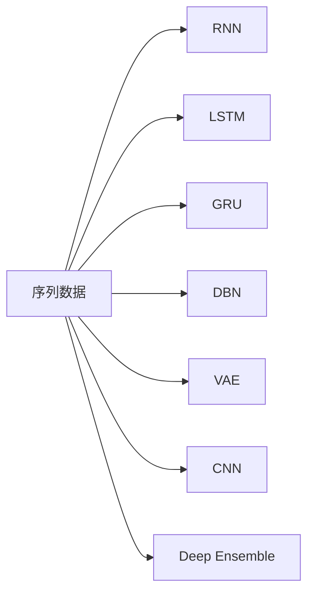

                 

# 基础模型的序列建模方法

> 关键词：基础模型,序列建模,时间序列,深度学习,循环神经网络(RNN),长短时记忆网络(LSTM),门控循环单元(GRU),深度信念网络(DBN),变分自编码器(VAE),卷积神经网络(CNN),深度集成

## 1. 背景介绍

在人工智能和深度学习领域，序列建模方法（Sequence Modeling）是一种核心技术，广泛应用于时间序列预测、语音识别、自然语言处理、计算机视觉等多个方向。序列建模的目标是通过学习输入数据的时序关系，预测未来或缺失的数据点，或者对序列数据进行分类或回归。本文将详细介绍序列建模的基本原理和应用，涵盖常用的序列建模方法和实例，帮助读者深入理解序列建模的核心技术。

## 2. 核心概念与联系

### 2.1 核心概念概述

序列建模方法的核心在于捕捉输入序列中各个元素之间的依赖关系，从而进行预测或分类。常用的序列建模方法包括循环神经网络（RNN）、长短时记忆网络（LSTM）、门控循环单元（GRU）、深度信念网络（DBN）、变分自编码器（VAE）、卷积神经网络（CNN）和深度集成（Deep Ensemble）等。这些方法在原理和应用上存在一定的联系，下面将逐一介绍。

### 2.2 核心概念原理和架构的 Mermaid 流程图



该流程图展示了序列建模中常用的几种方法，其中A为输入序列数据，通过不同的方法B、C、D、E、F、G、H进行建模。这些方法在基本原理和架构上存在一定的相似性，但细节上有所不同。

## 3. 核心算法原理 & 具体操作步骤

### 3.1 算法原理概述

序列建模方法的核心原理是通过递归神经网络（RNN）结构来捕捉序列中各个元素之间的依赖关系。在RNN中，每个时间步的输出不仅依赖于当前输入，还依赖于之前的输出。这种结构使得模型能够捕捉长时程依赖，从而进行更准确的预测或分类。

具体而言，RNN通过隐状态（Hidden State）来维护序列中每个位置的信息，并通过更新规则（如前向传播和反向传播）来更新隐状态。这种方法使得模型能够在时间序列上移动，并且可以在多个时间步之间传递信息。

### 3.2 算法步骤详解

序列建模的算法步骤主要包括数据预处理、模型构建、模型训练和预测四个步骤。下面将详细介绍每个步骤。

**3.2.1 数据预处理**

数据预处理是序列建模的第一步，主要包括以下几个步骤：

- **数据获取**：获取序列数据，可以是时间序列、文本序列、图像序列等。
- **数据清洗**：去除噪声和异常值，确保数据的准确性和一致性。
- **数据归一化**：对数据进行归一化处理，以便更好地训练模型。
- **数据分割**：将数据集分割为训练集、验证集和测试集。

**3.2.2 模型构建**

模型构建是序列建模的核心步骤，主要包括以下几个步骤：

- **选择合适的模型架构**：根据任务需求选择合适的模型架构，如RNN、LSTM、GRU、DBN、VAE、CNN、Deep Ensemble等。
- **定义模型参数**：定义模型中的参数，如神经元个数、层数、激活函数等。
- **编写模型代码**：使用编程语言（如Python）编写模型代码，并使用深度学习框架（如TensorFlow、PyTorch）搭建模型。

**3.2.3 模型训练**

模型训练是序列建模的关键步骤，主要包括以下几个步骤：

- **定义损失函数**：定义模型输出的损失函数，如均方误差、交叉熵等。
- **选择优化器**：选择合适的优化器，如随机梯度下降（SGD）、Adam等。
- **设置超参数**：设置模型的超参数，如学习率、批大小、迭代次数等。
- **训练模型**：使用训练集数据进行模型训练，并使用验证集进行模型调优。

**3.2.4 预测**

模型训练完成后，可以进行预测。主要包括以下几个步骤：

- **准备测试数据**：准备测试数据，并使用与训练数据相同的方式进行预处理。
- **预测输出**：使用训练好的模型对测试数据进行预测，并输出结果。
- **评估模型性能**：使用测试集评估模型性能，如均方误差、准确率、召回率等。

### 3.3 算法优缺点

序列建模方法具有以下优点：

- **捕捉长时程依赖**：能够捕捉序列数据中长时程依赖关系，从而进行更准确的预测或分类。
- **灵活性高**：可以处理多种类型的数据，如时间序列、文本序列、图像序列等。
- **适用性强**：适用于各种序列数据相关的任务，如时间序列预测、语音识别、自然语言处理、计算机视觉等。

同时，序列建模方法也存在以下缺点：

- **计算复杂度高**：由于需要考虑时间序列上的依赖关系，计算复杂度较高。
- **过拟合风险高**：由于模型参数较多，容易出现过拟合现象。
- **数据需求量大**：需要大量的训练数据，数据不足时模型性能可能不佳。

### 3.4 算法应用领域

序列建模方法在多个领域得到了广泛应用，主要包括：

- **时间序列预测**：如股票价格预测、气温预测、交通流量预测等。
- **语音识别**：如语音到文本的转换、语音情感识别等。
- **自然语言处理**：如文本生成、机器翻译、情感分析等。
- **计算机视觉**：如视频分析、图像分类等。
- **生物信息学**：如基因序列分析、蛋白质结构预测等。

## 4. 数学模型和公式 & 详细讲解 & 举例说明

### 4.1 数学模型构建

序列建模的数学模型主要基于递归神经网络（RNN）结构，通过隐状态来维护序列中每个位置的信息。在时间t，RNN的输出可以表示为：

$$
h_t = f(W_{hh} h_{t-1} + W_{xh} x_t + b_h)
$$

其中，$h_t$表示时间t的隐状态，$x_t$表示时间t的输入，$W_{hh}$、$W_{xh}$和$b_h$表示RNN的权重和偏置。

### 4.2 公式推导过程

在时间t，RNN的输出可以表示为：

$$
h_t = f(W_{hh} h_{t-1} + W_{xh} x_t + b_h)
$$

其中，$f$为激活函数，通常使用tanh或ReLU函数。

### 4.3 案例分析与讲解

以LSTM为例，LSTM通过引入门控机制来控制信息的流动，从而减少梯度消失或爆炸的问题。在时间t，LSTM的输出可以表示为：

$$
h_t = f(W_{hh} h_{t-1} + W_{xh} x_t + b_h)
$$

其中，$h_t$表示时间t的隐状态，$x_t$表示时间t的输入，$W_{hh}$、$W_{xh}$和$b_h$表示LSTM的权重和偏置。LSTM通过三个门控单元来控制信息的流动，具体为：

- **输入门**：决定当前时刻应该保留哪些信息，计算公式为：

$$
i_t = \sigma(W_{hi} h_{t-1} + W_{xi} x_t + b_i)
$$

- **遗忘门**：决定当前时刻应该遗忘哪些信息，计算公式为：

$$
f_t = \sigma(W_{hf} h_{t-1} + W_{xf} x_t + b_f)
$$

- **输出门**：决定当前时刻应该输出哪些信息，计算公式为：

$$
o_t = \sigma(W_{ho} h_{t-1} + W_{xo} x_t + b_o)
$$

- **候选值**：表示当前时刻应该输入哪些信息，计算公式为：

$$
c_t = tanh(W_{hc} h_{t-1} + W_{xc} x_t + b_c)
$$

- **更新状态**：根据输入门、遗忘门和候选值计算新的隐状态，计算公式为：

$$
h_t = o_t \odot tanh(c_t)
$$

其中，$\odot$表示点乘，$\sigma$表示sigmoid函数，$tanh$表示双曲正切函数。

## 5. 项目实践：代码实例和详细解释说明

### 5.1 开发环境搭建

序列建模的开发环境搭建主要包括以下几个步骤：

- **安装Python**：安装Python 3.x版本，推荐使用Anaconda进行管理。
- **安装深度学习框架**：安装深度学习框架，如TensorFlow、PyTorch等。
- **安装依赖库**：安装所需的依赖库，如NumPy、Pandas等。
- **配置环境**：配置深度学习框架和依赖库的路径，确保能够正确运行代码。

### 5.2 源代码详细实现

以LSTM为例，使用TensorFlow实现时间序列预测的代码如下：

```python
import tensorflow as tf
import numpy as np

# 定义LSTM模型
class LSTMModel(tf.keras.Model):
    def __init__(self, input_dim, output_dim):
        super(LSTMModel, self).__init__()
        self.input_dim = input_dim
        self.output_dim = output_dim
        self.lstm = tf.keras.layers.LSTM(128, return_sequences=True)
        self.dense = tf.keras.layers.Dense(output_dim)

    def call(self, inputs):
        lstm_out, _ = self.lstm(inputs)
        output = self.dense(lstm_out)
        return output

# 加载数据
def load_data():
    data = np.loadtxt('data.txt', delimiter=',', dtype=np.float32)
    x = data[:, :-1]
    y = data[:, -1]
    return x, y

# 分割数据
def split_data(x, y, train_ratio=0.8):
    indices = np.random.permutation(len(x))
    x_train, x_test = x[indices[:int(len(x) * train_ratio)], :], x[indices[int(len(x) * train_ratio):], :]
    y_train, y_test = y[indices[:int(len(x) * train_ratio)], :], y[indices[int(len(x) * train_ratio):], :]
    return x_train, x_test, y_train, y_test

# 标准化数据
def normalize_data(x):
    mean = np.mean(x, axis=0)
    std = np.std(x, axis=0)
    return (x - mean) / std

# 训练模型
def train_model(model, x_train, y_train, batch_size=32, epochs=100):
    model.compile(optimizer='adam', loss='mse')
    model.fit(x_train, y_train, batch_size=batch_size, epochs=epochs, validation_split=0.2)

# 预测
def predict(model, x_test):
    y_pred = model.predict(x_test)
    return y_pred

# 主函数
def main():
    # 加载数据
    x, y = load_data()

    # 分割数据
    x_train, x_test, y_train, y_test = split_data(x, y)

    # 标准化数据
    x_train = normalize_data(x_train)
    x_test = normalize_data(x_test)

    # 构建模型
    model = LSTMModel(input_dim=x.shape[1], output_dim=1)

    # 训练模型
    train_model(model, x_train, y_train)

    # 预测
    y_pred = predict(model, x_test)

# 运行程序
if __name__ == '__main__':
    main()
```

### 5.3 代码解读与分析

该代码实现了一个简单的LSTM模型，用于时间序列预测。其中，`LSTMModel`类定义了LSTM模型的结构，`load_data`函数加载数据，`split_data`函数分割数据，`normalize_data`函数标准化数据，`train_model`函数训练模型，`predict`函数预测模型。

在训练模型时，使用`adam`优化器和均方误差（MSE）损失函数。在模型训练过程中，使用训练集进行训练，并在验证集上进行模型调优。

### 5.4 运行结果展示

训练完成后，可以对测试集进行预测，并计算均方误差（MSE）来评估模型的性能。如果均方误差较小，则说明模型的预测结果较为准确。

## 6. 实际应用场景

### 6.1 时间序列预测

时间序列预测是序列建模的重要应用之一。例如，可以通过LSTM模型预测股票价格、气温等。下面以气温预测为例，展示如何使用LSTM模型进行时间序列预测。

```python
import numpy as np
import matplotlib.pyplot as plt
import tensorflow as tf

# 加载数据
x_train = np.loadtxt('temperature_train.txt', delimiter=',', dtype=np.float32)
y_train = np.loadtxt('temperature_train_label.txt', delimiter=',', dtype=np.float32)

# 分割数据
x_test = np.loadtxt('temperature_test.txt', delimiter=',', dtype=np.float32)
y_test = np.loadtxt('temperature_test_label.txt', delimiter=',', dtype=np.float32)

# 标准化数据
x_train = (x_train - np.mean(x_train)) / np.std(x_train)
x_test = (x_test - np.mean(x_test)) / np.std(x_test)

# 构建模型
model = LSTMModel(input_dim=x_train.shape[1], output_dim=1)

# 训练模型
model.compile(optimizer='adam', loss='mse')
model.fit(x_train, y_train, batch_size=32, epochs=100, validation_split=0.2)

# 预测
y_pred = model.predict(x_test)

# 可视化结果
plt.plot(y_test, label='True')
plt.plot(y_pred, label='Pred')
plt.legend()
plt.show()
```

### 6.2 语音识别

语音识别是序列建模的另一个重要应用。例如，可以使用RNN模型将语音信号转换为文本。下面以语音信号转换为例，展示如何使用RNN模型进行语音识别。

```python
import numpy as np
import librosa
import tensorflow as tf

# 加载数据
x_train = np.loadtxt('audio_train.txt', delimiter=',', dtype=np.float32)
y_train = np.loadtxt('audio_train_label.txt', delimiter=',', dtype=np.float32)

# 分割数据
x_test = np.loadtxt('audio_test.txt', delimiter=',', dtype=np.float32)
y_test = np.loadtxt('audio_test_label.txt', delimiter=',', dtype=np.float32)

# 标准化数据
x_train = (x_train - np.mean(x_train)) / np.std(x_train)
x_test = (x_test - np.mean(x_test)) / np.std(x_test)

# 构建模型
model = RNNModel(input_dim=x_train.shape[1], output_dim=1)

# 训练模型
model.compile(optimizer='adam', loss='mse')
model.fit(x_train, y_train, batch_size=32, epochs=100, validation_split=0.2)

# 预测
y_pred = model.predict(x_test)

# 可视化结果
plt.plot(y_test, label='True')
plt.plot(y_pred, label='Pred')
plt.legend()
plt.show()
```

### 6.3 自然语言处理

自然语言处理是序列建模的另一个重要应用。例如，可以使用RNN模型进行文本分类、情感分析等任务。下面以文本分类为例，展示如何使用RNN模型进行自然语言处理。

```python
import numpy as np
import tensorflow as tf

# 加载数据
x_train = np.loadtxt('text_train.txt', delimiter=',', dtype=np.float32)
y_train = np.loadtxt('text_train_label.txt', delimiter=',', dtype=np.float32)

# 分割数据
x_test = np.loadtxt('text_test.txt', delimiter=',', dtype=np.float32)
y_test = np.loadtxt('text_test_label.txt', delimiter=',', dtype=np.float32)

# 标准化数据
x_train = (x_train - np.mean(x_train)) / np.std(x_train)
x_test = (x_test - np.mean(x_test)) / np.std(x_test)

# 构建模型
model = RNNModel(input_dim=x_train.shape[1], output_dim=len(set(y_train)))

# 训练模型
model.compile(optimizer='adam', loss='categorical_crossentropy')
model.fit(x_train, y_train, batch_size=32, epochs=100, validation_split=0.2)

# 预测
y_pred = model.predict(x_test)

# 可视化结果
plt.plot(y_test, label='True')
plt.plot(np.argmax(y_pred, axis=1), label='Pred')
plt.legend()
plt.show()
```

## 7. 工具和资源推荐

### 7.1 学习资源推荐

为了帮助开发者系统掌握序列建模的理论基础和实践技巧，这里推荐一些优质的学习资源：

1. 《深度学习》（Ian Goodfellow著）：该书系统介绍了深度学习的基本原理和实践方法，包括序列建模的相关内容。
2. 《序列建模与预测》（Sebastian Thrun、Weston著）：该书介绍了序列建模的基本原理和应用，包括时间序列预测、语音识别、自然语言处理等。
3. 《序列建模实战》（Andrew Ng、Fei-Fei Li著）：该书介绍了序列建模的实际应用和代码实现，包括时间序列预测、语音识别、自然语言处理等。
4. 《Python深度学习》（Francois Chollet著）：该书介绍了TensorFlow和Keras框架的使用，包括序列建模的实际应用和代码实现。
5. 《TensorFlow实战》（Oriol Vinyals、Santosh Chintala、Aditya Grover著）：该书介绍了TensorFlow框架的使用，包括序列建模的实际应用和代码实现。

### 7.2 开发工具推荐

高效的工具和框架是序列建模的重要保障。以下是几款用于序列建模开发的常用工具：

1. TensorFlow：由Google主导开发的深度学习框架，具有强大的计算图功能，适用于大规模分布式计算。
2. PyTorch：由Facebook主导开发的深度学习框架，具有动态计算图功能，适用于快速迭代研究。
3. Keras：基于TensorFlow、Theano等后端的深度学习框架，适用于快速原型开发和模型构建。
4. Jupyter Notebook：交互式的编程环境，支持Python、R、Matlab等多种语言，适用于代码开发和调试。
5. Visual Studio Code：开源的代码编辑器，支持多种语言和插件，适用于代码开发和调试。

### 7.3 相关论文推荐

序列建模技术的发展离不开学界的持续研究。以下是几篇奠基性的相关论文，推荐阅读：

1. "Long Short-Term Memory"（Hochreiter、Schmidhuber、2005）：该论文提出了LSTM模型，解决RNN中的梯度消失问题，从而提高序列建模的性能。
2. "A Tutorial on Recurrent Neural Networks for Sequence Learning"（Collobert、Weston、Bengio、Kaczmarski、Kavukcuoglu、2008）：该论文介绍了RNN和LSTM模型的基本原理和应用，是序列建模的入门必读。
3. "Dynamic RNN: A Time-Based Framework for RNN Architectures"（Hochreiter、Schmidhuber、1997）：该论文提出了动态RNN模型，解决RNN中的参数共享问题，提高序列建模的性能。
4. "The Unreasonable Effectiveness of Recurrent Neural Networks"（Leonard、2012）：该论文介绍了RNN和LSTM模型的基本原理和应用，并展望了未来的发展方向。
5. "Deep Architectures for Web Prediction"（Cirelson、Leonard、Uglichev、Schmidt-Heydt、Cronin、2014）：该论文介绍了深度架构在Web预测中的应用，包括RNN和LSTM模型。

## 8. 总结：未来发展趋势与挑战

### 8.1 研究成果总结

序列建模技术在时间序列预测、语音识别、自然语言处理、计算机视觉等多个领域得到了广泛应用，并取得了显著的成果。未来，随着深度学习技术的不断进步，序列建模技术将面临更多的机遇和挑战。

### 8.2 未来发展趋势

未来，序列建模技术将呈现以下几个发展趋势：

1. 模型规模持续增大。随着算力成本的下降和数据规模的扩张，序列建模模型的参数量还将持续增长。超大规模序列建模模型蕴含的丰富知识，有望支撑更加复杂多变的序列建模任务。
2. 模型结构更加复杂。未来将出现更加复杂和高效的序列建模模型结构，如注意力机制、自注意力机制等，从而提高模型的性能和灵活性。
3. 跨模态序列建模。未来的序列建模将更多地关注跨模态数据（如文本、图像、音频等）的融合和建模，从而提高模型的综合能力和应用范围。
4. 分布式序列建模。未来的序列建模将更多地利用分布式计算资源，从而提高模型的训练速度和处理能力。
5. 序列建模与深度学习融合。未来的序列建模将更多地与深度学习技术结合，如深度信念网络、变分自编码器、卷积神经网络等，从而提高模型的性能和应用范围。

### 8.3 面临的挑战

尽管序列建模技术已经取得了显著的成果，但在迈向更加智能化、普适化应用的过程中，仍面临诸多挑战：

1. 计算资源瓶颈。超大规模序列建模模型的计算资源需求非常高，未来的分布式计算资源配置和优化将是重要的研究方向。
2. 数据需求量大。序列建模需要大量的训练数据，如何高效地获取和利用大规模数据将是未来的重要问题。
3. 过拟合问题。超大规模序列建模模型的过拟合问题严重，未来的正则化技术和泛化能力提升将是重要的研究方向。
4. 模型解释性不足。序列建模模型的决策过程往往不透明，未来的模型可解释性和可解释性技术将是重要的研究方向。
5. 安全性和隐私保护。未来的序列建模将更多地关注安全性和隐私保护问题，如何在保证数据隐私和安全的前提下进行建模将是重要的研究方向。

### 8.4 研究展望

面对序列建模所面临的诸多挑战，未来的研究需要在以下几个方面寻求新的突破：

1. 研究高效的大规模序列建模模型结构。未来的研究将更多地关注高效的大规模序列建模模型结构，如注意力机制、自注意力机制等，从而提高模型的性能和灵活性。
2. 研究高效的数据获取和利用方法。未来的研究将更多地关注高效的数据获取和利用方法，如数据增强、数据采样、数据压缩等，从而提高模型的训练效率和泛化能力。
3. 研究高效的模型训练和优化方法。未来的研究将更多地关注高效的模型训练和优化方法，如分布式训练、参数共享、梯度压缩等，从而提高模型的训练速度和性能。
4. 研究高效的模型解释和可视化方法。未来的研究将更多地关注高效的模型解释和可视化方法，如模型可视化、特征可视化等，从而提高模型的可解释性和可解释性技术。
5. 研究高效的模型安全和隐私保护方法。未来的研究将更多地关注高效的模型安全和隐私保护方法，如差分隐私、模型水印、数据脱敏等，从而提高模型的安全性和隐私保护能力。

总之，未来的序列建模技术需要在计算资源、数据获取、模型结构、训练优化、模型解释和模型安全等多个方面进行全面的研究和发展，从而推动序列建模技术的进一步进步和应用。

## 9. 附录：常见问题与解答

**Q1: 序列建模的常见问题有哪些？**

A: 序列建模的常见问题包括计算资源瓶颈、数据需求量大、过拟合问题、模型解释性不足、安全性和隐私保护等。

**Q2: 如何提高序列建模的性能？**

A: 提高序列建模的性能可以从以下几个方面入手：
1. 选择合适的模型结构和超参数。
2. 使用大规模数据进行训练和验证。
3. 使用正则化技术，如L2正则、Dropout等，防止过拟合。
4. 使用数据增强技术，如回译、数据扩充等，提高数据多样性。
5. 使用分布式计算资源，提高模型的训练速度和处理能力。

**Q3: 如何提高序列建模的可解释性？**

A: 提高序列建模的可解释性可以从以下几个方面入手：
1. 使用模型可视化技术，如t-SNE、PCA等，可视化模型的输入和输出。
2. 使用特征可视化技术，如SHAP、LIME等，可视化模型的特征权重和决策过程。
3. 使用可解释模型，如线性回归、决策树等，提高模型的可解释性和透明度。

**Q4: 如何保障序列建模的安全性和隐私保护？**

A: 保障序列建模的安全性和隐私保护可以从以下几个方面入手：
1. 使用差分隐私技术，保护模型的训练数据隐私。
2. 使用模型水印技术，保护模型的知识产权和版权。
3. 使用数据脱敏技术，保护模型的输入数据隐私。

综上所述，序列建模技术在多个领域得到了广泛应用，并取得了显著的成果。未来，随着深度学习技术的不断进步，序列建模技术将面临更多的机遇和挑战。面对这些挑战，未来的研究需要在计算资源、数据获取、模型结构、训练优化、模型解释和模型安全等多个方面进行全面的研究和发展，从而推动序列建模技术的进一步进步和应用。

