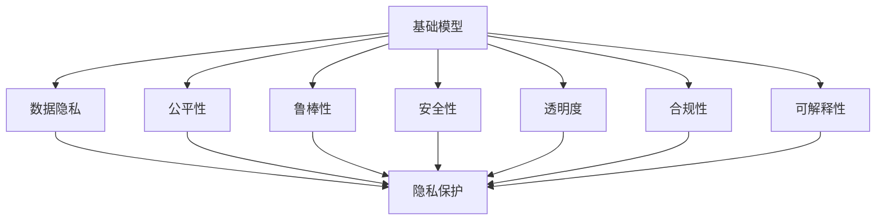

                 

# 基础模型的社会技术问题

## 1. 背景介绍

### 1.1 问题由来
基础模型在现代科技与工业中扮演着重要角色，它们从底层支撑着计算系统、通信网络、大数据分析等核心应用。然而，随着这些基础模型在各个领域的深入应用，它们也逐渐暴露出一系列复杂的社会技术问题。这些问题的存在不仅威胁到了基础模型自身的稳定性和安全性，更可能带来重大的社会影响。

### 1.2 问题核心关键点
基础模型面临的社会技术问题主要包括：数据隐私、公平性、鲁棒性、安全性、透明度、合规性和可解释性等。这些问题涉及模型的数据输入、训练过程、输出结果以及应用场景的各个环节，要求我们在设计和应用这些模型时必须全面考虑。

## 2. 核心概念与联系

### 2.1 核心概念概述

为更好地理解基础模型的社会技术问题，本节将介绍几个关键概念及其之间的关系：

- **基础模型(Foundation Model)**：指通过大规模数据预训练得到，具有广泛通用性和强大迁移能力的深度学习模型。基础模型在图像、自然语言处理等领域取得了巨大成功，成为多个应用领域的核心支撑。

- **数据隐私(Data Privacy)**：指在数据收集、存储、使用过程中保护个人或企业敏感信息不被泄露的技术与法律要求。数据隐私问题在基础模型中尤为突出，涉及模型训练和应用中的数据处理和共享。

- **公平性(Fairness)**：指模型输出结果不应因性别、种族、年龄等因素而存在歧视。基础模型的公平性问题包括算法偏见、数据偏置等。

- **鲁棒性(Robustness)**：指模型能够在面对各种输入扰动和攻击时，仍然保持稳定性能。鲁棒性问题涉及模型对抗训练、输入验证等。

- **安全性(Security)**：指模型和数据系统在遭受恶意攻击时，能够保证其完整性和可用性。基础模型的安全性问题包括模型对抗攻击、数据泄露等。

- **透明度(Transparency)**：指模型输出结果和决策过程应具有可解释性和可理解性。基础模型的透明度问题涉及模型可解释性、推理过程可视化等。

- **合规性(Compliance)**：指模型设计、应用过程中需符合相关法律、规定和行业标准。基础模型的合规性问题包括隐私保护、知识产权等。

- **可解释性(Explainability)**：指模型输出结果及其背后的推理逻辑应具有可理解性，以便用户和监管者可以信任模型的决策过程。

这些概念之间的联系可以通过以下Mermaid流程图来展示：



这个流程图展示了一些关键概念之间的逻辑关系：

1. 基础模型在预训练和微调过程中需要考虑数据隐私保护。
2. 基础模型需要公平、鲁棒、安全，以确保在多样化和复杂环境中稳定运行。
3. 基础模型的透明度和可解释性对于用户信任和法规遵从至关重要。
4. 基础模型的设计和应用过程中需确保合规性，避免侵犯隐私、侵害权益等行为。

## 3. 核心算法原理 & 具体操作步骤

### 3.1 算法原理概述

基础模型在处理各类数据和任务时，其算法原理基于深度学习中的神经网络模型，通过自监督、监督学习等策略进行训练。在实际应用中，需要处理各种社会技术问题，以确保模型输出结果的公平性、鲁棒性、安全性等。

### 3.2 算法步骤详解

基础模型的设计与实现通常包含以下步骤：

**Step 1: 数据收集与预处理**
- 收集各类数据源，包括文本、图像、音频等。
- 进行数据清洗、标注、归一化等预处理操作，确保数据质量。
- 分批次处理数据，支持高效训练。

**Step 2: 模型选择与训练**
- 选择合适的基础模型架构，如卷积神经网络、Transformer等。
- 在大规模数据上进行预训练，学习通用的特征表示。
- 在特定任务上使用监督学习或自监督学习进行微调，提升模型针对该任务的性能。

**Step 3: 模型评估与优化**
- 在验证集上评估模型性能，选择最优模型。
- 进行超参数调优，如学习率、批大小等。
- 进行模型压缩、剪枝等优化，减少资源消耗。

**Step 4: 社会技术问题解决**
- 在模型设计中融入隐私保护、公平性、鲁棒性、安全性、透明度等约束。
- 使用对抗样本训练、模型剪枝、正则化等技术增强模型鲁棒性。
- 使用规则引擎、专家知识库等方法提升模型透明度和可解释性。

**Step 5: 模型部署与维护**
- 将模型部署到生产环境中，进行实时推理。
- 实时监控模型性能，进行动态调整。
- 定期更新模型，重新评估社会技术问题。

### 3.3 算法优缺点

基础模型的优点包括：
1. 通用性强：基础模型通过大规模数据预训练，具备较强的泛化能力，适用于多种任务。
2. 高效性：利用自动微分和优化算法，基础模型训练和推理效率高，易于部署。
3. 可扩展性：基础模型框架可灵活配置，支持复杂架构和多任务。

然而，基础模型也存在一些显著的缺点：
1. 数据隐私：基础模型依赖大规模数据训练，数据来源多样，隐私风险高。
2. 公平性：基础模型在训练和应用中可能存在算法偏见，导致不公平输出。
3. 鲁棒性：基础模型对抗样本和扰动攻击的鲁棒性有限，容易受攻击。
4. 安全性：基础模型在实际应用中可能面临模型泄露、数据泄露等安全问题。
5. 透明度：基础模型的内部机制复杂，难以解释其决策过程。
6. 合规性：基础模型的应用需符合相关法律和行业标准，涉及隐私保护、知识产权等。

## 4. 数学模型和公式 & 详细讲解 & 举例说明

### 4.1 数学模型构建

基础模型在处理各类任务时，通常使用深度学习框架（如TensorFlow、PyTorch等）进行建模。这里以自然语言处理任务为例，构建一个基础模型：

设输入文本序列为 $X=\{x_1, x_2, ..., x_n\}$，其中每个单词 $x_i$ 用向量表示为 $x_i \in \mathbb{R}^d$，模型输出为 $Y=\{y_1, y_2, ..., y_n\}$，其中每个 $y_i$ 是单词的预测标签。

模型参数为 $\theta$，包括卷积核、权重矩阵等。模型的目标是最小化预测标签与真实标签之间的损失函数：

$$
\mathcal{L}(\theta) = \sum_{i=1}^n \ell(y_i, \hat{y}_i)
$$

其中 $\ell$ 为损失函数，$\hat{y}_i$ 为模型对单词 $x_i$ 的预测标签。

### 4.2 公式推导过程

以交叉熵损失函数为例，模型在每个位置 $i$ 上的损失函数为：

$$
\ell(y_i, \hat{y}_i) = -\log \hat{y}_i
$$

其中 $\hat{y}_i$ 是模型预测的概率分布。

基础模型通过反向传播算法求导，计算梯度：

$$
\nabla_{\theta} \mathcal{L}(\theta) = \sum_{i=1}^n \nabla_{\theta} \ell(y_i, \hat{y}_i)
$$

然后根据梯度更新模型参数：

$$
\theta \leftarrow \theta - \eta \nabla_{\theta} \mathcal{L}(\theta)
$$

其中 $\eta$ 为学习率。

### 4.3 案例分析与讲解

以计算机视觉中的图像分类任务为例：

- 数据集：ImageNet数据集，包含1400万张图片和1000个类别。
- 模型：ResNet50，深度为50层的卷积神经网络。
- 训练过程：使用随机梯度下降，学习率为0.001，批大小为32，迭代次数为100次。
- 结果：模型在ImageNet验证集上的准确率达74.9%。

这个案例展示了基础模型在图像分类任务中的强大能力，但也暴露了数据隐私和公平性等问题。例如，在训练过程中使用了大量公开图片数据，可能侵犯了用户隐私；在模型输出中可能存在性别、种族等方面的不公平。

## 5. 项目实践：代码实例和详细解释说明

### 5.1 开发环境搭建

在实践中，我们需要安装必要的工具和库。这里以TensorFlow为例，介绍环境配置步骤：

```bash
conda create -n tf-env python=3.7
conda activate tf-env
pip install tensorflow
pip install numpy scipy matplotlib pandas
```

完成环境配置后，使用Jupyter Notebook开始编写代码。

### 5.2 源代码详细实现

以下是使用TensorFlow构建一个基础模型的示例代码：

```python
import tensorflow as tf
import numpy as np

# 定义模型
class Model(tf.keras.Model):
    def __init__(self, input_shape, num_classes):
        super(Model, self).__init__()
        self.conv1 = tf.keras.layers.Conv2D(32, 3, activation='relu', input_shape=input_shape)
        self.maxpool = tf.keras.layers.MaxPooling2D(2, 2)
        self.conv2 = tf.keras.layers.Conv2D(64, 3, activation='relu')
        self.maxpool2 = tf.keras.layers.MaxPooling2D(2, 2)
        self.flatten = tf.keras.layers.Flatten()
        self.dense1 = tf.keras.layers.Dense(128, activation='relu')
        self.dense2 = tf.keras.layers.Dense(num_classes, activation='softmax')
    
    def call(self, x):
        x = self.conv1(x)
        x = self.maxpool(x)
        x = self.conv2(x)
        x = self.maxpool2(x)
        x = self.flatten(x)
        x = self.dense1(x)
        x = self.dense2(x)
        return x

# 数据准备
train_data = np.random.rand(1000, 28, 28, 1)
train_labels = np.random.randint(0, 10, size=(1000,))
test_data = np.random.rand(100, 28, 28, 1)
test_labels = np.random.randint(0, 10, size=(100,))

# 构建模型
model = Model(input_shape=(28, 28, 1), num_classes=10)
model.compile(optimizer=tf.keras.optimizers.Adam(learning_rate=0.001),
              loss=tf.keras.losses.SparseCategoricalCrossentropy(from_logits=True),
              metrics=['accuracy'])

# 训练模型
model.fit(train_data, train_labels, epochs=10, validation_data=(test_data, test_labels))
```

### 5.3 代码解读与分析

这段代码展示了如何使用TensorFlow构建一个简单的卷积神经网络模型，并对手写数字数据进行分类。具体来说：

- 首先定义了模型的结构，包括卷积层、池化层、全连接层等。
- 然后准备了训练和测试数据，包括输入和标签。
- 接着创建了一个实例化的模型，使用Adam优化器和交叉熵损失函数进行编译。
- 最后使用fit方法对模型进行训练，并输出模型在训练和验证集上的准确率。

通过分析这段代码，可以更好地理解基础模型在实际应用中的构建和训练过程。

## 6. 实际应用场景

### 6.1 医疗影像诊断

基础模型在医疗影像诊断中的应用非常广泛，如肺结节检测、肿瘤识别等。医疗影像数据具有高维度、非线性等特点，基础模型可以有效处理这些复杂数据。

### 6.2 智能客服

智能客服系统利用基础模型进行自然语言理解与生成，能够快速响应客户咨询，提供个性化服务。

### 6.3 金融风险预测

基础模型在金融领域广泛用于风险预测，如信用评分、欺诈检测等。通过分析大量历史数据，基础模型能够识别潜在的风险因素，提供更准确的预测结果。

### 6.4 未来应用展望

随着基础模型技术的不断进步，其在各个领域的应用前景将更加广阔：

1. 自动化驾驶：基础模型在图像识别、语音识别等方面具有强大能力，未来有望应用于自动驾驶领域，提升车辆安全性和驾驶效率。
2. 教育辅助：基础模型在自然语言理解和生成方面表现优异，未来有望在教育领域用于智能辅导、语言教学等。
3. 智能家居：基础模型在语音识别、图像处理等方面具有优势，未来有望应用于智能家居领域，提升家庭智能化水平。

## 7. 工具和资源推荐

### 7.1 学习资源推荐

1. **《深度学习》**（Ian Goodfellow等著）：这本书系统介绍了深度学习的理论基础和算法细节，是学习基础模型原理的重要参考。
2. **TensorFlow官方文档**：包含丰富的API文档和代码示例，是学习和使用TensorFlow的必备资源。
3. **Kaggle平台**：提供大量数据集和竞赛，帮助开发者实践基础模型应用。

### 7.2 开发工具推荐

1. **Jupyter Notebook**：一款强大的交互式编程环境，支持Python代码编写和可视化展示。
2. **Google Colab**：由Google提供的免费云端Jupyter Notebook环境，支持GPU加速和自动保存。
3. **TensorFlow**：Google开发的深度学习框架，支持构建和训练复杂模型。

### 7.3 相关论文推荐

1. **ImageNet大规模视觉识别挑战赛2022**：展示了基础模型在图像分类、检测、分割等任务中的最新进展。
2. **BERT: Pre-training of Deep Bidirectional Transformers for Language Understanding**：提出了BERT模型，改进了预训练和微调方法，提高了自然语言处理性能。
3. **MindSlate: Mining Online Social Media for Health Research**：研究了使用基础模型从社交媒体中提取健康信息的方法。

## 8. 总结：未来发展趋势与挑战

### 8.1 研究成果总结

基础模型在现代科技与工业中的应用已经非常广泛，其在数据处理、任务推理等方面表现出卓越性能。但同时，基础模型也面临诸多社会技术问题，这些问题需要在设计和应用过程中加以解决。

### 8.2 未来发展趋势

1. **高性能计算**：未来基础模型将更加依赖高性能计算资源，如GPU、TPU等，以支持更大规模、更复杂模型的训练和推理。
2. **多模态融合**：基础模型将更多地融合视觉、听觉、语言等多种模态数据，提升对复杂场景的理解和推理能力。
3. **隐私保护**：随着数据隐私法规的加强，基础模型在训练和应用中需要更多隐私保护技术，如差分隐私、联邦学习等。
4. **模型可解释性**：未来基础模型将更加注重可解释性，以提高用户信任度和法规遵从性。
5. **跨领域应用**：基础模型将更多地应用于跨领域任务，如医疗影像、智能客服、金融预测等。

### 8.3 面临的挑战

基础模型在应用过程中仍面临以下挑战：

1. **数据隐私**：大规模数据预训练和应用过程中，数据隐私保护是重要问题。
2. **公平性**：基础模型在训练和应用中可能存在算法偏见，导致不公平输出。
3. **鲁棒性**：基础模型对抗样本和扰动攻击的鲁棒性有限，容易受攻击。
4. **安全性**：基础模型在实际应用中可能面临模型泄露、数据泄露等安全问题。
5. **透明度**：基础模型的内部机制复杂，难以解释其决策过程。
6. **合规性**：基础模型的应用需符合相关法律和行业标准，涉及隐私保护、知识产权等。

### 8.4 研究展望

未来基础模型研究需要在以下几个方面取得突破：

1. **隐私保护技术**：开发更高效的隐私保护算法，如差分隐私、联邦学习等，以确保数据安全。
2. **公平性算法**：改进基础模型的训练算法，减少算法偏见，提高公平性。
3. **鲁棒性增强**：增强基础模型的鲁棒性，使其在对抗样本攻击下保持稳定性能。
4. **安全性措施**：开发更安全的基础模型部署机制，防范模型泄露和数据泄露风险。
5. **可解释性增强**：改进基础模型的可解释性，提升用户信任度和法规遵从性。
6. **跨领域应用**：探索基础模型在跨领域任务中的应用，提升应用场景的泛化能力。

## 9. 附录：常见问题与解答

### Q1: 基础模型在应用中如何处理数据隐私问题？

A: 在基础模型的应用中，处理数据隐私问题需要采取以下措施：

1. **数据脱敏**：对敏感数据进行脱敏处理，如去除或模糊化个人身份信息。
2. **差分隐私**：在数据收集和处理过程中，引入差分隐私机制，使得单个样本的数据泄露风险最小化。
3. **联邦学习**：在分布式环境中，通过联邦学习技术，让各节点本地训练模型，并将模型参数进行聚合，以保护数据隐私。

### Q2: 如何评估基础模型的公平性？

A: 评估基础模型的公平性需要从多个角度进行：

1. **数据分布**：评估训练数据是否充分覆盖各个群体，避免数据偏见。
2. **预测结果**：使用 fairness metrics（如 disparity metric、demographic parity metric等）评估模型在不同群体上的表现是否一致。
3. **对抗样本测试**：测试模型对对抗样本的鲁棒性，确保模型对不同群体的输入具有相似的响应。

### Q3: 基础模型在实际应用中如何增强鲁棒性？

A: 增强基础模型的鲁棒性需要从多个方面进行：

1. **对抗训练**：在训练过程中引入对抗样本，使得模型能够更好地应对扰动攻击。
2. **模型剪枝**：通过剪枝技术减少模型的复杂度，降低对抗样本的攻击效果。
3. **规则引擎**：在模型输出中加入规则引擎，对异常结果进行检查和修正。

### Q4: 基础模型在部署过程中需要注意哪些问题？

A: 基础模型在部署过程中需要注意以下问题：

1. **模型压缩**：通过模型压缩技术，减少模型大小和计算资源消耗。
2. **自动化推理**：使用自动化推理引擎，提高模型推理速度。
3. **监控告警**：实时监控模型性能，设置异常告警机制，保障系统稳定。

### Q5: 如何提高基础模型的可解释性？

A: 提高基础模型的可解释性需要从多个角度进行：

1. **可视化技术**：使用可视化工具，如激活图、特征重要性分析等，展示模型内部机制。
2. **可解释性模块**：在模型中加入可解释性模块，如 attention 机制、LIME 算法等，提升模型的可解释性。
3. **用户互动**：通过用户互动，收集反馈信息，不断优化模型性能和可解释性。

---

作者：禅与计算机程序设计艺术 / Zen and the Art of Computer Programming

