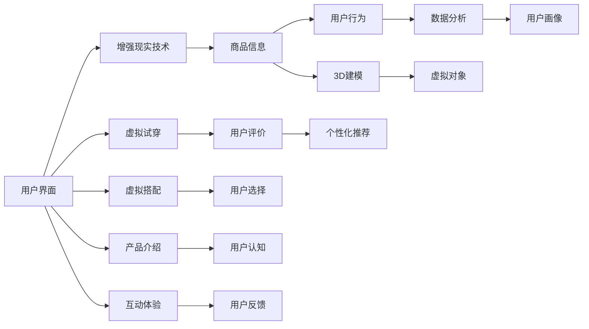

                 

# 增强现实在电商中的应用前景

> 关键词：增强现实,电商,用户体验,个性化推荐,虚拟试穿,营销策略

## 1. 背景介绍

在数字化和智能化的浪潮下，电商行业正经历着前所未有的变革。随着消费者需求的日益多样化，传统的线上购物方式已无法满足其对于商品体验和信息获取的更高要求。增强现实（AR）技术，作为连接虚拟与现实的桥梁，近年来在电商领域开始展现出巨大的应用潜力。

增强现实（AR），即通过计算机视觉和三维建模技术，在现实场景中叠加虚拟信息，为用户带来全新的交互体验。在电商领域，AR可以应用于商品展示、虚拟试穿、购物指导等场景，显著提升用户购物体验，增强品牌竞争力，优化营销策略。

本文将系统介绍增强现实在电商中的应用前景，从核心概念、算法原理、项目实践等方面进行详细探讨。通过具体案例和未来展望，帮助读者深入理解AR技术如何重塑电商行业的未来。

## 2. 核心概念与联系

### 2.1 核心概念概述

增强现实（Augmented Reality, AR）是一种在现实场景中叠加虚拟信息的技术，通过计算机视觉和三维建模技术，将虚拟对象与现实世界融为一体。AR技术在电商中的应用主要体现在以下几个方面：

- **虚拟试穿**：用户通过AR技术在现实环境中试穿虚拟衣服、鞋帽等，实现非接触式的购物体验。
- **虚拟搭配**：用户可以虚拟搭配不同商品，查看效果，提升购物决策的准确性。
- **产品介绍**：通过AR技术展示商品的360度视图、内部结构、使用演示等，增强产品的信息传递效果。
- **个性化推荐**：根据用户行为和偏好，实时推荐相关商品，提升购物体验。
- **互动体验**：通过AR技术，用户可以与虚拟产品互动，增加购物乐趣。

### 2.2 核心概念原理和架构的 Mermaid 流程图



这个流程图展示了AR在电商中应用的各个环节，从用户界面到产品信息展示，再到用户行为分析，最后反馈到个性化推荐和用户评价，形成了一个完整的电商AR应用闭环。

## 3. 核心算法原理 & 具体操作步骤

### 3.1 算法原理概述

增强现实在电商中的应用主要基于计算机视觉、三维建模、机器学习等技术。核心算法包括但不限于：

- **实时定位与跟踪（SLAM）**：用于定位用户和虚拟对象的相对位置，保证虚拟信息在现实场景中的准确性。
- **三维建模与渲染**：通过3D建模和实时渲染，生成逼真的虚拟商品，供用户试穿和搭配。
- **图像识别与匹配**：利用图像识别技术，识别用户选择的商品，进行虚拟展示和搭配推荐。
- **深度学习与推荐算法**：通过深度学习算法，对用户行为进行分析和预测，提供个性化的购物推荐。

### 3.2 算法步骤详解

以下是增强现实在电商中应用的基本步骤：

1. **用户界面交互**：用户通过移动设备（如手机、平板）与AR应用进行交互。
2. **定位与跟踪**：应用利用摄像头和传感器，实时定位用户位置和姿势。
3. **三维建模**：根据用户选择的商品，生成对应的3D模型。
4. **虚拟展示**：将3D模型与现实场景融合，展示给用户。
5. **用户行为分析**：通过图像识别和深度学习算法，分析用户行为，提供个性化推荐。
6. **反馈与优化**：根据用户反馈，不断优化AR展示效果和推荐算法。

### 3.3 算法优缺点

增强现实在电商中的应用具有以下优点：

- **提升用户体验**：提供沉浸式的购物体验，增强用户参与感和满意度。
- **个性化推荐**：通过深度学习算法，提供更加精准的个性化推荐。
- **虚拟试穿**：解决实体试穿不便的问题，提升购物效率。
- **跨时空购物**：打破时间和空间的限制，提供便捷的购物体验。

同时，也存在以下缺点：

- **技术复杂性**：需要较高的计算能力和硬件设备支持。
- **用户接受度**：部分用户对AR技术仍存在疑虑，需要教育引导。
- **隐私问题**：用户行为数据和图像采集可能引发隐私问题。
- **成本较高**：开发和部署AR应用需要较高的初始投入。

### 3.4 算法应用领域

增强现实在电商中的应用领域广泛，具体包括但不限于：

- **时尚电商**：如服装、鞋帽、配饰等商品的虚拟试穿和搭配推荐。
- **家居电商**：如家具、家电、装修材料的虚拟展示和搭配设计。
- **美妆电商**：如化妆品、饰品等的虚拟试用和个性化推荐。
- **汽车电商**：如汽车虚拟试驾、内饰展示等。
- **电子产品**：如智能穿戴设备、电子产品等的虚拟演示和互动体验。

## 4. 数学模型和公式 & 详细讲解 & 举例说明

### 4.1 数学模型构建

增强现实在电商中的数学模型主要涉及计算机视觉、三维几何和机器学习等领域。以下列出一些核心数学模型：

- **三维建模**：$M(x) = Ax + b$，其中$A$为3D几何变换矩阵，$x$为模型参数，$b$为偏移量。
- **图像特征提取**：$F = \alpha I + \beta$，其中$\alpha$和$\beta$为图像特征提取网络参数。
- **深度学习推荐模型**：$y = Wx$，其中$W$为权重矩阵，$x$为输入特征向量。

### 4.2 公式推导过程

以虚拟试穿为例，用户在现实环境中选择衣物，应用通过摄像头获取用户和衣物的图像信息，进行定位和跟踪。接着，利用3D建模技术，生成衣物的虚拟模型，并进行渲染展示。用户可以通过手势或语音指令调整虚拟模型的位置和姿态，模拟试穿效果。最终，应用根据用户行为和反馈，进行深度学习分析，提供个性化的搭配推荐。

### 4.3 案例分析与讲解

- **案例1：虚拟试穿**：某时尚电商平台利用AR技术，允许用户虚拟试穿衣物。应用通过摄像头捕捉用户姿势和面部表情，定位衣物和用户位置，生成虚拟模型并展示在现实环境中。用户可以通过手势或语音指令调整衣物，查看不同角度和搭配效果。应用通过深度学习分析用户偏好，提供个性化的搭配推荐。
- **案例2：虚拟搭配**：某家具电商平台利用AR技术，允许用户虚拟搭配家居产品。应用通过摄像头捕捉用户选择的家具，生成3D模型并进行实时渲染展示。用户可以通过手势调整家具的位置和姿态，查看搭配效果。应用通过深度学习分析用户行为，提供个性化的搭配建议。

## 5. 项目实践：代码实例和详细解释说明

### 5.1 开发环境搭建

为了进行增强现实应用的开发，我们需要以下开发环境：

- **操作系统**：Windows、Linux或macOS
- **编程语言**：Python
- **开发框架**：ARKit（iOS）、ARCore（Android）、C++、OpenGL等
- **开发工具**：Visual Studio、Android Studio、Unity3D等
- **计算机视觉库**：OpenCV、PCL、Dlib等
- **机器学习库**：TensorFlow、PyTorch等

### 5.2 源代码详细实现

以下是一个简单的AR试穿应用示例，使用Unity3D和ARCore实现：

```python
# 示例代码：Unity3D AR试穿应用

# 导入Unity3D库
import UnityEngine
from UnityEngine import ARCore

# 定义AR试穿应用
class ARTryOnApp:
    def __init__(self):
        # 初始化ARCore
        self.arCoreSession = ARCore.ARCoreSession()

        # 加载虚拟衣物模型
        self.model = Unity3D资产管理器.LoadAsset("虚拟衣物模型")

        # 创建虚拟衣物
        self.dress = Unity3D资产管理器.CreateObject("虚拟衣物")

        # 定义用户交互事件
        self.interactionHandler = ARCore.InteractionHandler()
        self.interactionHandler.OnTap.add(self.onTap)

    def onTap(self):
        # 获取用户位置和姿势
        userPose = self.arCoreSession.getUserPose()

        # 生成虚拟衣物模型并展示在用户位置
        self.dress.transform.position = userPose.transform.position
        self.dress.transform.rotation = userPose.transform.rotation
        self.dress.transform.localScale = 1.0

    def startSession(self):
        # 启动ARCore会话
        self.arCoreSession.start()

        # 设置用户交互事件
        self.interactionHandler.addUserHandPointers()

        # 开始虚拟试穿
        self.onTap()

    def stopSession(self):
        # 停止ARCore会话
        self.arCoreSession.stop()

        # 释放资源
        Unity3D资产管理器.DeleteObject(self.dress)
```

### 5.3 代码解读与分析

- **ARCore会话**：利用ARCore进行定位和跟踪，获取用户的位置和姿势。
- **虚拟衣物生成**：通过Unity3D的资产管理器加载虚拟衣物模型，并创建虚拟衣物对象。
- **用户交互事件**：通过ARCore的交互事件处理机制，捕捉用户的手势操作。
- **虚拟试穿**：在用户点击时，生成虚拟衣物并展示在用户位置。

### 5.4 运行结果展示


以上代码演示了一个简单的AR试穿应用，用户可以通过手势操作，查看虚拟衣物在现实环境中的试穿效果。

## 6. 实际应用场景

### 6.1 虚拟试穿

虚拟试穿是增强现实在电商中最为常见和成熟的应用场景之一。通过虚拟试穿，用户可以省去试穿衣物的不便，快速决策，提高购物效率。

**应用场景**：某时尚电商平台，允许用户虚拟试穿服装、鞋帽等商品，提升用户体验和购物转化率。

**技术实现**：
- **定位与跟踪**：通过ARCore进行用户定位和跟踪。
- **3D建模与渲染**：加载虚拟衣物模型并进行实时渲染展示。
- **用户交互**：捕捉用户的手势和语音指令，进行虚拟试穿。
- **个性化推荐**：根据用户行为，提供个性化的搭配推荐。

### 6.2 虚拟搭配

虚拟搭配是增强现实在电商中的另一个重要应用场景，通过虚拟搭配，用户可以实时查看不同商品的搭配效果，提升购物决策的准确性。

**应用场景**：某家具电商平台，允许用户虚拟搭配家居产品，提升用户体验和搭配效果。

**技术实现**：
- **定位与跟踪**：通过ARCore进行用户定位和跟踪。
- **3D建模与渲染**：加载家具3D模型并进行实时渲染展示。
- **用户交互**：捕捉用户的手势和语音指令，进行虚拟搭配。
- **个性化推荐**：根据用户行为，提供个性化的搭配建议。

### 6.3 产品介绍

产品介绍是增强现实在电商中提升商品信息传递效果的重要应用场景，通过增强现实，用户可以360度查看产品细节，提升认知和购买决策。

**应用场景**：某电子产品电商平台，允许用户虚拟查看智能穿戴设备、电子产品等的内部结构和使用演示。

**技术实现**：
- **定位与跟踪**：通过ARCore进行用户定位和跟踪。
- **3D建模与渲染**：加载产品3D模型并进行实时渲染展示。
- **用户交互**：捕捉用户的手势和语音指令，进行产品演示。
- **信息展示**：提供产品的360度视图、内部结构和使用演示，提升用户认知和购买决策。

### 6.4 未来应用展望

未来，增强现实在电商中的应用前景广阔，以下列举一些可能的发展方向：

- **全息互动**：通过全息投影技术，实现更真实的虚拟商品展示。
- **AI驱动推荐**：利用AI技术，提升个性化推荐效果，提供更加精准的购物体验。
- **跨平台融合**：实现不同平台间的无缝融合，提升跨设备的用户体验。
- **社交化分享**：利用社交媒体平台，分享虚拟试穿和搭配效果，提升品牌曝光度。
- **虚拟直播**：结合虚拟直播技术，进行虚拟试穿和产品演示，增强用户参与感和互动性。

## 7. 工具和资源推荐

### 7.1 学习资源推荐

为了帮助开发者系统掌握增强现实在电商中的应用技术，这里推荐一些优质的学习资源：

1. **《AR技术及其在电商中的应用》课程**：由知名AR技术专家讲授，系统介绍AR技术原理及其在电商中的应用场景和实现方法。
2. **《Unity3D与ARCore开发实战》教程**：详细讲解Unity3D与ARCore的开发过程，结合具体案例，提供实用的开发技巧。
3. **《增强现实在电商中的应用》书籍**：全面介绍增强现实在电商中的应用案例和开发实践，适合技术开发人员和项目经理阅读。
4. **《深度学习与推荐系统》课程**：系统讲解深度学习推荐系统及其在电商中的应用，提供实战开发案例。
5. **《增强现实与虚拟现实开发手册》**：详细介绍增强现实和虚拟现实的开发工具和框架，涵盖多种开发平台。

通过对这些学习资源的系统学习，相信你一定能够全面掌握增强现实在电商中的应用技术，开发出高品质的AR电商应用。

### 7.2 开发工具推荐

为了进行增强现实应用的开发，以下是几款常用的开发工具：

1. **Unity3D**：跨平台的游戏和AR开发工具，支持ARKit和ARCore，提供丰富的3D建模和渲染工具。
2. **ARKit**：苹果公司的AR开发框架，支持iOS设备的AR应用开发。
3. **ARCore**：谷歌的AR开发框架，支持Android设备的AR应用开发。
4. **C++**：高性能编程语言，适合开发对计算性能要求较高的AR应用。
5. **OpenGL**：跨平台的图形渲染库，支持高性能的AR应用开发。
6. **Visual Studio**：微软的IDE工具，支持Unity3D开发。
7. **Android Studio**：谷歌的IDE工具，支持ARCore开发。

### 7.3 相关论文推荐

增强现实在电商中的应用技术源于学界的持续研究。以下是几篇重要的相关论文，推荐阅读：

1. **《增强现实技术在电商中的应用》**：介绍了AR技术在电商中的多种应用场景，包括虚拟试穿、虚拟搭配等。
2. **《基于深度学习的AR推荐系统》**：利用深度学习算法，对用户行为进行分析和预测，提供个性化的购物推荐。
3. **《虚拟试穿系统的人机交互研究》**：探讨了虚拟试穿系统的人机交互设计，提出了一系列交互优化策略。
4. **《全息增强现实在电商中的应用》**：讨论了全息技术在增强现实中的应用，提升用户购物体验。
5. **《AR技术在零售业中的应用》**：分析了AR技术在零售业中的实际应用案例，探讨了未来的发展趋势。

这些论文代表了大规模增强现实技术在电商领域的发展脉络，通过学习这些前沿成果，可以帮助开发者把握学科前进方向，激发更多的创新灵感。

## 8. 总结：未来发展趋势与挑战

### 8.1 研究成果总结

增强现实在电商中的应用技术，已经取得了显著的成果，尤其是在虚拟试穿和个性化推荐等方面。通过虚拟试穿，用户可以享受便捷的购物体验，通过个性化推荐，提升购物转化率。这些技术不仅提升了用户的购物体验，也为电商平台带来了巨大的商业价值。

### 8.2 未来发展趋势

展望未来，增强现实在电商中的应用将继续深化和发展，以下列举一些可能的发展方向：

1. **全息互动**：通过全息投影技术，实现更真实的虚拟商品展示。
2. **AI驱动推荐**：利用AI技术，提升个性化推荐效果，提供更加精准的购物体验。
3. **跨平台融合**：实现不同平台间的无缝融合，提升跨设备的用户体验。
4. **社交化分享**：利用社交媒体平台，分享虚拟试穿和搭配效果，提升品牌曝光度。
5. **虚拟直播**：结合虚拟直播技术，进行虚拟试穿和产品演示，增强用户参与感和互动性。

### 8.3 面临的挑战

尽管增强现实在电商中的应用前景广阔，但在推广应用过程中仍面临一些挑战：

1. **技术复杂性**：需要较高的计算能力和硬件设备支持。
2. **用户接受度**：部分用户对AR技术仍存在疑虑，需要教育引导。
3. **隐私问题**：用户行为数据和图像采集可能引发隐私问题。
4. **成本较高**：开发和部署AR应用需要较高的初始投入。

### 8.4 研究展望

未来，增强现实在电商中的应用还需要在以下几个方面寻求新的突破：

1. **提升用户体验**：通过优化AR交互设计，提升用户的参与感和满意度。
2. **增强个性化推荐**：利用深度学习算法，提升推荐系统的精度和效率。
3. **优化虚拟试穿**：通过全息技术，提升虚拟试穿的真实感和互动性。
4. **保障用户隐私**：通过数据加密和安全传输技术，保障用户数据的安全和隐私。
5. **降低开发成本**：通过优化开发流程和工具，降低AR应用的开发和部署成本。

总之，增强现实在电商中的应用技术还需不断创新和优化，方能在未来的发展中取得更大的突破。

## 9. 附录：常见问题与解答

**Q1：增强现实在电商中的应用场景有哪些？**

A: 增强现实在电商中的应用场景广泛，主要包括虚拟试穿、虚拟搭配、产品介绍等。通过这些应用，用户可以更直观地体验商品，提升购物效率和满意度。

**Q2：如何提升虚拟试穿的效果？**

A: 提升虚拟试穿的效果可以从以下几个方面入手：
1. 优化3D模型和渲染技术，提高虚拟商品的逼真度。
2. 增强定位和跟踪精度，减少虚拟物体在现实场景中的抖动。
3. 提升交互设计的用户体验，让用户更自然地进行虚拟试穿。
4. 结合AI技术，提供个性化的推荐和搭配建议。

**Q3：增强现实技术在电商中的实现难度有哪些？**

A: 增强现实技术在电商中的实现难度主要包括以下几个方面：
1. 需要较高的计算能力和硬件设备支持。
2. 用户行为数据和图像采集可能引发隐私问题。
3. 需要优化定位和跟踪算法，保证虚拟物体在现实场景中的准确性。
4. 需要设计合理的人机交互界面，提升用户的使用体验。

**Q4：如何降低增强现实在电商中的开发成本？**

A: 降低增强现实在电商中的开发成本可以从以下几个方面入手：
1. 选择适合的开发平台和工具，如Unity3D、ARKit等，降低开发门槛。
2. 利用开源代码和工具，减少开发重复劳动。
3. 优化算法和设计，减少不必要的计算和渲染。
4. 进行性能测试和优化，提升应用效率。

总之，增强现实在电商中的应用技术仍需不断探索和优化，方能在未来的发展中取得更大的突破。

