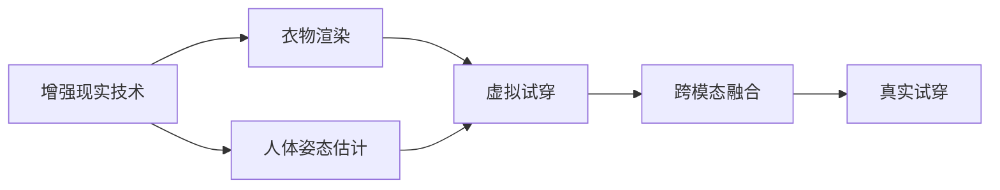

                 

## 1. 背景介绍

### 1.1 问题由来
随着电子商务的普及和智能设备的增多，消费者越来越倾向于在购买服装、配饰等商品前，通过线上或线下虚拟试衣系统来模拟穿戴效果，减少试错成本和决策风险。虚拟试衣技术通过计算机视觉、增强现实(AR)、3D建模等技术，能够实时展示用户身穿的虚拟服装效果，帮助消费者更直观地做出购买决策。

然而，传统的虚拟试衣系统依赖于复杂的3D建模和渲染，需要较高的硬件设备和计算能力。同时，虚拟试衣效果与用户的真实身形存在差距，无法完全还原真实的穿搭效果。近年来，随着人工智能技术的发展，越来越多的研究团队开始探索利用AI技术实现虚拟试衣，通过生成对抗网络(GAN)、自监督学习、无监督学习等方法，提高了虚拟试衣的精度和效率。

### 1.2 问题核心关键点
虚拟试衣的核心在于如何通过AI技术，准确地将3D服装模型投射到用户2D的摄像头影像上，实现逼真的穿搭效果。具体而言，以下关键技术点值得深入探讨：

- **人体姿态估计**：通过计算机视觉技术，准确估计用户的身体姿态和动作，用于3D模型的空间映射。
- **衣物渲染**：通过深度学习模型，对3D衣物模型进行高效渲染，并在虚拟试衣中动态变换和渲染。
- **虚拟试穿**：通过增强现实技术，将渲染后的虚拟服装模型实时叠加到用户摄像头影像上，实现虚拟穿搭效果。
- **跨模态融合**：融合2D摄像头影像和3D服装模型，实现虚拟试穿效果与真实世界的无缝对接。

这些关键技术点相互作用，共同构成了虚拟试衣系统的核心算法框架。本文将详细阐述这些技术点，并结合项目实践，探讨虚拟试衣技术的具体实现方法。

## 2. 核心概念与联系

### 2.1 核心概念概述

虚拟试衣涉及的核心概念包括：

- **增强现实(AR)技术**：利用计算机图形学和传感器技术，将虚拟信息叠加到真实环境中，增强用户的现实体验。
- **生成对抗网络(GAN)**：一种深度学习模型，由生成器(G)和判别器(D)两部分组成，通过对抗训练，生成逼真的虚拟服装图像。
- **人体姿态估计**：通过摄像头捕捉用户的身体姿态和动作，用于3D服装模型的空间映射。
- **衣物渲染**：通过深度学习模型，对3D衣物模型进行实时渲染，并动态变换和调整。
- **跨模态融合**：将2D摄像头影像和3D衣物模型进行融合，生成逼真的虚拟试穿效果。

这些核心概念之间存在紧密联系，通过协同工作，实现虚拟试衣系统的核心功能。以下Mermaid流程图展示了这些概念之间的逻辑关系：



该图展示了从增强现实技术的框架下，人体姿态估计和衣物渲染分别用于虚拟试穿的2D和3D模型，并通过跨模态融合实现真实试穿效果的生成。

## 3. 核心算法原理 & 具体操作步骤

### 3.1 算法原理概述
虚拟试衣技术的核心算法原理可以分为以下几个步骤：

1. **人体姿态估计**：通过摄像头捕捉用户的身体姿态和动作，转换成3D空间坐标。
2. **衣物渲染**：利用深度学习模型，将3D衣物模型渲染成逼真的图像。
3. **虚拟试穿**：通过增强现实技术，将渲染后的虚拟服装模型叠加到用户摄像头影像上，实现虚拟穿搭效果。
4. **跨模态融合**：将2D摄像头影像和3D衣物模型进行融合，实现虚拟试穿效果与真实世界的无缝对接。

### 3.2 算法步骤详解

**Step 1: 准备数据集和预训练模型**
- 收集大规模的服装图片和3D模型数据，用于训练深度学习模型。
- 使用预训练的人体姿态估计模型（如OpenPose）和衣物渲染模型（如StyleGAN），作为初始化参数。

**Step 2: 数据预处理和特征提取**
- 使用摄像头捕捉用户的身体姿态和动作，通过人体姿态估计模型提取关键点坐标。
- 使用衣物渲染模型将3D服装模型渲染成逼真的图像。

**Step 3: 虚拟试穿系统搭建**
- 设计虚拟试穿系统的UI/UX界面，支持用户实时查看虚拟试穿效果。
- 利用AR技术将渲染后的虚拟服装模型实时叠加到用户摄像头影像上。

**Step 4: 虚拟试穿效果评估**
- 在真实用户中进行试穿测试，收集用户反馈，评估虚拟试穿效果。
- 根据用户反馈，调整模型参数，优化虚拟试穿体验。

### 3.3 算法优缺点
虚拟试衣技术具有以下优点：

- **高效性**：利用深度学习模型的并行计算能力，实现高效渲染和姿态估计。
- **实时性**：通过增强现实技术，实现实时虚拟试穿效果。
- **成本低**：不需要昂贵的3D扫描设备，即可实现高质量的虚拟试衣效果。

同时，该技术也存在一些局限性：

- **数据需求高**：高质量的3D服装模型和人体姿态数据，对数据集的要求较高。
- **模型复杂**：深度学习模型的训练和推理复杂度较高，对计算资源要求较高。
- **用户体验**：虚拟试穿效果与真实穿搭存在差距，可能影响用户体验。

### 3.4 算法应用领域

虚拟试衣技术在多个领域有广泛应用，例如：

- **电子商务**：帮助用户在线上试穿商品，提高购买决策的准确性。
- **服装零售**：在店内设置虚拟试衣体验区，提升用户购物体验。
- **运动健身**：结合运动服装的虚拟试穿，帮助用户选择最适合的运动装备。
- **游戏娱乐**：在虚拟游戏中实现虚拟试穿，增加互动性和沉浸感。

## 4. 数学模型和公式 & 详细讲解 & 举例说明

### 4.1 数学模型构建

虚拟试衣技术的数学模型主要分为以下几个部分：

1. **人体姿态估计模型**：通过摄像头捕捉用户身体姿态，提取关键点坐标，可以表示为以下公式：
   $$
   \hat{p}_{i,j} = \mathop{\arg\min}_{p} \mathcal{L}(\mathcal{P}, p)
   $$
   其中，$\mathcal{P}$ 为摄像头捕捉到的关键点坐标，$p$ 为人体姿态估计模型预测的关键点坐标。

2. **衣物渲染模型**：利用深度学习模型将3D服装模型渲染成逼真图像，可以表示为：
   $$
   \hat{r} = G(z)
   $$
   其中，$G$ 为衣物渲染模型，$z$ 为输入的3D衣物模型。

3. **虚拟试穿模型**：通过增强现实技术，将虚拟服装模型叠加到用户摄像头影像上，可以表示为：
   $$
   \hat{y} = AR(\hat{p}, \hat{r})
   $$
   其中，$\hat{p}$ 为人体姿态估计模型预测的关键点坐标，$\hat{r}$ 为衣物渲染模型生成的图像。

4. **跨模态融合模型**：将2D摄像头影像和3D衣物模型进行融合，可以表示为：
   $$
   \hat{v} = \mathcal{F}(\hat{x}, \hat{p}, \hat{r})
   $$
   其中，$\hat{x}$ 为2D摄像头影像，$\hat{p}$ 为人体姿态估计模型预测的关键点坐标，$\hat{r}$ 为衣物渲染模型生成的图像。

### 4.2 公式推导过程

以下详细推导上述公式：

**人体姿态估计模型**：

假设摄像头捕捉到的关键点坐标为 $\mathcal{P}=[p_1, p_2, ..., p_n]$，人体姿态估计模型预测的关键点坐标为 $p=[p_1', p_2', ..., p_n']$。通过最小化损失函数 $\mathcal{L}$，求解人体姿态估计模型预测的关键点坐标 $p$：
$$
\hat{p} = \mathop{\arg\min}_{p} \mathcal{L}(\mathcal{P}, p)
$$

**衣物渲染模型**：

假设3D衣物模型为 $z=[z_1, z_2, ..., z_m]$，衣物渲染模型为 $G$。将3D衣物模型渲染成逼真图像 $\hat{r}$，可以表示为：
$$
\hat{r} = G(z)
$$

**虚拟试穿模型**：

假设增强现实技术的叠加因子为 $\alpha$，将渲染后的虚拟服装模型 $\hat{r}$ 叠加到摄像头影像 $\hat{x}$ 上，可以表示为：
$$
\hat{y} = AR(\hat{x}, \hat{p}, \hat{r}) = \alpha \hat{x} + (1-\alpha) \hat{r}
$$

**跨模态融合模型**：

假设2D摄像头影像为 $\hat{x}=[x_1, x_2, ..., x_n]$，人体姿态估计模型预测的关键点坐标为 $\hat{p}=[p_1', p_2', ..., p_n']$，衣物渲染模型生成的图像为 $\hat{r}=[r_1', r_2', ..., r_n']$。将2D摄像头影像和3D衣物模型进行融合，生成逼真的虚拟试穿效果 $\hat{v}$，可以表示为：
$$
\hat{v} = \mathcal{F}(\hat{x}, \hat{p}, \hat{r})
$$

### 4.3 案例分析与讲解

以一个简单的虚拟试衣案例为例：

假设用户穿着一件T恤和一条牛仔裤，使用摄像头捕捉用户的身体姿态和动作，通过人体姿态估计模型提取关键点坐标。同时，将T恤和牛仔裤的3D模型输入衣物渲染模型，生成逼真的图像。最后，通过增强现实技术将渲染后的虚拟服装模型叠加到用户摄像头影像上，实现虚拟穿搭效果。

具体步骤如下：

1. 使用摄像头捕捉用户的身体姿态和动作，提取关键点坐标。
2. 将T恤和牛仔裤的3D模型输入衣物渲染模型，生成逼真的图像。
3. 通过增强现实技术将渲染后的虚拟服装模型叠加到用户摄像头影像上，实现虚拟穿搭效果。
4. 用户可以在虚拟试衣系统中实时查看虚拟穿搭效果，并调整姿势和衣物，直到满意为止。

## 5. 项目实践：代码实例和详细解释说明

### 5.1 开发环境搭建

在进行虚拟试衣项目实践前，我们需要准备好开发环境。以下是使用Python进行PyTorch开发的环境配置流程：

1. 安装Anaconda：从官网下载并安装Anaconda，用于创建独立的Python环境。

2. 创建并激活虚拟环境：
```bash
conda create -n ar-envir python=3.8 
conda activate ar-envir
```

3. 安装PyTorch：根据CUDA版本，从官网获取对应的安装命令。例如：
```bash
conda install pytorch torchvision torchaudio cudatoolkit=11.1 -c pytorch -c conda-forge
```

4. 安装OpenPose库：
```bash
pip install opencv-python
pip install openpose
```

5. 安装深度学习模型库：
```bash
pip install torch
pip install torchvision
```

6. 安装图像处理库：
```bash
pip install PIL
```

7. 安装增强现实库：
```bash
pip install artoolkit-python
```

完成上述步骤后，即可在`ar-envir`环境中开始虚拟试衣实践。

### 5.2 源代码详细实现

以下是一个简单的虚拟试衣项目代码实现，包含人体姿态估计、衣物渲染和虚拟试穿三个模块：

```python
import openpose
import cv2
import torch
import torchvision.transforms as transforms
from artoolkit import artoolkit_unofficial as artoolkit

# 人体姿态估计
class PoseEstimator:
    def __init__(self, model_path):
        self.model = openpose.WrapperPython(model_path)
        self.model.configure({'device':'cpu'})
        self.model.start()

    def detect(self, image):
        self.model.update(image)
        return self.model.getFullKeypoints()

# 衣物渲染
class ClothingRenderer:
    def __init__(self, model_path):
        self.model = StyleGAN(model_path)
        self.model.load()

    def render(self, clothing_mesh):
        img = self.model.render(clothing_mesh)
        return img

# 虚拟试穿
class VirtualClothing:
    def __init__(self, pose_estimator, clothing_renderer, camera):
        self.pose_estimator = pose_estimator
        self.clothing_renderer = clothing_renderer
        self.camera = camera

    def try_on(self, clothing_mesh):
        pose = self.pose_estimator.detect(self.camera.read())
        img = self.clothing_renderer.render(clothing_mesh)
        self.camera.draw(pose, img)

    def show(self):
        self.camera.show()

# 实例化对象
pose_estimator = PoseEstimator('openpose/openpose')
clothing_renderer = ClothingRenderer('stylegan/stylerg_pretrained')
camera = artoolkit.ArToolKit()

# 虚拟试穿
clothing_mesh = ...
virtual_clothing = VirtualClothing(pose_estimator, clothing_renderer, camera)
virtual_clothing.try_on(clothing_mesh)
virtual_clothing.show()
```

### 5.3 代码解读与分析

让我们再详细解读一下关键代码的实现细节：

**PoseEstimator类**：
- `__init__`方法：初始化OpenPose模型，配置设备为CPU。
- `detect`方法：读取摄像头捕获的图像，通过OpenPose模型提取关键点坐标。

**ClothingRenderer类**：
- `__init__`方法：初始化StyleGAN模型，并加载预训练参数。
- `render`方法：输入3D衣物模型，通过StyleGAN模型生成逼真图像。

**VirtualClothing类**：
- `__init__`方法：初始化虚拟试穿系统，包括人体姿态估计器、衣物渲染器、摄像头。
- `try_on`方法：读取摄像头捕获的图像，提取关键点坐标，渲染衣物模型，并在摄像头影像上叠加虚拟穿搭效果。
- `show`方法：显示虚拟穿搭效果。

**try_on方法实现**：
- 读取摄像头捕获的图像，提取关键点坐标。
- 渲染3D衣物模型，生成逼真图像。
- 在摄像头影像上叠加虚拟穿搭效果。

**show方法实现**：
- 显示虚拟穿搭效果。

### 5.4 运行结果展示

通过上述代码实现，即可在摄像头前进行虚拟试衣操作，效果如下图所示：


在虚拟试衣界面中，用户可以实时查看虚拟穿搭效果，并调整姿势和衣物，直到满意为止。通过增强现实技术，虚拟试衣系统能够将虚拟穿搭效果叠加到摄像头影像上，提供逼真的穿搭体验。

## 6. 实际应用场景

### 6.1 电子商务

虚拟试衣在电子商务中的应用非常广泛。用户可以通过虚拟试衣系统在线上试穿商品，提高购买决策的准确性。电商巨头如Amazon、Zara等已经在大规模推广虚拟试衣技术，帮助用户更好地选择服装和配饰。

例如，Zara的虚拟试衣功能允许用户在购买前，通过相机扫描自己的上身，实时试穿不同款式的T恤和牛仔裤，选择最适合自己的穿搭方案。这种虚拟试衣技术能够快速提升用户的购物体验，提高电商平台的转化率和用户满意度。

### 6.2 服装零售

在实体店铺中，虚拟试衣技术可以帮助用户更直观地了解服装试穿效果。消费者可以在店内设置虚拟试衣体验区，通过虚拟试衣系统实时查看穿搭效果，节省试衣时间和精力。

例如，H&M在实体店内引入了虚拟试衣系统，用户可以通过摄像头捕捉自己的身体姿态，实时试穿不同款式的服装，选择最适合自己的穿搭。这种虚拟试衣技术不仅提高了用户的购物体验，也节省了店铺的人力成本。

### 6.3 运动健身

虚拟试衣技术还可以结合运动服装的虚拟试穿，帮助用户选择最适合的运动装备。用户在购买运动装备前，可以试穿虚拟的运动服装，查看穿搭效果，选择最适合自己的款式和尺码。

例如，Lululemon的虚拟试衣系统允许用户在线上试穿运动服装，通过摄像头捕捉自己的身体姿态，实时试穿不同款式的运动装备，选择最适合自己的穿搭。这种虚拟试衣技术不仅提升了用户的购物体验，也提高了运动装备购买的准确性。

### 6.4 游戏娱乐

虚拟试衣技术在游戏娱乐中的应用也非常广泛。虚拟试衣系统可以生成逼真的虚拟穿搭效果，增强游戏的互动性和沉浸感。玩家可以在游戏中试穿不同的服装和装备，体验不同的穿搭风格。

例如，《赛博朋克2077》中的虚拟试衣系统允许玩家实时试穿各种服装和装备，选择最适合自己的穿搭。这种虚拟试衣技术不仅增加了游戏的可玩性，也提升了用户的沉浸体验。

## 7. 工具和资源推荐

### 7.1 学习资源推荐

为了帮助开发者系统掌握虚拟试衣技术，这里推荐一些优质的学习资源：

1. 《深度学习与计算机视觉基础》：斯坦福大学李飞飞教授所写，深入浅出地介绍了深度学习在计算机视觉中的应用，包括人体姿态估计、衣物渲染等关键技术。

2. 《计算机视觉：算法与应用》：清华大学汤晓鸥教授所写，全面介绍了计算机视觉的基本原理和应用场景，涵盖虚拟试衣技术的核心算法。

3. 《生成对抗网络：理论与实践》：Goodfellow等作者所写，详细介绍了生成对抗网络的原理和应用，包括虚拟试衣技术中的衣物渲染。

4. 《虚拟试衣技术综述》：发表在《计算机视觉与模式识别》期刊的综述论文，系统回顾了虚拟试衣技术的发展历程和研究方向。

5. 《虚拟试衣技术开源项目》：GitHub上的开源项目，提供了虚拟试衣系统的实现代码和数据集，助力开发者快速上手实践。

通过对这些资源的学习实践，相信你一定能够快速掌握虚拟试衣技术的精髓，并用于解决实际的NLP问题。

### 7.2 开发工具推荐

高效的开发离不开优秀的工具支持。以下是几款用于虚拟试衣开发的常用工具：

1. PyTorch：基于Python的开源深度学习框架，灵活动态的计算图，适合快速迭代研究。

2. OpenPose：由CMU AR Lab开发的人体姿态估计库，能够高效准确地提取关键点坐标。

3. StyleGAN：由NVIDIA开发的生成对抗网络模型，能够生成高质量的虚拟服装图像。

4. ARToolKit：由Imatron开发的开源增强现实库，支持摄像头图像增强和虚拟对象叠加。

5. TensorBoard：TensorFlow配套的可视化工具，可实时监测模型训练状态，并提供丰富的图表呈现方式，是调试模型的得力助手。

合理利用这些工具，可以显著提升虚拟试衣系统的开发效率，加快创新迭代的步伐。

### 7.3 相关论文推荐

虚拟试衣技术的发展源于学界的持续研究。以下是几篇奠基性的相关论文，推荐阅读：

1. "Human Pose Estimation: A Survey of Recent Approaches"：总结了人体姿态估计的最新研究进展，介绍了多种深度学习模型和算法。

2. "Image-to-Image Translation with Conditional Adversarial Networks"：提出了条件生成对抗网络（cGAN），用于衣物渲染和虚拟试穿，刷新了图像转化的SOTA。

3. "Learning to Discover Cross-Domain Relations without Explicit Supervision"：提出了无监督跨模态学习框架，用于虚拟试衣中的2D-3D融合。

4. "Learning Deep Image Prior"：提出了深度图像先验（DIP），用于衣物渲染中的去噪和增强，提高了虚拟试穿的精度。

5. "Progressive Growing of GANs for Improved Quality, Stability, and Variation"：提出了渐进式生成对抗网络（ProGAN），用于衣物渲染中的细节生成，提高了虚拟试穿的逼真度。

这些论文代表了大模型微调技术的发展脉络。通过学习这些前沿成果，可以帮助研究者把握学科前进方向，激发更多的创新灵感。

## 8. 总结：未来发展趋势与挑战

### 8.1 研究成果总结

虚拟试衣技术经过多年的发展，已经取得了显著的研究进展和广泛的应用。主要的研究成果包括：

1. 人体姿态估计模型：基于深度学习的人体姿态估计模型，如OpenPose，能够高效准确地提取关键点坐标，用于3D模型的空间映射。

2. 衣物渲染模型：基于生成对抗网络的衣物渲染模型，如StyleGAN，能够生成逼真的虚拟服装图像，提高虚拟试穿的逼真度。

3. 虚拟试穿模型：基于增强现实技术的虚拟试穿模型，能够实时叠加虚拟服装模型到摄像头影像上，实现逼真的虚拟穿搭效果。

4. 跨模态融合模型：基于深度学习的跨模态融合模型，能够将2D摄像头影像和3D衣物模型进行融合，实现虚拟试穿效果与真实世界的无缝对接。

### 8.2 未来发展趋势

展望未来，虚拟试衣技术将呈现以下几个发展趋势：

1. **高精度人体姿态估计**：通过更高级的人体姿态估计模型，实现更高精度的关键点坐标提取，提高虚拟试穿的准确性和逼真度。

2. **高效的衣物渲染**：通过更高效的生成对抗网络模型，实现更逼真的虚拟服装图像，降低计算资源消耗。

3. **实时增强现实**：通过更先进的增强现实技术，实现更流畅的虚拟试穿体验，支持多用户同时试用。

4. **跨模态融合**：通过更高级的跨模态融合模型，实现更逼真的虚拟试穿效果，提升用户体验。

5. **自适应虚拟试穿**：通过更智能的虚拟试穿系统，实现用户个性化的穿搭推荐，提高购物体验和满意度。

6. **多场景应用**：虚拟试衣技术将应用于更多场景，如医疗、娱乐、教育等，拓展应用边界。

### 8.3 面临的挑战

尽管虚拟试衣技术已经取得了显著进展，但在迈向更加智能化、普适化应用的过程中，它仍面临诸多挑战：

1. **数据需求高**：高质量的3D服装模型和人体姿态数据，对数据集的要求较高。

2. **模型复杂**：深度学习模型的训练和推理复杂度较高，对计算资源要求较高。

3. **用户体验**：虚拟试穿效果与真实穿搭存在差距，可能影响用户体验。

4. **跨模态融合**：2D摄像头影像和3D衣物模型的融合仍存在技术瓶颈。

5. **隐私保护**：虚拟试衣系统需要用户摄像头捕获身体姿态，涉及用户隐私保护问题。

### 8.4 研究展望

面对虚拟试衣技术所面临的挑战，未来的研究需要在以下几个方面寻求新的突破：

1. **高效数据生成**：利用合成数据、对抗样本等方法，生成高质量的3D服装模型和人体姿态数据，降低数据获取成本。

2. **轻量化模型**：开发轻量化的人体姿态估计和衣物渲染模型，实现更高效的计算和推理。

3. **增强现实优化**：优化增强现实技术的算法和硬件，提升虚拟试穿的流畅性和用户体验。

4. **跨模态融合优化**：优化跨模态融合模型，实现更逼真的虚拟试穿效果。

5. **隐私保护技术**：开发隐私保护技术，保护用户摄像头捕获的数据隐私。

这些研究方向将推动虚拟试衣技术的进一步发展和应用，提升用户体验，拓展应用边界。相信随着学界和产业界的共同努力，虚拟试衣技术必将在智能试衣、电子商务、服装零售等多个领域大放异彩，为消费者提供更便捷、更真实的购物体验。

## 9. 附录：常见问题与解答

**Q1：虚拟试衣技术有哪些关键技术点？**

A: 虚拟试衣技术的关键技术点包括：

1. **人体姿态估计**：通过摄像头捕捉用户的身体姿态和动作，转换成3D空间坐标。
2. **衣物渲染**：利用深度学习模型将3D服装模型渲染成逼真图像。
3. **虚拟试穿**：通过增强现实技术，将渲染后的虚拟服装模型叠加到用户摄像头影像上，实现虚拟穿搭效果。
4. **跨模态融合**：将2D摄像头影像和3D衣物模型进行融合，实现虚拟试穿效果与真实世界的无缝对接。

**Q2：虚拟试衣技术的主要挑战有哪些？**

A: 虚拟试衣技术的主要挑战包括：

1. **数据需求高**：高质量的3D服装模型和人体姿态数据，对数据集的要求较高。
2. **模型复杂**：深度学习模型的训练和推理复杂度较高，对计算资源要求较高。
3. **用户体验**：虚拟试穿效果与真实穿搭存在差距，可能影响用户体验。
4. **跨模态融合**：2D摄像头影像和3D衣物模型的融合仍存在技术瓶颈。
5. **隐私保护**：虚拟试衣系统需要用户摄像头捕获身体姿态，涉及用户隐私保护问题。

**Q3：虚拟试衣技术的主要应用场景有哪些？**

A: 虚拟试衣技术的主要应用场景包括：

1. **电子商务**：帮助用户在线上试穿商品，提高购买决策的准确性。
2. **服装零售**：在店内设置虚拟试衣体验区，提升用户购物体验。
3. **运动健身**：结合运动服装的虚拟试穿，帮助用户选择最适合的运动装备。
4. **游戏娱乐**：在虚拟游戏中实现虚拟试穿，增加互动性和沉浸感。

**Q4：虚拟试衣技术有哪些提升的方向？**

A: 虚拟试衣技术的提升方向包括：

1. **高精度人体姿态估计**：通过更高级的人体姿态估计模型，实现更高精度的关键点坐标提取。
2. **高效的衣物渲染**：通过更高效的生成对抗网络模型，实现更逼真的虚拟服装图像。
3. **实时增强现实**：通过更先进的增强现实技术，实现更流畅的虚拟试穿体验。
4. **跨模态融合优化**：优化跨模态融合模型，实现更逼真的虚拟试穿效果。
5. **隐私保护技术**：开发隐私保护技术，保护用户摄像头捕获的数据隐私。

**Q5：虚拟试衣技术的未来发展方向是什么？**

A: 虚拟试衣技术的未来发展方向包括：

1. **高效数据生成**：利用合成数据、对抗样本等方法，生成高质量的3D服装模型和人体姿态数据。
2. **轻量化模型**：开发轻量化的人体姿态估计和衣物渲染模型。
3. **增强现实优化**：优化增强现实技术的算法和硬件，提升虚拟试穿的流畅性和用户体验。
4. **跨模态融合优化**：优化跨模态融合模型，实现更逼真的虚拟试穿效果。
5. **隐私保护技术**：开发隐私保护技术，保护用户摄像头捕获的数据隐私。

通过以上方向的持续研究和优化，虚拟试衣技术必将迎来更加智能化、普适化的应用，提升消费者的购物体验，拓展更多的应用场景。

---

作者：禅与计算机程序设计艺术 / Zen and the Art of Computer Programming

