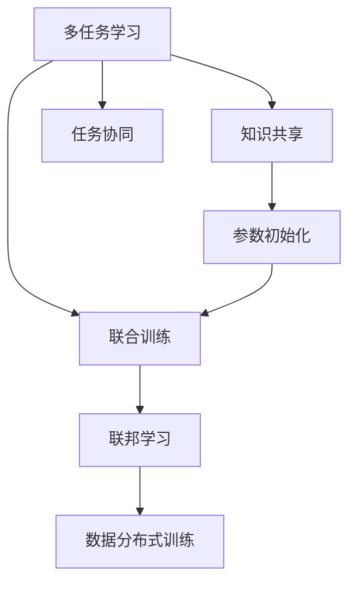

                 

# 多任务学习 (Multi-Task Learning) 原理与代码实例讲解

> 关键词：多任务学习,ML,泛化能力,任务协同,知识共享,联邦学习,Federated Learning

## 1. 背景介绍

### 1.1 问题由来
在人工智能领域，数据是最为宝贵的资源。然而，现实世界的复杂性和多样性意味着一个单一任务的数据集往往无法完全覆盖所有相关的信息。这导致在训练模型时，常常需要收集多个不同任务的数据集。这样不仅增加了数据收集和处理的复杂度，而且也带来了数据的冗余，降低了数据利用率。为了提高数据利用效率，同时增强模型的泛化能力，多任务学习(Multi-Task Learning, MTL)应运而生。

### 1.2 问题核心关键点
多任务学习是一种同时训练多个相关任务的机器学习技术。它的核心思想是，通过联合训练多个任务，共享它们之间的知识，从而提高每个任务的性能，增强模型的泛化能力。

MTL在学术界和工业界都受到了广泛关注，并逐渐成为深度学习的重要研究方向。它的应用包括但不限于医疗诊断、自然语言处理、计算机视觉等领域，在这些领域，多任务学习的实践已经被证明能够显著提升模型性能。

### 1.3 问题研究意义
研究多任务学习具有重要意义：

1. **提升数据利用效率**：通过共享任务之间的知识，可以减少数据冗余，提高数据利用率。
2. **增强模型泛化能力**：联合训练多个任务，有助于提升模型的泛化能力，使其在未见过的数据上表现更好。
3. **降低数据收集成本**：多任务学习可以利用少于单一任务所需的数据进行训练，降低数据收集和处理的成本。
4. **提高模型性能**：多任务学习可以提升模型的综合性能，特别是在数据稀缺的情况下。
5. **支持跨领域学习**：通过联合训练不同领域的相关任务，促进知识迁移，提高模型在不同领域上的表现。

## 2. 核心概念与联系

### 2.1 核心概念概述

为了更好地理解多任务学习的原理，本节将介绍几个核心概念：

- **多任务学习(Multi-Task Learning, MTL)**：同时训练多个相关任务，共享它们之间的知识，提升模型的泛化能力和性能。
- **联合训练(Joint Training)**：将多个任务的数据同时输入模型，进行联合训练，共享参数。
- **知识共享(Knowledge Sharing)**：通过共享不同任务间的知识，提升模型的整体性能。
- **任务协同(Task Collaboration)**：联合训练多个任务，使得它们在参数空间中相互协调，形成更加一致的知识表示。
- **参数初始化(Parameter Initialization)**：通过预训练或转移学习，初始化模型参数，以便更好地进行联合训练。
- **联邦学习(Federated Learning)**：通过分布式训练，在多个设备上同时训练模型，避免数据集集中在单一设备上带来的隐私和安全风险。

这些核心概念之间的逻辑关系可以通过以下Mermaid流程图来展示：



这个流程图展示多任务学习的核心概念及其之间的关系：

1. 多任务学习通过联合训练多个任务，共享知识。
2. 联合训练使得模型在参数空间中协同工作，形成一致的知识表示。
3. 知识共享通过共享不同任务间的知识，提升模型整体性能。
4. 参数初始化通过预训练或转移学习，初始化模型参数。
5. 联邦学习通过分布式训练，避免集中式训练带来的隐私和安全风险。

## 3. 核心算法原理 & 具体操作步骤
### 3.1 算法原理概述

多任务学习的核心思想是通过联合训练多个任务，共享它们之间的知识，从而提高模型的泛化能力和性能。在多任务学习中，我们通常会将多个相关任务定义为联合优化问题，其目标是最小化所有任务的损失之和，即：

$$
\min_{\theta} \sum_{i=1}^k L_i(\theta)
$$

其中，$k$ 是任务数，$\theta$ 是模型参数，$L_i$ 是任务 $i$ 的损失函数。

通过最小化所有任务的损失之和，多任务学习可以最大化不同任务之间的知识共享，提高模型的泛化能力。

### 3.2 算法步骤详解

以下详细讲解多任务学习的数学模型和具体操作步骤：

**Step 1: 准备任务和数据集**
- 收集并整理所有相关任务的数据集，包括训练集、验证集和测试集。
- 将不同任务的数据集分为训练集和测试集，其中训练集用于模型联合训练，测试集用于模型性能评估。

**Step 2: 设计联合损失函数**
- 根据不同任务的特点，设计联合损失函数，通常是每个任务的损失函数的加权和。
- 通过实验选择每个任务的权重，平衡不同任务的重要性。
- 常见的联合损失函数包括平方和损失、加权平方和损失等。

**Step 3: 联合训练模型**
- 将所有任务的训练数据输入模型，进行联合训练。
- 使用优化算法（如Adam、SGD等）最小化联合损失函数。
- 设置合适的学习率和迭代次数，避免过拟合和欠拟合。

**Step 4: 模型评估和选择**
- 在验证集上评估模型的性能，选择最佳模型参数。
- 使用选择出的模型在测试集上进行性能评估。
- 如果多个模型参数都有竞争力，可以考虑使用模型集成的方法，提高模型性能。

**Step 5: 任务微调**
- 对选择的最佳模型进行微调，针对特定任务优化模型参数。
- 微调时可以使用少样本学习、零样本学习等方法，以进一步提升模型性能。

### 3.3 算法优缺点

多任务学习具有以下优点：

1. **提高泛化能力**：多任务学习通过共享不同任务之间的知识，提高了模型的泛化能力，使其在未见过的数据上表现更好。
2. **减少数据冗余**：多任务学习可以利用少于单一任务所需的数据进行训练，减少数据冗余，提高数据利用率。
3. **降低成本**：多任务学习可以通过共享任务之间的知识，降低数据收集和处理的成本。
4. **提升模型性能**：多任务学习可以提升模型的综合性能，特别是在数据稀缺的情况下。
5. **支持跨领域学习**：多任务学习可以支持不同领域之间的知识迁移，提高模型在不同领域上的表现。

同时，多任务学习也存在以下局限性：

1. **计算开销大**：多任务学习需要同时训练多个任务，计算开销较大。
2. **模型复杂度增加**：多任务学习使得模型更加复杂，增加了训练和推理的难度。
3. **任务间可能存在冲突**：不同任务间可能存在竞争关系，导致知识共享效果不佳。
4. **超参数选择困难**：多任务学习需要选择合适的超参数，如权重、学习率等，增加了调参难度。
5. **数据依赖性高**：多任务学习的效果很大程度上依赖于数据的质量和数量，获取高质量数据成本较高。

尽管存在这些局限性，多任务学习在提高模型性能和数据利用效率方面展现了巨大的潜力，已被广泛应用于各种领域。

### 3.4 算法应用领域

多任务学习在多个领域得到了广泛应用，包括但不限于：

1. **自然语言处理(NLP)**：多任务学习可以用于机器翻译、文本分类、情感分析等多个任务。通过联合训练，提升模型在不同任务上的性能。
2. **计算机视觉(CV)**：多任务学习可以用于图像分类、目标检测、语义分割等任务。联合训练提升模型的泛化能力和准确性。
3. **医疗诊断**：多任务学习可以用于疾病诊断、基因分析等多个任务。通过共享知识，提高模型在不同领域上的表现。
4. **推荐系统**：多任务学习可以用于商品推荐、用户行为分析等多个任务。通过联合训练，提升模型的综合性能。
5. **金融分析**：多任务学习可以用于股票预测、信用评分等多个任务。通过联合训练，提高模型的预测准确性。

以上领域的应用表明，多任务学习在提高模型性能和数据利用效率方面具有重要价值，是机器学习中不可或缺的一部分。

## 4. 数学模型和公式 & 详细讲解 & 举例说明
### 4.1 数学模型构建

为了更好地理解多任务学习的原理，本节将使用数学语言对多任务学习的数学模型进行详细讲解。

记 $k$ 个任务的任务数分别为 $n_i$，任务 $i$ 的数据集为 $\mathcal{D}_i$，任务 $i$ 的损失函数为 $L_i$。联合损失函数定义为所有任务损失的和：

$$
\mathcal{L}(\theta) = \frac{1}{N}\sum_{i=1}^k \sum_{x_i \in \mathcal{D}_i} L_i(x_i,\theta)
$$

其中，$N$ 是所有任务样本总数。

多任务学习的目标是找到最优的模型参数 $\theta$，最小化联合损失函数 $\mathcal{L}(\theta)$：

$$
\theta^* = \mathop{\arg\min}_{\theta} \mathcal{L}(\theta)
$$

### 4.2 公式推导过程

以二分类任务为例，我们通过引入权重矩阵 $W$ 来构建多任务学习模型的联合损失函数：

$$
\mathcal{L}(\theta) = \sum_{i=1}^k \sum_{x_i \in \mathcal{D}_i} \left[\frac{1}{2}y_i\left(1-\frac{1}{1+\exp(-\hat{y}_i)}\right) + \frac{1}{2}(1-y_i)\left(\frac{1}{1+\exp(\hat{y}_i)}\right)\right] + \frac{\lambda}{2} \|\theta\|^2
$$

其中，$\hat{y}_i = \sigma(W_i x_i + b_i)$ 是模型对任务 $i$ 的预测输出，$y_i \in \{0,1\}$ 是真实标签，$\sigma$ 是 sigmoid 函数，$W_i$ 和 $b_i$ 是任务 $i$ 的权重和偏置项，$\lambda$ 是正则化系数。

通过求解上述联合损失函数的最小值，可以得到模型参数 $\theta$ 的更新公式：

$$
\theta \leftarrow \theta - \eta \nabla_{\theta}\mathcal{L}(\theta)
$$

其中 $\eta$ 是学习率，$\nabla_{\theta}\mathcal{L}(\theta)$ 是联合损失函数对参数 $\theta$ 的梯度。

### 4.3 案例分析与讲解

假设我们有两个相关的二分类任务：电子邮件垃圾分类和新闻情感分类。两个任务的数据集大小分别为 $n_1 = 1000$ 和 $n_2 = 2000$。我们设计了如下联合损失函数：

$$
\mathcal{L}(\theta) = \frac{1}{n_1} \sum_{i=1}^{n_1} L_1(x_i,\theta) + \frac{1}{n_2} \sum_{i=1}^{n_2} L_2(x_i,\theta)
$$

其中，$L_1(x_i,\theta)$ 和 $L_2(x_i,\theta)$ 分别表示电子邮件垃圾分类和新闻情感分类的损失函数。

我们使用随机梯度下降算法最小化联合损失函数，训练得到的模型参数 $\theta$ 可以用于预测电子邮件是否为垃圾邮件以及新闻情感倾向。由于两个任务共享相同的参数 $\theta$，因此可以节省计算资源，提高训练效率。

## 5. 项目实践：代码实例和详细解释说明
### 5.1 开发环境搭建

在进行多任务学习实践前，我们需要准备好开发环境。以下是使用Python进行PyTorch开发的环境配置流程：

1. 安装Anaconda：从官网下载并安装Anaconda，用于创建独立的Python环境。

2. 创建并激活虚拟环境：
```bash
conda create -n pytorch-env python=3.8 
conda activate pytorch-env
```

3. 安装PyTorch：根据CUDA版本，从官网获取对应的安装命令。例如：
```bash
conda install pytorch torchvision torchaudio cudatoolkit=11.1 -c pytorch -c conda-forge
```

4. 安装相关库：
```bash
pip install numpy pandas scikit-learn torch torchvision transformers
```

完成上述步骤后，即可在`pytorch-env`环境中开始多任务学习实践。

### 5.2 源代码详细实现

下面以两个二分类任务为例，给出使用PyTorch进行多任务学习的代码实现。

首先，定义任务1和任务2的模型和损失函数：

```python
import torch.nn as nn
import torch.optim as optim
import torch

class TaskModel(nn.Module):
    def __init__(self, input_size, hidden_size, output_size):
        super(TaskModel, self).__init__()
        self.fc1 = nn.Linear(input_size, hidden_size)
        self.fc2 = nn.Linear(hidden_size, hidden_size)
        self.fc3 = nn.Linear(hidden_size, output_size)
        self.sigmoid = nn.Sigmoid()

    def forward(self, x):
        x = self.fc1(x)
        x = self.fc2(x)
        x = self.fc3(x)
        return self.sigmoid(x)

task1_model = TaskModel(input_size=64, hidden_size=128, output_size=1)
task2_model = TaskModel(input_size=128, hidden_size=128, output_size=1)

criterion = nn.BCELoss()

# 任务1的损失函数
task1_loss = criterion(task1_model(input1), target1)

# 任务2的损失函数
task2_loss = criterion(task2_model(input2), target2)
```

然后，定义多任务学习模型的联合损失函数和优化器：

```python
# 任务1和任务2的联合损失函数
total_loss = task1_loss + task2_loss

# 优化器
optimizer = optim.Adam(list(task1_model.parameters()) + list(task2_model.parameters()), lr=0.001)
```

最后，启动训练流程并在测试集上评估：

```python
epochs = 10
batch_size = 64

for epoch in range(epochs):
    for i, (input1, target1, input2, target2) in enumerate(train_loader):
        input1, input2 = input1.to(device), input2.to(device)
        target1, target2 = target1.to(device), target2.to(device)

        # 前向传播
        outputs1 = task1_model(input1)
        outputs2 = task2_model(input2)

        # 计算损失
        loss1 = task1_loss(outputs1, target1)
        loss2 = task2_loss(outputs2, target2)
        total_loss = loss1 + loss2

        # 反向传播
        optimizer.zero_grad()
        total_loss.backward()
        optimizer.step()

        # 打印当前epoch的loss
        if (i+1) % 100 == 0:
            print('Epoch [{}/{}], Step [{}/{}], Loss: {:.4f}, Loss1: {:.4f}, Loss2: {:.4f}'
                  .format(epoch+1, epochs, i+1, len(train_loader), total_loss.item(), loss1.item(), loss2.item()))

# 在测试集上评估模型性能
test_loss1, test_loss2 = 0, 0
for i, (input1, target1, input2, target2) in enumerate(test_loader):
    input1, input2 = input1.to(device), input2.to(device)
    target1, target2 = target1.to(device), target2.to(device)

    outputs1 = task1_model(input1)
    outputs2 = task2_model(input2)

    loss1 = task1_loss(outputs1, target1)
    loss2 = task2_loss(outputs2, target2)
    total_loss = loss1 + loss2

    test_loss1 += loss1.item()
    test_loss2 += loss2.item()

print('Test Loss 1: {:.4f}, Test Loss 2: {:.4f}'
      .format(test_loss1/len(test_loader), test_loss2/len(test_loader)))
```

以上就是使用PyTorch进行多任务学习的完整代码实现。可以看到，通过定义多个任务模型的联合损失函数，可以方便地进行多任务学习的训练和评估。

### 5.3 代码解读与分析

让我们再详细解读一下关键代码的实现细节：

**TaskModel类**：
- 定义了二分类任务的模型结构，包含两个全连接层和sigmoid激活函数。

**任务1和任务2的损失函数**：
- 定义了两个二分类任务的损失函数，使用交叉熵损失函数。
- 分别计算任务1和任务2的损失函数，并求和得到联合损失函数。

**联合损失函数**：
- 通过将任务1和任务2的损失函数求和，得到联合损失函数。
- 使用Adam优化器对联合损失函数进行优化，更新任务1和任务2的模型参数。

**训练流程**：
- 在每个epoch中，对数据进行批次化加载，前向传播计算每个任务的输出和损失，并反向传播更新模型参数。
- 在每个epoch结束时，打印当前epoch的损失。
- 在所有epoch结束后，在测试集上评估模型性能。

**测试集评估**：
- 对测试集进行批次化加载，计算每个任务的损失，并求和得到联合损失。
- 打印测试集上的损失，评估模型性能。

可以看到，PyTorch通过简单的代码实现了多任务学习，使得多任务学习的实践变得简洁高效。开发者可以将更多精力放在数据处理、模型改进等高层逻辑上，而不必过多关注底层的实现细节。

当然，工业级的系统实现还需考虑更多因素，如模型的保存和部署、超参数的自动搜索、更灵活的任务模型设计等。但核心的多任务学习流程基本与此类似。

## 6. 实际应用场景
### 6.1 智能推荐系统

智能推荐系统是推荐算法的重要应用场景，它通过分析用户的历史行为数据，为用户推荐感兴趣的物品。多任务学习可以用于联合训练多个推荐任务，提升推荐系统的整体性能。

在实践中，可以收集用户的浏览、点击、购买等行为数据，提取用户与物品之间的交互信息。将这些信息作为训练数据，同时训练多个推荐任务，如商品推荐、用户行为分析等。通过多任务学习，共享用户与物品之间的相关知识，提升推荐系统的准确性和多样性。

### 6.2 金融风险管理

金融风险管理是金融领域的重要任务，它通过分析金融数据，识别潜在风险，提供风险预警。多任务学习可以用于联合训练多个金融风险任务，提升风险管理的整体效果。

在实践中，可以收集金融市场的历史数据，提取不同的金融指标和特征。将这些数据作为训练数据，同时训练多个金融风险任务，如信用评分、股票预测等。通过多任务学习，共享不同金融任务之间的相关知识，提高风险管理的准确性和及时性。

### 6.3 智能医疗诊断

智能医疗诊断是医疗领域的重要应用，它通过分析患者的医疗数据，提供疾病诊断和治疗建议。多任务学习可以用于联合训练多个医疗诊断任务，提升医疗诊断的准确性和全面性。

在实践中，可以收集患者的病历数据、基因数据、实验室数据等，提取不同的医疗特征。将这些数据作为训练数据，同时训练多个医疗诊断任务，如疾病诊断、基因分析等。通过多任务学习，共享不同医疗任务之间的相关知识，提高医疗诊断的准确性和可靠性。

### 6.4 未来应用展望

随着多任务学习技术的不断发展，其在实际应用中的潜力将进一步释放。未来，多任务学习将在更多领域得到应用，为各行各业带来变革性影响：

1. **医疗诊断**：多任务学习可以联合训练多个医疗诊断任务，提升疾病诊断和治疗建议的准确性和全面性。
2. **智能推荐**：多任务学习可以联合训练多个推荐任务，提升推荐系统的准确性和多样性。
3. **金融分析**：多任务学习可以联合训练多个金融分析任务，提升金融风险管理的准确性和及时性。
4. **自然语言处理**：多任务学习可以联合训练多个自然语言处理任务，提升模型在不同任务上的性能。
5. **图像识别**：多任务学习可以联合训练多个图像识别任务，提升模型的泛化能力和准确性。

多任务学习在提升模型性能和数据利用效率方面展现了巨大的潜力，是机器学习中不可或缺的一部分。未来，随着多任务学习技术的不断进步，其在更多领域的应用将不断拓展，为各行各业带来更加智能化的解决方案。

## 7. 工具和资源推荐
### 7.1 学习资源推荐

为了帮助开发者系统掌握多任务学习的理论基础和实践技巧，这里推荐一些优质的学习资源：

1. **《Multitask Learning for Deep Learning》一书**：这本书是了解多任务学习理论基础的经典教材，详细介绍了多任务学习的基本概念、算法和应用。
2. **Coursera《Deep Learning Specialization》课程**：由Andrew Ng教授开设的深度学习系列课程，涵盖多任务学习等内容，适合初学者和进阶者。
3. **Arxiv上关于多任务学习的论文**：Arxiv是一个开放的学术论文数据库，通过阅读这些论文，可以了解最新的多任务学习研究成果和实践经验。
4. **Kaggle多任务学习竞赛**：Kaggle是一个著名的数据科学竞赛平台，通过参加这些竞赛，可以实践多任务学习算法，了解实际应用中的挑战和解决方案。
5. **GitHub上的多任务学习项目**：GitHub是一个开放的代码托管平台，通过阅读这些项目，可以了解多任务学习算法的具体实现和应用案例。

通过对这些资源的学习实践，相信你一定能够快速掌握多任务学习的精髓，并用于解决实际的机器学习问题。

### 7.2 开发工具推荐

高效的多任务学习开发离不开优秀的工具支持。以下是几款用于多任务学习开发的常用工具：

1. **PyTorch**：基于Python的开源深度学习框架，灵活动态的计算图，适合多任务学习的灵活迭代。
2. **TensorFlow**：由Google主导开发的开源深度学习框架，生产部署方便，适合多任务学习的大规模工程应用。
3. **Keras**：基于Python的高层深度学习框架，易于使用，适合多任务学习的快速原型开发。
4. **MXNet**：由Apache组织开发的开源深度学习框架，支持分布式训练，适合多任务学习的分布式部署。
5. **HuggingFace Transformers库**：包含多种预训练模型，支持多任务学习，适合快速开发多任务学习应用。

合理利用这些工具，可以显著提升多任务学习任务的开发效率，加快创新迭代的步伐。

### 7.3 相关论文推荐

多任务学习在学术界和工业界都得到了广泛研究。以下是几篇奠基性的相关论文，推荐阅读：

1. **《Multi-Task Learning Using Uncertainty to Weigh the Importance of Different Tasks》**：提出使用不确定性来权衡不同任务重要性的方法，使得多任务学习更加稳健。
2. **《Jointly Learning Multiple Tasks for Scene Labeling》**：提出联合学习多个视觉任务的方法，提升场景标签识别的准确性。
3. **《Deep Multi-Task Learning for Scene Labeling》**：提出使用多任务学习联合训练多个视觉任务的方法，提升场景标签识别的泛化能力。
4. **《Learning Multiple Tasks with Multiple Goals》**：提出多目标多任务学习的方法，优化不同任务之间的权衡。
5. **《Multi-Task Learning with Jointly Optimized Extraction Network》**：提出联合优化提取网络的多任务学习方法，提升多任务学习的效果。

这些论文代表了大任务学习的研究方向，通过学习这些前沿成果，可以帮助研究者把握学科前进方向，激发更多的创新灵感。

## 8. 总结：未来发展趋势与挑战
### 8.1 总结

本文对多任务学习(MTL)进行了全面系统的介绍。首先阐述了多任务学习的背景和意义，明确了其在提高模型性能和数据利用效率方面的独特价值。其次，从原理到实践，详细讲解了多任务学习的数学模型和操作步骤，给出了多任务学习任务开发的完整代码实例。同时，本文还探讨了多任务学习在多个领域的应用前景，展示了多任务学习范式的巨大潜力。

通过本文的系统梳理，可以看到，多任务学习在提升模型性能和数据利用效率方面展现了巨大的潜力，是机器学习中不可或缺的一部分。未来，随着多任务学习技术的不断进步，其在更多领域的应用将不断拓展，为各行各业带来更加智能化的解决方案。

### 8.2 未来发展趋势

展望未来，多任务学习将呈现以下几个发展趋势：

1. **跨领域知识迁移**：多任务学习将进一步促进不同领域之间的知识迁移，提升模型在不同领域上的表现。
2. **联邦学习**：多任务学习结合联邦学习，可以在多个设备上分布式训练模型，提高训练效率和模型泛化能力。
3. **自监督学习**：结合自监督学习，可以在没有标注数据的情况下进行多任务学习，减少数据收集成本。
4. **模型压缩与加速**：通过模型压缩和加速技术，使得多任务学习模型更加轻量化，适用于移动端和嵌入式设备。
5. **跨模态学习**：多任务学习结合跨模态学习，可以同时处理不同模态的数据，提升模型的综合能力。

以上趋势凸显了多任务学习技术的广阔前景。这些方向的探索发展，必将进一步提升多任务学习的性能和应用范围，为构建智能化的未来社会铺平道路。

### 8.3 面临的挑战

尽管多任务学习在提高模型性能和数据利用效率方面展现了巨大的潜力，但在迈向更加智能化、普适化应用的过程中，它仍面临着诸多挑战：

1. **任务依赖性高**：多任务学习的效果很大程度上依赖于不同任务之间的相关性，如果任务间相关性低，多任务学习的效果会大打折扣。
2. **计算资源消耗大**：多任务学习需要同时训练多个任务，计算资源消耗较大。
3. **模型复杂度高**：多任务学习使得模型更加复杂，增加了训练和推理的难度。
4. **超参数选择困难**：多任务学习需要选择合适的超参数，如任务权重、学习率等，增加了调参难度。
5. **数据依赖性高**：多任务学习的效果很大程度上依赖于数据的质量和数量，获取高质量数据成本较高。

尽管存在这些挑战，多任务学习在提高模型性能和数据利用效率方面具有重要价值，是机器学习中不可或缺的一部分。未来，随着多任务学习技术的不断进步，这些挑战终将一一被克服，多任务学习必将在构建智能化的未来社会中扮演越来越重要的角色。

### 8.4 研究展望

面对多任务学习面临的挑战，未来的研究需要在以下几个方面寻求新的突破：

1. **模型压缩与加速**：开发更加轻量化的多任务学习模型，提升模型的实时性。
2. **联邦学习**：探索更高效的联邦学习算法，提高多任务学习的分布式训练效率。
3. **自监督学习**：结合自监督学习，解决无标注数据的多任务学习问题。
4. **跨模态学习**：结合跨模态学习，提升多任务学习在多模态数据上的性能。
5. **任务协同**：探索更高效的任务协同方法，提高多任务学习的效果。

这些研究方向的探索，必将引领多任务学习技术迈向更高的台阶，为构建智能化的未来社会提供更多技术支持。

## 9. 附录：常见问题与解答

**Q1：多任务学习和迁移学习有什么区别？**

A: 多任务学习和迁移学习都是机器学习中的重要范式，但它们的主要区别在于目标和应用场景。

多任务学习的目标是同时训练多个相关任务，共享它们之间的知识，提升每个任务的性能。它的核心思想是通过联合训练多个任务，共享任务之间的知识，提高模型的泛化能力和性能。

迁移学习的目标是利用已经学习到的知识，在新任务上进行迁移学习，提高新任务的性能。它的核心思想是利用已学习到的知识，在新任务上进行迁移，避免从头训练模型。

多任务学习通常需要同时训练多个任务，而迁移学习只需要在新任务上进行微调或迁移学习。

**Q2：多任务学习中如何处理任务间的相关性？**

A: 多任务学习中任务间的相关性通常是通过设计联合损失函数来处理的。联合损失函数通常包含每个任务的损失函数的加权和，权重决定了任务之间的相关性。

在实践中，可以通过实验选择合适的权重，平衡不同任务的重要性。如果任务间相关性较低，可以使用简单的权重分配，如每个任务的权重相等；如果任务间相关性较高，可以使用更复杂的权重分配，如基于任务难度的权重分配。

另外，也可以通过引入额外的正则化项，强制模型学习任务之间的相关性。例如，可以使用共享的权重向量，限制不同任务之间的权重差异，从而增强任务之间的相关性。

**Q3：多任务学习和联邦学习有什么区别？**

A: 多任务学习和联邦学习都是机器学习中的重要范式，但它们的主要区别在于训练方式和应用场景。

多任务学习的目标是同时训练多个相关任务，共享它们之间的知识，提升每个任务的性能。它的核心思想是通过联合训练多个任务，共享任务之间的知识，提高模型的泛化能力和性能。

联邦学习的目标是分布式训练，在多个设备上同时训练模型，避免数据集集中在单一设备上带来的隐私和安全风险。它的核心思想是在多个设备上分布式训练模型，每个设备只上传本地数据和模型参数，不暴露敏感数据，从而保护数据隐私。

多任务学习通常需要在单个设备上同时训练多个任务，而联邦学习需要在多个设备上分布式训练模型。

**Q4：多任务学习中如何处理数据不平衡问题？**

A: 多任务学习中处理数据不平衡问题，可以采用以下几种方法：

1. **数据增强**：通过对少数类样本进行数据增强，如回译、数据合成等，增加少数类样本的数量，平衡数据分布。
2. **类别权重**：在联合损失函数中引入类别权重，对少数类样本进行加权处理，提升少数类样本的训练效果。
3. **数据混合**：将不同任务的数据进行混合，使得少数类样本也能获得足够的训练。
4. **迁移学习**：在多任务学习中引入迁移学习，利用已学习到的知识，在新任务上进行迁移学习，提升少数类样本的性能。

以上方法都可以通过调整联合损失函数，处理多任务学习中的数据不平衡问题。

**Q5：多任务学习和少样本学习有什么区别？**

A: 多任务学习和少样本学习都是机器学习中的重要范式，但它们的主要区别在于训练数据量和任务类型。

多任务学习的目标是同时训练多个相关任务，共享它们之间的知识，提升每个任务的性能。它的核心思想是通过联合训练多个任务，共享任务之间的知识，提高模型的泛化能力和性能。

少样本学习是指在只有少量标注样本的情况下，模型能够快速适应新任务的学习方法。它的核心思想是通过设计合适的提示模板，引导模型按期望方式输出，减少微调参数。

多任务学习需要同时训练多个任务，通常需要较多的标注数据；而少样本学习只需要在新任务上进行微调，数据量较少。

---

作者：禅与计算机程序设计艺术 / Zen and the Art of Computer Programming

