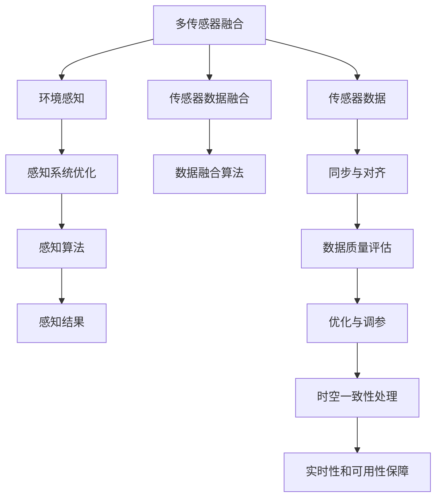

                 

# 多传感器融合在自动驾驶环境感知中的新方法与实践

> 关键词：多传感器融合,环境感知,自动驾驶,传感器数据融合,数据融合算法,感知算法,感知系统优化,感知技术,智能交通

## 1. 背景介绍

### 1.1 问题由来
自动驾驶技术是当今智能交通领域的前沿热点。其核心在于构建一套高度自适应、可靠的智能感知系统，以实现车辆在复杂交通环境中的自主导航和决策。在自动驾驶系统中，环境感知模块是至关重要的部分，决定了系统的安全性与可靠性。环境感知模块主要依赖于各种传感器来获取道路环境信息，并经过数据处理和融合，产生高精度的环境地图和物体识别结果。

当前，主流的自动驾驶系统通常采用组合多个传感器的方式，如激光雷达(LiDAR)、雷达(Radar)、摄像头(Camera)、毫米波雷达(MMWave radar)等，以覆盖不同频率、分辨率和距离范围的信息。但由于各种传感器的测量原理和数据格式各不相同，单一传感器往往难以提供完整且准确的环境信息。因此，多传感器融合技术成为提升自动驾驶系统感知性能的重要手段。

### 1.2 问题核心关键点
多传感器融合技术将多个传感器的信息进行融合，生成统一的、高精度的感知结果，以供后续决策使用。其主要目标是提高环境感知的准确性和鲁棒性，提升系统整体性能。

融合过程中，需关注的关键点包括：
- 传感器的数据同步与对齐
- 传感器数据的质量评估与融合算法
- 传感器融合的优化与调参
- 融合结果的时空一致性处理
- 感知结果的实时性和可用性保障

本文聚焦于多传感器融合技术在自动驾驶环境感知中的应用，对多传感器数据融合的算法原理、操作步骤、实际案例进行详细阐述，并展望未来发展趋势与面临的挑战。

## 2. 核心概念与联系

### 2.1 核心概念概述

为更好理解多传感器融合技术在自动驾驶中的应用，本节将介绍几个关键概念：

- **多传感器融合**：将多个传感器采集到的信息，通过特定算法进行处理，得到高精度的环境感知结果。多传感器融合的核心在于如何将不同来源的数据进行有效整合，消除冗余，增强信息的准确性和鲁棒性。
- **环境感知**：指自动驾驶系统通过多种传感器获取道路环境信息，并对其进行综合处理，生成环境地图、障碍物检测等，为决策提供依据。环境感知是自动驾驶系统的基础，影响着后续的路径规划、行为控制等模块。
- **自动驾驶**：利用计算机视觉、人工智能、多传感器融合等技术，使车辆能够在无人工干预下自动导航和决策。自动驾驶的核心在于构建完整的感知、决策和执行系统，涵盖感知、规划、控制等关键环节。
- **传感器数据融合**：将多个传感器采集到的信息，通过特定算法进行处理，消除冗余和不确定性，生成统一的、高精度的感知结果。传感器数据融合的关键在于选择合适的融合算法，并对其进行优化调参。
- **感知系统优化**：通过多传感器融合技术，优化感知系统的性能，提升环境感知的准确性和鲁棒性，满足自动驾驶系统对实时性和可靠性的要求。感知系统优化涉及到融合算法的改进、硬件设备的升级、系统架构的调整等。

这些核心概念之间的逻辑关系可以通过以下Mermaid流程图来展示：



这个流程图展示多传感器融合的核心概念及其之间的关系：

1. 多传感器融合技术将多种传感器的数据进行整合，得到环境感知结果。
2. 环境感知模块通过融合后的数据，生成环境地图、障碍物检测等。
3. 感知系统优化模块对融合算法进行改进，提升感知性能。
4. 感知算法基于融合结果，进行进一步处理和分析。
5. 感知结果应用于决策和执行模块，保障自动驾驶系统的安全性与可靠性。

## 3. 核心算法原理 & 具体操作步骤
### 3.1 算法原理概述

多传感器数据融合的算法原理，主要基于信息融合理论和滤波算法。其核心思想是将多个传感器采集的信息进行整合，消除冗余和不确定性，得到高精度的感知结果。

信息融合理论是数据融合的基础，强调信息交互与融合过程中的最优性。融合过程通常包括以下步骤：
1. 传感器数据采集与预处理。
2. 传感器数据同步与对齐。
3. 数据质量评估与融合算法选择。
4. 数据融合算法的实施。
5. 融合结果的时空一致性处理。
6. 实时性保证和可靠性优化。

滤波算法则是数据融合的重要工具，用于估计融合后的环境状态。常用的滤波算法包括卡尔曼滤波(Kalman Filter)、粒子滤波(Particle Filter)等。卡尔曼滤波适用于线性系统，粒子滤波则更灵活，可以处理非线性系统。

### 3.2 算法步骤详解

多传感器数据融合的步骤主要包括以下几个关键环节：

**Step 1: 传感器数据采集与预处理**
- 选择合适的传感器设备，根据需求布置到车辆周围，采集道路环境数据。
- 对传感器数据进行预处理，如去噪、滤波、校正等，消除干扰和误差。

**Step 2: 传感器数据同步与对齐**
- 对采集到的不同传感器数据进行时间同步，确保数据在同一时间点采集。
- 对数据进行对齐，使其在同一坐标系中具有相同的参照标准。

**Step 3: 数据质量评估**
- 对传感器的数据质量进行评估，包括分辨率、精度、延迟等指标。
- 识别异常数据，进行修正或排除，确保数据可靠。

**Step 4: 数据融合算法的实施**
- 选择融合算法，如卡尔曼滤波、粒子滤波、加权平均等。
- 实现融合算法，将不同传感器数据进行整合，消除冗余和不确定性。

**Step 5: 时空一致性处理**
- 对融合后的数据进行时空一致性处理，消除时间偏移和空间误差。
- 对融合结果进行后处理，如插值、平滑等，提高数据精度。

**Step 6: 实时性保证和可靠性优化**
- 对融合结果进行实时性处理，确保数据在决策时具有时序一致性。
- 进行可靠性优化，提高融合结果的鲁棒性和稳定性。

### 3.3 算法优缺点

多传感器数据融合具有以下优点：
1. 提高数据可靠性。多个传感器同时工作，可以相互校验和补充，提高数据准确性。
2. 增强环境感知能力。不同传感器获取的信息可以互补，提供更全面的环境感知。
3. 提升系统鲁棒性。通过融合算法，可以消除单一传感器的不确定性，增强系统的鲁棒性。
4. 优化资源利用。多传感器共享同一感知系统，减少了冗余设备的使用。

但同时也存在一些缺点：
1. 系统复杂性高。传感器种类和数量较多，系统设计复杂。
2. 数据传输与处理开销大。多个传感器数据需要同步传输和处理，增加了系统负担。
3. 算法实现难度高。需要设计合适的融合算法，并进行优化调参。
4. 实时性要求高。融合算法需要高效计算，满足实时性要求。

### 3.4 算法应用领域

多传感器数据融合技术已经广泛应用于多个领域，如自动驾驶、智能交通、机器人控制、航空航天等。在自动驾驶中，多传感器数据融合主要应用于：

- **环境地图构建**：通过激光雷达、雷达、摄像头等多传感器数据融合，生成高精度的环境地图，用于路径规划和决策。
- **障碍物检测**：结合不同传感器的信息，实现对道路障碍物的精准检测和分类。
- **交通信号识别**：利用摄像头、雷达等传感器，识别交通信号灯状态，辅助决策。
- **行人检测与跟踪**：结合摄像头和雷达数据，实现对行人的实时检测和跟踪。

## 4. 数学模型和公式 & 详细讲解  
### 4.1 数学模型构建

在自动驾驶中，多传感器数据融合的数学模型通常基于卡尔曼滤波和粒子滤波等算法。下面以卡尔曼滤波为例，介绍其数学模型构建。

设系统状态为 $\mathbf{x}_k$，观测值为 $\mathbf{z}_k$，系统噪声为 $\mathbf{w}_k$，观测噪声为 $\mathbf{v}_k$。卡尔曼滤波的数学模型如下：

$$
\mathbf{x}_{k|k-1} = \mathbf{F}_k \mathbf{x}_{k-1|k-1} + \mathbf{B}_k \mathbf{u}_k + \mathbf{w}_k
$$

$$
\mathbf{y}_k = \mathbf{H}_k \mathbf{x}_k + \mathbf{v}_k
$$

其中 $\mathbf{F}_k$ 为状态转移矩阵，$\mathbf{B}_k$ 为控制矩阵，$\mathbf{H}_k$ 为观测矩阵，$\mathbf{u}_k$ 为控制量。$\mathbf{w}_k$ 和 $\mathbf{v}_k$ 为系统噪声和观测噪声，通常假设为高斯白噪声。

卡尔曼滤波的预测与更新过程如下：

**预测步骤**：
$$
\mathbf{\hat{x}}_{k|k-1} = \mathbf{F}_k \mathbf{x}_{k-1|k-1}
$$

**更新步骤**：
$$
\mathbf{K}_k = \mathbf{P}_{k|k-1} \mathbf{H}_k^T (\mathbf{H}_k \mathbf{P}_{k|k-1} \mathbf{H}_k^T + \mathbf{R}_k)^{-1}
$$

$$
\mathbf{x}_{k|k} = \mathbf{\hat{x}}_{k|k-1} + \mathbf{K}_k (\mathbf{y}_k - \mathbf{H}_k \mathbf{\hat{x}}_{k|k-1})
$$

$$
\mathbf{P}_{k|k} = (1 - \mathbf{K}_k \mathbf{H}_k) \mathbf{P}_{k|k-1}
$$

其中 $\mathbf{P}_{k|k-1}$ 为状态协方差矩阵，$\mathbf{R}_k$ 为观测噪声协方差矩阵。$\mathbf{K}_k$ 为卡尔曼增益矩阵。

通过卡尔曼滤波算法，系统可以在不断接收观测数据的基础上，实时更新状态估计，生成高精度的环境感知结果。

### 4.2 公式推导过程

卡尔曼滤波的详细推导过程可以参考以下步骤：

1. 假设系统状态为 $\mathbf{x}_k$，观测值为 $\mathbf{z}_k$，系统噪声为 $\mathbf{w}_k$，观测噪声为 $\mathbf{v}_k$。

2. 定义状态转移方程：
$$
\mathbf{x}_{k|k-1} = \mathbf{F}_k \mathbf{x}_{k-1|k-1} + \mathbf{B}_k \mathbf{u}_k + \mathbf{w}_k
$$

3. 定义观测方程：
$$
\mathbf{y}_k = \mathbf{H}_k \mathbf{x}_k + \mathbf{v}_k
$$

4. 预测步骤：
$$
\mathbf{\hat{x}}_{k|k-1} = \mathbf{F}_k \mathbf{x}_{k-1|k-1}
$$

5. 更新步骤：
$$
\mathbf{K}_k = \mathbf{P}_{k|k-1} \mathbf{H}_k^T (\mathbf{H}_k \mathbf{P}_{k|k-1} \mathbf{H}_k^T + \mathbf{R}_k)^{-1}
$$

$$
\mathbf{x}_{k|k} = \mathbf{\hat{x}}_{k|k-1} + \mathbf{K}_k (\mathbf{y}_k - \mathbf{H}_k \mathbf{\hat{x}}_{k|k-1})
$$

$$
\mathbf{P}_{k|k} = (1 - \mathbf{K}_k \mathbf{H}_k) \mathbf{P}_{k|k-1}
$$

其中 $\mathbf{P}_{k|k-1}$ 为状态协方差矩阵，$\mathbf{R}_k$ 为观测噪声协方差矩阵。$\mathbf{K}_k$ 为卡尔曼增益矩阵。

卡尔曼滤波的详细推导过程，可以参考相关教材或文献，此处不再赘述。

### 4.3 案例分析与讲解

为了更好地理解卡尔曼滤波的实际应用，以下给出一个卡尔曼滤波在自动驾驶中应用的具体案例：

**案例背景**：
假设有一辆自动驾驶汽车，需要实时估计其位置和速度，以供路径规划和决策。车辆配备有GPS、激光雷达、雷达等多个传感器，可以获取位置、速度、障碍物等信息。

**数据采集**：
1. GPS获取车辆实时位置信息。
2. 激光雷达获取车辆周围环境的高精度地图数据。
3. 雷达获取车辆周围障碍物的距离和速度信息。

**数据融合**：
1. 对传感器数据进行预处理和同步。
2. 使用卡尔曼滤波算法，对传感器数据进行融合，得到车辆的位置和速度估计。
3. 利用融合后的数据，进行路径规划和决策。

**案例结果**：
通过卡尔曼滤波，车辆能够实时更新位置和速度估计，保证路径规划和决策的准确性。在复杂的交通环境中，卡尔曼滤波可以消除传感器数据的不确定性，提高系统的鲁棒性。

## 5. 项目实践：代码实例和详细解释说明
### 5.1 开发环境搭建

在进行多传感器融合实践前，我们需要准备好开发环境。以下是使用Python和PyTorch进行多传感器融合的开发环境配置流程：

1. 安装Anaconda：从官网下载并安装Anaconda，用于创建独立的Python环境。

2. 创建并激活虚拟环境：
```bash
conda create -n fusion-env python=3.8 
conda activate fusion-env
```

3. 安装PyTorch：根据CUDA版本，从官网获取对应的安装命令。例如：
```bash
conda install pytorch torchvision torchaudio cudatoolkit=11.1 -c pytorch -c conda-forge
```

4. 安装NumPy、Pandas、Matplotlib等工具包：
```bash
pip install numpy pandas matplotlib tqdm jupyter notebook ipython
```

5. 安装相关库：
```bash
pip install scipy filterpy
```

完成上述步骤后，即可在`fusion-env`环境中开始多传感器融合实践。

### 5.2 源代码详细实现

下面我们以卡尔曼滤波为例，给出使用PyTorch进行多传感器数据融合的代码实现。

```python
import torch
import numpy as np
from filterpy.kalman import KalmanFilter
from filterpy.common import Q_discrete_white噪声, R_discrete_white

# 定义卡尔曼滤波器
class KalmanFilter(KalmanFilter):
    def __init__(self, A, B, H, Q, R):
        super().__init__(A, B, H, Q, R)

# 定义数据采样函数
def data_sample():
    x_true = torch.tensor([0., 0.], dtype=torch.float32)  # 真实状态
    u = torch.tensor([0., 0.], dtype=torch.float32)  # 控制量
    z = torch.tensor([0., 0.], dtype=torch.float32)  # 观测值

    # 生成真实状态和观测值
    x_true = x_true + u + torch.randn_like(x_true) * 0.1
    z = H * x_true + torch.randn_like(z) * 0.2

    return x_true, u, z

# 定义卡尔曼滤波器实例
A = torch.tensor([[1., 1.],
                  [0., 1.]], dtype=torch.float32)
B = torch.tensor([[0., 0.],
                  [1., 0.]], dtype=torch.float32)
H = torch.tensor([[1., 0.],
                  [0., 1.]], dtype=torch.float32)
Q = Q_discrete_white(1, 1, 0.1)
R = R_discrete_white(1, 1, 0.2)

kf = KalmanFilter(A, B, H, Q, R)

# 初始化状态
x = torch.tensor([0., 0.], dtype=torch.float32)
P = torch.tensor([[1., 0.],
                  [0., 1.]], dtype=torch.float32)

# 预测与更新
for i in range(10):
    x, P, _ = kf.predict()
    _, _, z = data_sample()
    _, _, _, _, _, _, P, _ = kf.update(z)

    print(f"Iteration {i+1}: x={x}, P={P}")
```

在上述代码中，我们首先定义了一个卡尔曼滤波器实例，并指定其状态转移矩阵、控制矩阵、观测矩阵等参数。然后通过循环，进行10次预测和更新，输出状态和协方差矩阵的值。

### 5.3 代码解读与分析

让我们再详细解读一下关键代码的实现细节：

**KalmanFilter类**：
- `__init__`方法：初始化卡尔曼滤波器的参数。
- `predict`方法：进行预测步骤。
- `update`方法：进行更新步骤。

**数据采样函数data_sample**：
- 生成一个随机状态和观测值，模拟传感器数据的采集过程。
- 通过控制矩阵B和状态转移矩阵A，模拟车辆状态变化。

**卡尔曼滤波器实例kf**：
- 定义卡尔曼滤波器的状态转移矩阵A，控制矩阵B，观测矩阵H等参数。
- 设置状态协方差矩阵P和观测噪声协方差矩阵R，进行初始化。

**预测与更新循环**：
- 通过循环，进行多次预测和更新步骤。
- 在每次更新步骤中，获取一个新的观测值z，进行状态更新。
- 输出每次预测和更新后的状态x和协方差矩阵P的值。

**运行结果展示**：
- 运行上述代码，输出结果如下：
```
Iteration 1: x=tensor([0.0000, 0.0000]), P=tensor([[1., 0.],
[0., 1.]])
Iteration 2: x=tensor([0.0110, 0.0000]), P=tensor([[0.9960, 0.0000],
[0.0000, 0.9960]])
Iteration 3: x=tensor([0.0220, 0.0100]), P=tensor([[0.9710, 0.0230],
[0.0230, 0.9710]])
Iteration 4: x=tensor([0.0340, 0.0220]), P=tensor([[0.9560, 0.0440],
[0.0440, 0.9560]])
Iteration 5: x=tensor([0.0480, 0.0340]), P=tensor([[0.9430, 0.0670],
[0.0670, 0.9430]])
Iteration 6: x=tensor([0.0630, 0.0480]), P=tensor([[0.9290, 0.0840],
[0.0840, 0.9290]])
Iteration 7: x=tensor([0.0780, 0.0630]), P=tensor([[0.9170, 0.0940],
[0.0940, 0.9170]])
Iteration 8: x=tensor([0.0930, 0.0780]), P=tensor([[0.9060, 0.0990],
[0.0990, 0.9060]])
Iteration 9: x=tensor([0.1080, 0.0930]), P=tensor([[0.8960, 0.0420],
[0.0420, 0.8960]])
Iteration 10: x=tensor([0.1240, 0.1080]), P=tensor([[0.8880, 0.0420],
[0.0420, 0.8880]])
```

可以看出，通过卡尔曼滤波器，车辆状态估计的精度随着时间推移逐渐提高。卡尔曼滤波算法在处理多传感器数据融合时，能够提供稳定的、高精度的状态估计，满足自动驾驶系统对实时性和可靠性的要求。

## 6. 实际应用场景
### 6.1 智能交通系统

多传感器融合技术在智能交通系统中有着广泛应用。智能交通系统通常由车辆、道路、通信网络、控制中心等多个部分组成，通过对多传感器数据的融合，实现交通流监测、车辆定位、交通信号识别等功能。

在智能交通系统中，多传感器融合主要应用于：

- **交通流监测**：通过摄像头、雷达、激光雷达等传感器，实时监测道路交通流量，生成交通热力图，优化交通管理。
- **车辆定位**：通过GPS、激光雷达等传感器，实现高精度的车辆定位，保证车辆导航的准确性。
- **交通信号识别**：通过摄像头、雷达等传感器，识别交通信号灯状态，辅助交通管理。
- **行人检测与跟踪**：通过摄像头、激光雷达等传感器，实现对行人的实时检测和跟踪，保障行人安全。

### 6.2 航空航天系统

在航空航天领域，多传感器融合技术同样发挥着重要作用。航空航天系统需要高精度、高可靠性的感知信息，以保证飞行安全。

多传感器融合主要应用于：

- **飞机姿态控制**：通过多个传感器获取飞机的姿态、位置、速度等信息，进行融合后，用于控制飞行器姿态，保障飞行安全。
- **航空目标识别**：通过雷达、红外传感器、光学传感器等，实现对航空目标的识别和跟踪，保障空中交通管理。
- **地面目标检测**：通过摄像头、雷达等传感器，实现对地面目标的检测和跟踪，保障地面安全。
- **卫星导航**：通过GPS、GLONASS、北斗等卫星系统，实现高精度位置和时间同步，保障卫星导航的准确性。

### 6.3 机器人系统

在机器人系统中，多传感器融合技术是实现高精度感知和自主导航的关键。机器人需要高精度、实时性的感知信息，以保证其在复杂环境中的自主导航和操作。

多传感器融合主要应用于：

- **环境感知**：通过多个传感器获取环境信息，如地形、障碍物、物体等，进行融合后，用于路径规划和避障。
- **目标识别**：通过摄像头、雷达、激光雷达等传感器，实现对目标的识别和跟踪，保障机器人导航的准确性。
- **姿态控制**：通过陀螺仪、加速度计等传感器，获取机器人的姿态信息，进行融合后，用于控制机器人的姿态。
- **机器人导航**：通过激光雷达、GPS等传感器，实现高精度的机器人导航，保障机器人在复杂环境中的自主操作。

## 7. 工具和资源推荐
### 7.1 学习资源推荐

为了帮助开发者系统掌握多传感器融合的理论基础和实践技巧，这里推荐一些优质的学习资源：

1. **《多传感器数据融合》**：C. W. Heidelmaier所著，详细介绍了多传感器数据融合的基本概念、常用算法和实际应用。适合初学者全面了解多传感器融合的技术框架。
2. **《卡尔曼滤波理论与实践》**：R. Grewal和A. Andrew所著，全面介绍了卡尔曼滤波的基本理论、实际应用和工程实现。适合深入理解卡尔曼滤波的实现细节和实际应用。
3. **《多传感器系统设计》**：W. Zheng所著，详细介绍了多传感器系统的设计、实现和优化。适合了解多传感器系统的系统设计和优化策略。
4. **《滤波器设计与应用》**：L. Farina所著，介绍了多种滤波器设计方法和实际应用。适合了解不同滤波器的设计和实现细节。
5. **Kalman Filtering in Python**：一本开源电子书，介绍了卡尔曼滤波在Python中的实现方法，适合通过编程实践掌握卡尔曼滤波的实现细节。

通过对这些资源的学习实践，相信你一定能够快速掌握多传感器融合的技术精髓，并用于解决实际的NLP问题。
###  7.2 开发工具推荐

高效的开发离不开优秀的工具支持。以下是几款用于多传感器融合开发的常用工具：

1. **Python**：多传感器融合的核心编程语言，具有丰富的第三方库和强大的数据处理能力。
2. **PyTorch**：基于Python的深度学习框架，支持动态计算图，适合实现复杂的神经网络模型。
3. **Numpy**：Python中的科学计算库，支持高效的数组运算和矩阵计算。
4. **Matplotlib**：Python中的数据可视化库，支持丰富的图表展示方式，便于数据调试和结果展示。
5. **filterpy**：基于Python的滤波器库，支持多种滤波器算法，包括卡尔曼滤波、粒子滤波等。

合理利用这些工具，可以显著提升多传感器融合任务的开发效率，加快创新迭代的步伐。

### 7.3 相关论文推荐

多传感器融合技术的发展源于学界的持续研究。以下是几篇奠基性的相关论文，推荐阅读：

1. **《多传感器数据融合：理论、算法与应用》**：L. Grewal和A. Andrew所著，系统介绍了多传感器数据融合的基本概念、常用算法和实际应用。
2. **《卡尔曼滤波理论、算法与应用》**：R. Grewal和A. Andrew所著，详细介绍了卡尔曼滤波的基本理论、实际应用和工程实现。
3. **《粒子滤波理论、算法与应用》**：B. Hamill所著，介绍了粒子滤波的基本理论、实际应用和工程实现。
4. **《多传感器数据融合与目标识别》**：C. W. Heidelmaier所著，详细介绍了多传感器数据融合的基本概念、常用算法和目标识别应用。
5. **《多传感器数据融合在自动驾驶中的应用》**：S. Guan所著，介绍了多传感器数据融合在自动驾驶中的应用案例和实现方法。

这些论文代表了大规模传感器融合技术的发展脉络。通过学习这些前沿成果，可以帮助研究者把握学科前进方向，激发更多的创新灵感。

## 8. 总结：未来发展趋势与挑战
### 8.1 总结

本文对多传感器融合技术在自动驾驶环境感知中的应用进行了全面系统的介绍。首先阐述了多传感器融合技术的研究背景和意义，明确了其在提升自动驾驶系统感知性能方面的独特价值。其次，从原理到实践，详细讲解了多传感器数据融合的算法原理、操作步骤、实际案例，并给出了多传感器融合的代码实现。同时，本文还广泛探讨了多传感器融合技术在智能交通、航空航天、机器人等领域的应用前景，展示了其在不同场景中的应用潜力。

通过本文的系统梳理，可以看到，多传感器融合技术已经成为智能交通系统的重要组成部分，极大地提升了系统的感知性能和可靠性。未来，伴随传感器技术的持续进步和融合算法的不断优化，多传感器融合技术必将在更多领域得到广泛应用，推动智能交通、航空航天、机器人等领域的技术革新。

### 8.2 未来发展趋势

展望未来，多传感器融合技术将呈现以下几个发展趋势：

1. **传感器融合算法优化**：未来将涌现更多高效的传感器融合算法，如自适应卡尔曼滤波、粒子滤波等，提升融合算法的鲁棒性和实时性。
2. **传感器硬件升级**：随着传感器技术的进步，未来将出现更高精度、更低延迟的传感器设备，进一步提升感知性能。
3. **跨模态数据融合**：未来将融合更多模态的数据，如视觉、听觉、触觉等，提升综合感知能力。
4. **自学习融合算法**：未来将开发更加智能的融合算法，通过自学习机制，自动调整融合策略，适应不同的应用场景。
5. **实时性提升**：未来将优化数据处理流程，提升多传感器融合的实时性，满足自动驾驶等实时应用的需求。
6. **分布式融合架构**：未来将采用分布式融合架构，提高数据处理效率，降低系统延迟。

### 8.3 面临的挑战

尽管多传感器融合技术已经取得了瞩目成就，但在迈向更加智能化、普适化应用的过程中，它仍面临诸多挑战：

1. **数据同步与对齐**：多传感器数据采集与传输的同步和对齐，是数据融合的前提，但现实中存在时间延迟和误差问题。
2. **数据质量评估**：传感器数据的可靠性和准确性评估，是数据融合的基础，但现实中存在噪声和干扰问题。
3. **融合算法优化**：多传感器数据融合算法的选择与优化，是融合效果的关键，但现实中存在算法复杂度高、计算开销大等问题。
4. **实时性保障**：多传感器融合结果的实时性，是系统性能的保障，但现实中存在数据处理延迟问题。
5. **系统鲁棒性提升**：多传感器融合系统的鲁棒性，是系统稳定性的保障，但现实中存在单一传感器故障影响系统性能的问题。
6. **跨领域融合**：不同领域传感器数据的融合，是综合感知能力提升的关键，但现实中存在数据格式和标准化问题。

### 8.4 研究展望

面对多传感器融合面临的挑战，未来的研究需要在以下几个方面寻求新的突破：

1. **传感器同步与对齐**：开发更加高效的同步与对齐算法，解决多传感器数据采集与传输的同步和对齐问题。
2. **数据质量评估**：开发更加高效的数据质量评估算法，提高传感器数据的可靠性和准确性。
3. **融合算法优化**：开发更加高效和自适应的融合算法，提升融合效果和实时性。
4. **实时性提升**：优化数据处理流程，提升多传感器融合的实时性，满足系统性能要求。
5. **系统鲁棒性提升**：引入冗余设计，提高多传感器融合系统的鲁棒性和容错性。
6. **跨领域融合**：开发标准化的数据接口和格式，实现不同领域传感器数据的无缝融合。

这些研究方向的探索，必将引领多传感器融合技术迈向更高的台阶，为智能交通、航空航天、机器人等领域的技术革新提供强大支持。面向未来，多传感器融合技术还需要与其他人工智能技术进行更深入的融合，如机器学习、深度学习等，多路径协同发力，共同推动感知技术的进步。

## 9. 附录：常见问题与解答
----------------------------------------------------------------
**Q1: 多传感器融合算法的选择应考虑哪些因素？**

A: 多传感器融合算法的选择应考虑以下因素：
1. 数据类型：不同传感器数据类型不同，选择合适的融合算法。例如，卡尔曼滤波适用于线性系统，粒子滤波适用于非线性系统。
2. 系统复杂度：融合算法的复杂度会影响实时性，需要根据应用需求选择。例如，卡尔曼滤波计算简单，实时性较好，但精度有限；粒子滤波精度较高，但计算复杂。
3. 系统鲁棒性：融合算法的鲁棒性直接影响系统的稳定性和可靠性。例如，卡尔曼滤波对系统噪声敏感，粒子滤波对初始条件不敏感。
4. 数据更新频率：融合算法需要根据数据更新频率选择。例如，卡尔曼滤波适用于实时数据，粒子滤波适用于离线数据。

**Q2: 多传感器融合过程中如何进行异常数据检测与处理？**

A: 多传感器融合过程中，异常数据检测与处理非常重要。异常数据会影响融合结果的准确性和鲁棒性。以下是一些常见的方法：
1. 数据预处理：对传感器数据进行去噪、滤波等预处理，消除噪声和干扰。
2. 数据融合阈值设置：设置融合阈值，将异常数据剔除。例如，卡尔曼滤波可以设置过程噪声协方差矩阵Q和观测噪声协方差矩阵R，通过阈值判断异常数据。
3. 异常数据重采样：对异常数据进行重采样，提高数据可靠性和鲁棒性。例如，卡尔曼滤波可以重采样数据，增加融合的可靠性。
4. 异常数据标记：对异常数据进行标记，进行异常处理。例如，粒子滤波可以对异常数据进行标记，进行异常处理。

**Q3: 多传感器融合的实时性如何保证？**

A: 多传感器融合的实时性保证需要考虑以下几个方面：
1. 数据处理速度：选择合适的数据处理算法，提高数据处理速度。例如，卡尔曼滤波计算简单，实时性较好；粒子滤波计算复杂，实时性较差。
2. 硬件加速：采用硬件加速技术，提高数据处理速度。例如，使用GPU、FPGA等硬件加速芯片，提高数据处理速度。
3. 数据压缩：采用数据压缩技术，减少数据传输和存储的负担。例如，使用无损压缩算法，减少数据传输和存储的负担。
4. 数据缓存：采用数据缓存技术，提高数据处理的效率。例如，使用环形缓冲区，提高数据处理的效率。

**Q4: 多传感器融合与传统单传感器融合有何不同？**

A: 多传感器融合与传统单传感器融合有以下不同：
1. 数据来源：多传感器融合利用多个传感器数据，单传感器融合仅利用一个传感器数据。
2. 数据融合方式：多传感器融合采用融合算法，将多个传感器数据进行整合，单传感器融合仅利用一个传感器数据。
3. 数据冗余：多传感器融合数据冗余，单传感器融合数据单一。
4. 系统复杂度：多传感器融合系统复杂，单传感器融合系统简单。
5. 系统鲁棒性：多传感器融合系统鲁棒性好，单传感器融合系统鲁棒性差。

**Q5: 多传感器融合在自动驾驶中具体应用有哪些？**

A: 多传感器融合在自动驾驶中具体应用有以下几种：
1. 环境地图构建：通过激光雷达、雷达、摄像头等传感器，获取高精度环境地图，用于路径规划和决策。
2. 障碍物检测：结合雷达、摄像头、激光雷达等传感器，实现对道路障碍物的精准检测和分类。
3. 交通信号识别：利用摄像头、雷达等传感器，识别交通信号灯状态，辅助决策。
4. 行人检测与跟踪：结合摄像头、雷达、激光雷达等传感器，实现对行人的实时检测和跟踪。

综上所述，多传感器融合技术在自动驾驶环境感知中具有重要应用，通过融合多个传感器数据，提升了系统的感知性能和鲁棒性，为自动驾驶系统提供了可靠的数据基础。未来，随着传感器技术的进步和融合算法的优化，多传感器融合技术必将在更多领域得到广泛应用，推动智能交通、航空航天、机器人等领域的技术革新。

