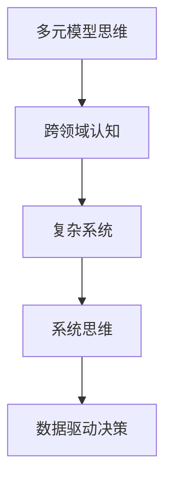

                 

# 多元模型思维:提升管理者认知水平

## 1. 背景介绍

在现代信息时代，技术的迅猛发展对各行各业的管理者提出了更高的要求。他们不仅需要掌握传统的业务知识，还必须具备跨领域的认知能力，以更好地理解新技术，推动组织创新和变革。本节将探讨如何通过多元模型思维，提升管理者的认知水平，帮助他们在复杂多变的环境中做出更为明智的决策。

## 2. 核心概念与联系

### 2.1 核心概念概述

为更好地理解多元模型思维，本节将介绍几个关键概念：

- **多元模型思维**：指在面对复杂问题时，能从多个角度和维度出发，综合运用不同模型的思维模式和方法，以获得全面、客观的解决方案。
- **跨领域认知**：指超越单一领域，具备对不同领域知识和能力的理解与整合能力，从而能够灵活应对各种情境和挑战。
- **复杂系统**：指由多种要素、相互关联且动态变化的子系统组成，管理决策需要考虑整个系统的运行机制和整体目标。
- **系统思维**：指从系统整体出发，考虑各部分间的相互作用和影响，以优化整个系统性能的思维模式。
- **数据驱动决策**：指基于数据分析和统计推理，而非单纯经验或直觉，进行决策的实践。

这些概念之间的逻辑关系可以通过以下Mermaid流程图来展示：



这个流程图展示了一个管理者的认知发展路径：通过多元模型思维，构建跨领域的认知能力，掌握复杂系统的运行机制，采用系统思维方法，最后利用数据驱动的决策支持系统。

## 3. 核心算法原理 & 具体操作步骤

### 3.1 算法原理概述

多元模型思维的核心在于能够综合运用不同的思维模型和方法，以解决复杂的决策问题。其基本原理可以概括为以下几点：

1. **问题分解与重构**：将复杂问题拆解为若干可管理的小问题，并从不同角度重构问题，以便于分析和解决。
2. **多维度分析**：运用多种统计、机器学习和模拟模型，从不同维度获取信息，全面评估问题。
3. **模型组合与整合**：将不同模型的结果进行组合和整合，形成更加全面和客观的决策依据。
4. **情境模拟与预演**：通过仿真和预测模型，模拟不同决策情境下的结果，优化决策策略。
5. **学习与迭代**：在实施决策后，通过反馈和结果评估，持续优化模型和方法，实现不断迭代和提升。

### 3.2 算法步骤详解

多元模型思维的应用流程如下：

**Step 1: 问题分解与重构**
- 对复杂问题进行细致分析，确定关键要素和影响因素。
- 将问题拆解为多个子问题，便于从不同角度和层面进行建模。

**Step 2: 多维度分析**
- 根据问题的特点，选择合适的统计、机器学习和模拟模型。
- 收集和预处理数据，确保模型训练的可靠性。
- 使用多个模型对问题进行分析，获取不同维度的信息。

**Step 3: 模型组合与整合**
- 对不同模型的输出结果进行比较和分析，识别异同和偏差。
- 通过加权平均、投票机制等方法，将结果进行组合。
- 综合考虑不同模型的优势和局限，形成最终决策依据。

**Step 4: 情境模拟与预演**
- 使用仿真和预测模型，模拟不同决策情境下的结果。
- 通过场景分析，识别关键影响因素和潜在风险。
- 根据模拟结果，优化决策策略，减少不确定性。

**Step 5: 学习与迭代**
- 实施决策后，收集反馈和结果数据。
- 评估决策效果，识别成功因素和改进点。
- 根据反馈，调整模型和方法，实现持续改进。

### 3.3 算法优缺点

多元模型思维的优势在于能够从多角度综合分析问题，减少单一模型带来的偏差和误差。同时，通过多模型组合，能够提高决策的全面性和可靠性。

然而，其缺点也不容忽视：

1. **复杂度增加**：需要同时管理和运用多种模型，增加了决策的复杂性。
2. **数据需求量大**：多种模型需要大量数据进行训练，数据收集和处理成本较高。
3. **模型集成难度**：不同模型的输出可能存在不一致性，集成时需要谨慎处理。
4. **实施难度大**：需要具备较强的数据分析和建模能力，对管理者的要求较高。

### 3.4 算法应用领域

多元模型思维在多个领域中得到了广泛应用，包括但不限于：

- **金融风险管理**：通过综合运用量化模型、宏观经济模型和情景模拟，评估和控制金融风险。
- **市场营销**：结合统计分析、机器学习和市场模拟，制定精准的市场营销策略。
- **人力资源管理**：运用人力资源模型、员工满意度模型和绩效评估模型，优化人力资源配置和员工管理。
- **项目管理**：综合项目进度模型、资源分配模型和风险评估模型，优化项目管理和运营效率。
- **产品创新**：利用市场分析模型、产品原型模型和用户反馈模型，推动产品创新和改进。

## 4. 数学模型和公式 & 详细讲解  
### 4.1 数学模型构建

在多元模型思维中，常用的数学模型包括：

- **线性回归模型**：用于描述变量之间的线性关系，预测未来趋势。
- **决策树模型**：通过树状结构，对数据进行分类和预测。
- **支持向量机模型**：利用高维空间的分割，实现分类和回归。
- **随机森林模型**：通过集成多个决策树，提高模型的稳定性和准确性。
- **神经网络模型**：模拟人脑神经网络，处理复杂模式识别和非线性关系。

### 4.2 公式推导过程

以线性回归模型为例，其基本公式为：

$$ y = \beta_0 + \beta_1x_1 + \beta_2x_2 + \ldots + \beta_nx_n + \epsilon $$

其中，$y$ 为预测值，$\beta_0$ 为截距，$\beta_i$ 为系数，$x_i$ 为自变量，$\epsilon$ 为误差项。

通过最小二乘法求解，可以确定最佳的 $\beta$ 值：

$$ \hat{\beta} = (X^TX)^{-1}X^Ty $$

其中，$X$ 为自变量矩阵，$y$ 为因变量向量。

### 4.3 案例分析与讲解

假设某电商平台希望预测用户购买行为，可以使用线性回归模型。根据用户的历史行为数据（如浏览记录、购买历史等），训练线性回归模型，输出用户购买概率。然后将模型结果与用户反馈数据进行对比，优化模型参数。

## 5. 项目实践：代码实例和详细解释说明

### 5.1 开发环境搭建

在进行多元模型思维的应用开发前，需要先准备好开发环境。以下是使用Python进行Scikit-learn开发的示例：

1. 安装Anaconda：从官网下载并安装Anaconda，用于创建独立的Python环境。

2. 创建并激活虚拟环境：
```bash
conda create -n sklearn-env python=3.8 
conda activate sklearn-env
```

3. 安装Scikit-learn：
```bash
pip install scikit-learn
```

4. 安装各类工具包：
```bash
pip install numpy pandas matplotlib seaborn
```

完成上述步骤后，即可在`sklearn-env`环境中开始多元模型思维的应用开发。

### 5.2 源代码详细实现

下面以金融风险管理为例，展示如何使用Scikit-learn进行多元模型分析。

首先，定义数据处理函数：

```python
from sklearn.model_selection import train_test_split
from sklearn.preprocessing import StandardScaler
from sklearn.linear_model import LinearRegression
from sklearn.ensemble import RandomForestRegressor
from sklearn.metrics import mean_squared_error

def preprocess_data(X, y):
    X_train, X_test, y_train, y_test = train_test_split(X, y, test_size=0.2, random_state=42)
    scaler = StandardScaler()
    X_train = scaler.fit_transform(X_train)
    X_test = scaler.transform(X_test)
    return X_train, X_test, y_train, y_test
```

然后，定义模型训练和评估函数：

```python
def train_model(X_train, y_train, model):
    model.fit(X_train, y_train)
    y_pred = model.predict(X_test)
    return mean_squared_error(y_test, y_pred)

def evaluate_model(model, X_test, y_test):
    y_pred = model.predict(X_test)
    return mean_squared_error(y_test, y_pred)
```

接着，启动多元模型训练和评估流程：

```python
X = pd.read_csv('data.csv')
y = pd.read_csv('target.csv')

X_train, X_test, y_train, y_test = preprocess_data(X, y)

lr_model = LinearRegression()
rf_model = RandomForestRegressor()

print('Linear Regression RMSE:', train_model(X_train, y_train, lr_model))
print('Random Forest RMSE:', train_model(X_train, y_train, rf_model))

print('Linear Regression RMSE:', evaluate_model(lr_model, X_test, y_test))
print('Random Forest RMSE:', evaluate_model(rf_model, X_test, y_test))
```

以上就是使用Scikit-learn进行多元模型分析的完整代码实现。可以看到，通过简单的几行代码，即可实现线性回归和随机森林模型的训练和评估，充分展示了Scikit-learn库的易用性和高效性。

### 5.3 代码解读与分析

让我们再详细解读一下关键代码的实现细节：

**preprocess_data函数**：
- 定义了数据处理流程，包括数据分割、标准化和模型训练。

**train_model函数**：
- 对数据进行模型训练，返回模型在测试集上的均方误差。

**evaluate_model函数**：
- 对模型进行评估，返回均方误差，用于比较不同模型的表现。

**代码实现**：
- 使用Pandas库读取数据。
- 使用Scikit-learn库进行数据处理和模型训练。
- 在训练集和测试集上分别使用线性回归和随机森林模型进行训练和评估。
- 输出不同模型的均方误差，对比其性能。

可以看出，通过Scikit-learn库，多元模型思维的实现变得简单高效。开发者可以将更多精力放在模型选择和优化上，而不必过多关注底层细节。

当然，实际系统实现还需考虑更多因素，如模型选择、超参数调优、特征工程等。但核心的多元模型思维流程基本与此类似。

## 6. 实际应用场景

### 6.1 金融风险管理

金融风险管理是一个典型的多元模型思维应用场景。传统的金融风险评估依赖单一的统计模型，无法全面考量市场变化和金融产品特性。通过多元模型思维，可以构建更加全面的风险评估系统，提升决策的准确性和可靠性。

具体而言，可以收集和整合市场数据、财务数据、宏观经济数据等，构建多个模型，如线性回归、时间序列分析、蒙特卡罗模拟等，综合评估金融风险。根据模型输出，制定相应的风险控制策略，提升金融机构的抗风险能力。

### 6.2 市场营销

市场营销需要精准地理解市场趋势和消费者需求，以制定有效的市场策略。传统的市场分析往往依赖简单的统计模型，难以捕捉市场的复杂性和动态变化。通过多元模型思维，可以构建多维度的市场分析模型，获取全面的市场信息。

例如，结合消费者调查数据、市场销售数据、竞争对手数据等，使用多元回归模型、决策树模型和神经网络模型，对市场趋势进行全面分析。根据模型输出，制定精准的市场营销策略，提升市场竞争力和销售额。

### 6.3 人力资源管理

人力资源管理需要高效地管理和配置人力资源，以优化组织效率和员工满意度。传统的HR管理往往依赖简单的统计分析，难以全面衡量人力资源的复杂性。通过多元模型思维，可以构建多维度的HR管理模型，提升人力资源管理水平。

例如，结合员工调查数据、绩效评估数据、培训数据等，使用多元回归模型、分类模型和聚类模型，对员工行为进行全面分析。根据模型输出，制定有效的HR管理策略，优化人力资源配置和员工发展，提升组织效率和员工满意度。

### 6.4 项目管理

项目管理需要全面评估项目进度、资源配置和风险因素，以确保项目按时高质量完成。传统的项目管理往往依赖简单的统计模型，难以全面评估项目复杂性。通过多元模型思维，可以构建多维度的项目管理模型，提升项目管理水平。

例如，结合项目进度数据、资源分配数据、风险评估数据等，使用线性回归模型、决策树模型和模拟模型，对项目进度和资源配置进行全面分析。根据模型输出，制定有效的项目管理策略，优化项目进度和资源配置，确保项目按时高质量完成。

## 7. 工具和资源推荐

### 7.1 学习资源推荐

为帮助开发者系统掌握多元模型思维的理论基础和实践技巧，这里推荐一些优质的学习资源：

1. **多元统计分析**：李威利的《多元统计分析与R语言》，全面介绍了多元统计分析的原理和R语言实现。
2. **机器学习**：周志华的《机器学习》，深入浅出地介绍了机器学习的基本概念和算法。
3. **数据科学**：Tanuj Dhariwal的《数据科学基础》，系统讲解了数据科学的基础知识和实战技巧。
4. **金融风险管理**：约翰·哈里森的《金融风险管理》，全面介绍了金融风险管理的基本方法和实践。
5. **市场营销**：菲利普·科特勒的《市场营销原理》，深入浅出地介绍了市场营销的基本概念和策略。
6. **人力资源管理**：莱恩·托马斯等人的《人力资源管理》，全面介绍了人力资源管理的基本方法和实践。
7. **项目管理**：迈克尔·沃克的《项目管理基础》，全面介绍了项目管理的原则和方法。

通过对这些资源的学习实践，相信你一定能够快速掌握多元模型思维的精髓，并用于解决实际的业务问题。

### 7.2 开发工具推荐

高效的开发离不开优秀的工具支持。以下是几款用于多元模型思维开发常用的工具：

1. **Jupyter Notebook**：交互式编程环境，支持多语言的代码编写和数据可视化。
2. **Python**：灵活动态的编程语言，适合多模型分析和数据处理。
3. **R**：专业的统计分析语言，适合多元统计分析和可视化。
4. **MATLAB**：强大的数学计算和数据可视化工具，适合复杂系统的仿真和建模。
5. **Scikit-learn**：Python机器学习库，提供多种算法和模型。
6. **TensorFlow**：开源深度学习框架，适合复杂模型的训练和优化。
7. **PyTorch**：灵活的深度学习框架，适合动态模型的构建和优化。

合理利用这些工具，可以显著提升多元模型思维的开发效率，加快创新迭代的步伐。

### 7.3 相关论文推荐

多元模型思维的研究源于学界的持续探索。以下是几篇奠基性的相关论文，推荐阅读：

1. **统计学习理论**：Vapnik等人的《统计学习理论》，系统介绍了统计学习的理论基础和算法。
2. **多模型集成**：Dietterich等人的《Multi-Target Ensemble Methods》，介绍了多模型集成的原理和算法。
3. **系统模型分析**：Cobbler等人的《Modeling and analysis of complex systems》，介绍了复杂系统的建模和分析方法。
4. **数据驱动决策**：Hahn等人的《Data-driven decision-making》，介绍了数据驱动决策的基本方法和实践。
5. **交叉验证**：Breiman等人的《Cross-Validation Methods for Analyzing Prediction Models》，介绍了交叉验证的原理和算法。

这些论文代表了多元模型思维的研究脉络，通过学习这些前沿成果，可以帮助研究者把握学科前进方向，激发更多的创新灵感。

## 8. 总结：未来发展趋势与挑战

### 8.1 总结

本文对多元模型思维进行了全面系统的介绍。首先阐述了多元模型思维的研究背景和意义，明确了其在大数据和复杂系统中提升管理者认知水平的独特价值。其次，从原理到实践，详细讲解了多元模型思维的数学模型和实现流程，给出了多元模型思维任务开发的完整代码实例。同时，本文还广泛探讨了多元模型思维在金融风险管理、市场营销、人力资源管理、项目管理等多个领域的应用前景，展示了多元模型思维的广阔潜力。

通过本文的系统梳理，可以看到，多元模型思维正在成为复杂问题求解的重要工具，极大地拓展了管理者的认知边界，提升了决策的科学性和准确性。未来，伴随多元模型思维的持续演进，相信其在各行各业中的应用将更加广泛，为组织创新和变革提供新的支持。

### 8.2 未来发展趋势

展望未来，多元模型思维的发展趋势可以概括为以下几点：

1. **模型融合与深度学习**：未来的多元模型思维将更多地融合深度学习技术，构建更加复杂的混合模型，提升模型的表现力和泛化能力。
2. **数据驱动与机器学习**：数据驱动决策将成为管理决策的重要范式，通过机器学习技术对数据进行深度挖掘和分析，提升决策的科学性和可靠性。
3. **多层次分析与仿真**：从个体行为到组织结构，从内部管理到外部环境，多层次分析将逐步成为常态，通过仿真技术对复杂系统进行全面评估。
4. **云计算与大数据**：云计算和大数据技术的发展，将为多元模型思维提供更强大的计算资源和数据支持，提升分析的效率和效果。
5. **实时分析与预测**：实时数据采集和处理技术的发展，将使得多元模型思维在时间维度上进行实时分析与预测，提升决策的及时性和准确性。

以上趋势凸显了多元模型思维的广阔前景，这些方向的探索发展，必将进一步提升管理决策的科学性和效率，为组织的可持续发展提供有力支持。

### 8.3 面临的挑战

尽管多元模型思维已经取得了显著成就，但在迈向更加智能化、普适化应用的过程中，其仍面临诸多挑战：

1. **数据质量与多样性**：多元模型思维依赖大量的高质量数据，数据的多样性和质量对模型的表现有重要影响。如何获取和整合多样化的数据，保证数据质量，是一大难题。
2. **模型复杂度与解释性**：多元模型思维涉及多种模型，模型的复杂度增加，解释性也变得困难。如何构建简单、易于理解的模型，提升模型的透明度，是未来的重要方向。
3. **计算资源与效率**：复杂模型的训练和优化需要大量计算资源，如何提高计算效率，降低计算成本，是实现多元模型思维的重要瓶颈。
4. **模型集成与协调**：不同模型之间的集成和协调，是多元模型思维的难点之一。如何构建稳定、高效的模型集成机制，是未来需要解决的问题。
5. **伦理与隐私**：多元模型思维在应用过程中，涉及到大量的数据和模型，如何保护数据隐私和伦理安全，是未来需要关注的问题。

### 8.4 研究展望

面对多元模型思维面临的挑战，未来的研究需要在以下几个方面寻求新的突破：

1. **数据融合与预处理**：研究如何高效地获取和整合多种数据，进行高质量的数据预处理，提升数据的质量和多样性。
2. **模型简化与解释**：研究如何构建简单、易于理解的模型，提升模型的透明度和可解释性，帮助管理者更好地理解和应用模型。
3. **计算加速与优化**：研究如何提高复杂模型的计算效率，降低计算成本，实现多元模型思维的实时化应用。
4. **模型集成与协调**：研究如何构建稳定、高效的模型集成机制，提升模型的集成效果和协调能力。
5. **伦理保护与隐私**：研究如何保护数据隐私和伦理安全，构建可信的多元模型思维应用系统。

这些研究方向的探索，必将引领多元模型思维走向更高的台阶，为复杂问题求解提供新的解决方案，为管理决策提供新的支持。总之，多元模型思维需要从数据、模型、计算、伦理等多个维度进行全面优化，才能真正实现其在复杂系统中的应用。

## 9. 附录：常见问题与解答

**Q1：多元模型思维是否适用于所有管理决策？**

A: 多元模型思维在处理复杂、多变量决策时具有显著优势，但并不适用于所有管理决策。对于简单的决策问题，单一模型可能更为有效。此外，某些决策需要依靠经验和直觉，多元模型思维也不适合。因此，在应用多元模型思维时，需要根据具体情况进行选择。

**Q2：如何选择合适的模型组合？**

A: 选择合适的模型组合需要考虑多个因素，包括数据的类型、问题的复杂度、模型的适应性等。通常建议：
1. 多样化模型：选择多种不同类型的模型，如统计模型、机器学习模型、模拟模型等，覆盖不同的分析角度。
2. 平衡复杂度与解释性：选择简单、易于理解的模型，避免过于复杂的模型导致解释困难。
3. 考虑模型稳定性：选择稳定的模型，避免不稳定模型带来的波动性。
4. 实际应用效果：通过实际应用效果评估模型组合的效果，不断优化模型组合。

**Q3：多元模型思维在实际应用中需要注意哪些问题？**

A: 多元模型思维在实际应用中需要注意以下问题：
1. 数据质量：确保数据的多样性和质量，避免数据偏见和噪音。
2. 模型选择：选择合适的模型组合，考虑模型的适应性和稳定性。
3. 模型训练：合理设置模型参数和超参数，避免过拟合和欠拟合。
4. 模型解释：提高模型的透明度和可解释性，帮助管理者理解模型输出。
5. 模型部署：优化模型的部署效率，确保实时性和稳定性。

**Q4：多元模型思维是否可以与其他技术结合使用？**

A: 多元模型思维可以与其他技术结合使用，如大数据技术、云计算技术、深度学习技术等，形成更加全面和高效的决策支持系统。例如，结合大数据分析技术，进行大规模数据的处理和分析；结合云计算技术，实现模型的高效计算和分布式部署；结合深度学习技术，提升模型的表现力和泛化能力。

通过多元模型思维与其他技术的结合，可以进一步拓展其应用场景，提升决策的科学性和效率。

---

作者：禅与计算机程序设计艺术 / Zen and the Art of Computer Programming

