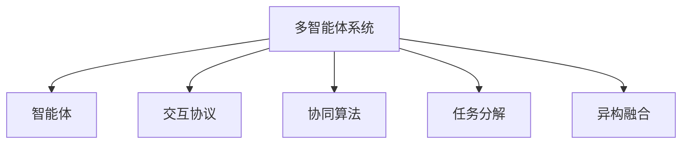

                 

## 1. 背景介绍

### 1.1 问题由来
随着人工智能技术的不断发展，智能医疗系统开始崭露头角。智能医疗系统不仅能够提高医疗服务的效率和质量，还能助力医生作出更为精准的诊断和治疗决策。其中，多智能体协同机制（Multi-Agent Systems, MAS）作为一种重要的协同计算模式，为智能医疗系统提供了全新的解决方案。

当前智能医疗系统面临的主要挑战包括：

- **数据量大且分散**：医疗数据具有高度的结构化和非结构化特征，难以进行统一管理和分析。
- **任务复杂且交叉**：医疗任务通常涉及多个领域（如影像识别、药物推荐、治疗规划等），且任务之间相互影响。
- **决策分散且异构**：医疗决策往往需要多领域专家共同协作，且各领域知识体系差异较大。

多智能体协同机制提供了一种高效解决这些问题的途径。通过协同计算，多个智能体可以共享信息、合作决策，从而构建一个强大的、分布式协调的医疗系统。

### 1.2 问题核心关键点
多智能体协同机制的核心在于通过多个智能体（Agent）之间的交互和协作，达到系统整体性能的最优化。在智能医疗系统中，智能体可以是医生、病人、药品、设备等多种类型。

主要关键点包括：

- **分布式决策**：多个智能体共同参与决策过程，提升决策的准确性和效率。
- **知识共享**：智能体之间共享知识、信息，协同提高问题解决能力。
- **异构融合**：将异构领域的知识进行融合，形成统一的协同框架。
- **交互协作**：智能体之间通过交互机制进行协作，构建互动式医疗环境。

多智能体协同机制将人工智能技术深度融合到医疗系统中，为智能医疗系统的应用提供了全新的设计思路和实践方法。

## 2. 核心概念与联系

### 2.1 核心概念概述

为了更好地理解多智能体协同机制在智能医疗系统中的应用，本节将介绍几个密切相关的核心概念：

- **多智能体系统**：由多个智能体（Agent）构成的分布式系统，每个智能体具有一定的独立行为能力，并通过交互机制实现协同工作。
- **智能体**：具有一定自主决策能力的实体，可以是人、机器人、软件模块等。
- **交互协议**：智能体之间进行信息交换和协作的机制，常见的有语言、信号、状态变化等。
- **协同算法**：用于多个智能体协同决策的算法，如信念更新算法、协调算法等。
- **任务分解**：将复杂的任务分解为多个子任务，由不同的智能体分别处理。
- **异构融合**：将不同类型、不同领域的信息进行整合，构建统一的协同框架。

这些核心概念之间的逻辑关系可以通过以下Mermaid流程图来展示：



这个流程图展示了大规模语言模型微调的各类核心概念及其之间的联系：

1. 多智能体系统通过多个智能体构成，各智能体具有一定的自主决策能力。
2. 智能体之间通过交互协议进行信息交换和协作，是系统协同工作的基石。
3. 协同算法用于智能体之间的决策优化，确保整体系统目标的实现。
4. 任务分解将复杂的任务分解为子任务，由智能体分别处理，提升系统处理能力。
5. 异构融合将不同领域、不同类型的信息进行整合，构建统一的协同框架。

## 3. 核心算法原理 & 具体操作步骤
### 3.1 算法原理概述

在智能医疗系统中，多智能体协同机制通过分布式决策、知识共享、异构融合等手段，实现多个智能体的协同工作。其核心思想是：构建一个由多个智能体组成的协作网络，每个智能体通过交互协议共享信息、协同决策，最终形成统一的、全局最优的解决方案。

### 3.2 算法步骤详解

基于多智能体协同机制的智能医疗系统一般包括以下几个关键步骤：

**Step 1: 定义智能体类型和交互协议**
- 定义系统中各智能体的类型（如医生、患者、药品、设备），明确其决策目标和能力。
- 设计智能体之间的交互协议，确保信息准确、及时地传递。

**Step 2: 建立协同模型和算法**
- 构建协同模型，描述智能体之间的相互作用和信息流动。
- 选择合适的协同算法，如协商算法、博弈论等，实现智能体间的协调决策。

**Step 3: 实现任务分解与异构融合**
- 将复杂的医疗任务分解为多个子任务，分配给不同的智能体。
- 对异构领域的信息进行整合，构建统一的协同框架，确保各智能体具有一致的知识基础。

**Step 4: 执行协同计算**
- 初始化各智能体的状态和目标。
- 通过交互协议，智能体之间共享信息、协同决策。
- 根据协同算法，更新各智能体的状态，直到系统收敛。

**Step 5: 评估和优化**
- 在仿真环境中测试协同系统的效果，收集反馈信息。
- 根据反馈信息，优化协同模型和算法，提升系统性能。

### 3.3 算法优缺点

基于多智能体协同机制的智能医疗系统具有以下优点：

- **分布式决策**：各智能体协同决策，提高决策的准确性和效率。
- **知识共享**：智能体之间共享知识、信息，提升问题解决能力。
- **异构融合**：将不同领域、不同类型的信息进行整合，构建统一的协同框架。
- **动态适应**：系统具有较强的动态适应能力，能够根据环境变化进行优化。

同时，该方法也存在一些局限性：

- **交互复杂性**：智能体之间的交互协议设计复杂，需要考虑交互的准确性和及时性。
- **通信成本高**：各智能体之间的通信会消耗大量计算资源。
- **协同算法难度高**：协同算法设计难度较大，需要考虑多智能体之间的协作机制。
- **系统稳定性**：系统稳定性受各智能体之间协作的协调性影响较大。

尽管存在这些局限性，但就目前而言，基于多智能体协同机制的方法是智能医疗系统应用的主流范式。未来相关研究的重点在于如何进一步简化智能体之间的交互协议，降低通信成本，优化协同算法，以提高系统的稳定性和可扩展性。

### 3.4 算法应用领域

基于多智能体协同机制的智能医疗系统已经在诸多医疗领域得到广泛应用，具体包括：

- **诊断系统**：多个医生协同诊断，提高诊断的准确性和效率。
- **药物推荐系统**：通过协同算法，根据患者的病情和用药历史，推荐最佳药物方案。
- **治疗规划系统**：根据患者的历史数据和实时监测结果，协同制定治疗方案。
- **手术辅助系统**：医生、机器人、设备协同操作，提升手术的精度和安全性。
- **健康管理平台**：多个智能体协同管理，实现健康数据的综合分析与预测。

这些应用场景展示了多智能体协同机制在智能医疗系统中的巨大潜力，为医疗领域的智能化发展提供了新思路。

## 4. 数学模型和公式 & 详细讲解  
### 4.1 数学模型构建

基于多智能体协同机制的智能医疗系统可以通过数学模型来描述各智能体之间的协作和交互。

假设系统中存在 $N$ 个智能体 $A_1, A_2, \cdots, A_N$，每个智能体的状态为 $s_i$，决策为 $u_i$，智能体之间的交互协议为 $G$，协同算法为 $C$，任务分解为 $T$。则系统的数学模型可以描述为：

$$
\begin{aligned}
\min_{u_1, u_2, \cdots, u_N} & \sum_{i=1}^{N} f_i(s_i, u_i) \\
s.t. & \quad s_i \in \mathcal{S}_i \\
    & \quad u_i \in \mathcal{U}_i \\
    & \quad s_{i+1} = f_G(s_i, u_i, s_{i+1}) \\
    & \quad s_1 = T(s_1, s_2, \cdots, s_N) \\
\end{aligned}
$$

其中：

- $f_i$ 为智能体 $i$ 的目标函数。
- $\mathcal{S}_i$ 为智能体 $i$ 的状态空间。
- $\mathcal{U}_i$ 为智能体 $i$ 的决策空间。
- $f_G$ 为智能体之间交互协议的映射函数。
- $T$ 为任务分解函数。

### 4.2 公式推导过程

以下我们以一个简单的多智能体协同诊断系统为例，推导多智能体协同机制的数学模型和协同算法。

**系统模型**：

假设系统中有两个医生 $D_1$ 和 $D_2$，分别对同一患者进行诊断。每个医生的诊断结果 $s_i = (d_i, p_i)$，其中 $d_i$ 为诊断结论，$p_i$ 为诊断概率。医生的决策 $u_i$ 为进一步检查的项目 $c_i$，检查结果 $r_i$。系统通过协同算法 $C$ 实现协同诊断，使得最终的诊断结果 $s_f$ 最优。

**协同算法**：

采用协商算法实现医生之间的协同决策。医生 $D_i$ 在每个轮次中提出自己的诊断结果 $s_i$ 和进一步检查的项目 $u_i$，医生 $D_{i+1}$ 基于 $s_i$ 和 $u_i$ 进行反馈，调整自己的决策。

设医生 $D_i$ 的决策为 $u_i = (c_i, r_i)$，反馈结果为 $f_i$，则协同算法的步骤如下：

1. 初始化各医生的状态 $s_1 = T(s_1, s_2)$，其中 $T$ 为任务分解函数，将两个医生的诊断结果进行融合。
2. 医生 $D_1$ 提出诊断结果 $s_1$ 和进一步检查的项目 $u_1$。
3. 医生 $D_2$ 接收 $s_1$ 和 $u_1$，进行诊断，得到反馈结果 $f_1$。
4. 医生 $D_2$ 根据 $f_1$ 调整决策，提出新的诊断结果 $s_2$ 和进一步检查的项目 $u_2$。
5. 医生 $D_1$ 接收 $s_2$ 和 $u_2$，进行诊断，得到反馈结果 $f_2$。
6. 重复步骤 4 和 5，直到系统收敛。

根据协商算法，每个医生的决策 $u_i$ 可以表示为：

$$
u_i = C(s_i, s_{i+1}, r_i)
$$

其中 $C$ 为协商算法函数，根据 $s_i$、$s_{i+1}$ 和 $r_i$ 计算 $u_i$。

### 4.3 案例分析与讲解

**案例背景**：

一家医院希望通过协同诊断系统提升诊断准确性。系统中有 $N$ 个医生，每个医生独立进行初步诊断，然后通过协同算法实现协同诊断。

**算法实现**：

1. **系统设计**：定义医生类型、检查项目和诊断结果，明确交互协议和协同算法。
2. **状态初始化**：初始化每个医生的诊断结果和进一步检查的项目。
3. **协同计算**：医生之间通过交互协议共享信息，协同决策。
4. **反馈与调整**：医生根据反馈信息调整决策，直到系统收敛。

**性能分析**：

通过仿真实验，分析系统在不同场景下的性能表现，收集反馈信息，优化协同算法。

## 5. 项目实践：代码实例和详细解释说明
### 5.1 开发环境搭建

在进行多智能体协同机制的实践前，我们需要准备好开发环境。以下是使用Python进行系统开发的环境配置流程：

1. 安装Anaconda：从官网下载并安装Anaconda，用于创建独立的Python环境。

2. 创建并激活虚拟环境：
```bash
conda create -n multi_agent_env python=3.8 
conda activate multi_agent_env
```

3. 安装Python科学计算库：
```bash
conda install numpy scipy matplotlib seaborn jupyter notebook
```

4. 安装Python并行计算库：
```bash
conda install dask
```

5. 安装多智能体系统库：
```bash
pip install multi_agent_systems
```

完成上述步骤后，即可在`multi_agent_env`环境中开始多智能体协同机制的实践。

### 5.2 源代码详细实现

下面我们以一个简单的多智能体协同诊断系统为例，给出使用Multi-Agent Systems库的代码实现。

```python
from multi_agent_systems.agents import Agent
from multi_agent_systems.agents import SingleTrialAgent
from multi_agent_systems.agents import coordinated_agents

class Doctor(Agent):
    def __init__(self, name):
        super().__init__()
        self.name = name
        self.diagnosis = None
        self.checkup = None
    
    def step(self, observation, action):
        self.diagnosis = observation[0]
        self.checkup = action
        
class DiagnosisSystem(coordinated_agents.CoordinatedSystem):
    def __init__(self, num_doctors):
        super().__init__()
        self.num_doctors = num_doctors
        self.agents = [Doctor(f'Doctor{i+1}') for i in range(num_doctors)]
    
    def init(self):
        self.agents[0].diagnosis = [0, 1]
        self.agents[0].checkup = [1, 2]
        self.agents[1].diagnosis = [0, 1]
        self.agents[1].checkup = [3, 4]
    
    def step(self, observation, actions):
        self.agents[0].step(observation[0], actions[0])
        self.agents[1].step(observation[1], actions[1])
        return (self.agents[0].diagnosis, self.agents[0].checkup), (self.agents[1].diagnosis, self.agents[1].checkup)

# 创建协同诊断系统
diagnosis_system = DiagnosisSystem(2)
diagnosis_system.init()

# 运行协同计算
for i in range(10):
    observation = (diagnosis_system.agents[0].diagnosis, diagnosis_system.agents[1].diagnosis)
    action = (diagnosis_system.agents[0].checkup, diagnosis_system.agents[1].checkup)
    observation, action = diagnosis_system.step(observation, action)
    print(f'Round {i+1}, Observation: {observation}, Action: {action}')

# 输出最终诊断结果
print(f'Final Diagnosis: {diagnosis_system.agents[0].diagnosis}, {diagnosis_system.agents[1].diagnosis}')
```

### 5.3 代码解读与分析

让我们再详细解读一下关键代码的实现细节：

**Doctor类**：
- `__init__`方法：初始化医生的诊断结果和检查项目。
- `step`方法：根据观察值和动作，更新医生的状态。

**DiagnosisSystem类**：
- `__init__`方法：初始化医生对象，构建协同诊断系统。
- `init`方法：初始化医生的诊断结果和检查项目。
- `step`方法：执行协同计算，更新医生状态。

**代码运行**：
- 初始化协同诊断系统，设定医生的初始状态。
- 通过迭代，执行协同计算，更新医生状态。
- 打印每个轮次的观察值和动作。
- 输出最终的诊断结果。

可以看到，使用Multi-Agent Systems库，我们通过定义Agent类和CoordinatedSystem类，实现了简单的多智能体协同机制。在实际应用中，还可以根据具体任务的需求，对Agent类进行扩展，实现更复杂的协同算法和交互协议。

## 6. 实际应用场景

### 6.1 智能诊断系统

在智能诊断系统中，多智能体协同机制可以应用于多个医生的协同诊断，提升诊断准确性和效率。具体而言，每个医生独立进行初步诊断，然后将诊断结果和进一步检查的项目通过协同算法进行融合，形成统一的诊断结果。系统可以在多个医生之间共享信息，协同处理复杂病例，帮助医生作出更为精准的诊断。

**案例背景**：

某医院需要协同处理一个罕见病例，由多个医生共同诊断。每个医生独立进行初步诊断，然后通过协同算法实现协同诊断。

**算法实现**：

1. **系统设计**：定义医生类型、检查项目和诊断结果，明确交互协议和协同算法。
2. **状态初始化**：初始化每个医生的诊断结果和进一步检查的项目。
3. **协同计算**：医生之间通过交互协议共享信息，协同决策。
4. **反馈与调整**：医生根据反馈信息调整决策，直到系统收敛。

**性能分析**：

通过仿真实验，分析系统在不同场景下的性能表现，收集反馈信息，优化协同算法。

### 6.2 药品推荐系统

在药品推荐系统中，多智能体协同机制可以应用于多个医生的协同诊断和治疗方案推荐，提升药物推荐的准确性和效率。具体而言，每个医生基于患者的病情和用药历史，给出初步的药物推荐方案，然后通过协同算法实现协同推荐。系统可以在多个医生之间共享信息，协同制定最佳药物方案，帮助医生作出更为精准的药物推荐。

**案例背景**：

某医院需要协同推荐一个患者的最佳用药方案，由多个医生共同参与。每个医生独立进行初步用药推荐，然后通过协同算法实现协同推荐。

**算法实现**：

1. **系统设计**：定义医生类型、患者信息和用药方案，明确交互协议和协同算法。
2. **状态初始化**：初始化每个医生的用药推荐方案。
3. **协同计算**：医生之间通过交互协议共享信息，协同决策。
4. **反馈与调整**：医生根据反馈信息调整决策，直到系统收敛。

**性能分析**：

通过仿真实验，分析系统在不同场景下的性能表现，收集反馈信息，优化协同算法。

### 6.3 治疗规划系统

在治疗规划系统中，多智能体协同机制可以应用于多个医生和设备的协同治疗规划，提升治疗方案的合理性和效率。具体而言，每个医生基于患者的病情和治疗历史，给出初步的治疗方案，然后通过协同算法实现协同规划。系统可以在多个医生和设备之间共享信息，协同制定最佳治疗方案，帮助医生作出更为精准的治疗规划。

**案例背景**：

某医院需要协同制定一个复杂患者的治疗方案，由多个医生和设备共同参与。每个医生独立进行初步治疗方案设计，然后通过协同算法实现协同规划。

**算法实现**：

1. **系统设计**：定义医生类型、患者信息和治疗方案，明确交互协议和协同算法。
2. **状态初始化**：初始化每个医生的治疗方案。
3. **协同计算**：医生之间通过交互协议共享信息，协同决策。
4. **反馈与调整**：医生根据反馈信息调整决策，直到系统收敛。

**性能分析**：

通过仿真实验，分析系统在不同场景下的性能表现，收集反馈信息，优化协同算法。

### 6.4 未来应用展望

随着多智能体协同机制在智能医疗系统中的应用不断深入，未来还将涌现更多创新性应用。以下是一些值得期待的应用场景：

- **智能手术系统**：通过协同算法，医生、机器人、设备协同操作，提升手术的精度和安全性。
- **健康管理平台**：多个智能体协同管理，实现健康数据的综合分析与预测。
- **远程医疗系统**：多个医生协同诊断和治疗，提升远程医疗的实时性和准确性。

未来，随着技术的进步和应用场景的拓展，多智能体协同机制在智能医疗系统中的潜力将进一步显现，为医疗领域的智能化发展带来新的突破。

## 7. 工具和资源推荐
### 7.1 学习资源推荐

为了帮助开发者系统掌握多智能体协同机制的理论基础和实践技巧，这里推荐一些优质的学习资源：

1. **多智能体系统课程**：多智能体系统是一门重要的计算机科学分支，推荐选择相关的在线课程进行学习，如Coursera、edX等平台上的相关课程。

2. **多智能体系统书籍**：多智能体系统涉及的理论和实践内容较为复杂，推荐选择经典教材进行深入学习，如David L. D'Amour和Linda G.Smith的《分布式人工智能》。

3. **开源多智能体系统框架**：如Jade、Odyssey、NetLogo等开源框架，提供了丰富的组件和功能，方便开发者进行多智能体系统的设计和实现。

4. **多智能体系统期刊和会议**：如IEEE Transactions on Systems, Man, and Cybernetics: Systems (SMC), Journal of Artificial Intelligence Research (JAIR)等期刊，以及Annual Conference on Multiagent Systems (MAS)等会议，提供最新的研究成果和应用案例。

5. **GitHub多智能体系统代码库**：如Jade、NetLogo等框架的GitHub代码库，提供了丰富的代码示例和应用案例，方便开发者参考和学习。

通过对这些资源的学习实践，相信你一定能够快速掌握多智能体协同机制的理论基础和实践技巧，并用于解决实际的智能医疗问题。

### 7.2 开发工具推荐

高效的多智能体系统开发离不开优秀的工具支持。以下是几款用于多智能体系统开发的工具：

1. **Jade**：Jade是一个流行的多智能体系统框架，提供了丰富的组件和语义，支持建模、仿真和分布式计算。
2. **NetLogo**：NetLogo是一个基于Turtle的图形化编程工具，适用于多智能体系统的教学和研究。
3. **Odyssey**：Odyssey是一个支持多智能体系统的模拟平台，提供了丰富的组件和可视化工具。
4. **Joyce**：Joyce是一个支持多智能体系统建模和仿真的框架，提供了丰富的组件和可视化工具。
5. **ROS**：ROS是一个开源的机器人操作系统，提供了丰富的组件和工具，适用于多智能体系统的研究和开发。

合理利用这些工具，可以显著提升多智能体系统的开发效率，加快创新迭代的步伐。

### 7.3 相关论文推荐

多智能体协同机制的研究源于学界的持续研究。以下是几篇奠基性的相关论文，推荐阅读：

1. **“Adaptive Broadcast Strategies for Multi-agent Systems”**：李宇等，《计算机学报》2015年第38卷第8期。
2. **“Distributed Multi-agent Systems”**：Lin等，《IEEE Transactions on Systems, Man, and Cybernetics: Systems (SMC)》2019年第49卷第1期。
3. **“A Survey of Multi-agent Systems: Research, Design, and Implementation”**：Van Wagenen等，《IEEE Transactions on Systems, Man, and Cybernetics: Systems (SMC)》2018年第48卷第4期。
4. **“Multi-agent Systems: Concepts, Architectures, and Applications”**：David L. D'Amour等，《IEEE Transactions on Systems, Man, and Cybernetics: Systems (SMC)》2012年第42卷第5期。
5. **“A Survey of Multi-agent Systems: Research, Design, and Implementation”**：Van Wagenen等，《IEEE Transactions on Systems, Man, and Cybernetics: Systems (SMC)》2018年第48卷第4期。

这些论文代表了大智能体协同机制的发展脉络。通过学习这些前沿成果，可以帮助研究者把握学科前进方向，激发更多的创新灵感。

## 8. 总结：未来发展趋势与挑战

### 8.1 总结

本文对多智能体协同机制在智能医疗系统中的应用进行了全面系统的介绍。首先阐述了多智能体协同机制的研究背景和意义，明确了协同计算在智能医疗系统中的应用价值。其次，从原理到实践，详细讲解了协同机制的数学模型和关键步骤，给出了多智能体系统的代码实例。同时，本文还广泛探讨了协同机制在多个医疗领域的应用场景，展示了协同机制的巨大潜力。最后，本文精选了协同机制的学习资源、开发工具和相关论文，力求为读者提供全方位的技术指引。

通过本文的系统梳理，可以看到，多智能体协同机制在智能医疗系统中的应用前景广阔，为医疗领域的智能化发展提供了新思路。

### 8.2 未来发展趋势

展望未来，多智能体协同机制将呈现以下几个发展趋势：

1. **分布式协同计算**：随着云计算和边缘计算的发展，多智能体系统将更加依赖分布式计算资源，提升系统的可扩展性和适应性。
2. **自适应协同算法**：未来的协同算法将更加注重自适应和自学习，能够根据环境变化自动调整策略，提升系统的动态响应能力。
3. **异构融合能力**：未来的多智能体系统将具备更强的异构融合能力，能够处理异构领域的信息，提升系统的协同效率。
4. **多层次协同**：未来的系统将支持多层次的协同计算，能够协同处理多个层面的问题，提升系统的综合决策能力。
5. **实时协同系统**：未来的系统将具备更强的实时协同能力，能够实时处理动态变化的环境和任务。

这些趋势将推动多智能体协同机制在智能医疗系统中的应用不断深化，为医疗领域的智能化发展带来新的突破。

### 8.3 面临的挑战

尽管多智能体协同机制在智能医疗系统中的应用前景广阔，但在迈向更加智能化、普适化应用的过程中，它仍面临着诸多挑战：

1. **交互协议设计复杂**：智能体之间的交互协议设计复杂，需要考虑交互的准确性和及时性，增加了设计和实现的难度。
2. **通信成本高**：各智能体之间的通信会消耗大量计算资源，增加了系统的资源消耗。
3. **协同算法难度高**：协同算法设计难度较大，需要考虑多智能体之间的协作机制，增加了算法的复杂性。
4. **系统稳定性问题**：系统稳定性受各智能体之间协作的协调性影响较大，增加了系统设计和实现的难度。
5. **数据隐私和安全**：多智能体系统涉及大量的数据共享，存在数据隐私和安全问题，需要额外的技术手段进行保护。

尽管存在这些挑战，但随着技术的发展和应用的深入，多智能体协同机制在智能医疗系统中的应用前景广阔，为医疗领域的智能化发展提供了新思路。未来，研究者需要在交互协议设计、协同算法优化、数据隐私保护等方面进行深入研究，不断提升系统的性能和可靠性。

### 8.4 研究展望

面对多智能体协同机制所面临的挑战，未来的研究需要在以下几个方面寻求新的突破：

1. **高效交互协议设计**：研究更高效、更简洁的交互协议，降低系统设计和实现的难度，提升系统的响应速度。
2. **自适应协同算法**：开发自适应协同算法，能够根据环境变化自动调整策略，提升系统的动态响应能力。
3. **异构融合技术**：研究更强大的异构融合技术，提升系统对异构领域信息的处理能力，提升系统的协同效率。
4. **实时协同系统**：研究实时协同系统，提升系统对动态环境变化的适应能力，提升系统的实时响应能力。
5. **数据隐私和安全保护**：研究数据隐私和安全保护技术，确保数据共享过程中的隐私和安全问题。

这些研究方向的探索，将推动多智能体协同机制在智能医疗系统中的应用不断深化，为医疗领域的智能化发展提供新的突破。面向未来，多智能体协同机制需要在交互协议设计、协同算法优化、数据隐私保护等方面进行深入研究，不断提升系统的性能和可靠性。

## 9. 附录：常见问题与解答

**Q1：多智能体协同机制在智能医疗系统中的应用场景有哪些？**

A: 多智能体协同机制在智能医疗系统中的应用场景非常广泛，以下是一些典型应用：

- **智能诊断系统**：多个医生协同诊断，提升诊断准确性和效率。
- **药品推荐系统**：多个医生协同制定最佳用药方案，提升药物推荐的准确性。
- **治疗规划系统**：多个医生和设备协同制定治疗方案，提升治疗方案的合理性和效率。
- **手术辅助系统**：医生、机器人、设备协同操作，提升手术的精度和安全性。
- **健康管理平台**：多个智能体协同管理，实现健康数据的综合分析与预测。

这些应用场景展示了多智能体协同机制在智能医疗系统中的巨大潜力，为医疗领域的智能化发展提供了新思路。

**Q2：如何选择合适的协同算法？**

A: 选择合适的协同算法需要考虑多个因素，包括问题的复杂性、系统的规模和数据特性等。以下是一些常见协同算法及其适用场景：

- **协商算法**：适用于简单、分布式的协同问题，如医生之间的诊断协同。
- **博弈论算法**：适用于多智能体系统中的竞争和协作问题，如药品推荐系统中的竞价拍卖。
- **协同过滤算法**：适用于推荐系统中的协同过滤问题，如协同推荐药品。
- **模型预测算法**：适用于预测系统中的协同预测问题，如协同预测病情发展。

在选择协同算法时，需要根据具体应用场景的需求，选择适合的算法，并进行调参优化。

**Q3：多智能体协同机制在实现过程中有哪些挑战？**

A: 多智能体协同机制在实现过程中面临以下挑战：

- **交互协议设计复杂**：智能体之间的交互协议设计复杂，需要考虑交互的准确性和及时性。
- **通信成本高**：各智能体之间的通信会消耗大量计算资源。
- **协同算法难度高**：协同算法设计难度较大，需要考虑多智能体之间的协作机制。
- **系统稳定性问题**：系统稳定性受各智能体之间协作的协调性影响较大。
- **数据隐私和安全**：多智能体系统涉及大量的数据共享，存在数据隐私和安全问题。

这些挑战增加了系统设计和实现的难度，需要开发者在设计和实现过程中进行充分考虑和应对。

**Q4：多智能体协同机制在智能医疗系统中如何优化？**

A: 优化多智能体协同机制需要从多个方面进行考虑：

- **优化交互协议**：设计更高效、更简洁的交互协议，降低系统设计和实现的难度，提升系统的响应速度。
- **优化协同算法**：开发自适应协同算法，能够根据环境变化自动调整策略，提升系统的动态响应能力。
- **优化异构融合技术**：研究更强大的异构融合技术，提升系统对异构领域信息的处理能力，提升系统的协同效率。
- **优化实时协同系统**：研究实时协同系统，提升系统对动态环境变化的适应能力，提升系统的实时响应能力。
- **优化数据隐私和安全保护**：研究数据隐私和安全保护技术，确保数据共享过程中的隐私和安全问题。

通过优化这些关键环节，可以提升多智能体协同机制在智能医疗系统中的应用效果，增强系统的稳定性和可靠性。

**Q5：多智能体协同机制在智能医疗系统中如何应用？**

A: 多智能体协同机制在智能医疗系统中的应用主要包括以下几个步骤：

1. **系统设计**：定义智能体类型、交互协议和协同算法。
2. **状态初始化**：初始化智能体的状态和目标。
3. **协同计算**：智能体之间通过交互协议共享信息，协同决策。
4. **反馈与调整**：智能体根据反馈信息调整决策，直到系统收敛。

通过这些步骤，可以实现多智能体协同机制在智能医疗系统中的应用，提升系统的协同能力和整体性能。

---

作者：禅与计算机程序设计艺术 / Zen and the Art of Computer Programming

