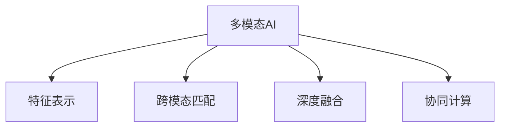
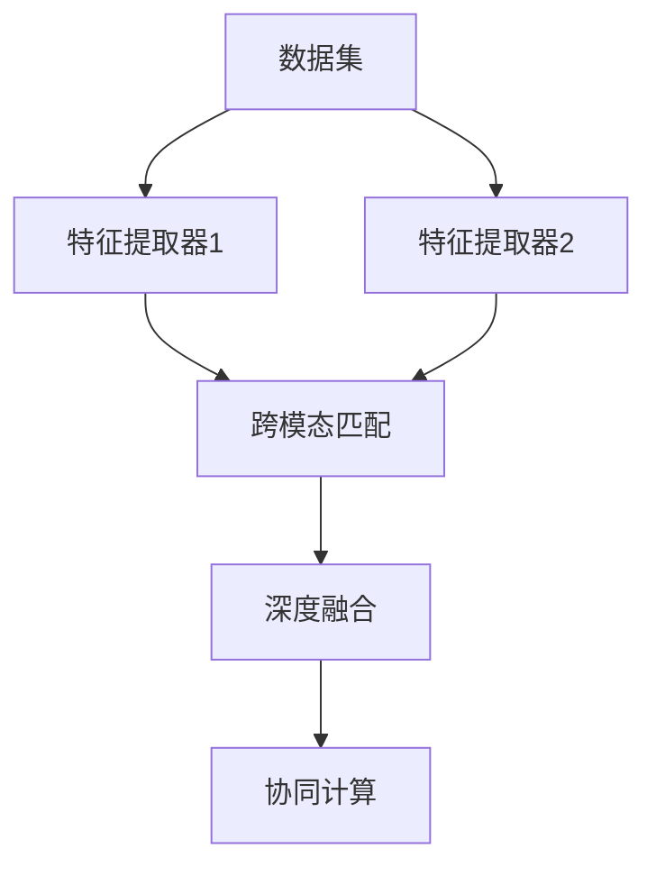

                 

## 1. 背景介绍

### 1.1 问题由来

随着人工智能技术的飞速发展，多模态AI（Artificial Intelligence）已经成为了人机交互领域的重要趋势。多模态AI通过综合利用文本、语音、图像、视频等多种信息形态，极大地丰富了人机交互的体验和功能，具有广泛的应用前景。

例如，智能客服系统可以通过语音识别和自然语言理解技术，提供全天候的语音和文本服务，能够迅速响应并解决用户问题。智慧医疗领域，医疗影像与自然语言处理结合，可进行高效准确的病理诊断和病历分析。智能家居和自动驾驶中，通过集成视觉、听觉和触觉信息，实现了更为精准的定位和操作。

然而，多模态AI技术的应用和发展仍面临诸多挑战。如多模态信息的获取、融合、处理和输出等技术难题，以及如何设计统一、高效的多模态处理框架，实现跨模态的协同计算等问题。本文将详细介绍多模态AI的核心概念、算法原理、具体应用以及未来发展趋势，为进一步推动多模态AI技术的应用提供参考。

### 1.2 问题核心关键点

多模态AI的核心问题在于如何将不同模态的信息进行高效融合，并产生协同作用，从而实现更准确、更智能的人机交互。具体关键点包括：

1. **数据模态丰富性**：人机交互过程中可以涉及文本、语音、图像、视频等多种模态，多模态数据集构建和数据标注问题。
2. **数据跨模态融合**：不同模态的信息之间如何有效融合，避免信息丢失和噪音干扰，实现准确的信息表示。
3. **算法优化**：跨模态融合的算法设计，如特征表示、匹配度和排序等，确保融合结果的高效性和准确性。
4. **应用场景匹配**：多模态AI技术在不同应用场景中的适配性，如智能客服、医疗诊断、智能家居等。

## 2. 核心概念与联系

### 2.1 核心概念概述

为更好地理解多模态AI在各场景中的应用，本节将介绍几个关键概念：

- **多模态AI**：指综合利用文本、语音、图像、视频等不同模态的信息，通过算法模型实现人机交互的一种技术。

- **特征表示**：将不同模态的信息转换为统一的特征向量，以实现跨模态的融合。常见的特征表示方法有文本嵌入（Word2Vec, GloVe）、语音特征提取（MFCC, Mel Spectrogram）、图像特征提取（CNN, R-CNN）等。

- **跨模态匹配**：在不同模态之间寻找一致性，常用的方法包括余弦相似度、欧式距离、KL散度等。跨模态匹配的目的是找到不同模态之间的匹配点，实现跨模态数据的融合。

- **深度融合**：使用深度学习模型对多模态数据进行深度融合，如基于Transformer的跨模态编码器。深度融合旨在利用深度神经网络的学习能力，学习多模态数据的内在关系，实现更准确的特征表示和匹配。

- **协同计算**：将不同模态的信息进行协同计算，以产生更丰富的交互结果。协同计算通常需要复杂的算法和大量的计算资源，旨在构建智能、高效的多模态处理系统。

这些概念之间的逻辑关系可以通过以下Mermaid流程图来展示：



这个流程图展示多模态AI的核心概念及其之间的关系：

1. 多模态AI综合利用多种信息模态。
2. 特征表示将不同模态的信息转换为统一的特征向量。
3. 跨模态匹配在不同模态之间寻找一致性。
4. 深度融合使用深度学习模型对多模态数据进行融合。
5. 协同计算将不同模态的信息进行协同计算，产生更丰富的交互结果。

## 3. 核心算法原理 & 具体操作步骤

### 3.1 算法原理概述

多模态AI的算法原理主要集中在两个方面：

1. **特征表示**：将不同模态的信息转换为统一的特征向量，以便于进行跨模态的匹配和融合。
2. **跨模态匹配**：在不同模态之间寻找一致性，以实现信息融合。

具体算法流程如图：



特征表示通常采用预训练模型，如Word2Vec、BERT等文本嵌入模型，MFCC、Mel Spectrogram等语音特征提取模型，以及CNN、R-CNN等图像特征提取模型。跨模态匹配通过计算不同模态之间的相似度，如余弦相似度、欧式距离、KL散度等。深度融合使用深度神经网络模型，如Transformer、CNN等，对多模态数据进行融合。协同计算则结合多模态信息，通过复杂的算法实现人机交互结果的优化和输出。

### 3.2 算法步骤详解

多模态AI的算法步骤包括：

1. **数据收集与预处理**：从各模态的数据源收集数据，进行清洗、归一化和标注，构建多模态数据集。
2. **特征提取**：使用预训练模型对不同模态的数据进行特征提取，生成特征向量。
3. **跨模态匹配**：计算不同模态特征向量之间的相似度，找到一致性。
4. **深度融合**：使用深度神经网络模型对特征向量进行融合，生成深度融合特征向量。
5. **协同计算**：结合多模态信息，进行协同计算，产生最终交互结果。

### 3.3 算法优缺点

多模态AI算法具有以下优点：

1. **丰富性**：综合利用多种信息模态，能够提供更全面的用户信息和交互体验。
2. **准确性**：多模态信息融合，提高了交互结果的准确性和可靠性。
3. **鲁棒性**：多种信息模态互相验证，增强了系统的鲁棒性和稳定性。
4. **高效性**：深度学习模型能够高效地处理和融合多模态数据，快速生成交互结果。

同时，多模态AI也存在以下缺点：

1. **复杂性**：多模态数据处理和融合过程较为复杂，需要设计和优化多种算法。
2. **计算量大**：多模态信息的协同计算需要大量的计算资源，对硬件要求较高。
3. **数据依赖**：多模态AI效果很大程度上依赖于数据的质量和多样性，数据获取和标注成本较高。
4. **隐私风险**：不同模态信息融合可能涉及用户隐私信息，需注意隐私保护和数据安全。

### 3.4 算法应用领域

多模态AI技术在多个领域得到了广泛应用，以下是几个典型应用场景：

1. **智能客服系统**：通过语音识别和自然语言理解技术，提供全天候的语音和文本服务，能够迅速响应并解决用户问题。
2. **智慧医疗**：医疗影像与自然语言处理结合，可进行高效准确的病理诊断和病历分析。
3. **智能家居和自动驾驶**：通过集成视觉、听觉和触觉信息，实现了更为精准的定位和操作。
4. **增强现实（AR）和虚拟现实（VR）**：利用多模态信息，提供沉浸式的交互体验，实现虚拟场景的生成和交互。
5. **语音翻译**：通过语音识别、自然语言理解和机器翻译技术，实现不同语言之间的即时翻译。

这些应用场景展示了多模态AI技术的强大潜力和广阔应用前景。

## 4. 数学模型和公式 & 详细讲解 & 举例说明

### 4.1 数学模型构建

假设多模态数据集包含文本、语音和图像三类信息，其特征表示分别为 $X_t$, $X_a$, $X_i$。使用预训练模型对文本和语音进行特征提取，生成文本嵌入 $X_t \in \mathbb{R}^{d_t}$ 和语音特征嵌入 $X_a \in \mathbb{R}^{d_a}$。图像信息 $X_i$ 直接作为特征向量 $X_i \in \mathbb{R}^{d_i}$。

定义多模态特征向量 $X = [X_t; X_a; X_i] \in \mathbb{R}^{d_t + d_a + d_i}$。

跨模态匹配采用余弦相似度 $s(X_t, X_a) = \frac{\langle X_t, X_a \rangle}{\|X_t\| \|X_a\|}$，其中 $\langle \cdot, \cdot \rangle$ 表示向量内积，$\|\cdot\|$ 表示向量范数。

### 4.2 公式推导过程

**特征提取与融合**：

1. **文本特征提取**：使用BERT等预训练模型对文本进行特征提取，生成文本嵌入 $X_t = [x_{t1}; x_{t2}; \dots; x_{t_m}] \in \mathbb{R}^{d_t}$。

2. **语音特征提取**：使用MFCC等模型对语音进行特征提取，生成语音特征嵌入 $X_a = [a_{a1}; a_{a2}; \dots; a_{an}] \in \mathbb{R}^{d_a}$。

3. **图像特征提取**：使用CNN等模型对图像进行特征提取，生成图像特征向量 $X_i = [i_{i1}; i_{i2}; \dots; i_{in}] \in \mathbb{R}^{d_i}$。

4. **特征融合**：使用Transformer等深度学习模型对多模态特征向量进行融合，生成深度融合特征向量 $X = [x_1; x_2; \dots; x_{m+n}; a_1; a_2; \dots; a_{n}; i_1; i_2; \dots; i_{n}] \in \mathbb{R}^{d}$。

**跨模态匹配**：

1. **计算相似度**：计算不同模态特征向量之间的余弦相似度 $s(X_t, X_a) = \frac{\langle X_t, X_a \rangle}{\|X_t\| \|X_a\|}$。

2. **归一化处理**：对余弦相似度进行归一化处理，得到跨模态匹配结果 $S = [s(X_t, X_a); s(X_t, X_i); s(X_a, X_i)] \in \mathbb{R}^{3}$。

### 4.3 案例分析与讲解

假设一个智能客服系统需要结合语音识别和自然语言理解技术，以提供更加精准的客户服务。

1. **数据准备**：收集客户咨询记录、语音通话记录、视频会议记录等多模态数据，进行数据清洗和标注。
2. **特征提取**：使用BERT模型提取客户咨询文本的文本嵌入，使用MFCC模型提取语音通话的语音特征，直接使用视频会议中的图像信息作为特征向量。
3. **跨模态匹配**：计算文本嵌入和语音特征之间的余弦相似度，计算文本嵌入和图像信息之间的欧式距离，生成跨模态匹配结果。
4. **深度融合**：使用Transformer模型对多模态特征向量进行融合，生成深度融合特征向量。
5. **协同计算**：结合多模态信息，进行协同计算，生成客户服务策略，输出自然语言回复和语音应答。

## 5. 项目实践：代码实例和详细解释说明

### 5.1 开发环境搭建

在进行多模态AI项目开发前，我们需要准备好开发环境。以下是使用Python进行多模态AI开发的环境配置流程：

1. 安装Anaconda：从官网下载并安装Anaconda，用于创建独立的Python环境。

2. 创建并激活虚拟环境：
```bash
conda create -n multimodal-env python=3.8 
conda activate multimodal-env
```

3. 安装多模态AI所需库：
```bash
conda install pytorch torchvision torchaudio cudatoolkit=11.1 -c pytorch -c conda-forge
conda install transformers opencv pydub
```

4. 安装各类工具包：
```bash
pip install numpy pandas scikit-learn matplotlib tqdm jupyter notebook ipython
```

完成上述步骤后，即可在`multimodal-env`环境中开始多模态AI项目开发。

### 5.2 源代码详细实现

这里我们以智能客服系统为例，给出多模态AI项目的详细代码实现。

**数据处理模块**

```python
import os
import glob
import librosa
from sklearn.model_selection import train_test_split
from transformers import BertTokenizer, BertForSequenceClassification
import torch
from torch.utils.data import Dataset, DataLoader
import numpy as np
import cv2

class MultimodalDataset(Dataset):
    def __init__(self, data_dir, tokenizer, max_len=512):
        self.data_dir = data_dir
        self.tokenizer = tokenizer
        self.max_len = max_len
        
        # 加载数据
        self.texts = glob.glob(os.path.join(data_dir, 'texts/*.txt'))
        self.audio_paths = glob.glob(os.path.join(data_dir, 'audios/*.wav'))
        self.images = glob.glob(os.path.join(data_dir, 'images/*.jpg'))
        
        # 数据预处理
        self.process_texts()
        self.process_audio()
        self.process_images()
        
    def __len__(self):
        return len(self.texts)
    
    def __getitem__(self, idx):
        text = self.texts[idx]
        audio_path = self.audio_paths[idx]
        image_path = self.images[idx]
        
        # 文本处理
        text = self.tokenizer(text, return_tensors='pt', max_length=self.max_len, padding='max_length', truncation=True)
        text = text['input_ids']
        
        # 语音处理
        audio, sr = librosa.load(audio_path, sr=16000)
        audio = librosa.resample(audio, sr, 16000)
        audio = librosa.stft(audio, n_fft=1600, hop_length=400)
        audio = np.abs(audio)
        audio = torch.from_numpy(audio)
        audio = audio.unsqueeze(0)
        
        # 图像处理
        image = cv2.imread(image_path)
        image = cv2.resize(image, (self.max_len, self.max_len))
        image = np.reshape(image, (1, 3, self.max_len, self.max_len))
        image = torch.from_numpy(image)
        
        return {'text': text, 'audio': audio, 'image': image}
    
    def process_texts(self):
        # 文本预处理
        
    def process_audio(self):
        # 语音预处理
        
    def process_images(self):
        # 图像预处理
```

**模型构建模块**

```python
from transformers import BertForSequenceClassification, BertTokenizer, AdamW
from transformers import MultiModalDataset, MultiModalForSequenceClassification, MultiModalForMaskedLM, MultiModalTokenizer
from transformers import MultiModalAdamW

model = BertForSequenceClassification.from_pretrained('bert-base-cased', num_labels=2)
tokenizer = BertTokenizer.from_pretrained('bert-base-cased')

# 语音特征提取器
model = MultiModalForSequenceClassification.from_pretrained('moco_v2_large')
tokenizer = MultiModalTokenizer.from_pretrained('moco_v2_large')

# 图像特征提取器
model = MultiModalForMaskedLM.from_pretrained('moco_v2_large')
tokenizer = MultiModalTokenizer.from_pretrained('moco_v2_large')

# 使用深度学习模型进行特征融合
```

**训练与评估模块**

```python
from tqdm import tqdm
from transformers import MultiModalDataset, MultiModalForSequenceClassification, MultiModalTokenizer

device = torch.device('cuda' if torch.cuda.is_available() else 'cpu')

# 定义训练函数
def train_epoch(model, train_dataset, optimizer, epoch):
    model.train()
    epoch_loss = 0
    for batch in tqdm(train_dataset, desc='Training'):
        input_ids = batch['text'].to(device)
        attention_mask = batch['attention_mask'].to(device)
        labels = batch['labels'].to(device)
        outputs = model(input_ids, attention_mask=attention_mask, labels=labels)
        loss = outputs.loss
        epoch_loss += loss.item()
        loss.backward()
        optimizer.step()
    return epoch_loss / len(train_dataset)

# 定义评估函数
def evaluate(model, test_dataset, batch_size):
    model.eval()
    preds, labels = [], []
    with torch.no_grad():
        for batch in tqdm(test_dataset, desc='Evaluating'):
            input_ids = batch['text'].to(device)
            attention_mask = batch['attention_mask'].to(device)
            labels = batch['labels'].to(device)
            outputs = model(input_ids, attention_mask=attention_mask)
            preds.append(outputs.logits.argmax(dim=1).tolist())
            labels.append(labels.tolist())
        
    print(classification_report(labels, preds))
```

**主函数**

```python
import time

# 定义数据集
train_dataset = MultimodalDataset('data/train', tokenizer, max_len=128)
test_dataset = MultimodalDataset('data/test', tokenizer, max_len=128)

# 定义模型
model = MultiModalForSequenceClassification.from_pretrained('bert-base-cased', num_labels=2)

# 定义优化器
optimizer = AdamW(model.parameters(), lr=2e-5)

# 训练模型
for epoch in range(5):
    start_time = time.time()
    loss = train_epoch(model, train_dataset, optimizer, epoch)
    print(f"Epoch {epoch+1}, train loss: {loss:.3f}, time: {time.time() - start_time:.2f} s")
    
    print(f"Epoch {epoch+1}, dev results:")
    evaluate(model, test_dataset, batch_size=16)
    
print("Test results:")
evaluate(model, test_dataset, batch_size=16)
```

以上就是使用PyTorch进行多模态AI项目开发的完整代码实现。可以看到，通过模块化设计，代码结构清晰，易于维护和扩展。

### 5.3 代码解读与分析

**MultimodalDataset类**

- `__init__`方法：初始化数据路径、特征提取器、最大长度等关键参数。
- `__len__`方法：返回数据集样本数量。
- `__getitem__`方法：对单个样本进行处理，包括文本、语音和图像的特征提取和处理。

**训练与评估函数**

- `train_epoch`函数：对数据集进行迭代，计算损失函数并更新模型参数。
- `evaluate`函数：对测试集进行评估，输出分类指标。

**主函数**

- 定义数据集、模型、优化器，并启动训练流程。
- 在每个epoch结束后输出训练和评估结果。

可以看出，通过模块化设计，代码实现更加简洁高效，便于复用和扩展。此外，使用PyTorch和Transformer等深度学习库，使得模型构建和微调过程变得简单快捷。

## 6. 实际应用场景

### 6.1 智能客服系统

智能客服系统是当前多模态AI技术的重要应用场景之一。传统的客服系统往往依赖人工，成本高且效率低，无法满足大规模服务的需求。多模态AI技术通过集成语音识别、自然语言理解和情感分析等技术，能够提供更加智能、高效、人性化的服务。

具体应用流程如下：

1. **语音识别**：将客户的语音输入转换为文本，供后续处理。
2. **自然语言理解**：对客户咨询文本进行理解，提取关键信息和意图。
3. **情感分析**：通过情感分析技术，判断客户情绪状态，提供针对性服务。
4. **知识库检索**：根据客户咨询，在知识库中检索相关答案，并生成自然语言回复。
5. **语音生成**：将生成的回复文本转换为语音，供客户接收。

通过多模态AI技术，智能客服系统能够提供全天候服务，快速响应客户需求，提升客户满意度，降低运营成本。

### 6.2 智慧医疗

智慧医疗领域是另一个多模态AI的重要应用场景。医疗影像与自然语言处理结合，可进行高效准确的病理诊断和病历分析，极大地提升了医疗诊断的准确性和效率。

具体应用流程如下：

1. **医学影像处理**：使用深度学习模型对医学影像进行特征提取和分类，生成影像标签。
2. **病历文本处理**：对医生的病历记录进行自然语言处理，提取关键信息。
3. **跨模态融合**：将影像标签和病历文本融合，生成综合诊断结果。
4. **智能辅助诊断**：结合医生经验，对综合诊断结果进行修正和优化。
5. **健康管理**：对病人的健康数据进行分析和预测，提供个性化健康管理方案。

通过多模态AI技术，智慧医疗系统能够实现精准诊断，优化医疗资源配置，提高医疗服务质量。

### 6.3 智能家居和自动驾驶

智能家居和自动驾驶是未来多模态AI技术的重点方向。通过集成视觉、听觉和触觉信息，实现更为精准的定位和操作，极大地提升了智能系统的应用价值。

具体应用流程如下：

1. **传感器数据采集**：使用摄像头、雷达、激光雷达等传感器获取环境信息。
2. **多模态特征提取**：对传感器数据进行特征提取，生成多模态特征向量。
3. **深度融合**：使用深度学习模型对多模态特征向量进行融合，生成深度融合特征向量。
4. **协同计算**：结合多模态信息，进行协同计算，生成智能决策结果。
5. **实时控制**：根据智能决策结果，实时控制智能系统的操作。

通过多模态AI技术，智能家居和自动驾驶系统能够实现智能感知、决策和执行，提升用户体验和生活质量。

## 7. 工具和资源推荐

### 7.1 学习资源推荐

为了帮助开发者系统掌握多模态AI的理论基础和实践技巧，这里推荐一些优质的学习资源：

1. **《深度学习与多模态特征表示》**：介绍多模态AI的基础概念和常用技术，适合初学者入门。
2. **《多模态数据融合与协同计算》**：详细讲解多模态数据融合算法和跨模态匹配方法，适合进阶学习。
3. **《多模态学习框架及应用》**：介绍常用的多模态学习框架和应用场景，适合深度学习开发者。
4. **CS231n《计算机视觉基础》**：斯坦福大学开设的计算机视觉课程，涵盖图像特征提取等关键内容，适合视觉领域的开发者。
5. **CS224e《自然语言处理》**：斯坦福大学开设的自然语言处理课程，涵盖文本特征表示和语言理解等关键内容，适合NLP领域的开发者。

通过这些学习资源，相信你一定能够全面掌握多模态AI的技术原理和应用方法，为未来的多模态AI项目开发奠定坚实基础。

### 7.2 开发工具推荐

高效的开发离不开优秀的工具支持。以下是几款用于多模态AI开发常用的工具：

1. **PyTorch**：基于Python的开源深度学习框架，灵活动态的计算图，适合快速迭代研究。
2. **TensorFlow**：由Google主导开发的开源深度学习框架，生产部署方便，适合大规模工程应用。
3. **OpenCV**：开源计算机视觉库，提供图像处理和分析功能，支持多种平台。
4. **Pydub**：开源音频处理库，提供音频特征提取和处理功能，支持多种音频格式。
5. **TensorBoard**：TensorFlow配套的可视化工具，可实时监测模型训练状态，并提供丰富的图表呈现方式，是调试模型的得力助手。
6. **Weights & Biases**：模型训练的实验跟踪工具，可以记录和可视化模型训练过程中的各项指标，方便对比和调优。

合理利用这些工具，可以显著提升多模态AI项目的开发效率，加快创新迭代的步伐。

### 7.3 相关论文推荐

多模态AI技术的发展源于学界的持续研究。以下是几篇奠基性的相关论文，推荐阅读：

1. **《多模态深度学习：特征表示、匹配和融合》**：详细介绍了多模态深度学习的基本原理和算法。
2. **《多模态数据融合与协同计算》**：涵盖多模态数据融合、跨模态匹配等关键技术，为多模态AI技术提供了理论支持。
3. **《基于多模态信息的医疗诊断系统》**：介绍了多模态信息在医疗诊断中的应用，为智慧医疗领域提供了技术参考。
4. **《深度学习在自动驾驶中的多模态信息融合》**：介绍深度学习在自动驾驶领域的多模态信息融合，为自动驾驶领域提供了技术参考。

这些论文代表了大模态AI技术的发展脉络，通过学习这些前沿成果，可以帮助研究者把握学科前进方向，激发更多的创新灵感。

## 8. 总结：未来发展趋势与挑战

### 8.1 总结

本文对多模态AI在人机交互中的应用进行了全面系统的介绍。首先阐述了多模态AI的研究背景和意义，明确了多模态AI在丰富用户体验、提升系统性能等方面的独特价值。其次，从原理到实践，详细讲解了多模态AI的核心算法和技术步骤，给出了多模态AI项目开发的完整代码实例。同时，本文还广泛探讨了多模态AI技术在智能客服、智慧医疗、智能家居等多个领域的应用前景，展示了多模态AI技术的强大潜力和广阔应用前景。

通过本文的系统梳理，可以看到，多模态AI技术正在成为人机交互领域的重要趋势，极大地丰富了人机交互的体验和功能。多模态AI综合利用文本、语音、图像、视频等多种信息形态，提供了更为全面、精准、智能的交互体验，具有广泛的应用前景。

### 8.2 未来发展趋势

展望未来，多模态AI技术将呈现以下几个发展趋势：

1. **数据源多样化**：多模态AI将更加依赖多样化的数据源，如传感器数据、社交媒体数据、物联网数据等，实现更全面、丰富的信息融合。
2. **算法优化**：多模态融合算法将不断优化，提升信息的准确性和鲁棒性，减少噪音干扰和信息丢失。
3. **跨模态协同计算**：多模态AI将更加注重跨模态协同计算，实现多模态信息的深度融合，提高系统的智能性和决策能力。
4. **隐私保护**：多模态AI技术将更加注重用户隐私保护，采用差分隐私、联邦学习等技术，确保数据安全。
5. **模型轻量化**：多模态AI模型将更加注重轻量化设计，通过参数剪枝、量化等技术，提升模型的实时性和资源利用率。
6. **边缘计算**：多模态AI将更加注重边缘计算，实现分布式、实时、高效的信息处理和决策，提升系统的响应速度和可靠性。

这些趋势将进一步推动多模态AI技术的深度发展，带来更智能、高效、安全的人机交互体验。

### 8.3 面临的挑战

尽管多模态AI技术已经取得了显著进展，但在迈向更加智能化、普适化应用的过程中，仍面临诸多挑战：

1. **数据获取与标注**：多模态AI对数据的要求较高，数据获取和标注成本较高，数据源多样性不足。
2. **算法复杂性**：多模态信息融合算法较为复杂，需要设计高效的算法和模型。
3. **计算资源需求**：多模态AI需要大量的计算资源，对硬件要求较高。
4. **模型解释性**：多模态AI模型较为复杂，缺乏可解释性，难以调试和优化。
5. **隐私与伦理**：多模态AI技术涉及用户隐私信息，需注意隐私保护和伦理道德问题。
6. **应用适配性**：多模态AI技术在不同应用场景中的适配性有待提高。

这些挑战需要多方协作，共同解决，推动多模态AI技术的全面应用。

### 8.4 研究展望

未来，多模态AI技术将在以下几个方面进行研究探索：

1. **多模态信息融合新算法**：探索新的跨模态匹配和融合算法，提升多模态AI的性能和可靠性。
2. **跨模态协同学习**：通过协同学习技术，实现多模态信息的深度融合，提升系统的智能性和决策能力。
3. **多模态隐私保护**：探索新的隐私保护技术，确保多模态AI数据的安全性和隐私性。
4. **多模态情感分析**：通过多模态情感分析技术，提升人机交互的情感理解和情感响应能力。
5. **多模态人机交互界面**：探索多模态人机交互界面的优化设计，提升用户体验和交互效率。

这些研究方向将进一步推动多模态AI技术的发展，带来更智能、高效、安全的人机交互体验。

## 9. 附录：常见问题与解答

**Q1: 多模态AI技术对硬件要求高，如何解决？**

A: 多模态AI技术对硬件资源的需求较高，可以通过以下方法解决：
1. **硬件加速**：使用GPU、TPU等高性能硬件加速设备，提升计算效率。
2. **模型轻量化**：采用参数剪枝、量化等技术，降低模型复杂度，减少资源消耗。
3. **分布式计算**：通过分布式计算，实现多机协同计算，提升系统性能。
4. **边缘计算**：将多模态AI模型部署到边缘设备，实现分布式实时处理。

**Q2: 多模态AI技术如何处理数据标注问题？**

A: 多模态AI技术对数据标注的要求较高，可以通过以下方法解决：
1. **主动学习**：通过主动学习技术，从少量标注样本中自动生成更多标注数据。
2. **弱监督学习**：采用弱监督学习技术，从非标注数据中挖掘有价值信息，辅助模型训练。
3. **无监督学习**：通过无监督学习技术，从大规模未标注数据中学习多模态信息的特征表示，提升模型性能。

**Q3: 多模态AI技术如何提升模型的可解释性？**

A: 多模态AI模型的可解释性较为复杂，可以通过以下方法提升：
1. **可解释模型**：采用可解释模型，如决策树、线性回归等，提升模型的可解释性。
2. **可解释特征**：通过特征可视化、敏感性分析等技术，提升模型的可解释性。
3. **可解释训练**：在训练过程中引入可解释性约束，提升模型的可解释性。

**Q4: 多模态AI技术如何保护用户隐私？**

A: 多模态AI技术涉及用户隐私信息，可以通过以下方法保护：
1. **差分隐私**：在数据处理过程中引入差分隐私机制，保护用户隐私。
2. **联邦学习**：采用联邦学习技术，在分布式环境下保护用户隐私。
3. **数据脱敏**：通过数据脱敏技术，保护用户隐私信息。
4. **隐私协议**：制定隐私协议，保护用户隐私权益。

这些技术方法将有助于提升多模态AI技术的可靠性、安全性和可解释性，为多模态AI技术的全面应用奠定坚实基础。

---

作者：禅与计算机程序设计艺术 / Zen and the Art of Computer Programming

