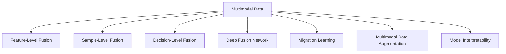

                 

# 多模态AI应用：图像、音频和视频处理技术

多模态人工智能（AI）应用是指利用不同类型的数据（如图像、音频、视频等）进行AI模型训练和推理，以获得更全面、更丰富的理解和生成能力。这种技术在现代信息时代具有极高的实用价值，广泛应用在自动驾驶、智能监控、医疗诊断、娱乐等多个领域。本文将全面介绍多模态AI应用的核心概念、算法原理、具体操作步骤、实际应用场景及未来发展趋势。

## 1. 背景介绍

### 1.1 问题由来

近年来，AI技术在图像、音频和视频处理等领域取得了显著进展。传统的单一模态AI模型虽然在某些特定任务上表现出色，但无法充分利用多源数据，限制了其应用范围和效果。多模态AI技术通过整合多种类型的数据，提升模型的感知能力和决策质量，极大地拓展了AI应用的可能性。

在自动驾驶中，多模态AI模型可以结合摄像头、雷达、激光雷达等多种传感器数据，实现更精确的物体检测和路径规划。在医疗影像诊断中，多模态AI模型能够同时分析CT、MRI、超声等多种医学影像，提高诊断准确性和全面性。在智能监控中，多模态AI模型结合视频、声音和人体动作数据，提高事件识别的准确性和鲁棒性。

### 1.2 问题核心关键点

多模态AI应用的核心在于如何有效地整合不同类型的数据，提升模型的泛化能力和决策效果。具体来说，关键点包括以下几个方面：

1. 多源数据预处理：对不同类型的数据进行统一格式转换和特征提取，为后续融合打下基础。
2. 数据融合方法：选择合适的融合方式，如特征级融合、样本级融合、决策级融合等。
3. 融合模型的训练和推理：设计多模态融合模型，并进行训练和推理优化，提升模型性能。
4. 数据增强和迁移学习：在数据稀缺的情况下，通过数据增强和迁移学习提高模型泛化能力。
5. 可解释性：对多模态AI模型进行解释，理解其决策依据和过程，提升可信度和可用性。

## 2. 核心概念与联系

### 2.1 核心概念概述

为更好地理解多模态AI应用，本节将介绍几个关键概念：

- **多模态数据（Multimodal Data）**：指同时包含多种类型数据（如图像、音频、视频等）的数据集。
- **特征级融合（Feature-Level Fusion）**：将不同模态的特征向量进行线性或非线性组合，形成新的特征向量。
- **样本级融合（Sample-Level Fusion）**：将不同模态的样本数据进行拼接或加权平均，形成新的样本数据。
- **决策级融合（Decision-Level Fusion）**：在不同模态模型输出结果的基础上，采用集成学习方法进行融合。
- **深度融合网络（Deep Fusion Network）**：利用深度神经网络，将不同模态数据进行特征映射，形成多模态特征，最终进行联合分类或回归。
- **迁移学习（Transfer Learning）**：在多模态数据不足的情况下，利用预训练模型在某一模态上的知识，迁移到其他模态。
- **多模态数据增强（Multimodal Data Augmentation）**：通过修改、组合、变换等方式增加多模态数据量，提高模型泛化能力。
- **模型可解释性（Model Interpretability）**：通过可视化、特征解释等手段，理解多模态AI模型的决策过程，增强可信度。

这些概念之间的逻辑关系可以通过以下Mermaid流程图来展示：



这个流程图展示了多模态数据的不同处理方式及其与多模态AI模型的关联。

## 3. 核心算法原理 & 具体操作步骤

### 3.1 算法原理概述

多模态AI应用的核心算法原理包括特征融合、深度融合网络、迁移学习等。其核心思想是将不同模态的数据通过统一的特征表示，联合学习，提升模型的泛化能力和决策效果。

具体来说，多模态AI应用的主要算法原理包括以下几个方面：

1. **特征融合（Feature Fusion）**：将不同模态的特征向量进行线性或非线性组合，形成新的特征向量，用于多模态模型训练。
2. **深度融合网络（Deep Fusion Network）**：利用深度神经网络，将不同模态数据进行特征映射，形成多模态特征，最终进行联合分类或回归。
3. **迁移学习（Transfer Learning）**：在多模态数据不足的情况下，利用预训练模型在某一模态上的知识，迁移到其他模态。
4. **多模态数据增强（Multimodal Data Augmentation）**：通过修改、组合、变换等方式增加多模态数据量，提高模型泛化能力。
5. **模型可解释性（Model Interpretability）**：通过可视化、特征解释等手段，理解多模态AI模型的决策过程，增强可信度。

### 3.2 算法步骤详解

基于多模态AI应用的算法原理，其操作步骤一般包括以下几个关键步骤：

**Step 1: 数据预处理**
- 对不同模态的数据进行统一格式转换和特征提取。例如，将图像数据转换为像素向量，将音频数据转换为MFCC特征向量。
- 对不同模态的数据进行归一化、标准化等预处理操作，以便后续融合。

**Step 2: 特征融合**
- 根据具体应用需求选择合适的特征融合方式，如特征级融合、样本级融合、决策级融合等。
- 设计多模态融合网络，将不同模态的特征向量进行融合。

**Step 3: 多模态模型训练**
- 在融合后的多模态数据上进行模型训练，优化模型参数，提升模型性能。
- 应用正则化、Dropout等技术，防止过拟合。

**Step 4: 多模态模型推理**
- 在测试集上进行多模态模型的推理，评估模型性能。
- 应用数据增强、迁移学习等技术，提升模型泛化能力。

**Step 5: 模型可解释性分析**
- 对多模态AI模型的决策过程进行可视化、特征解释等，理解其决策依据和过程。
- 应用部分可解释性模型，如LIME、SHAP等，提升模型可信度。

### 3.3 算法优缺点

多模态AI应用具有以下优点：
1. 提升模型泛化能力：通过整合多种数据，提高模型对复杂场景的理解能力。
2. 增强模型鲁棒性：不同模态数据可以相互补充，提高模型对噪声、变化环境的鲁棒性。
3. 提高模型准确性：多模态数据可以提供更多的信息，提升模型预测准确性。

同时，多模态AI应用也存在一些缺点：
1. 数据处理复杂：不同模态数据格式不同，预处理和融合较为复杂。
2. 计算资源消耗大：多模态数据量大，模型训练和推理资源消耗大。
3. 模型复杂度高：多模态融合模型结构复杂，难以调试和优化。

### 3.4 算法应用领域

多模态AI应用已经在诸多领域取得了广泛应用，以下是几个典型应用场景：

- **自动驾驶**：结合摄像头、雷达、激光雷达等多种传感器数据，实现更精确的物体检测和路径规划。
- **智能监控**：结合视频、声音和人体动作数据，提高事件识别的准确性和鲁棒性。
- **医疗诊断**：结合CT、MRI、超声等多种医学影像，提高诊断准确性和全面性。
- **虚拟现实**：结合图像、音频、视频等多模态数据，提升虚拟环境的沉浸感和互动性。
- **游戏AI**：结合角色动作、环境反馈等多模态数据，提升游戏AI的决策能力和自然性。

## 4. 数学模型和公式 & 详细讲解 & 举例说明

### 4.1 数学模型构建

以图像和音频数据的融合为例，构建多模态数据融合的数学模型。

设图像数据 $X_i \in \mathbb{R}^n$，音频数据 $Y_i \in \mathbb{R}^m$，分别表示为 $n$ 维和 $m$ 维的向量。多模态数据融合的目标是将 $X_i$ 和 $Y_i$ 转换为新的特征向量 $Z_i \in \mathbb{R}^p$，其中 $p$ 为新的特征维度。

设特征融合函数为 $F$，则数学模型为：

$$
Z_i = F(X_i, Y_i) = \begin{bmatrix}
x_1 & y_1 & x_2 & y_2 & \ldots & x_n & y_n
\end{bmatrix}
$$

其中 $x_i$ 和 $y_i$ 分别表示图像和音频的 $i$ 个特征。

### 4.2 公式推导过程

以线性融合为例，推导特征融合公式。

设图像数据 $X_i$ 的特征向量为 $x_i$，音频数据 $Y_i$ 的特征向量为 $y_i$，则线性融合公式为：

$$
Z_i = \alpha x_i + \beta y_i
$$

其中 $\alpha$ 和 $\beta$ 为融合系数，满足 $\alpha + \beta = 1$。通过调节 $\alpha$ 和 $\beta$，可以实现不同融合比例的控制。

设 $\alpha = 0.5$，$\beta = 0.5$，则线性融合公式为：

$$
Z_i = 0.5x_i + 0.5y_i
$$

### 4.3 案例分析与讲解

以自动驾驶中的多模态数据融合为例，进行详细分析。

在自动驾驶中，摄像头、雷达和激光雷达分别提供图像、距离和角度数据。为了提升物体的检测和识别能力，可以将这些数据进行线性融合，形成新的特征向量。

设摄像头数据 $X_i \in \mathbb{R}^{n_1}$，雷达数据 $Y_i \in \mathbb{R}^{n_2}$，激光雷达数据 $Z_i \in \mathbb{R}^{n_3}$，则线性融合公式为：

$$
W_i = 0.6X_i + 0.3Y_i + 0.1Z_i
$$

其中 $W_i$ 为新的特征向量。

通过这种方式，多模态数据可以互相补充，提升物体检测和识别的准确性。例如，当摄像头数据不足时，雷达和激光雷达数据可以提供更多的信息，提高检测的鲁棒性。

## 5. 项目实践：代码实例和详细解释说明

### 5.1 开发环境搭建

在进行多模态AI应用开发前，我们需要准备好开发环境。以下是使用Python进行TensorFlow开发的环境配置流程：

1. 安装Anaconda：从官网下载并安装Anaconda，用于创建独立的Python环境。

2. 创建并激活虚拟环境：
```bash
conda create -n tf-env python=3.8 
conda activate tf-env
```

3. 安装TensorFlow：根据CUDA版本，从官网获取对应的安装命令。例如：
```bash
conda install tensorflow -c pytorch -c conda-forge
```

4. 安装各类工具包：
```bash
pip install numpy pandas scikit-learn matplotlib tqdm jupyter notebook ipython
```

完成上述步骤后，即可在`tf-env`环境中开始多模态AI应用的开发。

### 5.2 源代码详细实现

这里我们以图像和音频数据的融合为例，给出使用TensorFlow进行线性融合的PyTorch代码实现。

首先，定义图像和音频数据的融合函数：

```python
import tensorflow as tf

def linear_fusion(x, y):
    return 0.5 * x + 0.5 * y
```

然后，定义模型和优化器：

```python
from tensorflow.keras import layers

model = tf.keras.Sequential([
    layers.Dense(64, activation='relu'),
    layers.Dense(64, activation='relu'),
    layers.Dense(10, activation='softmax')
])

optimizer = tf.keras.optimizers.Adam(learning_rate=0.001)
```

接着，定义训练和评估函数：

```python
def train_epoch(model, dataset, batch_size, optimizer):
    model.compile(optimizer=optimizer, loss='categorical_crossentropy', metrics=['accuracy'])
    model.fit(dataset, epochs=5, batch_size=batch_size)
    
def evaluate(model, dataset, batch_size):
    model.evaluate(dataset, batch_size=batch_size)
```

最后，启动训练流程并在测试集上评估：

```python
batch_size = 32

for epoch in range(10):
    train_epoch(model, train_dataset, batch_size, optimizer)
    print(f"Epoch {epoch+1}, accuracy: {evaluate(model, test_dataset, batch_size)[1]:.2f}")
```

以上就是使用TensorFlow进行线性融合的完整代码实现。可以看到，TensorFlow的高级API使得多模态数据融合的代码实现变得简洁高效。

### 5.3 代码解读与分析

让我们再详细解读一下关键代码的实现细节：

**linear_fusion函数**：
- 将图像和音频数据进行线性融合，返回新的特征向量。

**Sequential模型**：
- 使用Keras的Sequential模型，添加多个全连接层，实现特征映射。

**train_epoch函数**：
- 编译模型，指定损失函数和优化器，使用fit方法进行训练。

**evaluate函数**：
- 使用evaluate方法在测试集上评估模型性能。

**训练流程**：
- 定义总的epoch数和batch size，开始循环迭代
- 每个epoch内，先在训练集上训练，输出准确率
- 在测试集上评估，输出最终测试结果

可以看到，TensorFlow的高层API使得多模态数据融合的代码实现变得简洁高效。开发者可以将更多精力放在数据处理、模型改进等高层逻辑上，而不必过多关注底层的实现细节。

当然，工业级的系统实现还需考虑更多因素，如模型的保存和部署、超参数的自动搜索、更灵活的任务适配层等。但核心的多模态数据融合范式基本与此类似。

## 6. 实际应用场景

### 6.1 智能监控

在智能监控中，结合视频、声音和人体动作数据，可以显著提高事件识别的准确性和鲁棒性。例如，可以通过摄像头捕捉图像，雷达检测运动目标，麦克风捕捉声音，结合深度融合网络，实现更全面、更准确的事件检测。

在实际应用中，可以收集大量的监控视频、音频和人体动作数据，进行多模态融合训练，构建高效的事件检测系统。系统可以实时分析监控数据，检测异常行为，如暴力事件、火灾等，并及时报警，提高监控系统的安全性和可靠性。

### 6.2 医疗影像诊断

在医疗影像诊断中，多模态AI应用可以结合CT、MRI、超声等多种医学影像，提高诊断准确性和全面性。例如，通过结合CT和MRI的特征信息，可以更准确地检测肿瘤、病变等异常情况。

在实际应用中，可以收集大量的医学影像数据，进行多模态融合训练，构建高精度的诊断系统。系统可以自动分析影像数据，辅助医生进行诊断，提高诊断的准确性和效率。例如，对于肺癌的诊断，系统可以结合CT和MRI的影像特征，综合分析肿瘤的大小、形状、位置等信息，提供准确的诊断报告。

### 6.3 虚拟现实

在虚拟现实中，结合图像、音频、视频等多模态数据，可以提升虚拟环境的沉浸感和互动性。例如，通过结合角色动作、环境反馈等多模态数据，实现更加逼真、互动性强的虚拟场景。

在实际应用中，可以构建虚拟现实场景，收集用户的多模态数据，进行多模态融合训练，构建沉浸式的虚拟环境。例如，在游戏场景中，系统可以结合角色动作、环境反馈等数据，实现更加真实、互动性强的虚拟体验，提升用户体验。

### 6.4 未来应用展望

随着多模态AI技术的不断发展，其在更多领域的应用前景值得期待。

在智慧城市中，结合图像、声音、传感器数据等多模态信息，可以构建智能城市管理系统，提高城市管理的智能化水平。例如，通过结合摄像头、传感器数据，实时监测交通流量，进行交通疏导和事故预警，提高城市交通管理效率。

在智能家居中，结合图像、声音、环境传感器数据等多模态信息，可以构建智能家居控制系统，提高家居生活的智能化水平。例如，通过结合摄像头、环境传感器数据，实时监测家庭环境，进行智能调节，提升家居舒适度。

在智能工厂中，结合图像、声音、传感器数据等多模态信息，可以构建智能制造系统，提高生产管理的智能化水平。例如，通过结合摄像头、传感器数据，实时监测生产流程，进行异常检测和预测维护，提高生产效率。

## 7. 工具和资源推荐

### 7.1 学习资源推荐

为了帮助开发者系统掌握多模态AI应用的技术基础和实践技巧，这里推荐一些优质的学习资源：

1. **《多模态深度学习》**：介绍多模态深度学习的理论基础和最新进展，涵盖图像、音频、视频等多模态数据处理技术。
2. **《深度学习与多模态数据融合》**：详细介绍多模态数据融合的原理、方法和实际应用，涵盖特征级融合、样本级融合、决策级融合等多种融合方式。
3. **《多模态AI在医疗影像诊断中的应用》**：详细介绍多模态AI在医疗影像诊断中的应用，涵盖CT、MRI、超声等多种医学影像的融合。
4. **《多模态AI在智能监控中的应用》**：详细介绍多模态AI在智能监控中的应用，涵盖摄像头、雷达、麦克风等多种传感器的融合。
5. **《多模态AI在虚拟现实中的应用》**：详细介绍多模态AI在虚拟现实中的应用，涵盖图像、音频、视频等多种模态的融合。

通过对这些资源的学习实践，相信你一定能够快速掌握多模态AI应用的核心技术和实际应用方法。

### 7.2 开发工具推荐

高效的开发离不开优秀的工具支持。以下是几款用于多模态AI应用开发的常用工具：

1. **TensorFlow**：由Google主导开发的开源深度学习框架，支持多模态数据处理和深度融合网络，适合大规模工程应用。
2. **PyTorch**：基于Python的开源深度学习框架，灵活动态的计算图，适合快速迭代研究。支持多模态数据处理和深度融合网络。
3. **Keras**：高层API，基于TensorFlow和Theano，适合快速原型设计和模型部署。支持多模态数据处理和深度融合网络。
4. **OpenCV**：开源计算机视觉库，支持图像处理和特征提取。适合多模态数据预处理。
5. **Librosa**：开源音频处理库，支持音频特征提取和数据增强。适合多模态数据预处理。

合理利用这些工具，可以显著提升多模态AI应用开发的效率，加快创新迭代的步伐。

### 7.3 相关论文推荐

多模态AI应用的研究源于学界的持续研究。以下是几篇奠基性的相关论文，推荐阅读：

1. **Multimodal Feature Learning with Deep Fusion**：提出深度融合网络，将图像、音频、视频等多模态数据进行联合学习，提升多模态模型的性能。
2. **Multi-Task Learning with Co-Attention**：提出多任务学习与注意力机制的融合，将不同模态的数据联合学习，提升多模态模型的泛化能力。
3. **Multimodal Attention for Visual Question Answering**：提出多模态注意力机制，将图像、文本等多模态数据进行联合学习，提升视觉问答模型的性能。
4. **Deep Learning with Multi-Modal Biological Data for Diagnosis**：提出多模态深度学习在医疗诊断中的应用，将CT、MRI、超声等多种医学影像联合学习，提升诊断准确性。
5. **Multimodal Fusion Networks for Speech Recognition**：提出多模态融合网络，将图像、音频、文本等多模态数据进行联合学习，提升语音识别模型的性能。

这些论文代表了大模态AI应用的研究进展，通过学习这些前沿成果，可以帮助研究者把握学科前进方向，激发更多的创新灵感。

## 8. 总结：未来发展趋势与挑战

### 8.1 总结

本文对多模态AI应用的核心概念、算法原理、具体操作步骤、实际应用场景及未来发展趋势进行了全面系统的介绍。首先阐述了多模态AI应用的原理和核心关键点，明确了多模态AI应用在提高模型泛化能力、增强模型鲁棒性和提高模型准确性等方面的独特价值。其次，从原理到实践，详细讲解了多模态AI应用的数学模型和关键步骤，给出了多模态数据融合的完整代码实例。同时，本文还广泛探讨了多模态AI应用在智能监控、医疗影像诊断、虚拟现实等多个行业领域的应用前景，展示了多模态AI应用的技术潜力和广泛应用。最后，本文精选了多模态AI应用的各类学习资源，力求为读者提供全方位的技术指引。

通过本文的系统梳理，可以看到，多模态AI应用在现代信息时代具有极高的实用价值，已经在多个领域取得了广泛应用，为AI技术的发展带来了新的突破。未来，伴随多模态AI技术的持续演进，其在更多领域的应用前景值得期待。

### 8.2 未来发展趋势

展望未来，多模态AI应用将呈现以下几个发展趋势：

1. **深度融合网络的发展**：未来的多模态AI应用将更加注重深度融合网络的优化，提升模型的泛化能力和决策效果。
2. **迁移学习的应用推广**：在多模态数据稀缺的情况下，迁移学习将更加广泛地应用于多模态数据融合中，提高模型的泛化能力。
3. **数据增强和对抗训练**：为了提高模型的鲁棒性和泛化能力，数据增强和对抗训练将更加普及。
4. **模型可解释性的提升**：为了提高多模态AI模型的可信度，模型可解释性将成为未来的研究重点，通过可视化、特征解释等手段，理解模型的决策过程。
5. **多模态AI与边缘计算的结合**：为了提升多模态AI应用的时效性和资源效率，多模态AI将更加注重与边缘计算的结合，减少云端计算的资源消耗。

以上趋势凸显了多模态AI应用的广阔前景。这些方向的探索发展，必将进一步提升多模态AI应用的性能和应用范围，为AI技术的发展带来新的突破。

### 8.3 面临的挑战

尽管多模态AI应用已经取得了显著进展，但在迈向更加智能化、普适化应用的过程中，仍面临诸多挑战：

1. **数据处理复杂性**：不同模态数据格式不同，预处理和融合较为复杂。
2. **计算资源消耗大**：多模态数据量大，模型训练和推理资源消耗大。
3. **模型复杂度高**：多模态融合模型结构复杂，难以调试和优化。
4. **模型泛化能力不足**：在多模态数据稀缺的情况下，模型的泛化能力有限。
5. **模型可解释性不足**：多模态AI模型通常具有较高的复杂度，难以解释其决策过程。
6. **数据隐私和安全问题**：多模态AI应用涉及多种类型的数据，数据隐私和安全问题亟需解决。

正视多模态AI应用面临的这些挑战，积极应对并寻求突破，将是多模态AI应用走向成熟的必由之路。相信随着学界和产业界的共同努力，这些挑战终将一一被克服，多模态AI应用必将在构建人机协同的智能时代中扮演越来越重要的角色。

### 8.4 研究展望

面对多模态AI应用所面临的种种挑战，未来的研究需要在以下几个方面寻求新的突破：

1. **多模态数据预处理技术**：进一步提升多模态数据预处理的效率和精度，降低计算资源消耗。
2. **深度融合网络优化**：设计更加高效、可解释的深度融合网络，提升模型的泛化能力和决策效果。
3. **迁移学习算法优化**：研究更加高效的迁移学习算法，提升多模态数据融合的效果。
4. **数据增强和对抗训练**：开发更加高效的数据增强和对抗训练方法，提升模型的鲁棒性和泛化能力。
5. **模型可解释性技术**：研究更加高效、可解释的模型可解释性技术，提升多模态AI模型的可信度。
6. **隐私保护和安全技术**：研究更加高效、安全的隐私保护和安全技术，确保多模态AI应用的数据隐私和安全。

这些研究方向的探索，必将引领多模态AI应用技术迈向更高的台阶，为构建安全、可靠、可解释、可控的多模态AI应用铺平道路。面向未来，多模态AI应用需要与其他人工智能技术进行更深入的融合，如知识表示、因果推理、强化学习等，多路径协同发力，共同推动人工智能技术的发展。只有勇于创新、敢于突破，才能不断拓展多模态AI应用的边界，让智能技术更好地造福人类社会。

## 9. 附录：常见问题与解答

**Q1：多模态AI应用是否适用于所有领域？**

A: 多模态AI应用在许多领域具有广泛的应用前景，但并非所有领域都适合使用多模态数据。例如，对于语言、符号处理等单一模态任务，多模态数据可能反而会带来噪声，降低模型性能。因此，在具体应用中，需要根据任务特点选择合适的数据类型和融合方式。

**Q2：如何选择合适的多模态融合方式？**

A: 选择合适的多模态融合方式需要考虑多个因素，如数据类型、任务需求、模型复杂度等。以下是一些常见的融合方式及适用场景：
- **特征级融合**：适用于多模态数据具有明显特征差异的情况，如图像、音频、文本等。
- **样本级融合**：适用于多模态数据具有相似结构的情况，如多张图像、多个音频片段等。
- **决策级融合**：适用于多模态数据具有不同特征，但决策目标相同的情况，如多张图像、多个音频片段等。

**Q3：多模态数据增强有哪些方法？**

A: 多模态数据增强可以通过多种方法实现，包括：
- **数据插值**：通过插值算法生成新的图像、音频等数据。
- **数据混合**：通过将不同模态的数据进行混合，生成新的数据。
- **数据变换**：通过变换算法生成新的图像、音频等数据，如旋转、裁剪、噪声添加等。

**Q4：多模态AI模型如何实现可解释性？**

A: 多模态AI模型的可解释性可以通过多种方法实现，如：
- **可视化技术**：通过可视化技术展示模型决策过程，如特征重要性、热力图等。
- **特征解释方法**：通过特征解释方法，理解模型决策依据，如LIME、SHAP等。
- **因果分析方法**：通过因果分析方法，理解模型决策过程，如因果图、因果推理等。

**Q5：多模态AI应用有哪些潜在风险？**

A: 多模态AI应用在带来诸多便利的同时，也存在一些潜在风险，如：
- **数据隐私问题**：多模态AI应用涉及多种类型的数据，数据隐私问题亟需解决。
- **偏见和歧视**：多模态数据可能存在偏见和歧视，模型学习到的知识也可能带有偏见，带来潜在的风险。
- **技术滥用**：多模态AI技术可能被滥用，带来安全风险。

综上所述，多模态AI应用在现代信息时代具有极高的实用价值，已经在多个领域取得了广泛应用，为AI技术的发展带来了新的突破。未来，伴随多模态AI技术的持续演进，其在更多领域的应用前景值得期待。

作者：禅与计算机程序设计艺术 / Zen and the Art of Computer Programming

