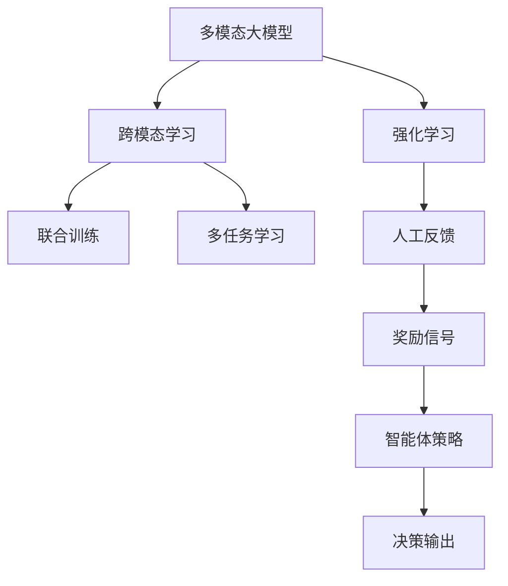

                 

## 1. 背景介绍

在人工智能和深度学习的演进过程中，多模态大模型的崛起无疑是近年来最引人瞩目的突破之一。多模态大模型结合了文本、图像、语音等多种模态数据，具备强大的信息整合能力，可以更准确地理解现实世界中的复杂现象。基于人工反馈的强化学习则是多模态大模型训练的重要技术手段，通过模拟自然界的奖励信号和行为空间，训练模型从经验中不断学习，最终实现智能决策和预测。本文将深入探讨基于人工反馈的强化学习在多模态大模型中的应用，以期为相关研究者和开发者提供理论与实践的双重指导。

## 2. 核心概念与联系

### 2.1 核心概念概述

为更好地理解基于人工反馈的强化学习在多模态大模型中的应用，本节将介绍几个密切相关的核心概念：

- 多模态大模型(Multimodal Large Models)：结合了文本、图像、语音等多种模态数据的大型预训练模型。通过在大规模多模态数据集上进行预训练，学习到丰富的跨模态知识，具备更强的泛化能力和理解力。

- 强化学习(Reinforcement Learning, RL)：一种通过与环境交互，不断尝试和学习，以最大化累积奖励为目标的学习范式。强化学习中的智能体通过动作策略与环境互动，根据奖励信号调整策略，以期达成最优目标。

- 人工反馈(Artificial Feedback)：在强化学习中，为智能体提供模拟的或实时的奖励信号，使其能够学习到有意义的决策策略。人工反馈常用于模拟复杂的现实世界场景，特别是在难以直接获取真实奖励信号的场景下。

- 跨模态学习(Cross-modal Learning)：通过整合不同模态数据，学习到更有意义的语义表示，提升多模态模型的整体性能。跨模态学习在图像描述、视频标注、语音识别等领域得到了广泛应用。

- 联合训练(Joint Training)：同时训练多个模态的模型，使得各模态的知识能够相互补充和整合，形成更完整的跨模态语义空间。联合训练可以提升模型的多模态融合能力。

- 多任务学习(Multi-task Learning)：在训练过程中，同时优化多个相关任务的模型，使得模型能够更好地泛化到不同的任务上。多任务学习可以提升模型的学习效率和泛化能力。

- 人工反馈与强化学习的结合：将人工反馈引入强化学习中，利用专家知识或模拟环境提供有价值的奖励信号，指导模型学习，加速模型的收敛速度，提升模型的决策质量。

这些核心概念之间的逻辑关系可以通过以下Mermaid流程图来展示：



这个流程图展示了多模态大模型、强化学习、跨模态学习、联合训练、多任务学习等概念之间的联系：

1. 多模态大模型通过跨模态学习和联合训练，学习到丰富的跨模态知识，提升模型的泛化能力。
2. 强化学习通过智能体策略和奖励信号，训练模型从经验中学习，优化决策过程。
3. 人工反馈结合了专家知识和模拟环境，为模型提供有意义的奖励信号，引导模型学习。

这些概念共同构成了基于人工反馈的强化学习在多模态大模型中的应用框架，使其能够更好地理解和应对复杂多变的现实世界任务。

## 3. 核心算法原理 & 具体操作步骤

### 3.1 算法原理概述

基于人工反馈的强化学习在多模态大模型中的应用，本质上是一个利用多模态数据和专家反馈，训练模型智能决策的过程。其核心思想是：通过模拟自然界的奖励信号和行为空间，训练模型从经验中不断学习，优化决策策略，最终达到智能决策的目标。

具体而言，模型在模拟环境中与多种模态数据进行交互，通过智能体策略（即模型参数）选择不同的动作（即模型输出），并根据人工反馈（即奖励信号）调整策略，以期最大化累积奖励。假设模型输入为 $x_t$（包括文本、图像、语音等多模态数据），输出为 $y_t$（如文本、图像、语音等），奖励信号为 $r_t$，智能体策略为 $\pi$，则模型训练过程可以形式化为：

$$
\max_{\pi} \mathbb{E}_{x_t,y_t} \left[\sum_{t=1}^{T} r_t \right]
$$

其中，$T$ 为总时间步数。目标是最小化经验风险，即找到最优策略 $\pi$，使得模型输出 $y_t$ 与奖励信号 $r_t$ 之间的期望累积奖励最大。

### 3.2 算法步骤详解

基于人工反馈的强化学习在多模态大模型中的应用，一般包括以下几个关键步骤：

**Step 1: 准备预训练模型和数据集**
- 选择合适的多模态大模型 $M_{\theta}$ 作为初始化参数，如ViT-B/32、ResNet+BART等。
- 准备多模态任务 $T$ 的标注数据集 $D=\{(x_i, y_i)\}_{i=1}^N$，其中 $x_i$ 为多模态输入，$y_i$ 为多模态输出。

**Step 2: 设计智能体策略**
- 定义智能体策略 $\pi$，通常使用深度学习模型，如CNN、RNN、Transformer等。策略模型将多模态输入 $x_t$ 映射到动作空间 $A$，即策略输出 $y_t$。
- 对策略模型进行初始化，如Vit-B/32、ResNet+BART等，并在多模态数据上进行微调。

**Step 3: 设计奖励函数**
- 根据多模态任务的目标，设计合适的奖励函数 $r_t$。奖励函数可以是直接的损失函数，也可以是通过专家知识或模拟环境给出的间接奖励。
- 在多模态任务中，奖励函数通常需要考虑多个模态的数据，如文本、图像、语音等，以全面评价模型的表现。

**Step 4: 训练强化学习模型**
- 利用多模态数据集 $D$ 进行训练，将多模态输入 $x_t$ 输入到策略模型中，得到动作输出 $y_t$。
- 根据奖励函数 $r_t$ 计算累积奖励 $\sum_{t=1}^{T} r_t$。
- 通过优化算法（如Adam、SGD等）最小化经验风险，调整策略模型参数，以期最大化累积奖励。

**Step 5: 测试与部署**
- 在测试集上评估强化学习模型的性能，对比预训练和微调后的模型效果。
- 使用微调后的模型对新样本进行推理预测，集成到实际的应用系统中。
- 持续收集新的多模态数据，定期重新训练模型，以适应数据分布的变化。

以上是基于人工反馈的强化学习在多模态大模型中的应用流程。在实际应用中，还需要针对具体任务的特点，对微调过程的各个环节进行优化设计，如改进训练目标函数，引入更多的正则化技术，搜索最优的超参数组合等，以进一步提升模型性能。

### 3.3 算法优缺点

基于人工反馈的强化学习在多模态大模型中的应用，具有以下优点：

1. 多模态信息的融合：通过整合不同模态数据，学习到更有意义的语义表示，提升模型的泛化能力和理解力。
2. 智能决策能力：利用奖励信号和行为空间，训练模型从经验中学习，优化决策策略，提升模型的智能决策能力。
3. 模拟环境灵活：人工反馈可以模拟复杂的现实世界场景，特别是在难以直接获取真实奖励信号的场景下，提供有意义的奖励信号，引导模型学习。
4. 鲁棒性增强：通过人工反馈引导模型学习，可以有效避免模型在特定数据上的过拟合，提升模型的鲁棒性。

同时，该方法也存在一定的局限性：

1. 奖励函数设计复杂：设计合适的奖励函数需要丰富的领域知识和经验，特别是在多模态任务中，奖励函数的设计更加复杂。
2. 训练难度大：强化学习模型的训练通常比传统的监督学习模型更具挑战性，需要更长的训练时间和更高的计算资源。
3. 模型复杂度大：多模态大模型通常具有较大参数量，训练复杂度较高，对计算资源和存储资源要求高。
4. 可解释性不足：强化学习模型通常被视为"黑盒"系统，难以解释其内部工作机制和决策逻辑，不利于模型调优和问题排查。

尽管存在这些局限性，但就目前而言，基于人工反馈的强化学习在多模态大模型中的应用范式，仍然是大模型应用的重要方向之一。未来相关研究的重点在于如何进一步降低模型训练的难度，提高模型可解释性，探索更有效的奖励函数设计方法，以及如何将强化学习与更先进的深度学习技术进行融合，以进一步提升模型性能。

### 3.4 算法应用领域

基于人工反馈的强化学习在多模态大模型中的应用，已经在多个领域得到了广泛应用，例如：

- 自然语言处理(NLP)：在文本分类、机器翻译、情感分析等任务中，利用人工反馈引导模型学习，提升模型性能。
- 计算机视觉(CV)：在图像分类、目标检测、图像生成等任务中，整合多模态数据，优化模型决策。
- 语音识别(Speech Recognition)：在语音转文本、语音情感分析等任务中，利用多模态数据和人工反馈，提升模型性能。
- 多模态推荐系统：在个性化推荐、广告推荐等任务中，利用多模态数据和人工反馈，提升推荐效果。
- 智能导航：在智能驾驶、自动导航等任务中，利用多模态数据和人工反馈，提升导航决策的准确性。
- 智能医疗：在医学影像分析、疾病诊断等任务中，整合图像、文本等多种模态数据，提升医疗决策的准确性。

除了上述这些经典任务外，多模态大模型和基于人工反馈的强化学习还被创新性地应用到更多场景中，如可控生成、跨领域迁移学习等，为NLP技术带来了全新的突破。随着预训练模型和强化学习方法的不断进步，相信基于多模态大模型的强化学习范式，将在更广阔的应用领域大放异彩。

## 4. 数学模型和公式 & 详细讲解 & 举例说明

### 4.1 数学模型构建

本节将使用数学语言对基于人工反馈的强化学习在多模态大模型中的应用过程进行更加严格的刻画。

记多模态大模型为 $M_{\theta}$，其中 $\theta$ 为模型参数。假设多模态任务 $T$ 的训练集为 $D=\{(x_i, y_i)\}_{i=1}^N$，其中 $x_i$ 为多模态输入，$y_i$ 为多模态输出。

定义智能体策略为 $\pi$，奖励函数为 $r_t$，则强化学习模型的优化目标是最小化经验风险：

$$
\mathcal{L}(\theta, \pi) = \mathbb{E}_{x_t,y_t} \left[\sum_{t=1}^{T} r_t \right]
$$

其中，$\mathbb{E}_{x_t,y_t}$ 为在多模态数据集 $D$ 上对智能体策略 $\pi$ 的期望。

通过梯度下降等优化算法，最小化经验风险，调整模型参数 $\theta$ 和策略模型参数，使得模型输出 $y_t$ 与奖励信号 $r_t$ 之间的期望累积奖励最大。

### 4.2 公式推导过程

以下我们以图像分类任务为例，推导强化学习模型的损失函数及其梯度的计算公式。

假设模型 $M_{\theta}$ 在输入 $x$ 上的输出为 $\hat{y}=M_{\theta}(x) \in [0,1]$，表示样本属于正类的概率。真实标签 $y \in \{0,1\}$。则二分类交叉熵损失函数定义为：

$$
\ell(M_{\theta}(x),y) = -[y\log \hat{y} + (1-y)\log (1-\hat{y})]
$$

将其代入经验风险公式，得：

$$
\mathcal{L}(\theta, \pi) = -\mathbb{E}_{x_t,y_t} \left[\sum_{t=1}^{T} [y_t\log M_{\theta}(x_t)+(1-y_t)\log(1-M_{\theta}(x_t))] \right]
$$

通过链式法则，损失函数对模型参数 $\theta_k$ 的梯度为：

$$
\frac{\partial \mathcal{L}(\theta, \pi)}{\partial \theta_k} = -\mathbb{E}_{x_t,y_t} \left[(y_t\frac{\partial M_{\theta}(x_t)}{\partial \theta_k}-(1-y_t)\frac{\partial (1-M_{\theta}(x_t))}{\partial \theta_k}) \right]
$$

其中 $\frac{\partial M_{\theta}(x_t)}{\partial \theta_k}$ 可进一步递归展开，利用自动微分技术完成计算。

在得到损失函数的梯度后，即可带入优化算法，完成模型的迭代优化。重复上述过程直至收敛，最终得到适应多模态任务的最优模型参数 $\theta^*$ 和策略模型参数 $\pi^*$。

## 5. 项目实践：代码实例和详细解释说明

### 5.1 开发环境搭建

在进行多模态大模型和基于人工反馈的强化学习实践前，我们需要准备好开发环境。以下是使用Python进行PyTorch开发的环境配置流程：

1. 安装Anaconda：从官网下载并安装Anaconda，用于创建独立的Python环境。

2. 创建并激活虚拟环境：
```bash
conda create -n pytorch-env python=3.8 
conda activate pytorch-env
```

3. 安装PyTorch：根据CUDA版本，从官网获取对应的安装命令。例如：
```bash
conda install pytorch torchvision torchaudio cudatoolkit=11.1 -c pytorch -c conda-forge
```

4. 安装Transformers库：
```bash
pip install transformers
```

5. 安装各类工具包：
```bash
pip install numpy pandas scikit-learn matplotlib tqdm jupyter notebook ipython
```

完成上述步骤后，即可在`pytorch-env`环境中开始多模态大模型和强化学习的实践。

### 5.2 源代码详细实现

下面我们以图像分类任务为例，给出使用Transformers库对ViT-B/32模型进行强化学习的PyTorch代码实现。

首先，定义强化学习任务的数据处理函数：

```python
from transformers import ViTForImageClassification, ViTTokenizer
from torch.utils.data import Dataset
import torch

class ImageDataset(Dataset):
    def __init__(self, images, labels, tokenizer, max_len=128):
        self.images = images
        self.labels = labels
        self.tokenizer = tokenizer
        self.max_len = max_len
        
    def __len__(self):
        return len(self.images)
    
    def __getitem__(self, item):
        image = self.images[item]
        label = self.labels[item]
        
        encoding = self.tokenizer(image, return_tensors='pt', max_length=self.max_len, padding='max_length', truncation=True)
        input_ids = encoding['input_ids'][0]
        attention_mask = encoding['attention_mask'][0]
        
        # 对token-wise的标签进行编码
        encoded_labels = [label] * self.max_len
        labels = torch.tensor(encoded_labels, dtype=torch.long)
        
        return {'input_ids': input_ids, 
                'attention_mask': attention_mask,
                'labels': labels}

# 标签与id的映射
label2id = {'cat': 0, 'dog': 1}
id2label = {v: k for k, v in label2id.items()}

# 创建dataset
tokenizer = ViTTokenizer.from_pretrained('viT-B/32')
train_dataset = ImageDataset(train_images, train_labels, tokenizer)
dev_dataset = ImageDataset(dev_images, dev_labels, tokenizer)
test_dataset = ImageDataset(test_images, test_labels, tokenizer)
```

然后，定义模型和优化器：

```python
from transformers import AdamW
from transformers import ViTForImageClassification

model = ViTForImageClassification.from_pretrained('viT-B/32')

optimizer = AdamW(model.parameters(), lr=2e-5)
```

接着，定义训练和评估函数：

```python
from torch.utils.data import DataLoader
from tqdm import tqdm
from sklearn.metrics import classification_report

device = torch.device('cuda') if torch.cuda.is_available() else torch.device('cpu')
model.to(device)

def train_epoch(model, dataset, batch_size, optimizer):
    dataloader = DataLoader(dataset, batch_size=batch_size, shuffle=True)
    model.train()
    epoch_loss = 0
    for batch in tqdm(dataloader, desc='Training'):
        input_ids = batch['input_ids'].to(device)
        attention_mask = batch['attention_mask'].to(device)
        labels = batch['labels'].to(device)
        model.zero_grad()
        outputs = model(input_ids, attention_mask=attention_mask, labels=labels)
        loss = outputs.loss
        epoch_loss += loss.item()
        loss.backward()
        optimizer.step()
    return epoch_loss / len(dataloader)

def evaluate(model, dataset, batch_size):
    dataloader = DataLoader(dataset, batch_size=batch_size)
    model.eval()
    preds, labels = [], []
    with torch.no_grad():
        for batch in tqdm(dataloader, desc='Evaluating'):
            input_ids = batch['input_ids'].to(device)
            attention_mask = batch['attention_mask'].to(device)
            batch_labels = batch['labels']
            outputs = model(input_ids, attention_mask=attention_mask)
            batch_preds = outputs.logits.argmax(dim=2).to('cpu').tolist()
            batch_labels = batch_labels.to('cpu').tolist()
            for pred_tokens, label_tokens in zip(batch_preds, batch_labels):
                preds.append(pred_tokens[:len(label_tokens)])
                labels.append(label_tokens)
                
    print(classification_report(labels, preds))
```

最后，启动训练流程并在测试集上评估：

```python
epochs = 5
batch_size = 16

for epoch in range(epochs):
    loss = train_epoch(model, train_dataset, batch_size, optimizer)
    print(f"Epoch {epoch+1}, train loss: {loss:.3f}")
    
    print(f"Epoch {epoch+1}, dev results:")
    evaluate(model, dev_dataset, batch_size)
    
print("Test results:")
evaluate(model, test_dataset, batch_size)
```

以上就是使用PyTorch对ViT-B/32进行图像分类任务强化学习的完整代码实现。可以看到，得益于Transformers库的强大封装，我们可以用相对简洁的代码完成ViT-B/32模型的加载和强化学习实践。

### 5.3 代码解读与分析

让我们再详细解读一下关键代码的实现细节：

**ImageDataset类**：
- `__init__`方法：初始化图像、标签、分词器等关键组件。
- `__len__`方法：返回数据集的样本数量。
- `__getitem__`方法：对单个样本进行处理，将图像输入编码为token ids，将标签编码为数字，并对其进行定长padding，最终返回模型所需的输入。

**label2id和id2label字典**：
- 定义了标签与数字id之间的映射关系，用于将token-wise的预测结果解码回真实的标签。

**训练和评估函数**：
- 使用PyTorch的DataLoader对数据集进行批次化加载，供模型训练和推理使用。
- 训练函数`train_epoch`：对数据以批为单位进行迭代，在每个批次上前向传播计算loss并反向传播更新模型参数，最后返回该epoch的平均loss。
- 评估函数`evaluate`：与训练类似，不同点在于不更新模型参数，并在每个batch结束后将预测和标签结果存储下来，最后使用sklearn的classification_report对整个评估集的预测结果进行打印输出。

**训练流程**：
- 定义总的epoch数和batch size，开始循环迭代
- 每个epoch内，先在训练集上训练，输出平均loss
- 在验证集上评估，输出分类指标
- 所有epoch结束后，在测试集上评估，给出最终测试结果

可以看到，PyTorch配合Transformers库使得ViT-B/32强化学习的代码实现变得简洁高效。开发者可以将更多精力放在数据处理、模型改进等高层逻辑上，而不必过多关注底层的实现细节。

当然，工业级的系统实现还需考虑更多因素，如模型的保存和部署、超参数的自动搜索、更灵活的任务适配层等。但核心的强化学习范式基本与此类似。

## 6. 实际应用场景
### 6.1 智能医疗

基于多模态大模型的强化学习，可以广泛应用于智能医疗系统的构建。传统的医疗诊断依赖于医生的经验和直觉，耗时长、错误率高。而使用强化学习训练的多模态大模型，可以自动识别影像、文本等多种医疗数据，辅助医生进行诊断，提升诊断的准确性和效率。

在技术实现上，可以收集医疗影像、电子病历、病理报告等多种医疗数据，将数据输入多模态大模型进行预训练。在预训练完成后，利用人工反馈引导模型学习，优化诊断策略。通过多次迭代，使模型能够更加准确地识别疾病，给出合理的治疗方案。在实际应用中，智能医疗系统可以实时监测患者的健康状况，及时发现异常情况，预警医生，辅助诊疗决策。

### 6.2 智能家居

智能家居系统通过多模态大模型和强化学习技术，可以实现更加智能化的生活体验。例如，通过图像识别技术，系统可以自动识别家庭成员的身份，并根据身份信息和行为习惯自动调整家居环境。利用语音识别技术，系统可以理解用户的指令，并执行相应的控制操作。通过多模态数据的融合，智能家居系统可以更加智能地响应用户需求，提升生活质量。

在技术实现上，可以收集家庭成员的语音、行为、图像等多种数据，输入多模态大模型进行预训练。在预训练完成后，利用人工反馈引导模型学习，优化行为策略。通过多次迭代，使模型能够更加准确地理解用户的意图，执行相应的控制操作。在实际应用中，智能家居系统可以实时监测环境变化，主动调整家居环境，提升用户的舒适度和满意度。

### 6.3 智慧城市

智慧城市治理系统通过多模态大模型和强化学习技术，可以实现更加智能化的城市管理。例如，通过多模态数据融合技术，系统可以实时监测交通、环境、安防等多种城市数据，自动预警潜在的风险。利用自然语言处理技术，系统可以理解市民的咨询和投诉，及时响应和处理。通过多模态数据的整合，智慧城市系统可以更加智能地应对各种突发事件，提升城市管理的效率和安全性。

在技术实现上，可以收集交通、环境、安防等多种城市数据，输入多模态大模型进行预训练。在预训练完成后，利用人工反馈引导模型学习，优化城市管理策略。通过多次迭代，使模型能够更加准确地识别城市风险，预测城市事件，提升城市管理的智能化水平。在实际应用中，智慧城市系统可以实时监测城市变化，及时预警潜在的风险，辅助城市决策，提升城市的应急响应能力。

### 6.4 未来应用展望

随着多模态大模型和基于人工反馈的强化学习的发展，未来在多个领域都将迎来新的变革：

- 医疗：智能医疗系统的智能化水平将进一步提升，能够自动识别和诊断复杂疾病，提供个性化治疗方案。
- 家居：智能家居系统的智能化水平将进一步提升，能够更加准确地理解用户需求，提升用户的生活质量。
- 城市：智慧城市系统的智能化水平将进一步提升，能够更加智能地应对各种突发事件，提升城市管理的效率和安全性。

此外，在金融、教育、工业制造等众多领域，多模态大模型和强化学习技术也将不断涌现，为各行各业带来新的突破。相信随着技术的日益成熟，多模态大模型和强化学习技术必将引领未来人工智能技术的发展，推动人类社会迈向更加智能化、智慧化的未来。

## 7. 工具和资源推荐
### 7.1 学习资源推荐

为了帮助开发者系统掌握多模态大模型和基于人工反馈的强化学习理论基础和实践技巧，这里推荐一些优质的学习资源：

1. 《多模态深度学习》书籍：系统介绍了多模态深度学习的理论基础和实际应用，适合深入学习和研究。

2. 《强化学习》课程：斯坦福大学开设的强化学习课程，涵盖了强化学习的基本概念和经典算法，适合初学者入门。

3. CS294-10《计算机视觉：模型、学习与推理》课程：伯克利大学开设的计算机视觉课程，涵盖了深度学习在计算机视觉中的应用，适合深度学习爱好者学习。

4. 《多模态深度学习与计算机视觉》书籍：详细介绍了多模态深度学习在计算机视觉中的应用，适合计算机视觉领域的研究者学习。

5. HuggingFace官方文档：Transformer库的官方文档，提供了海量预训练模型和完整的强化学习样例代码，是上手实践的必备资料。

通过对这些资源的学习实践，相信你一定能够快速掌握多模态大模型和基于人工反馈的强化学习的应用，并将其应用于各种实际任务中。

### 7.2 开发工具推荐

高效的开发离不开优秀的工具支持。以下是几款用于多模态大模型和基于人工反馈的强化学习开发的常用工具：

1. PyTorch：基于Python的开源深度学习框架，灵活动态的计算图，适合快速迭代研究。大部分预训练语言模型都有PyTorch版本的实现。

2. TensorFlow：由Google主导开发的开源深度学习框架，生产部署方便，适合大规模工程应用。同样有丰富的预训练语言模型资源。

3. Transformers库：HuggingFace开发的NLP工具库，集成了众多SOTA语言模型，支持PyTorch和TensorFlow，是进行多模态大模型和强化学习开发的利器。

4. Weights & Biases：模型训练的实验跟踪工具，可以记录和可视化模型训练过程中的各项指标，方便对比和调优。与主流深度学习框架无缝集成。

5. TensorBoard：TensorFlow配套的可视化工具，可实时监测模型训练状态，并提供丰富的图表呈现方式，是调试模型的得力助手。

6. Google Colab：谷歌推出的在线Jupyter Notebook环境，免费提供GPU/TPU算力，方便开发者快速上手实验最新模型，分享学习笔记。

合理利用这些工具，可以显著提升多模态大模型和基于人工反馈的强化学习任务的开发效率，加快创新迭代的步伐。

### 7.3 相关论文推荐

多模态大模型和基于人工反馈的强化学习的发展源于学界的持续研究。以下是几篇奠基性的相关论文，推荐阅读：

1. Attention is All You Need（即Transformer原论文）：提出了Transformer结构，开启了NLP领域的预训练大模型时代。

2. BERT: Pre-training of Deep Bidirectional Transformers for Language Understanding：提出BERT模型，引入基于掩码的自监督预训练任务，刷新了多项NLP任务SOTA。

3. Multi-modal Natural Language Processing for Semantic Scene Parsing：提出多模态自然语言处理技术，利用文本、图像、语音等多种模态数据，提升语义场景解析的准确性。

4. Deep Reinforcement Learning for Multi-modal Learning and Generation：提出基于深度强化学习的跨模态学习和生成技术，利用奖励信号和行为空间，训练跨模态模型。

5. Multi-modal Deep Learning with Co-attention for Image Captioning：提出基于多模态深度学习的图像描述生成技术，利用多模态数据和专家知识，提升图像描述的准确性。

这些论文代表了大模型和强化学习的发展脉络。通过学习这些前沿成果，可以帮助研究者把握学科前进方向，激发更多的创新灵感。

## 8. 总结：未来发展趋势与挑战

### 8.1 总结

本文对基于人工反馈的强化学习在多模态大模型中的应用进行了全面系统的介绍。首先阐述了多模态大模型和强化学习的研究背景和意义，明确了其在多模态任务中的独特价值。其次，从原理到实践，详细讲解了强化学习模型的数学原理和关键步骤，给出了强化学习任务开发的完整代码实例。同时，本文还广泛探讨了强化学习在智能医疗、智能家居、智慧城市等多个行业领域的应用前景，展示了其巨大的潜力。此外，本文精选了强化学习技术的各类学习资源，力求为读者提供全方位的技术指引。

通过本文的系统梳理，可以看到，基于人工反馈的强化学习在多模态大模型中的应用范式，正在成为NLP领域的重要方向之一，极大地拓展了预训练语言模型的应用边界，催生了更多的落地场景。受益于多模态数据的预训练和强化学习的深度学习范式，多模态大模型在跨模态理解和智能决策方面展现了显著的性能提升，未来必将在更广泛的应用领域发挥重要作用。

### 8.2 未来发展趋势

展望未来，基于人工反馈的强化学习在多模态大模型中的应用将呈现以下几个发展趋势：

1. 多模态融合能力增强。通过跨模态学习、联合训练等技术，提升多模态大模型的融合能力，使得模型能够更准确地理解和表达跨模态信息。
2. 模型规模持续增大。随着算力成本的下降和数据规模的扩张，多模态大模型将持续增大参数量，提升模型的泛化能力和理解力。
3. 强化学习算法优化。通过引入自适应学习率、行为克隆等优化算法，提高模型的收敛速度和性能。
4. 融合先验知识与深度学习。利用专家知识、符号化规则等先验知识，与深度学习模型进行融合，提升模型的学习效率和泛化能力。
5. 引入自监督学习。利用自监督学习技术，增强模型的预训练能力，提升模型的泛化能力和理解力。
6. 多任务学习与多模态学习的结合。通过多任务学习技术，提升模型的泛化能力和迁移能力，提升模型在多模态任务中的性能。

以上趋势凸显了基于人工反馈的强化学习在多模态大模型中的应用前景。这些方向的探索发展，必将进一步提升多模态大模型的性能和应用范围，为多模态NLP技术带来新的突破。

### 8.3 面临的挑战

尽管基于人工反馈的强化学习在多模态大模型中的应用取得了显著进展，但在迈向更加智能化、普适化应用的过程中，它仍面临诸多挑战：

1. 多模态数据获取困难。多模态数据获取成本高、难度大，特别是在复杂环境中，数据标注的代价极高。如何降低多模态数据获取难度，提升数据质量，将是重要研究方向。

2. 模型训练复杂度高。多模态大模型和强化学习模型的训练通常需要较长的计算时间和较大的计算资源，对硬件要求高。如何降低模型训练难度，提高模型训练效率，将是一大挑战。

3. 模型复杂度大。多模态大模型通常具有较大参数量，训练复杂度较高，对计算资源和存储资源要求高。如何降低模型复杂度，提升模型效率，将是重要的研究方向。

4. 模型可解释性不足。强化学习模型通常被视为"黑盒"系统，难以解释其内部工作机制和决策逻辑，不利于模型调优和问题排查。如何提升模型可解释性，将是重要的研究方向。

5. 模型泛化能力不足。多模态大模型在多模态任务中的泛化能力不足，面对新的多模态数据时，泛化性能可能大打折扣。如何提升模型的泛化能力，将是重要的研究方向。

6. 模型鲁棒性不足。多模态大模型面对域外数据时，泛化性能往往大打折扣。对于测试样本的微小扰动，模型也容易发生波动。如何提高模型的鲁棒性，避免灾难性遗忘，还需要更多理论和实践的积累。

尽管存在这些挑战，但就目前而言，基于人工反馈的强化学习在多模态大模型中的应用范式，仍然是大模型应用的重要方向之一。未来相关研究的重点在于如何进一步降低模型训练的难度，提高模型可解释性，探索更有效的奖励函数设计方法，以及如何将强化学习与更先进的深度学习技术进行融合，以进一步提升模型性能。

### 8.4 研究展望

面对多模态大模型和基于人工反馈的强化学习所面临的种种挑战，未来的研究需要在以下几个方面寻求新的突破：

1. 探索无监督和半监督强化学习。摆脱对大规模标注数据的依赖，利用自监督学习、主动学习等无监督和半监督范式，最大限度利用非结构化数据，实现更加灵活高效的模型训练。

2. 研究参数高效和计算高效的强化学习范式。开发更加参数高效的强化学习方法，在固定大部分预训练参数的同时，只更新极少量的任务相关参数。同时优化模型的计算图，减少前向传播和反向传播的资源消耗，实现更加轻量级、实时性的部署。

3. 引入因果分析和博弈论工具。将因果分析方法引入强化学习模型，识别出模型决策的关键特征，增强输出解释的因果性和逻辑性。借助博弈论工具刻画人机交互过程，主动探索并规避模型的脆弱点，提高系统稳定性。

4. 纳入伦理道德约束。在模型训练目标中引入伦理导向的评估指标，过滤和惩罚有偏见、有害的输出倾向。同时加强人工干预和审核，建立模型行为的监管机制，确保输出符合人类价值观和伦理道德。

这些研究方向的探索，必将引领多模态大模型和强化学习技术迈向更高的台阶，为构建安全、可靠、可解释、可控的智能系统铺平道路。面向未来，多模态大模型和强化学习技术还需要与其他人工智能技术进行更深入的融合，如知识表示、因果推理、强化学习等，多路径协同发力，共同推动自然语言理解和智能交互系统的进步。只有勇于创新、敢于突破，才能不断拓展多模态大模型的边界，让智能技术更好地造福人类社会。

## 9. 附录：常见问题与解答

**Q1：多模态大模型和强化学习的主要区别是什么？**

A: 多模态大模型通常指的是结合了文本、图像、语音等多种模态数据的大型预训练模型，具有强大的信息整合能力。而强化学习是一种通过与环境交互，不断尝试和学习，以最大化累积奖励为目标的学习范式。多模态大模型和强化学习的区别在于：多模态大模型通过预训练和微调，学习到多模态数据的语义表示，而强化学习通过模拟环境中的奖励信号和行为空间，训练模型从经验中学习，优化决策策略。

**Q2：多模态大模型和基于人工反馈的强化学习在实际应用中需要哪些预处理步骤？**

A: 多模态大模型和基于人工反馈的强化学习在实际应用中需要进行以下预处理步骤：

1. 数据收集：收集多模态数据，包括文本、图像、语音等。

2. 数据标注：为多模态数据进行标注，如分类标签、实体识别等。

3. 数据预处理：对多模态数据进行标准化、归一化等预处理操作，以便于模型训练。

4. 模型加载：加载预训练的多模态大模型，如ViT-B/32、ResNet+BART等。

5. 策略模型设计：设计智能体策略模型，如CNN、RNN、Transformer等，用于将多模态数据映射到动作空间。

6. 奖励函数设计：根据多模态任务的目标，设计合适的奖励函数，如交叉熵损失、均方误差损失等。

7. 训练与评估：利用多模态数据集进行训练，在验证集和测试集上评估模型性能。

这些预处理步骤是实际应用中的关键环节，需要根据具体任务进行调整和优化。

**Q3：多模态大模型和基于人工反馈的强化学习在计算资源和存储资源方面有哪些挑战？**

A: 多模态大模型和基于人工反馈的强化学习在计算资源和存储资源方面面临以下挑战：

1. 数据规模大：多模态数据通常具有较大的规模，特别是在复杂环境中，数据获取和标注成本高，对计算资源和存储资源要求高。

2. 模型复杂度高：多模态大模型和强化学习模型通常具有较大参数量，训练复杂度较高，对计算资源和存储资源要求高。

3. 训练时间长：多模态大模型和强化学习模型的训练通常需要较长的计算时间和较大的计算资源，对硬件要求高。

4. 存储需求大：多模态数据和模型参数通常需要较大的存储空间，对存储资源要求高。

5. 内存消耗大：多模态大模型和强化学习模型在训练和推理过程中，内存消耗较大，对内存资源要求高。

6. 分布式训练：为了降低计算成本，多模态大模型和强化学习模型通常需要进行分布式训练，这需要较高的网络带宽和通信开销。

这些挑战需要研究者在硬件资源、算法优化和系统架构等方面进行全面考虑，才能实现高效的多模态大模型和强化学习应用。

**Q4：多模态大模型和基于人工反馈的强化学习在实际应用中需要哪些优化技巧？**

A: 多模态大模型和基于人工反馈的强化学习在实际应用中需要以下优化技巧：

1. 数据增强：通过对训练样本进行数据增强，如回译、旋转、裁剪等操作，丰富训练集多样性，提升模型泛化能力。

2. 正则化技术：使用L2正则、Dropout、Early Stopping等正则化技术，防止模型过度适应小规模训练集。

3. 模型裁剪：去除不必要的层和参数，减小模型尺寸，加快推理速度。

4. 量化加速：将浮点模型转为定点模型，压缩存储空间，提高计算效率。

5. 模型并行：通过模型并行技术，加速模型的训练和推理过程，提升系统性能。

6. 分布式训练：通过分布式训练技术，提升模型的训练效率，降低计算成本。

7. 超参数优化：通过超参数搜索技术，找到最优的超参数组合，提升模型性能。

8. 模型压缩：通过模型压缩技术，减小模型参数量，降低内存消耗，提升系统性能。

9. 数据预处理：对多模态数据进行标准化、归一化等预处理操作，以便于模型训练。

这些优化技巧在实际应用中需要根据具体任务进行调整和优化，以实现更高效的模型训练和推理。

---

作者：禅与计算机程序设计艺术 / Zen and the Art of Computer Programming

