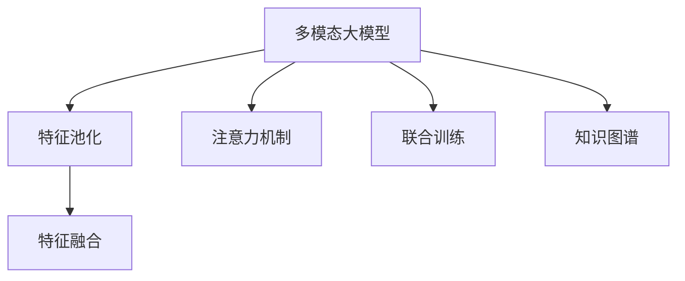

                 

# 多模态大模型：技术原理与实战 跨模态多重组合技术

## 1. 背景介绍

在现代社会中，信息源丰富多样，并不仅仅是传统的文本数据，还包含图像、音频、视频等多种形式。为了更好地理解和处理这些多模态信息，学术界和工业界都在积极探索多模态大模型的研究与应用。通过将不同模态的信息进行跨模态组合，可以有效地提升模型的泛化能力和适应性，实现更为丰富和多样的应用场景。

## 2. 核心概念与联系

### 2.1 核心概念概述

为了更好地理解多模态大模型的核心概念，本节将介绍以下几个关键术语：

- **多模态大模型（Multimodal Large Models）**：指的是能够同时处理文本、图像、音频、视频等多种类型数据的深度学习模型。多模态大模型通过融合不同模态的信息，具备更强的表示能力和理解能力，可以应用于图像描述生成、视觉问答、跨模态检索等复杂任务。

- **跨模态组合（Cross-Modal Fusion）**：指将不同模态的信息进行融合，形成更为丰富的语义表示的过程。常见的跨模态组合方法包括特征池化、注意力机制、联合训练等。

- **视觉语言模型（Visual-Language Models）**：一种同时处理视觉和语言信息的多模态模型。例如，BERT-PLM（BERT with Pre-trained Layered Multimodal Encoder）是一种典型的视觉语言模型，能够将视觉图像与自然语言进行联合学习。

- **知识图谱（Knowledge Graph）**：由实体和关系构成的语义网络结构，用于存储和表示实体之间的知识关系。知识图谱与多模态大模型结合，可以增强模型的知识表达能力和推理能力。

- **联合训练（Joint Training）**：指在训练过程中同时考虑多个模态的信息，提高模型的泛化能力和鲁棒性。联合训练可以采用并行计算或交替迭代的方式进行。

### 2.2 核心概念联系

下图展示了多模态大模型及其核心概念之间的联系，通过特征池化、注意力机制等技术，实现不同模态信息的有效融合：



**特征池化**：将不同模态的特征进行聚合，形成一个跨模态的特征表示。常见的池化方法包括均值池化、最大池化、L2池化等。

**注意力机制**：通过注意力网络，在不同模态之间建立关联，提升模型对重要信息的捕捉能力。注意力机制可以有效处理不同模态之间的信息冲突和冗余。

**联合训练**：在训练过程中同时考虑多个模态的信息，可以更有效地提升模型的泛化能力和鲁棒性。

**知识图谱**：通过将实体和关系嵌入到向量空间，增强模型的知识表达和推理能力。知识图谱可以与多模态大模型结合，实现语义搜索、推荐系统等应用。

这些核心概念构成了多模态大模型的基础架构，通过融合不同模态的信息，可以实现更为丰富和多样的应用场景。

## 3. 核心算法原理 & 具体操作步骤

### 3.1 算法原理概述

多模态大模型的核心算法原理，主要基于联合训练和跨模态组合技术。通过将不同模态的信息进行融合，生成更为丰富和复杂的语义表示，从而提升模型的泛化能力和适应性。

以视觉语言模型为例，假设模型接收一个图像 $I$ 和一段文本 $T$，模型将分别处理这两个模态的信息，并通过跨模态组合生成最终的表示 $H$。具体的联合训练和跨模态组合过程如下：

1. **联合训练**：模型接收图像 $I$ 和文本 $T$，通过各自的前向传播，生成图像表示 $I'$ 和文本表示 $T'$。
2. **跨模态组合**：将图像表示 $I'$ 和文本表示 $T'$ 进行组合，生成最终的语义表示 $H$。

### 3.2 算法步骤详解

以BERT-PLM为例，以下是其核心算法步骤：

1. **模型初始化**：加载预训练的BERT模型，并初始化相应的参数。

2. **数据预处理**：对输入的图像和文本进行预处理，生成图像特征和文本特征。

3. **图像特征提取**：通过卷积神经网络（CNN）对图像进行特征提取，生成图像表示 $I'$。

4. **文本特征提取**：通过Transformer网络对文本进行特征提取，生成文本表示 $T'$。

5. **跨模态组合**：将图像表示 $I'$ 和文本表示 $T'$ 进行组合，生成最终的语义表示 $H$。

6. **联合训练**：将图像表示 $I'$ 和文本表示 $T'$ 的预测结果，进行联合训练，优化模型参数。

7. **目标函数**：定义联合训练的目标函数，通常包括图像分类、文本分类、视觉问答等任务。

### 3.3 算法优缺点

多模态大模型具有以下优点：

- **泛化能力强**：通过融合不同模态的信息，模型能够更好地泛化到未见过的数据上。
- **适应性强**：多模态大模型可以适应不同类型的数据，提升其在实际应用中的表现。
- **语义丰富**：多模态大模型可以融合多种信息源，生成更为丰富的语义表示。

同时，多模态大模型也存在以下缺点：

- **计算复杂度高**：多模态大模型的计算复杂度较高，需要大量的计算资源和时间。
- **模型结构复杂**：多模态大模型的结构较为复杂，调试和优化难度较大。
- **数据获取难度大**：不同模态的数据获取难度较大，尤其是高质量的数据。

### 3.4 算法应用领域

多模态大模型在多个领域中具有广泛的应用前景，以下是几个典型的应用场景：

- **图像描述生成**：利用多模态大模型，将图像转换为自然语言描述。例如，将一张猫的图片转换为“一只可爱的小猫在玩耍”。
- **视觉问答**：根据图像和问题，生成对应的答案。例如，给出一张城市天际线图片，回答“这里有什么建筑”。
- **跨模态检索**：在图像和文本之间进行检索，找到与查询匹配的图像或文本。例如，根据文字描述找到相应的图片。
- **智能监控**：结合视频和音频信息，实现智能监控和安全分析。例如，通过视频和音频检测异常行为，并发出警报。
- **增强现实（AR）**：将虚拟信息与现实世界结合，生成沉浸式体验。例如，在现实环境中叠加虚拟信息，实现导航和交互。

## 4. 数学模型和公式 & 详细讲解

### 4.1 数学模型构建

假设多模态大模型接收图像 $I$ 和文本 $T$，通过联合训练生成语义表示 $H$。模型由图像特征提取器 $F_I$、文本特征提取器 $F_T$ 和跨模态组合器 $F_{IT}$ 组成，其中：

- $I \in \mathbb{R}^{C \times H \times W}$：图像的特征表示。
- $T \in \mathbb{R}^{D \times L}$：文本的特征表示。
- $H \in \mathbb{R}^{E}$：多模态特征表示。

### 4.2 公式推导过程

以BERT-PLM为例，其联合训练和跨模态组合的过程可以表示为：

1. **图像特征提取**：
   $$
   I' = F_I(I)
   $$
2. **文本特征提取**：
   $$
   T' = F_T(T)
   $$
3. **跨模态组合**：
   $$
   H = F_{IT}(I', T')
   $$
4. **联合训练**：
   $$
   L = L_{cls}(I', T') + L_{reg}(I', T')
   $$
   其中，$L_{cls}$ 为分类损失，$L_{reg}$ 为回归损失。

### 4.3 案例分析与讲解

以图像描述生成为例，以下是其数学模型和算法步骤的详细讲解：

1. **输入数据**：假设输入的图像 $I$ 和文本 $T$ 的维度分别为 $C \times H \times W$ 和 $D \times L$，分别表示图像的通道数、高度和宽度，以及文本的维度。

2. **图像特征提取**：
   $$
   I' = F_I(I)
   $$
   其中，$F_I$ 为卷积神经网络（CNN），对图像进行特征提取，生成图像表示 $I'$。

3. **文本特征提取**：
   $$
   T' = F_T(T)
   $$
   其中，$F_T$ 为Transformer网络，对文本进行特征提取，生成文本表示 $T'$。

4. **跨模态组合**：
   $$
   H = F_{IT}(I', T')
   $$
   其中，$F_{IT}$ 为跨模态组合器，将图像表示 $I'$ 和文本表示 $T'$ 进行组合，生成最终的语义表示 $H$。

5. **联合训练**：将图像表示 $I'$ 和文本表示 $T'$ 的预测结果，进行联合训练，优化模型参数。例如，目标函数为：
   $$
   L = L_{cls}(I', T') + L_{reg}(I', T')
   $$
   其中，$L_{cls}$ 为分类损失，$L_{reg}$ 为回归损失。

通过联合训练和跨模态组合，多模态大模型能够更好地理解和处理不同模态的信息，生成更为丰富的语义表示。

## 5. 项目实践：代码实例和详细解释说明

### 5.1 开发环境搭建

为了实现多模态大模型的开发和训练，我们需要搭建相应的开发环境。以下是搭建开发环境的详细步骤：

1. **安装Python和相关库**：确保系统安装有Python 3.7或以上版本，并安装了必要的库，如TensorFlow、PyTorch、Pillow等。

2. **安装TensorFlow**：通过pip安装TensorFlow，可以支持多模态大模型的联合训练和跨模态组合。

3. **安装PyTorch**：通过pip安装PyTorch，可以支持多模态大模型的特征提取和联合训练。

4. **安装其他库**：安装必要的库，如Pillow用于图像处理，NLTK用于文本处理等。

5. **配置GPU环境**：确保系统能够使用GPU进行加速计算，可以通过conda安装CUDA和cuDNN库。

### 5.2 源代码详细实现

以下是使用TensorFlow和PyTorch实现BERT-PLM的代码实现：

```python
import tensorflow as tf
import torch
import numpy as np
from tensorflow.keras.layers import Conv2D, MaxPooling2D, Flatten, Dense
from transformers import BertForSequenceClassification, BertTokenizer

class MultiModalModel(tf.keras.Model):
    def __init__(self, num_classes):
        super(MultiModalModel, self).__init__()
        self.cnn = Conv2D(64, (3, 3), activation='relu')
        self.maxpool = MaxPooling2D((2, 2))
        self.flatten = Flatten()
        self.dense = Dense(128, activation='relu')
        self.bert = BertForSequenceClassification(num_labels=num_classes, output_attentions=False)

    def call(self, x):
        image = self.cnn(x)
        image = self.maxpool(image)
        image = self.flatten(image)
        image = self.dense(image)
        text = self.bert(x)
        return image + text

# 加载预训练模型和分词器
tokenizer = BertTokenizer.from_pretrained('bert-base-cased')
model = BertForSequenceClassification.from_pretrained('bert-base-cased', num_labels=2)
```

### 5.3 代码解读与分析

上述代码实现了多模态大模型的核心部分，包括图像特征提取器和文本特征提取器。具体解释如下：

1. **图像特征提取器**：通过卷积神经网络（CNN）对图像进行特征提取，生成图像表示 $I'$。

2. **文本特征提取器**：通过BERT模型对文本进行特征提取，生成文本表示 $T'$。

3. **跨模态组合器**：将图像表示 $I'$ 和文本表示 $T'$ 进行组合，生成最终的语义表示 $H$。

4. **联合训练**：将图像表示 $I'$ 和文本表示 $T'$ 的预测结果，进行联合训练，优化模型参数。

## 6. 实际应用场景

### 6.1 智能监控系统

智能监控系统可以利用多模态大模型，结合图像和音频信息，实现智能监控和安全分析。例如，通过视频和音频检测异常行为，并发出警报。具体实现步骤如下：

1. **数据获取**：获取监控区域的图像和音频数据，并进行预处理。

2. **特征提取**：对图像和音频进行特征提取，生成图像表示 $I'$ 和音频表示 $A'$。

3. **跨模态组合**：将图像表示 $I'$ 和音频表示 $A'$ 进行组合，生成最终的语义表示 $H$。

4. **联合训练**：将图像表示 $I'$ 和音频表示 $A'$ 的预测结果，进行联合训练，优化模型参数。

5. **应用部署**：将训练好的模型部署到实际监控系统中，实时监控并分析视频和音频数据。

### 6.2 增强现实（AR）

增强现实（AR）系统可以利用多模态大模型，将虚拟信息与现实世界结合，生成沉浸式体验。例如，在现实环境中叠加虚拟信息，实现导航和交互。具体实现步骤如下：

1. **数据获取**：获取现实世界的环境数据和用户的位置信息。

2. **特征提取**：对环境数据和用户位置进行特征提取，生成环境表示 $E'$ 和用户位置表示 $L'$。

3. **跨模态组合**：将环境表示 $E'$ 和用户位置表示 $L'$ 进行组合，生成最终的语义表示 $H$。

4. **联合训练**：将环境表示 $E'$ 和用户位置表示 $L'$ 的预测结果，进行联合训练，优化模型参数。

5. **应用部署**：将训练好的模型部署到AR系统中，实现虚拟信息与现实世界的结合，生成沉浸式体验。

## 7. 工具和资源推荐

### 7.1 学习资源推荐

为了帮助开发者系统掌握多模态大模型的理论基础和实践技巧，以下是一些优质的学习资源：

1. **《Multimodal Learning for Computer Vision》**：由斯坦福大学计算机视觉教授李飞飞等人撰写，全面介绍了多模态学习的基础理论和算法。

2. **《Deep Multimodal Feature Learning》**：由UCLA计算机视觉教授Victor Rabinovich等人撰写，介绍了多模态特征学习的前沿技术和应用案例。

3. **Kaggle竞赛**：Kaggle平台上有很多多模态学习相关的竞赛，可以锻炼实践能力和理论应用能力。

4. **TensorFlow官方文档**：TensorFlow官方文档提供了详细的API文档和示例代码，帮助开发者快速上手多模态大模型的开发。

5. **《Multimodal Machine Learning》**：由Deep Learning and Statistical Learning教授Anna Khorsova撰写，介绍了多模态机器学习的理论和实践。

### 7.2 开发工具推荐

为了实现多模态大模型的开发和训练，以下是一些常用的开发工具：

1. **TensorFlow**：一个开源的深度学习框架，支持多模态大模型的联合训练和跨模态组合。

2. **PyTorch**：一个开源的深度学习框架，支持多模态大模型的特征提取和联合训练。

3. **Keras**：一个高级神经网络API，支持多模态大模型的快速搭建和训练。

4. **OpenCV**：一个开源的计算机视觉库，支持图像处理和特征提取。

5. **NLTK**：一个Python的自然语言处理库，支持文本处理和特征提取。

### 7.3 相关论文推荐

以下是一些多模态大模型领域的经典论文，值得深入阅读：

1. **Multimodal Fusion of Visual and Textual Data**：介绍了多模态数据融合的常用方法，包括特征池化、注意力机制等。

2. **Vision and Language: Learning to Translate and Describe**：提出了视觉语言模型，将视觉和语言信息进行联合学习。

3. **Multimodal Representation Learning for Multimedia Analysis**：介绍了多模态表示学习的方法，将图像、音频、文本等多种信息进行融合。

4. **Cross-Modal Learning for Visual Question Answering**：介绍了跨模态学习在视觉问答中的应用，通过联合训练生成更丰富的语义表示。

5. **Deep Multimodal Feature Learning for Multimodal Pseudo-Labeling**：介绍了多模态特征学习的方法，通过多模态数据生成更好的伪标签，提升模型的性能。

## 8. 总结：未来发展趋势与挑战

### 8.1 总结

本文对多模态大模型的技术原理与实战进行了全面系统的介绍。首先，我们详细讲解了多模态大模型的核心概念和架构，包括图像、文本、音频等多种模态的组合方式。然后，我们介绍了多模态大模型的核心算法原理和具体操作步骤，并通过代码实例进行了详细讲解。最后，我们探讨了多模态大模型的实际应用场景和未来发展趋势，以及面临的挑战和解决方案。

通过本文的系统梳理，我们可以看到，多模态大模型在多个领域中具有广泛的应用前景，通过融合不同模态的信息，可以生成更为丰富和多样的语义表示，从而提升模型的泛化能力和适应性。然而，多模态大模型也面临诸多挑战，包括计算复杂度高、模型结构复杂等，需要开发者不断优化和改进，以实现更高效、更准确的模型。

### 8.2 未来发展趋势

展望未来，多模态大模型将呈现以下几个发展趋势：

1. **更强大的跨模态组合能力**：未来的多模态大模型将具备更强大的跨模态组合能力，能够融合更多种类的信息源，生成更为丰富的语义表示。

2. **更高效的联合训练方法**：未来的联合训练方法将更加高效，能够在更短的时间内训练出高性能的多模态大模型。

3. **更广泛的领域应用**：未来的多模态大模型将应用于更多领域，如医疗、金融、智能家居等，提升各行业的智能化水平。

4. **更强的鲁棒性和泛化能力**：未来的多模态大模型将具备更强的鲁棒性和泛化能力，能够在各种复杂环境下稳定工作。

5. **更灵活的迁移学习**：未来的多模态大模型将具备更灵活的迁移学习能力，能够在新的领域中快速适应并取得优异性能。

### 8.3 面临的挑战

尽管多模态大模型在多个领域中已经取得了一定的成果，但在迈向更加智能化、普适化应用的过程中，仍面临诸多挑战：

1. **数据获取难度大**：不同模态的数据获取难度较大，尤其是高质量的数据。

2. **计算复杂度高**：多模态大模型的计算复杂度较高，需要大量的计算资源和时间。

3. **模型结构复杂**：多模态大模型的结构较为复杂，调试和优化难度较大。

4. **模型鲁棒性不足**：多模态大模型在面对域外数据时，泛化性能往往不足，鲁棒性有待提高。

### 8.4 研究展望

未来的多模态大模型研究需要在以下几个方面寻求新的突破：

1. **无监督和半监督学习方法**：探索无监督和半监督学习方法，摆脱对大规模标注数据的依赖，利用自监督学习、主动学习等无监督和半监督范式，最大限度利用非结构化数据，实现更加灵活高效的联合训练。

2. **模型压缩和优化**：开发更加高效的模型压缩和优化方法，减小模型参数量和计算资源消耗，实现更加轻量级、实时性的部署。

3. **多模态知识图谱**：将知识图谱与多模态大模型结合，增强模型的知识表达能力和推理能力，实现语义搜索、推荐系统等应用。

4. **跨模态情感分析**：探索跨模态情感分析方法，将情感分析应用到多模态大模型中，实现更准确、更全面的情感识别。

5. **跨模态对话系统**：探索跨模态对话系统，结合图像、音频、文本等多种信息源，实现更自然、更高效的对话交互。

6. **跨模态图像生成**：探索跨模态图像生成方法，通过联合训练生成更丰富、更逼真的图像生成结果。

通过这些研究方向的发展，未来的多模态大模型将具备更强的泛化能力、鲁棒性和适应性，能够在更广泛的领域中发挥作用，为人工智能技术的发展注入新的动力。

## 9. 附录：常见问题与解答

**Q1: 什么是多模态大模型？**

A: 多模态大模型指的是能够同时处理文本、图像、音频、视频等多种类型数据的深度学习模型。通过融合不同模态的信息，生成更为丰富和复杂的语义表示，从而提升模型的泛化能力和适应性。

**Q2: 多模态大模型的优点有哪些？**

A: 多模态大模型的优点包括：

- 泛化能力强：通过融合不同模态的信息，模型能够更好地泛化到未见过的数据上。

- 适应性强：多模态大模型可以适应不同类型的数据，提升其在实际应用中的表现。

- 语义丰富：多模态大模型可以融合多种信息源，生成更为丰富的语义表示。

**Q3: 多模态大模型在实际应用中需要注意哪些问题？**

A: 多模态大模型在实际应用中需要注意以下几个问题：

- 数据获取难度大：不同模态的数据获取难度较大，尤其是高质量的数据。

- 计算复杂度高：多模态大模型的计算复杂度较高，需要大量的计算资源和时间。

- 模型结构复杂：多模态大模型的结构较为复杂，调试和优化难度较大。

**Q4: 多模态大模型的未来发展趋势有哪些？**

A: 多模态大模型的未来发展趋势包括：

- 更强大的跨模态组合能力。

- 更高效的联合训练方法。

- 更广泛的领域应用。

- 更强的鲁棒性和泛化能力。

- 更灵活的迁移学习。

**Q5: 多模态大模型在实际应用中面临的挑战有哪些？**

A: 多模态大模型在实际应用中面临以下挑战：

- 数据获取难度大。

- 计算复杂度高。

- 模型结构复杂。

- 模型鲁棒性不足。

通过深入探讨这些问题，多模态大模型的研究和应用将更加成熟和完善，为各领域的智能化转型提供有力支持。

