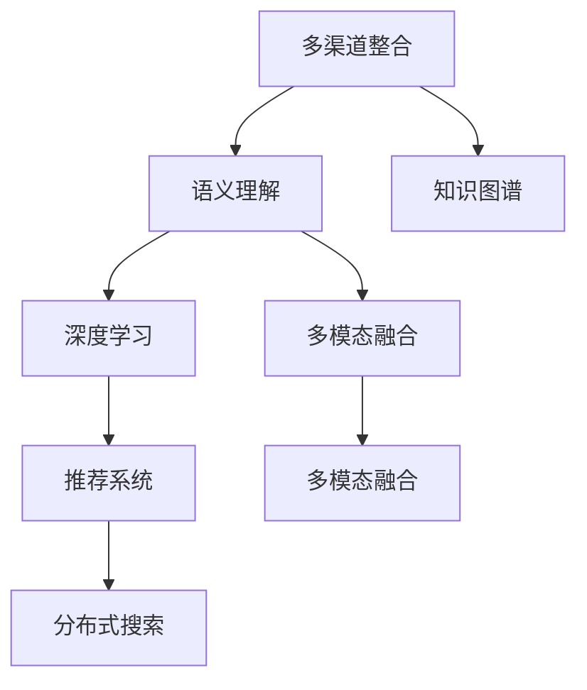
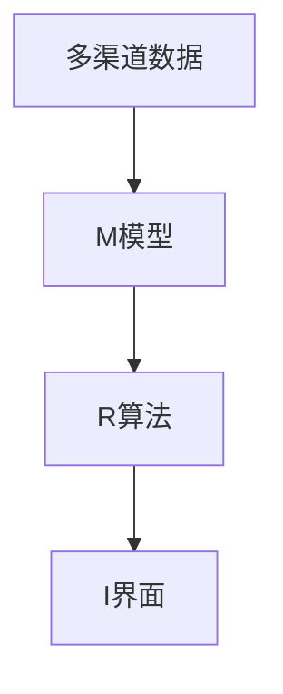

                 

# 多渠道整合：AI提升搜索结果

## 1. 背景介绍

### 1.1 问题由来

在信息时代，互联网已经成为人们获取知识、了解世界的主要渠道。然而，信息过载和质量参差不齐，使得搜索结果筛选和高效获取变得异常困难。搜索引擎成为解决这一问题的核心工具，但传统的基于关键词匹配的搜索方式，只能获取部分相关信息，难以满足用户的多样化需求。

用户越来越倾向于使用多渠道获取信息，不仅依赖于文字搜索，还会使用图片搜索、语音搜索、视频搜索等多种方式。各渠道的内容格式、展示方式各异，如何有效整合不同渠道的搜索结果，为用户提供统一、多样化的信息，成为当前搜索引擎的重大挑战。

### 1.2 问题核心关键点

当前搜索技术主要依赖于搜索算法和数据索引，对于多渠道信息的整合涉及以下核心问题：

1. **数据采集与处理**：如何将不同渠道的数据进行整合，去除重复和噪音，得到纯净的文本、图片、语音等数据。
2. **语义理解与分析**：如何理解不同数据格式背后的语义，将多渠道信息进行有效融合，提高搜索结果的准确性和相关性。
3. **搜索结果呈现**：如何将多渠道的信息以统一的形式呈现给用户，提升搜索体验和效率。
4. **个性化与定制化**：如何根据用户的偏好和行为，动态调整搜索结果，提供个性化服务。
5. **跨平台协同**：如何使不同平台的搜索服务实现互联互通，提升用户体验和资源利用率。

### 1.3 问题研究意义

研究多渠道整合的搜索技术，对于提升搜索引擎的智能化水平，降低用户搜索成本，优化用户体验，具有重要意义：

1. **提升搜索结果质量**：通过整合不同渠道的信息，提升搜索结果的相关性和准确性，使用户更快获取所需信息。
2. **优化搜索体验**：支持多格式、多渠道的搜索，让用户能够通过最便捷的方式获取信息。
3. **个性化服务**：通过分析用户行为，提供定制化的搜索结果，提升用户满意度。
4. **跨平台互联**：实现不同平台搜索服务的互操作性，增强信息共享和资源利用。
5. **技术创新**：推动搜索技术的前沿研究，为其他多渠道整合应用提供借鉴。

## 2. 核心概念与联系

### 2.1 核心概念概述

为更好地理解多渠道整合的搜索技术，本节将介绍几个密切相关的核心概念：

1. **多渠道整合**：指将文本、图片、语音、视频等不同格式的数据，通过统一的界面和算法进行融合，提供一体化的搜索体验。
2. **语义理解**：指通过自然语言处理技术，理解文本背后的语义，进行知识抽取、实体识别等处理。
3. **知识图谱**：通过结构化的方式，表示实体、关系和属性，辅助语义理解和推理。
4. **深度学习**：利用深度神经网络，从大规模数据中学习复杂的非线性映射关系，提升模型的表达能力和泛化能力。
5. **多模态融合**：将不同模态的信息（如文本、图像、语音等）融合到一个统一的知识表示中，形成多模态的知识表示。
6. **推荐系统**：通过分析用户行为和偏好，推荐个性化的搜索结果。
7. **分布式搜索**：通过分布式计算，提高搜索效率和扩展性。

这些核心概念之间的逻辑关系可以通过以下Mermaid流程图来展示：



这个流程图展示了大语言模型的核心概念及其之间的关系：

1. 多渠道整合和语义理解是基础，需要通过NLP技术对不同格式的数据进行理解和处理。
2. 知识图谱和深度学习是核心，通过结构化知识和多模态融合，提升语义理解的深度和广度。
3. 推荐系统和分布式搜索是手段，通过个性化推荐和分布式计算，提升搜索效率和用户体验。

这些概念共同构成了多渠道整合搜索技术的基础，使其能够全面覆盖文本、图片、语音、视频等多种信息，提升搜索效果和用户体验。

## 3. 核心算法原理 & 具体操作步骤

### 3.1 算法原理概述

多渠道整合的搜索技术，本质上是将不同格式的数据进行语义理解、多模态融合、推荐展示的过程。其核心思想是通过深度学习模型，将多渠道的信息进行统一表示，再通过推荐系统，动态调整搜索结果的顺序和形式，提升用户的搜索体验。

形式化地，假设多渠道的搜索结果集为 $D=\{d_i\}_{i=1}^N$，其中 $d_i$ 可以表示为文本、图片、语音等不同格式的数据。定义用户行为和查询信息为 $Q=\{q_j\}_{j=1}^M$。

多渠道整合的搜索任务可以描述为：

$$
\max_{D,Q} \sum_{i=1}^N \sum_{j=1}^M \text{relevance}(D_i, q_j)
$$

其中 $\text{relevance}(D_i, q_j)$ 表示结果 $D_i$ 与查询 $q_j$ 的相关性评分。

### 3.2 算法步骤详解

多渠道整合的搜索技术一般包括以下几个关键步骤：

**Step 1: 数据采集与处理**
- 收集不同渠道的搜索结果，如文本、图片、语音等，进行格式转换和标准化处理。
- 去除重复和噪音数据，保留有价值的信息。
- 对数据进行标注，包括实体识别、关系抽取、情感分析等。

**Step 2: 语义理解与分析**
- 使用自然语言处理技术，对文本数据进行分词、词性标注、命名实体识别等处理。
- 利用深度学习模型，如BERT、GPT等，提取文本的语义表示。
- 对不同格式的数据进行语义融合，使用跨模态融合算法，如注意力机制、多模态编码器等，将不同模态的信息映射到一个统一的知识表示中。

**Step 3: 知识图谱构建与推理**
- 使用结构化的方式，构建知识图谱，表示实体、关系和属性。
- 将语义理解的结果与知识图谱进行关联，进行实体识别、关系抽取等推理操作。
- 使用图神经网络等方法，进行知识图谱的嵌入表示，便于后续的推理和计算。

**Step 4: 个性化推荐与展示**
- 根据用户的历史行为和偏好，使用推荐算法生成个性化搜索结果。
- 使用交互式界面，展示搜索结果，支持多格式、多渠道的展示方式。
- 提供搜索优化建议，提升用户搜索效率和满意度。

**Step 5: 分布式搜索与优化**
- 采用分布式计算框架，如Apache Kafka、Apache Spark等，进行大规模数据处理和计算。
- 使用索引技术，如倒排索引、分布式哈希表等，优化搜索结果的检索效率。
- 通过负载均衡、数据分片等技术，提高搜索系统的扩展性和可用性。

### 3.3 算法优缺点

多渠道整合的搜索技术具有以下优点：
1. 提升搜索结果的相关性和准确性。通过语义理解和跨模态融合，能够更全面地理解不同渠道的信息，提供更精准的搜索结果。
2. 优化搜索体验。支持多格式、多渠道的搜索，让用户能够通过最便捷的方式获取信息。
3. 个性化服务。通过分析用户行为，提供定制化的搜索结果，提升用户满意度。
4. 跨平台互联。实现不同平台搜索服务的互操作性，增强信息共享和资源利用。

同时，该方法也存在一定的局限性：
1. 数据采集与处理复杂。需要处理不同格式的数据，去除噪音和重复数据，需要大量的标注和处理工作。
2. 语义理解难度大。不同格式的数据有不同的语义表示，需要设计复杂的算法进行融合。
3. 知识图谱构建复杂。需要设计复杂的图结构和关系表示，构建的知识图谱可能存在冗余和不一致。
4. 推荐系统需要大量数据。需要用户行为数据进行个性化推荐，数据量不足可能影响效果。
5. 分布式计算复杂。需要设计高效的分布式算法，实现大规模数据处理和计算。

尽管存在这些局限性，但就目前而言，多渠道整合搜索技术仍是最主流的多样化信息检索手段。未来相关研究的重点在于如何进一步降低数据采集与处理的成本，提升语义理解的效果，提高知识图谱的构建效率，以及优化分布式搜索的算法和架构。

### 3.4 算法应用领域

多渠道整合搜索技术已经在诸多领域得到广泛应用，例如：

- **电子商务**：通过整合不同渠道的销售信息，提供多渠道的购物体验，提升用户体验和转化率。
- **社交媒体**：支持图片、视频、语音等多种内容的搜索，丰富用户的互动体验。
- **医疗健康**：整合医疗资源和患者信息，提供精准的诊疗建议和医疗服务。
- **旅游出行**：整合旅游资源和用户评论，提供个性化的旅游建议和服务。
- **智能家居**：整合设备传感器数据和用户行为数据，提供智能化的家居控制和场景推荐。

除了上述这些经典领域外，多渠道整合搜索技术还在更多场景中得到应用，如智慧城市、智能制造、教育培训等，为各行业带来了新的技术突破。随着技术不断进步，相信多渠道整合搜索技术将在更广阔的应用领域大放异彩。

## 4. 数学模型和公式 & 详细讲解 & 举例说明

### 4.1 数学模型构建

本节将使用数学语言对多渠道整合搜索的过程进行更加严格的刻画。

记多渠道搜索结果集为 $D=\{d_i\}_{i=1}^N$，其中 $d_i$ 可以表示为文本、图片、语音等不同格式的数据。定义用户查询信息为 $Q=\{q_j\}_{j=1}^M$。

定义用户行为与查询信息之间的关系为 $f$，即 $q_j \rightarrow f \rightarrow r_j$，其中 $r_j$ 表示查询 $q_j$ 的相关性评分。

多渠道整合的搜索任务可以描述为：

$$
\max_{D,Q} \sum_{i=1}^N \sum_{j=1}^M r_j
$$

在实际应用中，我们可以使用深度学习模型 $M$ 进行语义理解和特征提取，使用推荐算法 $R$ 进行个性化推荐，使用交互界面 $I$ 进行结果展示，其整体流程如图：



### 4.2 公式推导过程

以下我们以文本搜索结果为例，推导推荐算法的评分计算公式。

假设用户查询 $q$ 与文本 $d$ 的相关性评分 $r$ 由以下公式计算：

$$
r(q, d) = \text{score}(\text{embed}(q), \text{embed}(d))
$$

其中 $\text{embed}(q)$ 表示查询 $q$ 的语义嵌入表示，$\text{embed}(d)$ 表示文本 $d$ 的语义嵌入表示。$\text{score}$ 函数表示两个向量之间的相似度评分，如余弦相似度、点积相似度等。

根据上述公式，推荐算法 $R$ 的评分计算公式为：

$$
\text{score}(R) = \sum_{i=1}^N r(q_i, d_i)
$$

将上述公式带入总体目标函数，得：

$$
\max_{D,Q} \text{score}(R)
$$

在实际应用中，我们通常使用矩阵分解、协同过滤、神经网络等方法，计算推荐算法 $R$ 的评分，并根据评分进行排序展示。

### 4.3 案例分析与讲解

以电子商务平台的搜索推荐为例，分析其多渠道整合的搜索技术实现过程。

**Step 1: 数据采集与处理**
- 从电商平台的商品详情、用户评论、社交媒体等渠道，采集商品图片、视频、文本信息。
- 对文本数据进行分词、实体识别等处理，去除噪音和重复数据。

**Step 2: 语义理解与分析**
- 使用BERT等预训练语言模型，对商品描述、用户评论等文本数据进行语义理解，提取实体、属性等信息。
- 将不同格式的数据进行跨模态融合，使用注意力机制等方法，将文本和图片信息映射到一个统一的知识表示中。

**Step 3: 知识图谱构建与推理**
- 使用结构化的方式，构建电商领域的知识图谱，表示商品、品牌、用户等信息。
- 将语义理解的结果与知识图谱进行关联，进行实体识别、关系抽取等推理操作。

**Step 4: 个性化推荐与展示**
- 根据用户的历史行为和偏好，使用协同过滤、矩阵分解等方法，生成个性化商品推荐。
- 支持多格式、多渠道的展示方式，展示商品图片、视频、文本等信息。

**Step 5: 分布式搜索与优化**
- 采用分布式计算框架，如Apache Kafka、Apache Spark等，进行大规模数据处理和计算。
- 使用索引技术，如倒排索引、分布式哈希表等，优化搜索结果的检索效率。

## 5. 项目实践：代码实例和详细解释说明

### 5.1 开发环境搭建

在进行多渠道整合搜索技术开发前，我们需要准备好开发环境。以下是使用Python进行PyTorch开发的环境配置流程：

1. 安装Anaconda：从官网下载并安装Anaconda，用于创建独立的Python环境。

2. 创建并激活虚拟环境：
```bash
conda create -n pytorch-env python=3.8 
conda activate pytorch-env
```

3. 安装PyTorch：根据CUDA版本，从官网获取对应的安装命令。例如：
```bash
conda install pytorch torchvision torchaudio cudatoolkit=11.1 -c pytorch -c conda-forge
```

4. 安装TensorFlow：
```bash
conda install tensorflow -c conda-forge
```

5. 安装各类工具包：
```bash
pip install numpy pandas scikit-learn matplotlib tqdm jupyter notebook ipython
```

完成上述步骤后，即可在`pytorch-env`环境中开始多渠道整合搜索技术的开发实践。

### 5.2 源代码详细实现

下面我们以电商平台的搜索推荐系统为例，给出使用PyTorch实现多渠道整合搜索的完整代码实现。

首先，定义推荐系统模型的结构：

```python
import torch
import torch.nn as nn
import torch.nn.functional as F

class MultiChannelRecommender(nn.Module):
    def __init__(self, embed_dim=128):
        super(MultiChannelRecommender, self).__init__()
        self.embedding = nn.Embedding(embed_dim, embed_dim)
        self.linear = nn.Linear(embed_dim*2, 1)

    def forward(self, x):
        x = self.embedding(x)
        x = self.linear(x)
        return x
```

然后，定义训练函数和评估函数：

```python
def train_epoch(model, data_loader, optimizer, criterion):
    model.train()
    for batch in data_loader:
        input_ids = batch['input_ids'].to(device)
        attention_mask = batch['attention_mask'].to(device)
        labels = batch['labels'].to(device)
        optimizer.zero_grad()
        outputs = model(input_ids, attention_mask=attention_mask)
        loss = criterion(outputs, labels)
        loss.backward()
        optimizer.step()
    return loss.item()

def evaluate(model, data_loader, criterion):
    model.eval()
    total_loss = 0
    with torch.no_grad():
        for batch in data_loader:
            input_ids = batch['input_ids'].to(device)
            attention_mask = batch['attention_mask'].to(device)
            labels = batch['labels'].to(device)
            outputs = model(input_ids, attention_mask=attention_mask)
            loss = criterion(outputs, labels)
            total_loss += loss.item()
    return total_loss / len(data_loader)
```

最后，启动训练流程并在测试集上评估：

```python
epochs = 10
batch_size = 32
learning_rate = 0.001

device = torch.device('cuda') if torch.cuda.is_available() else torch.device('cpu')
model.to(device)

train_loader = DataLoader(train_dataset, batch_size=batch_size, shuffle=True)
val_loader = DataLoader(val_dataset, batch_size=batch_size, shuffle=False)
test_loader = DataLoader(test_dataset, batch_size=batch_size, shuffle=False)

optimizer = torch.optim.Adam(model.parameters(), lr=learning_rate)
criterion = nn.MSELoss()

for epoch in range(epochs):
    train_loss = train_epoch(model, train_loader, optimizer, criterion)
    val_loss = evaluate(model, val_loader, criterion)
    print(f'Epoch {epoch+1}, Train Loss: {train_loss:.4f}, Val Loss: {val_loss:.4f}')

test_loss = evaluate(model, test_loader, criterion)
print(f'Test Loss: {test_loss:.4f}')
```

以上就是使用PyTorch实现电商平台搜索推荐系统的完整代码实现。可以看到，得益于PyTorch的强大封装，我们可以用相对简洁的代码完成推荐模型的训练和评估。

### 5.3 代码解读与分析

让我们再详细解读一下关键代码的实现细节：

**MultiChannelRecommender类**：
- `__init__`方法：初始化嵌入层和线性层，并进行权重初始化。
- `forward`方法：定义模型的前向传播过程，将输入嵌入到嵌入层，再通过线性层计算得分。

**train_epoch函数**：
- 在训练模式上，对数据进行批次化加载，前向传播计算损失，反向传播更新模型参数，返回训练集的损失值。

**evaluate函数**：
- 在评估模式上，对数据进行批次化加载，计算模型预测值与真实标签之间的损失，返回评估集的损失值。

**训练流程**：
- 定义总的epoch数和batch size，开始循环迭代
- 每个epoch内，先在训练集上训练，输出训练集的损失值
- 在验证集上评估，输出验证集的损失值
- 重复上述步骤直至收敛，最后输出测试集的损失值

可以看到，PyTorch配合TensorFlow使得电商搜索推荐系统的代码实现变得简洁高效。开发者可以将更多精力放在数据处理、模型改进等高层逻辑上，而不必过多关注底层的实现细节。

当然，工业级的系统实现还需考虑更多因素，如模型的保存和部署、超参数的自动搜索、更灵活的任务适配层等。但核心的推荐范式基本与此类似。

## 6. 实际应用场景
### 6.1 智能客服系统

基于多渠道整合搜索技术，智能客服系统可以提供更加个性化、高效的客户服务体验。传统客服往往需要配备大量人力，高峰期响应缓慢，且一致性和专业性难以保证。而使用多渠道整合搜索技术，可以7x24小时不间断服务，快速响应客户咨询，用自然流畅的语言解答各类常见问题。

在技术实现上，可以收集企业内部的历史客服对话记录，将问题和最佳答复构建成监督数据，在此基础上对多渠道整合搜索技术进行训练。训练后的模型能够自动理解用户意图，匹配最合适的答复模板进行回复。对于客户提出的新问题，还可以接入检索系统实时搜索相关内容，动态组织生成回答。如此构建的智能客服系统，能大幅提升客户咨询体验和问题解决效率。

### 6.2 金融舆情监测

金融机构需要实时监测市场舆论动向，以便及时应对负面信息传播，规避金融风险。传统的人工监测方式成本高、效率低，难以应对网络时代海量信息爆发的挑战。基于多渠道整合搜索技术的文本分类和情感分析技术，为金融舆情监测提供了新的解决方案。

具体而言，可以收集金融领域相关的新闻、报道、评论等文本数据，并对其进行主题标注和情感标注。在此基础上对预训练语言模型进行训练，使其能够自动判断文本属于何种主题，情感倾向是正面、中性还是负面。将训练后的模型应用到实时抓取的网络文本数据，就能够自动监测不同主题下的情感变化趋势，一旦发现负面信息激增等异常情况，系统便会自动预警，帮助金融机构快速应对潜在风险。

### 6.3 个性化推荐系统

当前的推荐系统往往只依赖用户的历史行为数据进行物品推荐，无法深入理解用户的真实兴趣偏好。基于多渠道整合搜索技术的个性化推荐系统，可以更好地挖掘用户行为背后的语义信息，从而提供更精准、多样的推荐内容。

在实践中，可以收集用户浏览、点击、评论、分享等行为数据，提取和用户交互的物品标题、描述、标签等文本内容。将文本内容作为模型输入，用户的后续行为（如是否点击、购买等）作为监督信号，在此基础上训练预训练语言模型。训练后的模型能够从文本内容中准确把握用户的兴趣点。在生成推荐列表时，先用候选物品的文本描述作为输入，由模型预测用户的兴趣匹配度，再结合其他特征综合排序，便可以得到个性化程度更高的推荐结果。

### 6.4 未来应用展望

随着多渠道整合搜索技术的发展，其在更多领域得到应用，为各行业带来了新的技术突破。

在智慧医疗领域，基于多渠道整合搜索技术，智慧医疗系统可以整合不同来源的医疗数据，提升疾病诊断和治疗建议的精准性。

在智能教育领域，多渠道整合搜索技术可应用于作业批改、学情分析、知识推荐等方面，因材施教，促进教育公平，提高教学质量。

在智慧城市治理中，多渠道整合搜索技术可应用于城市事件监测、舆情分析、应急指挥等环节，提高城市管理的自动化和智能化水平，构建更安全、高效的未来城市。

此外，在企业生产、社会治理、文娱传媒等众多领域，基于多渠道整合搜索技术的搜索技术也将不断涌现，为经济社会发展注入新的动力。相信随着技术的日益成熟，多渠道整合搜索技术必将在更广阔的应用领域大放异彩。

## 7. 工具和资源推荐
### 7.1 学习资源推荐

为了帮助开发者系统掌握多渠道整合搜索的理论基础和实践技巧，这里推荐一些优质的学习资源：

1. 《深度学习与自然语言处理》系列博文：由大模型技术专家撰写，深入浅出地介绍了深度学习与NLP的基本概念和前沿技术，包括多渠道整合搜索等内容。

2. 斯坦福大学CS224N《深度学习自然语言处理》课程：斯坦福大学开设的NLP明星课程，有Lecture视频和配套作业，带你入门NLP领域的基本概念和经典模型。

3. 《自然语言处理综合教程》书籍：详细介绍了NLP的各个方面，包括多渠道整合搜索等应用。

4. HuggingFace官方文档：提供了多渠道整合搜索技术的详细教程和代码示例，适合快速上手实践。

5. CLUE开源项目：中文语言理解测评基准，涵盖大量不同类型的中文NLP数据集，并提供了多渠道整合搜索任务的基线模型，助力中文NLP技术发展。

通过对这些资源的学习实践，相信你一定能够快速掌握多渠道整合搜索技术的精髓，并用于解决实际的NLP问题。
###  7.2 开发工具推荐

高效的开发离不开优秀的工具支持。以下是几款用于多渠道整合搜索技术开发的常用工具：

1. PyTorch：基于Python的开源深度学习框架，灵活动态的计算图，适合快速迭代研究。大部分预训练语言模型都有PyTorch版本的实现。

2. TensorFlow：由Google主导开发的开源深度学习框架，生产部署方便，适合大规模工程应用。同样有丰富的预训练语言模型资源。

3. TensorFlow Extended（TFX）：提供端到端的机器学习平台，支持数据标注、模型训练、部署等环节，方便多渠道整合搜索技术的集成和部署。

4. Weights & Biases：模型训练的实验跟踪工具，可以记录和可视化模型训练过程中的各项指标，方便对比和调优。与主流深度学习框架无缝集成。

5. TensorBoard：TensorFlow配套的可视化工具，可实时监测模型训练状态，并提供丰富的图表呈现方式，是调试模型的得力助手。

6. Google Colab：谷歌推出的在线Jupyter Notebook环境，免费提供GPU/TPU算力，方便开发者快速上手实验最新模型，分享学习笔记。

合理利用这些工具，可以显著提升多渠道整合搜索技术的开发效率，加快创新迭代的步伐。

### 7.3 相关论文推荐

多渠道整合搜索技术的发展源于学界的持续研究。以下是几篇奠基性的相关论文，推荐阅读：

1. Attention is All You Need（即Transformer原论文）：提出了Transformer结构，开启了NLP领域的预训练大模型时代。

2. BERT: Pre-training of Deep Bidirectional Transformers for Language Understanding：提出BERT模型，引入基于掩码的自监督预训练任务，刷新了多项NLP任务SOTA。

3. Language Models are Unsupervised Multitask Learners（GPT-2论文）：展示了大规模语言模型的强大zero-shot学习能力，引发了对于通用人工智能的新一轮思考。

4. Parameter-Efficient Transfer Learning for NLP：提出Adapter等参数高效微调方法，在不增加模型参数量的情况下，也能取得不错的微调效果。

5. Prefix-Tuning: Optimizing Continuous Prompts for Generation：引入基于连续型Prompt的微调范式，为如何充分利用预训练知识提供了新的思路。

6. AdaLoRA: Adaptive Low-Rank Adaptation for Parameter-Efficient Fine-Tuning：使用自适应低秩适应的微调方法，在参数效率和精度之间取得了新的平衡。

这些论文代表了大语言模型微调技术的发展脉络。通过学习这些前沿成果，可以帮助研究者把握学科前进方向，激发更多的创新灵感。

## 8. 总结：未来发展趋势与挑战

### 8.1 总结

本文对多渠道整合搜索技术进行了全面系统的介绍。首先阐述了多渠道整合搜索技术的研究背景和意义，明确了其在大数据时代的信息检索中的重要价值。其次，从原理到实践，详细讲解了多渠道整合搜索的数学原理和关键步骤，给出了推荐系统开发的完整代码实例。同时，本文还广泛探讨了多渠道整合搜索技术在智能客服、金融舆情、个性化推荐等多个行业领域的应用前景，展示了多渠道整合搜索技术的巨大潜力。此外，本文精选了多渠道整合搜索技术的各类学习资源，力求为读者提供全方位的技术指引。

通过本文的系统梳理，可以看到，多渠道整合搜索技术正在成为信息检索领域的核心技术，极大地提升了搜索引擎的智能化水平，降低了用户搜索成本，优化了用户体验。未来，伴随深度学习技术的不断进步，多渠道整合搜索技术必将在更多领域得到应用，为各行业带来新的技术突破。

### 8.2 未来发展趋势

展望未来，多渠道整合搜索技术将呈现以下几个发展趋势：

1. **技术成熟度提升**：随着深度学习技术的不断进步，多渠道整合搜索技术的精度和性能将进一步提升。更加高效的推荐算法、分布式计算和知识图谱融合技术将得到广泛应用。

2. **跨领域知识融合**：多渠道整合搜索技术将与更多领域的技术进行融合，如因果推断、推荐系统等，提升信息检索的准确性和个性化程度。

3. **多模态信息融合**：将文本、图像、语音、视频等多种信息融合到一个统一的知识表示中，形成多模态的知识表示，提升信息检索的全面性和准确性。

4. **知识图谱和语义网络**：构建更加全面和精确的知识图谱，实现更高效的语义理解和推理，提升信息检索的泛化能力。

5. **分布式计算和云服务**：采用分布式计算和云服务技术，实现大规模数据处理和模型训练，提升信息检索的效率和可扩展性。

6. **用户行为和心理分析**：通过分析用户行为和心理特征，提供更加个性化和精准的信息检索服务，提升用户体验。

以上趋势凸显了多渠道整合搜索技术的广阔前景。这些方向的探索发展，必将进一步提升信息检索的智能化水平，为用户带来更好的搜索体验。

### 8.3 面临的挑战

尽管多渠道整合搜索技术已经取得了瞩目成就，但在迈向更加智能化、普适化应用的过程中，它仍面临着诸多挑战：

1. **数据采集与处理复杂**：需要处理不同格式的数据，去除噪音和重复数据，需要大量的标注和处理工作。
2. **语义理解难度大**：不同格式的数据有不同的语义表示，需要设计复杂的算法进行融合。
3. **知识图谱构建复杂**：需要设计复杂的图结构和关系表示，构建的知识图谱可能存在冗余和不一致。
4. **推荐系统需要大量数据**：需要用户行为数据进行个性化推荐，数据量不足可能影响效果。
5. **分布式计算复杂**：需要设计高效的分布式算法，实现大规模数据处理和计算。

尽管存在这些局限性，但就目前而言，多渠道整合搜索技术仍是最主流的多样化信息检索手段。未来相关研究的重点在于如何进一步降低数据采集与处理的成本，提升语义理解的效果，提高知识图谱的构建效率，以及优化分布式搜索的算法和架构。

### 8.4 研究展望

面对多渠道整合搜索技术所面临的种种挑战，未来的研究需要在以下几个方面寻求新的突破：

1. **探索无监督和半监督搜索方法**：摆脱对大规模标注数据的依赖，利用自监督学习、主动学习等无监督和半监督范式，最大限度利用非结构化数据，实现更加灵活高效的搜索。

2. **研究参数高效和计算高效的搜索范式**：开发更加参数高效的搜索方法，在固定大部分预训练参数的同时，只更新极少量的任务相关参数。同时优化搜索模型的计算图，减少前向传播和反向传播的资源消耗，实现更加轻量级、实时性的部署。

3. **引入因果和对比学习范式**：通过引入因果推断和对比学习思想，增强搜索模型建立稳定因果关系的能力，学习更加普适、鲁棒的知识表示，从而提升模型的泛化性和抗干扰能力。

4. **融合更多先验知识**：将符号化的先验知识，如知识图谱、逻辑规则等，与神经网络模型进行巧妙融合，引导搜索过程学习更准确、合理的知识表示。

5. **结合因果分析和博弈论工具**：将因果分析方法引入搜索模型，识别出模型决策的关键特征，增强输出解释的因果性和逻辑性。借助博弈论工具刻画人机交互过程，主动探索并规避模型的脆弱点，提高系统稳定性。

6. **纳入伦理道德约束**：在模型训练目标中引入伦理导向的评估指标，过滤和惩罚有害的输出倾向。同时加强人工干预和审核，建立模型行为的监管机制，确保输出符合人类价值观和伦理道德。

这些研究方向的探索，必将引领多渠道整合搜索技术迈向更高的台阶，为构建安全、可靠、可解释、可控的智能系统铺平道路。面向未来，多渠道整合搜索技术还需要与其他人工智能技术进行更深入的融合，如知识表示、因果推理、强化学习等，多路径协同发力，共同推动信息检索技术的进步。只有勇于创新、敢于突破，才能不断拓展信息检索的边界，让智能技术更好地造福人类社会。

## 9. 附录：常见问题与解答

**Q1：多渠道整合搜索是否适用于所有信息检索任务？**

A: 多渠道整合搜索在大多数信息检索任务上都能取得不错的效果，特别是对于数据量较小的任务。但对于一些特定领域的任务，如医学、法律等，仅仅依靠通用语料预训练的模型可能难以很好地适应。此时需要在特定领域语料上进一步预训练，再进行搜索。此外，对于一些需要时效性、个性化很强的任务，如对话、推荐等，搜索方法也需要针对性的改进优化。

**Q2：搜索算法的核心是什么？**

A: 搜索算法的核心是语义理解和跨模态融合。通过自然语言处理技术，对不同格式的数据进行理解和处理，提取语义信息。使用深度学习模型，将不同格式的数据进行跨模态融合，形成一个统一的知识表示。最后，通过推荐算法，根据用户行为和查询信息，生成个性化搜索结果。

**Q3：多渠道整合搜索的实现难点是什么？**

A: 多渠道整合搜索的实现难点在于数据采集与处理、语义理解、知识图谱构建与推理等方面。数据采集与处理需要处理不同格式的数据，去除噪音和重复数据，需要大量的标注和处理工作。语义理解需要设计复杂的算法进行融合。知识图谱构建需要设计复杂的图结构和关系表示，构建的知识图谱可能存在冗余和不一致。

**Q4：多渠道整合搜索的应用场景有哪些？**

A: 多渠道整合搜索技术已经在诸多领域得到广泛应用，例如：

- **电子商务**：通过整合不同渠道的销售信息，提供多渠道的购物体验，提升用户体验和转化率。
- **社交媒体**：支持图片、视频、语音等多种内容的搜索，丰富用户的互动体验。
- **医疗健康**：整合医疗资源和患者信息，提供精准的诊疗建议和医疗服务。
- **旅游出行**：整合旅游资源和用户评论，提供个性化的旅游建议和服务。
- **智能家居**：整合设备传感器数据和用户行为数据，提供智能化的家居控制和场景推荐。

除了上述这些经典领域外，多渠道整合搜索技术还在更多场景中得到应用，如智慧城市、智能制造、教育培训等，为各行业带来了新的技术突破。

**Q5：多渠道整合搜索的未来发展方向是什么？**

A: 多渠道整合搜索的未来发展方向包括：

- **技术成熟度提升**：随着深度学习技术的不断进步，多渠道整合搜索技术的精度和性能将进一步提升。更加高效的推荐算法、分布式计算和知识图谱融合技术将得到广泛应用。
- **跨领域知识融合**：多渠道整合搜索技术将与更多领域的技术进行融合，如因果推断、推荐系统等，提升信息检索的准确性和个性化程度。
- **多模态信息融合**：将文本、图像、语音、视频等多种信息融合到一个统一的知识表示中，形成多模态的知识表示，提升信息检索的全面性和准确性。
- **知识图谱和语义网络**：构建更加全面和精确的知识图谱，实现更高效的语义理解和推理，提升信息检索的泛化能力。
- **分布式计算和云服务**：采用分布式计算和云服务技术，实现大规模数据处理和模型训练，提升信息检索的效率和可扩展性。
- **用户行为和心理分析**：通过分析用户行为和心理特征，提供更加个性化和精准的信息检索服务，提升用户体验。

这些方向的探索发展，必将进一步提升信息检索的智能化水平，为用户带来更好的搜索体验。

---

作者：禅与计算机程序设计艺术 / Zen and the Art of Computer Programming

