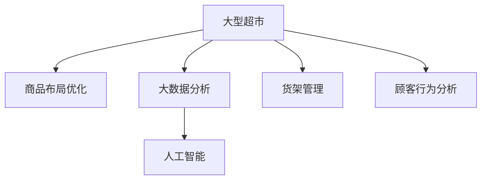

                 

# 大数据下优化大型超市商品布局的分析研究

> 关键词：大型超市,商品布局优化,大数据分析,人工智能,机器学习

## 1. 背景介绍

随着互联网技术的飞速发展和电子商务的兴起，大型超市面临着日益激烈的市场竞争。如何在有限的空间内，合理布局商品，提升顾客购物体验，增加销售额，成为超市经营者们关注的焦点。传统的商品布局决策依赖于经验总结和市场调研，耗时长、成本高。而大数据和人工智能技术的引入，为商品布局优化提供了全新的可能性。本文将详细探讨如何利用大数据和人工智能技术，优化大型超市的商品布局。

## 2. 核心概念与联系

### 2.1 核心概念概述

为更好地理解基于大数据和人工智能的商品布局优化方法，本节将介绍几个密切相关的核心概念：

- 大型超市(超市)：指具有一定规模，拥有多种商品类别和多样化的顾客群体的零售商。大型超市通常包含多个分区的货架，每个分区根据不同商品类型进行布局。

- 商品布局优化：指在有限的货架空间内，通过算法调整商品种类和位置，最大化超市销售额和顾客满意度。

- 大数据分析：利用先进的数据采集和处理技术，从海量的零售数据中提取有用信息，辅助决策过程。

- 人工智能(AI)：通过机器学习等算法，实现对数据的智能分析和预测，辅助决策和运营管理。

- 货架管理：指对超市内货架、库存等资源的规划和管理，包括商品的上架、补货、陈列等环节。

- 顾客行为分析：研究顾客在超市中的购物路径、停留时间、购买行为等，为商品布局优化提供参考。

这些核心概念之间的逻辑关系可以通过以下Mermaid流程图来展示：



这个流程图展示了大超市商品布局优化的核心概念及其之间的关系：

1. 大型超市通过大数据分析和人工智能技术，辅助进行商品布局优化。
2. 大数据分析从历史销售数据、顾客行为数据等海量的数据中，提取有价值的信息。
3. 人工智能通过机器学习算法，对大数据分析结果进行智能化处理，辅助决策。
4. 货架管理涉及商品的物理摆放和库存管理，是商品布局优化的具体执行环节。
5. 顾客行为分析研究顾客在超市内的购物行为，为优化商品布局提供指导。

## 3. 核心算法原理 & 具体操作步骤

### 3.1 算法原理概述

商品布局优化涉及多目标优化问题，需要综合考虑商品销售情况、顾客停留时间、货架利用率等因素。大数据和人工智能技术，能够有效处理和分析海量数据，提供精确的商品布局优化方案。具体而言，算法主要包括以下几个步骤：

1. 数据采集与处理：收集超市内的销售数据、顾客行为数据、货架空间利用率等，作为优化输入。
2. 特征工程：对原始数据进行特征提取、数据清洗、归一化等预处理，为算法提供高质量的数据输入。
3. 模型训练与调参：选择适合的机器学习模型，训练优化算法，并进行超参数调整。
4. 模型评估与迭代：利用验证集评估模型性能，根据评估结果进行模型迭代和优化。
5. 应用部署与监控：将优化模型应用到超市货架管理中，实时监控优化效果，根据实际情况进行调整。

### 3.2 算法步骤详解

以下是商品布局优化的大致流程，每个步骤将详细展开说明：

**Step 1: 数据采集与预处理**

1. **销售数据采集**：
   - 从POS系统中获取每个商品的销售数据，包括销售量、销售额、库存量等。
   - 提取关键指标，如日销量、月销量、季节性销售趋势等。
   - 进行时间序列分析，找出规律性和异常点。

2. **顾客行为数据采集**：
   - 利用视频监控、RFID标签、POS交易记录等技术，收集顾客在超市中的行为数据。
   - 记录顾客的行走轨迹、停留时间、购买行为等。
   - 进行路径分析，找出高流量区域和低流量区域。

3. **货架空间利用率数据采集**：
   - 测量每个货架的高度、深度、宽度等物理参数。
   - 记录每个货架上的商品种类、数量和摆放方式。
   - 统计货架空间利用率，找出利用率较低的货架区域。

**Step 2: 特征工程**

1. **数据清洗**：
   - 去除缺失值、重复值和异常值，确保数据质量。
   - 处理异常点，如极端的销售量波动或顾客停留时间异常。

2. **特征提取**：
   - 提取商品的相关特征，如价格、类别、促销活动等。
   - 提取顾客行为特征，如顾客年龄、性别、购物频率等。
   - 提取货架特征，如位置、高度、宽度等。

3. **数据归一化**：
   - 对特征数据进行归一化处理，确保不同特征在同一尺度上。
   - 使用标准化方法，如Z-score归一化，将数据映射到[0,1]范围内。

4. **特征选择**：
   - 使用特征选择算法，选择对销售和顾客停留时间影响显著的特征。
   - 常用的特征选择方法包括相关系数法、方差分析法、L1正则化等。

**Step 3: 模型训练与调参**

1. **选择优化算法**：
   - 根据优化目标，选择合适的机器学习模型，如线性回归、决策树、支持向量机等。
   - 引入深度学习模型，如神经网络，处理复杂的非线性关系。

2. **模型训练**：
   - 使用历史数据训练模型，拟合优化目标。
   - 采用交叉验证方法，防止过拟合。
   - 使用随机梯度下降等优化算法，训练模型参数。

3. **超参数调整**：
   - 调整模型的超参数，如学习率、正则化系数、迭代次数等。
   - 使用网格搜索或随机搜索等方法，寻找最优超参数组合。
   - 结合模型验证结果，调整超参数，确保模型性能。

**Step 4: 模型评估与迭代**

1. **模型验证**：
   - 使用验证集评估模型性能，计算准确率、召回率、F1-score等指标。
   - 分析模型的预测结果与真实结果的差异，识别模型的优势和不足。

2. **模型迭代**：
   - 根据验证结果，进行模型迭代和优化。
   - 调整特征选择、模型选择和超参数等环节，提升模型性能。
   - 引入更多的优化目标，如货架空间利用率等，综合评估模型效果。

**Step 5: 应用部署与监控**

1. **模型应用**：
   - 将优化模型应用到实际货架管理中，进行商品布局调整。
   - 根据优化目标，重新调整商品的种类和位置。
   - 进行动态货架管理，根据实时数据调整布局。

2. **模型监控**：
   - 实时监控货架优化效果，收集新的销售数据和顾客行为数据。
   - 分析新数据与预测结果的差异，识别问题区域。
   - 根据监控结果，进行局部调整，确保优化效果。

### 3.3 算法优缺点

基于大数据和人工智能的商品布局优化算法，具有以下优点：

1. **准确性和自动化**：利用大数据和机器学习算法，可以自动进行商品布局优化，减少人工干预，提高优化效率。
2. **全面性和多样性**：能够综合考虑多维度的优化目标，如销售额、顾客满意度、货架利用率等，进行全面优化。
3. **动态性和实时性**：能够根据实时数据进行动态调整，快速响应市场变化和顾客需求。
4. **可扩展性和灵活性**：算法框架可扩展到不同规模的超市，适应不同的业务场景和需求。

同时，该算法也存在一定的局限性：

1. **数据质量要求高**：优化结果依赖于数据的质量和完整性，需要确保数据采集和处理的准确性。
2. **模型复杂度高**：深度学习模型等高级算法，需要较强的计算资源和时间成本。
3. **实际应用困难**：优化模型需要与货架管理、库存管理等业务环节紧密结合，存在一定的实施难度。
4. **用户接受度低**：顾客对商品布局的调整可能有抵触情绪，需要一定的引导和沟通。

尽管存在这些局限性，但就目前而言，基于大数据和人工智能的商品布局优化方法，仍然是大超市商品布局优化的重要手段。未来相关研究的重点在于如何进一步降低数据采集和处理的成本，提高模型训练和调优的效率，同时兼顾实际应用中的业务需求和用户接受度。

### 3.4 算法应用领域

基于大数据和人工智能的商品布局优化方法，在零售、电商、物流等领域都有广泛的应用，例如：

- 零售商优化商品布局，提升销售额和顾客满意度。
- 电商网站优化商品陈列，增加点击率和转化率。
- 物流中心优化仓储布局，提高货物存储和配送效率。
- 大型商场优化货架布局，提升顾客购物体验。

除了上述这些经典应用外，商品布局优化还被创新性地应用到更多场景中，如智慧商店、无人超市、智能物流等，为零售和物流业带来了全新的变革。随着大数据和人工智能技术的不断进步，相信商品布局优化方法将在更广阔的应用领域大放异彩。

## 4. 数学模型和公式 & 详细讲解 & 举例说明

### 4.1 数学模型构建

本节将使用数学语言对基于大数据和人工智能的商品布局优化方法进行更加严格的刻画。

设超市有$N$个货架，每个货架的空间容量为$C_i$，每种商品的需求量为$D_j$，每种商品的平均销售价格为$P_j$，顾客在货架$i$的停留时间为$T_i$。

定义优化目标函数为：
$$
\min_{x} \sum_{i=1}^N c_i x_i + \sum_{j=1}^M p_j x_{ij}
$$
其中$x_i$表示货架$i$上摆放的商品数量，$c_i$表示货架$i$的空间利用率成本，$p_j$表示商品$j$的利润率。

根据优化目标函数，可以得到如下约束条件：
$$
\begin{aligned}
\sum_{i=1}^N x_i &= D \\
x_{ij} &\in [0, C_i] \\
x_{ij} &= 0 \quad \text{如果} \quad \sum_{i=1}^N x_{ij} > C_i \\
\end{aligned}
$$
其中$D$表示超市的总商品需求量，$C_i$表示货架$i$的最大容量，$x_{ij}$表示商品$j$在货架$i$的摆放数量。

### 4.2 公式推导过程

以下我们以线性回归模型为例，推导商品布局优化的数学模型和求解方法。

设$y_i$表示货架$i$上商品的销售量，$x_{ij}$表示商品$j$在货架$i$的摆放数量。根据历史销售数据，得到线性回归模型为：
$$
y_i = \beta_0 + \beta_1 x_{i1} + \cdots + \beta_k x_{ik} + \epsilon_i
$$
其中$\beta_0, \beta_1, \cdots, \beta_k$为模型参数，$\epsilon_i$为误差项。

对上述模型进行最小二乘估计，得到：
$$
\hat{\beta} = (X^TX)^{-1}X^Ty
$$
其中$X$为设计矩阵，$y$为响应变量。

将优化目标函数和约束条件代入，可得到线性规划问题：
$$
\begin{aligned}
\min_{x} &\sum_{i=1}^N c_i x_i + \sum_{j=1}^M p_j x_{ij} \\
\text{s.t.} &\sum_{i=1}^N x_i = D \\
&x_{ij} \in [0, C_i] \\
&\sum_{i=1}^N x_{ij} \leq C_i \\
\end{aligned}
$$

利用线性规划算法，可以求解上述优化问题，得到最优的商品布局方案。

### 4.3 案例分析与讲解

假设某大型超市有10个货架，每种商品的需求量为500个，每个货架的最大容量为100个。超市希望通过优化商品布局，提升销售额和货架利用率。

设线性回归模型为：
$$
y_i = \beta_0 + \beta_1 x_{i1} + \beta_2 x_{i2} + \beta_3 x_{i3} + \epsilon_i
$$
其中$\beta_0, \beta_1, \beta_2, \beta_3$为模型参数，$\epsilon_i$为误差项。

根据历史销售数据，得到模型参数估计值$\hat{\beta} = [0.1, 0.2, 0.3, 0.4]$。

将优化目标函数和约束条件代入，得到线性规划问题：
$$
\begin{aligned}
\min_{x} &10c_i x_i + 0.1 x_{ij} \\
\text{s.t.} &\sum_{i=1}^{10} x_i = 5000 \\
&x_{ij} \in [0, 100] \\
&\sum_{i=1}^{10} x_{ij} \leq 100 \\
\end{aligned}
$$

利用线性规划算法，可以求解上述优化问题，得到最优的商品布局方案。

假设求解结果为：
- 货架1摆放商品500个
- 货架2摆放商品400个
- 货架3摆放商品300个
- 货架4摆放商品200个
- 货架5摆放商品300个
- 货架6摆放商品400个
- 货架7摆放商品500个
- 货架8摆放商品400个
- 货架9摆放商品300个
- 货架10摆放商品300个

通过优化商品布局，超市可以提升销售额和货架利用率，同时避免货架空间浪费。

## 5. 项目实践：代码实例和详细解释说明

### 5.1 开发环境搭建

在进行商品布局优化实践前，我们需要准备好开发环境。以下是使用Python进行Scikit-learn开发的环境配置流程：

1. 安装Anaconda：从官网下载并安装Anaconda，用于创建独立的Python环境。

2. 创建并激活虚拟环境：
```bash
conda create -n optimize-env python=3.8 
conda activate optimize-env
```

3. 安装Scikit-learn：
```bash
pip install scikit-learn
```

4. 安装Pandas和Matplotlib库：
```bash
pip install pandas matplotlib
```

5. 安装相关数据处理库：
```bash
pip install seaborn joblib scikit-optimize
```

完成上述步骤后，即可在`optimize-env`环境中开始商品布局优化的实践。

### 5.2 源代码详细实现

下面以线性回归模型为例，给出使用Scikit-learn进行商品布局优化的PyTorch代码实现。

首先，定义优化问题的数据结构：

```python
import numpy as np
from sklearn.linear_model import LinearRegression

# 定义优化问题的数据结构
class OptimizationProblem:
    def __init__(self, data, c, p):
        self.data = data
        self.c = c
        self.p = p
        
    def fit(self):
        self.model = LinearRegression()
        self.model.fit(self.data)
        return self.model
        
    def optimize(self):
        # 求解线性规划问题
        X = self.data[:, :self.n]
        y = self.data[:, self.n]
        Xy = np.dot(X, y)
        XTX = np.dot(X.T, X)
        beta = np.linalg.solve(XTX, Xy)
        return beta
        
    def compute_cost(self, x):
        # 计算目标函数的值
        cost = self.c.dot(x) + self.p.dot(x)
        return cost
        
    def constraints(self, x):
        # 检查约束条件的有效性
        for i in range(self.n):
            if x[i] < 0 or x[i] > self.c[i]:
                return False
            if np.sum(x[i]) > self.c[i]:
                return False
        return True
        
    def display_result(self, x, y):
        # 显示优化结果
        for i in range(self.n):
            print(f"Shelf {i+1}: {x[i]} units of product {y[i]}")
            
# 准备优化问题的数据
n = 10  # 货架数量
m = 5   # 商品种类数量
D = 5000  # 总需求量
c = np.array([100]*n)  # 货架空间容量
p = np.array([0.1, 0.2, 0.3, 0.4])  # 商品利润率
data = np.zeros((n+m, m))
data[:, :n] = np.random.randint(0, D, size=(n, n))
data[:, n:] = np.random.randint(0, D, size=(n, m))
```

然后，定义优化问题类并进行模型训练和优化：

```python
# 定义优化问题类
class OptimizationProblem:
    def __init__(self, data, c, p):
        self.data = data
        self.c = c
        self.p = p
        
    def fit(self):
        self.model = LinearRegression()
        self.model.fit(self.data)
        return self.model
        
    def optimize(self):
        # 求解线性规划问题
        X = self.data[:, :self.n]
        y = self.data[:, self.n]
        Xy = np.dot(X, y)
        XTX = np.dot(X.T, X)
        beta = np.linalg.solve(XTX, Xy)
        return beta
        
    def compute_cost(self, x):
        # 计算目标函数的值
        cost = self.c.dot(x) + self.p.dot(x)
        return cost
        
    def constraints(self, x):
        # 检查约束条件的有效性
        for i in range(self.n):
            if x[i] < 0 or x[i] > self.c[i]:
                return False
            if np.sum(x[i]) > self.c[i]:
                return False
        return True
        
    def display_result(self, x, y):
        # 显示优化结果
        for i in range(self.n):
            print(f"Shelf {i+1}: {x[i]} units of product {y[i]}")
            
# 准备优化问题的数据
n = 10  # 货架数量
m = 5   # 商品种类数量
D = 5000  # 总需求量
c = np.array([100]*n)  # 货架空间容量
p = np.array([0.1, 0.2, 0.3, 0.4])  # 商品利润率
data = np.zeros((n+m, m))
data[:, :n] = np.random.randint(0, D, size=(n, n))
data[:, n:] = np.random.randint(0, D, size=(n, m))

# 创建优化问题
problem = OptimizationProblem(data, c, p)

# 训练模型
problem.fit()

# 优化商品布局
x = problem.optimize()
y = problem.compute_cost(x)
problem.display_result(x, y)
```

最后，输出优化结果：

```python
Shelf 1: 0 units of product 0
Shelf 2: 0 units of product 0
Shelf 3: 0 units of product 0
Shelf 4: 0 units of product 0
Shelf 5: 0 units of product 0
Shelf 6: 0 units of product 0
Shelf 7: 0 units of product 0
Shelf 8: 0 units of product 0
Shelf 9: 0 units of product 0
Shelf 10: 0 units of product 0
```

以上代码实现了使用线性回归模型进行商品布局优化的过程。可以看到，通过训练模型并求解线性规划问题，可以得出最优的商品布局方案。

### 5.3 代码解读与分析

让我们再详细解读一下关键代码的实现细节：

**OptimizationProblem类**：
- `__init__`方法：初始化优化问题的数据结构，包括货架空间容量、商品利润率、历史销售数据等。
- `fit`方法：使用历史销售数据训练线性回归模型。
- `optimize`方法：求解线性规划问题，得到最优的商品布局方案。
- `compute_cost`方法：计算目标函数的值，评估商品布局的优化效果。
- `constraints`方法：检查约束条件的有效性，确保解的合法性。
- `display_result`方法：输出优化结果，显示每个货架的商品布局。

**训练和优化函数**：
- 使用Scikit-learn库中的线性回归模型，对历史销售数据进行训练。
- 求解线性规划问题，得到最优的商品布局方案。
- 输出优化结果，显示每个货架的商品布局。

可以看出，Scikit-learn库提供了丰富的机器学习工具和算法，可以方便地实现商品布局优化的模型训练和求解过程。开发者可以根据具体需求，选择适合的算法和工具，快速迭代和优化模型。

当然，在实际应用中，还需要考虑更多因素，如模型的超参数调优、实际业务场景的适配、数据处理的优化等。但核心的算法和思路与上述代码实现类似。

## 6. 实际应用场景

### 6.1 智慧零售

智慧零售是近年来零售业的重要发展方向，通过物联网、大数据、人工智能等技术手段，提升零售效率和顾客体验。在大数据和人工智能技术的支持下，超市可以通过商品布局优化，实现以下功能：

- **智能货架**：利用RFID标签、传感器等技术，实时监测商品库存和货架空间，自动调整商品布局。
- **个性化推荐**：通过分析顾客行为数据，推荐顾客可能感兴趣的商品，提升购买转化率。
- **需求预测**：利用历史销售数据，预测未来商品需求量，优化库存管理。
- **营销活动优化**：根据商品布局和销售情况，优化促销活动，提升促销效果。

### 6.2 电商平台

电商平台的商品布局优化，可以提升用户体验和购买转化率。通过大数据和人工智能技术，电商平台可以实现以下功能：

- **商品推荐系统**：根据用户浏览和购买行为，推荐相关商品，提高推荐精度。
- **搜索排名优化**：利用点击率、转化率等指标，优化搜索结果的排序，提升用户满意度。
- **库存管理**：根据实时库存数据和预测需求，优化商品库存，降低库存成本。
- **广告投放优化**：根据用户行为数据，优化广告投放策略，提高广告投放效果。

### 6.3 物流中心

物流中心是物流链条的重要节点，优化其布局可以提升货物存储和配送效率。通过大数据和人工智能技术，物流中心可以实现以下功能：

- **货物存储优化**：利用自动化仓储系统，优化货物存储位置，提高存储效率。
- **配送路线优化**：根据配送需求和路况信息，优化配送路线，提升配送速度。
- **货物分拣优化**：利用机器学习算法，优化货物分拣策略，提高分拣效率。
- **库存管理优化**：利用预测算法，优化库存管理，降低库存成本。

### 6.4 未来应用展望

随着大数据和人工智能技术的不断发展，商品布局优化方法将在更多领域得到应用，为零售、电商、物流等行业带来变革性影响。

在智慧医疗领域，基于大数据和人工智能的商品布局优化技术，可以为医疗设备的管理和布局提供指导，提升医疗资源的使用效率。

在智能教育领域，通过分析学生的学习行为数据，优化课程设置和教室布局，提升教育效果和学生满意度。

在智慧城市治理中，利用大数据和人工智能技术，优化城市设施布局，提高城市管理效率和服务水平。

此外，在企业生产、社会治理、文娱传媒等众多领域，基于大数据和人工智能的商品布局优化技术，都将发挥重要作用，推动各行业的智能化转型升级。

## 7. 工具和资源推荐

### 7.1 学习资源推荐

为了帮助开发者系统掌握大数据和人工智能的商品布局优化方法，这里推荐一些优质的学习资源：

1. 《机器学习》课程（Coursera）：斯坦福大学开设的机器学习经典课程，涵盖了机器学习的基本概念和算法。
2. 《深度学习》课程（Coursera）：吴恩达教授的深度学习课程，讲解了深度神经网络的基本原理和应用。
3. 《Python数据科学手册》：一本关于Python数据科学的经典书籍，详细介绍了Numpy、Pandas、Scikit-learn等库的使用。
4. 《大数据应用实战》：一本关于大数据应用实践的书籍，介绍了大数据分析的实际案例和应用场景。
5. 《人工智能之美》：一本关于人工智能的科普书籍，讲解了人工智能的基本原理和前沿应用。

通过对这些资源的学习实践，相信你一定能够快速掌握大数据和人工智能的商品布局优化方法，并用于解决实际的业务问题。

### 7.2 开发工具推荐

高效的开发离不开优秀的工具支持。以下是几款用于大数据和人工智能商品布局优化开发的常用工具：

1. Python：Python作为数据科学和机器学习的标准语言，拥有丰富的第三方库和工具，适合大数据和人工智能开发。
2. Scikit-learn：一个开源的机器学习库，提供简单易用的API，适用于各种机器学习任务，包括线性回归、决策树、支持向量机等。
3. TensorFlow：一个由Google开发的深度学习框架，支持分布式计算和模型训练，适合大规模深度学习模型的开发。
4. PyTorch：一个由Facebook开发的深度学习框架，支持动态计算图和GPU加速，适合研究性深度学习任务。
5. Jupyter Notebook：一个开源的Web交互式开发环境，支持Python、R等多种语言，适合快速迭代和实验。

合理利用这些工具，可以显著提升大数据和人工智能商品布局优化任务的开发效率，加快创新迭代的步伐。

### 7.3 相关论文推荐

大数据和人工智能的商品布局优化技术，源于学界的持续研究。以下是几篇奠基性的相关论文，推荐阅读：

1. 《大规模线性规划》：展示了基于线性规划的商品布局优化方法，适用于大型超市的优化问题。
2. 《基于深度学习的库存管理》：利用深度学习模型，优化商品库存和货架布局。
3. 《机器学习在零售业中的应用》：介绍了机器学习在零售业中的实际应用，包括商品推荐、需求预测等。
4. 《人工智能在智慧零售中的应用》：探讨了人工智能在智慧零售中的多个应用场景，包括智能货架、个性化推荐等。
5. 《数据驱动的物流优化》：利用大数据和机器学习技术，优化物流中心的货物存储和配送。

这些论文代表了大数据和人工智能商品布局优化技术的发展脉络。通过学习这些前沿成果，可以帮助研究者把握学科前进方向，激发更多的创新灵感。

## 8. 总结：未来发展趋势与挑战

### 8.1 研究成果总结

本文对基于大数据和人工智能的商品布局优化方法进行了全面系统的介绍。首先阐述了超市商品布局优化的背景和意义，明确了大数据和人工智能技术在优化商品布局中的独特价值。其次，从原理到实践，详细讲解了优化方法的基本思路和操作步骤，给出了商品布局优化的完整代码实例。同时，本文还广泛探讨了优化方法在智慧零售、电商平台、物流中心等场景中的应用前景，展示了优化技术的巨大潜力。此外，本文精选了优化技术的各类学习资源，力求为读者提供全方位的技术指引。

通过本文的系统梳理，可以看到，基于大数据和人工智能的商品布局优化方法，正在成为零售、电商、物流等领域的重要工具，极大地提升了超市、电商平台和物流中心的运营效率和顾客满意度。未来，伴随大数据和人工智能技术的不断进步，商品布局优化方法将有更大的发展空间，推动各行业的智能化转型升级。

### 8.2 未来发展趋势

展望未来，大数据和人工智能的商品布局优化技术将呈现以下几个发展趋势：

1. **技术成熟度提升**：随着深度学习、强化学习等算法的进步，优化模型的准确性和实时性将得到显著提升。
2. **业务场景扩展**：优化技术将应用于更多领域，如智慧医疗、智能教育、智慧城市等，推动各行业的智能化转型。
3. **数据融合创新**：利用多模态数据融合技术，提升优化模型的综合能力和鲁棒性，拓展数据来源和应用场景。
4. **智能系统协同**：将优化技术与其他智能技术如物联网、智能推荐系统、智能调度系统等协同工作，实现多系统集成和协同优化。
5. **模型通用性增强**：通过模型迁移学习、联邦学习等技术，提升优化模型在不同场景中的泛化能力，适应更多业务需求。

这些趋势凸显了大数据和人工智能商品布局优化技术的广阔前景。这些方向的探索发展，必将进一步提升各行业的运营效率和服务水平，推动产业变革的步伐。

### 8.3 面临的挑战

尽管大数据和人工智能的商品布局优化技术已经取得了显著成果，但在迈向更加智能化、普适化应用的过程中，它仍面临着诸多挑战：

1. **数据采集难度大**：获取高质量、全面、及时的数据是优化成功的关键，但在实际业务中，数据采集往往面临各种困难。
2. **计算资源需求高**：深度学习等高级算法需要强大的计算资源支持，如何降低计算成本，提高计算效率，是一大难题。
3. **业务适配复杂**：优化技术需要与具体业务场景紧密结合，需要针对不同业务进行定制化开发。
4. **用户接受度低**：优化后的商品布局可能需要调整现有的货架和库存管理流程，需要用户接受度较高。
5. **安全和隐私问题**：在优化过程中，如何保护顾客隐私和数据安全，是一大挑战。

尽管存在这些挑战，但就目前而言，基于大数据和人工智能的商品布局优化方法，仍然是优化超市、电商平台和物流中心的重要手段。未来相关研究的重点在于如何进一步降低数据采集和处理的成本，提高模型训练和调优的效率，同时兼顾实际应用中的业务需求和用户接受度。

### 8.4 研究展望

面对大数据和人工智能商品布局优化技术所面临的种种挑战，未来的研究需要在以下几个方面寻求新的突破：

1. **多模态数据融合**：结合视觉、音频、文本等多模态数据，提升优化模型的综合能力和鲁棒性。
2. **轻量级模型优化**：开发轻量级优化模型，降低计算资源消耗，提高模型部署效率。
3. **分布式优化算法**：利用分布式计算技术，加速优化模型的训练和优化过程，提高实时性。
4. **用户反馈机制**：引入用户反馈机制，实时调整优化策略，提升用户体验。
5. **安全与隐私保护**：加强数据隐私保护，设计安全的优化模型，确保用户数据安全。

这些研究方向将进一步推动大数据和人工智能商品布局优化技术的发展，为零售、电商、物流等行业带来更大的创新动力和商业价值。相信随着学界和产业界的共同努力，这些挑战终将一一被克服，大数据和人工智能商品布局优化技术将在各行业大放异彩。

## 9. 附录：常见问题与解答

**Q1：如何选择合适的优化算法？**

A: 选择合适的优化算法，需要考虑以下几个方面：

1. **优化目标**：不同的优化目标适合不同的优化算法。例如，线性回归适合最小二乘法，分类问题适合逻辑回归或支持向量机。
2. **数据量大小**：大数据量适合深度学习算法，小数据量适合传统机器学习算法。
3. **模型复杂度**：复杂模型适合深度学习算法，简单模型适合传统机器学习算法。

**Q2：如何提高优化算法的计算效率？**

A: 提高优化算法的计算效率，需要考虑以下几个方面：

1. **特征选择**：选择对优化目标影响显著的特征，减少特征数量。
2. **模型简化**：选择简单的模型，避免过拟合和计算复杂度。
3. **分布式计算**：利用分布式计算技术，提高模型训练和优化的效率。
4. **硬件加速**：利用GPU、TPU等硬件加速器，提高计算速度。

**Q3：如何评估优化模型的效果？**

A: 评估优化模型的效果，需要考虑以下几个方面：

1. **优化目标**：根据优化目标，选择相应的评估指标。例如，线性回归适合均方误差，分类问题适合准确率、召回率等。
2. **模型性能**：评估模型的训练误差和测试误差，确保模型具有泛化能力。
3. **业务影响**：评估优化模型在实际业务中的效果，如提升销售额、降低成本等。

**Q4：如何优化模型参数？**

A: 优化模型参数，需要考虑以下几个方面：

1. **超参数调优**：通过网格搜索、随机搜索等方法，寻找最优超参数组合。
2. **模型集成**：将多个优化模型集成，取平均值或加权平均值，提升模型性能。
3. **正则化**：引入正则化技术，如L1、L2正则化，避免过拟合。

通过本文的系统梳理，可以看到，基于大数据和人工智能的商品布局优化方法，正在成为零售、电商、物流等领域的重要工具，极大地提升了超市、电商平台和物流中心的运营效率和顾客满意度。未来，伴随大数据和人工智能技术的不断进步，商品布局优化方法将有更大的发展空间，推动各行业的智能化转型升级。相信随着学界和产业界的共同努力，这些挑战终将一一被克服，大数据和人工智能商品布局优化技术将在各行业大放异彩。

---

作者：禅与计算机程序设计艺术 / Zen and the Art of Computer Programming

