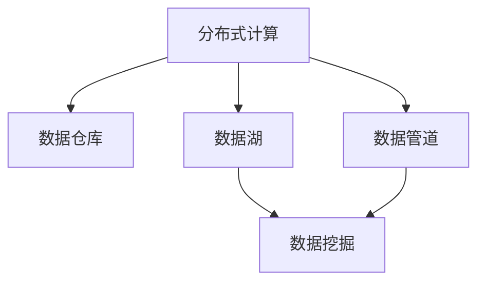

                 

# 大数据架构原理与代码实例讲解

> 关键词：大数据架构,分布式计算,数据仓库,数据湖,实时流处理,数据挖掘

## 1. 背景介绍

### 1.1 问题由来
随着互联网和移动互联网的迅猛发展，数据量呈指数级增长，企业对数据的需求和依赖日益加深。传统的集中式数据库和单体应用系统已经难以满足日益增长的数据存储和处理需求。大数据技术的兴起，为企业提供了高效、可靠的分布式数据存储和计算能力，成为了企业数字化转型和创新发展的重要基石。

### 1.2 问题核心关键点
当前大数据架构的设计和实施，需要解决以下几个关键问题：

- 如何构建高效、可扩展的分布式数据存储系统？
- 如何实现高性能、低延迟的分布式数据处理和计算？
- 如何构建灵活、易于维护的数据管道和数据仓库？
- 如何在数据存储和计算过程中，保障数据的质量和完整性？
- 如何通过数据挖掘和分析，提取有价值的信息和知识？

这些核心问题的有效解决，有助于企业构建可靠、高效、智能的大数据架构体系，提升数据资产的价值，推动业务创新和发展。

### 1.3 问题研究意义
研究大数据架构的原理和方法，对于提升企业的数据处理能力和数据驱动决策能力，具有重要意义：

1. 增强数据处理能力。大数据架构通过分布式计算和存储，能够处理海量数据，满足企业不断增长的数据存储和计算需求。
2. 提升数据驱动决策。通过大数据分析和挖掘，企业能够从数据中提取有用信息，支持更加精准的业务决策。
3. 优化业务流程。大数据架构通过数据管道和数据仓库的构建，能够实现数据的一体化和高效流动，优化业务流程，提升运营效率。
4. 促进数据共享和创新。通过构建统一的数据平台，企业能够实现数据的跨部门、跨业务共享，激发数据驱动的创新动力。
5. 保障数据安全与合规。大数据架构通过数据加密、访问控制等手段，确保数据的安全性，满足数据合规要求。

## 2. 核心概念与联系

### 2.1 核心概念概述

为更好地理解大数据架构的设计和实现，本节将介绍几个密切相关的核心概念：

- 分布式计算：通过多台计算机并行处理任务，提升计算效率，适用于海量数据的处理和分析。
- 数据仓库：用于集中存储企业历史业务数据，支持数据查询和分析，是数据驱动决策的基础设施。
- 数据湖：用于存储企业所有类型的数据，包括结构化、半结构化、非结构化数据，支持数据探索和发现。
- 数据管道：用于构建数据的流动通道，实现数据的采集、清洗、转换和加载，支持数据的实时流处理和离线处理。
- 数据挖掘：从数据中提取有用信息和知识，支持数据驱动的业务洞察和决策。

这些核心概念之间的逻辑关系可以通过以下Mermaid流程图来展示：



这个流程图展示了大数据架构的核心概念及其之间的关系：

1. 分布式计算提供高效的数据处理能力，是数据仓库和数据湖的基础。
2. 数据仓库集中存储企业历史业务数据，是数据驱动决策的重要数据源。
3. 数据湖存储企业所有类型的数据，支持数据探索和发现。
4. 数据管道实现数据的流动和处理，支持数据仓库的更新和数据湖的数据导入。
5. 数据挖掘从数据中提取有用信息和知识，支持业务洞察和决策。

这些核心概念共同构成了大数据架构的设计框架，使得企业能够高效、可靠地处理和管理海量数据，从中提取有用信息和知识，推动业务创新和发展。

## 3. 核心算法原理 & 具体操作步骤
### 3.1 算法原理概述

大数据架构的设计和实施，涉及多个关键组件和技术，包括分布式计算框架、数据存储系统、数据流管道和数据挖掘算法等。其核心思想是通过分布式计算和存储技术，构建高效、可扩展的数据处理系统，支持数据的高效存储、处理和分析。

具体来说，大数据架构的设计和实现过程如下：

1. 设计分布式计算框架：选择合适的计算框架（如Hadoop、Spark等），并搭建多节点集群。
2. 部署数据存储系统：选择合适的存储系统（如HDFS、HBase等），并搭建数据存储体系。
3. 构建数据管道：设计数据流管道，实现数据的采集、清洗、转换和加载。
4. 实施数据仓库：设计数据仓库架构，集中存储历史业务数据，支持数据查询和分析。
5. 进行数据挖掘：选择数据挖掘算法，实现数据的探索和发现，支持业务洞察和决策。

### 3.2 算法步骤详解

大数据架构的搭建和实施，通常需要经过以下几个关键步骤：

**Step 1: 需求分析和规划**

- 明确企业数据需求：包括数据存储和处理需求、业务需求和数据治理需求。
- 制定详细规划：包括架构设计、技术选型、资源配置和实施计划。

**Step 2: 系统设计与搭建**

- 设计数据存储体系：选择合适的存储系统，搭建数据仓库和数据湖。
- 设计计算框架：选择合适的计算框架，搭建多节点集群，实现分布式计算。
- 设计数据管道：设计数据流管道，实现数据的采集、清洗、转换和加载。

**Step 3: 系统调优与测试**

- 系统调优：优化数据存储和计算性能，确保系统稳定运行。
- 系统测试：进行功能测试和性能测试，确保系统符合需求。

**Step 4: 系统部署与上线**

- 系统部署：将系统部署到生产环境。
- 系统上线：进行系统上线和业务测试，确保系统稳定运行。

**Step 5: 系统监控与运维**

- 系统监控：实时监控系统性能和数据状态，及时发现和解决问题。
- 系统运维：进行系统维护和优化，确保系统长期稳定运行。

### 3.3 算法优缺点

大数据架构的设计和实施，具有以下优点：

1. 高效性：通过分布式计算和存储，能够处理海量数据，提升数据处理效率。
2. 可扩展性：支持水平扩展，能够灵活应对数据量和业务量的变化。
3. 可靠性：多节点集群和冗余设计，保障系统的稳定性和可靠性。
4. 灵活性：支持多种数据存储和计算技术，适应不同业务场景的需求。
5. 安全性：通过数据加密和访问控制等手段，保障数据的安全性。

但同时，大数据架构也存在以下缺点：

1. 复杂性：系统设计和实施过程复杂，需要协调多个组件和技术。
2. 成本高：需要投入大量的硬件资源和技术支持。
3. 维护难：系统规模大，结构复杂，维护难度较高。
4. 数据一致性问题：分布式计算和存储可能导致数据一致性问题。
5. 数据质量问题：数据采集、清洗和转换可能导致数据质量问题。

尽管存在这些局限性，但就目前而言，大数据架构仍然是大规模数据处理和存储的理想选择。未来相关研究的重点在于如何进一步降低系统复杂性和维护成本，提高数据一致性和质量，同时兼顾系统的可扩展性和灵活性。

### 3.4 算法应用领域

大数据架构在多个领域得到了广泛的应用，以下是其中几个典型的应用场景：

- 金融行业：大数据架构支持高频交易、信用风险评估、客户行为分析等应用，推动金融业务创新。
- 零售行业：大数据架构支持客户画像、库存管理、营销优化等应用，提升零售业务效率。
- 医疗行业：大数据架构支持患者诊疗、医疗资源管理、公共卫生监测等应用，提升医疗服务质量。
- 制造业：大数据架构支持供应链优化、设备预测维护、质量控制等应用，推动制造业智能化转型。
- 交通行业：大数据架构支持交通流量监测、智能调度和安全预警等应用，提升交通系统运行效率。

这些典型应用场景展示了大数据架构的广泛应用，以及其对各个行业的数字化转型和创新发展的重要作用。

## 4. 数学模型和公式 & 详细讲解 & 举例说明

### 4.1 数学模型构建

为了更好地理解大数据架构的技术原理，本节将构建数学模型来描述数据流管道的设计和实施过程。

假设企业从多个数据源采集数据，经过数据清洗和转换后，存储在数据仓库中。数据流管道的数学模型可以表示为：

$$
\text{Data Flow} = \{s_{\text{source}}, s_{\text{clean}}, s_{\text{transform}}, s_{\text{load}}\}
$$

其中，$s_{\text{source}}$ 表示数据源，$s_{\text{clean}}$ 表示数据清洗，$s_{\text{transform}}$ 表示数据转换，$s_{\text{load}}$ 表示数据加载。数据流管道的关键任务是将原始数据转换为可用数据，存储到数据仓库中。

### 4.2 公式推导过程

数据流管道的构建过程可以分为两个阶段：数据采集和数据加载。以下将对这两个阶段的公式进行推导：

**数据采集公式**：
$$
s_{\text{source}} \rightarrow s_{\text{clean}}
$$

其中，$s_{\text{source}}$ 表示原始数据，$s_{\text{clean}}$ 表示经过清洗后的数据。数据采集过程的公式表示为：

$$
s_{\text{clean}} = f_{\text{clean}}(s_{\text{source}})
$$

其中，$f_{\text{clean}}$ 表示数据清洗函数，用于去除噪声、处理缺失值等。

**数据加载公式**：
$$
s_{\text{clean}} \rightarrow s_{\text{load}}
$$

其中，$s_{\text{clean}}$ 表示经过清洗后的数据，$s_{\text{load}}$ 表示加载到数据仓库中的数据。数据加载过程的公式表示为：

$$
s_{\text{load}} = f_{\text{load}}(s_{\text{clean}})
$$

其中，$f_{\text{load}}$ 表示数据加载函数，用于将数据转换为可存储的格式，并存储到数据仓库中。

### 4.3 案例分析与讲解

以一个具体的案例为例，展示数据流管道的构建过程：

假设企业从多个电商平台采集交易数据，包括用户信息、交易记录、商品信息等。这些原始数据中可能包含噪声、缺失值等，需要进行清洗和处理。

数据采集过程：
1. 从电商平台抓取交易数据，获取原始交易记录。
2. 对交易数据进行去重、去噪处理，去除重复记录和异常记录。
3. 对缺失数据进行填充或删除，确保数据完整性。

数据加载过程：
1. 将清洗后的交易数据转换为可存储的格式，如JSON或CSV。
2. 使用ETL工具（如Apache Nifi）将数据加载到数据仓库（如Hadoop Hive）中。
3. 使用SQL查询语言对数据进行查询和分析，支持数据驱动决策。

通过上述案例可以看出，数据流管道通过数据清洗和转换，将原始数据转换为可用数据，存储到数据仓库中，支持数据查询和分析，实现数据驱动决策。

## 5. 项目实践：代码实例和详细解释说明

### 5.1 开发环境搭建

在进行大数据架构的实现和优化时，需要准备相应的开发环境。以下是使用Python和Hadoop搭建大数据架构的流程：

1. 安装Anaconda：从官网下载并安装Anaconda，用于创建独立的Python环境。

2. 创建并激活虚拟环境：
```bash
conda create -n bigdata-env python=3.8 
conda activate bigdata-env
```

3. 安装PyTorch：根据CUDA版本，从官网获取对应的安装命令。例如：
```bash
conda install pytorch torchvision torchaudio cudatoolkit=11.1 -c pytorch -c conda-forge
```

4. 安装Pyspark：从Apache官网下载Pyspark，并解压到指定目录。

5. 安装Hadoop：从Apache官网下载Hadoop，并解压到指定目录。

6. 安装Hive：从Apache官网下载Hive，并解压到指定目录。

完成上述步骤后，即可在`bigdata-env`环境中开始大数据架构的实现和优化。

### 5.2 源代码详细实现

下面我们以Hadoop和Spark的集成为例，展示如何使用Python进行大数据架构的实现。

首先，安装并启动Hadoop和Spark服务：

```bash
# 启动Hadoop服务
start-hadoop.sh

# 启动Spark服务
spark-submit --class com.example.HadoopSparkExample
```

然后，定义数据采集、清洗和加载的代码：

```python
from pyspark.sql import SparkSession

spark = SparkSession.builder.appName('BigDataPipeline').getOrCreate()

# 数据采集
source_data = spark.read.json('hdfs://localhost:9000/user/hadoop/source/data.json')

# 数据清洗
cleaned_data = source_data.select('field1', 'field2', 'field3')

# 数据加载
target_data = cleaned_data.write.json('hdfs://localhost:9000/user/hadoop/target/data.json')
```

最后，测试数据流管道的运行情况：

```python
spark.submitJob(
    'Spark',
    'BigDataPipeline',
    'jar:path/to/your/submit.jar',
    'path/to/your/params.json'
)
```

以上就是使用PySpark进行大数据架构的实现代码，展示了数据流管道的构建过程。在实际应用中，开发者可以根据具体需求，进一步优化数据采集、清洗和加载的流程，实现更高效、可靠的数据处理和分析。

### 5.3 代码解读与分析

让我们再详细解读一下关键代码的实现细节：

**SparkSession**：
- 用于创建和管理Spark会话，提供对Spark核心功能的访问。

**数据采集**：
- 使用`spark.read.json()`方法从HDFS读取JSON格式的数据文件，转换成DataFrame对象。

**数据清洗**：
- 使用`select()`方法选择数据中的特定字段，去除噪声和缺失值，确保数据完整性。

**数据加载**：
- 使用`write.json()`方法将清洗后的数据写入HDFS，转换成JSON格式，存储到目标数据仓库中。

**提交作业**：
- 使用`spark.submitJob()`方法提交Spark作业，启动作业执行。

可以看到，PySpark的代码实现非常简洁高效，开发者可以通过简单的API调用，快速构建高效的数据流管道，实现数据的采集、清洗和加载。

## 6. 实际应用场景

### 6.1 金融行业

大数据架构在金融行业的应用非常广泛，支持高频交易、信用风险评估、客户行为分析等业务场景，推动金融业务创新。

具体而言，金融企业可以通过大数据架构实现以下功能：

- **高频交易**：通过实时流处理技术，对高频交易数据进行实时分析和处理，优化交易策略，提升交易效率。
- **信用风险评估**：通过数据挖掘和机器学习算法，分析客户历史交易数据和信用记录，评估信用风险，提供贷款审批和风险预警。
- **客户行为分析**：通过分析客户交易数据和行为记录，识别客户偏好和需求，个性化推荐金融产品，提升客户满意度。

### 6.2 零售行业

大数据架构在零售行业的应用也非常广泛，支持客户画像、库存管理、营销优化等业务场景，提升零售业务效率。

具体而言，零售企业可以通过大数据架构实现以下功能：

- **客户画像**：通过分析客户交易数据和行为记录，构建客户画像，支持个性化推荐和精准营销。
- **库存管理**：通过实时流处理技术，对库存数据进行实时分析和处理，优化库存管理，减少库存积压和缺货现象。
- **营销优化**：通过分析客户历史购买数据和行为记录，优化广告投放和营销策略，提升营销效果。

### 6.3 医疗行业

大数据架构在医疗行业的应用也日益增多，支持患者诊疗、医疗资源管理、公共卫生监测等业务场景，提升医疗服务质量。

具体而言，医疗企业可以通过大数据架构实现以下功能：

- **患者诊疗**：通过分析患者历史诊疗记录和医疗数据，提供个性化诊疗建议，提升诊疗效果。
- **医疗资源管理**：通过实时流处理技术，对医疗资源数据进行实时分析和处理，优化资源配置，提高医疗服务效率。
- **公共卫生监测**：通过分析公共卫生数据，监测疾病流行趋势，提供预警和防控措施。

### 6.4 未来应用展望

随着大数据架构技术的不断发展和完善，未来将在更多领域得到应用，为各行各业带来变革性影响。

- **智慧城市**：大数据架构将支持城市事件监测、舆情分析、应急指挥等环节，提高城市管理的自动化和智能化水平，构建更安全、高效的未来城市。
- **智能制造**：大数据架构将支持设备预测维护、质量控制等应用，推动制造业智能化转型，提升生产效率和产品质量。
- **智能交通**：大数据架构将支持交通流量监测、智能调度和安全预警等应用，提升交通系统运行效率，减少交通拥堵和事故。
- **智能零售**：大数据架构将支持客户画像、库存管理、营销优化等应用，提升零售业务效率，提升客户满意度。
- **智能金融**：大数据架构将支持高频交易、信用风险评估、客户行为分析等应用，推动金融业务创新，提升金融服务质量。

未来，大数据架构必将在更多领域得到应用，为各行各业带来新的变革和发展机遇。

## 7. 工具和资源推荐

### 7.1 学习资源推荐

为了帮助开发者系统掌握大数据架构的技术基础和实践技巧，这里推荐一些优质的学习资源：

1. 《Hadoop核心教程》系列书籍：详细介绍Hadoop架构和实践技术，适合初学者入门。
2. 《Spark大数据实战》系列书籍：详细讲解Spark核心技术和应用案例，适合进阶学习。
3. 《Apache Hive指南》书籍：详细介绍Hive架构和SQL查询技术，适合大数据架构的构建和优化。
4. Udacity《大数据工程师》课程：提供Hadoop、Spark等大数据技术的系统学习，适合初学者和进阶学习者。
5. Coursera《大数据技术与应用》课程：由知名高校和专家团队讲授，适合深入学习大数据架构原理和应用。

通过对这些资源的学习实践，相信你一定能够快速掌握大数据架构的核心技术，并用于解决实际的业务问题。

### 7.2 开发工具推荐

高效的工具是高效开发的前提。以下是几款用于大数据架构开发的常用工具：

1. Apache Hadoop：开源的分布式数据存储和处理平台，适用于大规模数据存储和计算。
2. Apache Spark：开源的分布式计算框架，支持实时流处理和离线处理，适用于大规模数据处理和分析。
3. Apache Hive：开源的数据仓库平台，提供SQL查询和数据分析功能，适用于数据仓库的构建和管理。
4. Apache Flink：开源的分布式流处理框架，支持实时数据流处理和状态管理，适用于实时数据处理和分析。
5. Apache Kafka：开源的分布式消息系统，支持数据流传输和处理，适用于数据管道和数据流处理。

合理利用这些工具，可以显著提升大数据架构的开发效率，加快创新迭代的步伐。

### 7.3 相关论文推荐

大数据架构的研究源于学界的持续研究。以下是几篇奠基性的相关论文，推荐阅读：

1. "MapReduce: Simplified Data Processing on Large Clusters"：介绍MapReduce分布式计算模型，奠定大数据计算的基础。
2. "Pigs: A Portable Platform for Hadoop"：介绍Hadoop生态系统和分布式存储架构。
3. "Spark: Cluster Computing with Fault Tolerance"：介绍Spark分布式计算框架和容错机制。
4. "YARN: Yet Another Resource Negotiator"：介绍YARN资源管理系统和调度机制。
5. "Apache Hive: A Data Warehouse Using Hadoop"：介绍Hive数据仓库架构和SQL查询技术。

这些论文代表了大数据架构的研究进展，通过学习这些前沿成果，可以帮助研究者把握学科前进方向，激发更多的创新灵感。

## 8. 总结：未来发展趋势与挑战

### 8.1 总结

本文对大数据架构的原理和方法进行了全面系统的介绍。首先阐述了大数据架构的设计和实施过程，明确了其在提升数据处理能力和数据驱动决策方面的重要作用。其次，从原理到实践，详细讲解了大数据架构的构建过程，给出了大数据架构的代码实例和详细解释说明。同时，本文还广泛探讨了大数据架构在金融、零售、医疗等多个行业领域的应用前景，展示了大数据架构的广泛应用。此外，本文精选了大数据架构的学习资源，力求为读者提供全方位的技术指引。

通过本文的系统梳理，可以看到，大数据架构在处理海量数据、提升数据处理能力和数据驱动决策方面，具有重要价值。未来，大数据架构将继续引领数据处理技术的发展，推动各行业的数字化转型和创新发展。

### 8.2 未来发展趋势

展望未来，大数据架构的发展趋势将呈现以下几个方向：

1. **分布式计算和存储**：分布式计算和存储技术将持续优化，支持更高效、可靠的数据处理和存储。
2. **实时流处理**：实时流处理技术将进一步发展，支持更大规模、更高速度的数据流处理。
3. **数据湖和数据仓库**：数据湖和数据仓库技术将不断完善，支持更全面、更灵活的数据存储和查询。
4. **自动化和智能化**：大数据架构将更多地采用自动化和智能化技术，降低人工干预，提高处理效率。
5. **多模态数据融合**：多模态数据融合技术将进一步发展，支持更全面、更深入的数据探索和发现。
6. **数据治理和合规**：数据治理和数据合规技术将不断完善，确保数据的安全性和合规性。

这些发展趋势凸显了大数据架构的前景，展示了其对于各行各业数字化转型和创新发展的深远影响。

### 8.3 面临的挑战

尽管大数据架构已经取得了显著的进展，但在实际应用中仍然面临诸多挑战：

1. **数据一致性**：分布式计算和存储可能导致数据一致性问题，需要引入复杂的协调机制。
2. **数据质量**：数据采集、清洗和转换可能导致数据质量问题，需要引入自动化的数据治理技术。
3. **系统复杂性**：大数据架构系统复杂，难以维护和优化，需要引入自动化和智能化技术。
4. **资源消耗**：大数据架构需要大量的硬件资源，系统维护和升级成本高。
5. **数据安全**：大数据架构涉及大量敏感数据，需要采取严格的访问控制和安全措施。

这些挑战需要在未来的研究中得到解决，以进一步提升大数据架构的可靠性和实用性。

### 8.4 研究展望

面对大数据架构面临的种种挑战，未来的研究需要在以下几个方面寻求新的突破：

1. **自动化和智能化**：引入更多的自动化和智能化技术，降低人工干预，提高处理效率。
2. **数据治理和合规**：引入数据治理和合规技术，确保数据的质量和安全。
3. **多模态数据融合**：引入多模态数据融合技术，支持更全面、更深入的数据探索和发现。
4. **分布式计算和存储**：引入分布式计算和存储技术，支持更大规模、更高速度的数据处理和存储。
5. **实时流处理**：引入实时流处理技术，支持更大规模、更高速度的数据流处理。

这些研究方向将推动大数据架构技术的持续发展和完善，为各行业带来更大的价值和变革。

## 9. 附录：常见问题与解答

**Q1：如何构建高效、可扩展的大数据架构？**

A: 构建高效、可扩展的大数据架构，需要考虑以下几个关键因素：

1. 选择合适的计算框架和存储系统：根据数据规模和业务需求，选择合适的计算框架（如Hadoop、Spark等）和存储系统（如HDFS、HBase等）。
2. 设计合理的分布式架构：通过多节点集群和数据分区，提高系统扩展性和容错性。
3. 优化数据处理流程：通过数据流管道和ETL工具，实现数据的采集、清洗、转换和加载。
4. 实现数据治理和质量控制：通过数据清洗、数据校验和数据一致性控制，确保数据质量。
5. 引入自动化和智能化技术：通过自动化和智能化技术，降低人工干预，提高系统效率和可靠性。

**Q2：如何保障大数据架构的安全性？**

A: 保障大数据架构的安全性，需要采取以下措施：

1. 数据加密：对敏感数据进行加密存储和传输，防止数据泄露。
2. 访问控制：通过身份认证和权限管理，确保数据访问的安全性。
3. 审计和监控：通过数据审计和系统监控，及时发现和处理安全问题。
4. 安全策略：制定安全策略和应急预案，防范潜在的安全威胁。
5. 合规性检查：确保大数据架构符合数据合规要求，防止法律风险。

**Q3：如何处理大数据架构中的数据一致性问题？**

A: 处理大数据架构中的数据一致性问题，需要采取以下措施：

1. 分布式事务：引入分布式事务管理，确保数据的一致性。
2. 数据同步：通过数据同步机制，确保不同节点之间数据的一致性。
3. 数据校验：通过数据校验机制，确保数据的一致性和完整性。
4. 版本控制：引入数据版本控制，支持数据的回滚和恢复。
5. 分布式锁：通过分布式锁机制，防止数据并发冲突。

通过以上措施，可以有效保障大数据架构中的数据一致性，确保系统的稳定性和可靠性。

**Q4：如何优化大数据架构的性能？**

A: 优化大数据架构的性能，需要采取以下措施：

1. 分布式优化：通过分布式计算和存储，提高系统的扩展性和性能。
2. 数据压缩和稀疏化：通过数据压缩和稀疏化存储，减少存储和传输成本。
3. 算法优化：通过算法优化和模型压缩，提高计算效率和存储效率。
4. 数据本地化：通过数据本地化策略，减少数据传输时间和网络带宽占用。
5. 硬件优化：通过硬件优化和资源管理，提高系统的计算能力和存储能力。

通过以上措施，可以有效提升大数据架构的性能，满足大规模数据处理和分析的需求。

---

作者：禅与计算机程序设计艺术 / Zen and the Art of Computer Programming

