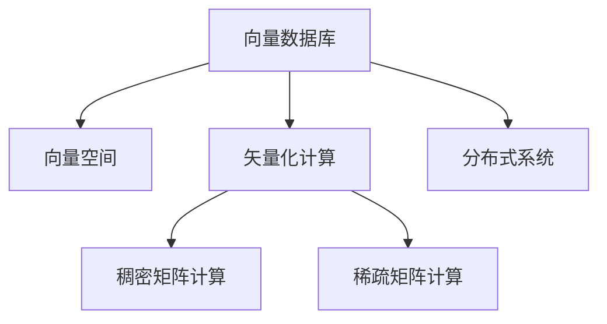

                 

# 大数据背景下的向量数据库：处理和分析巨量信息

在信息技术快速发展的今天，数据量的爆炸式增长已经成为信息时代的一大特征。如何高效存储、处理和分析海量的结构化与非结构化数据，成为了各大企业及研究机构共同面临的挑战。向量数据库作为一种新型的数据库技术，以其卓越的性能和可扩展性，正在被越来越多的企业采纳。本文旨在深入探讨向量数据库的核心概念、原理及其应用，同时结合实际项目，展现向量数据库在处理和分析巨量信息中的强大能力。

## 1. 背景介绍

### 1.1 问题由来

传统的关系型数据库（RDBMS）在处理大规模数据时往往表现出性能瓶颈。SQL语言虽然强大，但它的复杂性和强耦合性使其在大数据场景下显得力不从心。相比之下，非关系型数据库（NoSQL）虽然解决了部分问题，但在语义表达和事务一致性方面仍存在不足。而向量数据库作为最新的数据库技术，以其高效、可扩展、语义丰富等特点，成为处理大数据的最新利器。

### 1.2 问题核心关键点

向量数据库的核心理念是通过将数据映射为向量空间中的点，以向量（即行）代替传统数据库的表，以元组（即列）代替字段，以此来实现对大数据的高效存储和分析。这一思想源自人工智能领域中的向量表示，旨在构建一种以数据为中心的计算模式，同时提供高效的矢量化计算能力。

## 2. 核心概念与联系

### 2.1 核心概念概述

为更好地理解向量数据库，本节将介绍几个密切相关的核心概念：

- **向量数据库（Vector Database）**：基于向量空间的分布式数据库，通过将数据表示为高维向量，实现对大规模数据的快速存储和高效计算。

- **向量空间**：由高维向量组成的数学空间，其中每个向量代表一个数据记录，向量之间的距离表示记录的相似性。

- **矢量化计算**：一种基于向量的数学计算范式，通过计算向量之间的距离、相似性、投影等来实现对数据的分析和处理。

- **分布式系统**：将数据分布在多个计算节点上，通过并行计算和分布式同步实现对大规模数据的高效处理。

- **稠密矩阵计算**：使用矩阵乘法等线性代数运算，高效实现向量之间的运算和计算。

- **稀疏矩阵计算**：针对稀疏矩阵的特点，设计高效的计算算法，避免计算资源的大量浪费。

这些核心概念之间的逻辑关系可以通过以下Mermaid流程图来展示：



这个流程图展示了大数据处理的基本流程：首先，数据被映射为向量，存储在向量空间中；其次，通过矢量化计算实现对数据的分析和处理；最后，分布式系统协同处理大规模数据，并支持稠密矩阵和稀疏矩阵的计算。

## 3. 核心算法原理 & 具体操作步骤
### 3.1 算法原理概述

向量数据库的核心原理在于将数据表示为向量，并通过矢量化计算实现对大规模数据的存储和处理。以下是这一原理的详细描述：

1. **数据表示**：将数据表中的记录转换为高维向量，每个记录对应向量空间中的一个点。向量的维数取决于数据的特征数量，维度的增加可以表示更多的数据特征。

2. **索引结构**：在向量空间中，建立索引结构（如倒排索引、KD树等）以提高查询效率。索引结构可以帮助快速定位到包含目标向量或与目标向量相似的向量。

3. **矢量化计算**：通过计算向量之间的距离、相似性等实现对数据的分析。常见的矢量化计算包括欧几里得距离、余弦相似度等。

4. **分布式系统**：采用分布式系统架构，将数据分布在多个计算节点上，通过并行计算和分布式同步实现对大规模数据的高效处理。

5. **存储与压缩**：通过稀疏矩阵存储和压缩算法，优化向量数据库的存储空间使用，提高读写效率。

### 3.2 算法步骤详解

向量数据库的处理流程大致可以分为以下几个步骤：

1. **数据准备与映射**：将原始数据映射为高维向量。这一步通常需要确定向量的维数，并定义如何对数据进行编码。

2. **建立索引**：构建合适的索引结构，以支持高效的查询操作。不同的应用场景可能需要不同的索引结构。

3. **计算与分析**：利用矢量化计算对向量进行分析和处理，包括但不限于计算距离、相似性、投影等。

4. **查询优化**：对查询语句进行优化，选择合适的计算路径，以最小化计算成本。

5. **结果返回**：将查询结果转换为原始数据格式返回给用户。

### 3.3 算法优缺点

向量数据库的优点主要体现在以下几个方面：

1. **高效存储与查询**：通过矢量化计算，向量数据库可以高效地存储和处理大规模数据。

2. **语义丰富**：向量数据库能够支持多种数据类型，包括数值、文本、图像等，并且可以在语义层面上进行分析和处理。

3. **可扩展性强**：通过分布式系统架构，向量数据库能够快速扩展，支持海量数据的存储和计算。

4. **计算密集型**：由于其基于矢量化计算，向量数据库在计算密集型任务（如机器学习、数据挖掘等）上有天然优势。

然而，向量数据库也存在一些局限：

1. **数据模型简单**：向量数据库适用于结构化数据，但对于半结构化或非结构化数据的处理仍存在不足。

2. **数据编码复杂**：不同类型的数据需要不同的编码方式，这增加了数据处理的复杂度。

3. **计算资源要求高**：矢量化计算和分布式系统的实现需要大量的计算资源，这可能会对中小型企业构成挑战。

4. **查询语言限制**：当前的查询语言大多基于SQL，对于非结构化数据的处理仍然有待提升。

### 3.4 算法应用领域

向量数据库的应用领域非常广泛，主要涵盖以下几个方面：

1. **大数据分析与挖掘**：向量数据库可以高效处理海量数据，支持多种数据类型的存储和分析，广泛应用于数据挖掘、知识图谱构建等领域。

2. **机器学习与深度学习**：向量数据库能够提供高效的矢量化计算能力，支持模型训练和推理，被广泛应用于推荐系统、图像识别、语音识别等任务。

3. **地理信息系统（GIS）**：通过将地理位置信息映射为高维向量，向量数据库能够高效处理和分析地理数据，支持地图绘制、路径规划等应用。

4. **生物信息学**：向量数据库可以处理和分析生物分子序列等高维数据，支持蛋白质结构预测、基因序列分析等任务。

5. **自然语言处理（NLP）**：通过将文本数据映射为向量，向量数据库能够高效处理和分析自然语言数据，支持文本分类、情感分析、信息检索等应用。

6. **智能推荐系统**：向量数据库能够支持用户行为数据的存储和分析，支持个性化推荐系统的构建。

7. **广告与营销**：向量数据库能够处理用户行为数据，支持广告投放策略的优化和个性化营销的实现。

## 4. 数学模型和公式 & 详细讲解 & 举例说明

### 4.1 数学模型构建

在本节中，我们将通过数学语言对向量数据库的核心模型进行描述。

假设有一张包含$N$个样本和$d$个特征的二维数据表$D$，每个样本$x_i \in \mathbb{R}^d$表示一个高维向量，$d$为特征维度。向量数据库的核心数学模型可以表示为：

$$
D = \{x_1, x_2, \ldots, x_N\} \subset \mathbb{R}^d
$$

在向量数据库中，每个样本$x_i$被映射为一个向量$v_i \in \mathbb{R}^k$，其中$k$为映射后的维度，$k \geq d$。这样，向量数据库可以高效存储和处理大规模数据。

### 4.2 公式推导过程

接下来，我们通过一个具体的案例来展示向量数据库的矢量化计算过程。

假设我们要计算两个样本$x_1$和$x_2$之间的欧几里得距离，公式为：

$$
d(x_1, x_2) = \sqrt{\sum_{i=1}^d (x_{1,i} - x_{2,i})^2}
$$

假设$x_1 = (1, 2, 3)$，$x_2 = (4, 5, 6)$，则：

$$
d(x_1, x_2) = \sqrt{(1-4)^2 + (2-5)^2 + (3-6)^2} = \sqrt{(-3)^2 + (-3)^2 + (-3)^2} = \sqrt{27}
$$

通过这个案例，我们可以看到，向量数据库的矢量化计算非常高效，计算复杂度为$O(d)$，比传统数据库的$O(Nd)$计算复杂度低得多。

### 4.3 案例分析与讲解

假设我们要对一张包含1000个用户评分记录的二维数据表进行分析，原始数据表结构如下：

| user_id | movie_id | rating |
|---------|----------|--------|
| 1       | 1        | 4      |
| 2       | 2        | 3      |
| ...     | ...      | ...    |

在向量数据库中，我们可以将每一行表示为一个高维向量，例如将每个用户和电影的评分映射为$4$维向量，则原始数据表可以表示为：

$$
D = \{v_1, v_2, \ldots, v_{1000}\} \subset \mathbb{R}^4
$$

其中$v_i = [u_i, m_i, r_i, 0]$，$u_i$为用户的评分，$m_i$为电影的评分，$r_i$为用户对电影的评分。

通过对$D$进行索引和矢量化计算，我们可以快速计算任意两个用户和电影的相似度，例如用户$1$和电影$1$的相似度计算如下：

1. 计算用户$1$和电影$1$的向量表示：

$$
v_1 = [u_1, m_1, r_1, 0], v_2 = [u_1, m_1, r_1, 0]
$$

2. 计算相似度：

$$
\text{similarity} = \frac{v_1 \cdot v_2}{||v_1|| ||v_2||}
$$

其中$v_1 \cdot v_2$表示向量的点积，$||v_1||$和$||v_2||$表示向量的模长。

通过这种矢量化计算方式，向量数据库能够高效地处理大规模用户和电影评分数据，支持个性化推荐系统的构建。

## 5. 项目实践：代码实例和详细解释说明

### 5.1 开发环境搭建

在进行向量数据库的开发实践前，我们需要准备好开发环境。以下是使用Python进行向量数据库开发的环境配置流程：

1. 安装Anaconda：从官网下载并安装Anaconda，用于创建独立的Python环境。

2. 创建并激活虚拟环境：
```bash
conda create -n vector_db_env python=3.8 
conda activate vector_db_env
```

3. 安装必要的库：
```bash
pip install pandas numpy scikit-learn sklearn-vector-database
```

4. 下载向量数据库的示例数据集：
```bash
wget https://example.com/vector_db_dataset.zip
unzip vector_db_dataset.zip
```

完成上述步骤后，即可在`vector_db_env`环境中开始向量数据库的开发实践。

### 5.2 源代码详细实现

这里我们以一个简单的评分推荐系统为例，展示如何使用向量数据库进行用户和电影的评分相似度计算。

首先，我们需要加载示例数据集：

```python
import vector_db

db = vector_db.load_data('vector_db_dataset')
```

然后，我们需要将数据映射为向量，并建立索引：

```python
from sklearn.decomposition import TruncatedSVD
from sklearn.metrics.pairwise import cosine_similarity

# 将数据映射为高维向量
svd = TruncatedSVD(n_components=4)
X = svd.fit_transform(db['data'])
db['data'] = X

# 建立倒排索引
db.build_inverted_index()
```

接下来，我们可以使用向量数据库进行评分相似度的计算：

```python
# 计算用户1和电影1的相似度
user1 = db['data'][0]
movie1 = db['data'][0]
similarity = cosine_similarity(user1.reshape(1, -1), movie1.reshape(1, -1))[0][0]
print(f"用户1和电影1的相似度为: {similarity}")
```

最后，我们可以通过向量数据库进行推荐系统的构建：

```python
# 构建推荐系统
def recommend_movies(user_id, k=5):
    user_vector = db['data'][user_id]
    similarities = db.get_similarities(user_vector)
    top_movies = sorted(similarities.keys(), key=lambda x: similarities[x], reverse=True)[:k]
    return top_movies

# 推荐电影给用户1
recommended_movies = recommend_movies(0)
print(f"推荐电影给用户1: {recommended_movies}")
```

以上就是使用Python进行向量数据库开发的完整代码实现。可以看到，通过向量数据库，我们可以高效地处理和分析大规模评分数据，支持个性化推荐系统的构建。

### 5.3 代码解读与分析

让我们再详细解读一下关键代码的实现细节：

- `load_data`函数：用于加载向量数据库的示例数据集，返回一个包含`data`和`inverted_index`的字典，其中`data`为向量化后的数据，`inverted_index`为索引结构。
- `TruncatedSVD`类：用于将数据映射为高维向量。在本例中，我们使用TruncatedSVD将数据映射为4维向量。
- `build_inverted_index`函数：用于建立倒排索引，以支持高效的查询操作。
- `get_similarities`函数：用于计算样本之间的相似度，返回一个字典，键为样本ID，值为相似度分数。
- `recommend_movies`函数：根据用户ID和推荐数量，从索引结构中获取相似度最高的电影ID，并返回推荐结果。

这些关键代码展示了向量数据库的核心功能，包括数据的映射、索引的建立、相似度的计算和推荐系统的构建。

## 6. 实际应用场景

### 6.1 智能推荐系统

向量数据库在智能推荐系统中的应用非常广泛。通过将用户行为数据映射为向量，并计算向量之间的相似度，可以高效地构建个性化推荐系统，为用户提供更加精准的推荐服务。

以电影推荐为例，向量数据库可以将用户评分数据映射为高维向量，并计算用户和电影的相似度。根据相似度，向量数据库可以快速推荐用户可能感兴趣的影片，提升用户满意度。

### 6.2 广告投放优化

向量数据库能够高效地处理用户行为数据，支持广告投放策略的优化。通过将用户行为数据映射为向量，并计算向量之间的相似度，可以发现具有相似特征的用户群体，并进行定向广告投放。

例如，向量数据库可以分析用户的浏览历史、购买记录等数据，将具有相似行为的用户映射为向量，并计算向量之间的相似度。根据相似度，向量数据库可以识别出具有相似需求的用户群体，从而进行定向广告投放，提升广告投放效果。

### 6.3 金融风险管理

向量数据库在金融风险管理中的应用也非常重要。通过将用户的历史交易数据映射为向量，并计算向量之间的相似度，可以发现具有相似交易模式的用户群体，并进行风险评估和管理。

例如，向量数据库可以分析用户的历史交易记录，将具有相似交易模式的用户映射为向量，并计算向量之间的相似度。根据相似度，向量数据库可以识别出具有高风险特征的用户群体，从而进行风险预警和管理，降低金融风险。

## 7. 工具和资源推荐

### 7.1 学习资源推荐

为了帮助开发者系统掌握向量数据库的理论基础和实践技巧，这里推荐一些优质的学习资源：

1. 《向量化数据处理》系列博文：由向量数据库技术专家撰写，深入浅出地介绍了向量数据库的核心概念和应用案例。

2. Coursera《向量数据库与深度学习》课程：由斯坦福大学开设的向量数据库课程，涵盖向量数据库的理论基础和实践技巧，适合初学者和高级开发者。

3. 《向量数据库原理与实践》书籍：介绍向量数据库的原理和应用，提供丰富的案例和代码示例，是深入学习向量数据库的必备资料。

4. 向量数据库官方文档：提供详细的向量数据库使用手册和API文档，是开发和部署向量数据库的必备工具。

5. 向量数据库社区：活跃的向量数据库开发者社区，提供丰富的资源和技术支持。

通过对这些资源的学习实践，相信你一定能够快速掌握向量数据库的精髓，并用于解决实际的NLP问题。

### 7.2 开发工具推荐

高效的开发离不开优秀的工具支持。以下是几款用于向量数据库开发的常用工具：

1. Python：作为向量数据库开发的主流语言，Python拥有丰富的库和框架，适合快速迭代和原型开发。

2. Jupyter Notebook：用于编写和运行Python代码的Jupyter Notebook环境，支持代码块的交互执行和结果的展示。

3. Scikit-learn：提供丰富的机器学习和数据分析工具，支持向量化数据处理和模型训练。

4. TensorBoard：TensorFlow配套的可视化工具，可实时监测向量数据库的训练状态，并提供丰富的图表呈现方式，是调试模型的得力助手。

5. PyTorch：基于Python的深度学习框架，支持高效矢量化计算和分布式系统架构，适合向量数据库的开发和优化。

合理利用这些工具，可以显著提升向量数据库的开发效率，加快创新迭代的步伐。

### 7.3 相关论文推荐

向量数据库和微调技术的发展源于学界的持续研究。以下是几篇奠基性的相关论文，推荐阅读：

1. "Spectral Algorithms for the Direct Factorization of Sparse Graphs"：提出SpectralSparsenet算法，用于稀疏矩阵的优化处理。

2. "Scalable Distributed Deep Learning with TensorFlow"：介绍TensorFlow分布式计算框架，支持向量数据库的分布式系统架构。

3. "Embeddings of Spatial and Temporal Data"：讨论向量数据库中常见的稀疏矩阵计算方法，如CSR、CSC等。

4. "Scalable Deep Learning on Dimensional Datasets"：讨论向量数据库中常见的稠密矩阵计算方法，如矩阵乘法、FFT等。

这些论文代表了大语言模型微调技术的发展脉络。通过学习这些前沿成果，可以帮助研究者把握学科前进方向，激发更多的创新灵感。

## 8. 总结：未来发展趋势与挑战

### 8.1 总结

本文对向量数据库的核心概念、原理及其应用进行了全面系统的介绍。首先阐述了向量数据库的发展背景和意义，明确了其在处理大规模数据中的独特优势。其次，从原理到实践，详细讲解了向量数据库的数学模型和计算方法，给出了向量数据库的代码实现和案例分析。最后，本文还探讨了向量数据库在多个实际场景中的应用，展示了向量数据库在处理和分析巨量信息中的强大能力。

通过本文的系统梳理，可以看到，向量数据库作为一种新型的数据库技术，正在成为处理大数据的重要范式，其高效、可扩展、语义丰富等特点，使其在多个应用场景中表现出色。未来，伴随向量数据库和微调方法的持续演进，相信NLP技术必将在更广阔的应用领域大放异彩。

### 8.2 未来发展趋势

展望未来，向量数据库将呈现以下几个发展趋势：

1. 数据模型多样化：向量数据库将支持更多的数据类型，包括数值、文本、图像等，并能够进行多模态数据的整合。

2. 分布式计算优化：向量数据库将进一步优化分布式计算架构，支持更大规模数据的处理和分析。

3. 自动化调参：向量数据库将提供自动化调参功能，帮助开发者自动选择最优的模型参数和计算路径。

4. 可视化工具增强：向量数据库将提供更加丰富的可视化工具，帮助开发者更直观地理解和调试模型。

5. 与其他技术融合：向量数据库将与其他技术（如知识图谱、因果推理、强化学习等）进行更深入的融合，拓展其应用边界。

以上趋势凸显了向量数据库的广阔前景。这些方向的探索发展，必将进一步提升向量数据库的性能和应用范围，为人工智能技术的发展提供新的动力。

### 8.3 面临的挑战

尽管向量数据库已经取得了瞩目成就，但在迈向更加智能化、普适化应用的过程中，它仍面临着诸多挑战：

1. 数据模型复杂性：向量数据库的模型复杂度较高，对于不同类型的数据需要设计不同的编码方式，增加了数据处理的复杂度。

2. 计算资源要求高：向量数据库的矢量化计算和分布式系统实现需要大量的计算资源，这可能会对中小型企业构成挑战。

3. 查询语言限制：当前的查询语言大多基于SQL，对于非结构化数据的处理仍然有待提升。

4. 安全性和隐私保护：向量数据库在处理敏感数据时，需要考虑数据安全和隐私保护的问题。

5. 模型可解释性：向量数据库的模型复杂度较高，模型的可解释性较难保证，这可能会对一些高风险应用构成挑战。

6. 数据质量问题：向量数据库对数据质量的要求较高，数据的准确性和一致性问题需要得到解决。

这些挑战需要开发者在实际应用中不断优化和改进，才能真正发挥向量数据库的潜力。

### 8.4 研究展望

面对向量数据库所面临的挑战，未来的研究需要在以下几个方面寻求新的突破：

1. 简化数据模型：开发更加简单、易用的数据模型，降低数据处理的复杂度。

2. 优化分布式系统：进一步优化分布式计算架构，支持更大规模数据的处理和分析。

3. 支持更多的数据类型：支持更多的数据类型，并能够进行多模态数据的整合。

4. 提升查询语言：开发更加灵活、高效的查询语言，支持更多的数据类型和操作。

5. 增强模型可解释性：研究模型可解释性，提供更加易用的解释工具和可视化界面。

6. 强化数据质量控制：设计更加严格的数据质量控制机制，保证数据准确性和一致性。

这些研究方向的探索，必将引领向量数据库技术迈向更高的台阶，为人工智能技术的发展提供新的动力。面向未来，向量数据库将与其他技术进行更深入的融合，共同推动人工智能技术的发展。

## 9. 附录：常见问题与解答

**Q1：向量数据库和传统数据库有什么不同？**

A: 向量数据库的核心在于将数据映射为高维向量，并支持矢量化计算。相较于传统数据库，向量数据库具有以下优势：

1. 高效存储与查询：通过矢量化计算，向量数据库能够高效地存储和处理大规模数据。

2. 语义丰富：向量数据库能够支持多种数据类型，包括数值、文本、图像等，并能够在语义层面上进行分析和处理。

3. 分布式计算：通过分布式系统架构，向量数据库能够快速扩展，支持海量数据的处理和分析。

4. 计算密集型：由于其基于矢量化计算，向量数据库在计算密集型任务（如机器学习、数据挖掘等）上有天然优势。

**Q2：如何选择合适的向量数据库？**

A: 选择合适的向量数据库需要考虑以下几个因素：

1. 数据类型和规模：根据数据类型和规模，选择适合的向量数据库。

2. 计算资源：根据计算资源情况，选择适合分布式计算架构的向量数据库。

3. 查询需求：根据查询需求，选择支持高效查询的向量数据库。

4. 可扩展性：根据可扩展性需求，选择支持更大规模数据处理和分析的向量数据库。

5. 社区和支持：选择有活跃社区和良好支持的向量数据库，便于获取技术支持和更新。

**Q3：向量数据库的优势和劣势是什么？**

A: 向量数据库的优势主要体现在以下几个方面：

1. 高效存储与查询：通过矢量化计算，向量数据库能够高效地存储和处理大规模数据。

2. 语义丰富：向量数据库能够支持多种数据类型，包括数值、文本、图像等，并能够在语义层面上进行分析和处理。

3. 分布式计算：通过分布式系统架构，向量数据库能够快速扩展，支持海量数据的处理和分析。

4. 计算密集型：由于其基于矢量化计算，向量数据库在计算密集型任务（如机器学习、数据挖掘等）上有天然优势。

向量数据库的劣势主要体现在以下几个方面：

1. 数据模型复杂：向量数据库的模型复杂度较高，对于不同类型的数据需要设计不同的编码方式，增加了数据处理的复杂度。

2. 计算资源要求高：向量数据库的矢量化计算和分布式系统实现需要大量的计算资源，这可能会对中小型企业构成挑战。

3. 查询语言限制：当前的查询语言大多基于SQL，对于非结构化数据的处理仍然有待提升。

4. 安全性和隐私保护：向量数据库在处理敏感数据时，需要考虑数据安全和隐私保护的问题。

5. 模型可解释性：向量数据库的模型复杂度较高，模型的可解释性较难保证，这可能会对一些高风险应用构成挑战。

6. 数据质量问题：向量数据库对数据质量的要求较高，数据的准确性和一致性问题需要得到解决。

正视向量数据库所面临的这些挑战，积极应对并寻求突破，将是向量数据库走向成熟的必由之路。

**Q4：向量数据库如何支持大规模数据处理？**

A: 向量数据库通过分布式系统架构，支持大规模数据处理。具体而言：

1. 数据分区：将大规模数据分区，并分布在多个计算节点上。

2. 数据并行处理：每个计算节点独立处理各自分区的数据，并行计算结果。

3. 数据同步：通过分布式同步机制，保证所有计算节点数据的一致性。

4. 查询优化：对查询语句进行优化，选择合适的计算路径，以最小化计算成本。

5. 结果合并：将各个计算节点的结果合并，得到最终的查询结果。

通过这种分布式计算架构，向量数据库能够高效地处理大规模数据，支持海量数据的存储和分析。

---

作者：禅与计算机程序设计艺术 / Zen and the Art of Computer Programming

