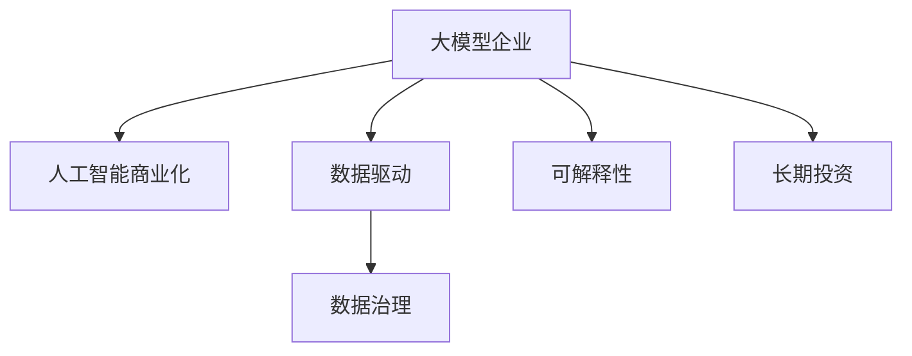

                 

# 大模型企业的商业模式创新之路

> 关键词：大模型企业, 商业模式创新, 数据驱动, 人工智能商业化, 可解释性, 数据治理, 长期投资

## 1. 背景介绍

### 1.1 问题由来
随着人工智能技术的不断进步，尤其是深度学习和大模型技术的发展，越来越多的企业开始重视利用人工智能技术提升业务能力。大模型企业，即那些以大型深度学习模型为核心竞争力的企业，如OpenAI、DeepMind、百度AI等，正成为新的行业领导者。

大模型企业在商业上的成功，不仅依赖于其技术实力，更依赖于其创新的商业模式。这些企业通过数据驱动、持续创新、可解释性和数据治理等多方面的努力，成功实现了技术的商业化应用，并获得了显著的市场回报。

### 1.2 问题核心关键点
大模型企业的商业模式创新，主要集中在以下几个关键点：

- **数据驱动**：通过大规模数据收集和处理，构建高质量的数据集，驱动模型的持续优化和升级。
- **人工智能商业化**：将技术成果转化为可行的商业应用，实现产品化、服务化和规模化。
- **可解释性**：使模型输出具有可解释性，增强用户信任，提高模型的应用可靠性。
- **数据治理**：建立完善的数据治理机制，保障数据安全和合规，提升数据利用效率。
- **长期投资**：投资于长期技术研发和人才培养，保持企业技术的领先地位。

这些关键点构成了一个企业成功应用人工智能技术的商业模式，下面将对每个关键点进行详细分析。

## 2. 核心概念与联系

### 2.1 核心概念概述

为更好地理解大模型企业的商业模式创新，本节将介绍几个密切相关的核心概念：

- **大模型企业**：以大型深度学习模型为核心竞争力的企业，如OpenAI、DeepMind、百度AI等。
- **人工智能商业化**：将人工智能技术转化为商业应用的过程，包括产品化、服务化、规模化等。
- **数据驱动**：利用大规模数据训练和优化模型，驱动技术进步和应用效果提升。
- **可解释性**：使模型输出具有逻辑可解释性，增强用户信任和应用可靠性。
- **数据治理**：制定数据标准、规范和安全管理政策，保障数据隐私和安全。
- **长期投资**：对人工智能技术的持续研发和人才培养进行长期投入，保持技术领先。

这些核心概念之间的逻辑关系可以通过以下Mermaid流程图来展示：



这个流程图展示了大模型企业商业模式创新的关键要素及其之间的关系：

1. 大模型企业通过数据驱动，构建高质量数据集，驱动技术不断进步。
2. 利用人工智能商业化手段，将技术转化为实际应用，实现产品化、服务化和规模化。
3. 通过数据治理保障数据安全和合规，提升数据利用效率。
4. 具备可解释性，增强用户信任，提升应用可靠性。
5. 进行长期投资，保持技术领先地位。

这些关键要素共同构成了大模型企业的商业模式创新框架，使其能够在技术应用和商业化过程中取得成功。

## 3. 核心算法原理 & 具体操作步骤
### 3.1 算法原理概述

大模型企业的商业模式创新，从根本上依赖于其核心算法和技术实力的提升。以下是主要涉及的核心算法原理：

- **深度学习模型**：如卷积神经网络(CNN)、循环神经网络(RNN)、变换器(Transformer)等，为大规模数据处理和模型优化提供了基础。
- **迁移学习**：通过在大规模数据上预训练模型，并在特定任务上进行微调，提升模型性能。
- **强化学习**：通过与环境的交互，优化模型参数，提升模型适应复杂任务的能力。
- **无监督学习**：通过无标签数据训练模型，发现数据中的隐含结构，提升模型泛化能力。

### 3.2 算法步骤详解

大模型企业的商业模式创新，包括以下几个关键步骤：

**Step 1: 数据收集与处理**
- 收集和处理大规模数据，构建高质量的数据集。数据应包含不同场景、不同来源的样本，以覆盖各种应用场景。

**Step 2: 模型预训练**
- 利用大规模无标签数据训练大模型，提升模型的通用性和泛化能力。预训练通常在大规模高性能计算资源上完成。

**Step 3: 任务适配**
- 将预训练模型应用到特定任务上，通过有监督数据进行微调，优化模型在特定任务上的性能。微调可以使用小批量数据，在相对较少的计算资源下完成。

**Step 4: 商业化应用**
- 将微调后的模型应用到实际业务场景中，开发出可用的产品或服务，实现商业化应用。

**Step 5: 数据治理**
- 制定数据管理政策，保障数据安全和合规，提升数据利用效率。

**Step 6: 长期投资**
- 持续投资于技术研发和人才培养，保持技术领先。

### 3.3 算法优缺点

大模型企业的商业模式创新，主要具有以下优点：

- **技术优势**：利用深度学习、迁移学习、强化学习等先进算法，提高模型性能。
- **数据驱动**：通过大规模数据驱动模型优化，提升模型泛化能力。
- **商业化能力**：将技术转化为实际应用，实现产品化、服务化和规模化。

同时，也存在以下局限性：

- **高成本**：大规模数据收集和处理、高性能计算资源、长期投资等都需要大量成本投入。
- **模型复杂性**：深度学习模型复杂度高，训练和调试难度大。
- **数据隐私**：大规模数据处理可能涉及用户隐私保护问题，需严格遵守数据保护法规。

### 3.4 算法应用领域

大模型企业的商业模式创新，广泛应用在多个领域，包括但不限于：

- **智能客服**：利用大模型构建智能客服系统，提供24小时不间断服务。
- **金融分析**：通过大模型进行金融舆情监测、风险评估等，提升金融决策的精准度。
- **医疗诊断**：利用大模型进行医学影像分析和病理诊断，提升医疗服务的效率和准确性。
- **自动驾驶**：构建自动驾驶系统，提高交通安全的水平和驾驶体验。
- **个性化推荐**：通过大模型进行用户兴趣预测和内容推荐，提升用户体验和满意度。
- **安全监控**：利用大模型进行视频监控、网络安全威胁检测，提高安全防护水平。

这些应用领域展示了大模型企业的商业模式创新在实际中的应用前景，也为更多企业提供了参考。

## 4. 数学模型和公式 & 详细讲解 & 举例说明

### 4.1 数学模型构建

大模型企业的商业模式创新，从根本上依赖于其核心算法和技术实力的提升。以下是主要涉及的核心算法原理：

- **深度学习模型**：如卷积神经网络(CNN)、循环神经网络(RNN)、变换器(Transformer)等，为大规模数据处理和模型优化提供了基础。
- **迁移学习**：通过在大规模数据上预训练模型，并在特定任务上进行微调，提升模型性能。
- **强化学习**：通过与环境的交互，优化模型参数，提升模型适应复杂任务的能力。
- **无监督学习**：通过无标签数据训练模型，发现数据中的隐含结构，提升模型泛化能力。

### 4.2 公式推导过程

以下我们以深度学习模型为例，推导其基本原理和公式。

假设深度学习模型为 $f(x; \theta) = \phi(\mathcal{W}x + \mathcal{b})$，其中 $\phi$ 为激活函数，$\mathcal{W}$ 和 $\mathcal{b}$ 为模型参数，$x$ 为输入数据。模型的目标是通过最小化损失函数 $\mathcal{L}(y, \hat{y})$，使得模型输出 $\hat{y}$ 逼近真实标签 $y$。

常用的损失函数包括均方误差损失、交叉熵损失等。例如，交叉熵损失函数为：

$$
\mathcal{L}(y, \hat{y}) = -\frac{1}{N} \sum_{i=1}^N y_i \log \hat{y}_i
$$

其中 $N$ 为样本数量，$y_i$ 为第 $i$ 个样本的真实标签，$\hat{y}_i$ 为模型对第 $i$ 个样本的预测概率。

模型的梯度更新公式为：

$$
\theta \leftarrow \theta - \eta \nabla_{\theta}\mathcal{L}(y, \hat{y})
$$

其中 $\eta$ 为学习率，$\nabla_{\theta}\mathcal{L}(y, \hat{y})$ 为损失函数对参数 $\theta$ 的梯度。

通过上述公式，模型可以不断迭代更新，优化输出结果，逼近真实标签。这一过程在大模型企业的商业模式创新中，从数据驱动和人工智能商业化等多个方面发挥了重要作用。

### 4.3 案例分析与讲解

以下以智能客服系统为例，详细分析大模型企业在其中的应用。

**案例背景**：
某智能客服系统利用大模型进行智能客服聊天，提升客服效率和用户体验。

**数据处理**：
- 收集历史客服聊天记录，构建训练集和测试集。
- 将对话内容转化为模型输入，将标签转化为模型输出。

**模型训练**：
- 使用深度学习模型，如Transformer，对客服聊天记录进行预训练。
- 在微调阶段，使用标注数据对模型进行微调，提升模型在特定任务上的性能。

**模型部署**：
- 将微调后的模型部署到实时客服系统中，提供24小时不间断服务。
- 集成对话历史、用户画像等多维度信息，提升对话效果。

**效果评估**：
- 使用NLP指标（如BLEU、ROUGE等）评估模型性能。
- 收集用户反馈，优化模型输出。

通过这个案例，我们可以看到，大模型企业在智能客服系统的应用中，通过数据驱动和人工智能商业化手段，成功实现了技术的落地和商业化应用。

## 5. 项目实践：代码实例和详细解释说明
### 5.1 开发环境搭建

在进行智能客服系统的开发前，我们需要准备好开发环境。以下是使用Python进行PyTorch开发的环境配置流程：

1. 安装Anaconda：从官网下载并安装Anaconda，用于创建独立的Python环境。

2. 创建并激活虚拟环境：
```bash
conda create -n pytorch-env python=3.8 
conda activate pytorch-env
```

3. 安装PyTorch：根据CUDA版本，从官网获取对应的安装命令。例如：
```bash
conda install pytorch torchvision torchaudio cudatoolkit=11.1 -c pytorch -c conda-forge
```

4. 安装相关库：
```bash
pip install scikit-learn pandas transformers
```

完成上述步骤后，即可在`pytorch-env`环境中开始微调实践。

### 5.2 源代码详细实现

下面我们以智能客服系统为例，给出使用Transformers库对BERT模型进行微调的PyTorch代码实现。

```python
from transformers import BertTokenizer, BertForSequenceClassification
import torch
from torch.utils.data import Dataset, DataLoader

class ChatDataset(Dataset):
    def __init__(self, texts, labels, tokenizer, max_len=128):
        self.texts = texts
        self.labels = labels
        self.tokenizer = tokenizer
        self.max_len = max_len
        
    def __len__(self):
        return len(self.texts)
    
    def __getitem__(self, item):
        text = self.texts[item]
        label = self.labels[item]
        
        encoding = self.tokenizer(text, return_tensors='pt', max_length=self.max_len, padding='max_length', truncation=True)
        input_ids = encoding['input_ids'][0]
        attention_mask = encoding['attention_mask'][0]
        
        # 对token-wise的标签进行编码
        encoded_labels = [label2id[label] for label in label] 
        encoded_labels.extend([label2id['O']] * (self.max_len - len(encoded_labels)))
        labels = torch.tensor(encoded_labels, dtype=torch.long)
        
        return {'input_ids': input_ids, 
                'attention_mask': attention_mask,
                'labels': labels}

# 标签与id的映射
label2id = {'O': 0, 'positive': 1, 'negative': 2}

# 创建dataset
tokenizer = BertTokenizer.from_pretrained('bert-base-cased')

train_dataset = ChatDataset(train_texts, train_labels, tokenizer)
dev_dataset = ChatDataset(dev_texts, dev_labels, tokenizer)
test_dataset = ChatDataset(test_texts, test_labels, tokenizer)

model = BertForSequenceClassification.from_pretrained('bert-base-cased', num_labels=len(label2id))

optimizer = torch.optim.AdamW(model.parameters(), lr=2e-5)

device = torch.device('cuda') if torch.cuda.is_available() else torch.device('cpu')
model.to(device)

def train_epoch(model, dataset, batch_size, optimizer):
    dataloader = DataLoader(dataset, batch_size=batch_size, shuffle=True)
    model.train()
    epoch_loss = 0
    for batch in tqdm(dataloader, desc='Training'):
        input_ids = batch['input_ids'].to(device)
        attention_mask = batch['attention_mask'].to(device)
        labels = batch['labels'].to(device)
        model.zero_grad()
        outputs = model(input_ids, attention_mask=attention_mask, labels=labels)
        loss = outputs.loss
        epoch_loss += loss.item()
        loss.backward()
        optimizer.step()
    return epoch_loss / len(dataloader)

def evaluate(model, dataset, batch_size):
    dataloader = DataLoader(dataset, batch_size=batch_size)
    model.eval()
    preds, labels = [], []
    with torch.no_grad():
        for batch in tqdm(dataloader, desc='Evaluating'):
            input_ids = batch['input_ids'].to(device)
            attention_mask = batch['attention_mask'].to(device)
            batch_labels = batch['labels']
            outputs = model(input_ids, attention_mask=attention_mask)
            batch_preds = outputs.logits.argmax(dim=2).to('cpu').tolist()
            batch_labels = batch_labels.to('cpu').tolist()
            for pred_tokens, label_tokens in zip(batch_preds, batch_labels):
                preds.append(pred_tokens[:len(label_tokens)])
                labels.append(label_tokens)
                
    print(classification_report(labels, preds))

epochs = 5
batch_size = 16

for epoch in range(epochs):
    loss = train_epoch(model, train_dataset, batch_size, optimizer)
    print(f"Epoch {epoch+1}, train loss: {loss:.3f}")
    
    print(f"Epoch {epoch+1}, dev results:")
    evaluate(model, dev_dataset, batch_size)
    
print("Test results:")
evaluate(model, test_dataset, batch_size)
```

以上就是使用PyTorch对BERT进行智能客服系统微调的完整代码实现。可以看到，得益于Transformers库的强大封装，我们可以用相对简洁的代码完成BERT模型的加载和微调。

### 5.3 代码解读与分析

让我们再详细解读一下关键代码的实现细节：

**ChatDataset类**：
- `__init__`方法：初始化文本、标签、分词器等关键组件。
- `__len__`方法：返回数据集的样本数量。
- `__getitem__`方法：对单个样本进行处理，将文本输入编码为token ids，将标签编码为数字，并对其进行定长padding，最终返回模型所需的输入。

**label2id字典**：
- 定义了标签与数字id之间的映射关系，用于将token-wise的预测结果解码回真实的标签。

**训练和评估函数**：
- 使用PyTorch的DataLoader对数据集进行批次化加载，供模型训练和推理使用。
- 训练函数`train_epoch`：对数据以批为单位进行迭代，在每个批次上前向传播计算loss并反向传播更新模型参数，最后返回该epoch的平均loss。
- 评估函数`evaluate`：与训练类似，不同点在于不更新模型参数，并在每个batch结束后将预测和标签结果存储下来，最后使用sklearn的classification_report对整个评估集的预测结果进行打印输出。

**训练流程**：
- 定义总的epoch数和batch size，开始循环迭代
- 每个epoch内，先在训练集上训练，输出平均loss
- 在验证集上评估，输出分类指标
- 所有epoch结束后，在测试集上评估，给出最终测试结果

可以看到，PyTorch配合Transformers库使得BERT微调的代码实现变得简洁高效。开发者可以将更多精力放在数据处理、模型改进等高层逻辑上，而不必过多关注底层的实现细节。

当然，工业级的系统实现还需考虑更多因素，如模型的保存和部署、超参数的自动搜索、更灵活的任务适配层等。但核心的微调范式基本与此类似。

## 6. 实际应用场景
### 6.1 智能客服系统

基于大模型企业的数据驱动和人工智能商业化手段，智能客服系统已经广泛应用于各大企业，为提升客服效率和用户体验提供了强大的技术支持。

**应用场景**：
- 智能问答：通过大模型对用户咨询内容进行分析，快速给出答案。
- 用户画像：通过大模型分析用户历史行为和文本数据，构建用户画像，提升个性化服务。
- 情感分析：通过大模型对用户情绪进行识别，及时调整服务策略，提升用户体验。

**技术实现**：
- 收集历史客服聊天记录，构建训练集和测试集。
- 使用BERT等深度学习模型进行预训练，微调模型以适应特定任务。
- 将微调后的模型部署到实时客服系统中，集成对话历史、用户画像等多维度信息，提供24小时不间断服务。

通过这个应用场景，我们可以看到，大模型企业通过数据驱动和人工智能商业化手段，成功实现了智能客服系统的落地和商业化应用，极大地提升了客服效率和用户体验。

### 6.2 金融分析

大模型企业在金融分析领域的应用，也展现出了强大的数据驱动和人工智能商业化能力。

**应用场景**：
- 舆情监测：通过大模型对金融市场舆情进行监测，提前发现潜在风险。
- 风险评估：通过大模型对金融产品风险进行评估，提供精准的风险预警。
- 投资决策：通过大模型对市场数据进行分析，提供有价值的投资建议。

**技术实现**：
- 收集金融市场数据，构建训练集和测试集。
- 使用深度学习模型进行预训练，微调模型以适应特定任务。
- 将微调后的模型部署到金融分析系统中，提供实时金融市场分析和投资建议。

通过这个应用场景，我们可以看到，大模型企业通过数据驱动和人工智能商业化手段，成功实现了金融分析系统的落地和商业化应用，为金融机构提供精准的市场分析和投资建议，提升了金融决策的准确性和可靠性。

### 6.3 医疗诊断

大模型企业在医疗诊断领域的应用，也展现出了强大的数据驱动和人工智能商业化能力。

**应用场景**：
- 医学影像分析：通过大模型对医学影像进行分析，提供精准的诊断结果。
- 病历分析：通过大模型对病历数据进行分析，提供个性化的治疗方案。
- 药物研发：通过大模型对药物数据进行分析，加速新药研发进程。

**技术实现**：
- 收集医学影像和病历数据，构建训练集和测试集。
- 使用深度学习模型进行预训练，微调模型以适应特定任务。
- 将微调后的模型部署到医疗诊断系统中，提供精准的诊断和治疗方案。

通过这个应用场景，我们可以看到，大模型企业通过数据驱动和人工智能商业化手段，成功实现了医疗诊断系统的落地和商业化应用，提升了医疗服务的效率和准确性。

## 7. 工具和资源推荐
### 7.1 学习资源推荐

为了帮助开发者系统掌握大模型企业的商业模式创新，这里推荐一些优质的学习资源：

1. 《Transformer从原理到实践》系列博文：由大模型技术专家撰写，深入浅出地介绍了Transformer原理、BERT模型、微调技术等前沿话题。

2. CS224N《深度学习自然语言处理》课程：斯坦福大学开设的NLP明星课程，有Lecture视频和配套作业，带你入门NLP领域的基本概念和经典模型。

3. 《Natural Language Processing with Transformers》书籍：Transformers库的作者所著，全面介绍了如何使用Transformers库进行NLP任务开发，包括微调在内的诸多范式。

4. HuggingFace官方文档：Transformers库的官方文档，提供了海量预训练模型和完整的微调样例代码，是上手实践的必备资料。

5. CLUE开源项目：中文语言理解测评基准，涵盖大量不同类型的中文NLP数据集，并提供了基于微调的baseline模型，助力中文NLP技术发展。

通过对这些资源的学习实践，相信你一定能够快速掌握大模型企业的商业模式创新的精髓，并用于解决实际的NLP问题。
###  7.2 开发工具推荐

高效的开发离不开优秀的工具支持。以下是几款用于大模型企业商业模式创新开发的常用工具：

1. PyTorch：基于Python的开源深度学习框架，灵活动态的计算图，适合快速迭代研究。大部分预训练语言模型都有PyTorch版本的实现。

2. TensorFlow：由Google主导开发的开源深度学习框架，生产部署方便，适合大规模工程应用。同样有丰富的预训练语言模型资源。

3. Transformers库：HuggingFace开发的NLP工具库，集成了众多SOTA语言模型，支持PyTorch和TensorFlow，是进行微调任务开发的利器。

4. Weights & Biases：模型训练的实验跟踪工具，可以记录和可视化模型训练过程中的各项指标，方便对比和调优。与主流深度学习框架无缝集成。

5. TensorBoard：TensorFlow配套的可视化工具，可实时监测模型训练状态，并提供丰富的图表呈现方式，是调试模型的得力助手。

6. Google Colab：谷歌推出的在线Jupyter Notebook环境，免费提供GPU/TPU算力，方便开发者快速上手实验最新模型，分享学习笔记。

合理利用这些工具，可以显著提升大模型企业商业模式创新任务的开发效率，加快创新迭代的步伐。

### 7.3 相关论文推荐

大模型企业商业模式创新的发展源于学界的持续研究。以下是几篇奠基性的相关论文，推荐阅读：

1. Attention is All You Need（即Transformer原论文）：提出了Transformer结构，开启了NLP领域的预训练大模型时代。

2. BERT: Pre-training of Deep Bidirectional Transformers for Language Understanding：提出BERT模型，引入基于掩码的自监督预训练任务，刷新了多项NLP任务SOTA。

3. Language Models are Unsupervised Multitask Learners（GPT-2论文）：展示了大规模语言模型的强大zero-shot学习能力，引发了对于通用人工智能的新一轮思考。

4. Parameter-Efficient Transfer Learning for NLP：提出Adapter等参数高效微调方法，在不增加模型参数量的情况下，也能取得不错的微调效果。

5. Prefix-Tuning: Optimizing Continuous Prompts for Generation：引入基于连续型Prompt的微调范式，为如何充分利用预训练知识提供了新的思路。

6. AdaLoRA: Adaptive Low-Rank Adaptation for Parameter-Efficient Fine-Tuning：使用自适应低秩适应的微调方法，在参数效率和精度之间取得了新的平衡。

这些论文代表了大模型企业商业模式创新的发展脉络。通过学习这些前沿成果，可以帮助研究者把握学科前进方向，激发更多的创新灵感。

## 8. 总结：未来发展趋势与挑战
### 8.1 总结

本文对大模型企业的商业模式创新进行了全面系统的介绍。首先阐述了企业成功应用人工智能技术的商业模式，明确了数据驱动、人工智能商业化、可解释性、数据治理和长期投资等关键要素。其次，从原理到实践，详细讲解了数据驱动、人工智能商业化等核心算法和具体操作步骤，给出了微调任务开发的完整代码实例。同时，本文还广泛探讨了智能客服、金融分析、医疗诊断等诸多领域的应用前景，展示了大模型企业在商业模式创新方面的强大实力。

通过本文的系统梳理，可以看到，大模型企业的商业模式创新正在成为NLP领域的重要范式，极大地拓展了预训练语言模型的应用边界，为传统行业带来了变革性影响。未来，随着大模型技术的不断进步，基于数据的商业模式创新将进一步推动人工智能技术的广泛应用，深刻影响人类生产生活方式。

### 8.2 未来发展趋势

展望未来，大模型企业的商业模式创新将呈现以下几个发展趋势：

1. **数据驱动和商业化能力增强**：随着数据收集和处理技术的进步，企业将能够获取更加丰富、高质量的数据集，驱动模型性能不断提升。同时，企业也将更加注重模型的商业化应用，开发出更多可行的产品和服务。

2. **可解释性和数据治理加强**：随着模型复杂度的增加，用户对模型的可解释性和数据隐私保护的要求也在不断提高。企业将加强模型的可解释性和数据治理，提升用户信任和合规性。

3. **多模态学习和跨领域应用**：未来的模型将能够更好地融合多模态数据，提升对复杂任务的理解和处理能力。同时，企业也将拓展跨领域应用，提升模型的泛化能力和应用范围。

4. **持续学习和适应性增强**：随着数据的不断更新，模型需要持续学习和适应新环境，保持性能的稳定性和鲁棒性。企业将加强模型的持续学习机制，确保模型能够不断吸收新知识，避免过拟合。

5. **隐私保护和伦理约束**：随着数据隐私保护法规的不断完善，企业将更加注重数据隐私保护和伦理约束，保障用户隐私和模型应用的合规性。

以上趋势凸显了大模型企业在商业模式创新方面的广阔前景。这些方向的探索发展，必将进一步提升模型的性能和应用范围，推动人工智能技术在更多领域落地应用。

### 8.3 面临的挑战

尽管大模型企业在商业模式创新方面取得了显著成绩，但在迈向更加智能化、普适化应用的过程中，仍面临诸多挑战：

1. **高成本和资源消耗**：大规模数据收集和处理、高性能计算资源、长期投资等都需要大量成本投入。如何降低成本，提升资源利用效率，仍是一个重要挑战。

2. **模型复杂性和调试难度**：深度学习模型复杂度高，训练和调试难度大，如何简化模型结构，提高模型调优效率，仍需进一步研究。

3. **数据隐私和合规性**：大规模数据处理可能涉及用户隐私保护问题，需严格遵守数据保护法规。如何确保数据隐私和合规性，仍需持续关注。

4. **模型鲁棒性和可解释性**：大规模数据训练的模型可能存在过拟合和偏见问题，如何提高模型的鲁棒性和可解释性，仍需进一步探索。

5. **技术演进和人才储备**：人工智能技术快速演进，企业需不断进行技术更新和人才培养，保持技术领先。如何建立长期的人才培养机制，提升团队竞争力，仍需积极探索。

6. **应用场景和业务融合**：如何将人工智能技术更好地融入实际业务场景，提升用户体验和业务价值，仍需深入研究和探索。

这些挑战需要企业积极应对，不断优化商业模式，提升技术实力，以实现人工智能技术的全面落地应用。

### 8.4 研究展望

面对大模型企业在商业模式创新面临的挑战，未来的研究需要在以下几个方面寻求新的突破：

1. **数据驱动和商业化优化**：如何更高效地利用数据，提升模型性能和商业化应用效果，将是未来的重要研究方向。

2. **模型可解释性和隐私保护**：如何提升模型的可解释性和数据隐私保护能力，增强用户信任，保障合规性，将是未来的重要课题。

3. **多模态学习和跨领域应用**：如何更好地融合多模态数据，拓展跨领域应用，提升模型的泛化能力和应用范围，将是未来的重要方向。

4. **持续学习和适应性提升**：如何增强模型的持续学习机制，提高模型的稳定性和鲁棒性，将是未来的重要研究内容。

5. **技术演进和人才储备**：如何持续进行技术更新和人才培养，提升团队竞争力，将是未来的重要研究方向。

6. **应用场景和业务融合**：如何更好地将人工智能技术融入实际业务场景，提升用户体验和业务价值，将是未来的重要研究方向。

这些研究方向的探索，必将引领大模型企业商业模式创新的进步，推动人工智能技术的广泛应用，为经济社会发展注入新的动力。面向未来，大模型企业商业模式创新需要进一步优化数据驱动和商业化手段，提升模型性能和应用效果，同时注重模型的可解释性和数据隐私保护，实现人工智能技术的全面落地应用。

