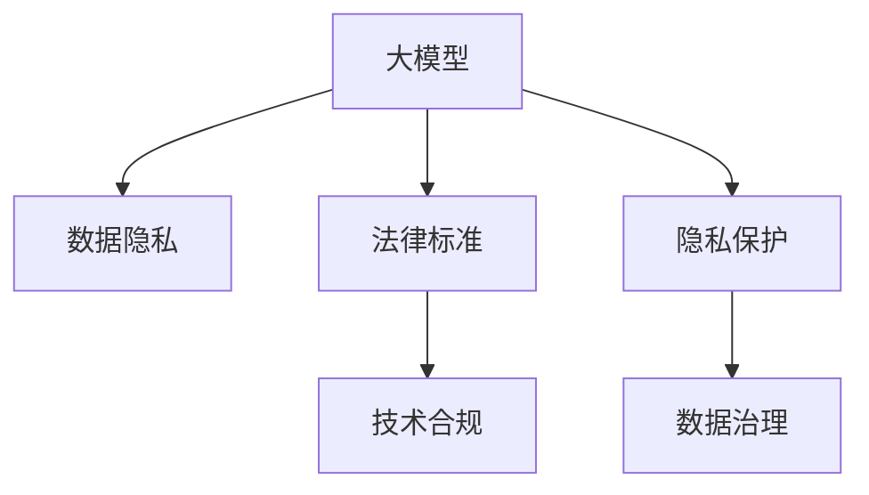

                 

# 大模型企业的国际化合规

> 关键词：大模型, 国际化合规, 数据隐私, 法律标准, 技术合规, 隐私保护, 数据治理

## 1. 背景介绍

### 1.1 问题由来
随着人工智能技术和大模型的广泛应用，越来越多的企业开始使用大模型进行产品创新和业务扩展。然而，大模型涉及到的数据处理、模型训练、部署和应用，跨越了多个国家，面临着复杂的国际法律和隐私保护问题。企业如何在确保合规的前提下，充分利用大模型的优势，成为一个迫切需要解决的问题。

### 1.2 问题核心关键点
大模型企业国际化合规的核心在于如何在大模型应用的各个环节中，确保符合国际法律和隐私保护标准，特别是在数据跨境传输、隐私保护、用户同意等方面。以下是几个关键的合规问题：

- **数据隐私**：企业在处理用户数据时，需要严格遵守国际数据隐私法规，如GDPR、CCPA等，确保数据的合法收集、存储和使用。
- **法律标准**：不同国家和地区有不同的法律法规，企业需要综合考虑，确保在所有适用的司法管辖区都符合法律要求。
- **技术合规**：大模型涉及到的技术细节，如数据加密、访问控制、监控审计等，都需要符合国际标准和技术规范。
- **隐私保护**：企业需要在保护个人隐私和用户权益的同时，确保模型性能和用户体验。
- **数据治理**：建立完善的数据治理框架，明确数据的来源、使用范围、存储期限等，保障数据的安全性和合规性。

### 1.3 问题研究意义
大模型企业的国际化合规研究具有重要意义：

1. **降低合规风险**：帮助企业识别和应对潜在的合规风险，避免因合规问题导致的法律纠纷和经济损失。
2. **提升用户信任**：通过合规措施，增强用户对企业处理数据的信任感，提升品牌声誉。
3. **促进全球业务拓展**：确保大模型应用符合国际标准，有助于企业在全球范围内拓展业务，进入新市场。
4. **保障数据安全**：合规措施有助于加强数据保护，防止数据泄露和滥用，保护企业资产和用户隐私。
5. **促进国际合作**：合规能够促进企业与国际合作伙伴的合作，提高国际化运营的效率和水平。

## 2. 核心概念与联系

### 2.1 核心概念概述

为更好地理解大模型企业国际化合规的问题，本节将介绍几个密切相关的核心概念：

- **大模型 (Large Models)**：指基于深度学习技术的复杂模型，如BERT、GPT-3等，具有强大的数据分析和处理能力。
- **国际化合规 (International Compliance)**：指企业在跨国运营中，需要遵守不同国家和地区的法律法规，确保其业务活动符合国际标准。
- **数据隐私 (Data Privacy)**：指保护个人或企业数据不被未经授权的访问、使用或泄露。
- **法律标准 (Legal Standards)**：指各国法律法规和国际协议，如GDPR、CCPA、ISO/IEC 27001等。
- **技术合规 (Technical Compliance)**：指技术系统在设计和实现上符合法律法规和行业标准。
- **隐私保护 (Privacy Protection)**：指通过技术和管理措施，保护数据隐私，确保数据处理的透明性和可控性。
- **数据治理 (Data Governance)**：指建立数据管理框架，确保数据的质量、完整性和合规性，防范数据风险。

这些概念之间的逻辑关系可以通过以下Mermaid流程图来展示：



这个流程图展示了大模型企业国际化合规的核心概念及其之间的关系：

1. 大模型通过处理数据获得知识，这些数据涉及隐私保护。
2. 法律标准规定了处理数据的规则和边界。
3. 技术合规确保这些数据处理过程符合法律法规。
4. 隐私保护关注数据处理的透明性和用户权利。
5. 数据治理框架保障数据处理的全面性和合规性。

## 3. 核心算法原理 & 具体操作步骤
### 3.1 算法原理概述

大模型企业的国际化合规，本质上是通过一系列算法和流程，确保数据处理和模型应用符合国际法律和隐私保护标准。其核心思想是：在大模型应用的各个环节，实施全面的合规策略，包括数据收集、处理、存储、传输和删除等，确保数据隐私和法律合规。

形式化地，假设企业使用大模型 $M$，涉及到的数据集为 $D$，法律合规要求为 $L$。则合规过程的目标是找到最优的合规策略 $\pi$，使得：

$$
\pi^* = \mathop{\arg\min}_{\pi} \mathcal{C}(\pi) + \mathcal{L}(\pi)
$$

其中 $\mathcal{C}(\pi)$ 为合规成本，$\mathcal{L}(\pi)$ 为法律风险。通过最小化总成本和风险，找到最优的合规策略。

### 3.2 算法步骤详解

大模型企业的国际化合规，一般包括以下几个关键步骤：

**Step 1: 数据隐私评估**

- 收集涉及到的所有数据，进行隐私影响评估(Privacy Impact Assessment, PIA)，识别潜在的数据隐私风险。
- 根据GDPR、CCPA等国际标准，分析数据处理过程中的隐私风险，制定风险缓解措施。

**Step 2: 法律合规设计**

- 根据目标市场的法律法规，设计合规的业务流程和数据处理策略。
- 确保数据跨境传输符合国际数据传输标准，如欧盟的数据传输规则。

**Step 3: 技术合规实施**

- 采用数据加密、访问控制、监控审计等技术措施，保障数据安全。
- 设计数据流向图，记录数据的采集、存储、传输和删除路径，确保透明性和可控性。

**Step 4: 隐私保护策略**

- 设计隐私保护机制，如匿名化、差分隐私等，保护个人隐私。
- 确保用户数据的收集、使用和删除符合用户同意和数据最小化原则。

**Step 5: 数据治理框架**

- 建立数据治理团队，负责数据政策的制定、实施和监督。
- 设计数据生命周期管理策略，明确数据的收集、存储、使用和删除规则。

**Step 6: 合规监测与审计**

- 建立合规监测机制，定期审查数据处理流程和模型应用，确保合规性。
- 进行内部和外部合规审计，评估合规策略的有效性，提出改进建议。

### 3.3 算法优缺点

大模型企业的国际化合规方法具有以下优点：

1. **系统性**：通过全面的合规策略，涵盖数据隐私、法律标准、技术合规、隐私保护和数据治理，形成系统化的合规框架。
2. **透明度**：明确数据处理流程和合规策略，增强用户和监管机构的信任。
3. **可控性**：通过技术和管理措施，确保数据处理的透明性和可控性，防止数据滥用和泄露。
4. **风险降低**：通过全面的合规措施，降低合规风险，避免法律纠纷和数据泄露。

同时，该方法也存在一定的局限性：

1. **成本高**：合规成本较高，需要投入大量资源进行隐私评估、法律合规设计、技术实施等。
2. **复杂度高**：不同国家和地区的法律法规不同，合规设计和管理复杂。
3. **技术挑战**：需要采用先进的技术手段，如数据加密、差分隐私等，实施技术合规。
4. **变化频繁**：法律法规和隐私标准不断变化，需要持续更新合规策略，保持合规性。

尽管存在这些局限性，但就目前而言，大模型企业的国际化合规仍然是大模型应用的重要组成部分，是企业跨越国界、拓展业务的基础保障。

### 3.4 算法应用领域

大模型企业的国际化合规方法，广泛应用于以下领域：

- **金融科技**：金融行业对数据隐私和安全要求较高，使用大模型进行风险评估、欺诈检测、客户服务等，需要严格的合规措施。
- **医疗健康**：医疗数据涉及个人隐私，使用大模型进行疾病预测、诊断分析等，需要符合GDPR等数据隐私法规。
- **零售电商**：零售企业收集大量用户数据，使用大模型进行个性化推荐、用户行为分析等，需要遵循CCPA等法律法规。
- **智能制造**：智能制造需要处理大量工业数据，使用大模型进行设备预测性维护、质量控制等，需要符合ISO/IEC 27001等标准。
- **公共安全**：政府和企业使用大模型进行视频监控、犯罪分析等，需要符合国家安全和隐私保护法规。

除了上述这些领域，大模型企业国际化合规方法也在更多行业领域得到应用，为企业的国际化发展提供了有力支持。

## 4. 数学模型和公式 & 详细讲解  
### 4.1 数学模型构建

大模型企业的国际化合规，可以通过构建数学模型来描述合规过程。以下是一个简单的合规成本模型：

假设合规成本为 $C$，包括隐私保护成本 $C_{\text{privacy}}$ 和技术合规成本 $C_{\text{tech}}$。根据数据量 $D$ 和法律标准 $L$，合规成本可以表示为：

$$
C = C_{\text{privacy}}(D, L) + C_{\text{tech}}(D, L)
$$

其中 $C_{\text{privacy}}$ 和 $C_{\text{tech}}$ 分别表示隐私保护成本和技术合规成本。

### 4.2 公式推导过程

**隐私保护成本** $C_{\text{privacy}}$ 可以通过隐私影响评估(PIA)计算得到。假设PIA的评估结果为 $E$，则隐私保护成本可以表示为：

$$
C_{\text{privacy}} = f(E, D, L)
$$

其中 $f$ 表示隐私保护成本的计算函数，$E$ 表示隐私影响评估的结果，$D$ 表示数据量，$L$ 表示法律标准。

**技术合规成本** $C_{\text{tech}}$ 可以通过技术合规措施的实施情况计算得到。假设技术合规措施的实施情况为 $T$，则技术合规成本可以表示为：

$$
C_{\text{tech}} = g(T, D, L)
$$

其中 $g$ 表示技术合规成本的计算函数，$T$ 表示技术合规措施的实施情况，$D$ 表示数据量，$L$ 表示法律标准。

将 $C_{\text{privacy}}$ 和 $C_{\text{tech}}$ 代入总合规成本公式，得到：

$$
C = f(E, D, L) + g(T, D, L)
$$

这个公式展示了合规成本的计算过程，通过综合考虑隐私保护成本和技术合规成本，最小化总合规成本。

### 4.3 案例分析与讲解

假设某大模型企业在全球范围内运营，收集的数据量为 $D=1,000$ GB，需要遵循GDPR和CCPA等法律标准。根据隐私影响评估结果 $E=0.1$，技术合规措施的实施情况 $T=0.9$，则隐私保护成本和技术合规成本可以分别计算得到：

$$
C_{\text{privacy}} = f(E, D, L) = 0.1 \times D \times L
$$

$$
C_{\text{tech}} = g(T, D, L) = 0.9 \times D \times L
$$

代入总合规成本公式，得到：

$$
C = 0.1 \times 1,000 \times L + 0.9 \times 1,000 \times L = 1,000 \times L
$$

这意味着合规成本与法律标准成正比，法律标准越严格，合规成本越高。

## 5. 项目实践：代码实例和详细解释说明
### 5.1 开发环境搭建

在进行国际化合规的开发实践前，我们需要准备好开发环境。以下是使用Python进行数据分析和合规评估的环境配置流程：

1. 安装Anaconda：从官网下载并安装Anaconda，用于创建独立的Python环境。

2. 创建并激活虚拟环境：
```bash
conda create -n compliance-env python=3.8 
conda activate compliance-env
```

3. 安装相关库：
```bash
conda install pandas numpy matplotlib scikit-learn sklearn
```

4. 安装隐私评估工具：
```bash
pip install pyprivacy pydata anonymized
```

5. 安装法律标准库：
```bash
pip install lawpy
```

完成上述步骤后，即可在`compliance-env`环境中开始合规评估实践。

### 5.2 源代码详细实现

这里以隐私影响评估为例，给出使用Python进行隐私影响评估的代码实现。

```python
from pyprivacy import DataProtection
from lawpy import LegalStandard
import pandas as pd

# 加载数据
data = pd.read_csv('data.csv')

# 创建隐私保护对象
dp = DataProtection(data)

# 计算隐私影响评估结果
E = dp.calculate_privacy_impact_assessment()

# 获取隐私保护成本
C_privacy = E * data.shape[0] * get_legal_standard_cost()

# 获取技术合规成本
T = dp.get_technical_compliance_status()
C_tech = T * data.shape[0] * get_legal_standard_cost()

# 计算总合规成本
C = C_privacy + C_tech

print(f'隐私保护成本: {C_privacy}')
print(f'技术合规成本: {C_tech}')
print(f'总合规成本: {C}')
```

在这个代码示例中，我们使用了`pyprivacy`库进行数据隐私评估，`lawpy`库获取法律标准成本，`pandas`库进行数据处理。

### 5.3 代码解读与分析

**DataProtection类**：
- 定义了隐私保护对象，负责计算隐私影响评估结果。

**calculate_privacy_impact_assessment方法**：
- 计算隐私影响评估结果 $E$，表示隐私风险等级。

**get_technical_compliance_status方法**：
- 获取技术合规措施的实施情况 $T$，表示技术合规的程度。

**get_legal_standard_cost方法**：
- 根据法律标准，计算合规成本，返回合规成本系数。

通过上述代码，我们实现了数据隐私评估和合规成本计算，展示了如何通过数学模型进行合规分析。

## 6. 实际应用场景
### 6.1 金融科技

在金融科技领域，大模型企业需要进行复杂的风险评估、欺诈检测和客户服务等任务。数据隐私和法律合规成为运营的核心挑战。

具体而言，金融企业可以收集客户的交易记录、行为数据等，使用大模型进行风险评估和欺诈检测。但这些数据涉及客户的个人隐私，必须遵循GDPR、CCPA等数据隐私法规。企业需要设计合规的数据处理流程，如数据匿名化、差分隐私等，确保数据处理的合法性和隐私性。

### 6.2 医疗健康

医疗企业需要处理大量的患者数据，包括病历、基因信息等，使用大模型进行疾病预测、诊断分析等。数据隐私和法律合规同样重要。

例如，某医疗企业可以使用大模型进行疾病预测分析，但这些数据涉及患者的隐私。企业需要设计合规的数据收集和使用流程，如数据匿名化、访问控制等，确保数据处理的合法性和隐私性。

### 6.3 零售电商

零售企业收集了大量用户数据，包括购物记录、浏览行为等，使用大模型进行个性化推荐和用户行为分析。数据隐私和法律合规至关重要。

例如，某零售企业可以使用大模型进行个性化推荐，但这些数据涉及用户的隐私。企业需要设计合规的数据收集和使用流程，如数据匿名化、用户同意等，确保数据处理的合法性和隐私性。

### 6.4 未来应用展望

未来，大模型企业在国际化合规方面将呈现以下几个趋势：

1. **自动化合规工具**：开发自动化合规工具，提升合规效率，降低合规成本。
2. **智能合规系统**：引入人工智能技术，实时监测合规情况，自动提出改进建议。
3. **全球合规标准**：推动国际组织制定统一的合规标准，减少跨国合规的复杂性。
4. **跨域数据共享**：建立跨域数据共享机制，促进国际合作和数据流通。
5. **数据隐私保护技术**：采用先进的隐私保护技术，如差分隐私、联邦学习等，保障数据隐私。

这些趋势将进一步推动大模型企业的国际化合规，帮助企业在全球范围内拓展业务，提升竞争力。

## 7. 工具和资源推荐
### 7.1 学习资源推荐

为了帮助开发者系统掌握大模型企业国际化合规的理论基础和实践技巧，这里推荐一些优质的学习资源：

1. 《数据隐私保护导论》：全面介绍了数据隐私保护的基本概念和国际标准，是学习数据隐私保护的入门书籍。
2. 《GDPR 合规指南》：详细解读了GDPR的各项条款和合规策略，适合企业合规人员学习。
3. 《国际数据保护最佳实践》：介绍了各国的数据保护法规和最佳实践，帮助企业构建合规框架。
4. 《法律合规技术导论》：探讨了法律合规的技术实现，适合技术开发者和合规人员参考。
5. 《全球数据治理框架》：介绍了全球数据治理的最佳实践和框架，帮助企业构建数据治理体系。

通过对这些资源的学习实践，相信你一定能够快速掌握大模型企业国际化合规的精髓，并用于解决实际的合规问题。
### 7.2 开发工具推荐

高效的开发离不开优秀的工具支持。以下是几款用于大模型企业国际化合规开发的常用工具：

1. Jupyter Notebook：开源的交互式数据处理和分析平台，适合数据分析和模型评估。
2. PyTorch：基于Python的开源深度学习框架，灵活动态的计算图，适合快速迭代研究。
3. Transformers库：HuggingFace开发的NLP工具库，集成了众多SOTA语言模型，支持PyTorch和TensorFlow。
4. Weights & Biases：模型训练的实验跟踪工具，可以记录和可视化模型训练过程中的各项指标，方便对比和调优。
5. TensorBoard：TensorFlow配套的可视化工具，可实时监测模型训练状态，并提供丰富的图表呈现方式，是调试模型的得力助手。

合理利用这些工具，可以显著提升大模型企业国际化合规任务的开发效率，加快创新迭代的步伐。

### 7.3 相关论文推荐

大模型企业国际化合规的研究源于学界的持续研究。以下是几篇奠基性的相关论文，推荐阅读：

1. Privacy-Preserving Machine Learning in Large-Scale Adaptive Online Learning (Gao et al., 2021)：探讨了大规模在线学习中的隐私保护方法，适用于数据量庞大的场景。
2. Complying with GDPR in Data Science (Garcia-Morales et al., 2020)：详细介绍了GDPR的合规要求和数据科学实践，适合技术开发者和合规人员参考。
3. Anonymized Data Sharing for Scalable and Privacy-Preserving Distributed Deep Learning (Gao et al., 2018)：探讨了数据共享中的隐私保护方法，适用于大规模分布式学习场景。
4. GDPR Compliance through Causal Inference and Fairness Constraints (Mitchell et al., 2020)：通过因果推断和公平性约束，提升GDPR的合规性，适用于复杂的因果推断任务。
5. Federated Learning for Privacy-Preserving Deep Learning (McMillan et al., 2018)：介绍了联邦学习的隐私保护方法，适用于数据分布在多个设备或服务器上的场景。

这些论文代表了大模型企业国际化合规的研究方向，通过学习这些前沿成果，可以帮助研究者把握学科前进方向，激发更多的创新灵感。

## 8. 总结：未来发展趋势与挑战
### 8.1 总结

本文对大模型企业国际化合规方法进行了全面系统的介绍。首先阐述了大模型和国际化合规的研究背景和意义，明确了数据隐私、法律标准、技术合规、隐私保护和数据治理的核心概念。其次，从原理到实践，详细讲解了国际化合规的数学模型和关键步骤，给出了合规评估的代码实现示例。同时，本文还广泛探讨了国际化合规在金融科技、医疗健康、零售电商等领域的实际应用场景，展示了其广阔的实践价值。此外，本文精选了国际化合规的学习资源、开发工具和相关论文，力求为读者提供全方位的技术指引。

通过本文的系统梳理，可以看到，大模型企业国际化合规是大模型应用的重要保障，能够确保企业在跨国运营中符合国际法律和隐私保护标准，维护用户权益和品牌声誉。未来，伴随技术的发展和法规的演进，国际化合规方法将不断优化和完善，帮助大模型企业在全球范围内实现更加稳健的国际化发展。

### 8.2 未来发展趋势

展望未来，大模型企业国际化合规技术将呈现以下几个发展趋势：

1. **技术自动化**：开发自动化合规工具，提升合规效率，降低人工成本。
2. **系统智能化**：引入人工智能技术，实时监测合规情况，自动提出改进建议。
3. **标准统一**：推动国际组织制定统一的合规标准，减少跨国合规的复杂性。
4. **数据流通**：建立跨域数据共享机制，促进国际合作和数据流通。
5. **隐私保护**：采用先进的隐私保护技术，如差分隐私、联邦学习等，保障数据隐私。

这些趋势将进一步推动大模型企业的国际化合规，帮助企业在全球范围内拓展业务，提升竞争力。

### 8.3 面临的挑战

尽管大模型企业国际化合规技术已经取得了显著进展，但在迈向更加智能化、普适化应用的过程中，仍面临诸多挑战：

1. **法律差异**：不同国家和地区的法律法规不同，合规设计和管理复杂。
2. **技术复杂**：需要采用先进的技术手段，如数据加密、差分隐私等，实施技术合规。
3. **资源投入**：合规成本较高，需要投入大量资源进行隐私评估、法律合规设计、技术实施等。
4. **合规变动**：法律法规和隐私标准不断变化，需要持续更新合规策略，保持合规性。
5. **用户信任**：合规措施需要透明化，增强用户对企业处理数据的信任感。

尽管存在这些挑战，但通过积极应对和持续优化，大模型企业国际化合规技术必将不断进步，为企业在全球范围内的运营提供坚实的法律保障和数据安全。

### 8.4 研究展望

面向未来，大模型企业国际化合规的研究需要在以下几个方面寻求新的突破：

1. **合规成本优化**：开发更高效、更自动化的合规工具，降低合规成本。
2. **智能合规系统**：引入人工智能技术，提升合规管理的智能化水平。
3. **合规技术融合**：与其他人工智能技术（如因果推理、知识表示等）进行融合，提升合规策略的科学性和准确性。
4. **法律标准演进**：关注法规和标准的动态变化，及时调整合规策略。
5. **用户隐私保护**：采用先进的隐私保护技术，保障数据隐私和用户权益。

这些研究方向将引领大模型企业国际化合规技术的不断进步，为构建安全、可靠、可控的智能系统提供有力支持。相信随着技术的不断演进和法规的逐步完善，大模型企业国际化合规技术必将在企业国际化发展中发挥越来越重要的作用。

## 9. 附录：常见问题与解答
**Q1：大模型企业进行国际化合规时，需要考虑哪些方面？**

A: 大模型企业进行国际化合规时，需要考虑以下方面：

1. **数据隐私**：确保数据收集、存储、使用和传输符合国际数据隐私法规，如GDPR、CCPA等。
2. **法律标准**：确保业务活动符合目标市场的法律法规，如ISO/IEC 27001等。
3. **技术合规**：确保技术系统设计和使用符合国际标准和技术规范，如数据加密、访问控制等。
4. **隐私保护**：确保数据处理过程透明、可控，保障用户隐私。
5. **数据治理**：建立数据治理框架，明确数据的来源、使用范围、存储期限等。

**Q2：大模型企业进行合规评估时，如何使用数据隐私保护工具？**

A: 大模型企业进行合规评估时，可以使用数据隐私保护工具进行隐私影响评估和隐私保护成本计算。以Python为例，可以使用`pyprivacy`库进行隐私影响评估，使用`lawpy`库获取法律标准成本，使用`pandas`库进行数据处理。

**Q3：大模型企业进行国际化合规时，如何处理数据跨境传输问题？**

A: 大模型企业进行国际化合规时，需要确保数据跨境传输符合国际数据传输标准，如欧盟的数据传输规则。一般采用以下策略：

1. **加密传输**：对传输的数据进行加密，保障数据安全。
2. **匿名化处理**：对数据进行匿名化处理，减少数据泄露风险。
3. **跨域合规设计**：在数据传输前，进行跨域合规设计，确保符合目标市场的法律法规。

**Q4：大模型企业进行国际化合规时，如何设计合规策略？**

A: 大模型企业进行国际化合规时，可以采用以下步骤设计合规策略：

1. **隐私影响评估**：对数据处理过程进行隐私影响评估，识别潜在隐私风险。
2. **法律标准分析**：分析目标市场的法律法规，设计合规的业务流程和数据处理策略。
3. **技术合规实施**：采用数据加密、访问控制、监控审计等技术措施，保障数据安全。
4. **隐私保护机制**：设计隐私保护机制，如匿名化、差分隐私等，保护用户隐私。
5. **数据治理框架**：建立数据治理团队，负责数据政策的制定、实施和监督，设计数据生命周期管理策略。

通过这些步骤，大模型企业可以设计出系统化、透明化的合规策略，保障数据处理的合法性和隐私性。

**Q5：大模型企业进行国际化合规时，如何提升用户信任？**

A: 大模型企业进行国际化合规时，可以通过以下措施提升用户信任：

1. **透明化合规流程**：公开合规流程和合规策略，增强用户对数据处理的信任感。
2. **用户同意管理**：设计用户同意机制，确保数据收集和使用符合用户同意和数据最小化原则。
3. **隐私保护技术**：采用先进的隐私保护技术，如差分隐私、联邦学习等，保障数据隐私。
4. **合规审计**：定期进行合规审计，评估合规策略的有效性，提出改进建议。

这些措施将有助于提升用户对大模型企业处理数据的信任感，增强品牌声誉和市场竞争力。

---

作者：禅与计算机程序设计艺术 / Zen and the Art of Computer Programming

