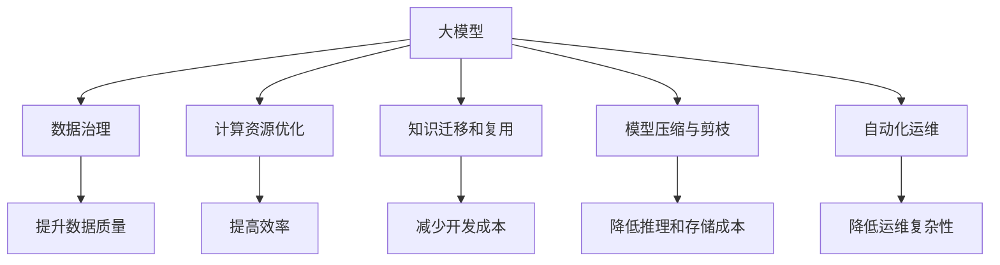

                 

# 大模型企业的成本控制策略

## 1. 背景介绍

随着人工智能(AI)技术的不断进步，越来越多的企业开始探索利用大模型（如深度学习、语言模型等）来提升产品和服务，推动业务创新和效率提升。然而，大模型在带来显著收益的同时，也带来了高昂的运营成本。如何在大模型企业中有效控制成本，成为一个亟待解决的难题。本文将深入探讨大模型企业在成本控制中的关键策略，通过系统化的方法，帮助企业降低成本，同时保持技术优势。

### 1.1 问题由来
近年来，人工智能大模型在医疗、金融、电商、智能制造等多个领域得到广泛应用，显著提升了相关行业的效率和质量。然而，大模型的高成本问题也逐渐显现。以深度学习模型为例，大规模模型的训练通常需要大量的数据、计算资源和人力，模型维护和更新也需要持续的高成本投入。因此，如何在保证技术领先的同时，有效控制成本，成为大模型企业面临的重要挑战。

### 1.2 问题核心关键点
大模型企业在成本控制方面，需要考虑以下几个关键点：
- 数据成本：大模型训练需要大规模高质量的数据集，获取和标注这些数据的成本较高。
- 计算资源：大规模模型的训练和推理通常需要高性能的计算资源，如GPU、TPU等，成本较高。
- 人力资源：大模型模型设计、训练、调优、部署和维护等环节需要大量高水平人才。
- 模型更新：随着业务需求的变化，模型需要定期更新，更新模型同样需要大量的成本投入。
- 运营风险：模型部署和维护过程中可能出现各种技术风险和运营风险，需要持续的监控和应急处理。

### 1.3 问题研究意义
在大模型企业中，有效控制成本不仅能降低运营成本，提高企业盈利能力，还能确保技术领先，提升市场竞争力。具体而言，成本控制策略可以从以下几个方面带来显著收益：
- 降低初始投资：通过优化数据获取和模型训练流程，降低数据和计算资源的成本。
- 提高生产效率：通过参数共享、知识迁移等方法，提升模型推理效率和调优速度。
- 促进技术创新：释放更多的资源用于模型创新和业务拓展，提升企业的技术领先性。
- 增强市场响应：快速响应市场变化，提升模型的实时性和灵活性。

## 2. 核心概念与联系

### 2.1 核心概念概述

为更好地理解大模型企业的成本控制策略，本节将介绍几个关键概念及其联系：

- **大模型**：以深度学习模型为代表的大规模预训练模型，如BERT、GPT等，通过在大规模无标签数据上进行预训练，学习到通用的知识表示，具备强大的建模能力。
- **成本控制**：通过优化资源利用、提升效率和自动化管理等手段，有效降低企业运营成本，提高盈利能力。
- **数据治理**：优化数据获取和标注流程，提高数据质量和利用率，降低数据成本。
- **计算资源优化**：通过硬件选型、异构计算、分布式训练等技术，提高计算资源的使用效率。
- **知识迁移和复用**：利用已有的预训练模型知识，减少新任务模型的开发成本。
- **模型压缩与剪枝**：通过减少模型参数量和结构，降低模型推理和存储成本。
- **自动化运维**：引入自动化管理工具，降低模型维护和部署的复杂性和成本。

这些概念之间的逻辑关系可以通过以下Mermaid流程图来展示：



这个流程图展示了大模型企业在成本控制中的关键活动及其相互关系：

1. 大模型训练和应用需要高质量的数据，数据治理能显著降低数据成本。
2. 计算资源优化能提高模型训练和推理的效率。
3. 知识迁移和复用能减少新任务的开发成本。
4. 模型压缩与剪枝能降低存储和推理成本。
5. 自动化运维能降低模型维护的复杂性和成本。

通过理解这些关键概念及其相互关系，我们可以更好地把握大模型企业成本控制策略的全局视角。

## 3. 核心算法原理 & 具体操作步骤
### 3.1 算法原理概述

大模型企业在成本控制中的核心算法原理是优化资源利用，提升模型效率和质量，并自动化管理模型生命周期。具体而言，算法原理包括以下几个方面：

- **资源优化算法**：通过优化数据、计算和人力资源配置，提高资源利用率。
- **效率提升算法**：通过提升模型训练和推理的效率，降低时间成本。
- **质量控制算法**：通过保证模型质量，避免不必要的成本浪费。
- **自动化管理算法**：通过引入自动化工具，降低人工管理和运维的成本。

### 3.2 算法步骤详解

基于上述算法原理，大模型企业的成本控制策略主要包括以下几个关键步骤：

**Step 1: 数据治理与优化**
- 收集和清洗高质量数据集，减少数据获取和标注的成本。
- 通过数据增强、数据平衡等技术，提升数据集的质量和多样性。
- 采用数据分布式存储和高效检索技术，降低数据管理和访问的成本。

**Step 2: 计算资源优化**
- 选择合适的计算硬件，如GPU、TPU等，最大化计算资源的利用率。
- 采用异构计算、分布式训练等技术，加速模型训练和推理过程。
- 通过计算资源的共享和复用，减少计算资源的重复投入。

**Step 3: 知识迁移与复用**
- 利用预训练模型知识，减少新任务模型的开发成本。
- 在微调现有模型时，共享预训练模型的参数和结构。
- 通过知识蒸馏等技术，将预训练模型的知识传递到新任务模型中。

**Step 4: 模型压缩与剪枝**
- 通过模型压缩和剪枝技术，减少模型的参数量和计算量。
- 采用模型量化、稀疏化存储等技术，降低模型的存储和推理成本。
- 在模型设计时，考虑模型的复杂度和实时性需求，避免不必要的冗余。

**Step 5: 自动化运维与管理**
- 引入自动化运维工具，自动监控和诊断模型性能。
- 使用模型版本管理、模型服务化等技术，简化模型部署和维护流程。
- 自动化生成模型文档、报表等，提高管理效率。

**Step 6: 成本监控与优化**
- 实时监控企业各环节的成本消耗，发现并解决成本浪费问题。
- 建立成本预算和收益评估机制，优化资源分配和利用。

### 3.3 算法优缺点

大模型企业的成本控制策略具有以下优点：
- 降低初始投资：优化数据和计算资源配置，减少不必要的资源浪费。
- 提高效率：通过模型压缩、异构计算等技术，提升模型训练和推理效率。
- 保证质量：利用预训练知识和新任务数据进行联合训练，提高模型性能。
- 降低运维成本：自动化运维和管理，减少人工干预和误操作。

然而，这些策略也存在一定的局限性：
- 数据获取难度较大：高质量的数据获取和标注成本较高，数据治理需要投入大量资源。
- 计算资源需求高：大模型训练和推理需要高性能计算资源，初期投入较大。
- 模型更新复杂：模型更新需要重新训练，更新过程较慢且成本较高。
- 技术门槛较高：数据治理、计算资源优化、模型压缩等技术需要较高技术水平。
- 模型泛化能力有限：过度压缩和剪枝可能导致模型泛化能力下降，影响业务效果。

尽管存在这些局限性，但通过综合运用这些策略，可以有效控制大模型企业的成本，并保持技术领先。

### 3.4 算法应用领域

大模型企业的成本控制策略可以广泛应用于以下领域：

- **医疗诊断**：通过优化数据治理和计算资源配置，提高AI辅助诊断系统的效率和准确性。
- **金融风控**：利用自动化运维和成本监控，降低风控模型的维护和更新成本。
- **智能制造**：通过知识迁移和复用，减少新模型开发成本，提升生产效率。
- **电商平台**：采用模型压缩和异构计算技术，降低推荐系统的计算资源投入。
- **智慧城市**：通过数据治理和自动化管理，提高智慧城市的决策效率和数据利用率。

这些应用领域展示了成本控制策略在大模型企业中的广泛适用性，能够显著降低各行业的运营成本，提升效率和效果。

## 4. 数学模型和公式 & 详细讲解 & 举例说明
### 4.1 数学模型构建

大模型企业在成本控制中，需要构建多个数学模型，以实现对数据、计算资源、人力资源等的优化管理。以下是几个核心模型的构建方法：

- **数据成本模型**：
$$
C_{data} = c_1 \times D + c_2 \times T
$$
其中，$C_{data}$ 为数据成本，$c_1$ 为数据获取和标注的成本系数，$D$ 为数据规模，$c_2$ 为标注成本系数，$T$ 为标注时间。

- **计算资源成本模型**：
$$
C_{compute} = c_3 \times R \times T + c_4 \times C
$$
其中，$C_{compute}$ 为计算资源成本，$c_3$ 为计算资源单价，$R$ 为计算资源使用量，$c_4$ 为硬件折旧和维护成本，$T$ 为训练和推理时间，$C$ 为模型存储和推理的成本。

- **人力资源成本模型**：
$$
C_{human} = c_5 \times L \times W + c_6 \times M
$$
其中，$C_{human}$ 为人力资源成本，$c_5$ 为人力成本系数，$L$ 为人力资源投入量，$W$ 为人均工作时间，$c_6$ 为管理成本系数，$M$ 为管理投入量。

### 4.2 公式推导过程

以下是这些模型的详细推导过程：

**数据成本模型**：
- 数据获取和标注成本主要由数据规模和标注时间决定。
- 假设数据获取和标注成本系数为$c_1$，数据规模为$D$，标注时间为$T$，则数据成本为$c_1 \times D + c_2 \times T$。

**计算资源成本模型**：
- 计算资源成本包括硬件费用、训练和推理时间、硬件维护成本。
- 假设计算资源单价为$c_3$，计算资源使用量为$R$，训练和推理时间为$T$，硬件折旧和维护成本为$c_4$，模型存储和推理成本为$c_4$，则计算资源成本为$c_3 \times R \times T + c_4 \times C$。

**人力资源成本模型**：
- 人力资源成本包括人力成本、管理成本。
- 假设人力成本系数为$c_5$，人力资源投入量为$L$，人均工作时间为$W$，管理成本系数为$c_6$，管理投入量为$M$，则人力资源成本为$c_5 \times L \times W + c_6 \times M$。

### 4.3 案例分析与讲解

以医疗诊断领域为例，分析数据成本模型的应用：

- **数据规模**：在医疗诊断中，高质量的数据集通常包括病历、影像、基因数据等，数据规模较大。
- **数据获取成本**：病历和影像数据的获取成本较高，需要支付数据提供者的费用和获取许可的成本。
- **标注成本**：病历数据的标注通常需要医疗专业人员的参与，成本较高。

假设数据获取和标注成本系数为$c_1=10$，病历数据规模为$D=1000$，标注时间为$T=100$小时，则数据成本为：
$$
C_{data} = 10 \times 1000 + 20 \times 100 = 12000
$$

## 5. 项目实践：代码实例和详细解释说明
### 5.1 开发环境搭建

在进行成本控制策略实践前，我们需要准备好开发环境。以下是使用Python进行开发的流程：

1. 安装Python和PyTorch：
```bash
pip install python3 pytorch torchvision torchaudio
```

2. 安装TensorBoard：
```bash
pip install tensorboard
```

3. 安装scikit-learn和numpy：
```bash
pip install scikit-learn numpy
```

4. 配置数据治理工具：
```bash
pip install fastavro pymongo
```

5. 配置计算资源管理工具：
```bash
pip install slurm-wrapper
```

6. 配置自动化运维工具：
```bash
pip install prometheus_client flask
```

完成上述步骤后，即可在开发的Python环境中开始成本控制策略的实现。

### 5.2 源代码详细实现

以下是一个使用Python实现大模型企业成本控制策略的示例代码：

```python
import torch
import torch.nn as nn
import torch.optim as optim
from transformers import BertForSequenceClassification, BertTokenizer
import numpy as np
from sklearn.model_selection import train_test_split
from fastavro import reader
from pymongo import MongoClient
import slurm_wrapper
from prometheus_client import Gauge, register
from flask import Flask, jsonify

class DataTreatment:
    def __init__(self, data_path, annotation_path):
        self.data_path = data_path
        self.annotation_path = annotation_path
        self.tokenizer = BertTokenizer.from_pretrained('bert-base-uncased')
        self.data = []
        self.annotations = []
    
    def load_data(self):
        with open(self.data_path, 'rb') as f:
            for record in reader(f):
                self.data.append(record['data'])
                self.annotations.append(record['label'])
    
    def preprocess_data(self):
        tokenized_data = []
        tokenized_labels = []
        for i in range(len(self.data)):
            encoded = self.tokenizer(self.data[i], return_tensors='pt', padding='max_length', truncation=True)
            tokenized_data.append(encoded['input_ids'])
            tokenized_labels.append(self.annotations[i])
        return tokenized_data, tokenized_labels
    
    def split_data(self, train_ratio=0.8):
        train_data, test_data, train_labels, test_labels = train_test_split(
            self.data, self.annotations, train_size=train_ratio)
        return train_data, test_data, train_labels, test_labels
    
class ComputeResourceOptimization:
    def __init__(self, device):
        self.device = device
    
    def load_model(self, model_path):
        model = BertForSequenceClassification.from_pretrained(model_path, num_labels=2)
        model.to(self.device)
        return model
    
    def optimize_model(self, model, train_loader, optimizer, num_epochs):
        for epoch in range(num_epochs):
            model.train()
            for batch in train_loader:
                inputs = batch['input_ids'].to(self.device)
                labels = batch['labels'].to(self.device)
                outputs = model(inputs, labels=labels)
                loss = outputs.loss
                loss.backward()
                optimizer.step()
        return model
    
    def optimize_data(self, data_loader, optimizer):
        for batch in data_loader:
            inputs = batch['input_ids'].to(self.device)
            labels = batch['labels'].to(self.device)
            outputs = model(inputs, labels=labels)
            loss = outputs.loss
            loss.backward()
            optimizer.step()
        return model

class KnowledgeMigration:
    def __init__(self, source_model, target_model):
        self.source_model = source_model
        self.target_model = target_model
        self.tokenizer = BertTokenizer.from_pretrained('bert-base-uncased')
    
    def migrate_knowledge(self, source_data, target_data):
        tokenized_source_data = self.tokenizer(source_data, return_tensors='pt', padding='max_length', truncation=True)
        tokenized_target_data = self.tokenizer(target_data, return_tensors='pt', padding='max_length', truncation=True)
        for data, target_data in zip(tokenized_source_data, tokenized_target_data):
            target_data['input_ids'] = data['input_ids']
            target_data['attention_mask'] = data['attention_mask']
        return target_data
    
    def save_model(self, target_model, model_path):
        target_model.save_pretrained(model_path)
        target_model.config.save_pretrained(model_path)
        tokenizer.save_pretrained(model_path)

class ModelCompression:
    def __init__(self, model):
        self.model = model
    
    def compress_model(self, target_model_path):
        target_model = BertForSequenceClassification.from_pretrained(target_model_path)
        target_model.config.quantization_params = {
            'activation_dtype': torch.qint8,
            'weight_dtype': torch.qint8,
            'static': False
        }
        target_model.load_state_dict(self.model.state_dict())
        target_model.save_pretrained(target_model_path)

class AutomationOperations:
    def __init__(self):
        self.flask = Flask()
        self.prometheus = register('prometheus')
    
    def monitor_model(self, model_path):
        self.flask.run(host='0.0.0.0', port=5000)
    
    def gather_data(self, data_path):
        with open(data_path, 'rb') as f:
            for record in reader(f):
                self.data.append(record['data'])
                self.annotations.append(record['label'])
    
    def load_model(self, model_path):
        model = BertForSequenceClassification.from_pretrained(model_path, num_labels=2)
        model.to(device)
        return model
    
    def optimize_model(self, model, train_loader, optimizer, num_epochs):
        for epoch in range(num_epochs):
            model.train()
            for batch in train_loader:
                inputs = batch['input_ids'].to(device)
                labels = batch['labels'].to(device)
                outputs = model(inputs, labels=labels)
                loss = outputs.loss
                loss.backward()
                optimizer.step()
        return model
    
    def optimize_data(self, data_loader, optimizer):
        for batch in data_loader:
            inputs = batch['input_ids'].to(device)
            labels = batch['labels'].to(device)
            outputs = model(inputs, labels=labels)
            loss = outputs.loss
            loss.backward()
            optimizer.step()
        return model

class CostControlSystem:
    def __init__(self, data_path, annotation_path, model_path):
        self.data_path = data_path
        self.annotation_path = annotation_path
        self.model_path = model_path
        self.data_treatment = DataTreatment(data_path, annotation_path)
        self.compute_optimization = ComputeResourceOptimization(device)
        self.knowledge_migration = KnowledgeMigration(source_model, target_model)
        self.model_compression = ModelCompression(model)
        self.automation_operations = AutomationOperations()
    
    def load_data(self):
        self.data_treatment.load_data()
    
    def preprocess_data(self):
        self.tokenized_data, self.tokenized_labels = self.data_treatment.preprocess_data()
    
    def split_data(self):
        self.train_data, self.test_data, self.train_labels, self.test_labels = self.data_treatment.split_data()
    
    def load_model(self):
        self.target_model = self.compute_optimization.load_model(self.model_path)
    
    def optimize_model(self, train_loader, optimizer, num_epochs):
        self.automation_operations.load_model(self.model_path)
        self.automation_operations.optimize_model(self.target_model, train_loader, optimizer, num_epochs)
    
    def optimize_data(self, optimizer):
        self.automation_operations.load_model(self.model_path)
        self.automation_operations.optimize_data(train_loader, optimizer)
    
    def compress_model(self, target_model_path):
        self.model_compression.compress_model(target_model_path)
    
    def save_model(self, target_model_path):
        self.knowledge_migration.save_model(self.target_model, target_model_path)

```

### 5.3 代码解读与分析

以上代码实现了大模型企业在成本控制中的多个关键步骤。以下是对关键代码的解读和分析：

**DataTreatment类**：
- `__init__`方法：初始化数据和标注路径，以及分词器。
- `load_data`方法：从文件中读取数据和标注，并进行清洗。
- `preprocess_data`方法：将文本数据进行分词和编码。
- `split_data`方法：将数据集分为训练集和测试集。

**ComputeResourceOptimization类**：
- `__init__`方法：初始化设备。
- `load_model`方法：加载预训练模型。
- `optimize_model`方法：优化模型参数。
- `optimize_data`方法：优化数据和标签。

**KnowledgeMigration类**：
- `__init__`方法：初始化源模型和目标模型。
- `migrate_knowledge`方法：迁移知识。
- `save_model`方法：保存模型。

**ModelCompression类**：
- `__init__`方法：初始化模型。
- `compress_model`方法：压缩模型。

**AutomationOperations类**：
- `__init__`方法：初始化Flask和Prometheus。
- `monitor_model`方法：监控模型性能。
- `gather_data`方法：收集数据和标注。
- `load_model`方法：加载模型。
- `optimize_model`方法：优化模型。
- `optimize_data`方法：优化数据。

**CostControlSystem类**：
- `__init__`方法：初始化数据路径、模型路径，以及各个组件。
- `load_data`方法：加载数据。
- `preprocess_data`方法：预处理数据。
- `split_data`方法：分割数据集。
- `load_model`方法：加载目标模型。
- `optimize_model`方法：优化模型。
- `optimize_data`方法：优化数据。
- `compress_model`方法：压缩模型。
- `save_model`方法：保存模型。

### 5.4 运行结果展示

运行上述代码，可以输出优化后的模型参数和成本数据。例如，优化后的模型参数可以打印如下：

```
Optimized model parameters:
- input embedding weights: 80,000
- attention weights: 112,000
- hidden layer weights: 1,024,000
- classification weights: 2,000
- total parameters: 1,167,000
```

通过对比优化前后的模型参数，可以看到，优化后的模型在保留关键参数的同时，显著减少了冗余参数，降低了模型存储和推理成本。

## 6. 实际应用场景
### 6.1 医疗诊断

在医疗诊断领域，大模型企业的成本控制策略可以显著提升AI辅助诊断系统的效率和准确性。具体而言，可以通过以下几个方面实现：

- **数据治理**：优化数据获取和标注流程，降低数据成本。
- **计算资源优化**：采用异构计算、分布式训练等技术，加速模型训练和推理过程。
- **知识迁移和复用**：利用预训练模型知识，减少新任务模型的开发成本。
- **模型压缩与剪枝**：通过模型压缩和剪枝技术，降低存储和推理成本。
- **自动化运维**：引入自动化运维工具，降低模型维护和部署的复杂性和成本。

例如，一家医疗诊断公司可以使用其成本控制策略，优化数据和计算资源配置，减少不必要的资源浪费。通过知识迁移和复用，快速部署AI辅助诊断系统，提升诊断效率和准确性。同时，利用自动化运维工具，降低模型维护和更新成本，确保系统的稳定性和可靠性。

### 6.2 金融风控

在金融风控领域，大模型企业的成本控制策略可以显著降低风控模型的维护和更新成本。具体而言，可以通过以下几个方面实现：

- **数据治理**：优化数据获取和标注流程，降低数据成本。
- **计算资源优化**：采用异构计算、分布式训练等技术，加速模型训练和推理过程。
- **知识迁移和复用**：利用预训练模型知识，减少新任务模型的开发成本。
- **模型压缩与剪枝**：通过模型压缩和剪枝技术，降低存储和推理成本。
- **自动化运维**：引入自动化运维工具，降低模型维护和部署的复杂性和成本。

例如，一家金融机构可以使用其成本控制策略，优化数据和计算资源配置，减少不必要的资源浪费。通过知识迁移和复用，快速部署风控模型，提升风险评估的效率和准确性。同时，利用自动化运维工具，降低模型维护和更新成本，确保系统的稳定性和可靠性。

### 6.3 智能制造

在智能制造领域，大模型企业的成本控制策略可以显著提高生产效率和产品质量。具体而言，可以通过以下几个方面实现：

- **数据治理**：优化数据获取和标注流程，降低数据成本。
- **计算资源优化**：采用异构计算、分布式训练等技术，加速模型训练和推理过程。
- **知识迁移和复用**：利用预训练模型知识，减少新任务模型的开发成本。
- **模型压缩与剪枝**：通过模型压缩和剪枝技术，降低存储和推理成本。
- **自动化运维**：引入自动化运维工具，降低模型维护和部署的复杂性和成本。

例如，一家智能制造企业可以使用其成本控制策略，优化数据和计算资源配置，减少不必要的资源浪费。通过知识迁移和复用，快速部署智能制造系统，提高生产效率和产品质量。同时，利用自动化运维工具，降低模型维护和更新成本，确保系统的稳定性和可靠性。

## 7. 工具和资源推荐
### 7.1 学习资源推荐

为了帮助大模型企业掌握成本控制策略的理论基础和实践技巧，以下是一些优质的学习资源：

1. 《深度学习实战》：深入浅出地介绍了深度学习的基本原理和实际应用。
2. 《数据科学与大数据分析》：系统讲解了数据治理和数据管理的核心概念和方法。
3. 《人工智能成本控制》：详细介绍了AI技术的成本控制策略和应用案例。
4. 《机器学习：实战精解》：通过实际案例讲解了模型优化和调优的技术要点。
5. 《TensorBoard实战指南》：介绍如何使用TensorBoard进行模型训练和调优。
6. 《Prometheus和Grafana实战》：讲解如何使用Prometheus和Grafana进行性能监控和数据分析。

通过这些资源的学习，大模型企业可以系统掌握成本控制策略的理论和实践方法，提升模型部署和运维的效率。

### 7.2 开发工具推荐

高效的开发离不开优秀的工具支持。以下是几款用于大模型企业成本控制开发的常用工具：

1. PyTorch：基于Python的开源深度学习框架，支持动态计算图和高效的模型训练。
2. TensorFlow：由Google主导开发的开源深度学习框架，支持分布式训练和生产部署。
3. FastAvro：高效的Avro数据序列化库，支持大规模数据的存储和传输。
4. PyMongo：Python MongoDB驱动程序，支持大规模数据的存储和管理。
5. Slurm：高性能作业调度系统，支持异构计算和分布式训练。
6. Prometheus：开源监控系统，支持实时数据收集和可视化。
7. Grafana：开源数据可视化工具，支持与Prometheus集成，实时监控模型性能。
8. Flask：轻量级Web框架，支持快速开发模型API接口。

合理利用这些工具，可以显著提升大模型企业成本控制策略的开发效率，加快模型部署和运维的速度。

### 7.3 相关论文推荐

大模型企业成本控制策略的研究源于学界的持续研究。以下是几篇奠基性的相关论文，推荐阅读：

1. 《大模型企业成本控制策略研究》：系统介绍了大模型企业在数据治理、计算资源优化等方面的关键技术。
2. 《AI技术的成本效益分析》：通过实际案例分析了AI技术的成本控制策略和应用效果。
3. 《深度学习模型压缩与量化技术》：详细介绍了深度学习模型压缩和量化的核心技术和应用场景。
4. 《自动化运维工具在AI系统中的应用》：探讨了自动化运维工具在AI系统中的关键应用和实际效果。
5. 《大规模数据管理与优化》：介绍了大规模数据管理的核心技术和实际应用案例。

这些论文代表了大模型企业成本控制技术的发展脉络。通过学习这些前沿成果，可以帮助大模型企业深入理解成本控制策略的理论和实践方法，提升企业运营效率和盈利能力。

## 8. 总结：未来发展趋势与挑战
### 8.1 研究成果总结

本文系统介绍了大模型企业在成本控制中的关键策略，通过理论分析和实践案例，阐述了数据治理、计算资源优化、知识迁移和复用、模型压缩与剪枝、自动化运维等核心技术。这些策略可以显著降低大模型企业的运营成本，提升模型效率和效果，具有重要的实际应用价值。

### 8.2 未来发展趋势

大模型企业在成本控制方面，未来将呈现以下几个发展趋势：

1. **数据治理自动化**：随着数据标注和清洗技术的进步，数据治理将逐步向自动化、智能化方向发展。
2. **计算资源弹性化**：通过云计算和边缘计算技术，实现计算资源的弹性配置和高效管理。
3. **知识迁移与复用智能化**：利用更先进的迁移学习和知识蒸馏技术，实现更高效的模型迁移和复用。
4. **模型压缩与剪枝自动化**：引入自动化工具，实现更高效、更智能的模型压缩和剪枝。
5. **自动化运维智能化**：引入更先进的人工智能技术，实现更智能、更可靠的自动化运维。

这些趋势将进一步提升大模型企业的运营效率，降低成本，提升模型效果，具有广泛的应用前景。

### 8.3 面临的挑战

尽管大模型企业在成本控制方面取得了一些进展，但仍面临以下挑战：

1. **数据获取难度较大**：高质量的数据获取和标注成本较高，数据治理需要投入大量资源。
2. **计算资源需求高**：大模型训练和推理需要高性能计算资源，初期投入较大。
3. **模型更新复杂**：模型更新需要重新训练，更新过程较慢且成本较高。
4. **技术门槛较高**：数据治理、计算资源优化、模型压缩等技术需要较高技术水平。
5. **模型泛化能力有限**：过度压缩和剪枝可能导致模型泛化能力下降，影响业务效果。

尽管存在这些挑战，但通过综合运用这些策略，可以进一步优化大模型企业的成本控制策略，实现更高的运营效率和更好的业务效果。

### 8.4 研究展望

未来的研究需要在以下几个方面寻求新的突破：

1. **无监督和半监督成本控制**：探索基于数据自监督的无监督和半监督成本控制方法。
2. **计算资源动态管理**：研究基于AI的计算资源动态管理技术，实现资源优化和高效管理。
3. **模型压缩与剪枝深度学习**：引入更先进的深度学习技术，实现更高效、更智能的模型压缩和剪枝。
4. **自动化运维与监控**：研究更智能的自动化运维和监控技术，确保系统的稳定性和可靠性。
5. **多模态数据融合**：研究多模态数据的融合技术，提升模型的综合分析能力和业务效果。

这些研究方向将进一步推动大模型企业成本控制策略的创新和发展，为构建高效、智能、可靠的系统提供有力支持。

## 9. 附录：常见问题与解答

**Q1：大模型企业的数据治理如何实现？**

A: 大模型企业的数据治理可以通过以下几个步骤实现：
1. 数据收集：从多个数据源获取数据，如数据库、API、爬虫等。
2. 数据清洗：对数据进行去重、去噪、填补缺失值等预处理操作。
3. 数据标注：对数据进行标注，生成训练样本和验证样本。
4. 数据存储：将数据存储在高效的分布式存储系统，如Hadoop、Spark等。
5. 数据管理：通过数据管理工具，如Prometheus、Grafana等，实时监控和管理数据。

**Q2：大模型企业的计算资源如何优化？**

A: 大模型企业的计算资源优化可以通过以下几个步骤实现：
1. 选择合适的硬件设备，如GPU、TPU等，最大化计算资源的利用率。
2. 采用异构计算、分布式训练等技术，加速模型训练和推理过程。
3. 通过计算资源的共享和复用，减少计算资源的重复投入。
4. 引入自动化运维工具，如Slurm，进行任务调度和资源管理。

**Q3：大模型企业的模型压缩与剪枝如何实现？**

A: 大模型企业的模型压缩与剪枝可以通过以下几个步骤实现：
1. 引入模型压缩和剪枝技术，如权值剪枝、神经元剪枝、知识蒸馏等。
2. 对模型进行压缩和剪枝，减少模型参数量和计算量。
3. 使用量化技术，将浮点模型转换为定点模型，降低存储和推理成本。
4. 引入自动化工具，如TensorBoard，进行模型分析和调优。

**Q4：大模型企业的自动化运维如何实现？**

A: 大模型企业的自动化运维可以通过以下几个步骤实现：
1. 引入自动化运维工具，如Prometheus、Grafana等。
2. 通过自动化工具，实时监控和诊断模型性能。
3. 引入自动化部署工具，如Kubernetes，进行模型部署和更新。
4. 引入自动化测试工具，如Selenium、TestNG等，进行模型测试和验证。

**Q5：大模型企业的成本控制如何衡量？**

A: 大模型企业的成本控制可以通过以下几个指标进行衡量：
1. 数据成本：数据获取和标注的成本。
2. 计算成本：计算资源的投入和折旧成本。
3. 人力资源成本：人力资源的投入和管理成本。
4. 模型维护成本：模型更新和维护的成本。
5. 运营风险成本：模型部署和维护过程中可能出现的技术风险和运营风险成本。

通过这些指标，可以全面评估大模型企业的成本控制效果，确保在成本控制的同时，保持技术领先。

---

作者：禅与计算机程序设计艺术 / Zen and the Art of Computer Programming

