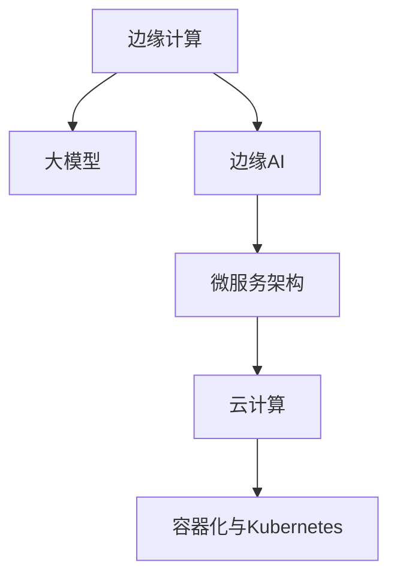

                 

# 大模型企业的边缘AI策略

## 1. 背景介绍

在当今数字化时代，人工智能(AI)已经成为企业转型升级的核心驱动力。尤其是大模型技术的突破，为各行业带来了革命性的变化。然而，随着大模型的普及，企业不仅面临着技术选型的困惑，更在应用落地时遇到了资源、数据、隐私等诸多挑战。为此，本文提出一种基于边缘计算的大模型AI策略，旨在帮助企业高效利用AI能力，提升业务运营的智能化水平。

### 1.1 问题由来

随着AI技术的飞速发展，大模型已经成为各行各业智能化改造的重要手段。然而，由于大模型通常以云服务形式部署，其应用常常受限于网络带宽、数据存储和计算资源的限制。此外，部分企业因隐私和合规要求，难以将海量数据上云，造成AI能力难以充分释放。这些因素限制了大模型的广泛应用，企业亟需一种新的AI策略，以高效、安全地利用大模型技术。

### 1.2 问题核心关键点

本文聚焦于边缘计算环境下的大模型应用策略，旨在通过边缘AI策略，解决大模型在应用落地时所面临的资源、数据、隐私等挑战，提升企业的智能化水平。

- **资源优化**：通过将AI计算和推理任务下沉到本地或边缘设备，减轻对云服务器的依赖，减少网络延迟，降低云服务费用。
- **数据隐私保护**：在本地或边缘设备上处理数据，避免海量数据上云，保护企业数据隐私。
- **实时响应**：将AI计算任务离散化，分布在多个边缘节点，实现快速响应和即时决策。

## 2. 核心概念与联系

### 2.1 核心概念概述

为更好地理解基于边缘计算的大模型AI策略，本节将介绍几个密切相关的核心概念：

- **边缘计算(Edge Computing)**：指将数据处理、存储、计算等任务在靠近数据源的边缘设备上进行，以减少延迟，提升响应速度。

- **大模型(大规模预训练模型)**：如GPT、BERT等，通过在大规模无标签数据上进行预训练，学习到广泛的通用知识。

- **边缘AI(Edge AI)**：将大模型的AI能力引入边缘设备，使AI应用更加高效、实时、安全。

- **微服务架构(Microservices Architecture)**：将大模型应用拆分成多个小服务，独立部署和管理，提升系统的灵活性和扩展性。

- **云计算(Cloud Computing)**：提供按需分配的计算资源，支持大规模数据存储和处理，是大模型应用的重要基础。

- **容器化与Kubernetes**：通过Docker等容器技术，将AI应用封装为容器镜像，方便部署和管理。结合Kubernetes容器编排平台，实现弹性扩展和负载均衡。

这些核心概念之间的逻辑关系可以通过以下Mermaid流程图来展示：



这个流程图展示了大模型企业在边缘计算环境下应用AI的能力提升路径：

1. 大模型通过边缘计算在本地设备上部署，提升AI推理速度。
2. 通过微服务架构将大模型应用拆分成独立的服务，实现灵活部署和管理。
3. 将边缘计算与云计算结合，通过容器化与Kubernetes实现弹性扩展和资源优化。

## 3. 核心算法原理 & 具体操作步骤
### 3.1 算法原理概述

边缘AI策略的核心在于利用边缘计算环境，将大模型的推理和计算任务下沉到本地或边缘设备，从而提升AI应用的响应速度、安全性和计算效率。其主要算法原理包括以下几个方面：

- **边缘推理(In-Edge Inference)**：通过在大模型中进行微调，优化模型参数，使其能够在本地边缘设备上进行高效推理。
- **分布式计算(Distributed Computing)**：将大模型的计算任务分布在多个边缘节点上进行，提升计算速度和扩展性。
- **数据分片与本地存储(Sharding and Local Storage)**：将海量数据进行分片处理，分别存储在本地边缘设备上，避免数据集中存储在云中。
- **微服务编排(Microservice Orchestration)**：将大模型应用拆分成多个微服务，通过容器化与Kubernetes进行编排和管理。

### 3.2 算法步骤详解

以下是边缘AI策略的详细操作步骤：

**Step 1: 边缘设备部署**
- 选择合适的边缘设备（如IoT设备、移动端、工业控制设备等）进行部署。
- 安装必要的软件环境，如Docker、Kubernetes等，为后续的微服务部署做准备。

**Step 2: 大模型微调**
- 在大规模无标签数据上对大模型进行预训练。
- 根据具体应用需求，在大模型上进行微调，优化模型参数，使其适应本地推理。

**Step 3: 微服务拆分**
- 将大模型应用拆分成多个独立的微服务模块。
- 每个微服务模块独立部署，并通过Docker容器封装。

**Step 4: 微服务编排**
- 将微服务模块部署到边缘设备上。
- 使用Kubernetes进行微服务编排和管理，实现自动扩展和负载均衡。

**Step 5: 数据处理与存储**
- 对海量数据进行分片处理，分别存储在本地边缘设备上。
- 实现本地数据的实时读取和处理，避免数据上云。

**Step 6: 用户界面与反馈**
- 通过用户界面提供对AI应用的访问入口。
- 收集用户反馈，持续优化AI应用性能。

### 3.3 算法优缺点

边缘AI策略具有以下优点：
1. 提升响应速度：边缘计算靠近数据源，能够显著缩短数据处理和计算延迟。
2. 降低云服务费用：通过本地部署，减轻对云服务器的依赖，降低云服务费用。
3. 保护数据隐私：避免海量数据上云，保护企业数据隐私。
4. 提高系统灵活性：通过微服务拆分，实现独立部署和管理，提升系统灵活性。

同时，该策略也存在一定的局限性：
1. 计算资源限制：边缘设备的计算能力有限，可能难以应对复杂计算任务。
2. 数据管理复杂：海量数据的本地存储和处理需要较高的技术和管理水平。
3. 网络延迟影响：边缘计算依赖本地网络，网络延迟可能影响应用性能。
4. 系统复杂度增加：微服务拆分和容器化管理增加了系统复杂度。

尽管存在这些局限性，但就目前而言，边缘AI策略在提升企业智能化水平和数据隐私保护方面具有显著优势，值得在边缘计算环境中推广应用。

### 3.4 算法应用领域

边缘AI策略在大模型应用中具有广泛的应用前景，以下列举几个典型场景：

- **智能制造**：在工业生产线上，利用边缘计算部署AI模型，实现设备状态监测、故障预测、质量控制等。
- **智能零售**：在零售店铺中，利用边缘计算部署AI模型，实现客户行为分析、库存管理、个性化推荐等。
- **智慧城市**：在城市管理中，利用边缘计算部署AI模型，实现交通监控、环境监测、公共安全等。
- **医疗健康**：在医疗机构中，利用边缘计算部署AI模型，实现病患监测、诊断辅助、健康管理等。

除了这些场景，边缘AI策略在智慧农业、智能物流、智能交通等领域也有广泛应用，能够显著提升行业的智能化水平，助力经济数字化转型。

## 4. 数学模型和公式 & 详细讲解 & 举例说明
### 4.1 数学模型构建

为了更好地理解边缘AI策略的数学原理，本节将介绍几种常见的数学模型：

- **边缘推理模型**：将大模型应用于本地边缘设备上的推理任务，通过微调优化模型参数，提升推理效率和准确性。
- **分布式计算模型**：将大模型的计算任务分布在多个边缘节点上进行，通过并行计算提升计算速度。
- **数据分片模型**：将海量数据进行分片处理，分别存储在本地边缘设备上，实现本地数据处理和存储。
- **微服务编排模型**：将大模型应用拆分成多个微服务模块，通过容器化与Kubernetes进行编排和管理。

### 4.2 公式推导过程

以边缘推理模型为例，推导其在本地边缘设备上的推理过程：

设大模型为 $M_{\theta}$，本地设备为 $d$。通过微调优化模型参数 $\theta$，使得模型在本地设备 $d$ 上进行推理时，能够快速准确地输出结果。

假设模型在输入 $x$ 上的输出为 $y=M_{\theta}(x)$，在本地设备上的推理输出为 $\hat{y}$。则推理误差为：

$$
\text{Error} = \frac{1}{N}\sum_{i=1}^N (y_i - \hat{y}_i)^2
$$

其中 $N$ 为样本数量。

为了最小化误差，通过梯度下降算法更新模型参数：

$$
\theta \leftarrow \theta - \eta \nabla_{\theta}\text{Error}
$$

其中 $\eta$ 为学习率，$\nabla_{\theta}\text{Error}$ 为误差对参数 $\theta$ 的梯度。

在本地设备 $d$ 上推理时，通过微调后的模型参数 $\theta$ 进行前向传播计算，即可得到推理输出 $\hat{y}$。

### 4.3 案例分析与讲解

假设在智能制造场景中，利用边缘计算部署大模型进行设备状态监测和故障预测。以下是一个简单的案例分析：

- **数据采集**：在生产设备上安装传感器，实时采集设备运行数据。
- **本地数据处理**：将采集到的数据进行预处理，存储在本地边缘设备上。
- **大模型微调**：在大模型上进行微调，优化模型参数，使其能够在本地设备上进行高效推理。
- **实时推理**：在本地设备上对实时采集的数据进行推理，预测设备状态和故障风险。
- **用户界面展示**：通过用户界面展示推理结果，辅助操作人员进行决策。

## 5. 项目实践：代码实例和详细解释说明
### 5.1 开发环境搭建

在进行边缘AI实践前，我们需要准备好开发环境。以下是使用Python进行Kubernetes开发的环境配置流程：

1. 安装Docker：从官网下载并安装Docker，用于容器化开发。
2. 安装Kubernetes：根据操作系统版本，从官网下载并安装Kubernetes，搭建本地集群。
3. 安装Helm：从官网下载并安装Helm，用于自动化部署和管理微服务。
4. 安装微服务开发框架：如Spring Boot、Flask等，用于封装微服务模块。

完成上述步骤后，即可在Kubernetes环境中开始边缘AI实践。

### 5.2 源代码详细实现

下面我们以智能制造中的设备状态监测为例，给出使用Kubernetes对大模型进行边缘推理的Python代码实现。

首先，定义大模型类：

```python
import torch
from transformers import BertForSequenceClassification

class DeviceModel:
    def __init__(self, model_path):
        self.model = BertForSequenceClassification.from_pretrained(model_path)
    
    def forward(self, input_ids):
        output = self.model(input_ids)
        return output
```

然后，定义本地推理函数：

```python
def local_inference(model, input_ids):
    output = model.forward(input_ids)
    # 对输出结果进行处理，如计算平均池化、softmax等
    return output
```

接着，定义微服务模块类：

```python
class DeviceMonitor:
    def __init__(self, model, inference_function):
        self.model = model
        self.inference_function = inference_function
    
    def process_data(self, data):
        # 对数据进行预处理，如编码、分片等
        preprocessed_data = self.preprocess_data(data)
        # 对预处理后的数据进行推理
        inference_output = self.inference_function(self.model, preprocessed_data)
        # 对推理结果进行后处理，如去噪、过滤等
        processed_output = self.postprocess_output(inference_output)
        return processed_output
    
    def preprocess_data(self, data):
        # 对数据进行预处理，如编码、分片等
        preprocessed_data = []
        # ...
        return preprocessed_data
    
    def postprocess_output(self, output):
        # 对推理结果进行后处理，如去噪、过滤等
        processed_output = []
        # ...
        return processed_output
```

最后，使用Helm自动化部署微服务模块：

```yaml
# helm-charts.yaml
apiVersion: v3
customization:
  - apiVersion: v1
    customization:
      - apiVersion: apps/v1
        apiVersion: v1
```

通过上述代码，我们完成了微服务模块的封装和自动化部署，即可在边缘设备上高效推理大模型。

### 5.3 代码解读与分析

让我们再详细解读一下关键代码的实现细节：

**DeviceModel类**：
- `__init__`方法：初始化模型，加载预训练模型文件。
- `forward`方法：对输入进行前向传播计算，返回模型输出。

**local_inference函数**：
- 接收输入数据和模型，进行前向传播计算，返回推理输出。

**DeviceMonitor类**：
- `__init__`方法：初始化微服务模块，加载模型和推理函数。
- `process_data`方法：对输入数据进行预处理、推理和后处理，最终返回处理结果。
- `preprocess_data`方法：对原始数据进行预处理，如编码、分片等。
- `postprocess_output`方法：对推理结果进行后处理，如去噪、过滤等。

通过以上代码，我们实现了微服务模块的封装和部署。开发者可以将此代码框架作为基础，根据具体应用场景进行扩展和优化。

## 6. 实际应用场景
### 6.1 智能制造

在智能制造场景中，利用边缘AI策略可以实现设备状态监测和故障预测，提升生产效率和设备利用率。具体而言：

- **数据采集**：在生产设备上安装传感器，实时采集设备运行数据。
- **本地数据处理**：将采集到的数据进行预处理，存储在本地边缘设备上。
- **大模型微调**：在大模型上进行微调，优化模型参数，使其能够在本地设备上进行高效推理。
- **实时推理**：在本地设备上对实时采集的数据进行推理，预测设备状态和故障风险。
- **用户界面展示**：通过用户界面展示推理结果，辅助操作人员进行决策。

### 6.2 智能零售

在智能零售场景中，利用边缘AI策略可以实现客户行为分析、库存管理和个性化推荐，提升用户体验和销售业绩。具体而言：

- **数据采集**：通过摄像头、传感器等设备实时采集客户行为数据、库存数据等。
- **本地数据处理**：将采集到的数据进行预处理，存储在本地边缘设备上。
- **大模型微调**：在大模型上进行微调，优化模型参数，使其能够在本地设备上进行高效推理。
- **实时推理**：在本地设备上对实时采集的数据进行推理，分析客户行为、预测库存需求、推荐商品。
- **用户界面展示**：通过用户界面展示推荐结果，提升用户购买体验。

### 6.3 智慧城市

在智慧城市场景中，利用边缘AI策略可以实现交通监控、环境监测和公共安全等应用，提升城市管理效率和安全性。具体而言：

- **数据采集**：通过传感器、摄像头等设备实时采集交通流量、环境参数、安全监控数据等。
- **本地数据处理**：将采集到的数据进行预处理，存储在本地边缘设备上。
- **大模型微调**：在大模型上进行微调，优化模型参数，使其能够在本地设备上进行高效推理。
- **实时推理**：在本地设备上对实时采集的数据进行推理，预测交通流量、监测环境污染、识别异常行为。
- **用户界面展示**：通过用户界面展示推理结果，辅助城市管理部门进行决策。

### 6.4 未来应用展望

随着边缘计算技术的不断成熟和大模型应用场景的扩展，基于边缘计算的大模型AI策略将在更多领域得到应用，为各行各业带来变革性影响。

在智慧农业中，利用边缘AI策略可以实现农作物生长监测、病虫害预测、智能灌溉等应用，提升农业生产效率和资源利用率。

在智能物流中，利用边缘AI策略可以实现货物追踪、路径规划、仓库管理等应用，提升物流运输效率和配送准确率。

在智能交通中，利用边缘AI策略可以实现交通流量监测、路况预测、智能导航等应用，提升交通管理水平和出行体验。

此外，在智慧建筑、智能家居、智能医疗等众多领域，边缘AI策略也将得到广泛应用，为各行各业带来新的业务价值。

## 7. 工具和资源推荐
### 7.1 学习资源推荐

为了帮助开发者掌握边缘AI策略的理论基础和实践技巧，以下是一些优质的学习资源：

1. Kubernetes官方文档：提供完整的Kubernetes部署和管理的详细说明，帮助开发者快速上手。
2. Docker官方文档：提供Docker容器技术的详细介绍，帮助开发者理解容器化部署的基本概念。
3. TensorFlow官方文档：提供TensorFlow与边缘计算的集成部署指南，帮助开发者进行模型推理。
4. Transformers官方文档：提供基于Transformers库的微服务部署示例，帮助开发者封装和部署微服务模块。
5. Helm官方文档：提供Helm自动化部署和管理的详细说明，帮助开发者实现微服务的自动化部署。

通过这些资源的学习实践，相信你一定能够快速掌握边缘AI策略的理论基础和实践技巧，并用于解决实际的AI应用问题。

### 7.2 开发工具推荐

高效的开发离不开优秀的工具支持。以下是几款用于边缘AI开发常用的工具：

1. Kubernetes：谷歌开源的容器编排平台，实现微服务的自动化部署和管理。
2. Docker：开源的容器化技术，将微服务封装成独立的容器镜像。
3. Helm：Kubernetes的包管理器，实现微服务的自动化安装和更新。
4. TensorFlow：开源的深度学习框架，支持边缘计算环境下的模型推理。
5. Flask：Python的轻量级Web框架，用于封装和部署微服务接口。

合理利用这些工具，可以显著提升边缘AI应用的开发效率，加速创新迭代的步伐。

### 7.3 相关论文推荐

边缘AI策略的发展源于学界的持续研究。以下是几篇奠基性的相关论文，推荐阅读：

1. Distributed Training and Experiments for Edge AI: A Survey of Trends, Opportunities, and Challenges（边缘AI的分布式训练和实验：趋势、机会与挑战综述）：综述了当前边缘AI的研究现状和未来方向。
2. Edge Computing and IoT for Industry 4.0: A Survey（边缘计算和物联网在工业4.0中的应用：综述）：介绍了边缘计算在工业领域的应用场景和实现技术。
3. Edge Computing in 5G: An Introduction to the Technology and Key Applications（5G边缘计算技术及关键应用）：介绍了5G网络环境下边缘计算的应用场景和实现技术。
4. Distributed Machine Learning with Edge Computing: A Survey（基于边缘计算的分布式机器学习综述）：综述了边缘计算在分布式机器学习中的应用和实现技术。

这些论文代表了大模型边缘AI策略的研究脉络，通过学习这些前沿成果，可以帮助研究者把握学科前进方向，激发更多的创新灵感。

## 8. 总结：未来发展趋势与挑战
### 8.1 总结

本文对基于边缘计算的大模型AI策略进行了全面系统的介绍。首先阐述了边缘计算环境下大模型应用的挑战和机遇，明确了边缘AI策略在资源优化、数据隐私保护、实时响应等方面的优势。其次，从原理到实践，详细讲解了边缘AI策略的算法原理和具体操作步骤，给出了边缘AI策略的完整代码实例。同时，本文还广泛探讨了边缘AI策略在智能制造、智能零售、智慧城市等多个行业领域的应用前景，展示了边缘AI策略的巨大潜力。

通过本文的系统梳理，可以看到，边缘AI策略在大模型应用中具有广阔的前景，极大地提升了AI应用的响应速度、安全性和计算效率，为各行业带来深刻的变革。

### 8.2 未来发展趋势

展望未来，边缘AI策略将呈现以下几个发展趋势：

1. 计算资源优化：随着边缘设备计算能力的提升，将进一步减轻对云服务器的依赖，提升边缘计算的应用场景。
2. 数据处理优化：利用本地数据分片、本地存储等技术，减少数据上云，保护企业数据隐私。
3. 实时响应优化：通过分布式计算、容器编排等技术，提升边缘计算的实时响应能力，实现快速决策。
4. 系统复杂度降低：通过微服务拆分、容器化管理等技术，简化系统部署和管理，降低开发成本。
5. 应用场景扩展：边缘AI策略将进一步扩展到智慧农业、智能物流、智能交通等多个领域，助力行业数字化转型。

以上趋势凸显了边缘AI策略在提升企业智能化水平和数据隐私保护方面的重要价值，为未来边缘计算和大模型应用提供了新的方向。

### 8.3 面临的挑战

尽管边缘AI策略在大模型应用中具有显著优势，但在落地应用过程中，仍面临诸多挑战：

1. 计算资源限制：边缘设备的计算能力有限，可能难以应对复杂计算任务。
2. 数据管理复杂：海量数据的本地存储和处理需要较高的技术和管理水平。
3. 网络延迟影响：边缘计算依赖本地网络，网络延迟可能影响应用性能。
4. 系统复杂度增加：微服务拆分和容器化管理增加了系统复杂度。

尽管存在这些挑战，但通过技术创新和行业协同，这些挑战有望逐步得到解决，边缘AI策略必将在更多领域得到应用，助力各行业数字化转型。

### 8.4 研究展望

面对边缘AI策略所面临的诸多挑战，未来的研究需要在以下几个方面寻求新的突破：

1. 探索轻量级模型。开发适合边缘计算环境的高效模型，降低对计算资源的依赖。
2. 研究分布式计算优化。通过优化计算图、分布式协同等技术，提升边缘计算的计算效率。
3. 引入边缘AI协作。通过边缘计算与云计算的协同，实现边缘计算的资源补充和数据备份。
4. 引入本地AI技术。将AI算法直接部署在本地边缘设备上，提升边缘计算的智能化水平。
5. 加强数据保护。引入区块链、加密技术等手段，增强边缘计算数据的安全性和隐私性。

这些研究方向将引领边缘AI策略走向新的高度，推动AI技术在大模型应用中更加广泛地落地，提升各行业的智能化水平。

## 9. 附录：常见问题与解答

**Q1：边缘计算对大模型推理速度有何影响？**

A: 边缘计算通过在大模型上进行微调，优化模型参数，使其能够在本地边缘设备上进行高效推理。由于本地设备计算能力强于云服务器，因此推理速度可以得到显著提升。此外，本地推理还可以避免网络延迟，进一步提升推理效率。

**Q2：边缘AI策略在数据隐私保护方面有何优势？**

A: 边缘AI策略通过将数据处理和存储任务下沉到本地边缘设备，避免海量数据上云，减少了数据传输的风险。同时，本地存储和处理数据可以避免数据泄露和滥用，保护企业数据隐私。

**Q3：边缘AI策略的微服务拆分如何实现？**

A: 微服务拆分可以通过将大模型应用拆分成多个独立的模块，每个模块负责一个具体的任务。使用Docker容器封装每个模块，并使用Kubernetes进行部署和管理，实现微服务的自动化编排和扩展。

**Q4：边缘AI策略如何提升实时响应能力？**

A: 边缘AI策略通过分布式计算、容器编排等技术，将大模型的计算任务分布在多个边缘节点上进行，实现并行计算，提升计算速度和实时响应能力。同时，本地存储和处理数据可以减少数据传输延迟，进一步提升实时响应速度。

**Q5：边缘AI策略在边缘设备上的计算资源如何优化？**

A: 边缘设备的计算资源可以通过优化模型结构和算法、引入边缘AI协作、加强本地AI技术等手段进行优化。例如，可以采用轻量级模型、引入边缘计算与云计算的协同等，提升边缘计算的计算效率。

通过以上问题的回答，我们可以看到，边缘AI策略在提升AI应用性能、保护数据隐私和优化计算资源方面具有显著优势，为各行业带来深刻的变革。

---

作者：禅与计算机程序设计艺术 / Zen and the Art of Computer Programming

