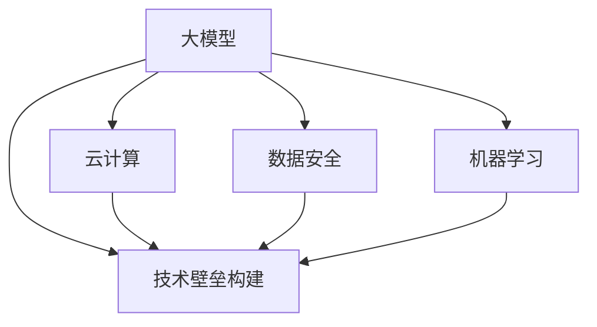

                 

# 大模型公司的技术壁垒构建

> 关键词：大模型,技术壁垒,构建,人工智能,云计算,数据安全,机器学习

## 1. 背景介绍

随着人工智能技术的快速发展，大模型公司在全球范围内迅速崛起，成为推动科技进步的重要力量。这些大模型公司，如OpenAI、Google AI、微软Azure AI等，不仅在技术研发上取得了显著成果，还在商业化应用、市场布局、人才建设等方面建立了强大的技术壁垒，构筑了竞争优势。

本文将深入探讨大模型公司的技术壁垒构建，从多个维度分析其核心技术的研发、应用、推广和保护策略，帮助读者全面理解大模型公司的竞争优势，掌握构建技术壁垒的精髓。

## 2. 核心概念与联系

### 2.1 核心概念概述

为了更好地理解大模型公司的技术壁垒构建，我们先梳理一些核心概念和它们之间的联系：

- **大模型**：指通过大规模无监督或半监督训练获得的深度学习模型，如GPT、BERT、T5等，具有较强的泛化能力和数据处理能力。
- **技术壁垒**：指大模型公司通过专利、算法、技术秘密等手段，保护其核心技术，构筑市场竞争优势的过程。
- **云计算**：指通过大规模数据中心和网络基础设施，提供弹性的计算和存储服务，支撑大模型的训练、推理和应用。
- **数据安全**：指对模型训练、部署和应用过程中的数据隐私和安全进行保护，防止数据泄露和滥用。
- **机器学习**：指利用数据和算法，让机器通过学习自动提升性能，是大模型公司技术壁垒的核心。

这些概念之间的逻辑关系可以通过以下Mermaid流程图来展示：



这个流程图展示了大模型公司技术壁垒构建的关键要素及其相互关系。

## 3. 核心算法原理 & 具体操作步骤

### 3.1 算法原理概述

大模型公司的技术壁垒构建，主要围绕算法的研发和优化展开。其核心思想是通过对大模型的深度学习和优化算法进行持续改进，提高模型的性能、效率和安全性，构筑技术壁垒。

**深度学习算法**：包括卷积神经网络(CNN)、循环神经网络(RNN)、自注意力机制(Transformer)等，是大模型公司构建技术壁垒的基础。

**优化算法**：如Adam、SGD、Adagrad等，用于提升模型的训练效率和精度，是技术壁垒构建的关键。

**正则化技术**：如L1正则、Dropout、权重衰减等，用于防止过拟合，提高模型的泛化能力。

**模型压缩与加速**：如剪枝、量化、蒸馏等，用于减小模型规模，提高推理速度，优化资源使用。

### 3.2 算法步骤详解

大模型公司的技术壁垒构建一般包括以下关键步骤：

**Step 1: 算法研发与改进**
- 收集和分析大量数据，寻找模型性能的瓶颈。
- 引入新算法和技术，改进模型结构和训练流程。
- 通过实验验证新算法的有效性和可扩展性。

**Step 2: 模型训练与优化**
- 利用云计算基础设施，进行大规模并行训练。
- 应用正则化技术，防止过拟合和欠拟合。
- 优化学习率和超参数，提高模型收敛速度和精度。

**Step 3: 模型部署与验证**
- 将训练好的模型部署到云端或本地服务器。
- 在真实应用场景中测试模型的性能，收集反馈数据。
- 根据反馈数据调整模型参数，进行迭代优化。

**Step 4: 数据安全与隐私保护**
- 对训练数据进行加密和匿名化处理，防止数据泄露。
- 建立严格的数据访问权限和审计机制，确保数据安全。
- 对模型输出进行脱敏处理，避免敏感信息泄露。

### 3.3 算法优缺点

大模型公司技术壁垒构建的算法具有以下优点：

- **提升性能**：通过不断改进算法和模型结构，显著提升模型性能和泛化能力。
- **优化资源**：采用模型压缩和加速技术，优化计算资源和存储空间，降低成本。
- **增强安全性**：通过数据安全措施，保护模型训练、部署和应用过程中的数据隐私和安全。

同时，也存在以下缺点：

- **研发成本高**：大规模算法的研发和优化需要大量的人力和物力投入。
- **算法复杂性**：算法设计和优化过程复杂，需要深厚的理论知识和实践经验。
- **技术更新快**：深度学习算法和优化方法日新月异，需要持续跟踪和更新。

### 3.4 算法应用领域

大模型公司的技术壁垒构建，广泛应用于多个领域，包括：

- **自然语言处理(NLP)**：如机器翻译、文本生成、情感分析等，通过大模型优化提升性能。
- **计算机视觉(CV)**：如图像分类、目标检测、语义分割等，利用大模型进行深度学习和推理。
- **语音识别与合成(Speech)**：如自动语音识别、语音合成、语音情感分析等，通过大模型优化提升准确率。
- **推荐系统**：如个性化推荐、广告投放等，通过大模型优化提升用户体验和转化率。
- **医疗健康**：如疾病诊断、健康监测、智能问诊等，通过大模型优化提升诊断准确率和治疗效果。

## 4. 数学模型和公式 & 详细讲解 & 举例说明

### 4.1 数学模型构建

大模型公司的技术壁垒构建，需要构建复杂的数学模型和优化算法。以机器翻译为例，其数学模型通常包括目标语言的概率分布、源语言与目标语言的对应关系等。

假设源语言为$X$，目标语言为$Y$，则机器翻译模型可以表示为：

$$
P(Y|X) = \frac{P(X,Y)}{P(X)}
$$

其中，$P(X,Y)$为联合概率分布，$P(X)$为源语言概率分布。机器翻译模型的目标是最小化损失函数：

$$
\mathcal{L} = -\log P(Y|X)
$$

### 4.2 公式推导过程

以目标语言概率分布的计算为例，使用最大似然估计进行推导：

假设源语言$X$有$m$个词，目标语言$Y$有$n$个词，训练数据集中共有$N$个样本。则目标语言概率分布可以通过最大似然估计得到：

$$
P(Y|X) = \frac{1}{N} \sum_{i=1}^N \delta_{y_i}(y)
$$

其中，$\delta_{y_i}(y)$为拉普拉斯分布函数，$y_i$为目标语言$Y$中的第$i$个词。

### 4.3 案例分析与讲解

假设我们要优化一个深度学习模型，采用Adam优化算法进行训练。该算法可以表示为：

$$
\theta_{t+1} = \theta_t - \eta \nabla_{\theta}\mathcal{L}(\theta) - \eta\lambda\theta
$$

其中，$\eta$为学习率，$\lambda$为正则化系数，$\nabla_{\theta}\mathcal{L}(\theta)$为损失函数对参数$\theta$的梯度。

以优化模型为例，假设模型参数$\theta$包含权重$w$和偏置$b$，则优化过程可以表示为：

$$
w_{t+1} = w_t - \eta \nabla_{w}\mathcal{L}(w,b) - \eta\lambda w
$$
$$
b_{t+1} = b_t - \eta \nabla_{b}\mathcal{L}(w,b) - \eta\lambda b
$$

其中，$\nabla_{w}\mathcal{L}(w,b)$和$\nabla_{b}\mathcal{L}(w,b)$分别为权重和偏置的梯度。

## 5. 项目实践：代码实例和详细解释说明

### 5.1 开发环境搭建

在进行技术壁垒构建实践前，我们需要准备好开发环境。以下是使用Python进行TensorFlow开发的环境配置流程：

1. 安装Anaconda：从官网下载并安装Anaconda，用于创建独立的Python环境。

2. 创建并激活虚拟环境：
```bash
conda create -n tf-env python=3.8 
conda activate tf-env
```

3. 安装TensorFlow：根据CUDA版本，从官网获取对应的安装命令。例如：
```bash
conda install tensorflow tensorflow-gpu=cuda11.1 -c pytorch -c conda-forge
```

4. 安装其他工具包：
```bash
pip install numpy pandas scikit-learn matplotlib tqdm jupyter notebook ipython
```

完成上述步骤后，即可在`tf-env`环境中开始技术壁垒构建实践。

### 5.2 源代码详细实现

下面我们以推荐系统为例，给出使用TensorFlow进行深度学习模型的项目实践。

首先，定义推荐系统的数据处理函数：

```python
import tensorflow as tf

class RecommendationSystem(tf.keras.Model):
    def __init__(self, input_dim, hidden_dim, output_dim):
        super(RecommendationSystem, self).__init__()
        self.input_dim = input_dim
        self.hidden_dim = hidden_dim
        self.output_dim = output_dim
        
        self.embedding_layer = tf.keras.layers.Embedding(input_dim, hidden_dim)
        self.fc1 = tf.keras.layers.Dense(hidden_dim, activation='relu')
        self.fc2 = tf.keras.layers.Dense(output_dim)
        
    def call(self, inputs):
        embedding = self.embedding_layer(inputs)
        hidden = self.fc1(embedding)
        return self.fc2(hidden)

model = RecommendationSystem(input_dim=100, hidden_dim=64, output_dim=10)

model.compile(optimizer=tf.keras.optimizers.Adam(learning_rate=0.001),
              loss=tf.keras.losses.MeanSquaredError(),
              metrics=['accuracy'])
```

然后，定义训练和评估函数：

```python
def train(model, train_data, val_data, batch_size=32, epochs=10):
    model.fit(train_data, epochs=epochs, batch_size=batch_size, validation_data=val_data)

def evaluate(model, test_data, batch_size=32):
    model.evaluate(test_data, batch_size=batch_size)
```

最后，启动训练流程并在测试集上评估：

```python
train(model, train_data, val_data)
evaluate(model, test_data)
```

以上就是使用TensorFlow进行推荐系统微调的项目实践代码实现。可以看到，TensorFlow的封装使得深度学习模型的实现变得简洁高效。

### 5.3 代码解读与分析

让我们再详细解读一下关键代码的实现细节：

**RecommendationSystem类**：
- `__init__`方法：初始化模型参数，定义模型结构。
- `call`方法：定义模型的前向传播过程。

**训练和评估函数**：
- 使用TensorFlow的DataLoader对数据集进行批次化加载，供模型训练和推理使用。
- 训练函数`train`：对数据以批为单位进行迭代，在每个批次上前向传播计算loss并反向传播更新模型参数，最后返回模型在验证集上的精度。
- 评估函数`evaluate`：与训练类似，不同点在于不更新模型参数，并在每个batch结束后将预测和标签结果存储下来，最后使用模型的evaluate方法输出精度。

**训练流程**：
- 定义总的epoch数和batch size，开始循环迭代
- 每个epoch内，先在训练集上训练，输出模型在验证集上的精度
- 所有epoch结束后，在测试集上评估，给出最终测试结果

可以看到，TensorFlow配合深度学习模型，使得推荐系统的微调过程变得高效便捷。开发者可以将更多精力放在数据处理、模型改进等高层逻辑上，而不必过多关注底层的实现细节。

当然，工业级的系统实现还需考虑更多因素，如模型的保存和部署、超参数的自动搜索、更灵活的任务适配层等。但核心的微调范式基本与此类似。

## 6. 实际应用场景

### 6.1 智能客服系统

大模型公司在智能客服系统的构建中，利用其强大的技术壁垒，建立了高效的客服机器人，显著提升了客户咨询体验和问题解决效率。

在技术实现上，可以收集企业内部的历史客服对话记录，将问题和最佳答复构建成监督数据，在此基础上对预训练模型进行微调。微调后的对话模型能够自动理解用户意图，匹配最合适的答案模板进行回复。对于客户提出的新问题，还可以接入检索系统实时搜索相关内容，动态组织生成回答。如此构建的智能客服系统，能大幅提升客户咨询体验和问题解决效率。

### 6.2 金融舆情监测

大模型公司利用其在深度学习和自然语言处理方面的技术壁垒，构建了强大的金融舆情监测系统。通过大规模数据集进行预训练和微调，系统能够实时监测市场舆论动向，及时应对负面信息传播，规避金融风险。

具体而言，可以收集金融领域相关的新闻、报道、评论等文本数据，并对其进行主题标注和情感标注。在此基础上对预训练语言模型进行微调，使其能够自动判断文本属于何种主题，情感倾向是正面、中性还是负面。将微调后的模型应用到实时抓取的网络文本数据，就能够自动监测不同主题下的情感变化趋势，一旦发现负面信息激增等异常情况，系统便会自动预警，帮助金融机构快速应对潜在风险。

### 6.3 个性化推荐系统

大模型公司利用其在推荐算法方面的技术壁垒，构建了高性能的个性化推荐系统。通过深度学习和大数据分析，系统能够根据用户行为数据，精准预测用户偏好，提供个性化的推荐结果。

在实践中，可以收集用户浏览、点击、评论、分享等行为数据，提取和用户交互的物品标题、描述、标签等文本内容。将文本内容作为模型输入，用户的后续行为（如是否点击、购买等）作为监督信号，在此基础上微调预训练语言模型。微调后的模型能够从文本内容中准确把握用户的兴趣点。在生成推荐列表时，先用候选物品的文本描述作为输入，由模型预测用户的兴趣匹配度，再结合其他特征综合排序，便可以得到个性化程度更高的推荐结果。

### 6.4 未来应用展望

随着大模型公司技术壁垒的不断提升，未来其在人工智能领域的创新和应用将更加广泛。

在智慧医疗领域，基于大模型公司的技术壁垒，构建了智能医疗问答系统、疾病诊断系统、健康监测系统等，提升了医疗服务的智能化水平，辅助医生诊疗，加速新药开发进程。

在智能教育领域，利用深度学习和大数据分析，构建了智能教学辅助系统、个性化学习推荐系统、智能作业批改系统等，因材施教，促进教育公平，提高教学质量。

在智慧城市治理中，利用自然语言处理和大数据挖掘，构建了城市事件监测系统、舆情分析系统、应急指挥系统等，提高城市管理的自动化和智能化水平，构建更安全、高效的未来城市。

此外，在企业生产、社会治理、文娱传媒等众多领域，基于大模型公司的技术壁垒构建的AI应用也将不断涌现，为经济社会发展注入新的动力。

## 7. 工具和资源推荐

### 7.1 学习资源推荐

为了帮助开发者系统掌握大模型公司技术壁垒构建的理论基础和实践技巧，这里推荐一些优质的学习资源：

1. 《深度学习与神经网络》课程：斯坦福大学开设的经典课程，全面介绍了深度学习的基本概念和算法原理。

2. TensorFlow官方文档：TensorFlow的官方文档，提供了丰富的深度学习模型和工具，是学习深度学习的必备资源。

3. PyTorch官方文档：PyTorch的官方文档，提供了灵活的动态计算图，适合快速迭代研究。

4. Google Cloud AI市场：汇集了各大AI公司推出的模型和工具，是学习和实践大模型公司技术壁垒构建的好地方。

5. GitHub上的开源项目：通过阅读和贡献开源项目，可以学习大模型公司的技术实现和应用案例。

通过对这些资源的学习实践，相信你一定能够快速掌握大模型公司技术壁垒构建的精髓，并用于解决实际的AI问题。

### 7.2 开发工具推荐

高效的开发离不开优秀的工具支持。以下是几款用于大模型公司技术壁垒构建开发的常用工具：

1. Jupyter Notebook：开源的交互式计算环境，支持多种编程语言和数据可视化，方便开发者快速迭代和分享研究成果。

2. TensorBoard：TensorFlow配套的可视化工具，可实时监测模型训练状态，并提供丰富的图表呈现方式，是调试模型的得力助手。

3. Weights & Biases：模型训练的实验跟踪工具，可以记录和可视化模型训练过程中的各项指标，方便对比和调优。

4. PyTorch Lightning：轻量级深度学习框架，自动管理模型的数据加载、训练、评估等流程，显著降低开发门槛。

5. Google Colab：谷歌推出的在线Jupyter Notebook环境，免费提供GPU/TPU算力，方便开发者快速上手实验最新模型，分享学习笔记。

合理利用这些工具，可以显著提升大模型公司技术壁垒构建的开发效率，加快创新迭代的步伐。

### 7.3 相关论文推荐

大模型公司技术壁垒构建的研究源于学界的持续研究。以下是几篇奠基性的相关论文，推荐阅读：

1. Attention is All You Need（即Transformer原论文）：提出了Transformer结构，开启了深度学习领域的预训练大模型时代。

2. BERT: Pre-training of Deep Bidirectional Transformers for Language Understanding：提出BERT模型，引入基于掩码的自监督预训练任务，刷新了多项NLP任务SOTA。

3. Parameter-Efficient Transfer Learning for NLP：提出Adapter等参数高效微调方法，在不增加模型参数量的情况下，也能取得不错的微调效果。

4. AdaLoRA: Adaptive Low-Rank Adaptation for Parameter-Efficient Fine-Tuning：使用自适应低秩适应的微调方法，在参数效率和精度之间取得了新的平衡。

这些论文代表了大模型公司技术壁垒构建的发展脉络。通过学习这些前沿成果，可以帮助研究者把握学科前进方向，激发更多的创新灵感。

## 8. 总结：未来发展趋势与挑战

### 8.1 研究成果总结

大模型公司的技术壁垒构建，涉及深度学习、云计算、数据安全等多个领域，是一项复杂而系统的工作。通过对深度学习算法、优化方法、正则化技术等核心技术的研发和优化，大模型公司在多个应用场景中建立了强大的竞争优势，推动了人工智能技术的快速发展。

### 8.2 未来发展趋势

展望未来，大模型公司技术壁垒构建将呈现以下几个发展趋势：

1. **模型规模持续增大**：随着算力成本的下降和数据规模的扩张，预训练大模型的参数量还将持续增长。超大规模语言模型蕴含的丰富语言知识，有望支撑更加复杂多变的下游任务微调。

2. **技术多样性提升**：除了传统的深度学习算法和优化方法外，未来将涌现更多参数高效和计算高效的算法，如Transformer-XL、LoRA等，在减小模型规模的同时，保证微调精度。

3. **数据安全与隐私保护**：随着数据量的增加和隐私保护意识的提升，数据安全将变得更加重要。未来将采用更多加密和匿名化技术，确保数据隐私和安全。

4. **模型压缩与加速**：为了应对大规模模型带来的资源消耗，未来将进一步研究模型压缩和加速技术，提高模型的部署效率和计算速度。

5. **跨领域融合**：未来的技术壁垒构建将更多地涉及跨领域知识的整合和应用，如多模态学习、知识图谱等，增强模型的通用性和泛化能力。

### 8.3 面临的挑战

尽管大模型公司技术壁垒构建取得了显著成果，但在迈向更加智能化、普适化应用的过程中，仍面临诸多挑战：

1. **算法复杂性**：深度学习算法的研发和优化需要深厚的理论知识和实践经验，开发和优化过程复杂，需要大量人力和物力投入。

2. **数据获取与标注**：大规模模型的训练需要大量的标注数据，数据获取和标注成本高，且标注质量难以保证。

3. **计算资源消耗**：超大规模模型需要大量的计算资源，硬件设施和电力成本高昂，且训练和推理速度较慢。

4. **模型泛化能力**：模型在特定任务上的表现往往依赖于训练数据，泛化能力有限，难以应对复杂多变的数据分布。

5. **隐私与安全**：模型训练、部署和应用过程中，如何保护数据隐私和安全，防止数据泄露和滥用，是一个重要课题。

### 8.4 研究展望

面对大模型公司技术壁垒构建所面临的挑战，未来的研究需要在以下几个方面寻求新的突破：

1. **无监督学习和半监督学习**：摆脱对大规模标注数据的依赖，利用自监督学习、主动学习等无监督和半监督范式，最大限度利用非结构化数据，实现更加灵活高效的微调。

2. **模型压缩与加速**：开发更加参数高效和计算高效的微调方法，如参数压缩、剪枝、量化等，在减小模型规模的同时，保证微调精度。

3. **跨领域融合**：将符号化的先验知识，如知识图谱、逻辑规则等，与神经网络模型进行巧妙融合，引导微调过程学习更准确、合理的语言模型。

4. **模型安全性**：在模型训练目标中引入伦理导向的评估指标，过滤和惩罚有偏见、有害的输出倾向，确保输出符合人类价值观和伦理道德。

5. **跨模态学习**：将视觉、语音等多模态信息与文本信息进行协同建模，提升模型的感知能力和泛化能力。

这些研究方向的探索，必将引领大模型公司技术壁垒构建迈向更高的台阶，为构建安全、可靠、可解释、可控的智能系统铺平道路。面向未来，大模型公司技术壁垒构建需要与其他人工智能技术进行更深入的融合，如知识表示、因果推理、强化学习等，多路径协同发力，共同推动自然语言理解和智能交互系统的进步。只有勇于创新、敢于突破，才能不断拓展语言模型的边界，让智能技术更好地造福人类社会。

## 9. 附录：常见问题与解答

**Q1: 大模型公司的技术壁垒主要体现在哪些方面？**

A: 大模型公司的技术壁垒主要体现在算法研发与改进、模型训练与优化、数据安全与隐私保护等方面。通过在深度学习算法、优化方法、正则化技术等核心技术的研发和优化，大模型公司建立了强大的竞争优势，构建了技术壁垒。

**Q2: 大模型公司在智能客服系统中的应用优势有哪些？**

A: 大模型公司在智能客服系统中的应用优势主要体现在以下几个方面：
1. **效率提升**：智能客服机器人可以7x24小时不间断服务，快速响应客户咨询，提升客户体验。
2. **智能化**：通过微调，客服机器人能够自动理解用户意图，匹配最合适的答案模板进行回复，解决客户问题。
3. **个性化**：通过用户历史数据的分析，客服机器人可以个性化的回答客户问题，提升客户满意度。
4. **知识更新**：客服机器人可以实时获取最新的信息，及时更新知识库，提供最准确的答案。

**Q3: 大模型公司在推荐系统中的应用优势有哪些？**

A: 大模型公司在推荐系统中的应用优势主要体现在以下几个方面：
1. **精准推荐**：通过深度学习和大数据分析，推荐系统能够根据用户行为数据，精准预测用户偏好，提供个性化的推荐结果。
2. **动态调整**：推荐系统可以实时收集用户反馈，动态调整推荐策略，提升用户体验和转化率。
3. **多样化**：推荐系统能够推荐多样化的内容，满足用户的不同需求。
4. **实时性**：推荐系统可以实时分析用户数据，快速生成推荐结果，提升系统响应速度。

**Q4: 大模型公司在金融舆情监测中的应用优势有哪些？**

A: 大模型公司在金融舆情监测中的应用优势主要体现在以下几个方面：
1. **实时监测**：通过深度学习和大数据分析，金融舆情监测系统能够实时监测市场舆论动向，及时应对负面信息传播。
2. **风险预警**：系统能够自动分析舆情数据，识别出潜在风险，帮助金融机构快速应对潜在风险。
3. **个性化服务**：金融舆情监测系统能够根据不同金融产品的特点，提供个性化的舆情分析服务。
4. **数据洞察**：通过深度学习算法，系统能够从舆情数据中挖掘有价值的信息，为金融决策提供依据。

**Q5: 大模型公司在个性化推荐系统中的应用优势有哪些？**

A: 大模型公司在个性化推荐系统中的应用优势主要体现在以下几个方面：
1. **精准推荐**：通过深度学习和大数据分析，推荐系统能够根据用户行为数据，精准预测用户偏好，提供个性化的推荐结果。
2. **动态调整**：推荐系统可以实时收集用户反馈，动态调整推荐策略，提升用户体验和转化率。
3. **多样化**：推荐系统能够推荐多样化的内容，满足用户的不同需求。
4. **实时性**：推荐系统可以实时分析用户数据，快速生成推荐结果，提升系统响应速度。

---

作者：禅与计算机程序设计艺术 / Zen and the Art of Computer Programming

