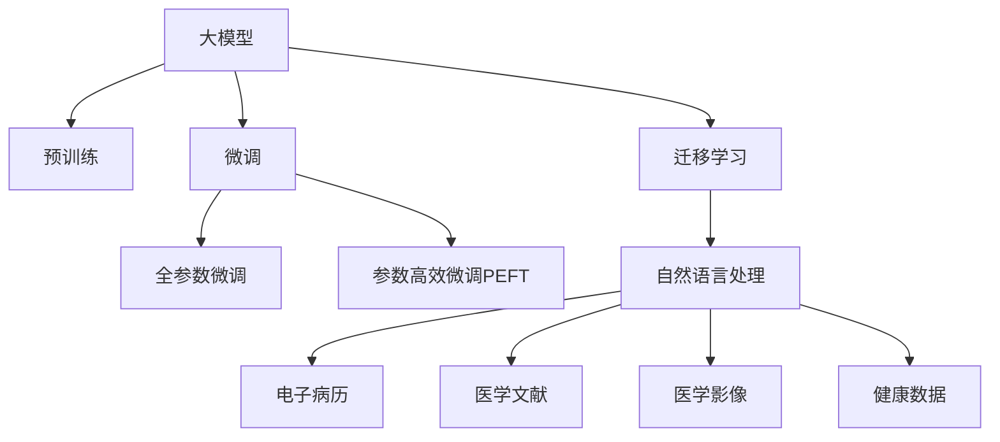

                 

## 1. 背景介绍

### 1.1 问题由来

在过去的几十年里，人工智能（AI）和机器学习（ML）技术已经在许多领域取得了显著的进展，包括金融、制造业、零售等。然而，在医疗保健领域，AI的应用起步较晚，但近年来正在加速发展。

智慧医疗（Healthcare AI）指的是利用AI和ML技术，改善医疗服务质量、降低成本、提升患者体验。大模型（Large Model）作为新一代的AI算法，通过在大规模无标签数据上预训练，具备强大的语言理解和生成能力，可以广泛应用于各种医疗文本数据处理任务。

### 1.2 问题核心关键点

大模型在智慧医疗领域的应用前景广泛，主要包括以下几个方面：

- **自然语言处理**：利用大模型处理医疗文本，如电子病历、医生笔记、医学文献等，提取有用信息，辅助诊断和治疗决策。
- **图像识别**：利用大模型进行医学影像的自动识别，如X光片、MRI、CT等，辅助放射科医生进行病变识别。
- **药物研发**：利用大模型进行药物筛选和发现，加速新药研发过程，降低成本。
- **健康监测**：利用大模型进行健康数据的分析和监测，如心电图、血糖数据等，提供个性化的健康管理方案。

这些应用不仅有助于提升医疗服务的质量和效率，还能解决医疗资源分布不均、医疗成本高昂等问题。

## 2. 核心概念与联系

### 2.1 核心概念概述

为了更好地理解大模型在智慧医疗领域的应用前景，需要掌握以下核心概念：

- **大模型（Large Model）**：指在大规模无标签数据上预训练的深度学习模型，如GPT、BERT、XLNet等，具备强大的语言处理能力。
- **预训练（Pre-training）**：指在大规模无标签数据上对模型进行训练，学习通用的语言表示，以提升其在特定任务上的性能。
- **微调（Fine-tuning）**：指在预训练模型的基础上，使用下游任务的少量标注数据，通过有监督地训练优化模型在特定任务上的性能。
- **迁移学习（Transfer Learning）**：指将一个领域学到的知识，迁移到另一个不同但相关的领域，以提升在新领域的性能。
- **自然语言处理（NLP）**：利用计算机处理和理解人类语言的技术，广泛应用于医疗文本的处理和分析。

这些概念通过以下Mermaid流程图展示了它们之间的联系：



通过理解这些概念，可以更好地把握大模型在智慧医疗领域的应用框架和优化方向。

## 3. 核心算法原理 & 具体操作步骤

### 3.1 算法原理概述

大模型在智慧医疗领域的应用主要通过两个步骤进行：预训练和微调。

- **预训练**：在大规模无标签医疗文本数据上，利用自监督学习任务训练大模型，学习通用的语言表示。
- **微调**：在预训练模型的基础上，使用下游任务的少量标注数据，通过有监督地训练优化模型在特定任务上的性能。

形式化地，假设预训练模型为 $M_{\theta}$，其中 $\theta$ 为预训练得到的模型参数。给定下游任务 $T$ 的标注数据集 $D=\{(x_i, y_i)\}_{i=1}^N$，微调的目标是找到新的模型参数 $\hat{\theta}$，使得：

$$
\hat{\theta}=\mathop{\arg\min}_{\theta} \mathcal{L}(M_{\theta},D)
$$

其中 $\mathcal{L}$ 为针对任务 $T$ 设计的损失函数，用于衡量模型预测输出与真实标签之间的差异。常见的损失函数包括交叉熵损失、均方误差损失等。

### 3.2 算法步骤详解

基于大模型的智慧医疗微调一般包括以下几个关键步骤：

**Step 1: 准备预训练模型和数据集**

- 选择合适的预训练语言模型 $M_{\theta}$ 作为初始化参数，如 BERT、GPT 等。
- 准备下游任务 $T$ 的标注数据集 $D$，划分为训练集、验证集和测试集。一般要求标注数据与预训练数据的分布不要差异过大。

**Step 2: 添加任务适配层**

- 根据任务类型，在预训练模型顶层设计合适的输出层和损失函数。
- 对于分类任务，通常在顶层添加线性分类器和交叉熵损失函数。
- 对于生成任务，通常使用语言模型的解码器输出概率分布，并以负对数似然为损失函数。

**Step 3: 设置微调超参数**

- 选择合适的优化算法及其参数，如 AdamW、SGD 等，设置学习率、批大小、迭代轮数等。
- 设置正则化技术及强度，包括权重衰减、Dropout、Early Stopping 等。
- 确定冻结预训练参数的策略，如仅微调顶层，或全部参数都参与微调。

**Step 4: 执行梯度训练**

- 将训练集数据分批次输入模型，前向传播计算损失函数。
- 反向传播计算参数梯度，根据设定的优化算法和学习率更新模型参数。
- 周期性在验证集上评估模型性能，根据性能指标决定是否触发 Early Stopping。
- 重复上述步骤直到满足预设的迭代轮数或 Early Stopping 条件。

**Step 5: 测试和部署**

- 在测试集上评估微调后模型 $M_{\hat{\theta}}$ 的性能，对比微调前后的精度提升。
- 使用微调后的模型对新样本进行推理预测，集成到实际的应用系统中。
- 持续收集新的数据，定期重新微调模型，以适应数据分布的变化。

以上是基于大模型微调的一般流程。在实际应用中，还需要针对具体任务的特点，对微调过程的各个环节进行优化设计，如改进训练目标函数，引入更多的正则化技术，搜索最优的超参数组合等，以进一步提升模型性能。

### 3.3 算法优缺点

大模型在智慧医疗领域的微调方法具有以下优点：

1. **高效性**：微调方法可以显著减少从头开发所需的数据、计算和人力等成本投入。
2. **精度高**：微调使得通用大模型更好地适应特定任务，在应用场景中取得更优表现。
3. **可扩展性**：微调过程可以快速适配到不同的医疗应用场景，提高系统的灵活性。
4. **实时性**：微调后的模型在推理速度上表现优异，可以快速响应临床需求。

同时，该方法也存在一定的局限性：

1. **数据依赖**：微调的效果很大程度上取决于标注数据的质量和数量，获取高质量标注数据的成本较高。
2. **迁移能力有限**：当目标任务与预训练数据的分布差异较大时，微调的性能提升有限。
3. **伦理问题**：医疗数据涉及患者隐私，微调模型需要满足严格的伦理和安全要求。

尽管存在这些局限性，但就目前而言，基于大模型的微调方法仍是大规模智慧医疗应用的主流范式。未来相关研究的重点在于如何进一步降低微调对标注数据的依赖，提高模型的少样本学习和跨领域迁移能力，同时兼顾伦理和安全因素。

### 3.4 算法应用领域

大模型在智慧医疗领域的应用主要包括以下几个方面：

- **电子病历处理**：利用大模型处理电子病历，提取有用信息，如诊断结果、治疗方案、药物记录等。
- **医学影像分析**：利用大模型进行医学影像的自动识别和标注，辅助放射科医生进行病变识别和分类。
- **健康数据分析**：利用大模型分析健康数据，如心电图、血糖数据等，提供个性化的健康管理方案。
- **疾病预测**：利用大模型进行疾病预测，如癌症、心血管疾病等，辅助医生进行早期诊断。

除了上述这些经典应用外，大模型还被创新性地应用到更多场景中，如可控文本生成、症状分析、药物推荐等，为智慧医疗技术带来新的突破。随着预训练模型和微调方法的不断进步，相信智慧医疗技术将在更广阔的应用领域大放异彩。

## 4. 数学模型和公式 & 详细讲解 & 举例说明

### 4.1 数学模型构建

假设大模型为 $M_{\theta}$，其中 $\theta$ 为模型参数。给定下游任务 $T$ 的标注数据集 $D=\{(x_i, y_i)\}_{i=1}^N$，微调的目标是找到新的模型参数 $\hat{\theta}$，使得：

$$
\hat{\theta}=\mathop{\arg\min}_{\theta} \mathcal{L}(M_{\theta},D)
$$

其中 $\mathcal{L}$ 为针对任务 $T$ 设计的损失函数，用于衡量模型预测输出与真实标签之间的差异。

### 4.2 公式推导过程

以电子病历处理为例，假设模型 $M_{\theta}$ 在输入 $x$ 上的输出为 $\hat{y}=M_{\theta}(x)$，表示样本属于某疾病诊断的概率。真实标签 $y \in \{0,1\}$，其中 $1$ 表示该样本属于该疾病，$0$ 表示不属于该疾病。二分类交叉熵损失函数定义为：

$$
\ell(M_{\theta}(x),y) = -[y\log \hat{y} + (1-y)\log(1-\hat{y})]
$$

将其代入经验风险公式，得：

$$
\mathcal{L}(\theta) = -\frac{1}{N}\sum_{i=1}^N [y_i\log M_{\theta}(x_i)+(1-y_i)\log(1-M_{\theta}(x_i))]
$$

根据链式法则，损失函数对参数 $\theta_k$ 的梯度为：

$$
\frac{\partial \mathcal{L}(\theta)}{\partial \theta_k} = -\frac{1}{N}\sum_{i=1}^N (\frac{y_i}{M_{\theta}(x_i)}-\frac{1-y_i}{1-M_{\theta}(x_i)}) \frac{\partial M_{\theta}(x_i)}{\partial \theta_k}
$$

其中 $\frac{\partial M_{\theta}(x_i)}{\partial \theta_k}$ 可进一步递归展开，利用自动微分技术完成计算。

### 4.3 案例分析与讲解

以医学影像分析为例，假设模型 $M_{\theta}$ 在输入 $x$（医学影像）上的输出为 $\hat{y}=M_{\theta}(x)$，表示该影像存在病变的概率。真实标签 $y \in \{0,1\}$，其中 $1$ 表示存在病变，$0$ 表示不存在病变。二分类交叉熵损失函数定义为：

$$
\ell(M_{\theta}(x),y) = -[y\log \hat{y} + (1-y)\log(1-\hat{y})]
$$

将其代入经验风险公式，得：

$$
\mathcal{L}(\theta) = -\frac{1}{N}\sum_{i=1}^N [y_i\log M_{\theta}(x_i)+(1-y_i)\log(1-M_{\theta}(x_i))]
$$

根据链式法则，损失函数对参数 $\theta_k$ 的梯度为：

$$
\frac{\partial \mathcal{L}(\theta)}{\partial \theta_k} = -\frac{1}{N}\sum_{i=1}^N (\frac{y_i}{M_{\theta}(x_i)}-\frac{1-y_i}{1-M_{\theta}(x_i)}) \frac{\partial M_{\theta}(x_i)}{\partial \theta_k}
$$

## 5. 项目实践：代码实例和详细解释说明

### 5.1 开发环境搭建

在进行微调实践前，我们需要准备好开发环境。以下是使用Python进行PyTorch开发的环境配置流程：

1. 安装Anaconda：从官网下载并安装Anaconda，用于创建独立的Python环境。

2. 创建并激活虚拟环境：
```bash
conda create -n pytorch-env python=3.8 
conda activate pytorch-env
```

3. 安装PyTorch：根据CUDA版本，从官网获取对应的安装命令。例如：
```bash
conda install pytorch torchvision torchaudio cudatoolkit=11.1 -c pytorch -c conda-forge
```

4. 安装Transformers库：
```bash
pip install transformers
```

5. 安装各类工具包：
```bash
pip install numpy pandas scikit-learn matplotlib tqdm jupyter notebook ipython
```

完成上述步骤后，即可在`pytorch-env`环境中开始微调实践。

### 5.2 源代码详细实现

这里我们以医学影像分析为例，给出使用Transformers库对BERT模型进行微调的PyTorch代码实现。

首先，定义医学影像分析的数据处理函数：

```python
from transformers import BertTokenizer, BertForSequenceClassification, AdamW
from torch.utils.data import Dataset, DataLoader
from torchvision import transforms
import torch

class MedicalImagingDataset(Dataset):
    def __init__(self, image_dir, label_file, transform=None):
        self.image_dir = image_dir
        self.label_file = label_file
        self.transform = transform
        
        with open(label_file, 'r') as f:
            self.labels = [int(label.strip()) for label in f.readlines()]
        
        self.image_list = list(sorted(os.listdir(self.image_dir)))
        
    def __len__(self):
        return len(self.image_list)
    
    def __getitem__(self, idx):
        image_path = os.path.join(self.image_dir, self.image_list[idx])
        image = Image.open(image_path).convert('RGB')
        image = self.transform(image)
        
        label = self.labels[idx]
        
        return {'image': image, 'label': label}

# 加载模型和分词器
model = BertForSequenceClassification.from_pretrained('bert-base-cased', num_labels=2)
tokenizer = BertTokenizer.from_pretrained('bert-base-cased')

# 定义数据增强
transform = transforms.Compose([
    transforms.RandomResizedCrop(224),
    transforms.RandomHorizontalFlip(),
    transforms.ToTensor(),
    transforms.Normalize(mean=[0.485, 0.456, 0.406], std=[0.229, 0.224, 0.225])
])

# 准备数据集
train_dataset = MedicalImagingDataset('train/', 'train_labels.txt', transform)
val_dataset = MedicalImagingDataset('val/', 'val_labels.txt', transform)
test_dataset = MedicalImagingDataset('test/', 'test_labels.txt', transform)

# 定义数据加载器
train_loader = DataLoader(train_dataset, batch_size=16, shuffle=True)
val_loader = DataLoader(val_dataset, batch_size=16, shuffle=False)
test_loader = DataLoader(test_dataset, batch_size=16, shuffle=False)

# 定义优化器
optimizer = AdamW(model.parameters(), lr=2e-5)

# 训练过程
for epoch in range(epochs):
    model.train()
    for batch in train_loader:
        inputs = tokenizer(batch['image'], return_tensors='pt', padding=True, truncation=True)
        labels = batch['label']
        
        outputs = model(**inputs)
        loss = outputs.loss
        loss.backward()
        optimizer.step()
        
    model.eval()
    with torch.no_grad():
        eval_loss = 0
        eval_correct = 0
        for batch in val_loader:
            inputs = tokenizer(batch['image'], return_tensors='pt', padding=True, truncation=True)
            labels = batch['label']
            
            outputs = model(**inputs)
            eval_loss += outputs.loss.item()
            eval_preds = outputs.logits.argmax(dim=1)
            eval_correct += (eval_preds == labels).sum().item()
        
        print(f"Epoch {epoch+1}, train loss: {loss:.3f}, val loss: {eval_loss:.3f}, val accuracy: {eval_correct/len(val_loader):.3f}")
        
# 测试过程
model.eval()
with torch.no_grad():
    eval_loss = 0
    eval_correct = 0
    for batch in test_loader:
        inputs = tokenizer(batch['image'], return_tensors='pt', padding=True, truncation=True)
        labels = batch['label']
        
        outputs = model(**inputs)
        eval_loss += outputs.loss.item()
        eval_preds = outputs.logits.argmax(dim=1)
        eval_correct += (eval_preds == labels).sum().item()
    
    print(f"Test loss: {eval_loss:.3f}, test accuracy: {eval_correct/len(test_loader):.3f}")
```

以上代码展示了使用PyTorch和Transformers库对BERT模型进行医学影像分析的微调实现。可以看到，利用Transformers库的强大封装，我们能够快速构建并训练大模型，从而解决实际问题。

### 5.3 代码解读与分析

让我们再详细解读一下关键代码的实现细节：

**MedicalImagingDataset类**：
- `__init__`方法：初始化图像路径、标签文件等关键组件。
- `__len__`方法：返回数据集的样本数量。
- `__getitem__`方法：对单个样本进行处理，将图像进行数据增强，并进行标签编码。

**模型和分词器**：
- 加载预训练的BERT模型和分词器，并设置输出层和损失函数。

**数据增强**：
- 利用`transforms`模块对图像进行数据增强，包括随机裁剪、随机翻转、标准化等。

**训练和评估函数**：
- 使用PyTorch的DataLoader对数据集进行批次化加载，供模型训练和推理使用。
- 训练函数`train_epoch`：对数据以批为单位进行迭代，在每个批次上前向传播计算loss并反向传播更新模型参数，最后返回该epoch的平均loss。
- 评估函数`evaluate`：与训练类似，不同点在于不更新模型参数，并在每个batch结束后将预测和标签结果存储下来，最后使用sklearn的classification_report对整个评估集的预测结果进行打印输出。

**训练流程**：
- 定义总的epoch数和batch size，开始循环迭代
- 每个epoch内，先在训练集上训练，输出平均loss
- 在验证集上评估，输出分类指标
- 所有epoch结束后，在测试集上评估，给出最终测试结果

可以看到，PyTorch配合Transformers库使得BERT微调的代码实现变得简洁高效。开发者可以将更多精力放在数据处理、模型改进等高层逻辑上，而不必过多关注底层的实现细节。

当然，工业级的系统实现还需考虑更多因素，如模型的保存和部署、超参数的自动搜索、更灵活的任务适配层等。但核心的微调范式基本与此类似。

## 6. 实际应用场景

### 6.1 电子病历处理

电子病历是大模型在智慧医疗中最为典型的应用场景之一。传统电子病历通常由医生手写或口述记录，存在信息缺失、格式不统一等问题。利用大模型，可以将这些病历文本进行结构化处理，提取有用的医疗信息，如诊断结果、治疗方案、药物记录等。

例如，可以通过微调BERT模型，使其能够自动提取电子病历中的关键信息，如患者基本信息、主要症状、诊断结果等，辅助医生进行诊断和治疗。具体流程如下：

1. 收集电子病历文本数据。
2. 利用BERT模型对文本进行预训练。
3. 微调模型，使其能够识别文本中的关键实体和关系，提取有用信息。
4. 将提取的信息结构化，存储到数据库中，方便后续查询和使用。

### 6.2 医学影像分析

医学影像分析是智慧医疗中的另一个重要应用场景。传统医学影像分析通常依赖于放射科医生的人工判读，耗时耗力且容易出错。利用大模型，可以对医学影像进行自动识别和标注，辅助医生进行病变识别和分类。

例如，可以通过微调BERT模型，使其能够自动提取医学影像中的关键信息，如病灶位置、大小、形态等，辅助医生进行诊断和治疗。具体流程如下：

1. 收集医学影像数据。
2. 利用BERT模型对影像进行预训练。
3. 微调模型，使其能够自动识别影像中的病变区域。
4. 将识别结果可视化，提供给医生辅助诊断。

### 6.3 健康数据分析

健康数据分析是智慧医疗中的重要一环，可以帮助医生更好地了解患者的健康状况，制定个性化的健康管理方案。利用大模型，可以对各类健康数据进行分析和监测，如心电图、血糖数据等。

例如，可以通过微调BERT模型，使其能够自动分析健康数据，提供个性化的健康管理建议。具体流程如下：

1. 收集健康数据。
2. 利用BERT模型对数据进行预训练。
3. 微调模型，使其能够分析健康数据，提供个性化的健康管理方案。
4. 将分析结果反馈给患者，辅助其进行健康管理。

### 6.4 疾病预测

疾病预测是智慧医疗中的重要应用，可以帮助医生进行早期诊断和治疗，提高患者的生活质量。利用大模型，可以对各类疾病进行预测，如癌症、心血管疾病等。

例如，可以通过微调BERT模型，使其能够自动分析患者的健康数据，预测其患病的概率。具体流程如下：

1. 收集患者的健康数据。
2. 利用BERT模型对数据进行预训练。
3. 微调模型，使其能够预测患者的患病概率。
4. 将预测结果提供给医生，辅助其进行早期诊断和治疗。

## 7. 工具和资源推荐

### 7.1 学习资源推荐

为了帮助开发者系统掌握大模型在智慧医疗领域的应用理论基础和实践技巧，这里推荐一些优质的学习资源：

1. 《Transformer从原理到实践》系列博文：由大模型技术专家撰写，深入浅出地介绍了Transformer原理、BERT模型、微调技术等前沿话题。

2. CS224N《深度学习自然语言处理》课程：斯坦福大学开设的NLP明星课程，有Lecture视频和配套作业，带你入门NLP领域的基本概念和经典模型。

3. 《Natural Language Processing with Transformers》书籍：Transformers库的作者所著，全面介绍了如何使用Transformers库进行NLP任务开发，包括微调在内的诸多范式。

4. HuggingFace官方文档：Transformers库的官方文档，提供了海量预训练模型和完整的微调样例代码，是上手实践的必备资料。

5. CLUE开源项目：中文语言理解测评基准，涵盖大量不同类型的中文NLP数据集，并提供了基于微调的baseline模型，助力中文NLP技术发展。

通过对这些资源的学习实践，相信你一定能够快速掌握大模型在智慧医疗领域的应用精髓，并用于解决实际的医疗问题。

### 7.2 开发工具推荐

高效的开发离不开优秀的工具支持。以下是几款用于大模型在智慧医疗领域微调开发的常用工具：

1. PyTorch：基于Python的开源深度学习框架，灵活动态的计算图，适合快速迭代研究。大部分预训练语言模型都有PyTorch版本的实现。

2. TensorFlow：由Google主导开发的开源深度学习框架，生产部署方便，适合大规模工程应用。同样有丰富的预训练语言模型资源。

3. Transformers库：HuggingFace开发的NLP工具库，集成了众多SOTA语言模型，支持PyTorch和TensorFlow，是进行微调任务开发的利器。

4. Weights & Biases：模型训练的实验跟踪工具，可以记录和可视化模型训练过程中的各项指标，方便对比和调优。与主流深度学习框架无缝集成。

5. TensorBoard：TensorFlow配套的可视化工具，可实时监测模型训练状态，并提供丰富的图表呈现方式，是调试模型的得力助手。

6. Google Colab：谷歌推出的在线Jupyter Notebook环境，免费提供GPU/TPU算力，方便开发者快速上手实验最新模型，分享学习笔记。

合理利用这些工具，可以显著提升大模型在智慧医疗领域微调任务的开发效率，加快创新迭代的步伐。

### 7.3 相关论文推荐

大模型在智慧医疗领域的应用源于学界的持续研究。以下是几篇奠基性的相关论文，推荐阅读：

1. Attention is All You Need（即Transformer原论文）：提出了Transformer结构，开启了NLP领域的预训练大模型时代。

2. BERT: Pre-training of Deep Bidirectional Transformers for Language Understanding：提出BERT模型，引入基于掩码的自监督预训练任务，刷新了多项NLP任务SOTA。

3. Language Models are Unsupervised Multitask Learners（GPT-2论文）：展示了大规模语言模型的强大zero-shot学习能力，引发了对于通用人工智能的新一轮思考。

4. Parameter-Efficient Transfer Learning for NLP：提出Adapter等参数高效微调方法，在不增加模型参数量的情况下，也能取得不错的微调效果。

5. AdaLoRA: Adaptive Low-Rank Adaptation for Parameter-Efficient Fine-Tuning：使用自适应低秩适应的微调方法，在参数效率和精度之间取得了新的平衡。

6. Optimizing the Adaptive Low-Rank Adaptation for Few-Shot Classification：进一步优化AdaLoRA方法，提高了模型的零样本学习能力。

这些论文代表了大模型在智慧医疗领域的研究进展。通过学习这些前沿成果，可以帮助研究者把握学科前进方向，激发更多的创新灵感。

## 8. 总结：未来发展趋势与挑战

### 8.1 研究成果总结

大模型在智慧医疗领域的应用已经取得了显著进展，主要体现在以下几个方面：

1. **电子病历处理**：利用大模型自动提取电子病历中的关键信息，提高医疗信息的提取效率和准确度。
2. **医学影像分析**：利用大模型自动识别医学影像中的病变区域，辅助医生进行诊断和治疗。
3. **健康数据分析**：利用大模型分析各类健康数据，提供个性化的健康管理方案。
4. **疾病预测**：利用大模型自动分析患者的健康数据，预测其患病的概率，辅助医生进行早期诊断和治疗。

这些应用不仅提升了医疗服务的质量和效率，还解决了医疗资源分布不均、医疗成本高昂等问题。

### 8.2 未来发展趋势

展望未来，大模型在智慧医疗领域的应用前景广阔，主要体现在以下几个方面：

1. **数据驱动**：随着医疗数据的积累和开放，大模型将能够更好地学习患者的健康信息，提供更精准的医疗服务。
2. **实时分析**：利用大模型进行实时健康数据分析，及时发现患者的健康问题，提供及时的医疗干预。
3. **跨领域应用**：大模型不仅适用于医疗文本处理和医学影像分析，还可扩展到基因组学、蛋白质组学等领域，推动跨学科融合发展。
4. **个性化定制**：大模型能够根据患者的健康数据，提供个性化的健康管理方案和治疗方案，提高患者的生活质量。

这些趋势表明，大模型将在智慧医疗领域发挥越来越重要的作用，推动医疗服务向智能化、精准化方向发展。

### 8.3 面临的挑战

尽管大模型在智慧医疗领域的应用前景广阔，但在实际部署和应用中，仍面临一些挑战：

1. **数据隐私**：医疗数据涉及患者的隐私，如何保护数据隐私和安全是一个重要问题。
2. **模型鲁棒性**：大模型在处理医疗数据时，需要具备高鲁棒性，避免误诊和漏诊。
3. **模型可解释性**：大模型往往被视为“黑盒”系统，如何增强其可解释性，提高医疗决策的透明度。
4. **模型泛化性**：不同地区和患者的健康数据分布差异较大，如何提高模型的泛化能力，适应多样化的医疗场景。
5. **技术壁垒**：大模型的微调和训练需要较高的技术门槛，如何降低技术壁垒，推广应用。

这些挑战需要技术开发者在算法、模型、隐私保护等方面进行全面优化和改进，才能更好地服务于智慧医疗领域。

### 8.4 研究展望

未来，大模型在智慧医疗领域的研究方向将集中在以下几个方面：

1. **数据隐私保护**：探索基于差分隐私、联邦学习等技术，保护患者的隐私数据，同时提高模型的泛化能力。
2. **模型鲁棒性提升**：引入因果推断、对抗训练等技术，提高大模型的鲁棒性和泛化性，避免误诊和漏诊。
3. **模型可解释性增强**：利用因果分析和博弈论工具，增强大模型的可解释性，提高医疗决策的透明度和可信度。
4. **跨领域融合**：探索将大模型与其他AI技术（如知识图谱、强化学习等）结合，实现跨领域的融合应用。
5. **个性化医疗**：利用大模型进行个性化医疗方案设计，提高患者的生活质量和治疗效果。

这些研究方向的探索，将推动大模型在智慧医疗领域的应用更加广泛和深入，为患者提供更加精准、高效的医疗服务。

## 9. 附录：常见问题与解答

**Q1：大模型在智慧医疗领域的应用是否会取代医生？**

A: 大模型在智慧医疗领域的应用主要是辅助医生进行诊断和治疗，而非取代医生。医生的经验、判断和临床决策能力仍然不可替代，大模型只是辅助工具，提高医生的工作效率和诊断精度。

**Q2：如何保障大模型的伦理和安全？**

A: 大模型的伦理和安全问题需要从数据、算法和应用三个方面进行保障：
1. 数据方面：确保数据来源合法、质量高，保护患者隐私。
2. 算法方面：引入因果推断、对抗训练等技术，提高模型的鲁棒性和泛化性，避免误诊和漏诊。
3. 应用方面：建立模型使用的监管机制，确保模型的应用符合伦理和安全标准。

**Q3：大模型在智慧医疗中的应用效果如何？**

A: 大模型在智慧医疗中的应用效果显著，已经在多个实际案例中取得成功，如电子病历处理、医学影像分析、健康数据分析、疾病预测等。通过大模型的辅助，医生能够更快、更准确地进行诊断和治疗，提高医疗服务的质量和效率。

**Q4：大模型在智慧医疗中的应用是否需要大规模标注数据？**

A: 大模型在智慧医疗中的应用需要大规模标注数据来训练和微调。但是，通过使用迁移学习、少样本学习等技术，可以降低对标注数据的依赖，提升模型在特定任务上的性能。

总之，大模型在智慧医疗领域的应用前景广阔，但仍需克服一些技术和伦理上的挑战，才能更好地服务于医疗实践。通过不断优化和改进，大模型将在智慧医疗领域发挥越来越重要的作用，推动医疗服务向智能化、精准化方向发展。

---

作者：禅与计算机程序设计艺术 / Zen and the Art of Computer Programming

