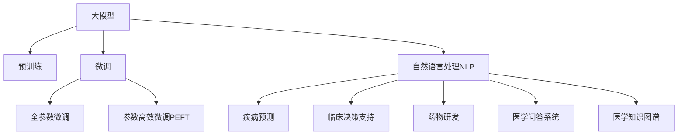

                 

# 大模型在智能医疗中的应用前景

## 1. 背景介绍

### 1.1 问题由来
人工智能（AI）在医疗健康领域的应用正迅速扩展。传统的医疗诊断和治疗过程依赖于医生丰富的经验和知识积累，然而，这种依赖于经验的方法往往容易忽视新的病征和复杂的病例。近年来，随着深度学习技术和大规模预训练语言模型的兴起，AI在医疗健康领域的应用成为可能。大模型通过在大规模无标签文本数据上进行预训练，学习了通用的语言表示，并且能够从医学文献、电子病历、临床报告等多种来源中提取有用信息。

### 1.2 问题核心关键点
大模型在医疗领域的应用主要集中在以下几个方面：

- 疾病预测和诊断：利用大模型的语言理解和生成能力，对症状描述或病历报告进行文本分析，预测可能的疾病或诊断结果。
- 临床决策支持：根据患者的病历信息和电子病历数据，通过自然语言处理技术提供医疗建议和决策支持。
- 药物研发：通过分析药物说明书、临床试验报告等医学文献，利用大模型进行药物的副作用预测、疗效评估等。
- 医学问答系统：提供24小时不间断的医疗咨询和答疑服务，缓解医疗资源紧张的问题。
- 医学知识图谱：构建医学知识图谱，存储和检索医学知识，提升医疗知识管理的效率。

这些应用场景展示了大模型在医疗领域的巨大潜力，但同时也带来了一些挑战，如模型偏见、隐私保护、伦理问题等。因此，如何安全、有效地将大模型应用于医疗领域，成为了当前的重要研究课题。

## 2. 核心概念与联系

### 2.1 核心概念概述

为更好地理解大模型在医疗领域的应用，本节将介绍几个密切相关的核心概念：

- 大模型(Large Models)：以自回归(如GPT)或自编码(如BERT)模型为代表的大规模预训练语言模型。通过在大规模无标签文本语料上进行预训练，学习通用的语言表示，具备强大的语言理解和生成能力。
- 预训练(Pre-training)：指在大规模无标签文本语料上，通过自监督学习任务训练通用语言模型的过程。常见的预训练任务包括言语建模、掩码语言模型等。
- 微调(Fine-tuning)：指在预训练模型的基础上，使用下游任务的少量标注数据，通过有监督学习优化模型在特定任务上的性能。通常只需要调整顶层分类器或解码器，并以较小的学习率更新全部或部分的模型参数。
- 迁移学习(Transfer Learning)：指将一个领域学习到的知识，迁移应用到另一个不同但相关的领域的学习范式。大模型的预训练-微调过程即是一种典型的迁移学习方式。
- 自然语言处理(Natural Language Processing, NLP)：利用计算机处理和分析人类语言的技术，包括文本分类、实体识别、信息抽取、问答系统等。
- 医学知识图谱(Medical Knowledge Graph)：存储医学知识的有向图结构，包括节点（医学概念）和边（医学关系），用于医学信息的检索和推理。

这些核心概念之间的逻辑关系可以通过以下Mermaid流程图来展示：



这个流程图展示了大模型在医疗领域的应用核心概念及其之间的关系：

1. 大模型通过预训练获得基础能力。
2. 微调是对预训练模型进行任务特定的优化，可以分为全参数微调和参数高效微调（PEFT）。
3. 自然语言处理(NLP)技术用于文本分析和理解，包括疾病预测、临床决策支持等。
4. 迁移学习是连接预训练模型与医学任务之间的桥梁，可以通过微调或迁移学习来实现。
5. 医学知识图谱为医疗决策提供知识支撑，提升医疗信息的检索和推理能力。

这些核心概念共同构成了大模型在医疗领域的应用框架，使其能够在该领域发挥强大的语言理解和生成能力。

## 3. 核心算法原理 & 具体操作步骤
### 3.1 算法原理概述

基于监督学习的大模型在医疗领域的应用，本质上是一个有监督的细粒度迁移学习过程。其核心思想是：将预训练的大模型视作一个强大的"特征提取器"，通过在医疗领域标注数据上进行有监督学习，使得模型输出能够匹配任务标签，从而获得针对特定医疗任务优化的模型。

形式化地，假设预训练模型为 $M_{\theta}$，其中 $\theta$ 为预训练得到的模型参数。给定医疗领域 $D$ 的标注数据集 $D=\{(x_i, y_i)\}_{i=1}^N$，微调的目标是找到新的模型参数 $\hat{\theta}$，使得：

$$
\hat{\theta}=\mathop{\arg\min}_{\theta} \mathcal{L}(M_{\theta},D)
$$

其中 $\mathcal{L}$ 为针对医疗任务设计的损失函数，用于衡量模型预测输出与真实标签之间的差异。常见的损失函数包括交叉熵损失、均方误差损失等。

通过梯度下降等优化算法，微调过程不断更新模型参数 $\theta$，最小化损失函数 $\mathcal{L}$，使得模型输出逼近真实标签。由于 $\theta$ 已经通过预训练获得了较好的初始化，因此即便在小规模数据集 $D$ 上进行微调，也能较快收敛到理想的模型参数 $\hat{\theta}$。

### 3.2 算法步骤详解

基于监督学习的大模型在医疗领域的应用，一般包括以下几个关键步骤：

**Step 1: 准备预训练模型和数据集**
- 选择合适的预训练语言模型 $M_{\theta}$ 作为初始化参数，如 BERT、GPT等。
- 准备医疗领域的相关标注数据集 $D$，划分为训练集、验证集和测试集。一般要求标注数据与预训练数据的分布不要差异过大。

**Step 2: 添加任务适配层**
- 根据医疗任务类型，在预训练模型顶层设计合适的输出层和损失函数。
- 对于分类任务，通常在顶层添加线性分类器和交叉熵损失函数。
- 对于生成任务，通常使用语言模型的解码器输出概率分布，并以负对数似然为损失函数。

**Step 3: 设置微调超参数**
- 选择合适的优化算法及其参数，如 AdamW、SGD 等，设置学习率、批大小、迭代轮数等。
- 设置正则化技术及强度，包括权重衰减、Dropout、Early Stopping 等。
- 确定冻结预训练参数的策略，如仅微调顶层，或全部参数都参与微调。

**Step 4: 执行梯度训练**
- 将训练集数据分批次输入模型，前向传播计算损失函数。
- 反向传播计算参数梯度，根据设定的优化算法和学习率更新模型参数。
- 周期性在验证集上评估模型性能，根据性能指标决定是否触发 Early Stopping。
- 重复上述步骤直到满足预设的迭代轮数或 Early Stopping 条件。

**Step 5: 测试和部署**
- 在测试集上评估微调后模型 $M_{\hat{\theta}}$ 的性能，对比微调前后的精度提升。
- 使用微调后的模型对新病例进行推理预测，集成到实际的应用系统中。
- 持续收集新的医疗数据，定期重新微调模型，以适应数据分布的变化。

以上是基于监督学习微调大模型在医疗领域的一般流程。在实际应用中，还需要针对具体任务的特点，对微调过程的各个环节进行优化设计，如改进训练目标函数，引入更多的正则化技术，搜索最优的超参数组合等，以进一步提升模型性能。

### 3.3 算法优缺点

基于监督学习的大模型在医疗领域的应用方法具有以下优点：
1. 简单高效。只需准备少量标注数据，即可对预训练模型进行快速适配，获得较大的性能提升。
2. 通用适用。适用于各种医疗领域任务，包括疾病预测、临床决策支持等，设计简单的任务适配层即可实现微调。
3. 参数高效。利用参数高效微调技术，在固定大部分预训练权重不变的情况下，仍可取得不错的提升。
4. 效果显著。在学术界和工业界的诸多任务上，基于微调的方法已经刷新了多项医疗任务SOTA。

同时，该方法也存在一定的局限性：
1. 依赖标注数据。微调的效果很大程度上取决于标注数据的质量和数量，获取高质量标注数据的成本较高。
2. 迁移能力有限。当目标任务与预训练数据的分布差异较大时，微调的性能提升有限。
3. 负面效果传递。预训练模型的固有偏见、有害信息等，可能通过微调传递到下游任务，造成负面影响。
4. 可解释性不足。微调模型的决策过程通常缺乏可解释性，难以对其推理逻辑进行分析和调试。

尽管存在这些局限性，但就目前而言，基于监督学习的微调方法仍是大模型在医疗领域应用的主流范式。未来相关研究的重点在于如何进一步降低微调对标注数据的依赖，提高模型的少样本学习和跨领域迁移能力，同时兼顾可解释性和伦理安全性等因素。

## 4. 数学模型和公式 & 详细讲解  
### 4.1 数学模型构建

本节将使用数学语言对基于监督学习的大模型在医疗领域微调过程进行更加严格的刻画。

记预训练语言模型为 $M_{\theta}$，其中 $\theta$ 为预训练得到的模型参数。假设医疗领域 $D$ 的标注数据集为 $D=\{(x_i,y_i)\}_{i=1}^N$，其中 $x_i$ 为医疗文本描述，$y_i$ 为医疗标签。

定义模型 $M_{\theta}$ 在输入 $x$ 上的损失函数为 $\ell(M_{\theta}(x),y)$，则在数据集 $D$ 上的经验风险为：

$$
\mathcal{L}(\theta) = \frac{1}{N}\sum_{i=1}^N \ell(M_{\theta}(x_i),y_i)
$$

微调的优化目标是最小化经验风险，即找到最优参数：

$$
\theta^* = \mathop{\arg\min}_{\theta} \mathcal{L}(\theta)
$$

在实践中，我们通常使用基于梯度的优化算法（如SGD、Adam等）来近似求解上述最优化问题。设 $\eta$ 为学习率，$\lambda$ 为正则化系数，则参数的更新公式为：

$$
\theta \leftarrow \theta - \eta \nabla_{\theta}\mathcal{L}(\theta) - \eta\lambda\theta
$$

其中 $\nabla_{\theta}\mathcal{L}(\theta)$ 为损失函数对参数 $\theta$ 的梯度，可通过反向传播算法高效计算。

### 4.2 公式推导过程

以下我们以疾病预测任务为例，推导交叉熵损失函数及其梯度的计算公式。

假设模型 $M_{\theta}$ 在输入 $x$ 上的输出为 $\hat{y}=M_{\theta}(x) \in [0,1]$，表示模型预测样本属于某个疾病类别的概率。真实标签 $y \in \{0,1\}$。则二分类交叉熵损失函数定义为：

$$
\ell(M_{\theta}(x),y) = -[y\log \hat{y} + (1-y)\log (1-\hat{y})]
$$

将其代入经验风险公式，得：

$$
\mathcal{L}(\theta) = -\frac{1}{N}\sum_{i=1}^N [y_i\log M_{\theta}(x_i)+(1-y_i)\log(1-M_{\theta}(x_i))]
$$

根据链式法则，损失函数对参数 $\theta_k$ 的梯度为：

$$
\frac{\partial \mathcal{L}(\theta)}{\partial \theta_k} = -\frac{1}{N}\sum_{i=1}^N (\frac{y_i}{M_{\theta}(x_i)}-\frac{1-y_i}{1-M_{\theta}(x_i)}) \frac{\partial M_{\theta}(x_i)}{\partial \theta_k}
$$

其中 $\frac{\partial M_{\theta}(x_i)}{\partial \theta_k}$ 可进一步递归展开，利用自动微分技术完成计算。

在得到损失函数的梯度后，即可带入参数更新公式，完成模型的迭代优化。重复上述过程直至收敛，最终得到适应医疗任务的最优模型参数 $\theta^*$。

## 5. 项目实践：代码实例和详细解释说明
### 5.1 开发环境搭建

在进行医疗领域微调实践前，我们需要准备好开发环境。以下是使用Python进行PyTorch开发的环境配置流程：

1. 安装Anaconda：从官网下载并安装Anaconda，用于创建独立的Python环境。

2. 创建并激活虚拟环境：
```bash
conda create -n pytorch-env python=3.8 
conda activate pytorch-env
```

3. 安装PyTorch：根据CUDA版本，从官网获取对应的安装命令。例如：
```bash
conda install pytorch torchvision torchaudio cudatoolkit=11.1 -c pytorch -c conda-forge
```

4. 安装Transformers库：
```bash
pip install transformers
```

5. 安装各类工具包：
```bash
pip install numpy pandas scikit-learn matplotlib tqdm jupyter notebook ipython
```

完成上述步骤后，即可在`pytorch-env`环境中开始医疗领域微调实践。

### 5.2 源代码详细实现

下面我们以疾病预测任务为例，给出使用Transformers库对BERT模型进行医疗领域微调的PyTorch代码实现。

首先，定义疾病预测任务的数据处理函数：

```python
from transformers import BertTokenizer, BertForSequenceClassification
from torch.utils.data import Dataset
import torch

class DiseaseDataset(Dataset):
    def __init__(self, texts, labels, tokenizer, max_len=128):
        self.texts = texts
        self.labels = labels
        self.tokenizer = tokenizer
        self.max_len = max_len
        
    def __len__(self):
        return len(self.texts)
    
    def __getitem__(self, item):
        text = self.texts[item]
        label = self.labels[item]
        
        encoding = self.tokenizer(text, return_tensors='pt', max_length=self.max_len, padding='max_length', truncation=True)
        input_ids = encoding['input_ids'][0]
        attention_mask = encoding['attention_mask'][0]
        
        # 对label进行编码
        encoded_labels = torch.tensor(label, dtype=torch.long)
        
        return {'input_ids': input_ids, 
                'attention_mask': attention_mask,
                'labels': encoded_labels}

# 标签与id的映射
label2id = {'疾病A': 0, '疾病B': 1, '疾病C': 2, '无疾病': 3}
id2label = {v: k for k, v in label2id.items()}

# 创建dataset
tokenizer = BertTokenizer.from_pretrained('bert-base-cased')

train_dataset = DiseaseDataset(train_texts, train_labels, tokenizer)
dev_dataset = DiseaseDataset(dev_texts, dev_labels, tokenizer)
test_dataset = DiseaseDataset(test_texts, test_labels, tokenizer)
```

然后，定义模型和优化器：

```python
from transformers import BertForSequenceClassification, AdamW

model = BertForSequenceClassification.from_pretrained('bert-base-cased', num_labels=len(label2id))

optimizer = AdamW(model.parameters(), lr=2e-5)
```

接着，定义训练和评估函数：

```python
from torch.utils.data import DataLoader
from tqdm import tqdm
from sklearn.metrics import classification_report

device = torch.device('cuda') if torch.cuda.is_available() else torch.device('cpu')
model.to(device)

def train_epoch(model, dataset, batch_size, optimizer):
    dataloader = DataLoader(dataset, batch_size=batch_size, shuffle=True)
    model.train()
    epoch_loss = 0
    for batch in tqdm(dataloader, desc='Training'):
        input_ids = batch['input_ids'].to(device)
        attention_mask = batch['attention_mask'].to(device)
        labels = batch['labels'].to(device)
        model.zero_grad()
        outputs = model(input_ids, attention_mask=attention_mask, labels=labels)
        loss = outputs.loss
        epoch_loss += loss.item()
        loss.backward()
        optimizer.step()
    return epoch_loss / len(dataloader)

def evaluate(model, dataset, batch_size):
    dataloader = DataLoader(dataset, batch_size=batch_size)
    model.eval()
    preds, labels = [], []
    with torch.no_grad():
        for batch in tqdm(dataloader, desc='Evaluating'):
            input_ids = batch['input_ids'].to(device)
            attention_mask = batch['attention_mask'].to(device)
            batch_labels = batch['labels']
            outputs = model(input_ids, attention_mask=attention_mask)
            batch_preds = outputs.logits.argmax(dim=2).to('cpu').tolist()
            batch_labels = batch_labels.to('cpu').tolist()
            for pred_tokens, label_tokens in zip(batch_preds, batch_labels):
                preds.append(pred_tokens[:len(label_tokens)])
                labels.append(label_tokens)
                
    print(classification_report(labels, preds))
```

最后，启动训练流程并在测试集上评估：

```python
epochs = 5
batch_size = 16

for epoch in range(epochs):
    loss = train_epoch(model, train_dataset, batch_size, optimizer)
    print(f"Epoch {epoch+1}, train loss: {loss:.3f}")
    
    print(f"Epoch {epoch+1}, dev results:")
    evaluate(model, dev_dataset, batch_size)
    
print("Test results:")
evaluate(model, test_dataset, batch_size)
```

以上就是使用PyTorch对BERT进行疾病预测任务微调的完整代码实现。可以看到，得益于Transformers库的强大封装，我们可以用相对简洁的代码完成BERT模型的加载和微调。

### 5.3 代码解读与分析

让我们再详细解读一下关键代码的实现细节：

**DiseaseDataset类**：
- `__init__`方法：初始化文本、标签、分词器等关键组件。
- `__len__`方法：返回数据集的样本数量。
- `__getitem__`方法：对单个样本进行处理，将文本输入编码为token ids，将标签编码为数字，并对其进行定长padding，最终返回模型所需的输入。

**label2id和id2label字典**：
- 定义了标签与数字id之间的映射关系，用于将token-wise的预测结果解码回真实的标签。

**训练和评估函数**：
- 使用PyTorch的DataLoader对数据集进行批次化加载，供模型训练和推理使用。
- 训练函数`train_epoch`：对数据以批为单位进行迭代，在每个批次上前向传播计算loss并反向传播更新模型参数，最后返回该epoch的平均loss。
- 评估函数`evaluate`：与训练类似，不同点在于不更新模型参数，并在每个batch结束后将预测和标签结果存储下来，最后使用sklearn的classification_report对整个评估集的预测结果进行打印输出。

**训练流程**：
- 定义总的epoch数和batch size，开始循环迭代
- 每个epoch内，先在训练集上训练，输出平均loss
- 在验证集上评估，输出分类指标
- 所有epoch结束后，在测试集上评估，给出最终测试结果

可以看到，PyTorch配合Transformers库使得BERT微调的代码实现变得简洁高效。开发者可以将更多精力放在数据处理、模型改进等高层逻辑上，而不必过多关注底层的实现细节。

当然，工业级的系统实现还需考虑更多因素，如模型的保存和部署、超参数的自动搜索、更灵活的任务适配层等。但核心的微调范式基本与此类似。

## 6. 实际应用场景
### 6.1 智能问诊系统

基于大模型微调的智能问诊系统，可以显著提升医疗机构的服务效率和患者满意度。传统的问诊方式需要耗费大量时间和人力，且容易出错。通过智能问诊系统，患者可以通过自然语言输入症状描述，系统能够自动分析疾病风险，并给出初步的诊断建议，从而缩短问诊时间，减轻医护人员的负担。

在技术实现上，可以收集医疗领域的标准症状描述、疾病特征等文本数据，构建一个包含多种疾病诊断的标注数据集。在此基础上对预训练模型进行微调，使其能够自动判断患者输入的症状描述所属的疾病类型。微调后的模型能够理解患者的自然语言描述，并从中提取出关键症状，从而提供初步的诊断和治疗建议。对于复杂的病例，系统可以进一步引导患者做进一步检查或转接至人工问诊。

### 6.2 临床决策支持系统

临床决策支持系统(Clinical Decision Support System, CDSS)是辅助医生进行临床决策的重要工具。通过将病历数据输入微调模型，系统可以自动提取关键信息，如病史、症状、药物使用情况等，并进行综合分析，给出诊断和治疗建议。系统可以根据医生的决策反馈，不断优化微调模型的性能，确保输出建议的准确性和实用性。

在实际应用中，临床决策支持系统可以与医院的信息系统（如EMR系统）无缝集成，实时获取患者的病历信息，并进行分析。通过将微调模型嵌入到CDSS中，系统能够提供实时的诊断和治疗建议，从而辅助医生进行更加精准和高效的决策。同时，系统还可以通过反馈机制不断学习医生的临床经验，进一步提升模型的性能。

### 6.3 药物副作用预测

药物副作用预测是大数据在医疗领域的一个重要应用。通过收集大量药物说明书、临床试验报告等文本数据，对预训练模型进行微调，系统能够自动提取药物的副作用信息，并给出相应的风险评估。这将帮助医生和患者更好地理解药物的潜在风险，从而进行更加合理的用药决策。

在实际应用中，药物副作用预测系统可以与电子病历系统、药物数据库等结合，实时获取患者的用药信息，并进行分析。通过将微调模型嵌入到系统中，系统能够自动提取药物的副作用信息，并给出相应的风险评估。这将帮助医生和患者更好地理解药物的潜在风险，从而进行更加合理的用药决策。

### 6.4 医学问答系统

医学问答系统是提供24小时不间断医疗咨询和答疑服务的重要手段。通过将常见医学问题及其答案构建为标注数据集，对预训练模型进行微调，系统能够自动理解用户的问题，并给出相应的答案。这将大大缓解医疗资源紧张的问题，提升医疗服务的可及性。

在技术实现上，医学问答系统可以与语音识别、自然语言处理等技术结合，通过语音、文字等多种方式获取用户的问题，并进行分析。通过将微调模型嵌入到系统中，系统能够自动理解用户的问题，并给出相应的答案。这将大大缓解医疗资源紧张的问题，提升医疗服务的可及性。

### 6.5 医学知识图谱

医学知识图谱是将医学知识进行结构化存储和检索的有向图结构。通过将医学文献、电子病历等文本数据进行深度分析，将医学概念、实体和关系存储为知识图谱，并利用微调模型进行信息检索和推理。这将有助于提升医疗知识管理的效率，加速新药研发进程。

在实际应用中，医学知识图谱可以与电子病历系统、药物数据库等结合，实时获取医疗数据，并进行分析。通过将微调模型嵌入到系统中，系统能够自动提取医疗知识，并进行信息检索和推理。这将有助于提升医疗知识管理的效率，加速新药研发进程。

## 7. 工具和资源推荐
### 7.1 学习资源推荐

为了帮助开发者系统掌握大模型在医疗领域的应用理论基础和实践技巧，这里推荐一些优质的学习资源：

1. 《Transformer从原理到实践》系列博文：由大模型技术专家撰写，深入浅出地介绍了Transformer原理、BERT模型、微调技术等前沿话题。

2. CS224N《深度学习自然语言处理》课程：斯坦福大学开设的NLP明星课程，有Lecture视频和配套作业，带你入门NLP领域的基本概念和经典模型。

3. 《Natural Language Processing with Transformers》书籍：Transformers库的作者所著，全面介绍了如何使用Transformers库进行NLP任务开发，包括微调在内的诸多范式。

4. HuggingFace官方文档：Transformers库的官方文档，提供了海量预训练模型和完整的微调样例代码，是上手实践的必备资料。

5. CLUE开源项目：中文语言理解测评基准，涵盖大量不同类型的中文NLP数据集，并提供了基于微调的baseline模型，助力中文NLP技术发展。

通过对这些资源的学习实践，相信你一定能够快速掌握大模型在医疗领域的应用精髓，并用于解决实际的NLP问题。
###  7.2 开发工具推荐

高效的开发离不开优秀的工具支持。以下是几款用于大模型在医疗领域微调开发的常用工具：

1. PyTorch：基于Python的开源深度学习框架，灵活动态的计算图，适合快速迭代研究。大部分预训练语言模型都有PyTorch版本的实现。

2. TensorFlow：由Google主导开发的开源深度学习框架，生产部署方便，适合大规模工程应用。同样有丰富的预训练语言模型资源。

3. Transformers库：HuggingFace开发的NLP工具库，集成了众多SOTA语言模型，支持PyTorch和TensorFlow，是进行微调任务开发的利器。

4. Weights & Biases：模型训练的实验跟踪工具，可以记录和可视化模型训练过程中的各项指标，方便对比和调优。与主流深度学习框架无缝集成。

5. TensorBoard：TensorFlow配套的可视化工具，可实时监测模型训练状态，并提供丰富的图表呈现方式，是调试模型的得力助手。

6. Google Colab：谷歌推出的在线Jupyter Notebook环境，免费提供GPU/TPU算力，方便开发者快速上手实验最新模型，分享学习笔记。

合理利用这些工具，可以显著提升大模型在医疗领域微调的开发效率，加快创新迭代的步伐。

### 7.3 相关论文推荐

大模型在医疗领域的应用源于学界的持续研究。以下是几篇奠基性的相关论文，推荐阅读：

1. Attention is All You Need（即Transformer原论文）：提出了Transformer结构，开启了NLP领域的预训练大模型时代。

2. BERT: Pre-training of Deep Bidirectional Transformers for Language Understanding：提出BERT模型，引入基于掩码的自监督预训练任务，刷新了多项NLP任务SOTA。

3. Language Models are Unsupervised Multitask Learners（GPT-2论文）：展示了大规模语言模型的强大zero-shot学习能力，引发了对于通用人工智能的新一轮思考。

4. Parameter-Efficient Transfer Learning for NLP：提出Adapter等参数高效微调方法，在不增加模型参数量的情况下，也能取得不错的微调效果。

5. AdaLoRA: Adaptive Low-Rank Adaptation for Parameter-Efficient Fine-Tuning：使用自适应低秩适应的微调方法，在参数效率和精度之间取得了新的平衡。

这些论文代表了大模型在医疗领域的应用发展脉络。通过学习这些前沿成果，可以帮助研究者把握学科前进方向，激发更多的创新灵感。

## 8. 总结：未来发展趋势与挑战

### 8.1 总结

本文对基于监督学习的大模型在医疗领域的应用进行了全面系统的介绍。首先阐述了大模型在医疗领域的应用背景和意义，明确了大模型在医疗领域的应用场景和目标。其次，从原理到实践，详细讲解了监督微调模型的数学原理和关键步骤，给出了医疗领域微调任务开发的完整代码实例。同时，本文还广泛探讨了微调方法在智能问诊、临床决策支持等医疗领域的应用前景，展示了微调范式的巨大潜力。此外，本文精选了微调技术的各类学习资源，力求为读者提供全方位的技术指引。

通过本文的系统梳理，可以看到，基于大模型的微调方法在医疗领域具有广泛的应用前景，可以显著提升医疗服务的智能化水平，帮助医生进行更精准的诊断和治疗决策。未来，伴随预训练语言模型和微调方法的持续演进，相信大模型在医疗领域的应用将更加深入和广泛，为医疗健康事业带来更多的机遇和挑战。

### 8.2 未来发展趋势

展望未来，大模型在医疗领域的应用将呈现以下几个发展趋势：

1. 模型规模持续增大。随着算力成本的下降和数据规模的扩张，预训练语言模型的参数量还将持续增长。超大规模语言模型蕴含的丰富语言知识，有望支撑更加复杂多变的医疗任务微调。

2. 微调方法日趋多样。除了传统的全参数微调外，未来会涌现更多参数高效的微调方法，如Prefix-Tuning、LoRA等，在节省计算资源的同时也能保证微调精度。

3. 持续学习成为常态。随着数据分布的不断变化，微调模型也需要持续学习新知识以保持性能。如何在不遗忘原有知识的同时，高效吸收新样本信息，将成为重要的研究课题。

4. 标注样本需求降低。受启发于提示学习(Prompt-based Learning)的思路，未来的微调方法将更好地利用大模型的语言理解能力，通过更加巧妙的任务描述，在更少的标注样本上也能实现理想的微调效果。

5. 多模态微调崛起。当前微调主要聚焦于纯文本数据，未来会进一步拓展到图像、视频、语音等多模态数据微调。多模态信息的融合，将显著提升语言模型对现实世界的理解和建模能力。

6. 知识整合能力增强。现有的微调模型往往局限于任务内数据，难以灵活吸收和运用更广泛的先验知识。如何让微调过程更好地与外部知识库、规则库等专家知识结合，形成更加全面、准确的信息整合能力，还有很大的想象空间。

以上趋势凸显了大模型在医疗领域的应用前景。这些方向的探索发展，必将进一步提升医疗服务的智能化水平，为人类健康事业带来深远影响。

### 8.3 面临的挑战

尽管大模型在医疗领域的应用已经取得了一定的进展，但在迈向更加智能化、普适化应用的过程中，它仍面临着诸多挑战：

1. 标注成本瓶颈。虽然微调大大降低了标注数据的需求，但对于长尾应用场景，难以获得充足的高质量标注数据，成为制约微调性能的瓶颈。如何进一步降低微调对标注样本的依赖，将是一大难题。

2. 模型鲁棒性不足。当前微调模型面对域外数据时，泛化性能往往大打折扣。对于测试样本的微小扰动，微调模型的预测也容易发生波动。如何提高微调模型的鲁棒性，避免灾难性遗忘，还需要更多理论和实践的积累。

3. 推理效率有待提高。大规模语言模型虽然精度高，但在实际部署时往往面临推理速度慢、内存占用大等效率问题。如何在保证性能的同时，简化模型结构，提升推理速度，优化资源占用，将是重要的优化方向。

4. 可解释性亟需加强。当前微调模型更像是"黑盒"系统，难以解释其内部工作机制和决策逻辑。对于医疗、金融等高风险应用，算法的可解释性和可审计性尤为重要。如何赋予微调模型更强的可解释性，将是亟待攻克的难题。

5. 安全性有待保障。预训练语言模型难免会学习到有偏见、有害的信息，通过微调传递到下游任务，产生误导性、歧视性的输出，给实际应用带来安全隐患。如何从数据和算法层面消除模型偏见，避免恶意用途，确保输出的安全性，也将是重要的研究课题。

6. 知识整合能力不足。现有的微调模型往往局限于任务内数据，难以灵活吸收和运用更广泛的先验知识。如何让微调过程更好地与外部知识库、规则库等专家知识结合，形成更加全面、准确的信息整合能力，还有很大的想象空间。

正视微调面临的这些挑战，积极应对并寻求突破，将是大模型在医疗领域走向成熟的必由之路。相信随着学界和产业界的共同努力，这些挑战终将一一被克服，大模型在医疗领域的应用必将走向更加成熟和广泛。

### 8.4 未来突破

面对大模型在医疗领域应用所面临的种种挑战，未来的研究需要在以下几个方面寻求新的突破：

1. 探索无监督和半监督微调方法。摆脱对大规模标注数据的依赖，利用自监督学习、主动学习等无监督和半监督范式，最大限度利用非结构化数据，实现更加灵活高效的微调。

2. 研究参数高效和计算高效的微调范式。开发更加参数高效的微调方法，在固定大部分预训练参数的同时，只更新极少量的任务相关参数。同时优化微调模型的计算图，减少前向传播和反向传播的资源消耗，实现更加轻量级、实时性的部署。

3. 融合因果和对比学习范式。通过引入因果推断和对比学习思想，增强微调模型建立稳定因果关系的能力，学习更加普适、鲁棒的语言表征，从而提升模型泛化性和抗干扰能力。

4. 引入更多先验知识。将符号化的先验知识，如知识图谱、逻辑规则等，与神经网络模型进行巧妙融合，引导微调过程学习更准确、合理的语言模型。同时加强不同模态数据的整合，实现视觉、语音等多模态信息与文本信息的协同建模。

5. 结合因果分析和博弈论工具。将因果分析方法引入微调模型，识别出模型决策的关键特征，增强输出解释的因果性和逻辑性。借助博弈论工具刻画人机交互过程，主动探索并规避模型的脆弱点，提高系统稳定性。

6. 纳入伦理道德约束。在模型训练目标中引入伦理导向的评估指标，过滤和惩罚有偏见、有害的输出倾向。同时加强人工干预和审核，建立模型行为的监管机制，确保输出符合人类价值观和伦理道德。

这些研究方向的探索，必将引领大模型在医疗领域的应用迈向更高的台阶，为构建安全、可靠、可解释、可控的智能系统铺平道路。面向未来，大模型在医疗领域的应用还需要与其他人工智能技术进行更深入的融合，如知识表示、因果推理、强化学习等，多路径协同发力，共同推动医疗知识管理和智能诊断系统的进步。只有勇于创新、敢于突破，才能不断拓展大模型在医疗领域的边界，让智能技术更好地造福人类健康事业。

## 9. 附录：常见问题与解答

**Q1：大模型在医疗领域的应用是否安全可靠？**

A: 大模型在医疗领域的应用，其安全性和可靠性是关键的考量因素。尽管预训练模型可以通过微调获得一定的医疗领域知识，但在实际应用中仍需注意以下几点：

1. 数据质量：确保医疗数据的真实性和准确性，避免数据偏差影响模型的决策结果。
2. 模型偏见：消除模型中的固有偏见和有害信息，避免歧视性或误导性的输出。
3. 模型鲁棒性：增强模型对异常输入的鲁棒性，避免对微小扰动的敏感性。
4. 可解释性：提高模型的可解释性，增强决策过程的透明性和可审计性。
5. 隐私保护：在数据使用和处理过程中，严格遵守数据隐私法规，保护患者隐私。

通过采取这些措施，可以在一定程度上提升大模型在医疗领域应用的可靠性，确保其在实际场景中的安全性和有效性。

**Q2：微调过程中如何避免过拟合？**

A: 过拟合是微调过程中常见的问题，尤其是在标注数据不足的情况下。以下是几种常用的避免过拟合的策略：

1. 数据增强：通过回译、近义替换等方式扩充训练集，增加样本多样性。
2. 正则化：使用L2正则、Dropout等正则化技术，防止模型过度适应训练集。
3. 对抗训练：引入对抗样本，提高模型对输入噪声的鲁棒性。
4. 模型裁剪：去除不必要的层和参数，减小模型尺寸，加快推理速度。
5. 早停策略：在验证集上评估模型性能，当模型性能不再提升时，提前停止训练。

通过这些方法，可以在一定程度上缓解过拟合问题，提升微调模型的泛化能力。

**Q3：大模型在医疗领域的应用前景如何？**

A: 大模型在医疗领域的应用前景非常广阔。以下是一些具体的应用场景：

1. 智能问诊：通过自然语言处理技术，自动分析患者症状，给出初步诊断建议。
2. 临床决策支持：辅助医生进行诊断和治疗决策，提升临床决策的准确性和效率。
3. 药物副作用预测：自动提取药物副作用信息，评估药物风险，辅助用药决策。
4. 医学问答系统：提供24小时不间断医疗咨询和答疑服务，缓解医疗资源紧张。
5. 医学知识图谱：存储和检索医学知识，提升医学信息管理和检索效率。

这些应用场景展示了大模型在医疗领域的重要价值，相信在未来将有更多的落地应用出现。

**Q4：大模型在医疗领域的应用中需要注意哪些伦理问题？**

A: 大模型在医疗领域的应用涉及多个伦理问题，需要引起重视：

1. 数据隐私：在数据收集和处理过程中，严格遵守数据隐私法规，保护患者隐私。
2. 公平性：确保模型对所有患者公平对待，避免基于性别、种族、年龄等的歧视性决策。
3. 透明性：提高模型的可解释性，增强决策过程的透明性和可审计性。
4. 责任归属：明确模型在使用过程中的责任归属，避免因模型错误导致医疗事故。
5. 伦理审查：在模型开发和应用过程中，进行严格的伦理审查，确保符合伦理道德标准。

通过采取这些措施，可以在一定程度上提升大模型在医疗领域应用的伦理水平，确保其在使用过程中符合伦理道德规范。

**Q5：大模型在医疗领域的应用需要哪些技术支持？**

A: 大模型在医疗领域的应用需要多种技术的支持，以下是一些关键技术：

1. 深度学习：大模型的训练和微调依赖于深度学习技术，如图像识别、自然语言处理等。
2. 自然语言处理：通过自然语言处理技术，实现对医学文献、电子病历等文本数据的深度分析。
3. 知识图谱：构建医学知识图谱，存储和检索医学知识，提升医学信息管理的效率。
4. 数据增强：通过数据增强技术，扩充训练集，提升模型的泛化能力。
5. 对抗训练：通过对抗训练技术，提高模型的鲁棒性，避免对异常输入的敏感性。
6. 可解释性技术：通过可解释性技术，增强模型的透明性和可审计性。

这些技术共同支持了大模型在医疗领域的应用，确保其在实际场景中的有效性和可靠性。

---

作者：禅与计算机程序设计艺术 / Zen and the Art of Computer Programming

