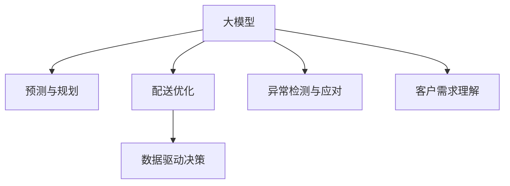

                 

# 大模型在智能物流中的应用探索

> 关键词：大模型,智能物流,预测与规划,配送优化,数据驱动决策

## 1. 背景介绍

### 1.1 问题由来
随着全球经济一体化加速，跨境电商、生鲜配送、快递物流等智能物流领域的业务规模不断扩大，复杂的物流网络带来了大量运营和管理挑战。传统的物流管理系统往往依赖人工经验和简单的规则模型，难以应对多变的业务需求和海量数据。然而，数据驱动和人工智能技术为智能物流的发展带来了新的机遇。

近年来，大模型在自然语言处理(NLP)、计算机视觉等领域取得了突破性进展，大模型的强大表征能力和泛化能力也逐渐引起了物流行业的关注。如何在智能物流中有效利用大模型，提升物流系统的运营效率和用户体验，成为当前研究的热点。

### 1.2 问题核心关键点
大模型在智能物流中的应用主要聚焦于以下几个关键点：

- **预测与规划**：利用大模型对物流需求、配送路线、库存水平等进行预测，为物流计划和决策提供支撑。
- **配送优化**：利用大模型对物流配送路径进行优化，提高配送效率，降低成本。
- **数据驱动决策**：结合物流领域的大数据，训练大模型学习最优的物流策略，优化物流运营。
- **异常检测与应对**：利用大模型检测物流系统中的异常情况，如货物丢失、运输延误等，并及时调整策略。
- **客户需求理解**：利用大模型分析客户需求，提供个性化的物流服务，提升用户体验。

这些应用场景体现了大模型在智能物流领域的应用潜力，通过对大模型的有效利用，可以有效提升物流系统的智能化水平和运营效率。

## 2. 核心概念与联系

### 2.1 核心概念概述

为更好地理解大模型在智能物流中的应用，本节将介绍几个密切相关的核心概念：

- **大模型(Large Model)**：指拥有亿级参数的深度学习模型，如BERT、GPT-3等。通过大规模无标签数据预训练，大模型能够学习到丰富的知识，具备强大的泛化能力和表征能力。
- **预测与规划(Prediction and Planning)**：指利用大模型对未来的物流需求、配送路径等进行预测，辅助物流系统进行计划和决策。
- **配送优化(Delivery Optimization)**：指利用大模型对物流配送路线进行优化，提高配送效率，降低物流成本。
- **数据驱动决策(Data-Driven Decision)**：指基于物流领域的大数据训练大模型，学习最优的物流策略，优化物流运营。
- **异常检测与应对(Anomaly Detection and Response)**：指利用大模型检测物流系统中的异常情况，并及时调整策略，保障物流服务稳定。
- **客户需求理解(Customer Demand Understanding)**：指利用大模型分析客户需求，提供个性化的物流服务，提升用户体验。

这些概念之间的逻辑关系可以通过以下Mermaid流程图来展示：



这个流程图展示了物流系统中不同应用场景与大模型的连接关系：

1. 大模型在预测与规划、配送优化、数据驱动决策、异常检测与应对、客户需求理解等多个领域发挥作用。
2. 预测与规划、配送优化等场景，利用大模型进行预测和规划，辅助物流系统进行决策。
3. 数据驱动决策场景，利用大模型学习最优的物流策略，优化运营。
4. 异常检测与应对场景，利用大模型检测异常情况，并及时调整策略。
5. 客户需求理解场景，利用大模型分析客户需求，提供个性化服务。

## 3. 核心算法原理 & 具体操作步骤

### 3.1 算法原理概述

基于大模型的智能物流系统，核心思想是通过预训练语言模型对物流领域的知识进行学习，然后在实际应用中利用这些知识进行预测和优化。具体而言，可以采用以下步骤：

1. **数据准备**：收集物流领域的相关数据，包括历史物流数据、客户需求数据、交通数据等。
2. **模型预训练**：使用大规模无标签数据对大模型进行预训练，使其学习到物流领域的通用知识。
3. **任务适配**：针对具体的物流预测与规划、配送优化等任务，对预训练模型进行微调，使其适应特定任务。
4. **模型应用**：在实际物流场景中，使用微调后的模型进行预测和规划，辅助物流决策。

### 3.2 算法步骤详解

以下详细介绍大模型在智能物流中的预测与规划、配送优化、数据驱动决策、异常检测与应对、客户需求理解等场景的应用流程：

**Step 1: 数据准备**

物流领域的数据种类繁多，包括历史物流数据、客户需求数据、交通数据、天气数据等。数据准备的主要步骤包括：

- **数据收集**：从物流公司、电商平台、交通部门等获取数据。
- **数据清洗**：对数据进行去重、去噪、填补缺失值等处理，保证数据质量。
- **数据标注**：对部分数据进行标注，如订单时间、配送地址、车辆类型等。

**Step 2: 模型预训练**

在大模型上进行预训练，主要步骤包括：

- **数据预处理**：将收集的数据进行清洗和标注，转换为模型可处理的格式。
- **模型训练**：使用预处理后的数据对大模型进行训练，通常采用自监督学习任务如掩码语言模型、自编码等。
- **参数保存**：保存预训练模型的参数，以备后续微调使用。

**Step 3: 任务适配**

在实际物流场景中，任务适配主要通过微调大模型来实现，主要步骤包括：

- **选择任务**：根据物流需求，选择具体的预测与规划、配送优化等任务。
- **设计目标函数**：针对任务设计合适的损失函数，如交叉熵损失、均方误差损失等。
- **微调模型**：使用标注数据对预训练模型进行微调，更新模型参数以适应特定任务。
- **性能评估**：在验证集上评估模型性能，调整超参数以优化模型效果。

**Step 4: 模型应用**

模型应用主要通过将微调后的模型集成到物流系统中，实现对物流数据的实时处理和预测。具体步骤包括：

- **数据输入**：将实时物流数据输入微调后的模型，如订单信息、天气情况等。
- **模型预测**：模型根据输入数据进行预测，输出物流需求预测、配送路线优化等结果。
- **决策支持**：将预测结果反馈给物流管理人员，辅助其进行决策。

### 3.3 算法优缺点

基于大模型的智能物流系统具有以下优点：

- **高效性**：大模型的泛化能力使得其在实际物流场景中可以快速适应，提升运营效率。
- **鲁棒性**：大模型通过学习大量数据，具备较强的鲁棒性，能够应对各种复杂场景。
- **灵活性**：大模型可以根据需要，灵活调整参数和架构，适应不同的任务需求。

同时，该方法也存在一些局限性：

- **数据依赖**：大模型的效果很大程度上取决于数据质量和数量，获取高质量标注数据成本较高。
- **计算资源需求高**：预训练和微调大模型需要大量的计算资源，如高性能GPU和TPU等。
- **模型复杂度高**：大模型的参数量较大，在实际应用中可能会面临推理速度慢和存储消耗大等问题。

尽管存在这些局限性，但大模型在智能物流领域的应用前景广阔，能够显著提升物流系统的智能化水平和运营效率。

### 3.4 算法应用领域

基于大模型的智能物流系统在多个领域都有应用前景，包括但不限于：

- **预测与规划**：在电商、快递等场景，利用大模型对订单量、配送需求进行预测，辅助物流计划和调度。
- **配送优化**：在配送环节，利用大模型对配送路线、车辆调度进行优化，降低配送成本和提升效率。
- **数据驱动决策**：在库存管理、运输优化等场景，利用大模型对物流数据进行分析，学习最优策略，优化运营。
- **异常检测与应对**：在物流系统中，利用大模型检测异常情况，如货物丢失、运输延误等，并及时调整策略。
- **客户需求理解**：在客户服务环节，利用大模型分析客户需求，提供个性化的物流服务，提升用户体验。

除了上述这些经典应用外，大模型在物流领域还可以拓展到更多场景中，如仓储管理、运输安全等，为物流系统带来新的突破。

## 4. 数学模型和公式 & 详细讲解 & 举例说明

### 4.1 数学模型构建

假设物流需求预测任务的数据集为 $D=\{(x_i,y_i)\}_{i=1}^N, x_i \in \mathcal{X}, y_i \in \mathcal{Y}$，其中 $x_i$ 为物流订单的历史信息，$y_i$ 为预测的订单量。物流需求预测的数学模型为：

$$
\hat{y} = f(x; \theta)
$$

其中 $f$ 为模型函数，$\theta$ 为模型参数，$\hat{y}$ 为预测结果。

假设大模型为 $M_{\theta}$，则预测与规划任务的目标函数为：

$$
\mathcal{L}(\theta) = \frac{1}{N} \sum_{i=1}^N \ell(f(x_i; \theta), y_i)
$$

其中 $\ell$ 为损失函数，通常采用均方误差损失函数：

$$
\ell(y, \hat{y}) = \frac{1}{N} \sum_{i=1}^N (y_i - \hat{y}_i)^2
$$

### 4.2 公式推导过程

以下以物流需求预测为例，推导预测与规划任务的数学模型和算法流程。

假设物流需求预测任务的数据集为 $D=\{(x_i,y_i)\}_{i=1}^N$，其中 $x_i$ 为物流订单的历史信息，$y_i$ 为预测的订单量。预测与规划任务的目标函数为：

$$
\mathcal{L}(\theta) = \frac{1}{N} \sum_{i=1}^N (y_i - f(x_i; \theta))^2
$$

其中 $f$ 为模型函数，$\theta$ 为模型参数，$\hat{y}_i = f(x_i; \theta)$ 为预测结果。

利用梯度下降等优化算法，最小化损失函数 $\mathcal{L}(\theta)$，更新模型参数 $\theta$，具体公式为：

$$
\theta \leftarrow \theta - \eta \nabla_{\theta}\mathcal{L}(\theta)
$$

其中 $\eta$ 为学习率，$\nabla_{\theta}\mathcal{L}(\theta)$ 为损失函数对参数 $\theta$ 的梯度。

在得到损失函数的梯度后，即可带入梯度下降算法，完成模型的迭代优化。重复上述过程直至收敛，最终得到适应物流需求预测任务的模型参数 $\theta^*$。

## 5. 项目实践：代码实例和详细解释说明

### 5.1 开发环境搭建

在进行物流领域大模型应用开发前，我们需要准备好开发环境。以下是使用Python进行PyTorch开发的环境配置流程：

1. 安装Anaconda：从官网下载并安装Anaconda，用于创建独立的Python环境。

2. 创建并激活虚拟环境：
```bash
conda create -n pytorch-env python=3.8 
conda activate pytorch-env
```

3. 安装PyTorch：根据CUDA版本，从官网获取对应的安装命令。例如：
```bash
conda install pytorch torchvision torchaudio cudatoolkit=11.1 -c pytorch -c conda-forge
```

4. 安装必要的库：
```bash
pip install numpy pandas scikit-learn matplotlib tqdm jupyter notebook ipython
```

完成上述步骤后，即可在`pytorch-env`环境中开始物流领域大模型的应用开发。

### 5.2 源代码详细实现

我们以物流需求预测任务为例，给出使用PyTorch和Transformers库对预训练模型进行微调的代码实现。

首先，定义物流需求预测任务的数据处理函数：

```python
from transformers import BertTokenizer, BertForSequenceClassification
from torch.utils.data import Dataset
import torch

class LogisticsDataset(Dataset):
    def __init__(self, texts, labels, tokenizer, max_len=128):
        self.texts = texts
        self.labels = labels
        self.tokenizer = tokenizer
        self.max_len = max_len
        
    def __len__(self):
        return len(self.texts)
    
    def __getitem__(self, item):
        text = self.texts[item]
        label = self.labels[item]
        
        encoding = self.tokenizer(text, return_tensors='pt', max_length=self.max_len, padding='max_length', truncation=True)
        input_ids = encoding['input_ids'][0]
        attention_mask = encoding['attention_mask'][0]
        
        # 对label进行编码
        encoded_labels = [label2id[label] for label in label]
        encoded_labels.extend([label2id['O']] * (self.max_len - len(encoded_labels)))
        labels = torch.tensor(encoded_labels, dtype=torch.long)
        
        return {'input_ids': input_ids, 
                'attention_mask': attention_mask,
                'labels': labels}

# 标签与id的映射
label2id = {'O': 0, 'High Demand': 1, 'Low Demand': 2}
id2label = {v: k for k, v in label2id.items()}

# 创建dataset
tokenizer = BertTokenizer.from_pretrained('bert-base-cased')

train_dataset = LogisticsDataset(train_texts, train_labels, tokenizer)
dev_dataset = LogisticsDataset(dev_texts, dev_labels, tokenizer)
test_dataset = LogisticsDataset(test_texts, test_labels, tokenizer)
```

然后，定义模型和优化器：

```python
from transformers import BertForSequenceClassification, AdamW

model = BertForSequenceClassification.from_pretrained('bert-base-cased', num_labels=len(label2id))

optimizer = AdamW(model.parameters(), lr=2e-5)
```

接着，定义训练和评估函数：

```python
from torch.utils.data import DataLoader
from tqdm import tqdm
from sklearn.metrics import classification_report

device = torch.device('cuda') if torch.cuda.is_available() else torch.device('cpu')
model.to(device)

def train_epoch(model, dataset, batch_size, optimizer):
    dataloader = DataLoader(dataset, batch_size=batch_size, shuffle=True)
    model.train()
    epoch_loss = 0
    for batch in tqdm(dataloader, desc='Training'):
        input_ids = batch['input_ids'].to(device)
        attention_mask = batch['attention_mask'].to(device)
        labels = batch['labels'].to(device)
        model.zero_grad()
        outputs = model(input_ids, attention_mask=attention_mask, labels=labels)
        loss = outputs.loss
        epoch_loss += loss.item()
        loss.backward()
        optimizer.step()
    return epoch_loss / len(dataloader)

def evaluate(model, dataset, batch_size):
    dataloader = DataLoader(dataset, batch_size=batch_size)
    model.eval()
    preds, labels = [], []
    with torch.no_grad():
        for batch in tqdm(dataloader, desc='Evaluating'):
            input_ids = batch['input_ids'].to(device)
            attention_mask = batch['attention_mask'].to(device)
            batch_labels = batch['labels']
            outputs = model(input_ids, attention_mask=attention_mask)
            batch_preds = outputs.logits.argmax(dim=2).to('cpu').tolist()
            batch_labels = batch_labels.to('cpu').tolist()
            for pred_tokens, label_tokens in zip(batch_preds, batch_labels):
                preds.append(pred_tokens[:len(label_tokens)])
                labels.append(label_tokens)
                
    print(classification_report(labels, preds))
```

最后，启动训练流程并在测试集上评估：

```python
epochs = 5
batch_size = 16

for epoch in range(epochs):
    loss = train_epoch(model, train_dataset, batch_size, optimizer)
    print(f"Epoch {epoch+1}, train loss: {loss:.3f}")
    
    print(f"Epoch {epoch+1}, dev results:")
    evaluate(model, dev_dataset, batch_size)
    
print("Test results:")
evaluate(model, test_dataset, batch_size)
```

以上就是使用PyTorch对BERT进行物流需求预测任务微调的完整代码实现。可以看到，得益于Transformers库的强大封装，我们可以用相对简洁的代码完成BERT模型的加载和微调。

### 5.3 代码解读与分析

让我们再详细解读一下关键代码的实现细节：

**LogisticsDataset类**：
- `__init__`方法：初始化文本、标签、分词器等关键组件。
- `__len__`方法：返回数据集的样本数量。
- `__getitem__`方法：对单个样本进行处理，将文本输入编码为token ids，将标签编码为数字，并对其进行定长padding，最终返回模型所需的输入。

**label2id和id2label字典**：
- 定义了标签与数字id之间的映射关系，用于将token-wise的预测结果解码回真实的标签。

**训练和评估函数**：
- 使用PyTorch的DataLoader对数据集进行批次化加载，供模型训练和推理使用。
- 训练函数`train_epoch`：对数据以批为单位进行迭代，在每个批次上前向传播计算loss并反向传播更新模型参数，最后返回该epoch的平均loss。
- 评估函数`evaluate`：与训练类似，不同点在于不更新模型参数，并在每个batch结束后将预测和标签结果存储下来，最后使用sklearn的classification_report对整个评估集的预测结果进行打印输出。

**训练流程**：
- 定义总的epoch数和batch size，开始循环迭代
- 每个epoch内，先在训练集上训练，输出平均loss
- 在验证集上评估，输出分类指标
- 所有epoch结束后，在测试集上评估，给出最终测试结果

可以看到，PyTorch配合Transformers库使得BERT微调的代码实现变得简洁高效。开发者可以将更多精力放在数据处理、模型改进等高层逻辑上，而不必过多关注底层的实现细节。

当然，工业级的系统实现还需考虑更多因素，如模型的保存和部署、超参数的自动搜索、更灵活的任务适配层等。但核心的微调范式基本与此类似。

## 6. 实际应用场景

### 6.1 智能仓储管理

在智能仓储管理中，物流需求预测和库存管理是关键环节。通过物流需求预测，可以提前预知未来的物流需求，及时调整库存，避免库存过剩或缺货。

利用大模型对历史物流数据进行分析，学习到物流需求的规律和季节性变化，可以更准确地进行需求预测。例如，在电商物流中，利用大模型预测双11、618等电商节日的物流需求高峰，提前准备运力，保证物流服务的稳定。

在库存管理中，利用大模型预测各仓库的库存水平，优化库存调度和补货计划。例如，在亚马逊的物流中心，通过大模型预测各仓库的库存需求，自动生成补货单和物流调度指令，提升仓储管理效率。

### 6.2 智能配送路线规划

配送路线规划是物流系统中最重要的环节之一，直接影响配送效率和成本。通过大模型进行路线优化，可以显著提升配送效率，降低运输成本。

利用大模型对配送需求和路线信息进行分析，学习到最优的配送路径。例如，在DHL的物流系统中，利用大模型进行配送路线优化，减少里程数，提升配送效率。

此外，大模型还可以应用于实时配送路径的调整。例如，在Uber和Lyft等共享出行平台中，利用大模型实时分析用户需求和交通状况，动态调整配送路径，提升用户体验和运营效率。

### 6.3 智能客服系统

在智能客服系统中，客户需求的快速响应和准确理解是关键。通过大模型进行客户需求的理解，可以显著提升客服系统的响应速度和准确性。

利用大模型分析客户的查询和反馈，学习到客户需求的规律和语义特征，可以更准确地理解客户意图。例如，在电商平台中，利用大模型理解客户的订单信息和查询需求，快速提供个性化的客户服务，提升客户满意度。

此外，大模型还可以应用于自动化客服中的问题匹配和解答。例如，在阿里云的智能客服系统中，利用大模型分析客户的问题和语境，匹配最佳答案，并自动生成回复，提升客服系统的自动化水平。

### 6.4 未来应用展望

随着大模型和微调方法的发展，智能物流领域的应用场景将更加广泛，技术水平也将不断提升。

未来，大模型在智能物流中的应用将进一步拓展到更多场景中，如智能货运、智能运输安全等。通过大模型的泛化能力和推理能力，可以构建更加全面、智能化的物流系统，提升物流运营的效率和安全性。

例如，在未来，大模型可以应用于智能货运中的货物监测和安全保障。通过大模型实时分析货物的运输状态和环境信息，检测异常情况，及时采取应对措施，保障货物运输的安全和时效性。

此外，大模型还可以应用于智能运输安全中的异常检测和预警。例如，在物流运输过程中，利用大模型分析车辆运行数据，检测异常情况，及时预警和处理，保障物流运输的安全。

## 7. 工具和资源推荐

### 7.1 学习资源推荐

为了帮助开发者系统掌握大模型在智能物流中的应用，这里推荐一些优质的学习资源：

1. 《深度学习在物流中的应用》系列博文：深度解析大模型在物流领域的应用，涵盖物流需求预测、配送路线优化等场景。

2. 《物流智能化的AI技术》课程：由物流领域专家讲授，详细介绍物流领域的大数据应用和AI技术。

3. 《物流领域AI技术实践》书籍：详细讲解物流领域的大模型应用实践，包括模型训练、微调等技术细节。

4. 《自然语言处理与智能物流》课程：将自然语言处理和大模型技术应用于智能物流，讲解物流领域的数据处理和模型应用。

5. 《物流智能化的未来》报告：分析物流智能化的技术趋势和应用前景，探讨未来大模型在物流中的应用方向。

通过对这些资源的学习实践，相信你一定能够快速掌握大模型在智能物流中的应用，并用于解决实际的物流问题。

### 7.2 开发工具推荐

高效的开发离不开优秀的工具支持。以下是几款用于大模型在智能物流中的应用开发的常用工具：

1. PyTorch：基于Python的开源深度学习框架，灵活动态的计算图，适合快速迭代研究。大部分预训练语言模型都有PyTorch版本的实现。

2. TensorFlow：由Google主导开发的开源深度学习框架，生产部署方便，适合大规模工程应用。同样有丰富的预训练语言模型资源。

3. Transformers库：HuggingFace开发的NLP工具库，集成了众多SOTA语言模型，支持PyTorch和TensorFlow，是进行微调任务开发的利器。

4. Weights & Biases：模型训练的实验跟踪工具，可以记录和可视化模型训练过程中的各项指标，方便对比和调优。与主流深度学习框架无缝集成。

5. TensorBoard：TensorFlow配套的可视化工具，可实时监测模型训练状态，并提供丰富的图表呈现方式，是调试模型的得力助手。

6. Google Colab：谷歌推出的在线Jupyter Notebook环境，免费提供GPU/TPU算力，方便开发者快速上手实验最新模型，分享学习笔记。

合理利用这些工具，可以显著提升大模型在智能物流中的应用开发效率，加快创新迭代的步伐。

### 7.3 相关论文推荐

大模型在智能物流中的应用源于学界的持续研究。以下是几篇奠基性的相关论文，推荐阅读：

1. Predicting Inventory Demand in Logistics and Distribution：研究基于深度学习模型的库存预测方法，适用于物流领域的需求预测。

2. Learning to Route Delivery Trucks in an Online Environment：利用深度强化学习进行配送路线优化，提升物流系统的运营效率。

3. Predictive Analytics for Logistics and Supply Chain：使用机器学习模型预测物流需求，优化供应链管理。

4. Smart Logistics System Based on Big Data and AI：探讨基于大数据和AI的智能物流系统构建方法，涵盖物流需求预测、配送优化等场景。

5. Supply Chain Optimization with Machine Learning：研究机器学习在供应链管理中的应用，优化物流和库存管理。

这些论文代表了大模型在智能物流领域的研究进展，通过学习这些前沿成果，可以帮助研究者把握学科前进方向，激发更多的创新灵感。

## 8. 总结：未来发展趋势与挑战

### 8.1 总结

本文对大模型在智能物流中的应用进行了全面系统的介绍。首先阐述了物流领域的大模型应用背景和意义，明确了大模型在预测与规划、配送优化、数据驱动决策、异常检测与应对、客户需求理解等多个场景的应用潜力。其次，从原理到实践，详细讲解了大模型在智能物流中的应用流程，给出了具体的代码实现和模型训练步骤。同时，本文还广泛探讨了大模型在智能物流领域的应用前景，展示了其巨大的应用潜力。

通过本文的系统梳理，可以看到，大模型在智能物流领域的应用前景广阔，能够显著提升物流系统的智能化水平和运营效率。

### 8.2 未来发展趋势

展望未来，大模型在智能物流领域的应用将呈现以下几个发展趋势：

1. **高效性提升**：随着算力成本的下降和计算技术的进步，大模型的参数量和计算效率将不断提升，能够在更短时间内完成预测和优化任务。

2. **鲁棒性增强**：大模型的泛化能力将进一步提升，能够更好地适应物流领域的复杂多变场景，提升系统的稳定性和鲁棒性。

3. **可解释性增强**：未来的大模型将更加注重可解释性，通过引入因果分析和博弈论工具，增强模型的决策逻辑和用户信任。

4. **自适应能力增强**：利用大模型的自适应能力，通过实时学习和反馈机制，不断优化物流系统的运营策略，提升系统响应速度和准确性。

5. **跨模态融合**：大模型将更多地应用于跨模态数据融合，如文本与图像、语音与文本等，构建更加全面、智能的物流系统。

6. **多领域集成**：大模型将在更多领域进行集成应用，如智能交通、智能建筑等，提升不同领域之间的协同效应。

以上趋势凸显了大模型在智能物流领域的应用潜力，预示着未来物流系统的智能化水平将显著提升。

### 8.3 面临的挑战

尽管大模型在智能物流领域的应用前景广阔，但在迈向更加智能化、普适化应用的过程中，它仍面临诸多挑战：

1. **数据质量问题**：物流领域的数据质量参差不齐，数据标注和清洗工作繁琐，获取高质量标注数据成本较高。

2. **模型复杂度**：大模型的参数量和计算复杂度高，对算力、存储和计算资源要求较高，存在资源瓶颈。

3. **算法优化**：大模型的训练和优化算法需要不断改进，以提高训练速度和模型效果。

4. **可解释性不足**：大模型的决策过程缺乏可解释性，难以对其推理逻辑进行分析和调试，存在安全风险。

5. **多领域适应**：大模型在跨领域应用时，可能面临迁移能力不足的问题，需要进一步优化模型结构和参数。

6. **伦理和隐私问题**：物流领域的数据涉及隐私和敏感信息，大模型应用的伦理和隐私保护问题需要高度重视。

这些挑战需要在未来的研究中不断克服，以实现大模型在智能物流领域的广泛应用。

### 8.4 研究展望

面对大模型在智能物流领域的应用挑战，未来的研究需要在以下几个方面寻求新的突破：

1. **数据质量提升**：开发更高效的数据清洗和标注工具，提升数据质量，降低数据获取成本。

2. **模型架构优化**：研究更加高效、灵活的大模型架构，如轻量化模型、参数共享模型等，降低模型复杂度，提高资源利用率。

3. **算法优化和改进**：开发更加高效的训练和优化算法，如自适应学习率、梯度加速等，提升模型训练速度和效果。

4. **可解释性增强**：引入可解释性工具和方法，增强大模型的决策逻辑和用户信任，提高模型的透明度和可靠性。

5. **跨领域适应性增强**：开发更加通用的多领域大模型，提升大模型在不同领域之间的迁移能力。

6. **伦理和隐私保护**：研究隐私保护和伦理导向的算法设计，确保大模型应用的合法性和安全性。

这些研究方向将推动大模型在智能物流领域的应用，提升物流系统的智能化水平和运营效率，为物流行业带来更多的变革和创新。

## 9. 附录：常见问题与解答

**Q1：大模型在智能物流中的应用前景如何？**

A: 大模型在智能物流中的应用前景广阔，主要体现在以下几个方面：
1. **预测与规划**：利用大模型对物流需求、配送路线等进行预测，为物流计划和决策提供支撑。
2. **配送优化**：利用大模型对配送路线进行优化，提高配送效率，降低物流成本。
3. **数据驱动决策**：利用大模型对物流数据进行分析，学习最优的物流策略，优化运营。
4. **异常检测与应对**：利用大模型检测物流系统中的异常情况，及时调整策略，保障物流服务稳定。
5. **客户需求理解**：利用大模型分析客户需求，提供个性化的物流服务，提升用户体验。

综上所述，大模型在智能物流中的应用前景广阔，能够显著提升物流系统的智能化水平和运营效率。

**Q2：大模型在智能物流中如何实现高效预测与规划？**

A: 大模型在智能物流中的高效预测与规划主要依赖以下几个步骤：
1. **数据准备**：收集物流领域的相关数据，包括历史物流数据、客户需求数据、交通数据等。
2. **模型预训练**：使用大规模无标签数据对大模型进行预训练，使其学习到物流领域的通用知识。
3. **任务适配**：针对具体的物流预测与规划任务，对预训练模型进行微调，使其适应特定任务。
4. **模型应用**：在实际物流场景中，使用微调后的模型进行预测和规划，辅助物流决策。

通过这些步骤，大模型可以高效地进行预测与规划，提升物流系统的智能化水平和运营效率。

**Q3：大模型在智能物流中的应用需要注意哪些问题？**

A: 大模型在智能物流中的应用需要注意以下几个问题：
1. **数据质量**：物流领域的数据质量参差不齐，数据标注和清洗工作繁琐，获取高质量标注数据成本较高。
2. **模型复杂度**：大模型的参数量和计算复杂度高，对算力、存储和计算资源要求较高，存在资源瓶颈。
3. **算法优化**：大模型的训练和优化算法需要不断改进，以提高训练速度和模型效果。
4. **可解释性不足**：大模型的决策过程缺乏可解释性，难以对其推理逻辑进行分析和调试，存在安全风险。
5. **多领域适应**：大模型在跨领域应用时，可能面临迁移能力不足的问题，需要进一步优化模型结构和参数。
6. **伦理和隐私问题**：物流领域的数据涉及隐私和敏感信息，大模型应用的伦理和隐私保护问题需要高度重视。

这些问题需要在未来的研究中不断克服，以实现大模型在智能物流领域的广泛应用。

**Q4：如何提高大模型在智能物流中的训练速度？**

A: 提高大模型在智能物流中的训练速度主要依赖以下几个策略：
1. **使用高性能计算设备**：采用高性能GPU/TPU等计算设备，提升计算速度。
2. **数据增强**：通过对数据进行旋转、裁剪、扩充等操作，丰富数据多样性，提升模型泛化能力。
3. **自适应学习率**：使用自适应学习率算法，如AdamW、Adafactor等，优化训练过程，提高训练速度。
4. **模型并行**：采用模型并行、数据并行等技术，提升模型的训练效率。
5. **混合精度训练**：使用混合精度训练技术，降低模型计算量和存储开销，提升训练速度。
6. **模型压缩和优化**：通过模型压缩和优化技术，如剪枝、量化等，减小模型参数量和计算复杂度，提高训练速度。

通过这些策略，可以显著提高大模型在智能物流中的训练速度，缩短模型开发周期。

---

作者：禅与计算机程序设计艺术 / Zen and the Art of Computer Programming

