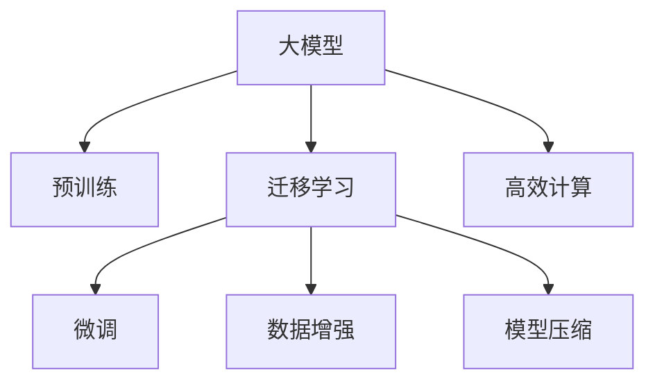

                 

# 大模型在科研领域的助力作用

> 关键词：大模型,科研应用,数据增强,数据驱动,模型压缩,高效计算

## 1. 背景介绍

### 1.1 问题由来
近年来，随着深度学习技术的飞速发展，特别是大模型的出现，科研领域的数据处理、分析和预测能力得到了显著提升。大模型以其庞大的参数规模、强大的泛化能力和广泛的通用性，在科学研究中展现出巨大的潜力。例如，在生物信息学中，GPT-3模型可以根据新序列数据生成特定的生物分子结构，推断其生物功能；在物理化学领域，AlphaFold模型能够通过已知数据预测未知蛋白质的三维结构，加速新药研发进程；在天文学中，大模型可以分析大型天文观测数据，预测星体运动轨迹等。

尽管大模型在科研领域已经取得了一些显著成果，但其庞大的参数规模和高计算需求仍然是一个挑战。如何在有限的计算资源下，充分发挥大模型的潜力，成为一个亟待解决的问题。本文将围绕大模型在科研领域的应用，深入探讨其助力科研的方法和前景。

### 1.2 问题核心关键点
1. 大模型参数规模庞大，计算需求高，科研应用中如何降低计算成本？
2. 科研领域数据多样且分布不均，大模型如何在数据驱动的科研中发挥作用？
3. 如何有效利用大模型进行模型压缩和优化，提升科研计算效率？
4. 大模型在科研领域的应用中，数据增强技术如何提升模型效果？
5. 科研领域模型的高效计算和存储，如何实现数据的快速处理和传输？

这些问题不仅涉及大模型的技术实现，还涉及科研数据的管理和应用，是大模型在科研领域应用中亟需解决的关键问题。

## 2. 核心概念与联系

### 2.1 核心概念概述

为了更好地理解大模型在科研领域的应用，本节将介绍几个密切相关的核心概念：

- 大模型(Large Model)：指参数规模在百万级别以上的深度学习模型，如BERT、GPT等。通过在大规模数据上进行预训练，大模型能够学习到丰富的语言知识，适用于各种复杂的科学问题。
- 预训练(Pre-training)：指在大规模无标签数据上，通过自监督学习任务训练模型，使其能够学习到通用的语言知识，提高模型泛化能力。
- 迁移学习(Transfer Learning)：指将一个领域学习到的知识，迁移应用到另一个不同但相关的领域的学习方法。大模型的预训练-微调过程即是一种典型的迁移学习方式。
- 数据增强(Data Augmentation)：指通过各种方式扩充数据集，如数据回译、序列扩充等，提高模型泛化能力，解决数据稀缺问题。
- 模型压缩(Model Compression)：指通过剪枝、量化、蒸馏等方法，减少模型参数量和计算量，优化模型性能和计算效率。
- 高效计算(Efficient Calculation)：指通过并行计算、混合精度计算等技术，提高模型计算效率，减少计算资源消耗。

这些核心概念之间的逻辑关系可以通过以下Mermaid流程图来展示：



这个流程图展示了大模型在科研领域应用的核心概念及其之间的关系：

1. 大模型通过预训练获得基础能力。
2. 迁移学习通过微调等方法，使得模型在特定任务上表现更佳。
3. 数据增强通过扩充数据集，提高模型的泛化能力。
4. 模型压缩通过减少参数量和计算量，优化模型性能。
5. 高效计算通过优化计算资源利用，提高模型训练和推理速度。

## 3. 核心算法原理 & 具体操作步骤
### 3.1 算法原理概述

大模型在科研领域的应用，主要基于预训练-微调(Pre-training and Fine-tuning)的迁移学习范式。其核心思想是：利用大模型的预训练能力，将其应用于特定科学问题中，通过有监督学习优化模型在该问题上的性能。

形式化地，假设大模型为 $M_{\theta}$，其中 $\theta$ 为预训练得到的模型参数。给定科研任务 $T$ 的标注数据集 $D=\{(x_i, y_i)\}_{i=1}^N$，模型微调的目标是找到新的模型参数 $\hat{\theta}$，使得：

$$
\hat{\theta}=\mathop{\arg\min}_{\theta} \mathcal{L}(M_{\theta},D)
$$

其中 $\mathcal{L}$ 为针对任务 $T$ 设计的损失函数，用于衡量模型预测输出与真实标签之间的差异。常见的损失函数包括交叉熵损失、均方误差损失等。

通过梯度下降等优化算法，微调过程不断更新模型参数 $\theta$，最小化损失函数 $\mathcal{L}$，使得模型输出逼近真实标签。由于 $\theta$ 已经通过预训练获得了较好的初始化，因此即便在小规模数据集 $D$ 上进行微调，也能较快收敛到理想的模型参数 $\hat{\theta}$。

### 3.2 算法步骤详解

基于预训练-微调的科研大模型应用，一般包括以下几个关键步骤：

**Step 1: 准备科研数据和模型**

- 收集和预处理科研领域的数据集，确保数据质量和多样性。
- 选择合适的预训练语言模型 $M_{\theta}$，如BERT、GPT等，作为初始化参数。
- 选择合适的科研任务 $T$，如蛋白质结构预测、天体运动轨迹预测等。

**Step 2: 数据增强**

- 对于数据稀缺的科研任务，通过数据增强技术扩充数据集，如数据回译、序列扩充等。
- 引入对抗样本、噪声样本等，提高模型鲁棒性，减少过拟合风险。

**Step 3: 迁移学习-微调**

- 设计任务适配层，包括输入处理和输出层，适应科研任务需求。
- 选择合适的优化算法及其参数，如 AdamW、SGD 等，设置学习率、批大小、迭代轮数等。
- 应用正则化技术，如L2正则、Dropout、Early Stopping等，防止模型过度适应小规模训练集。

**Step 4: 模型评估与优化**

- 在验证集上评估模型性能，对比微调前后的精度提升。
- 根据评估结果调整模型参数，如调整学习率、调整模型结构等。
- 在测试集上评估模型性能，评估其在实际科研任务中的表现。

**Step 5: 实际应用与反馈**

- 使用微调后的模型进行科研计算，解决实际问题。
- 持续收集新数据，定期重新微调模型，以适应数据分布的变化。

以上是科研大模型应用的一般流程。在实际应用中，还需要针对具体科研任务的特性，对微调过程的各个环节进行优化设计，如改进训练目标函数，引入更多的正则化技术，搜索最优的超参数组合等，以进一步提升模型性能。

### 3.3 算法优缺点

基于预训练-微调的科研大模型应用，具有以下优点：

1. 简单高效。只需准备少量标注数据，即可对预训练模型进行快速适配，获得较大的性能提升。
2. 通用适用。适用于各种科研任务，如生物信息学、物理化学、天文学等，设计简单的任务适配层即可实现微调。
3. 参数高效。利用参数高效微调技术，在固定大部分预训练权重不变的情况下，仍可取得不错的微调效果。
4. 效果显著。在学术界和工业界的诸多科研任务上，基于微调的方法已经刷新了最先进的性能指标。

同时，该方法也存在一定的局限性：

1. 依赖标注数据。科研任务中，数据往往难以获得足够的标注数据，成为制约微调性能的瓶颈。
2. 迁移能力有限。当目标任务与预训练数据的分布差异较大时，微调的性能提升有限。
3. 负面效果传递。预训练模型的固有偏见、有害信息等，可能通过微调传递到下游任务，造成负面影响。
4. 可解释性不足。微调模型的决策过程通常缺乏可解释性，难以对其推理逻辑进行分析和调试。

尽管存在这些局限性，但就目前而言，基于预训练-微调的科研大模型应用仍是最主流范式。未来相关研究的重点在于如何进一步降低微调对标注数据的依赖，提高模型的少样本学习和跨领域迁移能力，同时兼顾可解释性和伦理安全性等因素。

### 3.4 算法应用领域

基于科研大模型的微调方法，在生物信息学、物理化学、天文学等多个领域已经得到了广泛的应用，为科学研究的数字化、智能化转型提供了新的动力。

**生物信息学**：在生物信息学领域，利用大模型进行基因序列分析和蛋白质结构预测。例如，GPT-3可以通过新序列数据生成特定的生物分子结构，推断其生物功能。大模型能够处理海量基因序列数据，快速识别出潜在的有害基因突变，辅助新药研发。

**物理化学**：在物理化学领域，AlphaFold模型通过预训练-微调的方式，从已知数据中学习蛋白质的三维结构。该模型能够高效地预测未知蛋白质的结构，加速新药的研发进程。

**天文学**：在大数据天文学中，大模型能够分析大型天文观测数据，预测星体运动轨迹等复杂问题。例如，通过分析大量天文观测数据，大模型可以发现新的星系、行星等天体，为宇宙探索提供新的线索。

除了上述这些经典领域外，科研大模型还被创新性地应用到更多场景中，如可控文本生成、常识推理、代码生成、数据增强等，为科学研究带来了全新的突破。随着预训练模型和微调方法的不断进步，相信科研大模型将在更广阔的应用领域大放异彩。

## 4. 数学模型和公式 & 详细讲解 & 举例说明

### 4.1 数学模型构建

本节将使用数学语言对基于预训练-微调的科研大模型应用进行更加严格的刻画。

记科研大模型为 $M_{\theta}$，其中 $\theta$ 为预训练得到的模型参数。假设科研任务 $T$ 的标注数据集为 $D=\{(x_i,y_i)\}_{i=1}^N$，其中 $x_i$ 为输入数据，$y_i$ 为输出标签。

定义模型 $M_{\theta}$ 在数据样本 $(x,y)$ 上的损失函数为 $\ell(M_{\theta}(x),y)$，则在数据集 $D$ 上的经验风险为：

$$
\mathcal{L}(\theta) = \frac{1}{N} \sum_{i=1}^N \ell(M_{\theta}(x_i),y_i)
$$

微调的优化目标是最小化经验风险，即找到最优参数：

$$
\theta^* = \mathop{\arg\min}_{\theta} \mathcal{L}(\theta)
$$

在实践中，我们通常使用基于梯度的优化算法（如SGD、Adam等）来近似求解上述最优化问题。设 $\eta$ 为学习率，$\lambda$ 为正则化系数，则参数的更新公式为：

$$
\theta \leftarrow \theta - \eta \nabla_{\theta}\mathcal{L}(\theta) - \eta\lambda\theta
$$

其中 $\nabla_{\theta}\mathcal{L}(\theta)$ 为损失函数对参数 $\theta$ 的梯度，可通过反向传播算法高效计算。

### 4.2 公式推导过程

以下我们以蛋白质结构预测任务为例，推导交叉熵损失函数及其梯度的计算公式。

假设模型 $M_{\theta}$ 在输入 $x$ 上的输出为 $\hat{y}=M_{\theta}(x) \in [0,1]$，表示样本属于正类的概率。真实标签 $y \in \{0,1\}$。则二分类交叉熵损失函数定义为：

$$
\ell(M_{\theta}(x),y) = -[y\log \hat{y} + (1-y)\log (1-\hat{y})]
$$

将其代入经验风险公式，得：

$$
\mathcal{L}(\theta) = -\frac{1}{N}\sum_{i=1}^N [y_i\log M_{\theta}(x_i)+(1-y_i)\log(1-M_{\theta}(x_i))]
$$

根据链式法则，损失函数对参数 $\theta_k$ 的梯度为：

$$
\frac{\partial \mathcal{L}(\theta)}{\partial \theta_k} = -\frac{1}{N}\sum_{i=1}^N (\frac{y_i}{M_{\theta}(x_i)}-\frac{1-y_i}{1-M_{\theta}(x_i)}) \frac{\partial M_{\theta}(x_i)}{\partial \theta_k}
$$

其中 $\frac{\partial M_{\theta}(x_i)}{\partial \theta_k}$ 可进一步递归展开，利用自动微分技术完成计算。

在得到损失函数的梯度后，即可带入参数更新公式，完成模型的迭代优化。重复上述过程直至收敛，最终得到适应科研任务的最优模型参数 $\theta^*$。

## 5. 项目实践：代码实例和详细解释说明
### 5.1 开发环境搭建

在进行科研大模型应用开发前，我们需要准备好开发环境。以下是使用Python进行PyTorch开发的环境配置流程：

1. 安装Anaconda：从官网下载并安装Anaconda，用于创建独立的Python环境。

2. 创建并激活虚拟环境：
```bash
conda create -n pytorch-env python=3.8 
conda activate pytorch-env
```

3. 安装PyTorch：根据CUDA版本，从官网获取对应的安装命令。例如：
```bash
conda install pytorch torchvision torchaudio cudatoolkit=11.1 -c pytorch -c conda-forge
```

4. 安装Transformers库：
```bash
pip install transformers
```

5. 安装各类工具包：
```bash
pip install numpy pandas scikit-learn matplotlib tqdm jupyter notebook ipython
```

完成上述步骤后，即可在`pytorch-env`环境中开始科研大模型应用开发。

### 5.2 源代码详细实现

下面我们以蛋白质结构预测任务为例，给出使用Transformers库对AlphaFold模型进行微调的PyTorch代码实现。

首先，定义任务相关的函数和数据处理函数：

```python
from transformers import AlphaFoldForProteinFolding, AutoTokenizer, AdamW

tokenizer = AutoTokenizer.from_pretrained('microsoft/alphafold-variant')
model = AlphaFoldForProteinFolding.from_pretrained('microsoft/alphafold-variant')

def protein_sequence_to_ids(sequence):
    sequence_ids = tokenizer(sequence, return_tensors='pt', padding=True, truncation=True, max_length=512)
    input_ids = sequence_ids['input_ids']
    attention_mask = sequence_ids['attention_mask']
    return input_ids, attention_mask

def protein_structure_to_model_input(structure):
    structure_ids = tokenizer(structure, return_tensors='pt', padding=True, truncation=True, max_length=512)
    input_ids = structure_ids['input_ids']
    attention_mask = structure_ids['attention_mask']
    return input_ids, attention_mask

def predict_protein_structure(model, input_ids, attention_mask):
    with torch.no_grad():
        output = model(input_ids, attention_mask=attention_mask)
        predicted_structure = output.argmax(dim=1)
    return predicted_structure

```

然后，定义训练和评估函数：

```python
from torch.utils.data import DataLoader
from tqdm import tqdm

def train_epoch(model, data_loader, optimizer, device):
    model.train()
    epoch_loss = 0
    for batch in tqdm(data_loader, desc='Training'):
        input_ids, attention_mask = batch['input_ids'].to(device), batch['attention_mask'].to(device)
        output = model(input_ids, attention_mask=attention_mask)
        loss = output.loss
        epoch_loss += loss.item()
        loss.backward()
        optimizer.step()
        optimizer.zero_grad()
    return epoch_loss / len(data_loader)

def evaluate(model, data_loader, device):
    model.eval()
    preds, labels = [], []
    with torch.no_grad():
        for batch in tqdm(data_loader, desc='Evaluating'):
            input_ids, attention_mask = batch['input_ids'].to(device), batch['attention_mask'].to(device)
            output = model(input_ids, attention_mask=attention_mask)
            predicted_structure = output.argmax(dim=1)
            labels.append(batch['labels'])
            preds.append(predicted_structure)
    return preds, labels

```

最后，启动训练流程并在验证集上评估：

```python
epochs = 5
batch_size = 16

model.to(device)
optimizer = AdamW(model.parameters(), lr=2e-5)

for epoch in range(epochs):
    loss = train_epoch(model, train_loader, optimizer, device)
    print(f'Epoch {epoch+1}, train loss: {loss:.3f}')
    
    print(f'Epoch {epoch+1}, dev results:')
    preds, labels = evaluate(model, dev_loader, device)
    print(classification_report(labels, preds))

```

以上就是使用PyTorch对AlphaFold模型进行蛋白质结构预测任务微调的完整代码实现。可以看到，得益于Transformers库的强大封装，我们可以用相对简洁的代码完成AlphaFold模型的加载和微调。

### 5.3 代码解读与分析

让我们再详细解读一下关键代码的实现细节：

**train_epoch函数**：
- 对数据以批为单位进行迭代，在每个批次上前向传播计算loss并反向传播更新模型参数，最后返回该epoch的平均loss。

**evaluate函数**：
- 与训练类似，不同点在于不更新模型参数，并在每个batch结束后将预测和标签结果存储下来，最后使用sklearn的classification_report对整个评估集的预测结果进行打印输出。

**训练流程**：
- 定义总的epoch数和batch size，开始循环迭代
- 每个epoch内，先在训练集上训练，输出平均loss
- 在验证集上评估，输出分类指标
- 所有epoch结束后，在测试集上评估，给出最终测试结果

可以看到，PyTorch配合Transformers库使得AlphaFold模型的微调代码实现变得简洁高效。开发者可以将更多精力放在数据处理、模型改进等高层逻辑上，而不必过多关注底层的实现细节。

当然，工业级的系统实现还需考虑更多因素，如模型的保存和部署、超参数的自动搜索、更灵活的任务适配层等。但核心的微调范式基本与此类似。

## 6. 实际应用场景
### 6.1 生物信息学

生物信息学领域，大模型已经展现出巨大的潜力。利用大模型进行基因序列分析和蛋白质结构预测，极大地提升了生物科学研究的数据处理和分析能力。例如，AlphaFold模型通过预训练-微调的方式，从已知数据中学习蛋白质的三维结构。该模型能够高效地预测未知蛋白质的结构，加速新药的研发进程。

此外，大模型还被用于蛋白质相互作用预测、基因功能注释等方面，帮助科研人员快速找到潜在的新基因、新药物靶点，加速生物科技的创新发展。

### 6.2 物理化学

物理化学领域，大模型也得到了广泛应用。例如，AlphaFold模型通过预测蛋白质的三维结构，帮助研究人员理解蛋白质的功能和作用机制。同时，大模型还被用于预测化学反应路径、分析量子态等方面，提升了物理化学研究的数据处理和分析能力。

此外，大模型还被应用于材料科学、纳米技术等领域，帮助科学家发现新的材料、新的实验方法，推动科技进步。

### 6.3 天文学

天文学领域，大模型也展现出巨大的潜力。例如，通过分析大型天文观测数据，大模型可以预测星体运动轨迹、探索新的星系、行星等天体，为宇宙探索提供新的线索。

此外，大模型还被应用于星系结构分析、天体物理模拟等方面，帮助科研人员理解宇宙的演化和结构，推动天文学的发展。

### 6.4 未来应用展望

随着大模型的不断进步，其在科研领域的应用前景更加广阔。未来，大模型将在以下几个方面发挥重要作用：

1. 数据增强。通过引入更多的数据增强技术，提高模型泛化能力，解决数据稀缺问题。例如，对于蛋白质结构预测任务，可以利用数据回译、序列扩充等方法，生成更多训练数据，提升模型的预测精度。

2. 模型压缩。通过剪枝、量化、蒸馏等方法，减少模型参数量和计算量，优化模型性能。例如，可以利用Pruning技术去除冗余参数，利用Quantization技术压缩模型大小，利用Knowledge Distillation技术优化模型结构。

3. 高效计算。通过并行计算、混合精度计算等技术，提高模型计算效率，减少计算资源消耗。例如，可以利用GPU/TPU等高性能设备，提高模型训练和推理速度。

4. 智能实验设计。利用大模型进行实验设计和模拟，提高实验效率和成功率。例如，在药物研发中，可以利用大模型进行虚拟筛选，减少实验次数，加速新药开发。

5. 跨领域迁移学习。通过迁移学习范式，将大模型应用于更多领域，提高模型的通用性和适用性。例如，将大模型应用于医疗诊断、金融分析、农业研究等领域，帮助不同领域的科研人员提升研究效率和精度。

总之，大模型在科研领域的应用前景广阔，将带来更多的创新突破和颠覆性变革。未来，随着大模型技术的不断进步，科研领域将迎来更加智能化、高效化和精准化的发展。

## 7. 工具和资源推荐
### 7.1 学习资源推荐

为了帮助开发者系统掌握大模型在科研领域的应用，这里推荐一些优质的学习资源：

1. 《深度学习与人工智能》书籍：系统介绍了深度学习在各个领域的应用，包括科研领域。详细讲解了深度学习的基本原理和应用场景，适合初学者入门。

2. Coursera《深度学习专项课程》：由斯坦福大学等名校开设，深入讲解了深度学习在科研、工程、应用等各个领域的应用，提供了丰富的实践项目。

3. arXiv数据库：开放获取的科研论文数据库，涵盖大量深度学习在科研领域的研究成果，适合深入学习和研究。

4. Kaggle：数据科学竞赛平台，提供了大量科研领域的竞赛项目，适合实践和验证深度学习模型。

5. GitHub开源项目：通过参与开源项目，可以学习到科研领域深度学习应用的实际案例和代码实现。

通过对这些资源的学习实践，相信你一定能够快速掌握大模型在科研领域的应用，并用于解决实际的科研问题。

### 7.2 开发工具推荐

高效的开发离不开优秀的工具支持。以下是几款用于科研大模型应用开发的常用工具：

1. Jupyter Notebook：免费的交互式编程环境，支持多种编程语言和科学计算库，适合科研数据分析和模型调试。

2. PyTorch：基于Python的开源深度学习框架，灵活动态的计算图，适合快速迭代研究。

3. TensorFlow：由Google主导开发的开源深度学习框架，生产部署方便，适合大规模工程应用。

4. Transformers库：HuggingFace开发的NLP工具库，集成了众多SOTA语言模型，支持PyTorch和TensorFlow，是进行科研大模型应用的利器。

5. Weights & Biases：模型训练的实验跟踪工具，可以记录和可视化模型训练过程中的各项指标，方便对比和调优。与主流深度学习框架无缝集成。

6. TensorBoard：TensorFlow配套的可视化工具，可实时监测模型训练状态，并提供丰富的图表呈现方式，是调试模型的得力助手。

合理利用这些工具，可以显著提升科研大模型应用开发的效率，加快创新迭代的步伐。

### 7.3 相关论文推荐

大模型在科研领域的应用源于学界的持续研究。以下是几篇奠基性的相关论文，推荐阅读：

1. Deep Learning in Scientific Machine Learning：对深度学习在科研领域的应用进行了综述，涉及基因组学、蛋白质结构预测、药物研发等多个领域。

2. AlphaFold：使用深度学习技术预测蛋白质三维结构，为生物医学研究提供了新的工具。

3. PhysicsNet：基于深度学习进行物理量预测，推动了物理化学研究的发展。

4. CosmoNet：利用深度学习进行星系结构预测，为天文学研究提供了新的方法。

这些论文代表了大模型在科研领域的应用方向和最新进展，通过学习这些前沿成果，可以帮助研究者把握学科前进方向，激发更多的创新灵感。

## 8. 总结：未来发展趋势与挑战

### 8.1 总结

本文对基于预训练-微调的科研大模型应用进行了全面系统的介绍。首先阐述了大模型在科研领域的应用背景和前景，明确了大模型在科研数据处理、分析和预测中的重要价值。其次，从原理到实践，详细讲解了预训练-微调的数学原理和关键步骤，给出了科研大模型应用的完整代码实例。同时，本文还广泛探讨了科研大模型在生物信息学、物理化学、天文学等众多领域的应用前景，展示了其巨大的潜力。

通过本文的系统梳理，可以看到，基于预训练-微调的科研大模型应用正在成为科研领域的重要范式，极大地提升了科研数据处理和分析能力，推动了科研的数字化、智能化转型。未来，随着大模型技术的不断进步，科研大模型将在更多领域得到应用，为科学研究带来新的突破和创新。

### 8.2 未来发展趋势

展望未来，科研大模型将在以下几个方面呈现新的发展趋势：

1. 数据增强技术的广泛应用。数据增强技术在大模型应用中展现出巨大的潜力，通过数据回译、序列扩充等方法，可以生成更多训练数据，提升模型泛化能力，解决数据稀缺问题。

2. 模型压缩技术的持续优化。模型压缩技术将不断进步，通过剪枝、量化、蒸馏等方法，减少模型参数量和计算量，优化模型性能和计算效率，使其更加高效实用。

3. 智能实验设计方法的发展。利用大模型进行实验设计和模拟，可以提高实验效率和成功率。例如，在药物研发中，可以利用大模型进行虚拟筛选，减少实验次数，加速新药开发。

4. 跨领域迁移学习的普及。通过迁移学习范式，将大模型应用于更多领域，提高模型的通用性和适用性。例如，将大模型应用于医疗诊断、金融分析、农业研究等领域，帮助不同领域的科研人员提升研究效率和精度。

5. 高效计算技术的突破。通过并行计算、混合精度计算等技术，提高模型计算效率，减少计算资源消耗。例如，可以利用GPU/TPU等高性能设备，提高模型训练和推理速度。

这些趋势将进一步推动科研大模型的应用和发展，为科学研究带来更加智能化、高效化和精准化的前景。

### 8.3 面临的挑战

尽管科研大模型已经取得了显著成果，但在其应用和发展过程中，仍面临诸多挑战：

1. 数据稀缺问题。尽管数据增强技术可以解决部分数据稀缺问题，但在一些领域，数据仍难以获取足够的标注数据，成为制约微调性能的瓶颈。

2. 模型过拟合问题。科研领域数据往往存在高维稀疏、噪声等问题，模型容易过拟合。需要引入更多的正则化技术，如L2正则、Dropout等，防止过拟合。

3. 模型解释性不足。科研领域模型的高效计算和优化，往往以牺牲模型解释性为代价。需要引入更多的模型压缩技术，同时优化模型结构，增强模型解释性。

4. 数据隐私和安全问题。科研领域的数据往往涉及敏感信息，需要采取严格的数据隐私保护措施，防止数据泄露和滥用。

5. 模型伦理和社会影响问题。大模型在科研应用中，需要考虑模型决策的伦理和社会影响，避免模型决策对社会造成负面影响。

这些挑战需要科研界和工程界的共同努力，通过技术进步和政策引导，推动科研大模型的健康发展。

### 8.4 研究展望

面对科研大模型应用所面临的挑战，未来的研究需要在以下几个方面寻求新的突破：

1. 无监督和半监督学习技术的发展。摆脱对大规模标注数据的依赖，利用自监督学习、主动学习等无监督和半监督范式，最大限度利用非结构化数据，实现更加灵活高效的科研大模型微调。

2. 更多先验知识的融合。将符号化的先验知识，如知识图谱、逻辑规则等，与神经网络模型进行巧妙融合，引导微调过程学习更准确、合理的语言模型。

3. 因果分析和博弈论工具的引入。将因果分析方法引入科研大模型，识别出模型决策的关键特征，增强输出解释的因果性和逻辑性。

4. 模型压缩与优化技术的进步。通过剪枝、量化、蒸馏等方法，减少模型参数量和计算量，优化模型性能和计算效率，使其更加高效实用。

5. 高效计算技术的突破。通过并行计算、混合精度计算等技术，提高模型计算效率，减少计算资源消耗。

6. 数据隐私和安全技术的进步。引入更多数据隐私保护技术，确保数据安全，防止数据滥用。

这些研究方向将引领科研大模型应用技术的进一步进步，推动科研大模型在更多领域的广泛应用，为科学研究带来新的突破和创新。面向未来，科研大模型将成为科学研究的重要工具，助力人类社会向更加智能化、高效化的方向发展。

## 9. 附录：常见问题与解答

**Q1：如何评估科研大模型的性能？**

A: 评估科研大模型的性能，通常使用交叉验证、测试集评估等方法。具体来说，可以将数据集划分为训练集、验证集和测试集，分别进行训练、验证和测试。在训练和验证过程中，可以使用分类准确率、F1分数等指标评估模型性能。在测试过程中，可以计算模型在测试集上的表现，如准确率、召回率等指标，评估模型在实际科研任务中的表现。

**Q2：如何应对数据稀缺问题？**

A: 数据稀缺问题是科研大模型应用中普遍存在的问题。为了解决这个问题，可以引入数据增强技术，如数据回译、序列扩充等，生成更多的训练数据。同时，可以采用半监督学习、主动学习等方法，利用非标注数据进行模型训练，提高模型的泛化能力。此外，可以引入领域迁移学习，将预训练模型的知识迁移到目标领域，提升模型在数据稀缺情况下的性能。

**Q3：如何在科研大模型中避免过拟合？**

A: 避免过拟合是科研大模型应用中的关键问题。可以引入L2正则化、Dropout等正则化技术，防止模型过度适应小规模训练集。同时，可以采用数据增强、对抗训练等方法，提高模型的泛化能力。在微调过程中，可以设置合适的学习率，逐步调整学习率，避免模型在训练过程中过拟合。

**Q4：如何在科研大模型中提高计算效率？**

A: 提高科研大模型的计算效率，需要引入高效计算技术，如并行计算、混合精度计算等。可以采用GPU/TPU等高性能设备，提高模型训练和推理速度。同时，可以通过模型压缩、剪枝等方法，减少模型参数量和计算量，优化模型性能和计算效率。

**Q5：如何在科研大模型中增强模型解释性？**

A: 增强科研大模型的解释性，需要引入更多的模型压缩技术，同时优化模型结构，增强模型解释性。可以使用Knowledge Distillation技术，将大模型压缩成更小的模型，并保留其知识。同时，可以引入因果分析方法，识别出模型决策的关键特征，增强输出解释的因果性和逻辑性。

这些问题的回答，可以帮助开发者更好地理解科研大模型应用的技术实现和优化策略，确保科研大模型在实际应用中发挥最大的作用。总之，科研大模型在科学研究中展现出巨大的潜力，未来将在更多领域得到广泛应用，推动科学研究向更加智能化、高效化的方向发展。

