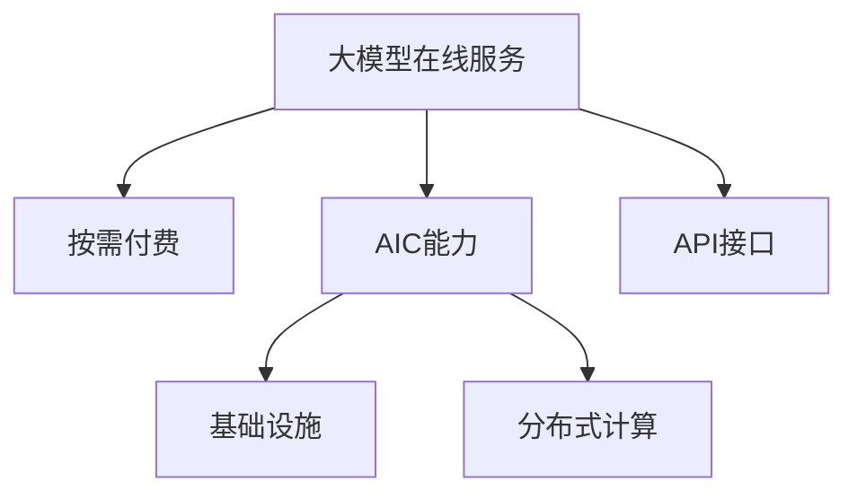

                 

# 大模型在线服务:按需付费的AI能力

> 关键词：大模型在线服务,按需付费,AI能力,基础设施,分布式计算,API接口,微调,推理,模型部署,应用开发,云计算平台

## 1. 背景介绍

### 1.1 问题由来

近年来，随着人工智能(AI)技术的快速发展，特别是深度学习和大模型的兴起，AI能力已经广泛应用于各个行业，如自然语言处理(NLP)、计算机视觉(CV)、语音识别(SR)等。然而，这些AI模型的开发和部署通常需要极高的计算资源和数据集，普通企业和开发者难以负担。为了解决这一问题，按需付费的AI能力在线服务应运而生。

### 1.2 问题核心关键点

在线服务按需付费的AI能力是一种新兴的计算服务形式，通过云计算平台提供大模型的开发、训练、推理等服务，用户可以根据实际需求按需付费使用AI能力。这一服务模式不仅降低了计算资源和数据集的门槛，还提升了AI技术的可获取性和应用效率。

## 2. 核心概念与联系

### 2.1 核心概念概述

为更好地理解按需付费的AI能力在线服务，本节将介绍几个密切相关的核心概念：

- 大模型在线服务：基于云计算平台提供的大模型服务，用户可以通过API接口获取模型的推理和微调能力。
- 按需付费：根据实际使用量付费的计算服务形式，避免了传统购置硬件的固定成本。
- AI能力：AI模型在特定领域的应用能力，如语音识别、图像分类、文本生成等。
- 基础设施：云计算平台提供的计算资源、存储、网络等服务。
- 分布式计算：通过多台计算机协同工作，提高计算效率和任务处理能力。
- API接口：应用程序编程接口，用于连接和调用云计算平台提供的AI服务。

这些概念之间的逻辑关系可以通过以下Mermaid流程图来展示：



这个流程图展示了大模型在线服务的关键概念及其之间的关系：

1. 大模型在线服务通过云计算平台提供。
2. 用户可以根据使用量付费，灵活控制成本。
3. AI能力是大模型在线服务的核心应用价值。
4. 云计算平台提供必要的计算资源、存储和网络支持。
5. 分布式计算技术提高了计算效率和资源利用率。
6. API接口作为服务的访问入口，连接用户和平台。

## 3. 核心算法原理 & 具体操作步骤

### 3.1 算法原理概述

按需付费的AI能力在线服务，本质上是云计算平台提供的大规模计算资源，用户通过API接口调用这些资源进行AI模型的训练、推理和微调。这种服务模式的核心在于：

- 提供按需付费的资源分配机制，使得用户可以根据实际需求灵活使用资源。
- 利用云计算平台的分布式计算能力，提高模型的训练和推理效率。
- 提供标准化的API接口，方便用户进行模型的微调和推理。

### 3.2 算法步骤详解

按需付费的AI能力在线服务通常包括以下几个关键步骤：

**Step 1: 注册和认证**

用户首先需要注册并认证其云计算账户，获取访问云计算平台的权限。常见的认证方式包括API密钥、OAuth2等。

**Step 2: 选择服务并配置环境**

用户根据实际需求选择合适的AI能力服务，并配置相应的计算资源和存储资源。如选择GPU或TPU，设定计算节点数量和内存大小等。

**Step 3: 调用API进行模型推理和微调**

用户通过API接口，调用云计算平台提供的模型推理和微调服务。具体步骤如下：

1. 上传数据：将需要推理或微调的数据集上传至云计算平台。
2. 选择模型：选择预训练模型或自建模型，配置微调参数。
3. 训练模型：对模型进行微调训练，获取训练好的模型参数。
4. 推理预测：使用训练好的模型进行推理预测，获取输出结果。

**Step 4: 评估和优化**

用户在模型训练和推理完成后，需要评估模型的性能，并根据评估结果进行优化。如调整超参数、进行更多的数据增强等。

**Step 5: 部署和应用**

用户将训练好的模型部署到实际应用中，进行实时推理和预测。通过持续迭代和优化，提升模型的效果。

### 3.3 算法优缺点

按需付费的AI能力在线服务具有以下优点：

- 灵活性高：用户可以根据实际需求动态调整计算资源，避免资源浪费。
- 成本低：按需付费的模式，降低了硬件购置和维护的成本。
- 效率高：云计算平台提供的分布式计算能力，提高了计算效率和任务处理速度。
- 易于使用：标准化的API接口，简化了用户的使用流程，提高了开发效率。

同时，该服务也存在一定的局限性：

- 依赖网络：云计算服务的稳定性受到网络条件的限制。
- 安全性问题：云计算平台需要保证用户数据的安全性和隐私性。
- 资源共享：多用户共享资源，可能导致资源争抢和性能下降。
- 服务中断：云计算平台的服务中断可能影响应用的连续性。

尽管存在这些局限性，但按需付费的AI能力在线服务仍是当前最主流的大模型应用模式。未来相关研究的重点在于如何进一步优化计算资源分配策略，提高服务的稳定性和安全性，以及如何更好地支持用户的应用开发和模型训练需求。

### 3.4 算法应用领域

按需付费的AI能力在线服务在多个领域得到了广泛应用，如：

- 智能客服：通过在线服务提供智能问答和对话系统。
- 金融风控：利用模型进行信用评估、欺诈检测等。
- 医疗诊断：使用模型进行疾病诊断和医学影像分析。
- 推荐系统：提供个性化推荐服务，如电商推荐、内容推荐等。
- 自动驾驶：使用模型进行环境感知、路径规划等。
- 游戏AI：在游戏中提供智能对手和环境模拟。

## 4. 数学模型和公式 & 详细讲解

### 4.1 数学模型构建

按需付费的AI能力在线服务通常基于云计算平台提供的大规模计算资源。用户可以通过API接口调用这些资源进行模型的训练、推理和微调。我们以一个简单的文本分类任务为例，构建其数学模型。

假设用户需要训练一个文本分类模型，用于判断文本是否属于某一类别。模型的输入为文本向量 $x \in \mathbb{R}^d$，输出为类别概率分布 $y \in [0,1]$。模型的损失函数为交叉熵损失：

$$
\mathcal{L}(y,\hat{y}) = -y \log \hat{y} - (1-y) \log(1-\hat{y})
$$

其中 $y$ 为真实标签，$\hat{y}$ 为模型预测的类别概率。

模型的训练目标是最小化损失函数：

$$
\mathop{\min}_{\theta} \mathcal{L}(y,\hat{y})
$$

其中 $\theta$ 为模型参数，包括模型的权重和偏置。

### 4.2 公式推导过程

模型的前向传播过程为：

$$
\hat{y} = \sigma(Wx + b)
$$

其中 $\sigma$ 为激活函数，$W$ 和 $b$ 为模型的权重和偏置。

模型的反向传播过程为：

$$
\frac{\partial \mathcal{L}}{\partial W} = \frac{\partial \mathcal{L}}{\partial \hat{y}} \frac{\partial \hat{y}}{\partial x} \frac{\partial x}{\partial W} = (\hat{y}-y) \sigma(Wx + b) (1-\sigma(Wx + b)) x^T
$$

通过梯度下降等优化算法，不断更新模型参数 $\theta$，最小化损失函数 $\mathcal{L}$。

### 4.3 案例分析与讲解

以BERT模型为例，其在大规模语料上进行预训练，学习通用的语言表示。用户可以通过在线服务，对预训练好的BERT模型进行微调，用于特定任务，如情感分析、命名实体识别等。微调过程通常包括：

1. 选择预训练模型：如选择12层的BERT-base模型。
2. 添加任务适配层：如添加线性分类器、交叉熵损失函数。
3. 上传数据集：将标注好的数据集上传至云计算平台。
4. 配置训练参数：如设定学习率、迭代轮数、批量大小等。
5. 训练模型：通过API接口进行模型训练。
6. 推理预测：使用训练好的模型进行文本分类预测。

## 5. 项目实践：代码实例和详细解释说明

### 5.1 开发环境搭建

在进行按需付费的AI能力在线服务实践前，我们需要准备好开发环境。以下是使用Python进行PyTorch开发的环境配置流程：

1. 安装Anaconda：从官网下载并安装Anaconda，用于创建独立的Python环境。

2. 创建并激活虚拟环境：
```bash
conda create -n pytorch-env python=3.8 
conda activate pytorch-env
```

3. 安装PyTorch：根据CUDA版本，从官网获取对应的安装命令。例如：
```bash
conda install pytorch torchvision torchaudio cudatoolkit=11.1 -c pytorch -c conda-forge
```

4. 安装Transformers库：
```bash
pip install transformers
```

5. 安装各类工具包：
```bash
pip install numpy pandas scikit-learn matplotlib tqdm jupyter notebook ipython
```

完成上述步骤后，即可在`pytorch-env`环境中开始服务实践。

### 5.2 源代码详细实现

下面我们以命名实体识别(NER)任务为例，给出使用Transformers库对BERT模型进行微调的PyTorch代码实现。

首先，定义NER任务的数据处理函数：

```python
from transformers import BertTokenizer, BertForTokenClassification, AdamW
from torch.utils.data import Dataset, DataLoader
import torch

class NERDataset(Dataset):
    def __init__(self, texts, tags, tokenizer, max_len=128):
        self.texts = texts
        self.tags = tags
        self.tokenizer = tokenizer
        self.max_len = max_len
        
    def __len__(self):
        return len(self.texts)
    
    def __getitem__(self, item):
        text = self.texts[item]
        tags = self.tags[item]
        
        encoding = self.tokenizer(text, return_tensors='pt', max_length=self.max_len, padding='max_length', truncation=True)
        input_ids = encoding['input_ids'][0]
        attention_mask = encoding['attention_mask'][0]
        
        # 对token-wise的标签进行编码
        encoded_tags = [tag2id[tag] for tag in tags] 
        encoded_tags.extend([tag2id['O']] * (self.max_len - len(encoded_tags)))
        labels = torch.tensor(encoded_tags, dtype=torch.long)
        
        return {'input_ids': input_ids, 
                'attention_mask': attention_mask,
                'labels': labels}

# 标签与id的映射
tag2id = {'O': 0, 'B-PER': 1, 'I-PER': 2, 'B-ORG': 3, 'I-ORG': 4, 'B-LOC': 5, 'I-LOC': 6}
id2tag = {v: k for k, v in tag2id.items()}

# 创建dataset
tokenizer = BertTokenizer.from_pretrained('bert-base-cased')

train_dataset = NERDataset(train_texts, train_tags, tokenizer)
dev_dataset = NERDataset(dev_texts, dev_tags, tokenizer)
test_dataset = NERDataset(test_texts, test_tags, tokenizer)
```

然后，定义模型和优化器：

```python
from transformers import BertForTokenClassification, AdamW

model = BertForTokenClassification.from_pretrained('bert-base-cased', num_labels=len(tag2id))

optimizer = AdamW(model.parameters(), lr=2e-5)
```

接着，定义训练和评估函数：

```python
from torch.utils.data import DataLoader
from tqdm import tqdm
from sklearn.metrics import classification_report

device = torch.device('cuda') if torch.cuda.is_available() else torch.device('cpu')
model.to(device)

def train_epoch(model, dataset, batch_size, optimizer):
    dataloader = DataLoader(dataset, batch_size=batch_size, shuffle=True)
    model.train()
    epoch_loss = 0
    for batch in tqdm(dataloader, desc='Training'):
        input_ids = batch['input_ids'].to(device)
        attention_mask = batch['attention_mask'].to(device)
        labels = batch['labels'].to(device)
        model.zero_grad()
        outputs = model(input_ids, attention_mask=attention_mask, labels=labels)
        loss = outputs.loss
        epoch_loss += loss.item()
        loss.backward()
        optimizer.step()
    return epoch_loss / len(dataloader)

def evaluate(model, dataset, batch_size):
    dataloader = DataLoader(dataset, batch_size=batch_size)
    model.eval()
    preds, labels = [], []
    with torch.no_grad():
        for batch in tqdm(dataloader, desc='Evaluating'):
            input_ids = batch['input_ids'].to(device)
            attention_mask = batch['attention_mask'].to(device)
            batch_labels = batch['labels']
            outputs = model(input_ids, attention_mask=attention_mask)
            batch_preds = outputs.logits.argmax(dim=2).to('cpu').tolist()
            batch_labels = batch_labels.to('cpu').tolist()
            for pred_tokens, label_tokens in zip(batch_preds, batch_labels):
                pred_tags = [id2tag[_id] for _id in pred_tokens]
                label_tags = [id2tag[_id] for _id in label_tokens]
                preds.append(pred_tags[:len(label_tags)])
                labels.append(label_tags)
                
    print(classification_report(labels, preds))
```

最后，启动训练流程并在测试集上评估：

```python
epochs = 5
batch_size = 16

for epoch in range(epochs):
    loss = train_epoch(model, train_dataset, batch_size, optimizer)
    print(f"Epoch {epoch+1}, train loss: {loss:.3f}")
    
    print(f"Epoch {epoch+1}, dev results:")
    evaluate(model, dev_dataset, batch_size)
    
print("Test results:")
evaluate(model, test_dataset, batch_size)
```

以上就是使用PyTorch对BERT进行命名实体识别任务微调的完整代码实现。可以看到，得益于Transformers库的强大封装，我们可以用相对简洁的代码完成BERT模型的加载和微调。

### 5.3 代码解读与分析

让我们再详细解读一下关键代码的实现细节：

**NERDataset类**：
- `__init__`方法：初始化文本、标签、分词器等关键组件。
- `__len__`方法：返回数据集的样本数量。
- `__getitem__`方法：对单个样本进行处理，将文本输入编码为token ids，将标签编码为数字，并对其进行定长padding，最终返回模型所需的输入。

**tag2id和id2tag字典**：
- 定义了标签与数字id之间的映射关系，用于将token-wise的预测结果解码回真实的标签。

**训练和评估函数**：
- 使用PyTorch的DataLoader对数据集进行批次化加载，供模型训练和推理使用。
- 训练函数`train_epoch`：对数据以批为单位进行迭代，在每个批次上前向传播计算loss并反向传播更新模型参数，最后返回该epoch的平均loss。
- 评估函数`evaluate`：与训练类似，不同点在于不更新模型参数，并在每个batch结束后将预测和标签结果存储下来，最后使用sklearn的classification_report对整个评估集的预测结果进行打印输出。

**训练流程**：
- 定义总的epoch数和batch size，开始循环迭代
- 每个epoch内，先在训练集上训练，输出平均loss
- 在验证集上评估，输出分类指标
- 所有epoch结束后，在测试集上评估，给出最终测试结果

可以看到，PyTorch配合Transformers库使得BERT微调的代码实现变得简洁高效。开发者可以将更多精力放在数据处理、模型改进等高层逻辑上，而不必过多关注底层的实现细节。

当然，工业级的系统实现还需考虑更多因素，如模型的保存和部署、超参数的自动搜索、更灵活的任务适配层等。但核心的服务实践流程基本与此类似。

## 6. 实际应用场景

### 6.1 智能客服系统

按需付费的AI能力在线服务可以广泛应用于智能客服系统的构建。传统客服往往需要配备大量人力，高峰期响应缓慢，且一致性和专业性难以保证。而在线服务提供的智能问答和对话系统，可以7x24小时不间断服务，快速响应客户咨询，用自然流畅的语言解答各类常见问题。

在技术实现上，可以收集企业内部的历史客服对话记录，将问题和最佳答复构建成监督数据，在此基础上对在线服务提供的预训练语言模型进行微调。微调后的对话模型能够自动理解用户意图，匹配最合适的答案模板进行回复。对于客户提出的新问题，还可以接入检索系统实时搜索相关内容，动态组织生成回答。如此构建的智能客服系统，能大幅提升客户咨询体验和问题解决效率。

### 6.2 金融风控

金融机构需要实时监测市场舆论动向，以便及时应对负面信息传播，规避金融风险。传统的人工监测方式成本高、效率低，难以应对网络时代海量信息爆发的挑战。在线服务提供的文本分类和情感分析技术，为金融舆情监测提供了新的解决方案。

具体而言，可以收集金融领域相关的新闻、报道、评论等文本数据，并对其进行主题标注和情感标注。在此基础上对在线服务提供的预训练语言模型进行微调，使其能够自动判断文本属于何种主题，情感倾向是正面、中性还是负面。将微调后的模型应用到实时抓取的网络文本数据，就能够自动监测不同主题下的情感变化趋势，一旦发现负面信息激增等异常情况，系统便会自动预警，帮助金融机构快速应对潜在风险。

### 6.3 个性化推荐系统

当前的推荐系统往往只依赖用户的历史行为数据进行物品推荐，无法深入理解用户的真实兴趣偏好。在线服务提供的推荐系统，可以更好地挖掘用户行为背后的语义信息，从而提供更精准、多样的推荐内容。

在实践中，可以收集用户浏览、点击、评论、分享等行为数据，提取和用户交互的物品标题、描述、标签等文本内容。将文本内容作为模型输入，用户的后续行为（如是否点击、购买等）作为监督信号，在此基础上对在线服务提供的预训练语言模型进行微调。微调后的模型能够从文本内容中准确把握用户的兴趣点。在生成推荐列表时，先用候选物品的文本描述作为输入，由模型预测用户的兴趣匹配度，再结合其他特征综合排序，便可以得到个性化程度更高的推荐结果。

### 6.4 未来应用展望

随着在线服务按需付费AI能力的不断发展，其在更多领域得到应用，为传统行业带来变革性影响。

在智慧医疗领域，在线服务提供的医疗问答、病历分析、药物研发等应用将提升医疗服务的智能化水平，辅助医生诊疗，加速新药开发进程。

在智能教育领域，在线服务提供的作业批改、学情分析、知识推荐等应用，因材施教，促进教育公平，提高教学质量。

在智慧城市治理中，在线服务提供的城市事件监测、舆情分析、应急指挥等应用，提高城市管理的自动化和智能化水平，构建更安全、高效的未来城市。

此外，在企业生产、社会治理、文娱传媒等众多领域，按需付费的AI能力在线服务也将不断涌现，为NLP技术带来新的突破。相信随着技术的日益成熟，在线服务按需付费的AI能力将成为AI技术落地应用的重要范式，推动人工智能技术加速产业化进程。

## 7. 工具和资源推荐

### 7.1 学习资源推荐

为了帮助开发者系统掌握按需付费的AI能力在线服务的技术基础和实践技巧，这里推荐一些优质的学习资源：

1. 《深度学习入门》系列博文：由知名专家撰写，深入浅出地介绍了深度学习的基本概念和前沿技术，是初学者入门的好材料。

2. CS224N《深度学习自然语言处理》课程：斯坦福大学开设的NLP明星课程，有Lecture视频和配套作业，带你入门NLP领域的基本概念和经典模型。

3. 《自然语言处理综述》书籍：全面介绍了自然语言处理的理论基础和实际应用，是NLP研究人员的重要参考。

4. HuggingFace官方文档：Transformers库的官方文档，提供了海量预训练模型和完整的在线服务样例代码，是上手实践的必备资料。

5. CLUE开源项目：中文语言理解测评基准，涵盖大量不同类型的中文NLP数据集，并提供了基于在线服务的baseline模型，助力中文NLP技术发展。

通过对这些资源的学习实践，相信你一定能够快速掌握按需付费的AI能力在线服务的精髓，并用于解决实际的NLP问题。

### 7.2 开发工具推荐

高效的开发离不开优秀的工具支持。以下是几款用于按需付费的AI能力在线服务开发的常用工具：

1. PyTorch：基于Python的开源深度学习框架，灵活动态的计算图，适合快速迭代研究。大部分预训练语言模型都有PyTorch版本的实现。

2. TensorFlow：由Google主导开发的开源深度学习框架，生产部署方便，适合大规模工程应用。同样有丰富的预训练语言模型资源。

3. Transformers库：HuggingFace开发的NLP工具库，集成了众多SOTA语言模型，支持PyTorch和TensorFlow，是进行在线服务开发的利器。

4. Weights & Biases：模型训练的实验跟踪工具，可以记录和可视化模型训练过程中的各项指标，方便对比和调优。与主流深度学习框架无缝集成。

5. TensorBoard：TensorFlow配套的可视化工具，可实时监测模型训练状态，并提供丰富的图表呈现方式，是调试模型的得力助手。

6. Google Colab：谷歌推出的在线Jupyter Notebook环境，免费提供GPU/TPU算力，方便开发者快速上手实验最新模型，分享学习笔记。

合理利用这些工具，可以显著提升按需付费的AI能力在线服务的开发效率，加快创新迭代的步伐。

### 7.3 相关论文推荐

按需付费的AI能力在线服务的发展源于学界的持续研究。以下是几篇奠基性的相关论文，推荐阅读：

1. Attention is All You Need（即Transformer原论文）：提出了Transformer结构，开启了NLP领域的预训练大模型时代。

2. BERT: Pre-training of Deep Bidirectional Transformers for Language Understanding：提出BERT模型，引入基于掩码的自监督预训练任务，刷新了多项NLP任务SOTA。

3. Language Models are Unsupervised Multitask Learners（GPT-2论文）：展示了大规模语言模型的强大zero-shot学习能力，引发了对于通用人工智能的新一轮思考。

4. Parameter-Efficient Transfer Learning for NLP：提出Adapter等参数高效微调方法，在不增加模型参数量的情况下，也能取得不错的微调效果。

5. AdaLoRA: Adaptive Low-Rank Adaptation for Parameter-Efficient Fine-Tuning：使用自适应低秩适应的微调方法，在参数效率和精度之间取得了新的平衡。

6. Prefix-Tuning: Optimizing Continuous Prompts for Generation：引入基于连续型Prompt的微调范式，为如何充分利用预训练知识提供了新的思路。

这些论文代表了大规模语言模型微调技术的发展脉络。通过学习这些前沿成果，可以帮助研究者把握学科前进方向，激发更多的创新灵感。

## 8. 总结：未来发展趋势与挑战

### 8.1 总结

本文对按需付费的AI能力在线服务进行了全面系统的介绍。首先阐述了按需付费的AI能力在线服务的发展背景和意义，明确了其在大模型应用中的独特价值。其次，从原理到实践，详细讲解了服务提供和调用的核心步骤，给出了在线服务开发的完整代码实例。同时，本文还广泛探讨了在线服务在智能客服、金融风控、个性化推荐等多个行业领域的应用前景，展示了在线服务的广阔应用空间。

通过本文的系统梳理，可以看到，按需付费的AI能力在线服务正在成为大模型应用的重要模式，极大地降低了计算资源和数据集的门槛，提升了AI技术的可获取性和应用效率。未来，伴随在线服务的持续演进，其在各行各业的应用将更加深入，为NLP技术带来更多的落地场景。

### 8.2 未来发展趋势

展望未来，按需付费的AI能力在线服务将呈现以下几个发展趋势：

1. 服务质量提升：云计算平台将不断优化其基础设施和分布式计算能力，提升服务的稳定性和计算效率。

2. 按需付费模式的优化：在线服务将提供更多灵活的计费策略和资源管理工具，满足用户多样化的需求。

3. 服务扩展和集成：在线服务将不断拓展应用领域，与其他AI技术和云计算服务进行深度集成，形成完整的AI应用生态。

4. 低代码开发工具的引入：在线服务将引入低代码开发工具，简化用户的使用流程，提高开发效率。

5. 在线学习与社区支持：在线服务将提供更多的在线学习资源和社区支持，帮助用户更快上手并解决问题。

6. 安全性与隐私保护：在线服务将更加重视数据隐私和安全保护，提供更为严格的访问控制和数据加密措施。

以上趋势凸显了按需付费的AI能力在线服务的广阔前景。这些方向的探索发展，必将进一步提升服务的质量和用户体验，拓展应用的边界，推动人工智能技术在各行各业的规模化落地。

### 8.3 面临的挑战

尽管按需付费的AI能力在线服务已经取得了显著进展，但在迈向更加智能化、普适化应用的过程中，它仍面临诸多挑战：

1. 数据隐私保护：在线服务需要处理大量用户的隐私数据，如何保障数据安全和隐私保护是一个重要问题。

2. 服务中断与可靠性：在线服务对网络环境的依赖较大，一旦出现中断或故障，可能导致业务中断。

3. 资源共享与公平性：多用户共享资源可能导致资源争抢和性能下降，如何保证服务的公平性是一个难题。

4. 成本控制与优化：在线服务的按需付费模式虽然灵活，但也存在资源浪费和成本控制的问题。

5. 模型训练与部署效率：在线服务的模型训练和部署效率需要进一步优化，以适应快速迭代和更新的需求。

6. 用户体验与支持：在线服务需要提供优质的用户体验和广泛的技术支持，帮助用户更好地使用和维护服务。

正视在线服务面临的这些挑战，积极应对并寻求突破，将是在线服务按需付费模式走向成熟的必由之路。相信随着学界和产业界的共同努力，这些挑战终将一一被克服，按需付费的AI能力在线服务必将在构建人机协同的智能时代中扮演越来越重要的角色。

### 8.4 研究展望

面对按需付费的AI能力在线服务所面临的种种挑战，未来的研究需要在以下几个方面寻求新的突破：

1. 探索更多灵活的资源管理策略：如根据实际使用量动态调整资源分配，优化计算效率和成本控制。

2. 引入更多高效计算模型：如结合云计算平台提供的FPGA、GPU、TPU等计算资源，进一步提升服务效率。

3. 优化模型训练与部署流程：如引入模型压缩、量化加速、分布式训练等技术，提高模型的训练和推理速度。

4. 提升服务的稳定性和可靠性：如建立冗余机制、实时监控告警系统，保障服务的连续性和可用性。

5. 加强数据隐私和安全保护：如采用差分隐私、联邦学习等技术，保护用户数据隐私，防止数据泄露和滥用。

6. 引入更多智能分析与决策支持：如引入因果分析、对抗训练等技术，提高模型的鲁棒性和泛化能力。

这些研究方向的探索，必将引领按需付费的AI能力在线服务技术迈向更高的台阶，为构建安全、可靠、可解释、可控的智能系统铺平道路。面向未来，按需付费的AI能力在线服务还需要与其他人工智能技术进行更深入的融合，如知识表示、因果推理、强化学习等，多路径协同发力，共同推动人工智能技术的进步。

## 9. 附录：常见问题与解答

**Q1：按需付费的AI能力在线服务是否适合所有应用场景？**

A: 按需付费的AI能力在线服务适合对计算资源和数据集要求较高的应用场景，如自然语言处理、计算机视觉等。但对于对实时性和交互性要求较高的应用，如实时语音识别、交互式对话系统等，在线服务可能需要结合其他技术手段进行优化。

**Q2：如何选择合适的云计算平台？**

A: 选择云计算平台时，需要考虑其计算能力、数据存储、网络带宽、安全性等因素。可以从计算能力、价格、用户口碑等方面进行评估和比较，选择最适合自己的平台。

**Q3：按需付费的AI能力在线服务如何与自有系统集成？**

A: 按需付费的AI能力在线服务通常提供API接口，可以直接调用模型进行推理和微调。与自有系统的集成，通常需要编写相应的接口调用代码，实现数据传输和模型输出。

**Q4：在线服务的稳定性如何保证？**

A: 在线服务的稳定性依赖于其基础设施和分布式计算能力。云计算平台通常会提供冗余机制、故障转移、实时监控等措施，保证服务的连续性和可用性。同时，用户需要合理配置资源，避免资源争抢和性能瓶颈。

**Q5：在线服务的计算成本如何控制？**

A: 在线服务的按需付费模式可以灵活控制计算资源和数据集的使用量，避免资源浪费和成本失控。可以通过配置合适的资源参数和任务调度策略，控制在线服务的计算成本。

**Q6：在线服务的模型性能如何优化？**

A: 在线服务的模型性能优化可以从模型压缩、量化加速、分布式训练等多个方面进行。如使用稀疏化、剪枝等技术，减少模型参数量；使用混合精度训练，降低计算成本；使用分布式训练，提高计算效率。

这些问题的解答，可以帮助用户更好地理解和应用按需付费的AI能力在线服务，提高应用的效率和质量。希望本文档能为你提供有用的参考，助你顺利搭建和使用在线服务，在实际项目中取得良好的效果。

---

作者：禅与计算机程序设计艺术 / Zen and the Art of Computer Programming

