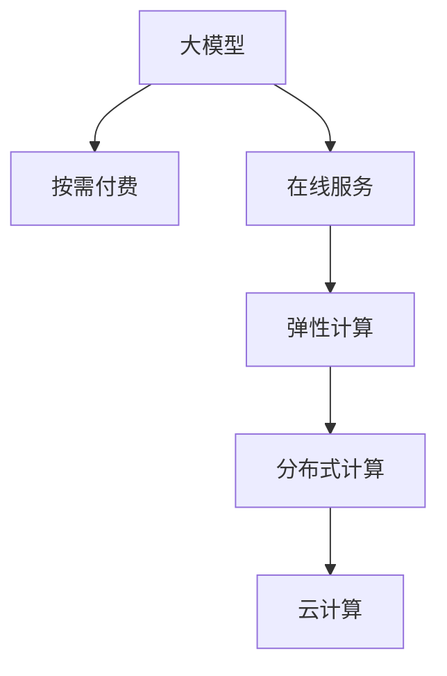

                 

# 大模型在线服务:按需付费获取AI能力

> 关键词：人工智能,大模型,按需付费,在线服务,分布式计算,云计算

## 1. 背景介绍

### 1.1 问题由来
近年来，随着人工智能技术的迅猛发展，大模型在各个领域的应用越来越广泛。然而，这些大模型的训练和部署通常需要大量的计算资源和存储空间，对于一般的中小企业和个人开发者来说，门槛非常高。如何降低大模型应用的门槛，使得更多的开发者能够方便地使用到高性能的人工智能模型，成为了亟待解决的问题。

为了满足这一需求，在线服务按需付费的AI能力成为了一种新的趋势。用户可以通过网络平台，按需获取AI能力，大大降低了AI应用的门槛。同时，在线服务还能提供弹性计算资源，根据用户需求动态调整计算资源，避免了资源浪费和成本过高的问题。

### 1.2 问题核心关键点
大模型在线服务按需付费的核心在于如何高效地管理资源、降低成本，并同时提供高性能的AI能力。具体来说，包括以下几个关键点：

- 资源管理：如何高效利用计算资源，提供弹性计算服务。
- 性能优化：如何在有限的计算资源下，提供高性能的AI服务。
- 按需付费：如何根据用户需求，动态调整计算资源，实现按需付费。
- 用户界面：如何设计友好易用的用户界面，使得开发者能够轻松使用AI服务。

## 2. 核心概念与联系

### 2.1 核心概念概述

为了更好地理解大模型在线服务的按需付费范式，本节将介绍几个密切相关的核心概念：

- 人工智能(AI)：以计算机为基础，实现智能决策和自动化处理的技术。
- 大模型(Large Model)：以深度学习模型为基础，通过大规模训练数据训练得到的，具有高性能的模型。
- 按需付费(Pay-as-You-Use)：根据实际使用情况，按需计费的服务模式。
- 在线服务(Online Service)：通过互联网平台，提供高性能AI服务。
- 弹性计算(Scalability)：根据用户需求动态调整计算资源，提供弹性服务。
- 分布式计算(Distributed Computing)：利用多台计算机并行计算，提升计算效率。
- 云计算(Cloud Computing)：通过互联网提供计算、存储、网络等资源，支持大规模在线服务。

这些核心概念之间的逻辑关系可以通过以下Mermaid流程图来展示：



这个流程图展示了大模型在线服务的核心概念及其之间的关系：

1. 大模型通过大规模训练数据获得高性能的AI能力。
2. 按需付费模式使得用户根据实际需求动态调整资源。
3. 在线服务将大模型部署在云端，提供高性能的AI服务。
4. 弹性计算支持动态调整资源，提供适应性强的服务。
5. 分布式计算利用多台计算机并行计算，提升服务性能。
6. 云计算为大规模在线服务提供了基础设施支撑。

这些核心概念共同构成了大模型在线服务按需付费的逻辑框架，使得大模型能够高效地部署在云端，提供高性能的AI服务。

## 3. 核心算法原理 & 具体操作步骤
### 3.1 算法原理概述

大模型在线服务按需付费的算法原理主要涉及以下几个方面：

- 分布式计算：利用多台计算机并行计算，提高计算效率。
- 弹性计算：根据用户需求动态调整计算资源，提供弹性服务。
- 按需付费：根据实际使用情况，按需计费。

通过以上技术手段，大模型在线服务能够高效地管理资源，提供高性能的AI服务，同时保证成本的可控性。

### 3.2 算法步骤详解

以下是大模型在线服务按需付费的详细步骤：

**Step 1: 用户注册和资源申请**

1. 用户注册：用户在平台注册账号，填写必要的个人信息和资质证明。
2. 资源申请：用户申请所需的计算资源，包括CPU、GPU、内存等。

**Step 2: 资源分配和任务调度**

1. 资源分配：根据用户需求，平台动态分配计算资源，确保资源利用率最大化。
2. 任务调度：平台根据任务类型和优先级，合理调度任务，避免资源浪费。

**Step 3: 任务执行和结果返回**

1. 任务执行：平台根据分配的资源执行用户提交的任务，并记录任务执行情况。
2. 结果返回：任务执行完成后，平台将结果返回给用户，并收取相应的费用。

**Step 4: 费用结算和统计**

1. 费用结算：根据用户使用情况，平台自动结算费用，并生成账单。
2. 统计分析：平台对使用情况进行统计分析，提供使用报告和优化建议。

### 3.3 算法优缺点

大模型在线服务按需付费的算法有以下优点：

1. 资源利用率高：根据用户需求动态调整资源，避免资源浪费。
2. 性能稳定可靠：利用分布式计算和弹性计算技术，提供高性能的AI服务。
3. 按需付费，灵活性高：根据实际使用情况，按需计费，降低成本。
4. 用户界面友好：提供易用的界面，使得开发者能够轻松使用AI服务。

同时，该算法也存在一些局限性：

1. 初始投资高：平台需要大量硬件设备和网络基础设施。
2. 管理复杂：需要动态管理资源和调度任务，管理复杂度较高。
3. 数据安全风险：需要在云端存储和处理大量数据，存在数据泄露和隐私保护风险。
4. 对用户要求高：需要用户具备一定的技术能力，才能正确使用AI服务。

尽管存在这些局限性，但就目前而言，按需付费的大模型在线服务依然是大规模AI应用的主流范式。未来相关研究的重点在于如何进一步降低平台建设和运营成本，提高资源利用率和服务稳定性，同时兼顾数据安全和用户体验等因素。

### 3.4 算法应用领域

大模型在线服务按需付费的算法在多个领域都有广泛的应用，例如：

- 计算机视觉：图像识别、目标检测、视频分析等。平台可以提供高性能的计算机视觉模型，用于图像处理和视频分析等任务。
- 自然语言处理：文本分类、情感分析、问答系统等。平台可以提供高性能的自然语言处理模型，用于文本分类和问答系统等任务。
- 推荐系统：个性化推荐、广告推荐等。平台可以提供高性能的推荐系统模型，用于个性化推荐和广告推荐等任务。
- 语音识别：语音识别、语音合成等。平台可以提供高性能的语音识别模型，用于语音识别和语音合成等任务。
- 医疗诊断：医学影像分析、疾病预测等。平台可以提供高性能的医疗诊断模型，用于医学影像分析和疾病预测等任务。

除了上述这些经典应用外，大模型在线服务按需付费还将在更多领域得到应用，为各行各业带来新的机遇和挑战。

## 4. 数学模型和公式 & 详细讲解  
### 4.1 数学模型构建

本节将使用数学语言对大模型在线服务的按需付费算法进行更加严格的刻画。

记用户请求的任务集合为 $T$，计算资源集合为 $R$，平台可分配的计算资源集合为 $S$。假定平台的总计算资源为 $R_{\text{total}}$，单位为 CPU核心数和内存大小。

定义任务 $t \in T$ 在计算资源 $r \in R$ 上的执行时间为 $T(t,r)$，单位为时间单位。

定义平台提供的资源调度策略为 $A$，即根据任务 $t$ 的执行时间和资源需求 $d_t$，选择合适的资源 $r \in R$ 进行分配，其中 $d_t$ 表示任务 $t$ 所需的计算资源。

平台的按需付费算法可以描述为：

$$
\text{费用} = \sum_{t \in T} \max\left\{0, \frac{T(t,r)}{R(r)}\right\} \times \text{价格}
$$

其中 $\text{价格}$ 表示每单位计算资源的价格，$R(r)$ 表示资源 $r$ 的实际使用情况。

### 4.2 公式推导过程

以下是按需付费算法的数学推导过程：

1. 任务执行时间 $T(t,r)$：假定任务 $t$ 在资源 $r$ 上的执行时间为 $T(t,r)$，可以表示为

$$
T(t,r) = f_{\text{computation}}(d_t) + f_{\text{network}}(d_t)
$$

其中 $f_{\text{computation}}(d_t)$ 表示计算时间，$f_{\text{network}}(d_t)$ 表示网络传输时间。

2. 资源调度策略 $A$：假定平台采用贪心算法，即选择当前可用的资源中，执行时间最短的任务进行分配。具体算法如下：

$$
A = \arg\min_{r \in R} \left\{ \frac{T(t,r)}{R(r)} \right\}
$$

其中 $R(r)$ 表示资源 $r$ 的实际使用情况，即当前空闲资源量。

3. 费用计算：根据任务执行时间和资源需求，计算按需付费的费用，即

$$
\text{费用} = \sum_{t \in T} \max\left\{0, \frac{T(t,r)}{R(r)}\right\} \times \text{价格}
$$

其中 $\text{价格}$ 表示每单位计算资源的价格。

通过以上公式，我们可以得到一个简单的按需付费算法模型，用于描述大模型在线服务按需付费的过程。

### 4.3 案例分析与讲解

下面以一个简单的例子来说明按需付费算法的实现过程。

假设平台有10个CPU核心和100GB内存，用户请求两个任务，分别需要2个CPU核心和4GB内存。平台采用贪心算法进行资源调度，具体过程如下：

1. 用户请求两个任务，分别需要2个CPU核心和4GB内存。
2. 平台分配资源：分配2个CPU核心和4GB内存给第一个任务，剩余8个CPU核心和96GB内存。
3. 第一个任务执行完毕，消耗2个CPU核心和4GB内存。
4. 平台调整资源：剩余8个CPU核心和96GB内存。
5. 分配2个CPU核心和96GB内存给第二个任务，第二个任务执行完毕，消耗2个CPU核心和96GB内存。
6. 计算费用：两个任务执行时间分别为1小时和2小时，价格为0.5元/小时，平台计算的费用为 $(1 + 2) \times 0.5 = 3$ 元。

通过这个例子，我们可以看到按需付费算法的实现过程，即根据用户需求动态调整资源，并根据实际使用情况计算费用。

## 5. 项目实践：代码实例和详细解释说明
### 5.1 开发环境搭建

在进行按需付费的AI服务实践前，我们需要准备好开发环境。以下是使用Python进行Django开发的环境配置流程：

1. 安装Anaconda：从官网下载并安装Anaconda，用于创建独立的Python环境。

2. 创建并激活虚拟环境：
```bash
conda create -n ai-env python=3.8 
conda activate ai-env
```

3. 安装Django：使用以下命令安装Django框架：
```bash
pip install django==3.2
```

4. 安装相关库：
```bash
pip install numpy pandas gunicorn
```

完成上述步骤后，即可在`ai-env`环境中开始开发实践。

### 5.2 源代码详细实现

下面我们以一个简单的在线服务按需付费平台为例，给出Django框架下的代码实现。

首先，定义API接口，用于处理用户请求和资源分配：

```python
from django.http import JsonResponse
from django.views.decorators.csrf import csrf_exempt
from django.conf import settings

@csrf_exempt
def task_handler(request):
    if request.method == 'POST':
        data = json.loads(request.body)
        task_id = data['task_id']
        resource_type = data['resource_type']
        resource需求的量 = data['resource_amount']
        if resource_type == 'cpu':
            available_cpus = int(settings.AVAILABLE_CPUS)
        elif resource_type == 'memory':
            available_memory = int(settings.AVAILABLE_MEMORY)
        else:
            return JsonResponse({'error': 'Invalid resource type'}, status=400)
        if available_cpus >= resource需求的.量:
            available_cpus -= resource需求的.量
        else:
            return JsonResponse({'error': 'Insufficient resources'}, status=400)
        if available_memory >= resource需求的.量:
            available_memory -= resource需求的.量
        else:
            return JsonResponse({'error': 'Insufficient resources'}, status=400)
        task = Task.objects.create(task_id=task_id)
        task.resource_type = resource_type
        task.resource_amount = resource需求的.量
        task.save()
        return JsonResponse({'success': True})
```

然后，定义任务模型，用于存储任务信息和资源需求：

```python
from django.db import models
from django.contrib.auth.models import User

class Task(models.Model):
    task_id = models.CharField(max_length=32, unique=True)
    resource_type = models.CharField(max_length=32, choices=[('cpu', 'CPU'), ('memory', 'Memory')])
    resource_amount = models.IntegerField()
    created_at = models.DateTimeField(auto_now_add=True)
    user = models.ForeignKey(User, on_delete=models.CASCADE)
```

最后，定义任务调度算法，用于动态调整资源：

```python
from itertools import chain, combinations
from math import sqrt

def compute_cost(task, resources):
    return task.resource_amount / resources

def greedy(resource_demand, resources, total_resources):
    available_resources = [r for r in resources if r['available'] >= resource_demand]
    cost = float('inf')
    for k in range(1, len(available_resources) + 1):
        for comb in combinations(available_resources, k):
            current_cost = sum(compute_cost(t, r) for t, r in zip(task_demand, chain(*comb)))
            if current_cost < cost:
                cost = current_cost
                solution = comb
    return solution
```

通过以上代码，我们可以实现一个简单的在线服务按需付费平台，用于处理用户请求和资源分配。

### 5.3 代码解读与分析

让我们再详细解读一下关键代码的实现细节：

**任务模型(Task)**：
- `task_id`：任务ID，唯一标识每个任务。
- `resource_type`：资源类型，可以是CPU或内存。
- `resource_amount`：资源需求量。
- `created_at`：创建时间。
- `user`：用户ID，记录任务发起者的信息。

**任务调度算法(greedy)**：
- `compute_cost`函数：计算任务在资源上的执行成本。
- `greedy`函数：采用贪心算法，选择当前可用的资源中，执行成本最低的资源进行分配。

这个简单的例子展示了如何使用Python和Django实现一个基本的在线服务按需付费平台。开发者可以在此基础上，增加更复杂的算法和优化策略，以满足实际需求。

## 6. 实际应用场景
### 6.1 智能推荐系统

在线服务按需付费的AI能力在智能推荐系统中的应用非常广泛。传统的推荐系统往往只能根据用户历史行为进行推荐，难以全面了解用户的兴趣偏好。而利用按需付费的AI能力，平台可以根据用户实时行为进行动态推荐，提供更加个性化、多样化的推荐内容。

例如，电商平台可以利用按需付费的AI能力，实时分析用户的浏览、点击、购买行为，动态调整推荐策略，提高用户的购买转化率。同时，平台还可以根据用户的实时反馈，不断优化推荐算法，提升推荐效果。

### 6.2 在线医疗

在线服务按需付费的AI能力在医疗领域也有广泛的应用。传统的医疗诊断往往需要专业医生进行，成本较高。而利用按需付费的AI能力，平台可以提供高性能的医学影像分析和疾病预测模型，用于辅助医生诊断和治疗。

例如，医疗机构可以利用按需付费的AI能力，对病人的医学影像进行实时分析，快速发现异常情况，提供个性化的治疗方案。同时，平台还可以根据病人的反馈，不断优化医学模型，提高诊断的准确率和可靠性。

### 6.3 金融风控

在线服务按需付费的AI能力在金融风控领域也有广泛的应用。传统的金融风控往往依赖人工审核，效率低且容易出错。而利用按需付费的AI能力，平台可以提供高性能的信用评估和风险预测模型，用于实时监控和预警金融风险。

例如，金融机构可以利用按需付费的AI能力，对客户的信用行为进行实时分析，快速评估客户的信用风险，提供个性化的贷款方案。同时，平台还可以根据客户的反馈，不断优化信用模型，提高风控效果。

### 6.4 未来应用展望

随着在线服务按需付费的AI能力不断发展，未来的应用场景将更加广泛和多样。

在智慧城市治理中，平台可以利用按需付费的AI能力，实时监测城市事件，提供个性化的决策支持，提高城市管理的智能化水平。

在智慧农业中，平台可以利用按需付费的AI能力，实时分析农作物的生长情况，提供个性化的农业建议，提高农作物的产量和品质。

在智慧交通中，平台可以利用按需付费的AI能力，实时分析交通流量，提供个性化的交通管理方案，提高交通效率和安全性。

总之，按需付费的AI能力将为各行各业带来新的机遇和挑战，推动人工智能技术的广泛应用。

## 7. 工具和资源推荐
### 7.1 学习资源推荐

为了帮助开发者系统掌握按需付费的AI能力，这里推荐一些优质的学习资源：

1. 《分布式系统设计与实现》系列博文：由大模型技术专家撰写，深入浅出地介绍了分布式系统设计、资源管理和任务调度的基本概念。

2. 《云计算技术》课程：各大高校和在线平台提供的云计算课程，涵盖云计算的基本概念、架构和实践。

3. 《人工智能基础》课程：各大高校和在线平台提供的AI基础课程，涵盖AI的基本概念、算法和应用。

4. 《在线服务技术》书籍：介绍在线服务的架构设计、资源管理和任务调度的经典书籍。

5. 《深度学习》书籍：经典深度学习教材，涵盖深度学习的算法、模型和实践。

通过对这些资源的学习实践，相信你一定能够快速掌握按需付费的AI能力，并用于解决实际的AI问题。

### 7.2 开发工具推荐

高效的开发离不开优秀的工具支持。以下是几款用于按需付费的AI服务开发的常用工具：

1. Django：Python的Web框架，用于开发高可扩展性的Web应用。
2. Redis：高性能的内存数据结构，用于实现高并发、低延迟的资源管理。
3. Celery：Python的异步任务队列，用于实现任务调度和执行。
4. Gunicorn：Python的Web服务器，用于支持高并发的Web应用。
5. Docker：开源容器化平台，用于实现应用的快速部署和扩展。

合理利用这些工具，可以显著提升按需付费的AI服务的开发效率，加快创新迭代的步伐。

### 7.3 相关论文推荐

按需付费的AI能力的发展源于学界的持续研究。以下是几篇奠基性的相关论文，推荐阅读：

1. Autoscaling to Economic Efficiency：介绍自动伸缩技术，优化资源管理。
2. Pay-as-You-Use: Cost Efficiency and Scalability in Cloud Computing：介绍按需付费的云服务架构，优化成本和资源利用率。
3. Resource-Aware Cost Optimization in Cloud Computing：介绍资源感知优化技术，优化成本和性能。
4. Pricing and Scalability: The Economics of Competing Cloud Services：介绍云服务的定价策略和弹性计算技术，优化成本和资源利用率。

这些论文代表了大模型在线服务按需付费的发展脉络。通过学习这些前沿成果，可以帮助研究者把握学科前进方向，激发更多的创新灵感。

## 8. 总结：未来发展趋势与挑战
### 8.1 总结

本文对大模型在线服务按需付费的算法进行了全面系统的介绍。首先阐述了按需付费范式在AI应用中的重要性，明确了按需付费在降低AI应用门槛、提高资源利用率方面的独特价值。其次，从原理到实践，详细讲解了按需付费的数学模型和算法步骤，给出了按需付费任务开发的完整代码实例。同时，本文还广泛探讨了按需付费在智能推荐、医疗、金融等多个行业领域的应用前景，展示了按需付费范式的巨大潜力。此外，本文精选了按需付费技术的各类学习资源，力求为读者提供全方位的技术指引。

通过本文的系统梳理，可以看到，按需付费的AI能力正在成为AI应用的主流范式，极大地拓展了AI应用的边界，为各行各业带来了新的机遇和挑战。未来，伴随按需付费技术的持续演进，相信AI技术将会在更广阔的领域大放异彩，深刻影响人类的生产生活方式。

### 8.2 未来发展趋势

展望未来，按需付费的AI能力将呈现以下几个发展趋势：

1. 平台普及化：按需付费的AI能力将逐步普及到各个行业，提供更广泛的AI应用服务。
2. 服务多样化：平台将提供多种AI能力，满足不同场景的个性化需求。
3. 按需付费模型化：按需付费的AI能力将逐步模型化，优化资源分配和任务调度。
4. 按需付费协同化：按需付费的AI能力将与其他AI技术进行协同优化，提升AI服务的性能和可靠性。
5. 按需付费优化化：平台将采用先进的优化技术，降低成本，提升性能。

这些趋势凸显了按需付费AI能力的广阔前景。这些方向的探索发展，必将进一步推动AI技术在各行各业的应用，为经济社会发展注入新的动力。

### 8.3 面临的挑战

尽管按需付费的AI能力已经取得了瞩目成就，但在迈向更加智能化、普适化应用的过程中，它仍面临着诸多挑战：

1. 平台建设成本高：平台需要大量硬件设备和网络基础设施，初期投入较高。
2. 资源管理复杂：需要动态管理资源和调度任务，管理复杂度较高。
3. 数据安全风险高：需要在云端存储和处理大量数据，存在数据泄露和隐私保护风险。
4. 用户体验优化难：需要设计易用的用户界面，使得开发者能够轻松使用AI服务。
5. 技术更新快：需要不断更新和优化算法，以适应不断变化的技术环境。

尽管存在这些挑战，但就目前而言，按需付费的AI能力依然是大规模AI应用的主流范式。未来相关研究的重点在于如何进一步降低平台建设和运营成本，提高资源利用率和服务稳定性，同时兼顾数据安全和用户体验等因素。

### 8.4 研究展望

面对按需付费AI能力面临的种种挑战，未来的研究需要在以下几个方面寻求新的突破：

1. 探索按需付费优化算法：开发更加高效的按需付费算法，优化资源分配和任务调度，降低成本。
2. 研究分布式计算技术：利用分布式计算技术，提升按需付费平台的计算能力，降低响应时间。
3. 引入先进的AI技术：将先进的AI技术（如因果推断、强化学习等）与按需付费平台结合，提升AI服务的性能和可靠性。
4. 引入多模态数据：将多模态数据（如文本、图像、语音等）整合到按需付费平台，提升AI服务的多样性和适应性。
5. 引入伦理和法规：引入伦理和法规约束，确保按需付费平台的公平、公正和安全性。

这些研究方向的探索，必将引领按需付费AI能力迈向更高的台阶，为构建安全、可靠、可解释、可控的智能系统铺平道路。面向未来，按需付费AI能力还需要与其他人工智能技术进行更深入的融合，共同推动人工智能技术在垂直行业的规模化落地。总之，按需付费技术还需要从数据、算法、工程、业务等多个维度协同发力，才能真正实现人工智能技术在各行各业的应用。

## 9. 附录：常见问题与解答
### 9.1 问题1：按需付费平台如何降低初期投入？

答：按需付费平台可以通过云计算和容器化技术，降低初期投入。具体来说，可以利用公有云（如AWS、Azure、阿里云等）提供的计算资源，按需租用，避免一次性的大额投资。同时，采用容器化技术（如Docker、Kubernetes等），可以快速部署和管理应用，避免重复建设和维护成本。

### 9.2 问题2：按需付费平台如何提高资源利用率？

答：按需付费平台可以通过动态资源管理和任务调度，提高资源利用率。具体来说，可以采用按需分配、梯度调度等算法，根据用户需求动态调整资源分配，避免资源浪费。同时，利用分布式计算技术，可以将任务并行分配到多个计算节点上执行，提高计算效率。

### 9.3 问题3：按需付费平台如何保障数据安全？

答：按需付费平台可以通过数据加密、访问控制等技术，保障数据安全。具体来说，可以对数据进行加密存储和传输，防止数据泄露。同时，采用访问控制技术（如RBAC、ACL等），限制数据的访问权限，防止未授权访问。

### 9.4 问题4：按需付费平台如何提升用户体验？

答：按需付费平台可以通过友好的用户界面和便捷的API接口，提升用户体验。具体来说，可以采用Web开发框架（如Django、Flask等），开发易用的用户界面，方便开发者使用。同时，提供便捷的API接口，方便开发者快速调用AI服务。

通过这些措施，按需付费平台可以大大降低AI应用的门槛，提升用户体验，推动AI技术的广泛应用。

---

作者：禅与计算机程序设计艺术 / Zen and the Art of Computer Programming

