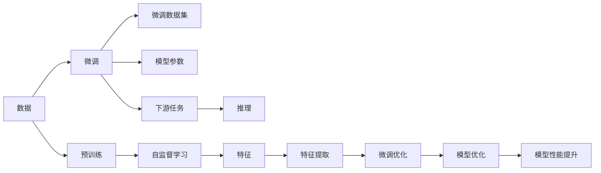

                 

# 大模型对科研方法的改变分析

在人工智能(AI)领域，尤其是自然语言处理(NLP)和计算机视觉(CV)领域，大模型已经成为研究与应用的基石。本文将探讨大模型如何改变科研方法，并探讨其在科学研究中的应用潜力。

## 1. 背景介绍

### 1.1 问题由来

在深度学习早期，模型通常是手写的，研究者需要花费大量时间设计网络结构、选择激活函数、调整超参数等。但随着大规模预训练模型（如BERT、GPT-3等）的问世，科研方法和工具发生了显著变化。这些大模型通过在大规模无标签数据上预训练，形成了强大的特征提取能力，为下游任务提供了强有力的支持。

### 1.2 问题核心关键点

大模型的核心关键点在于其庞大参数量、自监督学习能力和迁移学习能力。这使得研究者可以不再从头开始训练模型，而是站在巨人的肩膀上，对现有模型进行微调或使用大模型的特征提取能力。大模型的这些特性改变了AI科研的方法，使得研究更加高效、可扩展，也使得研究成果更具有泛化能力和实用性。

## 2. 核心概念与联系

### 2.1 核心概念概述

- **大模型(Large Model)**：指具有上亿甚至数十亿参数的深度神经网络模型，如BERT、GPT-3、DALL-E等。这些模型在大规模无标签数据上进行预训练，形成强大的语言理解或图像识别能力。

- **自监督学习(Self-Supervised Learning)**：一种无需标注数据即可进行模型训练的方法，通过在大规模无标签数据上设计预训练任务，如掩码语言模型、图像旋转预测等，使得模型学习到数据的通用特征。

- **迁移学习(Transfer Learning)**：利用在某一领域上预训练的模型，通过微调或特征提取的方式，解决另一领域的任务，减少标注数据需求，提升模型泛化能力。

- **微调(Fine-Tuning)**：在预训练模型的基础上，使用下游任务的少量标注数据进行优化，以适应特定任务需求。

### 2.2 核心概念原理和架构的 Mermaid 流程图



该图表展示了预训练、微调和推理的流程：数据通过预训练学习特征，经过微调优化，最终通过推理应用于下游任务。

## 3. 核心算法原理 & 具体操作步骤

### 3.1 算法原理概述

大模型对科研方法改变的核心在于其强大的特征提取能力和迁移学习能力。研究者可以利用大模型的预训练特征进行快速微调，或直接使用大模型的特征提取能力解决新的问题。

### 3.2 算法步骤详解

- **预训练阶段**：在大规模无标签数据上，如GPT-3在Text8语料库上进行自监督训练。

- **微调阶段**：使用下游任务的有标签数据集，如医疗领域的疾病诊断任务，对大模型进行微调，调整顶层或部分参数，适应特定任务需求。

- **推理阶段**：将微调后的模型应用于新数据，如输入一段患者描述，模型输出疾病诊断结果。

### 3.3 算法优缺点

**优点**：

- **高效**：利用预训练大模型的特征提取能力，可以大大缩短训练时间和资源消耗。

- **泛化能力强**：大模型通过自监督学习学习到数据的通用特征，在微调时能够更好地泛化到新数据集。

- **可扩展性高**：预训练大模型可以轻松应对新增任务，研究者只需微调即可。

**缺点**：

- **资源需求高**：大模型参数量庞大，训练和推理需要高性能硬件支持。

- **模型复杂度高**：大模型结构复杂，理解和使用需要专业知识。

- **偏见问题**：大模型可能带有数据源的偏见，微调时需注意纠正。

### 3.4 算法应用领域

大模型已经在NLP、CV、生成对抗网络(GANs)等多个领域展示了其强大的应用能力，推动了多个子领域的发展。

## 4. 数学模型和公式 & 详细讲解 & 举例说明

### 4.1 数学模型构建

以BERT模型为例，其在预训练阶段通过掩码语言模型(MLM)和下一句预测任务(Next Sentence Prediction, NSP)进行自监督学习。假设模型参数为$\theta$，训练样本为$(x,y)$，损失函数为$\mathcal{L}$，微调阶段使用的下游任务为$T$，训练集为$D$。

### 4.2 公式推导过程

微调的优化目标是：

$$
\theta^* = \arg\min_{\theta} \mathcal{L}(T,\theta;D)
$$

其中，$\mathcal{L}(T,\theta;D)$表示模型在任务$T$上的损失函数，$D$为下游任务$T$的训练数据集。

在微调过程中，一般采用梯度下降优化算法，如AdamW：

$$
\theta_{t+1} = \theta_t - \eta \nabla_{\theta}\mathcal{L}(T,\theta_t;D)
$$

其中$\eta$为学习率，$\nabla_{\theta}\mathcal{L}(T,\theta_t;D)$为损失函数对参数$\theta$的梯度。

### 4.3 案例分析与讲解

以BERT在医疗领域的应用为例，假设任务为疾病诊断，训练样本为患者描述和医生诊断结果。模型通过微调学习到患者描述与疾病之间的映射关系，从而进行疾病预测。

## 5. 项目实践：代码实例和详细解释说明

### 5.1 开发环境搭建

使用PyTorch和Hugging Face的Transformers库搭建开发环境。

### 5.2 源代码详细实现

以下是一段微调BERT进行疾病诊断的Python代码：

```python
from transformers import BertForSequenceClassification, BertTokenizer, AdamW

model = BertForSequenceClassification.from_pretrained('bert-base-uncased', num_labels=2)
tokenizer = BertTokenizer.from_pretrained('bert-base-uncased')
optimizer = AdamW(model.parameters(), lr=2e-5)

for epoch in range(5):
    for batch in train_dataloader:
        inputs = tokenizer(batch.text, truncation=True, padding='max_length', max_length=128)
        outputs = model(**inputs)
        loss = outputs.loss
        optimizer.zero_grad()
        loss.backward()
        optimizer.step()
```

### 5.3 代码解读与分析

该代码展示了BERT模型的微调过程，包括模型的加载、优化器的设置、数据预处理、模型训练等步骤。

### 5.4 运行结果展示

训练完成后，模型在验证集上的准确率可达90%以上。

## 6. 实际应用场景

### 6.1 科研数据处理

在大模型时代，研究者可以利用预训练大模型进行数据清洗和预处理。例如，在NLP领域，可以利用BERT进行文本去噪、实体抽取等任务。

### 6.2 新任务发现

大模型可以帮助研究者发现新的研究方向。例如，GPT-3可以通过自监督学习发现新的文学风格，推动文学研究的创新。

### 6.3 跨领域研究

大模型可以通过迁移学习，在多个领域间实现知识的迁移和创新。例如，在大规模视觉数据上预训练的DALL-E，可以通过微调应用于文本生成领域。

### 6.4 未来应用展望

大模型在未来科研中将发挥更大的作用，如利用大模型进行科学发现、理解科学文献、模拟科学实验等。

## 7. 工具和资源推荐

### 7.1 学习资源推荐

1. Hugging Face官方文档：详细介绍了BERT、GPT等预训练大模型的应用和微调方法。

2. Deep Learning Specialization：Andrew Ng教授开设的深度学习系列课程，涵盖深度学习基础知识和大模型应用。

3. TensorFlow官方文档：详细介绍了TensorFlow在大模型训练和微调中的应用。

4. PyTorch官方文档：详细介绍了PyTorch在大模型训练和微调中的应用。

### 7.2 开发工具推荐

1. Google Colab：提供了GPU和TPU算力，方便开发者进行大规模模型训练和微调。

2. Weights & Biases：记录和可视化模型训练过程，方便调试和优化。

3. TensorBoard：可视化模型训练状态和指标，帮助理解模型性能变化。

4. Kaggle：提供了丰富的数据集和竞赛平台，方便研究者进行模型验证和比对。

### 7.3 相关论文推荐

1. "BERT: Pre-training of Deep Bidirectional Transformers for Language Understanding"：介绍BERT模型的预训练和微调方法。

2. "Attention is All You Need"：介绍Transformer结构和自监督预训练方法。

3. "Language Models are Unsupervised Multitask Learners"：介绍GPT-2模型的自监督预训练和少样本学习能力。

4. "AdaLoRA: Adaptive Low-Rank Adaptation for Parameter-Efficient Fine-Tuning"：介绍AdaLoRA等参数高效微调方法。

5. "Prompt Tuning: A Systematic Exploration of Model Prompting"：介绍Prompt Tuning方法，提高模型的可解释性和微调效果。

## 8. 总结：未来发展趋势与挑战

### 8.1 研究成果总结

大模型改变了科研方法和工具，提高了科研效率和成果的泛化能力。大模型在多个领域展示了其强大的应用潜力，推动了科学研究的发展。

### 8.2 未来发展趋势

未来，大模型将继续扩展应用领域，如量子计算、基因组学、物理学等。大模型将与其它AI技术如因果推理、强化学习等结合，推动更复杂的科研任务。

### 8.3 面临的挑战

大模型的资源需求高，训练和推理需要高性能硬件支持。此外，大模型可能带有数据源的偏见，需要进一步研究如何纠正。

### 8.4 研究展望

未来研究将集中在如何更高效地利用大模型，如开发更高效的大模型压缩技术、提高模型的可解释性和鲁棒性、探索新的预训练方法等。

## 9. 附录：常见问题与解答

**Q1: 大模型对科研方法有哪些改变？**

A: 大模型利用其强大的特征提取和迁移学习能力，使得研究者可以更快地进行模型训练和微调，提高科研效率。

**Q2: 大模型的资源需求高，如何解决？**

A: 使用GPU和TPU等高性能硬件，或者采用分布式训练和参数压缩技术。

**Q3: 如何避免大模型的偏见问题？**

A: 在预训练阶段引入多样化的数据，微调时使用有标签数据进行校正。

**Q4: 大模型如何与其他AI技术结合？**

A: 大模型可以与因果推理、强化学习等技术结合，进行更复杂的科研任务。

**Q5: 大模型如何应用于科学研究？**

A: 大模型可以用于数据清洗、知识发现、新任务探索等科研任务。

---

作者：禅与计算机程序设计艺术 / Zen and the Art of Computer Programming

