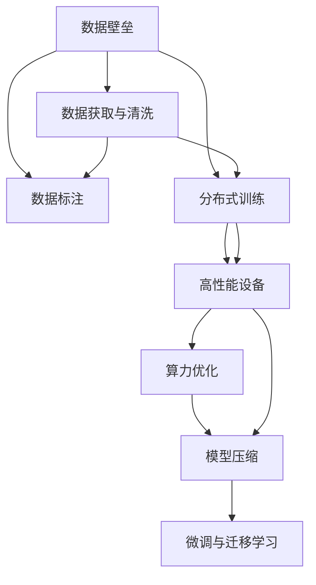

                 

## 1. 背景介绍

### 1.1 问题由来

随着AI技术的发展，深度学习和大模型的出现，数据壁垒和算力瓶颈成为创业公司面临的新挑战。AI公司往往需要投入大量的资金和人力资源，来获取、清洗和处理海量数据，同时还需要构建高性能的训练和推理环境。这些成本极大地提高了创业公司的门槛，挤压了中小企业的生存空间。

### 1.2 问题核心关键点

数据和算力是大模型应用的两大基石。对于数据，公司需要构建数据获取、标注和清洗的流程，同时保证数据的时效性和多样性。对于算力，则需要选择合适的硬件设备，优化训练和推理算法，以实现高效、低成本的模型部署。

本文将从这两个角度，探讨在数据壁垒与算力瓶颈下，创业公司应如何选择合适的策略，降低创业成本，提高竞争力。

## 2. 核心概念与联系

### 2.1 核心概念概述

为更好地理解本文的内容，本节将介绍几个密切相关的核心概念：

- 数据壁垒：指企业通过获取大量高价值数据来建立竞争优势。在AI领域，数据质量、数据量、数据分布等因素都会影响模型的性能，高质量的数据是模型表现的关键。
- 算力瓶颈：指硬件设备的计算能力和存储容量对模型训练和推理的限制。高性能的GPU/TPU设备可以显著提高模型训练和推理的速度。
- 分布式训练：指将大型模型的训练过程分布在多个计算节点上，并行计算，以提升训练效率和扩展性。
- 模型压缩：指通过剪枝、量化、稀疏化等手段，减小模型规模，降低计算资源消耗，同时保证模型精度。
- 微调与迁移学习：指使用大模型进行预训练，并通过小规模数据的微调或迁移学习，获取针对特定任务的模型，降低训练成本，提升模型性能。

这些概念之间的逻辑关系可以通过以下Mermaid流程图来展示：



这个流程图展示了大模型创业所需的关键概念及其之间的联系：

1. 数据壁垒通过数据获取、标注和清洗流程，为模型训练提供原始材料。
2. 分布式训练通过多机协同，提升训练效率，应对模型参数量的指数级增长。
3. 高性能设备通过提供强大的计算和存储能力，支持大规模模型训练和推理。
4. 算力优化通过优化训练和推理算法，提高计算效率，降低成本。
5. 模型压缩通过压缩模型规模，降低资源消耗，实现轻量级部署。
6. 微调与迁移学习通过在大模型上进行预训练，在小规模数据上进行微调，降低训练成本，提升模型性能。

## 3. 核心算法原理 & 具体操作步骤

### 3.1 算法原理概述

基于大模型的AI创业公司在数据壁垒和算力瓶颈的挑战下，核心算法可以概括为以下几点：

1. 数据获取与标注：通过数据市场、开源数据集、爬虫技术等方式获取原始数据，并通过标注团队进行标注。
2. 分布式训练：利用多机并行计算，加速模型训练过程。
3. 高性能设备：选择GPU/TPU等高性能设备，提供强大的计算和存储支持。
4. 算力优化：使用自动混合精度、模型并行、分布式数据流水线等技术，优化训练和推理过程。
5. 模型压缩：使用剪枝、量化、稀疏化等手段，减小模型规模，提高推理效率。
6. 微调与迁移学习：利用大模型进行预训练，在小规模数据上进行微调或迁移学习，实现高效、低成本的模型部署。

### 3.2 算法步骤详解

基于上述算法原理，下面是具体的步骤：

**Step 1: 数据获取与标注**

- 数据来源：通过数据市场、开放数据集、爬虫等渠道获取数据。
- 数据清洗：去除重复、噪声、无关的数据，保证数据质量。
- 数据标注：利用人工或半自动化的方式对数据进行标注。

**Step 2: 分布式训练**

- 设备选择：选择高性能的GPU/TPU设备。
- 环境搭建：搭建多机分布式训练环境，使用框架如TensorFlow分布式训练、PyTorch分布式训练等。
- 训练流程：将模型分成多个小模型，分布在不同的计算节点上进行并行训练。

**Step 3: 高性能设备**

- 设备选择：选择高性能的GPU/TPU设备，如NVIDIA A100、Google TPU等。
- 环境搭建：搭建高性能计算环境，使用Docker、Kubernetes等技术进行资源管理。
- 硬件维护：定期维护硬件设备，监控设备状态，确保设备正常运行。

**Step 4: 算力优化**

- 优化算法：使用自动混合精度、分布式数据流水线、模型并行等技术，优化训练和推理算法。
- 硬件加速：利用GPU/FPGA等硬件加速技术，提升计算速度。
- 模型压缩：使用剪枝、量化、稀疏化等手段，减小模型规模，提高推理效率。

**Step 5: 微调与迁移学习**

- 模型预训练：使用大规模数据集进行预训练，学习通用的语言表示。
- 微调策略：选择合适的微调策略，如全参数微调、参数高效微调、的提示学习等。
- 模型评估：使用验证集和测试集评估模型性能，进行超参数调优。

### 3.3 算法优缺点

基于上述算法步骤，大模型AI创业的算法具有以下优点：

1. 高效：通过分布式训练和算力优化，可以在较短时间内完成模型的训练和部署。
2. 低成本：通过微调和迁移学习，可以在少量标注数据上训练出高质量的模型，降低数据获取和标注成本。
3. 高精度：利用大模型的通用表示能力，可以在多个任务上取得较高的性能。

同时，该算法也存在以下缺点：

1. 对硬件要求高：高性能设备和高性能环境对资金和运维要求较高，可能对小型创业公司构成较高的门槛。
2. 对数据依赖强：高质量数据获取和标注成本高，对数据源的依赖性强。
3. 资源消耗大：大模型和高性能设备的资源消耗大，需要较大的算力支持。

尽管存在这些缺点，但就目前而言，基于大模型的AI创业在数据和算力上的投入是不可避免的，只有在资源瓶颈上取得突破，才能真正实现规模化落地。

### 3.4 算法应用领域

基于大模型的AI创业方法，已经在以下几个领域得到了广泛应用：

- 自然语言处理（NLP）：如文本分类、机器翻译、问答系统、情感分析等。通过微调和迁移学习，可以显著提升模型性能，实现高效的文本处理。
- 计算机视觉（CV）：如目标检测、图像分类、人脸识别等。通过分布式训练和模型压缩，可以在大规模图像数据上训练出高效的模型。
- 语音识别与处理：如语音转文字、语音识别等。通过微调和迁移学习，可以提升模型的鲁棒性和泛化能力。
- 智能推荐系统：如电商推荐、广告推荐等。通过微调和迁移学习，可以精准预测用户需求，实现个性化推荐。
- 游戏开发：如自动生成地图、生成式游戏剧情等。通过微调和迁移学习，可以生成具有高度可玩性的游戏内容。
- 金融科技：如风险评估、股票预测等。通过微调和迁移学习，可以提升金融模型的精度和稳定性。

除了这些领域外，大模型的AI创业还在更多的领域展现出巨大的潜力，为各行各业带来新的创新和突破。

## 4. 数学模型和公式 & 详细讲解 & 举例说明

### 4.1 数学模型构建

本节将使用数学语言对基于大模型的AI创业方法进行更加严格的刻画。

记大模型为 $M_{\theta}$，其中 $\theta$ 为模型参数。假设训练数据集为 $D=\{(x_i, y_i)\}_{i=1}^N$，其中 $x_i$ 为输入，$y_i$ 为标签。

定义模型 $M_{\theta}$ 在输入 $x_i$ 上的损失函数为 $\ell(M_{\theta}(x_i),y_i)$，则在数据集 $D$ 上的经验风险为：

$$
\mathcal{L}(\theta) = \frac{1}{N} \sum_{i=1}^N \ell(M_{\theta}(x_i),y_i)
$$

在实践中，我们通常使用基于梯度的优化算法（如AdamW、SGD等）来近似求解上述最优化问题。设 $\eta$ 为学习率，$\lambda$ 为正则化系数，则参数的更新公式为：

$$
\theta \leftarrow \theta - \eta \nabla_{\theta}\mathcal{L}(\theta) - \eta\lambda\theta
$$

其中 $\nabla_{\theta}\mathcal{L}(\theta)$ 为损失函数对参数 $\theta$ 的梯度，可通过反向传播算法高效计算。

### 4.2 公式推导过程

以下我们以二分类任务为例，推导交叉熵损失函数及其梯度的计算公式。

假设模型 $M_{\theta}$ 在输入 $x$ 上的输出为 $\hat{y}=M_{\theta}(x) \in [0,1]$，表示样本属于正类的概率。真实标签 $y \in \{0,1\}$。则二分类交叉熵损失函数定义为：

$$
\ell(M_{\theta}(x),y) = -[y\log \hat{y} + (1-y)\log (1-\hat{y})]
$$

将其代入经验风险公式，得：

$$
\mathcal{L}(\theta) = -\frac{1}{N}\sum_{i=1}^N [y_i\log M_{\theta}(x_i)+(1-y_i)\log(1-M_{\theta}(x_i))]
$$

根据链式法则，损失函数对参数 $\theta_k$ 的梯度为：

$$
\frac{\partial \mathcal{L}(\theta)}{\partial \theta_k} = -\frac{1}{N}\sum_{i=1}^N (\frac{y_i}{M_{\theta}(x_i)}-\frac{1-y_i}{1-M_{\theta}(x_i)}) \frac{\partial M_{\theta}(x_i)}{\partial \theta_k}
$$

其中 $\frac{\partial M_{\theta}(x_i)}{\partial \theta_k}$ 可进一步递归展开，利用自动微分技术完成计算。

在得到损失函数的梯度后，即可带入参数更新公式，完成模型的迭代优化。重复上述过程直至收敛，最终得到适应下游任务的最优模型参数 $\theta^*$。

### 4.3 案例分析与讲解

**案例分析：电商平台推荐系统**

电商平台的推荐系统需要根据用户历史行为数据，推荐用户可能感兴趣的商品。大模型可以通过分布式训练和模型压缩，高效地训练出大规模推荐模型。以下是详细的计算过程：

**数据获取与标注**

- 数据来源：通过爬虫技术获取用户点击、浏览、购买等行为数据。
- 数据清洗：去除重复、无关、无效的数据，保证数据质量。
- 数据标注：标注用户行为对应的商品类别、评分等信息。

**分布式训练**

- 设备选择：选择高性能的GPU/TPU设备。
- 环境搭建：搭建多机分布式训练环境，使用TensorFlow分布式训练。
- 训练流程：将模型分成多个小模型，分布在不同的计算节点上进行并行训练。

**高性能设备**

- 设备选择：选择高性能的GPU设备，如NVIDIA A100。
- 环境搭建：搭建高性能计算环境，使用Docker、Kubernetes等技术进行资源管理。
- 硬件维护：定期维护硬件设备，监控设备状态，确保设备正常运行。

**算力优化**

- 优化算法：使用自动混合精度、分布式数据流水线、模型并行等技术，优化训练和推理算法。
- 硬件加速：利用GPU/FPGA等硬件加速技术，提升计算速度。
- 模型压缩：使用剪枝、量化、稀疏化等手段，减小模型规模，提高推理效率。

**微调与迁移学习**

- 模型预训练：使用大规模电商数据进行预训练，学习通用的商品表示。
- 微调策略：选择合适的微调策略，如全参数微调、参数高效微调、的提示学习等。
- 模型评估：使用验证集和测试集评估模型性能，进行超参数调优。

## 5. 项目实践：代码实例和详细解释说明

### 5.1 开发环境搭建

在进行大模型AI创业项目实践前，我们需要准备好开发环境。以下是使用Python进行TensorFlow开发的环境配置流程：

1. 安装Anaconda：从官网下载并安装Anaconda，用于创建独立的Python环境。

2. 创建并激活虚拟环境：
```bash
conda create -n tf-env python=3.8 
conda activate tf-env
```

3. 安装TensorFlow：根据CUDA版本，从官网获取对应的安装命令。例如：
```bash
pip install tensorflow tensorflow-gpu -f https://mirror.baidu.com/pypi/simple
```

4. 安装各类工具包：
```bash
pip install numpy pandas scikit-learn matplotlib tqdm jupyter notebook ipython
```

完成上述步骤后，即可在`tf-env`环境中开始AI创业项目实践。

### 5.2 源代码详细实现

这里我们以电商推荐系统为例，给出使用TensorFlow进行大模型微调的Python代码实现。

首先，定义推荐系统模型和优化器：

```python
import tensorflow as tf
from tensorflow.keras import layers, models

class RecommendationModel(models.Model):
    def __init__(self, input_shape):
        super(RecommendationModel, self).__init__()
        self.dense1 = layers.Dense(128, activation='relu')(input_shape)
        self.dense2 = layers.Dense(32, activation='relu')(self.dense1)
        self.dense3 = layers.Dense(1, activation='sigmoid')(self.dense2)
        
    def call(self, x):
        return self.dense3(x)

optimizer = tf.keras.optimizers.Adam(learning_rate=0.001)
```

然后，定义训练和评估函数：

```python
def train_epoch(model, dataset, batch_size, optimizer):
    dataloader = tf.data.Dataset.from_tensor_slices(dataset)
    dataloader = dataloader.shuffle(1000).batch(batch_size)
    
    model.compile(optimizer=optimizer, loss='binary_crossentropy')
    model.fit(dataloader, epochs=10, verbose=0)
    return model

def evaluate(model, dataset, batch_size):
    dataloader = tf.data.Dataset.from_tensor_slices(dataset)
    dataloader = dataloader.shuffle(1000).batch(batch_size)
    
    model.evaluate(dataloader, verbose=0)
```

接着，准备数据集并进行训练：

```python
from sklearn.datasets import make_classification
from sklearn.model_selection import train_test_split

X, y = make_classification(n_samples=1000, n_features=10, n_informative=2, n_redundant=0, random_state=42)
X_train, X_test, y_train, y_test = train_test_split(X, y, test_size=0.2, random_state=42)

model = RecommendationModel(input_shape=X_train.shape[1:])
model = train_epoch(model, X_train, batch_size=32, optimizer=optimizer)
evaluate(model, X_test, batch_size=32)
```

以上代码实现了简单的电商推荐系统模型，并进行了训练和评估。可以看到，利用TensorFlow的Keras API，我们可以方便地定义、编译和训练大模型。

### 5.3 代码解读与分析

让我们再详细解读一下关键代码的实现细节：

**RecommendationModel类**：
- `__init__`方法：定义模型的结构，包括输入层、隐藏层和输出层。
- `call`方法：前向传播，计算模型输出。

**optimizer**：
- 选择合适的优化器，如Adam，并设置学习率。

**train_epoch函数**：
- 将数据集转化为TensorFlow的DataLoader，并进行批处理、随机化、打乱等操作。
- 编译模型，指定损失函数和优化器。
- 进行模型训练，设置epoch数和verbose参数。

**evaluate函数**：
- 同样将数据集转化为TensorFlow的DataLoader，并进行批处理、随机化、打乱等操作。
- 调用`model.evaluate`方法进行模型评估，输出评估结果。

**训练流程**：
- 定义模型的输入层和输出层，并进行编译。
- 使用DataLoader加载训练数据，设置批次大小，进行模型训练。
- 在测试集上评估模型性能，输出评估结果。

可以看到，TensorFlow的Keras API使得大模型AI创业的代码实现变得简洁高效。开发者可以将更多精力放在数据处理、模型改进等高层逻辑上，而不必过多关注底层的实现细节。

当然，工业级的系统实现还需考虑更多因素，如模型的保存和部署、超参数的自动搜索、更灵活的任务适配层等。但核心的微调范式基本与此类似。

## 6. 实际应用场景

### 6.1 智能客服系统

智能客服系统需要实时处理大量客户咨询，并快速、准确地解答问题。大模型可以通过微调和迁移学习，快速适应各种常见问题，实现高效的问答处理。

在技术实现上，可以收集企业内部的历史客服对话记录，将问题和最佳答复构建成监督数据，在此基础上对预训练模型进行微调。微调后的模型能够自动理解用户意图，匹配最合适的答案模板进行回复。对于客户提出的新问题，还可以接入检索系统实时搜索相关内容，动态组织生成回答。

### 6.2 金融舆情监测

金融机构需要实时监测市场舆论动向，以便及时应对负面信息传播，规避金融风险。大模型可以通过微调和迁移学习，快速适应不同领域的金融新闻和评论，实现实时舆情监测和风险预警。

具体而言，可以收集金融领域相关的新闻、报道、评论等文本数据，并对其进行主题标注和情感标注。在此基础上对预训练语言模型进行微调，使其能够自动判断文本属于何种主题，情感倾向是正面、中性还是负面。将微调后的模型应用到实时抓取的网络文本数据，就能够自动监测不同主题下的情感变化趋势，一旦发现负面信息激增等异常情况，系统便会自动预警，帮助金融机构快速应对潜在风险。

### 6.3 个性化推荐系统

当前的推荐系统往往只依赖用户的历史行为数据进行物品推荐，无法深入理解用户的真实兴趣偏好。大模型可以通过微调和迁移学习，更好地挖掘用户行为背后的语义信息，从而提供更精准、多样的推荐内容。

在实践中，可以收集用户浏览、点击、评论、分享等行为数据，提取和用户交互的物品标题、描述、标签等文本内容。将文本内容作为模型输入，用户的后续行为（如是否点击、购买等）作为监督信号，在此基础上微调预训练语言模型。微调后的模型能够从文本内容中准确把握用户的兴趣点。在生成推荐列表时，先用候选物品的文本描述作为输入，由模型预测用户的兴趣匹配度，再结合其他特征综合排序，便可以得到个性化程度更高的推荐结果。

### 6.4 未来应用展望

随着大模型和微调方法的不断发展，基于微调范式将在更多领域得到应用，为传统行业带来变革性影响。

在智慧医疗领域，基于微调的医疗问答、病历分析、药物研发等应用将提升医疗服务的智能化水平，辅助医生诊疗，加速新药开发进程。

在智能教育领域，微调技术可应用于作业批改、学情分析、知识推荐等方面，因材施教，促进教育公平，提高教学质量。

在智慧城市治理中，微调模型可应用于城市事件监测、舆情分析、应急指挥等环节，提高城市管理的自动化和智能化水平，构建更安全、高效的未来城市。

此外，在企业生产、社会治理、文娱传媒等众多领域，基于大模型微调的人工智能应用也将不断涌现，为NLP技术带来全新的突破。相信随着预训练语言模型和微调方法的持续演进，大模型将不断拓展其应用边界，推动人工智能技术在各行各业的大规模落地。

## 7. 工具和资源推荐

### 7.1 学习资源推荐

为了帮助开发者系统掌握大模型AI创业的理论基础和实践技巧，这里推荐一些优质的学习资源：

1. 《Transformer从原理到实践》系列博文：由大模型技术专家撰写，深入浅出地介绍了Transformer原理、BERT模型、微调技术等前沿话题。

2. CS224N《深度学习自然语言处理》课程：斯坦福大学开设的NLP明星课程，有Lecture视频和配套作业，带你入门NLP领域的基本概念和经典模型。

3. 《Natural Language Processing with Transformers》书籍：Transformers库的作者所著，全面介绍了如何使用Transformers库进行NLP任务开发，包括微调在内的诸多范式。

4. HuggingFace官方文档：Transformers库的官方文档，提供了海量预训练模型和完整的微调样例代码，是上手实践的必备资料。

5. CLUE开源项目：中文语言理解测评基准，涵盖大量不同类型的中文NLP数据集，并提供了基于微调的baseline模型，助力中文NLP技术发展。

通过对这些资源的学习实践，相信你一定能够快速掌握大模型AI创业的精髓，并用于解决实际的NLP问题。

### 7.2 开发工具推荐

高效的开发离不开优秀的工具支持。以下是几款用于大模型AI创业开发的常用工具：

1. TensorFlow：基于Python的开源深度学习框架，灵活动态的计算图，适合快速迭代研究。TensorFlow提供强大的分布式训练支持，适用于大模型训练。

2. PyTorch：基于Python的开源深度学习框架，灵活高效，适合研究新算法和新模型。PyTorch的动态计算图和丰富的高级API，使其在大模型创业中备受欢迎。

3. Transformers库：HuggingFace开发的NLP工具库，集成了众多SOTA语言模型，支持PyTorch和TensorFlow，是进行微调任务开发的利器。

4. Weights & Biases：模型训练的实验跟踪工具，可以记录和可视化模型训练过程中的各项指标，方便对比和调优。与主流深度学习框架无缝集成。

5. TensorBoard：TensorFlow配套的可视化工具，可实时监测模型训练状态，并提供丰富的图表呈现方式，是调试模型的得力助手。

6. Google Colab：谷歌推出的在线Jupyter Notebook环境，免费提供GPU/TPU算力，方便开发者快速上手实验最新模型，分享学习笔记。

合理利用这些工具，可以显著提升大模型AI创业的开发效率，加快创新迭代的步伐。

### 7.3 相关论文推荐

大模型AI创业的发展源于学界的持续研究。以下是几篇奠基性的相关论文，推荐阅读：

1. Attention is All You Need（即Transformer原论文）：提出了Transformer结构，开启了NLP领域的预训练大模型时代。

2. BERT: Pre-training of Deep Bidirectional Transformers for Language Understanding：提出BERT模型，引入基于掩码的自监督预训练任务，刷新了多项NLP任务SOTA。

3. Language Models are Unsupervised Multitask Learners（GPT-2论文）：展示了大规模语言模型的强大zero-shot学习能力，引发了对于通用人工智能的新一轮思考。

4. Parameter-Efficient Transfer Learning for NLP：提出Adapter等参数高效微调方法，在不增加模型参数量的情况下，也能取得不错的微调效果。

5. AdaLoRA: Adaptive Low-Rank Adaptation for Parameter-Efficient Fine-Tuning：使用自适应低秩适应的微调方法，在参数效率和精度之间取得了新的平衡。

这些论文代表了大模型AI创业的发展脉络。通过学习这些前沿成果，可以帮助研究者把握学科前进方向，激发更多的创新灵感。

## 8. 总结：未来发展趋势与挑战

### 8.1 总结

本文对基于大模型的AI创业方法进行了全面系统的介绍。首先阐述了数据壁垒和算力瓶颈对创业公司的影响，明确了在数据获取、标注、训练、推理等环节需要考虑的关键因素。其次，从数据壁垒、算力瓶颈、分布式训练、模型压缩等角度，详细讲解了如何进行优化，以提升模型性能和部署效率。最后，探讨了未来大模型AI创业的发展趋势和面临的挑战。

通过本文的系统梳理，可以看到，基于大模型的AI创业在数据和算力上的投入是不可避免的，只有在资源瓶颈上取得突破，才能真正实现规模化落地。未来，伴随大模型和微调方法的持续演进，基于微调范式将在更多领域得到应用，为传统行业带来变革性影响。

### 8.2 未来发展趋势

展望未来，大模型AI创业将在以下几个方面呈现出新的趋势：

1. 数据融合与协同学习：将多源数据进行融合，利用协同学习技术提升模型性能，实现数据共享与利用。

2. 知识图谱与混合智能：结合知识图谱和专家知识，构建混合智能系统，提升模型对现实世界的理解和推理能力。

3. 少样本学习与弱监督学习：利用自监督学习、少样本学习等技术，降低数据标注成本，提升模型泛化能力。

4. 模型压缩与量化加速：开发新的模型压缩算法，实现更高效的模型压缩，提升推理速度和资源利用率。

5. 跨模态学习与融合：将文本、图像、语音等多种模态信息进行融合，提升模型的综合理解能力。

6. 自动化学习与模型生成：利用自动化学习技术，快速构建适合特定任务的大模型，提高模型的部署效率。

这些趋势凸显了大模型AI创业的广阔前景。这些方向的探索发展，必将进一步提升模型的表现和应用范围，为各个行业带来新的创新和突破。

### 8.3 面临的挑战

尽管大模型AI创业在数据和算力上取得了一定进展，但在迈向更加智能化、普适化应用的过程中，仍面临诸多挑战：

1. 数据获取与标注成本高：高质量数据获取和标注成本高，对数据源的依赖性强。

2. 算力资源昂贵：高性能设备和高性能环境对资金和运维要求较高，可能对小型创业公司构成较高的门槛。

3. 模型复杂度高：大模型参数量大，结构复杂，调试和维护成本高。

4. 数据隐私与安全：大规模数据处理涉及数据隐私和安全问题，需要严格的数据保护措施。

5. 可解释性与公平性：模型输出缺乏可解释性，可能存在偏见，需要建立透明的模型评价机制。

6. 性能与实时性：模型性能提升的同时，推理速度和实时性可能受到挑战，需要优化推理过程。

7. 技术与生态整合：将大模型与现有业务生态整合，实现无缝对接，需要广泛的技术合作与沟通。

这些挑战亟需解决，才能真正实现大模型AI创业的成功落地。未来需要在数据、算力、技术、伦理等多方面协同发力，才能构建真正智能化、高效化的AI系统。

### 8.4 研究展望

未来，在数据壁垒与算力瓶颈的挑战下，大模型AI创业需要在以下几个方向进行研究：

1. 探索数据获取与标注的新方法：利用爬虫、众包标注、弱监督学习等技术，降低数据标注成本，提升数据质量。

2. 优化分布式训练算法：开发更高效的分布式训练算法，提升大模型的训练效率，降低资源消耗。

3. 研究更高效的模型压缩技术：开发新的模型压缩算法，实现更高效的模型压缩，提高推理速度和资源利用率。

4. 引入跨模态学习技术：将视觉、语音、文本等多种模态信息进行融合，提升模型的综合理解能力。

5. 加强知识图谱与混合智能研究：结合知识图谱和专家知识，构建混合智能系统，提升模型的推理能力。

6. 提升模型可解释性与公平性：建立透明的模型评价机制，加强数据隐私保护，提升模型输出的可解释性和公平性。

7. 开发自动化学习技术：利用自动化学习技术，快速构建适合特定任务的大模型，提高模型的部署效率。

这些研究方向将进一步推动大模型AI创业的发展，为各行业带来新的创新和突破。

## 9. 附录：常见问题与解答

**Q1：数据获取与标注成本是否可控？**

A: 数据获取与标注成本可以通过以下方式进行控制：
1. 利用爬虫技术获取公开数据，降低数据成本。
2. 利用众包标注平台进行数据标注，提升标注效率。
3. 使用弱监督学习等技术，减少标注数据量。

**Q2：如何优化分布式训练效率？**

A: 优化分布式训练效率可以通过以下方式进行：
1. 选择合适的分布式训练算法，如Ring AllReduce、异步分布式训练等。
2. 优化数据传输和通信协议，减少网络延迟和带宽消耗。
3. 使用多任务并行训练，提升模型训练速度。

**Q3：如何提升模型推理效率？**

A: 提升模型推理效率可以通过以下方式进行：
1. 使用剪枝、量化、稀疏化等手段，减小模型规模，提高推理速度。
2. 使用高效的推理引擎，如TensorFlow Lite、ONNX Runtime等，加速推理过程。
3. 利用缓存和内存管理技术，减少重复计算和内存占用。

**Q4：如何提高模型可解释性？**

A: 提高模型可解释性可以通过以下方式进行：
1. 引入解释性算法，如LIME、SHAP等，解释模型输出。
2. 建立透明的模型评价机制，提供模型性能和偏差的解释。
3. 利用可视化工具，如TensorBoard、Netron等，展示模型结构和工作过程。

**Q5：如何应对算力瓶颈？**

A: 应对算力瓶颈可以通过以下方式进行：
1. 选择高性能的硬件设备，如GPU/TPU等。
2. 优化算法，使用自动混合精度、模型并行等技术，提升计算效率。
3. 使用分布式训练，将模型分布在多个计算节点上进行并行计算。

这些解答提供了详细的解决方案，帮助开发者在数据壁垒和算力瓶颈的挑战下，克服创业中的技术难题，实现高效、智能化的AI系统。

---

作者：禅与计算机程序设计艺术 / Zen and the Art of Computer Programming

