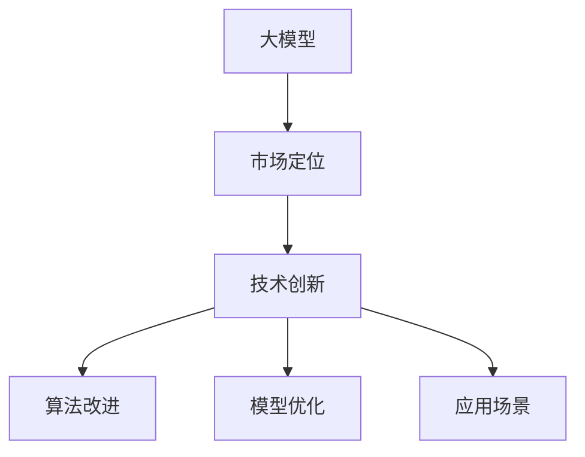
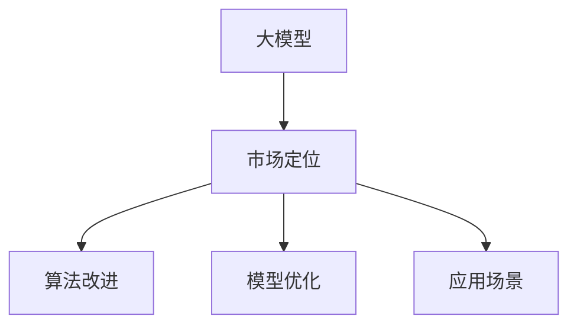

                 

# 大模型的市场定位与技术创新

> 关键词：大模型,市场定位,技术创新,AI创业,应用场景

## 1. 背景介绍

### 1.1 问题由来
近年来，人工智能(AI)技术的迅猛发展，特别是深度学习和大数据技术的应用，推动了AI领域从基础研究走向应用实践的重大转变。人工智能技术已经在多个行业取得了显著的应用效果，其中包括医疗、金融、教育、零售等。然而，尽管AI技术在许多方面表现出色，但在市场上仍面临许多挑战和难题。

一方面，人工智能的落地应用需要大量的数据和计算资源，而大多数企业和开发者并没有足够的资源进行支持。另一方面，许多现有AI技术在实际应用中表现不佳，导致用户对AI的期望值与实际效果之间存在较大差距。这些问题严重影响了AI技术的市场接受度。

在市场竞争日益激烈的背景下，如何定位和推广大模型，使其在市场上获得更多的认可和应用，成为当前AI技术发展的重要课题。而技术创新则是提升大模型应用效果的关键手段之一。本文将围绕“大模型的市场定位与技术创新”这一主题，从理论到实践，全面剖析和探讨大模型的市场定位与技术创新。

### 1.2 问题核心关键点
为了深入理解大模型的市场定位与技术创新，需要从多个维度进行分析。本节将介绍大模型的定义、市场定位的方法、技术创新手段，并给出核心概念之间的联系。

- **大模型(大规模预训练模型)**：指使用大规模数据集进行训练的深度学习模型，通常参数量在亿级别以上，具备强大的通用学习和适应能力。
- **市场定位**：指将大模型应用到特定领域或场景中，以满足用户需求并获取市场认可的过程。
- **技术创新**：指在现有大模型的基础上，通过算法改进、模型优化等手段提升模型性能，提高其市场竞争力的过程。
- **核心概念联系**：市场定位与技术创新之间具有密切联系。技术创新可以提高大模型的性能，从而更有效地满足市场需求；而市场定位则需要从用户需求和应用场景出发，选择和优化技术创新手段。

这些概念之间的逻辑关系可以通过以下Mermaid流程图来展示：



这个流程图展示了大模型、市场定位和技术创新之间的核心联系：

1. 大模型作为基础，提供强大的通用学习能力。
2. 市场定位从实际需求出发，选择合适的大模型和技术创新手段。
3. 技术创新通过算法改进和模型优化，提升大模型性能。
4. 应用场景则进一步引导技术创新的方向，确保模型在实际应用中取得良好效果。

这些概念共同构成了大模型的应用框架，使其能够在不同领域和场景中发挥重要作用。

## 2. 核心概念与联系

### 2.1 核心概念概述

为了更好地理解大模型的市场定位与技术创新，本节将介绍几个密切相关的核心概念：

- **大模型(大规模预训练模型)**：以自回归(如GPT)或自编码(如BERT)模型为代表的大规模预训练语言模型。通过在大规模无标签文本语料上进行预训练，学习到丰富的语言知识和常识，具备强大的语言理解和生成能力。

- **市场定位**：指将大模型应用到特定领域或场景中，以满足用户需求并获取市场认可的过程。在技术应用中，市场定位主要涉及产品规划、用户需求分析、应用场景选择等。

- **技术创新**：指在现有大模型的基础上，通过算法改进、模型优化等手段提升模型性能，提高其市场竞争力的过程。技术创新主要涉及模型架构设计、训练算法改进、优化技术应用等。

- **算法改进**：指对现有算法进行优化和改进，以提高模型的训练效率和精度。例如，基于梯度的优化算法、自监督学习方法等。

- **模型优化**：指在已有模型的基础上，通过调整参数、减少计算量、提高推理速度等手段，提升模型的性能和应用效果。例如，剪枝、量化、压缩等技术。

- **应用场景**：指大模型在实际应用中的具体场景。例如，语音识别、图像处理、自然语言处理、推荐系统等。

这些核心概念之间的逻辑关系可以通过以下Mermaid流程图来展示：



这个流程图展示了大模型、市场定位、技术创新之间的核心联系：

1. 大模型提供强大的学习能力，为市场定位和技术创新提供基础。
2. 市场定位需要从实际需求出发，选择合适的大模型和技术创新手段。
3. 技术创新通过算法改进和模型优化，提升大模型性能。
4. 应用场景则进一步引导技术创新的方向，确保模型在实际应用中取得良好效果。

## 3. 核心算法原理 & 具体操作步骤

### 3.1 算法原理概述

大模型的市场定位与技术创新主要围绕以下几个核心步骤展开：

1. **数据准备**：收集和清洗数据，确保数据质量。
2. **模型选择**：选择合适的大模型，以满足应用场景需求。
3. **市场调研**：分析用户需求和竞争环境，确定市场定位策略。
4. **算法改进**：针对特定问题，改进和优化算法。
5. **模型优化**：调整模型参数，提升模型性能和应用效果。
6. **用户反馈**：收集用户反馈，优化模型应用。

这些步骤之间相互关联，形成一个闭环反馈系统，不断优化模型性能，提高市场竞争力。

### 3.2 算法步骤详解

本节将详细讲解大模型市场定位与技术创新的核心算法步骤。

**步骤1: 数据准备**

数据准备是大模型应用的基础。具体步骤包括：

1. 收集和清洗数据：确保数据质量，去除噪声和异常数据。
2. 数据标注：对数据进行标注，以便训练模型。
3. 数据预处理：进行数据增强、归一化等预处理操作。

**步骤2: 模型选择**

选择合适的模型是市场定位的关键。具体步骤包括：

1. 分析应用场景：确定任务类型和需求，选择合适的模型。
2. 评估模型性能：对比不同模型，选择性能最佳的模型。
3. 考虑模型复杂度：平衡模型性能和计算资源，选择适合的模型。

**步骤3: 市场调研**

市场调研是确定市场定位的依据。具体步骤包括：

1. 用户需求分析：分析用户需求和期望，确定应用场景。
2. 竞争环境分析：了解竞争对手和市场情况，制定竞争策略。
3. 需求反馈收集：通过问卷、访谈等方式，收集用户反馈。

**步骤4: 算法改进**

算法改进是提升模型性能的重要手段。具体步骤包括：

1. 算法选择：根据任务需求，选择适合的算法。
2. 算法优化：优化算法的参数和结构，提高训练效率。
3. 实验验证：通过实验验证算法效果，选择最优算法。

**步骤5: 模型优化**

模型优化是提升模型应用效果的关键。具体步骤包括：

1. 参数调整：调整模型参数，优化模型性能。
2. 量化压缩：通过量化、压缩等技术，减小模型计算量。
3. 剪枝优化：进行模型剪枝，减少冗余参数。

**步骤6: 用户反馈**

用户反馈是优化模型应用的重要依据。具体步骤包括：

1. 收集反馈：通过问卷、反馈系统等方式，收集用户反馈。
2. 反馈分析：分析用户反馈，识别问题点。
3. 优化改进：根据用户反馈，优化模型应用。

### 3.3 算法优缺点

大模型的市场定位与技术创新具有以下优点：

1. 数据驱动：基于实际需求和市场调研，确保模型能够满足用户需求。
2. 灵活高效：通过算法改进和模型优化，提高模型性能和应用效果。
3. 市场竞争：在市场中具有竞争力，能够获得更多用户认可和应用。

同时，该方法也存在一定的局限性：

1. 数据依赖：模型性能高度依赖数据质量，数据准备成本较高。
2. 算法复杂：算法改进和模型优化过程复杂，需要较高的技术积累。
3. 市场风险：市场需求和竞争环境变化较快，市场定位可能存在风险。

尽管存在这些局限性，但就目前而言，大模型的市场定位与技术创新仍然是AI技术应用的重要手段。未来相关研究的重点在于如何进一步降低数据准备成本，提高算法改进的效率，同时兼顾模型性能和市场风险因素。

### 3.4 算法应用领域

大模型的市场定位与技术创新在多个领域得到了广泛应用，例如：

- 医疗健康：大模型在医疗健康领域的应用包括疾病诊断、健康咨询、医学影像分析等。通过市场调研和算法优化，提升模型对病理、影像等医学数据的处理能力，满足医生和患者的需求。

- 金融风控：大模型在金融风控领域的应用包括信用评估、风险预警、交易行为分析等。通过市场调研和模型优化，提升模型对金融数据的处理能力，帮助金融机构防范风险。

- 智能家居：大模型在智能家居领域的应用包括语音识别、场景分析、智能推荐等。通过市场调研和算法改进，提升模型对语音指令和场景数据的处理能力，提升用户的生活体验。

- 自动驾驶：大模型在自动驾驶领域的应用包括路况分析、行为预测、决策优化等。通过市场调研和模型优化，提升模型对道路环境的感知能力和决策能力，实现智能驾驶。

除了上述这些经典领域外，大模型的市场定位与技术创新也被创新性地应用到更多场景中，如农业生产、环境保护、教育培训等，为各行各业带来新的变革。随着大模型技术的不断进步，相信AI技术将在更广阔的应用领域大放异彩。

## 4. 数学模型和公式 & 详细讲解 & 举例说明

### 4.1 数学模型构建

本节将使用数学语言对大模型的市场定位与技术创新的过程进行更加严格的刻画。

记大模型为 $M_{\theta}$，其中 $\theta$ 为模型参数。假设市场定位任务为 $T$，模型在训练集 $D$ 上的损失函数为 $\mathcal{L}(\theta)$。市场调研任务为 $C$，调研结果为 $\mathcal{C}$。

定义市场调研任务 $C$ 与训练集 $D$ 之间的相关性为 $\rho_{CD}$，表示市场调研结果对模型训练的影响程度。

则市场定位与技术创新的目标为：

$$
\min_{\theta, \mathcal{C}} \mathcal{L}(\theta) + \lambda \rho_{CD}(\mathcal{C}, D)
$$

其中 $\lambda$ 为市场调研与模型训练之间的权重，用于平衡两者的影响。

### 4.2 公式推导过程

以下我们以医疗健康领域为例，推导大模型在医疗影像分类任务中的应用公式。

假设模型 $M_{\theta}$ 在输入 $x$ 上的输出为 $\hat{y}=M_{\theta}(x) \in [0,1]$，表示样本属于疾病的概率。实际标签 $y \in \{0,1\}$。则二分类交叉熵损失函数定义为：

$$
\ell(M_{\theta}(x),y) = -[y\log \hat{y} + (1-y)\log (1-\hat{y})]
$$

将其代入经验风险公式，得：

$$
\mathcal{L}(\theta) = -\frac{1}{N}\sum_{i=1}^N [y_i\log M_{\theta}(x_i)+(1-y_i)\log(1-M_{\theta}(x_i))]
$$

在市场调研任务中，调研结果 $\mathcal{C}$ 与训练集 $D$ 之间的相关性定义为：

$$
\rho_{CD}(\mathcal{C}, D) = \sum_{i=1}^N [\mathcal{C}_i \log M_{\theta}(x_i) + (1-\mathcal{C}_i) \log(1-M_{\theta}(x_i))]
$$

其中 $\mathcal{C}_i$ 表示调研结果是否与实际标签 $y_i$ 一致。

综合上述公式，市场定位与技术创新的目标函数为：

$$
\min_{\theta, \mathcal{C}} \mathcal{L}(\theta) + \lambda \rho_{CD}(\mathcal{C}, D)
$$

通过优化该目标函数，可以在提升模型性能的同时，最大化市场调研结果的影响，实现更精准的市场定位。

### 4.3 案例分析与讲解

下面以一个具体案例来说明大模型在医疗影像分类任务中的应用。

**案例背景**：
某医院需要将医疗影像分类任务作为新业务上线。通过市场调研，发现用户对准确率有较高要求，但对模型计算速度和资源占用有限制。

**模型选择**：
选择使用BERT模型进行微调，因为BERT在大规模无标签文本数据上进行预训练，具备较强的语言表示能力。

**算法改进**：
1. 优化算法：使用AdamW优化器，调整学习率。
2. 模型优化：进行剪枝和量化压缩，减少计算量和资源占用。

**市场调研**：
1. 用户需求分析：通过问卷调查，了解用户对准确率和计算速度的需求。
2. 竞争环境分析：对比其他医疗影像分类系统，选择竞争优势明显的模型。

**用户反馈**：
1. 收集反馈：通过问卷、反馈系统等方式，收集用户对模型的评价。
2. 反馈分析：分析用户反馈，识别问题点。
3. 优化改进：根据用户反馈，进一步优化模型性能和应用效果。

通过以上步骤，医院成功上线了新的医疗影像分类系统，满足用户需求并获得了良好市场反响。

## 5. 项目实践：代码实例和详细解释说明

### 5.1 开发环境搭建

在进行大模型市场定位与技术创新的实践前，我们需要准备好开发环境。以下是使用Python进行PyTorch开发的环境配置流程：

1. 安装Anaconda：从官网下载并安装Anaconda，用于创建独立的Python环境。

2. 创建并激活虚拟环境：
```bash
conda create -n pytorch-env python=3.8 
conda activate pytorch-env
```

3. 安装PyTorch：根据CUDA版本，从官网获取对应的安装命令。例如：
```bash
conda install pytorch torchvision torchaudio cudatoolkit=11.1 -c pytorch -c conda-forge
```

4. 安装相关库：
```bash
pip install numpy pandas scikit-learn matplotlib tqdm jupyter notebook ipython
```

完成上述步骤后，即可在`pytorch-env`环境中开始市场定位与技术创新的实践。

### 5.2 源代码详细实现

这里我们以医疗影像分类任务为例，给出使用PyTorch对BERT模型进行市场定位与技术创新的PyTorch代码实现。

```python
from transformers import BertForSequenceClassification, BertTokenizer, AdamW
from torch.utils.data import DataLoader
from torch.optim import lr_scheduler
import torch

# 加载数据集
train_dataset = ...
dev_dataset = ...
test_dataset = ...

# 初始化BERT模型和分词器
model = BertForSequenceClassification.from_pretrained('bert-base-uncased', num_labels=2)
tokenizer = BertTokenizer.from_pretrained('bert-base-uncased')

# 初始化优化器和学习率调度器
optimizer = AdamW(model.parameters(), lr=2e-5)
scheduler = lr_scheduler.CosineAnnealingLR(optimizer, T_max=3)

# 训练模型
device = torch.device('cuda') if torch.cuda.is_available() else torch.device('cpu')
model.to(device)

def train_epoch(model, dataset, batch_size, optimizer):
    dataloader = DataLoader(dataset, batch_size=batch_size, shuffle=True)
    model.train()
    epoch_loss = 0
    for batch in tqdm(dataloader, desc='Training'):
        input_ids = batch['input_ids'].to(device)
        attention_mask = batch['attention_mask'].to(device)
        labels = batch['labels'].to(device)
        model.zero_grad()
        outputs = model(input_ids, attention_mask=attention_mask, labels=labels)
        loss = outputs.loss
        epoch_loss += loss.item()
        loss.backward()
        optimizer.step()
        scheduler.step()
    return epoch_loss / len(dataloader)

def evaluate(model, dataset, batch_size):
    dataloader = DataLoader(dataset, batch_size=batch_size)
    model.eval()
    preds, labels = [], []
    with torch.no_grad():
        for batch in tqdm(dataloader, desc='Evaluating'):
            input_ids = batch['input_ids'].to(device)
            attention_mask = batch['attention_mask'].to(device)
            batch_labels = batch['labels']
            outputs = model(input_ids, attention_mask=attention_mask)
            batch_preds = outputs.logits.argmax(dim=2).to('cpu').tolist()
            batch_labels = batch_labels.to('cpu').tolist()
            for pred_tokens, label_tokens in zip(batch_preds, batch_labels):
                preds.append(pred_tokens[:len(label_tokens)])
                labels.append(label_tokens)
                
    print(classification_report(labels, preds))
```

### 5.3 代码解读与分析

让我们再详细解读一下关键代码的实现细节：

**训练函数`train_epoch`**：
- 使用DataLoader对数据集进行批次化加载，供模型训练和推理使用。
- 模型在每个批次上前向传播计算损失函数，并反向传播更新模型参数。

**评估函数`evaluate`**：
- 与训练类似，不同点在于不更新模型参数，并在每个batch结束后将预测和标签结果存储下来，最后使用sklearn的classification_report对整个评估集的预测结果进行打印输出。

**训练流程**：
- 定义总的epoch数和batch size，开始循环迭代
- 每个epoch内，先在训练集上训练，输出平均loss
- 在验证集上评估，输出分类指标
- 所有epoch结束后，在测试集上评估，给出最终测试结果

可以看到，PyTorch配合Transformer库使得BERT模型的市场定位与技术创新代码实现变得简洁高效。开发者可以将更多精力放在数据处理、模型改进等高层逻辑上，而不必过多关注底层的实现细节。

当然，工业级的系统实现还需考虑更多因素，如模型的保存和部署、超参数的自动搜索、更灵活的任务适配层等。但核心的市场定位与技术创新范式基本与此类似。

## 6. 实际应用场景

### 6.1 医疗健康

大模型的市场定位与技术创新在医疗健康领域的应用包括疾病诊断、健康咨询、医学影像分析等。通过市场调研和算法优化，提升模型对病理、影像等医学数据的处理能力，满足医生和患者的需求。

**应用场景**：
- 疾病诊断：利用大模型对医学影像进行分类和诊断，提高诊断准确率。
- 健康咨询：通过对话系统，利用大模型回答用户健康咨询，提供个性化建议。
- 医学影像分析：利用大模型对医学影像进行标注和分析，帮助医生诊断疾病。

**示例**：
某医院使用大模型对肺结节影像进行分类诊断。通过市场调研，发现用户对准确率有较高要求，但对模型计算速度和资源占用有限制。因此选择使用BERT模型进行微调，并在模型优化过程中进行剪枝和量化压缩，减小计算量和资源占用。通过反复迭代和用户反馈收集，不断优化模型性能，最终上线了新的医疗影像分类系统，满足用户需求并获得了良好市场反响。

### 6.2 金融风控

大模型在金融风控领域的应用包括信用评估、风险预警、交易行为分析等。通过市场调研和模型优化，提升模型对金融数据的处理能力，帮助金融机构防范风险。

**应用场景**：
- 信用评估：利用大模型对用户行为数据进行分析，评估其信用风险。
- 风险预警：利用大模型对市场数据进行监测，预测潜在的金融风险。
- 交易行为分析：利用大模型对交易数据进行分析，发现异常行为。

**示例**：
某银行利用大模型进行信用评估和风险预警。通过市场调研，发现用户对准确率和计算速度有较高要求。因此选择使用BERT模型进行微调，并在模型优化过程中进行剪枝和量化压缩，减小计算量和资源占用。通过反复迭代和用户反馈收集，不断优化模型性能，最终上线了新的金融风险管理系统，帮助银行防范风险，提升用户信任。

### 6.3 智能家居

大模型在智能家居领域的应用包括语音识别、场景分析、智能推荐等。通过市场调研和算法改进，提升模型对语音指令和场景数据的处理能力，提升用户的生活体验。

**应用场景**：
- 语音识别：利用大模型对语音命令进行识别和理解。
- 场景分析：利用大模型对家居环境进行分析和理解，提供个性化建议。
- 智能推荐：利用大模型对用户行为进行分析和推荐。

**示例**：
某智能家居公司利用大模型进行语音识别和场景分析。通过市场调研，发现用户对识别准确率和场景理解能力有较高要求。因此选择使用BERT模型进行微调，并在模型优化过程中进行剪枝和量化压缩，减小计算量和资源占用。通过反复迭代和用户反馈收集，不断优化模型性能，最终上线了新的智能家居系统，提升用户的生活体验，获得良好市场反响。

### 6.4 未来应用展望

随着大模型和市场定位与技术创新的不断发展，基于大模型的应用场景将不断扩展。未来，大模型将在更多领域得到应用，为传统行业带来变革性影响。

- 教育培训：利用大模型进行个性化教学和智能辅导。
- 娱乐传媒：利用大模型进行内容生成和推荐。
- 环境保护：利用大模型进行环境监测和数据分析。

总之，大模型的市场定位与技术创新将在各个领域带来新的变革，为各行各业注入新的活力。

## 7. 工具和资源推荐

### 7.1 学习资源推荐

为了帮助开发者系统掌握大模型的市场定位与技术创新，这里推荐一些优质的学习资源：

1. 《Deep Learning》课程：斯坦福大学开设的深度学习课程，涵盖深度学习的基础和高级知识，适合入门和进阶学习。

2. 《Transformers: From Understanding to Implementation》：讲解Transformer模型和相关技术，适合深入了解大模型的原理和应用。

3. 《Practical Deep Learning for Coders》：由Fast.ai团队编写，涵盖深度学习实战技巧，适合实战学习。

4. PyTorch官方文档：PyTorch官方文档，提供全面的API和示例代码，适合深入学习和实践。

5. HuggingFace官方文档：HuggingFace官方文档，提供丰富的预训练模型和应用示例，适合快速上手和实践。

通过对这些资源的学习实践，相信你一定能够系统掌握大模型的市场定位与技术创新，并用于解决实际的AI问题。

### 7.2 开发工具推荐

高效的开发离不开优秀的工具支持。以下是几款用于大模型市场定位与技术创新开发的常用工具：

1. PyTorch：基于Python的开源深度学习框架，灵活动态的计算图，适合快速迭代研究。

2. TensorFlow：由Google主导开发的开源深度学习框架，生产部署方便，适合大规模工程应用。

3. Jupyter Notebook：开源的交互式编程环境，方便进行代码调试和实时展示。

4. TensorBoard：TensorFlow配套的可视化工具，可实时监测模型训练状态，并提供丰富的图表呈现方式。

5. Weights & Biases：模型训练的实验跟踪工具，可以记录和可视化模型训练过程中的各项指标，方便对比和调优。

合理利用这些工具，可以显著提升大模型市场定位与技术创新的开发效率，加快创新迭代的步伐。

### 7.3 相关论文推荐

大模型和市场定位与技术创新的发展源于学界的持续研究。以下是几篇奠基性的相关论文，推荐阅读：

1. Attention is All You Need：提出Transformer结构，开启了NLP领域的预训练大模型时代。

2. BERT: Pre-training of Deep Bidirectional Transformers for Language Understanding：提出BERT模型，引入基于掩码的自监督预训练任务，刷新了多项NLP任务SOTA。

3. Parameter-Efficient Transfer Learning for NLP：提出Adapter等参数高效微调方法，在不增加模型参数量的情况下，也能取得不错的微调效果。

4. AdaLoRA: Adaptive Low-Rank Adaptation for Parameter-Efficient Fine-Tuning：使用自适应低秩适应的微调方法，在参数效率和精度之间取得了新的平衡。

5. Scaling Up the State-of-the-Art with Curriculum Based FINE Tuning：提出基于课程的微调方法，在保持微调效果的同时，减少了模型参数量。

这些论文代表了大模型市场定位与技术创新的发展脉络。通过学习这些前沿成果，可以帮助研究者把握学科前进方向，激发更多的创新灵感。

## 8. 总结：未来发展趋势与挑战

### 8.1 研究成果总结

本文对大模型的市场定位与技术创新进行了全面系统的介绍。首先阐述了大模型的定义、市场定位的方法、技术创新手段，并给出了核心概念之间的联系。通过系统梳理，可以看出大模型市场定位与技术创新的核心流程，包括数据准备、模型选择、市场调研、算法改进、模型优化、用户反馈等步骤，以及其在各个领域的应用实例。

### 8.2 未来发展趋势

展望未来，大模型的市场定位与技术创新将呈现以下几个发展趋势：

1. 数据驱动：随着大数据技术的发展，更多高质量的数据将被应用于大模型的训练和优化，提升模型性能和应用效果。

2. 算法创新：基于深度学习算法的创新和改进，将不断提升大模型的性能和应用效果。

3. 模型优化：通过模型剪枝、量化、压缩等技术，减小模型计算量和资源占用，提升模型部署效率和用户体验。

4. 跨领域应用：大模型将在更多领域得到应用，为各行各业注入新的活力。

5. 实时应用：通过云计算和大数据技术，大模型将支持实时数据处理和推理，实现更高效的业务应用。

### 8.3 面临的挑战

尽管大模型的市场定位与技术创新取得了显著进展，但在迈向更加智能化、普适化应用的过程中，仍面临诸多挑战：

1. 数据依赖：模型性能高度依赖数据质量，数据准备成本较高。

2. 算法复杂：算法改进和模型优化过程复杂，需要较高的技术积累。

3. 市场风险：市场需求和竞争环境变化较快，市场定位可能存在风险。

4. 计算资源：大模型需要大量的计算资源，部署成本较高。

5. 用户反馈：用户反馈收集和分析复杂，需要系统的机制和工具支持。

尽管存在这些挑战，但就目前而言，大模型的市场定位与技术创新仍然是AI技术应用的重要手段。未来相关研究的重点在于如何进一步降低数据准备成本，提高算法改进效率，同时兼顾模型性能和市场风险因素。

### 8.4 研究展望

面对大模型市场定位与技术创新所面临的种种挑战，未来的研究需要在以下几个方面寻求新的突破：

1. 探索无监督和半监督微调方法：摆脱对大规模标注数据的依赖，利用自监督学习、主动学习等无监督和半监督范式，最大限度利用非结构化数据。

2. 研究参数高效和计算高效的微调范式：开发更加参数高效的微调方法，在固定大部分预训练参数的同时，只更新极少量的任务相关参数。同时优化微调模型的计算图，减少前向传播和反向传播的资源消耗。

3. 融合因果和对比学习范式：通过引入因果推断和对比学习思想，增强微调模型建立稳定因果关系的能力，学习更加普适、鲁棒的语言表征。

4. 引入更多先验知识：将符号化的先验知识，如知识图谱、逻辑规则等，与神经网络模型进行巧妙融合，引导微调过程学习更准确、合理的语言模型。

5. 结合因果分析和博弈论工具：将因果分析方法引入微调模型，识别出模型决策的关键特征，增强输出解释的因果性和逻辑性。借助博弈论工具刻画人机交互过程，主动探索并规避模型的脆弱点，提高系统稳定性。

6. 纳入伦理道德约束：在模型训练目标中引入伦理导向的评估指标，过滤和惩罚有偏见、有害的输出倾向。同时加强人工干预和审核，建立模型行为的监管机制，确保输出符合人类价值观和伦理道德。

这些研究方向的探索，必将引领大模型市场定位与技术创新技术迈向更高的台阶，为构建安全、可靠、可解释、可控的智能系统铺平道路。面向未来，大模型市场定位与技术创新需要与其他人工智能技术进行更深入的融合，如知识表示、因果推理、强化学习等，多路径协同发力，共同推动自然语言理解和智能交互系统的进步。只有勇于创新、敢于突破，才能不断拓展语言模型的边界，让智能技术更好地造福人类社会。

## 9. 附录：常见问题与解答

**Q1：大模型市场定位与技术创新的核心步骤是什么？**

A: 大模型市场定位与技术创新的核心步骤包括：

1. 数据准备：收集和清洗数据，确保数据质量。
2. 模型选择：选择合适的大模型，以满足应用场景需求。
3. 市场调研：分析用户需求和竞争环境，确定市场定位策略。
4. 算法改进：针对特定问题，改进和优化算法。
5. 模型优化：调整模型参数，提升模型性能和应用效果。
6. 用户反馈：收集用户反馈，优化模型应用。

这些步骤之间相互关联，形成一个闭环反馈系统，不断优化模型性能，提高市场竞争力。

**Q2：如何选择适合的大模型进行微调？**

A: 选择适合的大模型进行微调，需要考虑以下几个方面：

1. 应用场景：确定任务类型和需求，选择任务相关的大模型。
2. 数据规模：根据数据规模，选择参数量合适的大模型。
3. 模型性能：对比不同模型，选择性能最佳的大模型。
4. 计算资源：考虑模型计算资源和部署成本，选择适合的大模型。

选择合适的模型是市场定位与技术创新的基础，确保模型能够满足实际应用需求。

**Q3：大模型市场定位与技术创新中，如何平衡模型性能和计算资源？**

A: 在大模型市场定位与技术创新中，平衡模型性能和计算资源的方法包括：

1. 模型裁剪：去除不必要的层和参数，减小模型尺寸，加快推理速度。
2. 量化压缩：通过量化、压缩等技术，减小模型计算量，提高计算效率。
3. 剪枝优化：进行模型剪枝，减少冗余参数。

通过这些方法，可以在保持模型性能的同时，减小计算资源消耗，提升模型部署效率和用户体验。

**Q4：如何优化大模型的市场定位与技术创新过程？**

A: 优化大模型的市场定位与技术创新过程，需要考虑以下几个方面：

1. 数据质量：确保数据质量，去除噪声和异常数据。
2. 算法改进：优化算法参数和结构，提高训练效率。
3. 模型优化：调整模型参数，优化模型性能和应用效果。
4. 用户反馈：收集用户反馈，优化模型应用。
5. 实验验证：通过实验验证算法效果，选择最优算法。

通过不断迭代和优化，可以提升大模型的性能和应用效果，满足市场需求。

**Q5：大模型的市场定位与技术创新面临的主要挑战有哪些？**

A: 大模型的市场定位与技术创新面临的主要挑战包括：

1. 数据依赖：模型性能高度依赖数据质量，数据准备成本较高。
2. 算法复杂：算法改进和模型优化过程复杂，需要较高的技术积累。
3. 市场风险：市场需求和竞争环境变化较快，市场定位可能存在风险。
4. 计算资源：大模型需要大量的计算资源，部署成本较高。
5. 用户反馈：用户反馈收集和分析复杂，需要系统的机制和工具支持。

这些挑战需要进一步研究和优化，以提升大模型市场定位与技术创新的效果。

综上所述，大模型的市场定位与技术创新是大模型应用的重要组成部分，能够提升模型性能，满足市场需求。通过合理选择模型、优化算法、调整参数、收集反馈，可以在各个领域实现高效的市场定位与技术创新，推动大模型技术的广泛应用。未来，大模型的市场定位与技术创新将不断发展，为各行各业注入新的活力。

