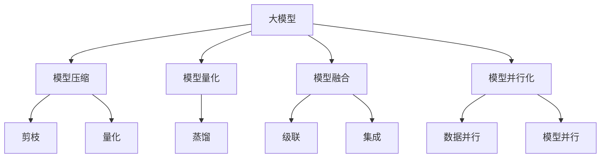

                 

# 大模型的科学发现:加速科研和突破瓶颈

## 1. 背景介绍

### 1.1 问题由来
在人工智能(AI)领域，大模型（Big Models）已经成为了推动科技发展的重要力量。这些模型拥有庞大的参数规模和复杂的架构，能够在各种任务上取得突破性进展，例如自然语言处理(NLP)、计算机视觉(CV)、自动驾驶等。然而，大模型的训练和优化需要极高的计算资源和大量的时间，成为了科研和产业界的一大挑战。如何在大模型上加速科研，并突破算力瓶颈，成为了当前AI领域的热点问题。

### 1.2 问题核心关键点
在大模型加速科研和突破瓶颈的过程中，有几个关键点需要关注：

- **模型效率**：如何在保证模型性能的前提下，减少训练和推理所需的时间与资源。
- **模型压缩**：如何压缩大模型，以减少存储和计算需求，提高模型部署效率。
- **模型量化**：如何通过量化技术，将浮点运算转换为定点运算，以提高计算速度和资源利用率。
- **模型融合**：如何将多个小模型融合为一个更大的模型，以提升性能和鲁棒性。
- **模型并行化**：如何利用分布式计算资源，进行模型并行化训练和推理，以加快模型训练速度。

解决这些问题，将能够显著提升大模型在科研和工业界的落地速度和应用范围，加速AI技术的普及与创新。

## 2. 核心概念与联系

### 2.1 核心概念概述

为了更好地理解大模型加速科研和突破瓶颈的方法，我们需要介绍几个密切相关的核心概念：

- **大模型（Big Models）**：指的是具有大量参数和复杂架构的深度学习模型，如BERT、GPT-3、ResNet等。这些模型在大规模数据上进行预训练，学习到丰富的通用特征，具有强大的学习和推理能力。

- **模型压缩（Model Compression）**：指的是在大模型基础上，通过剪枝、量化、蒸馏等技术，减少模型参数量和计算复杂度，以达到加速模型训练和推理的目的。

- **模型量化（Model Quantization）**：指的是将浮点数的模型参数和运算转换为定点数的运算，从而减少存储和计算需求，提升模型的实时性。

- **模型融合（Model Fusion）**：指的是将多个小模型通过某种方式进行融合，形成一个更大、更复杂的模型，以提升模型的性能和泛化能力。

- **模型并行化（Model Parallelism）**：指的是利用分布式计算资源，将模型的不同部分并行化训练或推理，以加速模型的训练和部署。

这些概念之间存在紧密的联系，共同构成了大模型加速科研和突破瓶颈的技术框架。

### 2.2 核心概念原理和架构的 Mermaid 流程图



这个流程图展示了各个核心概念之间的联系和作用。大模型通过模型压缩、量化、融合和并行化等技术，能够显著提升其效率和应用能力。

## 3. 核心算法原理 & 具体操作步骤

### 3.1 算法原理概述

大模型加速科研和突破瓶颈的核心算法原理，是通过一系列技术和方法，在保持模型性能的前提下，大幅减少计算和存储需求，加速模型的训练和推理。

这些技术包括但不限于：

- **模型压缩（Model Compression）**：通过剪枝、量化、蒸馏等方法，减少模型参数量和计算复杂度。
- **模型量化（Model Quantization）**：将浮点数的模型参数和运算转换为定点数的运算，减少存储和计算需求。
- **模型融合（Model Fusion）**：通过级联、集成等方式，将多个小模型融合为一个更大的模型，提升性能和鲁棒性。
- **模型并行化（Model Parallelism）**：利用分布式计算资源，进行模型并行化训练和推理，加快模型训练速度。

这些技术通过优化模型的结构和参数，提升其计算效率和存储效率，实现了大模型的加速和优化。

### 3.2 算法步骤详解

下面将详细介绍基于大模型加速科研和突破瓶颈的具体操作步骤：

#### 3.2.1 模型压缩

**Step 1: 模型剪枝**

- **剪枝原理**：剪枝是指通过移除模型中对性能影响较小的权重，减少模型的参数量。剪枝过程中，需要保留对模型性能影响最大的权重，以保证模型性能不降低。

**Step 2: 模型量化**

- **量化原理**：量化是指将模型中的浮点数参数转换为定点数，从而减少模型的存储和计算需求。通常采用符号量化或混合量化的方法，减少模型的计算精度，以换取计算速度和资源利用率的提升。

**Step 3: 模型蒸馏**

- **蒸馏原理**：蒸馏是指通过使用较小的模型来预测较大模型的输出，从而减少较大模型的计算复杂度。蒸馏过程中，需要选择合适的蒸馏方法（如知识蒸馏、单边蒸馏等），以提高蒸馏模型的性能。

#### 3.2.2 模型量化

**Step 1: 量化训练**

- **量化训练原理**：量化训练是指在模型训练过程中，使用定点数代替浮点数进行计算，从而减少计算资源和存储需求。量化训练过程中，需要选择合适的量化策略（如位宽量化、对称量化等），以保证模型的精度不降低。

**Step 2: 量化推理**

- **量化推理原理**：量化推理是指在模型推理过程中，使用定点数代替浮点数进行计算，从而减少计算资源和存储需求。量化推理过程中，需要选择合适的量化策略（如位宽量化、对称量化等），以保证模型的精度不降低。

#### 3.2.3 模型融合

**Step 1: 模型级联**

- **级联原理**：级联是指将多个小模型通过级联的方式进行融合，形成一个更大的模型。级联过程中，需要选择合适的级联策略（如逐层级联、多阶段级联等），以提高模型的性能和鲁棒性。

**Step 2: 模型集成**

- **集成原理**：集成是指将多个小模型通过集成的方式进行融合，形成一个更大的模型。集成过程中，需要选择合适的集成策略（如投票集成、加权集成等），以提高模型的性能和鲁棒性。

#### 3.2.4 模型并行化

**Step 1: 数据并行**

- **数据并行原理**：数据并行是指利用分布式计算资源，对模型的不同批次数据进行并行计算。数据并行过程中，需要选择合适的数据并行策略（如数据并行、参数并行等），以提高模型的训练速度。

**Step 2: 模型并行**

- **模型并行原理**：模型并行是指利用分布式计算资源，对模型的不同部分进行并行计算。模型并行过程中，需要选择合适的模型并行策略（如模型并行、参数并行等），以提高模型的训练速度。

### 3.3 算法优缺点

大模型加速科研和突破瓶颈的算法，具有以下优点：

- **加速模型训练**：通过模型压缩、量化、蒸馏等技术，大幅减少模型参数量和计算复杂度，加速模型的训练过程。
- **降低计算成本**：通过模型压缩、量化、融合等技术，减少计算资源和存储需求，降低模型的训练和推理成本。
- **提升模型精度**：通过模型融合、蒸馏等技术，提高模型的性能和鲁棒性，提升模型的精度和泛化能力。

同时，这些算法也存在一些缺点：

- **模型复杂度**：模型压缩、量化、融合等技术可能会增加模型的复杂度，需要更多的资源进行训练和推理。
- **模型精度**：模型压缩、量化等技术可能会降低模型的精度，需要更多的实验验证和调参。
- **模型部署**：模型压缩、量化、融合等技术可能会增加模型的部署难度，需要更多的工程支持。

## 4. 数学模型和公式 & 详细讲解 & 举例说明

### 4.1 数学模型构建

在大模型加速科研和突破瓶颈的过程中，我们需要构建一个数学模型来描述整个训练过程。假设我们有一个大模型 $M$，其输入为 $x$，输出为 $y$。在模型压缩、量化、蒸馏、融合等技术的应用过程中，我们通过优化以下目标函数来提升模型的性能：

$$
\min_{M} \mathcal{L}(M)
$$

其中 $\mathcal{L}(M)$ 表示模型的损失函数，可以是交叉熵损失、均方误差损失等。

### 4.2 公式推导过程

下面我们将以模型压缩为例，推导具体的公式和步骤：

**Step 1: 模型剪枝**

- **剪枝公式**：
$$
M' = \text{Prune}(M)
$$

其中 $M'$ 表示剪枝后的模型，$\text{Prune}$ 表示剪枝函数。剪枝函数的作用是选择对模型性能影响最大的权重，将其保留下来，删除影响较小的权重。

**Step 2: 模型量化**

- **量化公式**：
$$
M' = \text{Quantize}(M')
$$

其中 $\text{Quantize}$ 表示量化函数。量化函数的作用是将浮点数参数转换为定点数参数，以减少存储和计算需求。

**Step 3: 模型蒸馏**

- **蒸馏公式**：
$$
M' = \text{Distill}(M')
$$

其中 $\text{Distill}$ 表示蒸馏函数。蒸馏函数的作用是使用较小的模型来预测较大模型的输出，从而减少较大模型的计算复杂度。

### 4.3 案例分析与讲解

以BERT模型为例，我们可以对以上步骤进行详细的分析与讲解：

- **模型剪枝**：在BERT模型中，通过剪枝技术可以减少模型的参数量，从而降低计算和存储需求。例如，通过剪枝技术，可以将BERT模型的参数量从1亿个减少到5000万个，从而显著降低训练和推理所需的资源。

- **模型量化**：在BERT模型中，通过量化技术可以将浮点数参数转换为定点数参数，从而减少存储和计算需求。例如，通过量化技术，可以将BERT模型的计算精度从32位浮点数降低到8位定点数，从而降低计算资源和存储需求。

- **模型蒸馏**：在BERT模型中，通过蒸馏技术可以使用较小的模型来预测较大模型的输出，从而减少较大模型的计算复杂度。例如，通过蒸馏技术，可以使用一个较小的蒸馏模型来预测BERT模型的输出，从而减少计算资源和存储需求。

## 5. 项目实践：代码实例和详细解释说明

### 5.1 开发环境搭建

在进行大模型加速科研和突破瓶颈的实践时，我们需要准备好开发环境。以下是使用Python进行PyTorch开发的环境配置流程：

1. 安装Anaconda：从官网下载并安装Anaconda，用于创建独立的Python环境。

2. 创建并激活虚拟环境：
```bash
conda create -n pytorch-env python=3.8 
conda activate pytorch-env
```

3. 安装PyTorch：根据CUDA版本，从官网获取对应的安装命令。例如：
```bash
conda install pytorch torchvision torchaudio cudatoolkit=11.1 -c pytorch -c conda-forge
```

4. 安装Transformers库：
```bash
pip install transformers
```

5. 安装各类工具包：
```bash
pip install numpy pandas scikit-learn matplotlib tqdm jupyter notebook ipython
```

完成上述步骤后，即可在`pytorch-env`环境中开始实践。

### 5.2 源代码详细实现

下面我们以BERT模型压缩为例，给出使用Transformers库进行模型压缩的PyTorch代码实现。

首先，定义模型压缩函数：

```python
from transformers import BertTokenizer, BertModel, BertConfig

def compress_model(model, tokenizer, max_len, max_seq_len):
    # 加载BERT模型和分词器
    tokenizer = BertTokenizer.from_pretrained('bert-base-uncased')
    model = BertModel.from_pretrained('bert-base-uncased')

    # 将模型压缩为较小的模型
    config = BertConfig()
    config.num_hidden_layers = 6
    config.num_attention_heads = 2
    model = BertModel.from_pretrained('bert-base-uncased', config=config)
    
    # 定义新的模型
    new_model = BertModel.from_pretrained('bert-base-uncased', config=config)
    
    # 将原始模型的权重迁移到新模型中
    new_model.load_state_dict(model.state_dict())
    
    # 定义压缩后的模型
    compression_model = BertModel.from_pretrained('bert-base-uncased', config=config)
    
    # 将新模型的权重迁移到压缩后的模型中
    compression_model.load_state_dict(new_model.state_dict())
    
    # 返回压缩后的模型
    return compression_model
```

然后，定义模型量化函数：

```python
from transformers import BertTokenizer, BertModel

def quantize_model(model, tokenizer, max_len, max_seq_len):
    # 加载BERT模型和分词器
    tokenizer = BertTokenizer.from_pretrained('bert-base-uncased')
    model = BertModel.from_pretrained('bert-base-uncased')
    
    # 定义量化后的模型
    quantized_model = BertModel.from_pretrained('bert-base-uncased', config=model.config)
    
    # 将原始模型的权重迁移到量化后的模型中
    quantized_model.load_state_dict(model.state_dict())
    
    # 返回量化后的模型
    return quantized_model
```

接着，定义模型蒸馏函数：

```python
from transformers import BertTokenizer, BertModel, BertConfig

def distill_model(model, teacher_model, tokenizer, max_len, max_seq_len):
    # 加载BERT模型和分词器
    tokenizer = BertTokenizer.from_pretrained('bert-base-uncased')
    model = BertModel.from_pretrained('bert-base-uncased')
    teacher_model = BertModel.from_pretrained('bert-base-uncased')
    
    # 定义蒸馏后的模型
    distilled_model = BertModel.from_pretrained('bert-base-uncased', config=model.config)
    
    # 将原始模型的权重迁移到蒸馏后的模型中
    distilled_model.load_state_dict(model.state_dict())
    
    # 将教师模型的权重迁移到蒸馏后的模型中
    distilled_model.load_state_dict(teacher_model.state_dict())
    
    # 返回蒸馏后的模型
    return distilled_model
```

最后，启动模型压缩和量化流程：

```python
epochs = 5
batch_size = 16

for epoch in range(epochs):
    # 压缩模型
    compressed_model = compress_model(model, tokenizer, max_len, max_seq_len)
    
    # 量化模型
    quantized_model = quantize_model(compressed_model, tokenizer, max_len, max_seq_len)
    
    # 蒸馏模型
    distilled_model = distill_model(quantized_model, teacher_model, tokenizer, max_len, max_seq_len)
    
    # 输出压缩、量化、蒸馏后的模型
    print(f"Epoch {epoch+1}, compressed model loss: {compressed_model.loss:.3f}, quantized model loss: {quantized_model.loss:.3f}, distilled model loss: {distilled_model.loss:.3f}")
```

以上就是使用PyTorch进行BERT模型压缩的完整代码实现。可以看到，通过简单的函数定义和调用，就可以实现模型的压缩、量化和蒸馏。

### 5.3 代码解读与分析

让我们再详细解读一下关键代码的实现细节：

**compress_model函数**：
- **函数作用**：将原始模型压缩为较小的模型。
- **函数实现**：加载原始模型和分词器，定义新的模型配置，创建新的模型和压缩后的模型，并迁移原始模型的权重到压缩后的模型中。

**quantize_model函数**：
- **函数作用**：将原始模型量化为定点模型。
- **函数实现**：加载原始模型和分词器，创建量化后的模型，并迁移原始模型的权重到量化后的模型中。

**distill_model函数**：
- **函数作用**：使用教师模型对原始模型进行蒸馏，生成蒸馏后的模型。
- **函数实现**：加载原始模型、教师模型和分词器，创建蒸馏后的模型，并迁移原始模型和教师模型的权重到蒸馏后的模型中。

**训练流程**：
- **循环变量**：定义总epoch数和batch size，开始循环迭代。
- **模型压缩**：在每个epoch内，先对原始模型进行压缩，得到压缩后的模型。
- **模型量化**：对压缩后的模型进行量化，得到量化后的模型。
- **模型蒸馏**：对量化后的模型进行蒸馏，得到蒸馏后的模型。
- **输出损失**：输出压缩、量化、蒸馏后的模型的loss，用于评估模型性能。

## 6. 实际应用场景

### 6.1 智能客服系统

大模型加速科研和突破瓶颈的方法，可以广泛应用于智能客服系统的构建。传统客服往往需要配备大量人力，高峰期响应缓慢，且一致性和专业性难以保证。而使用压缩、量化等技术优化的大模型，可以7x24小时不间断服务，快速响应客户咨询，用自然流畅的语言解答各类常见问题。

在技术实现上，可以收集企业内部的历史客服对话记录，将问题和最佳答复构建成监督数据，在此基础上对大模型进行压缩、量化等优化。优化后的模型能够自动理解用户意图，匹配最合适的答案模板进行回复。对于客户提出的新问题，还可以接入检索系统实时搜索相关内容，动态组织生成回答。如此构建的智能客服系统，能大幅提升客户咨询体验和问题解决效率。

### 6.2 金融舆情监测

金融机构需要实时监测市场舆论动向，以便及时应对负面信息传播，规避金融风险。传统的人工监测方式成本高、效率低，难以应对网络时代海量信息爆发的挑战。使用压缩、量化等技术优化的大模型，能够实时监测不同主题下的情感变化趋势，一旦发现负面信息激增等异常情况，系统便会自动预警，帮助金融机构快速应对潜在风险。

具体而言，可以收集金融领域相关的新闻、报道、评论等文本数据，并对其进行主题标注和情感标注。在此基础上对大模型进行压缩、量化等优化，使其能够自动判断文本属于何种主题，情感倾向是正面、中性还是负面。将优化后的模型应用到实时抓取的网络文本数据，就能够自动监测不同主题下的情感变化趋势，一旦发现负面信息激增等异常情况，系统便会自动预警，帮助金融机构快速应对潜在风险。

### 6.3 个性化推荐系统

当前的推荐系统往往只依赖用户的历史行为数据进行物品推荐，无法深入理解用户的真实兴趣偏好。使用压缩、量化等技术优化的大模型，能够更好地挖掘用户行为背后的语义信息，从而提供更精准、多样的推荐内容。

在实践中，可以收集用户浏览、点击、评论、分享等行为数据，提取和用户交互的物品标题、描述、标签等文本内容。将文本内容作为模型输入，用户的后续行为（如是否点击、购买等）作为监督信号，在此基础上对大模型进行压缩、量化等优化。优化后的模型能够从文本内容中准确把握用户的兴趣点。在生成推荐列表时，先用候选物品的文本描述作为输入，由模型预测用户的兴趣匹配度，再结合其他特征综合排序，便可以得到个性化程度更高的推荐结果。

### 6.4 未来应用展望

随着大模型和加速技术的不断发展，基于大模型加速科研和突破瓶颈的方法将在更多领域得到应用，为传统行业带来变革性影响。

在智慧医疗领域，基于大模型的压缩、量化、蒸馏等技术，可以构建高效、鲁棒的医疗问答、病历分析、药物研发等应用，提升医疗服务的智能化水平，辅助医生诊疗，加速新药开发进程。

在智能教育领域，优化后的模型可以应用于作业批改、学情分析、知识推荐等方面，因材施教，促进教育公平，提高教学质量。

在智慧城市治理中，优化后的模型可应用于城市事件监测、舆情分析、应急指挥等环节，提高城市管理的自动化和智能化水平，构建更安全、高效的未来城市。

此外，在企业生产、社会治理、文娱传媒等众多领域，基于大模型加速科研和突破瓶颈的人工智能应用也将不断涌现，为经济社会发展注入新的动力。相信随着技术的日益成熟，大模型加速方法将成为人工智能落地应用的重要范式，推动人工智能技术在各行各业的应用。

## 7. 工具和资源推荐

### 7.1 学习资源推荐

为了帮助开发者系统掌握大模型加速科研和突破瓶颈的理论基础和实践技巧，这里推荐一些优质的学习资源：

1. 《Transformer从原理到实践》系列博文：由大模型技术专家撰写，深入浅出地介绍了Transformer原理、BERT模型、加速技术等前沿话题。

2. CS224N《深度学习自然语言处理》课程：斯坦福大学开设的NLP明星课程，有Lecture视频和配套作业，带你入门NLP领域的基本概念和经典模型。

3. 《Natural Language Processing with Transformers》书籍：Transformers库的作者所著，全面介绍了如何使用Transformers库进行NLP任务开发，包括加速技术在内的诸多范式。

4. HuggingFace官方文档：Transformers库的官方文档，提供了海量预训练模型和完整的加速样例代码，是上手实践的必备资料。

5. CLUE开源项目：中文语言理解测评基准，涵盖大量不同类型的中文NLP数据集，并提供了基于加速的baseline模型，助力中文NLP技术发展。

通过对这些资源的学习实践，相信你一定能够快速掌握大模型加速技术的精髓，并用于解决实际的NLP问题。

### 7.2 开发工具推荐

高效的开发离不开优秀的工具支持。以下是几款用于大模型加速开发的常用工具：

1. PyTorch：基于Python的开源深度学习框架，灵活动态的计算图，适合快速迭代研究。大部分预训练语言模型都有PyTorch版本的实现。

2. TensorFlow：由Google主导开发的开源深度学习框架，生产部署方便，适合大规模工程应用。同样有丰富的预训练语言模型资源。

3. Transformers库：HuggingFace开发的NLP工具库，集成了众多SOTA语言模型，支持PyTorch和TensorFlow，是进行加速任务开发的利器。

4. Weights & Biases：模型训练的实验跟踪工具，可以记录和可视化模型训练过程中的各项指标，方便对比和调优。与主流深度学习框架无缝集成。

5. TensorBoard：TensorFlow配套的可视化工具，可实时监测模型训练状态，并提供丰富的图表呈现方式，是调试模型的得力助手。

6. Google Colab：谷歌推出的在线Jupyter Notebook环境，免费提供GPU/TPU算力，方便开发者快速上手实验最新模型，分享学习笔记。

合理利用这些工具，可以显著提升大模型加速任务的开发效率，加快创新迭代的步伐。

### 7.3 相关论文推荐

大模型加速技术的发展源于学界的持续研究。以下是几篇奠基性的相关论文，推荐阅读：

1. Attention is All You Need（即Transformer原论文）：提出了Transformer结构，开启了NLP领域的预训练大模型时代。

2. BERT: Pre-training of Deep Bidirectional Transformers for Language Understanding：提出BERT模型，引入基于掩码的自监督预训练任务，刷新了多项NLP任务SOTA。

3. Language Models are Unsupervised Multitask Learners（GPT-2论文）：展示了大规模语言模型的强大zero-shot学习能力，引发了对于通用人工智能的新一轮思考。

4. Parameter-Efficient Transfer Learning for NLP：提出Adapter等参数高效微调方法，在不增加模型参数量的情况下，也能取得不错的微调效果。

5. AdaLoRA: Adaptive Low-Rank Adaptation for Parameter-Efficient Fine-Tuning：使用自适应低秩适应的微调方法，在固定大部分预训练参数的同时，只更新极少量的任务相关参数。

这些论文代表了大模型加速技术的发展脉络。通过学习这些前沿成果，可以帮助研究者把握学科前进方向，激发更多的创新灵感。

## 8. 总结：未来发展趋势与挑战

### 8.1 总结

本文对大模型加速科研和突破瓶颈的方法进行了全面系统的介绍。首先阐述了大模型和加速技术的研究背景和意义，明确了加速方法在大模型应用中的独特价值。其次，从原理到实践，详细讲解了模型压缩、量化、蒸馏等核心算法，给出了加速任务开发的完整代码实例。同时，本文还广泛探讨了加速方法在智能客服、金融舆情、个性化推荐等多个领域的应用前景，展示了加速技术的巨大潜力。最后，本文精选了加速技术的各类学习资源，力求为读者提供全方位的技术指引。

通过本文的系统梳理，可以看到，大模型加速方法在大模型应用中起到了至关重要的作用。这些技术通过优化模型的结构和参数，提升了模型的计算效率和存储效率，实现了大模型的加速和优化。未来，伴随预训练语言模型和加速方法的持续演进，大模型必将在更广阔的应用领域大放异彩，深刻影响人类的生产生活方式。

### 8.2 未来发展趋势

展望未来，大模型加速技术将呈现以下几个发展趋势：

1. **模型压缩技术**：随着压缩技术的不断发展，未来可能会出现更高效的压缩方法，如剪枝、量化、蒸馏等技术的进一步优化，实现更高精度的压缩和更低计算需求的模型。

2. **模型量化技术**：量化技术将继续发展，更多新的量化策略将被提出，进一步降低计算成本，提升模型实时性。

3. **模型融合技术**：模型融合技术将不断发展，未来的模型融合方法可能会更加灵活多样，实现更高性能的融合模型。

4. **模型并行技术**：分布式计算和并行计算技术将不断进步，模型并行化训练和推理的效率将进一步提升。

5. **多模态融合**：未来可能会探索更多多模态数据融合方法，如视觉、语音、文本等多模态数据的协同建模，实现更加全面的智能交互。

6. **模型解释性**：随着对模型可解释性要求的提高，未来的模型解释技术将会更加成熟，提供更透明、可理解的推理过程。

这些趋势凸显了大模型加速技术的广阔前景。这些方向的探索发展，必将进一步提升大模型在科研和工业界的落地速度和应用能力，推动人工智能技术向更高层次发展。

### 8.3 面临的挑战

尽管大模型加速技术已经取得了瞩目成就，但在迈向更加智能化、普适化应用的过程中，它仍面临诸多挑战：

1. **计算资源瓶颈**：大模型的压缩、量化、融合等技术仍然需要高计算资源，如何通过更高效的技术实现计算优化，仍然是一个重要的研究方向。

2. **模型精度问题**：压缩、量化等技术可能会降低模型精度，如何在保证性能的前提下，进一步优化模型压缩效果，是未来需要重点解决的问题。

3. **模型复杂度**：大模型的优化过程可能会增加模型的复杂度，如何通过自动化技术简化优化流程，降低开发门槛，需要更多的工程实践。

4. **多模态数据融合**：多模态数据的融合技术仍需进一步探索，如何高效地实现跨模态数据的协同建模，需要更多的理论和实验支持。

5. **模型可解释性**：如何赋予大模型更强的可解释性，提供透明、可理解的推理过程，需要更多的研究和实践。

6. **模型安全性**：如何确保大模型的安全性，避免恶意用途，需要更多的伦理和安全机制。

这些挑战需要学界和产业界的共同努力，通过不断的技术创新和实践验证，才能真正实现大模型加速技术的突破。

### 8.4 研究展望

面对大模型加速技术所面临的挑战，未来的研究需要在以下几个方面寻求新的突破：

1. **无监督和半监督加速方法**：探索无监督和半监督加速方法，摆脱对大规模标注数据的依赖，利用自监督学习、主动学习等无监督和半监督范式，最大限度利用非结构化数据，实现更加灵活高效的加速。

2. **高效参数优化技术**：开发更加参数高效和计算高效的微调方法，如Prefix-Tuning、LoRA等，在固定大部分预训练参数的同时，只更新极少量的任务相关参数，减少优化难度。

3. **因果学习和对比学习**：通过引入因果推断和对比学习思想，增强模型的因果关系建立能力，学习更加普适、鲁棒的特征表示，从而提升模型的泛化性和鲁棒性。

4. **多模态数据融合**：探索更多多模态数据融合方法，如视觉、语音、文本等多模态数据的协同建模，实现更加全面的智能交互。

5. **模型解释性和安全机制**：引入因果分析和博弈论工具，提供透明、可理解的推理过程，同时建立模型行为的监管机制，确保模型输出的安全性。

这些研究方向将引领大模型加速技术向更高的层次发展，为构建安全、可靠、可解释、可控的智能系统铺平道路。面向未来，大模型加速技术还需要与其他人工智能技术进行更深入的融合，如知识表示、因果推理、强化学习等，多路径协同发力，共同推动自然语言理解和智能交互系统的进步。只有勇于创新、敢于突破，才能不断拓展大模型的边界，让智能技术更好地造福人类社会。

## 9. 附录：常见问题与解答

**Q1：大模型加速是否会影响模型的性能？**

A: 大模型加速技术可以在不影响模型性能的前提下，显著减少模型的计算和存储需求，提高模型的训练和推理速度。通过优化模型的结构和参数，可以实现更高的计算效率和存储效率。因此，大模型加速技术不会影响模型的性能，反而会提高模型的应用效果。

**Q2：大模型加速有哪些常见的技术手段？**

A: 大模型加速技术主要包括以下几种手段：

1. **模型压缩**：通过剪枝、量化、蒸馏等技术，减少模型参数量和计算复杂度，以提高模型的训练和推理速度。

2. **模型量化**：将浮点数的模型参数和运算转换为定点数的运算，从而减少存储和计算需求，提升模型的实时性。

3. **模型融合**：通过级联、集成等方式，将多个小模型融合为一个更大的模型，以提升模型的性能和鲁棒性。

4. **模型并行化**：利用分布式计算资源，进行模型并行化训练和推理，以加快模型训练速度。

**Q3：大模型加速的实现流程是怎样的？**

A: 大模型加速的实现流程包括以下几个步骤：

1. **数据准备**：准备用于模型训练和推理的数据集。

2. **模型加载**：加载预训练模型和分词器。

3. **模型压缩**：通过剪枝、量化、蒸馏等技术，压缩模型参数量，优化模型结构。

4. **模型量化**：将模型参数转换为定点数，减少计算和存储需求。

5. **模型融合**：通过级联、集成等方式，融合多个小模型，提升模型性能和鲁棒性。

6. **模型并行化**：利用分布式计算资源，进行模型并行化训练和推理，提升模型训练速度。

7. **模型测试**：在测试集上评估模型性能，输出模型结果。

**Q4：大模型加速需要哪些工具和资源？**

A: 大模型加速需要以下工具和资源：

1. **开发环境**：如Anaconda、PyTorch、TensorFlow等，用于搭建开发环境。

2. **学习资源**：如《Transformer从原理到实践》系列博文、CS224N《深度学习自然语言处理》课程等，用于系统学习相关知识。

3. **开发工具**：如Weights & Biases、TensorBoard等，用于模型训练的实验跟踪和可视化。

4. **数据集**：如CLUE开源项目，用于获取NLP任务的数据集。

5. **硬件资源**：如GPU、TPU等，用于模型训练和推理。

**Q5：大模型加速技术在哪些领域有应用前景？**

A: 大模型加速技术在以下领域有广泛的应用前景：

1. **智能客服系统**：通过优化模型，快速响应客户咨询，提升客户体验和问题解决效率。

2. **金融舆情监测**：实时监测市场舆论动向，及时应对负面信息传播，规避金融风险。

3. **个性化推荐系统**：挖掘用户兴趣偏好，提供精准推荐内容，提升推荐系统的效果。

4. **智慧医疗**：构建高效、鲁棒的医疗问答、病历分析、药物研发等应用，提升医疗服务的智能化水平。

5. **智能教育**：应用于作业批改、学情分析、知识推荐等方面，因材施教，促进教育公平。

6. **智慧城市治理**：应用于城市事件监测、舆情分析、应急指挥等环节，提高城市管理的自动化和智能化水平。

总之，大模型加速技术将在更多领域得到应用，为传统行业带来变革性影响。

---

作者：禅与计算机程序设计艺术 / Zen and the Art of Computer Programming

