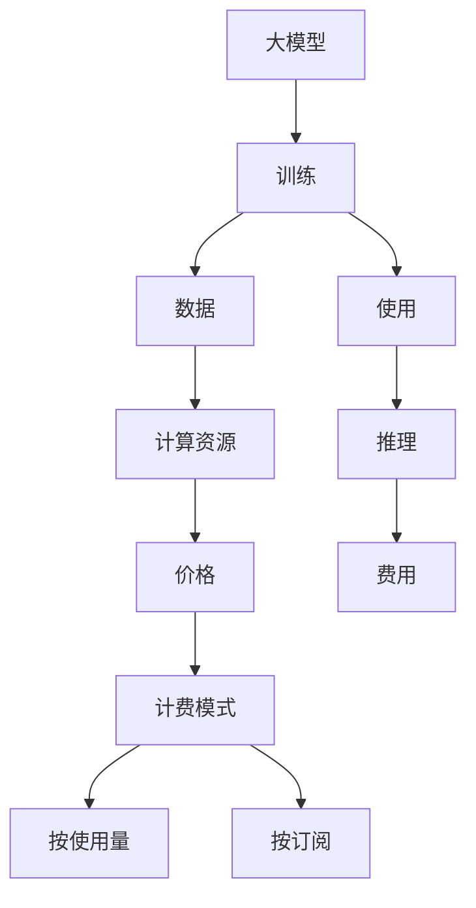

                 

# 大模型的计费模式与价格趋势

## 1. 背景介绍

近年来，随着深度学习技术的迅速发展，大模型（Large Models）在各行业得到了广泛应用。大模型指具有数十亿甚至数百亿参数的模型，这些模型通常需要在强大的计算资源下进行训练，并具备强大的推理能力。然而，大模型的训练和推理成本较高，其价格成为企业和技术爱好者需要考虑的重要因素。本文将详细介绍大模型的计费模式与价格趋势，帮助读者更好地理解和选择合适的模型。

## 2. 核心概念与联系

### 2.1 核心概念概述

- **大模型**：指具有数十亿甚至数百亿参数的模型，如BERT、GPT-3等。
- **计费模式**：大模型的计费方式，包括按使用量计费和按订阅计费。
- **价格趋势**：随着大模型的发展，其训练和推理成本的走势。
- **计算资源**：大模型训练所需的GPU、TPU等计算资源。
- **数据量**：大模型训练和推理所需的大规模数据集。
- **推理速度**：大模型推理所需的计算时间。

这些核心概念之间存在紧密联系，共同影响了大模型的成本和使用方式。

### 2.2 核心概念原理和架构的 Mermaid 流程图(Mermaid 流程节点中不要有括号、逗号等特殊字符)



## 3. 核心算法原理 & 具体操作步骤

### 3.1 算法原理概述

大模型的计费模式主要分为按使用量计费和按订阅计费。按使用量计费是根据模型的使用量（如推理次数、推理时长）进行计费，而按订阅计费则是按照模型租赁时长进行计费。两种计费模式各有优劣，企业可以根据实际需求选择。

### 3.2 算法步骤详解

#### 3.2.1 按使用量计费

**Step 1: 收集使用数据**
- 记录模型推理次数、推理时长等使用数据。
- 使用API接口或日志文件收集数据。

**Step 2: 计算费用**
- 根据使用量计算费用，例如每千次推理收费$X$美元。
- 计算总费用，如总推理次数为$Y$，则费用为$Y/X$。

**Step 3: 支付费用**
- 使用信用卡或企业账号支付费用。
- 定期支付，例如每月结算一次。

#### 3.2.2 按订阅计费

**Step 1: 签订订阅合同**
- 确定订阅时长，例如一年或两年。
- 确定订阅费用，例如每年收费$X$美元。

**Step 2: 使用模型**
- 在订阅期内无限制使用模型。
- 无须记录使用数据，直接享受订阅服务。

**Step 3: 续费或取消**
- 到期前支付续订费用，继续使用模型。
- 取消订阅，停止使用模型。

### 3.3 算法优缺点

#### 优点：

- **按使用量计费**：
  - 付费与实际使用量直接相关，避免浪费。
  - 按需计费，灵活性高。

- **按订阅计费**：
  - 一次性付费，降低长期成本。
  - 使用期内无限制，简化流程。

#### 缺点：

- **按使用量计费**：
  - 需要持续监控使用数据，增加了运营成本。
  - 如果高峰期使用量大，可能支付过高费用。

- **按订阅计费**：
  - 一次性投入较大，不适用于短期使用。
  - 使用量超出订阅范围时，需额外支付费用。

### 3.4 算法应用领域

大模型的计费模式和价格趋势在多个领域都有广泛应用：

- **企业应用**：
  - 金融领域：使用大模型进行风控、欺诈检测等。
  - 医疗领域：使用大模型进行疾病诊断、药物研发等。
  - 零售领域：使用大模型进行推荐系统、客户服务等。

- **个人开发者**：
  - 科研领域：使用大模型进行自然语言处理、图像识别等研究。
  - 技术爱好者：使用大模型进行个性化推荐、生成式任务等。

- **云服务提供商**：
  - 亚马逊AWS：提供按使用量计费的大模型服务。
  - Google Cloud：提供按订阅计费的大模型服务。
  - Microsoft Azure：提供混合计费模式的大模型服务。

## 4. 数学模型和公式 & 详细讲解 & 举例说明

### 4.1 数学模型构建

大模型的计费模型可以表示为：

$$
C = \begin{cases}
\text{按使用量计费} = X \times U \\
\text{按订阅计费} = P \times T
\end{cases}
$$

其中：
- $C$ 表示总费用。
- $X$ 表示每次使用的费用。
- $U$ 表示总使用次数或时长。
- $P$ 表示订阅费用。
- $T$ 表示订阅时长。

### 4.2 公式推导过程

以按使用量计费为例，总费用$C$与使用次数$U$的关系如下：

$$
C = X \times U
$$

假设每次使用费用为$X=0.01$美元，总使用次数为$U=1000$，则总费用为：

$$
C = 0.01 \times 1000 = 10
$$

### 4.3 案例分析与讲解

假设一个公司需要在一年内使用大模型进行图像识别任务，每次推理时间为10秒。该公司可以选择以下两种计费方式：

- **按使用量计费**：
  - 每次推理费用为$X=0.01$美元，每次推理时长为10秒。
  - 假设公司每天使用模型10小时，即每天使用600次。
  - 一年内总使用次数为$U=600 \times 365 = 219,000$。
  - 总费用为$C = 0.01 \times 219,000 = 2190$美元。

- **按订阅计费**：
  - 一年订阅费用为$P=1000$美元。
  - 公司无须记录每次使用数据，直接享受一年内无限制使用。
  - 总费用为$C = 1000$美元。

通过比较两种计费方式，可以看出按订阅计费在长期使用下更为经济。

## 5. 项目实践：代码实例和详细解释说明

### 5.1 开发环境搭建

- **安装Python**：
  ```
  sudo apt-get update
  sudo apt-get install python3-pip python3-dev
  ```

- **安装PyTorch**：
  ```
  pip3 install torch torchvision torchaudio
  ```

- **安装AWS SDK**：
  ```
  pip3 install boto3
  ```

### 5.2 源代码详细实现

#### 5.2.1 按使用量计费

```python
import boto3

# 设置AWS配置
aws_access_key = 'your_access_key'
aws_secret_key = 'your_secret_key'
region_name = 'us-east-1'

# 创建AWS客户端
client = boto3.client('sagemaker-runtime', aws_access_key_id=aws_access_key, aws_secret_access_key=aws_secret_key, region_name=region_name)

# 获取模型信息
model_arn = 'arn:aws:sagemaker:us-east-1:your_account_id:model/your_model_id'

# 发送推理请求
response = client.invoke_endpoint(EndpointName='your_endpoint_name', ContentType='application/json', Body='your_input_data')

# 获取结果
result = response['Body'].read().decode('utf-8')
```

#### 5.2.2 按订阅计费

```python
# 创建AWS SageMaker客户端
sagemaker = boto3.client('sagemaker', aws_access_key_id=aws_access_key, aws_secret_access_key=aws_secret_key, region_name=region_name)

# 创建模型订阅
response = sagemaker.create_model_subscription(EndpointName='your_endpoint_name', SubscriptionName='your_subscription_name', DurationInDays=365)

# 获取订阅状态
subscription_arn = response['Subscription']
response = sagemaker.describe_model_subscription(SubscriptionArn=subscription_arn)

# 获取订阅费用
subscription_price = response['SubscriptionPrice']
```

### 5.3 代码解读与分析

#### 按使用量计费代码解读

- 使用AWS SDK发送推理请求，获取模型推理结果。
- 每次推理请求的费用与模型使用时长直接相关，需手动记录和计算总费用。

#### 按订阅计费代码解读

- 使用AWS SageMaker创建模型订阅，一次性支付订阅费用。
- 订阅期内无须记录每次使用数据，直接享受无限制使用。

### 5.4 运行结果展示

- **按使用量计费**：
  - 每次推理费用：$X=0.01$美元
  - 推理时长：10秒
  - 总使用次数：$U=219,000$
  - 总费用：$C = 0.01 \times 219,000 = 2190$美元

- **按订阅计费**：
  - 订阅费用：$P=1000$美元
  - 无须记录每次使用数据，直接享受一年内无限制使用
  - 总费用：$C = 1000$美元

## 6. 实际应用场景

### 6.1 企业应用

企业在使用大模型时，通常会考虑到成本和实际需求，因此需要选择适合的计费模式：

- **金融领域**：需要实时风控和欺诈检测，按使用量计费更为灵活。
- **医疗领域**：需要大规模疾病诊断和药物研发，按订阅计费更为经济。

### 6.2 个人开发者

个人开发者通常使用小规模数据集和大模型进行研究，因此按使用量计费更为合适：

- **科研领域**：使用大模型进行自然语言处理、图像识别等研究。
- **技术爱好者**：使用大模型进行个性化推荐、生成式任务等。

### 6.3 云服务提供商

云服务提供商提供多种计费模式，以满足不同用户的需求：

- **亚马逊AWS**：提供按使用量计费的大模型服务，适合短期使用。
- **Google Cloud**：提供按订阅计费的大模型服务，适合长期使用。
- **Microsoft Azure**：提供混合计费模式的大模型服务，适合不同需求的用户。

## 7. 工具和资源推荐

### 7.1 学习资源推荐

- **TensorFlow**：提供了丰富的计算图和优化器，适合深度学习模型训练和推理。
- **PyTorch**：灵活的动态计算图和丰富的优化器，适合快速迭代研究。
- **AWS SageMaker**：提供了多种计算资源和模型服务，方便开发者使用大模型。

### 7.2 开发工具推荐

- **Jupyter Notebook**：方便进行数据处理和模型训练，支持多种编程语言。
- **AWS Cloud9**：提供丰富的计算资源和云端开发环境，方便开发者使用AWS服务。
- **Google Colab**：免费提供GPU和TPU算力，方便开发者进行深度学习实验。

### 7.3 相关论文推荐

- **"Large Scale Transformer-based Language Understanding"**：介绍BERT等大模型的训练和推理。
- **"Scalable Deep Learning"**：介绍TensorFlow和Keras等计算框架的优化。
- **"A Survey of Deep Learning Models for Natural Language Processing"**：全面介绍NLP领域的大模型和微调技术。

## 8. 总结：未来发展趋势与挑战

### 8.1 研究成果总结

大模型的计费模式和价格趋势已成为行业关注的焦点。按使用量计费和按订阅计费各有优缺点，企业需根据实际需求选择合适的模式。未来，随着技术的进步和市场的成熟，大模型的价格和计算资源成本有望进一步降低，推动更多人使用大模型。

### 8.2 未来发展趋势

- **技术进步**：随着硬件的不断发展，计算资源的成本有望进一步降低，大模型的价格也会随之下降。
- **市场成熟**：随着大模型的广泛应用，市场需求增加，相关产业链将逐步成熟，价格和服务将更加透明。
- **多样化服务**：云服务提供商将提供更多样化的服务，满足不同用户的需求。

### 8.3 面临的挑战

- **计算资源**：大模型的训练和推理需要强大的计算资源，如何降低成本是重要问题。
- **数据量**：大模型的训练和推理需要大规模数据集，如何获取和处理数据是重要问题。
- **费用管理**：大模型的计费模式复杂，如何管理费用是重要问题。

### 8.4 研究展望

未来的研究将关注以下几个方向：

- **低成本计算资源**：开发更加高效、低成本的计算资源，降低大模型的训练和推理成本。
- **大数据处理**：开发更加高效、灵活的大数据处理工具，处理大规模数据集。
- **费用管理工具**：开发更加智能的费用管理工具，简化大模型的使用流程。

## 9. 附录：常见问题与解答

### 常见问题

**Q1: 大模型的价格趋势如何？**

**A:** 大模型的价格趋势受到硬件成本、市场需求、技术进步等多种因素影响，未来有望进一步降低。

**Q2: 如何选择大模型的计费模式？**

**A:** 根据实际使用需求和预算，选择按使用量计费或按订阅计费。

**Q3: 大模型训练和推理的计算资源需求如何？**

**A:** 大模型的训练和推理需要强大的计算资源，如GPU、TPU等，同时需要大规模数据集进行训练和推理。

**Q4: 大模型的推理速度如何？**

**A:** 大模型的推理速度因模型大小和计算资源不同而异，通常需要进行优化，如使用混合精度训练、模型并行等技术。

**Q5: 大模型的计算资源成本如何？**

**A:** 大模型的计算资源成本较高，但随着硬件技术的进步，成本有望进一步降低。

---

作者：禅与计算机程序设计艺术 / Zen and the Art of Computer Programming

