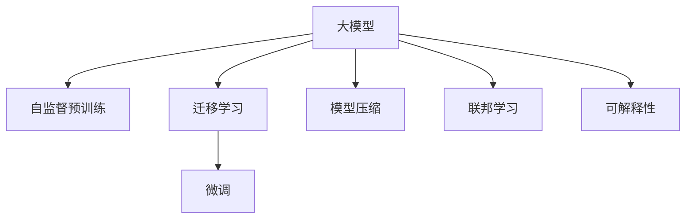
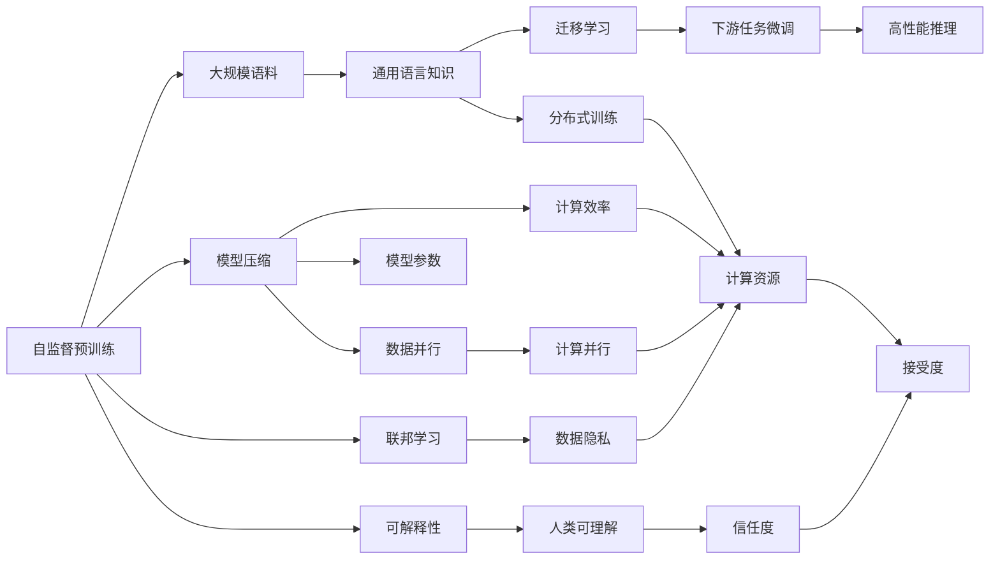

                 

# 大模型行业的未来发展趋势预测

## 1. 背景介绍

### 1.1 问题由来

随着深度学习技术的快速发展，大模型（Large Model）已经成为了人工智能领域的热点话题。大模型如BERT、GPT等在多个自然语言处理（NLP）任务中表现出了超越人类水平的性能。这些模型通常包含数十亿甚至数百亿个参数，能够在海量的文本数据上进行自监督预训练，学习到广泛的通用语言知识和模式。

然而，大模型的优势并非不可挑战。其庞大的参数量和计算成本使得其在实际应用中面临诸多限制，例如数据隐私、计算资源、部署效率等问题。此外，大模型的泛化能力、鲁棒性、可解释性等方面仍需进一步提升。因此，探索大模型未来的发展趋势，对行业内外都有着重要的意义。

### 1.2 问题核心关键点

为了预测大模型行业的未来发展趋势，需要深入分析其技术特点、应用场景、挑战与机遇。以下是大模型行业未来发展的核心关键点：

- **技术演进**：大模型的结构和训练方法是否会出现新的突破，如模型压缩、高效训练、分布式训练等。
- **应用拓展**：大模型在更多领域的应用前景如何，如医学、法律、金融等专业领域是否会出现更多的创新应用。
- **伦理考量**：大模型在训练和使用过程中，如何避免数据偏见、隐私泄露等问题，确保其公平、公正和透明性。
- **产业生态**：大模型技术如何与产业链上下游进行协同，形成更完善的生态体系。
- **标准化与标准化**：行业是否会逐渐形成统一的标准和规范，以指导大模型的开发、训练和应用。

## 2. 核心概念与联系

### 2.1 核心概念概述

为了更好地理解大模型行业的未来发展趋势，首先需了解一些核心概念及其相互联系。

#### 大模型（Large Model）
指包含数亿或数十亿参数的神经网络模型，通常用于自然语言处理、计算机视觉、语音识别等领域的任务。

#### 自监督预训练（Self-Supervised Pretraining）
指在没有标注数据的情况下，利用数据本身的结构特征进行预训练，学习到通用语言知识和模式。

#### 迁移学习（Transfer Learning）
指将在大规模数据上训练好的模型，迁移到新的任务上进行微调，以提升性能。

#### 模型压缩（Model Compression）
指通过剪枝、量化、蒸馏等技术，减少模型参数量，提高计算效率和部署速度。

#### 联邦学习（Federated Learning）
指在分散的终端设备上联合训练模型，以保护数据隐私和减少计算成本。

#### 可解释性（Explainability）
指模型输出能够被人类理解和解释，有助于提高模型的可信度和接受度。

这些核心概念通过以下Mermaid流程图展示其联系：



### 2.2 核心概念原理和架构的 Mermaid 流程图



这些概念通过自监督预训练获取通用知识，通过迁移学习和微调适配具体任务，通过模型压缩提高效率，通过联邦学习保护数据隐私，通过可解释性提升可信度。这些技术相互作用，推动大模型行业不断向前发展。

## 3. 核心算法原理 & 具体操作步骤

### 3.1 算法原理概述

大模型的未来发展趋势主要受以下几个方面的驱动：

- **计算技术进步**：如GPU、TPU等高性能计算硬件的发展，云计算和边缘计算的普及，使得大模型的训练和推理变得更加高效。
- **数据和隐私技术**：大数据存储、分布式数据处理、数据加密、差分隐私等技术的应用，使得大模型能够在保护数据隐私的同时，充分利用大规模数据进行训练。
- **算法和模型创新**：如模型压缩、蒸馏、对抗训练、自适应学习等算法创新，提高了大模型的性能和效率。
- **应用场景多样化**：随着大模型技术的不断成熟，其在更多垂直领域的应用场景将被发掘，如医疗、法律、金融等。
- **标准化和规范化**：行业标准的制定和推广，有助于统一大模型的开发、训练和应用规范，提升整体行业的成熟度。

### 3.2 算法步骤详解

#### 1. 计算资源优化
- **硬件升级**：引入GPU、TPU等高性能计算硬件，提升计算效率。
- **分布式训练**：通过多节点并行训练，加速模型训练。
- **模型压缩**：通过剪枝、量化等技术减少模型参数量。

#### 2. 数据和隐私技术
- **数据加密**：采用AES、RSA等加密算法保护数据隐私。
- **差分隐私**：通过加入噪声扰动，确保数据隐私不被泄露。
- **联邦学习**：在分布式设备上联合训练模型，避免数据集中存储和传输。

#### 3. 算法和模型创新
- **模型压缩**：通过剪枝、量化、蒸馏等技术，减少模型参数量，提高计算效率和部署速度。
- **对抗训练**：通过引入对抗样本，提高模型的鲁棒性和泛化能力。
- **自适应学习**：通过调整模型参数，适应不同的数据分布和任务需求。

#### 4. 应用场景多样化
- **医疗领域**：大模型可用于医疗影像分析、病历分析、疾病预测等，提高医疗服务的智能化水平。
- **法律领域**：大模型可用于合同审核、法律文书生成、案件判例推理等，提升法律服务的效率和准确性。
- **金融领域**：大模型可用于舆情监测、市场预测、金融风险评估等，支持金融机构的风险管理和决策支持。

#### 5. 标准化和规范化
- **行业标准**：制定统一的数据格式、模型训练标准、性能评估指标等，推动大模型行业规范化发展。
- **开源社区**：鼓励开源大模型和预训练模型的开发和共享，促进大模型技术的普及和应用。

### 3.3 算法优缺点

#### 优点
- **性能提升**：大模型在多项任务上表现出色，未来有望通过算法和模型创新进一步提升性能。
- **应用广泛**：大模型在更多领域的应用前景广阔，有望成为多个行业的重要工具。
- **计算效率提高**：通过计算资源优化和模型压缩等技术，大模型的训练和推理效率将得到显著提升。

#### 缺点
- **资源消耗大**：大模型通常需要巨大的计算资源和存储资源，限制了其广泛应用。
- **数据隐私风险**：大模型在训练和应用过程中，存在数据隐私泄露的风险。
- **模型复杂性高**：大模型的结构和训练过程复杂，需要高水平的算法和工程支持。

### 3.4 算法应用领域

大模型的应用领域十分广泛，涵盖了多个行业和任务，包括但不限于：

- **自然语言处理**：文本分类、情感分析、机器翻译、问答系统等。
- **计算机视觉**：图像分类、目标检测、图像生成等。
- **语音识别**：语音转文本、说话人识别、语音情感分析等。
- **医疗健康**：医学影像分析、病历分析、疾病预测等。
- **金融科技**：舆情监测、市场预测、金融风险评估等。

未来，随着大模型技术的不断成熟，其在更多领域的应用前景将进一步拓展，推动各行业数字化转型的进程。

## 4. 数学模型和公式 & 详细讲解 & 举例说明

### 4.1 数学模型构建

大模型的数学模型构建通常基于深度学习框架，如PyTorch、TensorFlow等。以下以PyTorch为例，介绍大模型的数学模型构建过程。

```python
import torch
import torch.nn as nn
import torch.optim as optim

# 定义模型结构
class Model(nn.Module):
    def __init__(self):
        super(Model, self).__init__()
        self.encoder = nn.Linear(256, 512)
        self.decoder = nn.Linear(512, 10)

    def forward(self, x):
        x = self.encoder(x)
        x = self.decoder(x)
        return x

# 定义损失函数
criterion = nn.CrossEntropyLoss()

# 定义优化器
optimizer = optim.SGD(model.parameters(), lr=0.01, momentum=0.9)
```

### 4.2 公式推导过程

以文本分类为例，大模型的训练过程可以表示为：

- **输入**：文本 $x$ 和标签 $y$。
- **模型**：通过多层神经网络对文本进行编码和解码，输出分类结果 $z$。
- **损失函数**：使用交叉熵损失函数衡量预测结果与真实标签的差异。
- **优化器**：使用随机梯度下降（SGD）或其他优化器更新模型参数。

数学表达式为：

$$
\min_{\theta} \frac{1}{N} \sum_{i=1}^N \ell(z_i, y_i)
$$

其中 $\theta$ 为模型参数，$N$ 为样本数量，$\ell$ 为交叉熵损失函数。

### 4.3 案例分析与讲解

以医疗影像分类为例，大模型可以通过自监督预训练学习到通用医学知识，然后通过迁移学习在特定任务上进行微调，以提升分类精度。

具体步骤包括：

1. **自监督预训练**：在大规模医学影像数据上训练大模型，学习到通用的医学特征。
2. **迁移学习**：收集特定医疗任务的标注数据，在大模型的顶层添加分类器，进行微调。
3. **微调优化**：使用SGD等优化器，对微调后的模型进行优化，最小化损失函数。
4. **性能评估**：在测试集上评估微调后模型的分类精度，对比微调前后的性能提升。

## 5. 项目实践：代码实例和详细解释说明

### 5.1 开发环境搭建

开发环境搭建主要包括以下步骤：

1. **安装PyTorch**：通过pip安装PyTorch框架。
2. **准备数据集**：收集和标注医疗影像数据集，划分为训练集、验证集和测试集。
3. **搭建模型**：定义大模型的结构，添加分类器，设置损失函数和优化器。
4. **训练模型**：使用训练集进行模型训练，周期性在验证集上评估性能。

### 5.2 源代码详细实现

以下是一个简单的医疗影像分类任务的代码实现：

```python
import torch
import torch.nn as nn
import torch.optim as optim

# 定义模型结构
class Model(nn.Module):
    def __init__(self):
        super(Model, self).__init__()
        self.encoder = nn.Linear(256, 512)
        self.decoder = nn.Linear(512, 10)

    def forward(self, x):
        x = self.encoder(x)
        x = self.decoder(x)
        return x

# 定义损失函数
criterion = nn.CrossEntropyLoss()

# 定义优化器
optimizer = optim.SGD(model.parameters(), lr=0.01, momentum=0.9)

# 加载数据集
train_dataset = ...
test_dataset = ...

# 训练模型
for epoch in range(epochs):
    for i, (inputs, labels) in enumerate(train_loader):
        optimizer.zero_grad()
        outputs = model(inputs)
        loss = criterion(outputs, labels)
        loss.backward()
        optimizer.step()
        print(f"Epoch {epoch+1}, Step {i+1}, Loss: {loss.item():.4f}")

# 评估模型
correct = 0
total = 0
with torch.no_grad():
    for inputs, labels in test_loader:
        outputs = model(inputs)
        _, predicted = torch.max(outputs.data, 1)
        total += labels.size(0)
        correct += (predicted == labels).sum().item()
print(f"Accuracy of the network on the 10000 test images: {100 * correct / total:.2f}%")
```

### 5.3 代码解读与分析

上述代码实现了一个简单的医疗影像分类模型。首先定义了模型的结构，包括编码器和解码器。然后定义了交叉熵损失函数和SGD优化器。在训练过程中，通过循环遍历训练集，使用优化器更新模型参数，最小化损失函数。最后，在测试集上评估模型的准确率。

## 6. 实际应用场景

### 6.1 医疗领域

大模型在医疗领域的应用前景广阔，涵盖医学影像分析、病历分析、疾病预测等多个方面。

#### 6.1.1 医学影像分类
- **应用**：利用大模型对医学影像进行分类，如X光片、CT、MRI等。
- **优势**：提升影像分类精度，减少医生诊断误差，加速诊断流程。
- **挑战**：影像数据量大，需要高效的计算和存储。

#### 6.1.2 病历分析
- **应用**：通过分析病历文本，提取关键信息，辅助医生诊断。
- **优势**：快速提取病历中的有用信息，提高诊断效率。
- **挑战**：病历文本复杂，需要处理噪声和歧义。

#### 6.1.3 疾病预测
- **应用**：利用历史病历数据，预测患者患病的概率。
- **优势**：提前发现潜在疾病，提供个性化医疗方案。
- **挑战**：数据隐私保护，模型泛化能力。

### 6.2 法律领域

大模型在法律领域的应用主要集中在合同审核、法律文书生成、案件判例推理等方面。

#### 6.2.1 合同审核
- **应用**：自动审核合同文本，识别风险点和法律漏洞。
- **优势**：提升合同审核效率，减少人工错误。
- **挑战**：合同文本结构复杂，需要处理多种格式。

#### 6.2.2 法律文书生成
- **应用**：根据案件信息生成法律文书，如起诉状、答辩状等。
- **优势**：提高文书生成效率，减少人工工作量。
- **挑战**：生成文本的准确性和规范性。

#### 6.2.3 案件判例推理
- **应用**：利用历史判例数据，辅助法官进行判例推理。
- **优势**：提升判例推理效率，减少法官工作负担。
- **挑战**：判例数据量大，需要高效处理和存储。

### 6.3 金融领域

大模型在金融领域的应用主要集中在舆情监测、市场预测、金融风险评估等方面。

#### 6.3.1 舆情监测
- **应用**：实时监测网络舆情，识别负面信息。
- **优势**：及时发现风险，提升风险管理能力。
- **挑战**：海量数据处理，模型实时性要求高。

#### 6.3.2 市场预测
- **应用**：利用历史数据预测市场走势，指导投资决策。
- **优势**：提升投资决策的准确性，减少投资风险。
- **挑战**：市场数据多变，模型需要动态更新。

#### 6.3.3 金融风险评估
- **应用**：利用历史数据评估金融产品的风险。
- **优势**：提升金融产品的风险控制能力。
- **挑战**：数据隐私保护，模型公平性。

### 6.4 未来应用展望

随着大模型技术的不断成熟，其在更多领域的应用前景将进一步拓展，推动各行业数字化转型的进程。

#### 6.4.1 智能制造
- **应用**：通过大模型分析生产数据，优化生产流程，提升生产效率。
- **优势**：减少生产成本，提高产品质量。
- **挑战**：生产数据量大，需要高效的计算和存储。

#### 6.4.2 智慧城市
- **应用**：通过大模型分析城市数据，提升城市管理水平。
- **优势**：提高城市管理的智能化水平，提升居民生活质量。
- **挑战**：数据多样性，模型复杂性高。

#### 6.4.3 智能农业
- **应用**：通过大模型分析农业数据，优化种植方案，提升农作物产量。
- **优势**：减少农业生产成本，提高农作物产量。
- **挑战**：农业数据复杂，需要高效的计算和存储。

## 7. 工具和资源推荐

### 7.1 学习资源推荐

为了帮助开发者系统掌握大模型技术的理论基础和实践技巧，这里推荐一些优质的学习资源：

1. **《深度学习》**：Ian Goodfellow等著，深度学习领域的经典教材，涵盖深度学习的基础理论和最新进展。
2. **CS231n《卷积神经网络》**：斯坦福大学开设的计算机视觉课程，系统讲解卷积神经网络理论及应用。
3. **CS224n《自然语言处理》**：斯坦福大学开设的NLP课程，涵盖NLP的基础理论及应用技术。
4. **《TensorFlow实战》**：Keras创始人François Chollet著，介绍TensorFlow框架的使用方法和最佳实践。
5. **HuggingFace官方文档**：介绍HuggingFace Transformers库的使用方法和最新研究成果，是学习和应用大模型的重要资源。

### 7.2 开发工具推荐

大模型技术的开发离不开高性能计算资源和工具的支持。以下是几款常用的开发工具：

1. **PyTorch**：由Facebook开源的深度学习框架，灵活易用，支持GPU加速。
2. **TensorFlow**：由Google开源的深度学习框架，支持分布式计算和部署。
3. **JAX**：由Google开发的深度学习框架，支持自动微分和高效的分布式计算。
4. **MXNet**：由Apache开源的深度学习框架，支持多种语言和平台。
5. **Horovod**：由华为开源的分布式深度学习框架，支持GPU和CPU加速。

### 7.3 相关论文推荐

大模型技术的发展离不开学界的持续研究。以下是几篇奠基性的相关论文，推荐阅读：

1. **Attention is All You Need**：Transformer的原始论文，开创了自注意力机制的先河。
2. **BERT: Pre-training of Deep Bidirectional Transformers for Language Understanding**：BERT模型的论文，提出预训练语言模型的自监督学习任务。
3. **GPT-3: Language Models are Unsupervised Multitask Learners**：GPT-3的论文，展示了大模型的zero-shot学习能力。
4. **XLNet: Generalized Autoregressive Pretraining for Language Understanding**：XLNet模型的论文，提出了一种新的预训练方法，提升了模型的泛化能力。
5. **AdaLoRA: Adaptive Low-Rank Adaptation for Parameter-Efficient Fine-Tuning**：AdaLoRA论文，提出了一种参数高效微调方法，减少了模型参数量。

## 8. 总结：未来发展趋势与挑战

### 8.1 研究成果总结

大模型技术在自然语言处理、计算机视觉、语音识别等领域取得了显著进展，推动了AI技术的发展。未来，大模型将在更多垂直领域展现其潜力，助力各行业数字化转型。

### 8.2 未来发展趋势

#### 1. 计算技术进步
- **硬件升级**：引入GPU、TPU等高性能计算硬件，提升计算效率。
- **分布式训练**：通过多节点并行训练，加速模型训练。

#### 2. 数据和隐私技术
- **数据加密**：采用AES、RSA等加密算法保护数据隐私。
- **差分隐私**：通过加入噪声扰动，确保数据隐私不被泄露。
- **联邦学习**：在分布式设备上联合训练模型，避免数据集中存储和传输。

#### 3. 算法和模型创新
- **模型压缩**：通过剪枝、量化、蒸馏等技术，减少模型参数量，提高计算效率和部署速度。
- **对抗训练**：通过引入对抗样本，提高模型的鲁棒性和泛化能力。
- **自适应学习**：通过调整模型参数，适应不同的数据分布和任务需求。

#### 4. 应用场景多样化
- **医疗领域**：大模型可用于医疗影像分析、病历分析、疾病预测等，提高医疗服务的智能化水平。
- **法律领域**：大模型可用于合同审核、法律文书生成、案件判例推理等，提升法律服务的效率和准确性。
- **金融领域**：大模型可用于舆情监测、市场预测、金融风险评估等，支持金融机构的风险管理和决策支持。

#### 5. 标准化和规范化
- **行业标准**：制定统一的数据格式、模型训练标准、性能评估指标等，推动大模型行业规范化发展。
- **开源社区**：鼓励开源大模型和预训练模型的开发和共享，促进大模型技术的普及和应用。

### 8.3 面临的挑战

#### 1. 资源消耗大
- **计算资源**：大模型通常需要巨大的计算资源和存储资源，限制了其广泛应用。
- **存储资源**：模型数据量大，需要高效的存储和读取。

#### 2. 数据隐私风险
- **数据泄露**：大模型在训练和应用过程中，存在数据隐私泄露的风险。

#### 3. 模型复杂性高
- **算法复杂**：大模型的结构和训练过程复杂，需要高水平的算法和工程支持。

#### 4. 可解释性不足
- **模型黑盒**：大模型的决策过程缺乏可解释性，难以对其推理逻辑进行分析和调试。

#### 5. 安全防护不足
- **恶意用途**：大模型容易受到恶意攻击和滥用，导致不良后果。

### 8.4 研究展望

未来，大模型技术需要在以下几个方面寻求新的突破：

#### 1. 数据隐私保护
- **差分隐私**：通过加入噪声扰动，保护数据隐私。
- **联邦学习**：在分布式设备上联合训练模型，避免数据集中存储和传输。

#### 2. 模型压缩与优化
- **模型压缩**：通过剪枝、量化、蒸馏等技术，减少模型参数量，提高计算效率和部署速度。
- **高效推理**：通过优化计算图和模型结构，提升推理速度和资源占用。

#### 3. 模型可解释性
- **解释工具**：开发解释工具，帮助理解大模型的决策过程。
- **因果推理**：引入因果推理方法，提高模型的可解释性和可控性。

#### 4. 知识融合与迁移
- **多模态融合**：将视觉、语音、文本等多种模态数据进行融合，提升模型的综合能力。
- **跨领域迁移**：通过跨领域迁移学习，提升模型的通用性和泛化能力。

## 9. 附录：常见问题与解答

### Q1: 大模型与传统模型有何区别？

A: 大模型通常包含数亿或数十亿个参数，通过在大规模数据上预训练，学习到通用的语言知识和模式。与传统模型相比，大模型在处理大规模数据和复杂任务时具有显著优势，但需要更大的计算资源和更长的训练时间。

### Q2: 大模型在训练和推理过程中有哪些瓶颈？

A: 大模型在训练和推理过程中面临的主要瓶颈包括计算资源消耗大、数据隐私保护、模型复杂度高、可解释性不足等。解决这些瓶颈需要优化计算资源、保护数据隐私、简化模型结构、开发解释工具等。

### Q3: 大模型在实际应用中如何保护数据隐私？

A: 大模型在训练和推理过程中，可以通过差分隐私、联邦学习等技术保护数据隐私。差分隐私通过加入噪声扰动，确保单个样本的数据隐私不被泄露。联邦学习通过在分布式设备上联合训练模型，避免数据集中存储和传输，保护数据隐私。

### Q4: 大模型在医疗领域的应用有哪些挑战？

A: 大模型在医疗领域的应用面临数据量大、模型复杂高、可解释性不足等挑战。为了应对这些挑战，需要优化计算资源、保护数据隐私、简化模型结构、开发解释工具等。

### Q5: 大模型在金融领域的应用有哪些潜在风险？

A: 大模型在金融领域的应用面临数据隐私保护、模型复杂度高、安全防护不足等潜在风险。为了应对这些风险，需要保护数据隐私、简化模型结构、开发解释工具等。

通过本文的详细介绍和分析，相信您已经对大模型行业的未来发展趋势有了更清晰的认识，并能够更好地应对未来面临的挑战和机遇。

