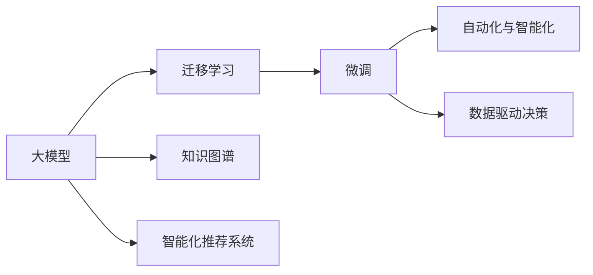

                 

# 大模型赋能传统行业数字化转型，创业者如何把握机遇？

## 1. 背景介绍

随着人工智能技术的迅猛发展，深度学习模型尤其是大模型（Large Models）在各个领域的应用日益广泛，已经深刻影响了企业的商业模式和技术创新方向。传统行业，如制造、零售、金融、医疗等，正在经历前所未有的数字化转型。创业者如何把握这一时代机遇，利用大模型赋能自身业务，是当前亟需解决的重要问题。

### 1.1 大模型在数字化转型中的作用

大模型，如BERT、GPT等，基于海量的数据进行预训练，能够抽取丰富的语言和知识表示，具备强大的自然语言处理能力。在数字化转型的背景下，大模型可以通过以下方式赋能传统行业：

1. **自动化与智能化**：利用大模型的自然语言理解能力，实现自动化文本处理、语音识别、智能客服等，提高业务效率。
2. **数据驱动决策**：基于大模型进行数据分析和预测，帮助企业做出更为精准的商业决策。
3. **知识图谱构建**：大模型可以自动构建行业知识图谱，为智能推荐、搜索等应用提供支持。
4. **个性化服务**：根据用户行为数据和偏好，利用大模型进行个性化推荐，提升用户体验。

### 1.2 数字化转型的紧迫性

在全球经济增速放缓、疫情常态化等因素的推动下，传统行业正面临着前所未有的挑战。数字化转型已经成为企业提升竞争力的关键路径。大模型的引入，可以大幅降低数字化转型的门槛，帮助企业在数据驱动的基础上，快速实现业务模式的升级和创新。

## 2. 核心概念与联系

### 2.1 核心概念概述

- **大模型**：基于大规模无标签数据预训练的深度学习模型，如BERT、GPT等，具备强大的自然语言处理能力。
- **迁移学习**：在大模型上进行微调，使其适应特定任务，是数字化转型的重要方法。
- **微调(Fine-tuning)**：在预训练模型基础上，通过少量标注数据对其进行微调，以适应特定任务的优化方法。
- **知识图谱**：将行业知识以图的形式结构化存储，为智能化决策提供支持。
- **智能化推荐系统**：利用大模型进行个性化推荐，提升用户体验。

### 2.2 核心概念原理和架构的 Mermaid 流程图



这个流程图展示了大模型在数字化转型中的应用路径，从模型预训练到微调，再到应用知识图谱和推荐系统，形成了一个完整的数字化生态系统。

## 3. 核心算法原理 & 具体操作步骤

### 3.1 算法原理概述

大模型赋能数字化转型的核心在于迁移学习和微调技术。迁移学习通过在大模型上进行微调，使模型能够适应特定任务，从而提升业务效率和决策准确性。微调技术则是利用少量标注数据，对大模型进行进一步优化，使其在特定任务上表现更好。

### 3.2 算法步骤详解

1. **数据准备**：收集并清洗相关领域的标注数据，包括文本、语音、图像等，作为微调的数据集。
2. **模型选择与预训练**：选择合适的预训练模型，如BERT、GPT等，并在大规模无标签数据上预训练。
3. **微调**：在预训练模型的基础上，利用少量标注数据进行微调，优化模型在特定任务上的表现。
4. **评估与部署**：在测试集上评估微调后的模型性能，并将模型部署到实际业务系统中。

### 3.3 算法优缺点

#### 优点

1. **效率高**：通过迁移学习，利用预训练模型减少从头训练的计算资源和时间。
2. **效果显著**：微调后的模型在特定任务上往往能够获得更好的性能。
3. **可扩展性强**：大模型可轻松适应各种业务场景，具有较高的灵活性。

#### 缺点

1. **数据依赖**：微调和迁移学习的效果高度依赖于标注数据的质量和数量，标注成本较高。
2. **模型复杂性**：大模型的参数量大，对硬件要求高。
3. **泛化能力不足**：若微调数据与预训练数据分布差异较大，模型泛化性能可能受限。

### 3.4 算法应用领域

大模型赋能数字化转型在多个领域都有广泛应用，包括但不限于：

1. **零售行业**：通过自然语言理解，实现智能客服、个性化推荐等，提升用户体验。
2. **金融行业**：利用大模型进行风险评估、欺诈检测、舆情分析等，提升金融服务质量。
3. **医疗行业**：利用大模型进行疾病诊断、临床决策支持等，提高医疗服务水平。
4. **制造行业**：通过文本分析，实现质量控制、供应链管理等，提高生产效率。
5. **教育行业**：利用大模型进行作业批改、学习推荐等，提升教育效果。

## 4. 数学模型和公式 & 详细讲解 & 举例说明

### 4.1 数学模型构建

大模型的微调过程可以表示为：

$$
M_{\theta}^{*} = M_{\theta}^{pretrain} + \Delta M_{\theta}
$$

其中，$M_{\theta}^{pretrain}$ 为预训练模型，$\Delta M_{\theta}$ 为微调过程中更新得到的参数。

### 4.2 公式推导过程

假设预训练模型为 $M_{\theta}$，微调数据集为 $D=\{(x_i, y_i)\}_{i=1}^N$，损失函数为 $\mathcal{L}(M_{\theta}, D)$，则微调的优化目标为：

$$
\theta^* = \mathop{\arg\min}_{\theta} \mathcal{L}(M_{\theta}, D)
$$

常用的优化算法包括Adam、SGD等，学习率为 $\eta$，则微调过程的梯度更新公式为：

$$
\theta \leftarrow \theta - \eta \nabla_{\theta}\mathcal{L}(M_{\theta}, D)
$$

### 4.3 案例分析与讲解

以零售行业为例，利用大模型进行个性化推荐系统构建：

1. **数据准备**：收集用户历史行为数据，如浏览、购买记录等。
2. **模型选择与预训练**：选择适当的预训练模型，如BERT，在大规模数据上进行预训练。
3. **微调**：利用用户历史行为数据进行微调，优化模型推荐效果。
4. **评估与部署**：在测试集上评估模型性能，并将模型部署到实际推荐系统中。

## 5. 项目实践：代码实例和详细解释说明

### 5.1 开发环境搭建

要使用大模型进行项目开发，需要以下开发环境：

1. **安装Python**：建议使用3.8版本及以上。
2. **安装PyTorch**：`pip install torch torchvision torchaudio`
3. **安装HuggingFace的Transformers库**：`pip install transformers`
4. **安装TensorBoard**：`pip install tensorboard`
5. **安装TensorFlow**：`pip install tensorflow`

### 5.2 源代码详细实现

以下是一个使用PyTorch和Transformers库进行微调的代码示例：

```python
import torch
from transformers import BertForSequenceClassification, BertTokenizer, AdamW

# 初始化模型和分词器
model = BertForSequenceClassification.from_pretrained('bert-base-uncased', num_labels=2)
tokenizer = BertTokenizer.from_pretrained('bert-base-uncased')

# 准备微调数据
train_data = ...
val_data = ...
test_data = ...

# 设置优化器
optimizer = AdamW(model.parameters(), lr=2e-5)

# 微调过程
def fine_tune(model, train_data, val_data, test_data, epochs=3):
    for epoch in range(epochs):
        model.train()
        loss = train_epoch(model, train_data)
        val_loss = validate(model, val_data)
        test_loss = test(model, test_data)
        print(f"Epoch {epoch+1}, train loss: {loss:.3f}, val loss: {val_loss:.3f}, test loss: {test_loss:.3f}")

# 训练函数
def train_epoch(model, train_data):
    ...
    return loss

# 验证函数
def validate(model, val_data):
    ...
    return loss

# 测试函数
def test(model, test_data):
    ...
    return loss

# 调用微调函数
fine_tune(model, train_data, val_data, test_data)
```

### 5.3 代码解读与分析

- **模型初始化**：使用`BertForSequenceClassification`和`BertTokenizer`类，加载预训练模型和分词器。
- **微调数据准备**：将数据集划分为训练集、验证集和测试集。
- **优化器设置**：使用AdamW优化器，设置学习率。
- **微调过程**：在每个epoch上，通过训练函数、验证函数和测试函数，进行模型训练、验证和测试，输出损失值。
- **调用微调函数**：在训练结束后，评估模型性能。

## 6. 实际应用场景

### 6.1 零售行业

#### 6.1.1 个性化推荐系统

零售行业利用大模型进行个性化推荐系统，可以有效提升用户体验。通过分析用户历史行为数据，利用大模型进行推荐，可以提高商品转化率和用户满意度。

#### 6.1.2 智能客服

利用大模型构建智能客服系统，能够实现24小时不间断服务，快速响应客户咨询，提高客户满意度。

### 6.2 金融行业

#### 6.2.1 欺诈检测

利用大模型进行欺诈检测，能够识别异常交易行为，有效防范金融风险。

#### 6.2.2 舆情分析

通过大模型分析金融舆情，及时监测市场动态，帮助金融机构做出决策。

### 6.3 医疗行业

#### 6.3.1 疾病诊断

利用大模型进行疾病诊断，能够提高诊断准确率，降低误诊率。

#### 6.3.2 临床决策支持

利用大模型进行临床决策支持，能够帮助医生做出更为精准的诊断和治疗决策。

### 6.4 制造行业

#### 6.4.1 质量控制

利用大模型进行文本分析，实现质量控制和供应链管理，提高生产效率。

## 7. 工具和资源推荐

### 7.1 学习资源推荐

1. **Coursera《深度学习专项课程》**：涵盖深度学习、神经网络、优化算法等基础知识，适合初学者。
2. **《TensorFlow官方文档》**：详细介绍了TensorFlow的使用方法和最佳实践，是深度学习开发者必备。
3. **《自然语言处理综论》**：全面介绍了自然语言处理的理论和技术，适合进阶学习。
4. **《Transformers》**：介绍了Transformers模型的原理和应用，是深度学习模型的经典书籍。
5. **Kaggle竞赛平台**：提供大量开源数据集和竞赛任务，是数据驱动学习和应用的最佳平台。

### 7.2 开发工具推荐

1. **PyTorch**：基于Python的开源深度学习框架，灵活高效。
2. **TensorFlow**：由Google主导的开源深度学习框架，生产部署方便。
3. **HuggingFace Transformers库**：集成了多种大模型，方便模型加载和微调。
4. **TensorBoard**：可视化工具，实时监测模型训练状态。
5. **AWS SageMaker**：亚马逊提供的云端机器学习平台，支持模型的训练、部署和监控。

### 7.3 相关论文推荐

1. **《Attention is All You Need》**：Transformer模型的原论文，开创了大模型预训练范式。
2. **《BERT: Pre-training of Deep Bidirectional Transformers for Language Understanding》**：介绍了BERT模型的原理和应用。
3. **《Parameter-Efficient Transfer Learning for NLP》**：介绍了多种参数高效的微调方法。
4. **《Fine-tuning BERT for Natural Language Processing in the Healthcare Domain》**：介绍了大模型在医疗领域的应用。

## 8. 总结：未来发展趋势与挑战

### 8.1 研究成果总结

大模型赋能传统行业的数字化转型，已经在多个领域取得了显著成果。通过迁移学习和微调技术，企业能够快速构建智能应用，提高业务效率和决策质量。

### 8.2 未来发展趋势

1. **模型规模扩大**：随着硬件能力的提升和数据规模的增加，预训练模型的参数量将继续扩大。
2. **领域特化增强**：未来大模型将更加注重领域特化，适应特定行业的业务需求。
3. **多模态融合**：大模型将融合视觉、语音等多模态信息，提升综合处理能力。
4. **自动化微调**：利用自动化工具进行微调，降低技术门槛，加速应用落地。
5. **知识图谱构建**：利用大模型构建行业知识图谱，支持智能化决策。

### 8.3 面临的挑战

1. **数据隐私保护**：在利用用户数据进行微调时，需要严格保护用户隐私。
2. **计算资源消耗**：大模型训练和推理消耗大量计算资源，需要高效的硬件支持。
3. **模型可解释性**：大模型往往是"黑盒"模型，缺乏可解释性，需要进一步提升。
4. **业务适配性**：不同行业的业务场景差异较大，需要定制化微调方案。
5. **技术门槛**：大模型和微调技术仍需进一步普及，提高开发门槛。

### 8.4 研究展望

1. **无监督和半监督学习**：探索无监督和半监督微调方法，降低对标注数据的依赖。
2. **知识图谱与深度学习结合**：将知识图谱与深度学习结合，提升模型理解和推理能力。
3. **多模态融合**：研究多模态数据融合技术，提升大模型的综合处理能力。
4. **自动化微调工具**：开发自动化微调工具，降低微调技术门槛。
5. **模型压缩与优化**：研究模型压缩与优化技术，提高模型资源利用效率。

## 9. 附录：常见问题与解答

### 9.1 Q1: 如何选择合适的预训练模型？

A: 根据任务需求选择合适的预训练模型。例如，BERT适用于文本分类和序列标注任务，GPT适用于文本生成和对话系统。

### 9.2 Q2: 大模型微调时需要注意哪些问题？

A: 大模型微调时需要注意：
1. 数据集的选择和标注质量。
2. 学习率的设置和调整。
3. 正则化和对抗训练技术的应用。
4. 模型裁剪和量化技术的应用。
5. 模型的监控和评估。

### 9.3 Q3: 大模型微调在零售行业的具体应用场景有哪些？

A: 大模型在零售行业的具体应用场景包括：
1. 个性化推荐系统：根据用户历史行为数据，推荐商品和优惠活动。
2. 智能客服：通过自然语言处理技术，提供24小时不间断的客户服务。
3. 用户情感分析：分析用户评论和反馈，优化产品和服务。

---

作者：禅与计算机程序设计艺术 / Zen and the Art of Computer Programming

