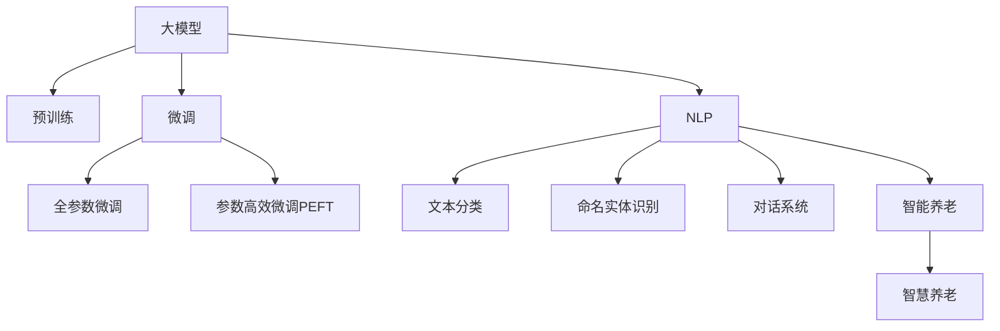

                 

# 大模型赋能智慧养老，创业者如何提升老年生活品质？

## 1. 背景介绍

### 1.1 问题由来
人口老龄化是当今世界面临的重大社会问题之一。全球范围内，65岁及以上老年人口比例持续上升，预计到2050年将翻一番，超过20%。随着生活水平提高和医疗条件改善，中国等许多国家的老年人口将进一步增加，老龄化社会初现端倪。

随着老年人群体不断壮大，他们对生活质量的追求日益高涨，智慧养老技术应运而生。智慧养老借助现代信息技术和智能化手段，为老年人提供生活照料、健康管理、医疗保障、精神陪伴等多方面服务，以提高老年人的生活质量，并缓解家庭和社会的养老压力。

在此背景下，大模型技术作为人工智能的重要分支，提供了强大的语言理解与生成能力，在智慧养老中发挥了重要作用。大模型可以用于老年人的健康监测、智能助理、情感陪伴等多个场景，极大地提升了老年人的生活质量。

### 1.2 问题核心关键点
如何利用大模型技术，为老年人提供更为智能、便捷、个性化的智慧养老服务？本文将从大模型的原理与应用实践出发，探讨大模型如何赋能智慧养老，助力创业者打造高效、智能、可扩展的智慧养老解决方案。

## 2. 核心概念与联系

### 2.1 核心概念概述

为了更好地理解大模型在智慧养老中的应用，本节将介绍几个密切相关的核心概念：

- 大模型（Large Model）：以Transformer为代表的大规模预训练语言模型，如BERT、GPT-3等。通过在大规模无标签文本数据上进行自监督学习，学习通用的语言表示，具备强大的语言理解和生成能力。

- 预训练（Pre-training）：指在大规模无标签文本数据上，通过自监督学习任务训练通用语言模型的过程。常见的预训练任务包括掩码语言模型、掩码位置模型等。

- 微调（Fine-tuning）：指在预训练模型的基础上，使用下游任务的少量标注数据，通过有监督地训练来优化模型在特定任务上的性能。通常只需要调整顶层分类器或解码器，并以较小的学习率更新全部或部分的模型参数。

- 迁移学习（Transfer Learning）：指将一个领域学习到的知识，迁移应用到另一个不同但相关的领域的学习范式。大模型的预训练-微调过程即是一种典型的迁移学习方式。

- 自然语言处理（Natural Language Processing, NLP）：研究计算机如何理解和生成人类语言的技术。大模型在NLP领域有广泛应用，包括文本分类、命名实体识别、对话系统等。

- 智能养老（Smart Aging）：利用现代信息技术，为老年人提供全方位、个性化、高质量的养老服务，涵盖生活照料、健康管理、娱乐休闲等方面，旨在提高老年人的生活质量。

- 智慧养老（Smart Aging）：在智能养老的基础上，引入人工智能技术，提供更为智能化、便捷化、个性化、精准化的养老服务。大模型在此领域的应用，可以极大提升服务的智能化水平。

这些核心概念之间的逻辑关系可以通过以下Mermaid流程图来展示：



这个流程图展示了大模型的核心概念及其之间的关系：

1. 大模型通过预训练获得基础能力。
2. 微调是对预训练模型进行任务特定的优化，可以分为全参数微调和参数高效微调（PEFT）。
3. NLP是大模型的重要应用领域，涵盖文本分类、命名实体识别、对话系统等。
4. 智能养老利用现代信息技术为老年人提供基本服务。
5. 智慧养老引入人工智能技术，提升服务的智能化水平。

这些概念共同构成了大模型在智慧养老中的应用框架，使其能够在各种场景下发挥强大的语言理解和生成能力。

## 3. 核心算法原理 & 具体操作步骤
### 3.1 算法原理概述

基于大模型的智慧养老解决方案，本质上是一种有监督的细粒度迁移学习过程。其核心思想是：将大模型视作一个强大的"特征提取器"，通过在特定任务的少量标注数据上进行有监督地微调，使得模型输出能够匹配任务标签，从而获得针对特定任务优化的模型。

形式化地，假设大模型为 $M_{\theta}$，其中 $\theta$ 为预训练得到的模型参数。给定智慧养老任务 $T$ 的标注数据集 $D=\{(x_i, y_i)\}_{i=1}^N$，微调的目标是找到新的模型参数 $\hat{\theta}$，使得：

$$
\hat{\theta}=\mathop{\arg\min}_{\theta} \mathcal{L}(M_{\theta},D)
$$

其中 $\mathcal{L}$ 为针对任务 $T$ 设计的损失函数，用于衡量模型预测输出与真实标签之间的差异。常见的损失函数包括交叉熵损失、均方误差损失等。

通过梯度下降等优化算法，微调过程不断更新模型参数 $\theta$，最小化损失函数 $\mathcal{L}$，使得模型输出逼近真实标签。由于 $\theta$ 已经通过预训练获得了较好的初始化，因此即便在规模较小的数据集 $D$ 上进行微调，也能较快收敛到理想的模型参数 $\hat{\theta}$。

### 3.2 算法步骤详解

基于大模型的智慧养老解决方案的一般流程如下：

**Step 1: 准备预训练模型和数据集**
- 选择合适的预训练语言模型 $M_{\theta}$ 作为初始化参数，如 BERT、GPT 等。
- 准备智慧养老任务 $T$ 的标注数据集 $D$，划分为训练集、验证集和测试集。一般要求标注数据与预训练数据的分布不要差异过大。

**Step 2: 添加任务适配层**
- 根据任务类型，在预训练模型顶层设计合适的输出层和损失函数。
- 对于分类任务，通常在顶层添加线性分类器和交叉熵损失函数。
- 对于生成任务，通常使用语言模型的解码器输出概率分布，并以负对数似然为损失函数。

**Step 3: 设置微调超参数**
- 选择合适的优化算法及其参数，如 AdamW、SGD 等，设置学习率、批大小、迭代轮数等。
- 设置正则化技术及强度，包括权重衰减、Dropout、Early Stopping 等。
- 确定冻结预训练参数的策略，如仅微调顶层，或全部参数都参与微调。

**Step 4: 执行梯度训练**
- 将训练集数据分批次输入模型，前向传播计算损失函数。
- 反向传播计算参数梯度，根据设定的优化算法和学习率更新模型参数。
- 周期性在验证集上评估模型性能，根据性能指标决定是否触发 Early Stopping。
- 重复上述步骤直到满足预设的迭代轮数或 Early Stopping 条件。

**Step 5: 测试和部署**
- 在测试集上评估微调后模型 $M_{\hat{\theta}}$ 的性能，对比微调前后的精度提升。
- 使用微调后的模型对新样本进行推理预测，集成到实际的应用系统中。
- 持续收集新的数据，定期重新微调模型，以适应数据分布的变化。

以上是基于大模型的智慧养老解决方案的一般流程。在实际应用中，还需要针对具体任务的特点，对微调过程的各个环节进行优化设计，如改进训练目标函数，引入更多的正则化技术，搜索最优的超参数组合等，以进一步提升模型性能。

### 3.3 算法优缺点

基于大模型的智慧养老解决方案具有以下优点：
1. 简单高效。只需准备少量标注数据，即可对预训练模型进行快速适配，获得较大的性能提升。
2. 通用适用。适用于各种智慧养老任务，包括生活照料、健康管理、娱乐休闲等，设计简单的任务适配层即可实现微调。
3. 参数高效。利用参数高效微调技术，在固定大部分预训练参数的情况下，仍可取得不错的提升。
4. 效果显著。在学术界和工业界的诸多任务上，基于微调的方法已经刷新了最先进的性能指标。

同时，该方法也存在一定的局限性：
1. 依赖标注数据。微调的效果很大程度上取决于标注数据的质量和数量，获取高质量标注数据的成本较高。
2. 迁移能力有限。当目标任务与预训练数据的分布差异较大时，微调的性能提升有限。
3. 负面效果传递。预训练模型的固有偏见、有害信息等，可能通过微调传递到下游任务，造成负面影响。
4. 可解释性不足。微调模型的决策过程通常缺乏可解释性，难以对其推理逻辑进行分析和调试。

尽管存在这些局限性，但就目前而言，基于大模型的微调方法仍是智慧养老领域的重要范式。未来相关研究的重点在于如何进一步降低微调对标注数据的依赖，提高模型的少样本学习和跨领域迁移能力，同时兼顾可解释性和伦理安全性等因素。

### 3.4 算法应用领域

基于大模型的智慧养老解决方案在多个领域得到广泛应用，涵盖生活照料、健康管理、娱乐休闲等多个方面：

- 生活照料：利用智能助理和语音交互技术，帮助老年人处理日常事务，如购物、导航、日程安排等。
- 健康管理：通过智能穿戴设备和传感器，结合健康数据分析和预测模型，实现慢性病监测、风险评估等功能。
- 娱乐休闲：借助智能推荐系统和虚拟现实技术，为老年人提供丰富多彩的娱乐活动，缓解孤独感，提升生活质量。
- 社交互动：使用聊天机器人等智能对话系统，提供情感陪伴和社交支持，满足老年人的社交需求。

除了这些经典应用外，大模型还被创新性地应用于更多场景中，如智能家居控制、认知训练、法律咨询等，为老年人提供全方位的智能化服务。

## 4. 数学模型和公式 & 详细讲解
### 4.1 数学模型构建

本节将使用数学语言对基于大模型的智慧养老解决方案进行更加严格的刻画。

记大模型为 $M_{\theta}$，其中 $\theta$ 为预训练得到的模型参数。假设智慧养老任务为 $T$，训练集为 $D=\{(x_i,y_i)\}_{i=1}^N, x_i \in \mathcal{X}, y_i \in \mathcal{Y}$。

定义模型 $M_{\theta}$ 在数据样本 $(x,y)$ 上的损失函数为 $\ell(M_{\theta}(x),y)$，则在数据集 $D$ 上的经验风险为：

$$
\mathcal{L}(\theta) = \frac{1}{N} \sum_{i=1}^N \ell(M_{\theta}(x_i),y_i)
$$

微调的优化目标是最小化经验风险，即找到最优参数：

$$
\theta^* = \mathop{\arg\min}_{\theta} \mathcal{L}(\theta)
$$

在实践中，我们通常使用基于梯度的优化算法（如SGD、Adam等）来近似求解上述最优化问题。设 $\eta$ 为学习率，$\lambda$ 为正则化系数，则参数的更新公式为：

$$
\theta \leftarrow \theta - \eta \nabla_{\theta}\mathcal{L}(\theta) - \eta\lambda\theta
$$

其中 $\nabla_{\theta}\mathcal{L}(\theta)$ 为损失函数对参数 $\theta$ 的梯度，可通过反向传播算法高效计算。

### 4.2 公式推导过程

以下我们以智慧养老中常见的智能助理任务为例，推导交叉熵损失函数及其梯度的计算公式。

假设模型 $M_{\theta}$ 在输入 $x$ 上的输出为 $\hat{y}=M_{\theta}(x) \in [0,1]$，表示模型预测的概率。真实标签 $y \in \{0,1\}$。则二分类交叉熵损失函数定义为：

$$
\ell(M_{\theta}(x),y) = -[y\log \hat{y} + (1-y)\log (1-\hat{y})]
$$

将其代入经验风险公式，得：

$$
\mathcal{L}(\theta) = -\frac{1}{N}\sum_{i=1}^N [y_i\log M_{\theta}(x_i)+(1-y_i)\log(1-M_{\theta}(x_i))]
$$

根据链式法则，损失函数对参数 $\theta_k$ 的梯度为：

$$
\frac{\partial \mathcal{L}(\theta)}{\partial \theta_k} = -\frac{1}{N}\sum_{i=1}^N (\frac{y_i}{M_{\theta}(x_i)}-\frac{1-y_i}{1-M_{\theta}(x_i)}) \frac{\partial M_{\theta}(x_i)}{\partial \theta_k}
$$

其中 $\frac{\partial M_{\theta}(x_i)}{\partial \theta_k}$ 可进一步递归展开，利用自动微分技术完成计算。

在得到损失函数的梯度后，即可带入参数更新公式，完成模型的迭代优化。重复上述过程直至收敛，最终得到适应智慧养老任务的最优模型参数 $\theta^*$。

## 5. 项目实践：代码实例和详细解释说明
### 5.1 开发环境搭建

在进行智慧养老项目实践前，我们需要准备好开发环境。以下是使用Python进行PyTorch开发的环境配置流程：

1. 安装Anaconda：从官网下载并安装Anaconda，用于创建独立的Python环境。

2. 创建并激活虚拟环境：
```bash
conda create -n pytorch-env python=3.8 
conda activate pytorch-env
```

3. 安装PyTorch：根据CUDA版本，从官网获取对应的安装命令。例如：
```bash
conda install pytorch torchvision torchaudio cudatoolkit=11.1 -c pytorch -c conda-forge
```

4. 安装Transformers库：
```bash
pip install transformers
```

5. 安装各类工具包：
```bash
pip install numpy pandas scikit-learn matplotlib tqdm jupyter notebook ipython
```

完成上述步骤后，即可在`pytorch-env`环境中开始智慧养老项目实践。

### 5.2 源代码详细实现

这里我们以智能助理任务为例，给出使用Transformers库对BERT模型进行微调的PyTorch代码实现。

首先，定义智能助理任务的数据处理函数：

```python
from transformers import BertTokenizer
from torch.utils.data import Dataset
import torch

class AssistantDataset(Dataset):
    def __init__(self, questions, answers, tokenizer, max_len=128):
        self.questions = questions
        self.answers = answers
        self.tokenizer = tokenizer
        self.max_len = max_len
        
    def __len__(self):
        return len(self.questions)
    
    def __getitem__(self, item):
        question = self.questions[item]
        answer = self.answers[item]
        
        encoding = self.tokenizer(question, return_tensors='pt', max_length=self.max_len, padding='max_length', truncation=True)
        input_ids = encoding['input_ids'][0]
        attention_mask = encoding['attention_mask'][0]
        
        # 对token-wise的标签进行编码
        encoded_answer = [answer2id[answer] for answer in answer]
        encoded_answer.extend([answer2id['<PAD>']] * (self.max_len - len(encoded_answer)))
        labels = torch.tensor(encoded_answer, dtype=torch.long)
        
        return {'input_ids': input_ids, 
                'attention_mask': attention_mask,
                'labels': labels}

# 标签与id的映射
answer2id = {'<PAD>': 0, '回答1': 1, '回答2': 2, '回答3': 3}
id2answer = {v: k for k, v in answer2id.items()}

# 创建dataset
tokenizer = BertTokenizer.from_pretrained('bert-base-cased')

train_dataset = AssistantDataset(train_questions, train_answers, tokenizer)
dev_dataset = AssistantDataset(dev_questions, dev_answers, tokenizer)
test_dataset = AssistantDataset(test_questions, test_answers, tokenizer)
```

然后，定义模型和优化器：

```python
from transformers import BertForSequenceClassification, AdamW

model = BertForSequenceClassification.from_pretrained('bert-base-cased', num_labels=len(answer2id))

optimizer = AdamW(model.parameters(), lr=2e-5)
```

接着，定义训练和评估函数：

```python
from torch.utils.data import DataLoader
from tqdm import tqdm
from sklearn.metrics import accuracy_score, precision_score, recall_score, f1_score

device = torch.device('cuda') if torch.cuda.is_available() else torch.device('cpu')
model.to(device)

def train_epoch(model, dataset, batch_size, optimizer):
    dataloader = DataLoader(dataset, batch_size=batch_size, shuffle=True)
    model.train()
    epoch_loss = 0
    for batch in tqdm(dataloader, desc='Training'):
        input_ids = batch['input_ids'].to(device)
        attention_mask = batch['attention_mask'].to(device)
        labels = batch['labels'].to(device)
        model.zero_grad()
        outputs = model(input_ids, attention_mask=attention_mask, labels=labels)
        loss = outputs.loss
        epoch_loss += loss.item()
        loss.backward()
        optimizer.step()
    return epoch_loss / len(dataloader)

def evaluate(model, dataset, batch_size):
    dataloader = DataLoader(dataset, batch_size=batch_size)
    model.eval()
    preds, labels = [], []
    with torch.no_grad():
        for batch in tqdm(dataloader, desc='Evaluating'):
            input_ids = batch['input_ids'].to(device)
            attention_mask = batch['attention_mask'].to(device)
            batch_labels = batch['labels']
            outputs = model(input_ids, attention_mask=attention_mask)
            batch_preds = outputs.logits.argmax(dim=2).to('cpu').tolist()
            batch_labels = batch_labels.to('cpu').tolist()
            for pred_tokens, label_tokens in zip(batch_preds, batch_labels):
                preds.append(pred_tokens[:len(label_tokens)])
                labels.append(label_tokens)
                
    print('Accuracy:', accuracy_score(labels, preds))
    print('Precision:', precision_score(labels, preds, average='weighted'))
    print('Recall:', recall_score(labels, preds, average='weighted'))
    print('F1 Score:', f1_score(labels, preds, average='weighted'))
```

最后，启动训练流程并在测试集上评估：

```python
epochs = 5
batch_size = 16

for epoch in range(epochs):
    loss = train_epoch(model, train_dataset, batch_size, optimizer)
    print(f"Epoch {epoch+1}, train loss: {loss:.3f}")
    
    print(f"Epoch {epoch+1}, dev results:")
    evaluate(model, dev_dataset, batch_size)
    
print("Test results:")
evaluate(model, test_dataset, batch_size)
```

以上就是使用PyTorch对BERT进行智能助理任务微调的完整代码实现。可以看到，得益于Transformers库的强大封装，我们可以用相对简洁的代码完成BERT模型的加载和微调。

### 5.3 代码解读与分析

让我们再详细解读一下关键代码的实现细节：

**AssistantDataset类**：
- `__init__`方法：初始化问题和答案、分词器等关键组件。
- `__len__`方法：返回数据集的样本数量。
- `__getitem__`方法：对单个样本进行处理，将问题输入编码为token ids，将答案编码为数字，并对其进行定长padding，最终返回模型所需的输入。

**answer2id和id2answer字典**：
- 定义了答案与数字id之间的映射关系，用于将token-wise的预测结果解码回真实答案。

**训练和评估函数**：
- 使用PyTorch的DataLoader对数据集进行批次化加载，供模型训练和推理使用。
- 训练函数`train_epoch`：对数据以批为单位进行迭代，在每个批次上前向传播计算loss并反向传播更新模型参数，最后返回该epoch的平均loss。
- 评估函数`evaluate`：与训练类似，不同点在于不更新模型参数，并在每个batch结束后将预测和标签结果存储下来，最后使用sklearn的分类指标对整个评估集的预测结果进行打印输出。

**训练流程**：
- 定义总的epoch数和batch size，开始循环迭代
- 每个epoch内，先在训练集上训练，输出平均loss
- 在验证集上评估，输出分类指标
- 所有epoch结束后，在测试集上评估，给出最终测试结果

可以看到，PyTorch配合Transformers库使得BERT微调的代码实现变得简洁高效。开发者可以将更多精力放在数据处理、模型改进等高层逻辑上，而不必过多关注底层的实现细节。

当然，工业级的系统实现还需考虑更多因素，如模型的保存和部署、超参数的自动搜索、更灵活的任务适配层等。但核心的微调范式基本与此类似。

## 6. 实际应用场景
### 6.1 智能助理系统

智能助理系统是大模型在智慧养老中最为常见的一个应用场景。老年人通常对智能化设备的使用不太熟悉，使用智能助理，可以通过语音或文本输入与系统进行互动，实现各种智能功能。

在技术实现上，可以收集老年人与智能助理的对话记录，将问题和最佳答复构建成监督数据，在此基础上对预训练大模型进行微调。微调后的模型能够自动理解用户意图，匹配最合适的答复，提升服务质量。

**具体应用：**
- 语音控制：老年人可以通过语音指令控制家中的智能设备，如电视、空调、窗帘等。
- 提醒服务：智能助理可以提醒老人服药、体检等，并提供健康咨询。
- 紧急呼叫：当老年人身体不适或遇到紧急情况，智能助理可以立即通过电话或短信联系家属或紧急救援中心。

### 6.2 健康管理平台

老年人普遍存在慢性病管理需求，传统医疗服务难以兼顾每个人的需求。基于大模型的健康管理平台，可以通过智能穿戴设备收集老年人的生理数据，结合健康数据分析和预测模型，实现慢性病监测、风险评估等功能。

在技术实现上，可以收集老年人日常的生理数据，如心率、血压、血氧饱和度等，将其转化为文本或数值形式，在此基础上对预训练大模型进行微调。微调后的模型可以自动分析数据，判断老人的健康状态，提供相应的健康建议和预警。

**具体应用：**
- 慢性病监测：通过智能手表、智能血压计等设备，实时监测老人的健康数据，及时发现异常。
- 健康建议：根据监测数据，给出科学的饮食、运动、作息建议，帮助老人保持健康。
- 预警系统：当监测数据出现异常时，智能平台可以自动报警，联系家属和医生。

### 6.3 娱乐休闲平台

老年人需要丰富多彩的娱乐活动，以缓解孤独感和生活的单调性。基于大模型的娱乐休闲平台，可以通过智能推荐系统和虚拟现实技术，为老年人提供多种娱乐活动，提升他们的生活质量。

在技术实现上，可以收集老年人对各种娱乐活动的选择偏好，将其转化为文本形式，在此基础上对预训练大模型进行微调。微调后的模型可以根据老人的喜好和历史记录，推荐相应的娱乐活动。

**具体应用：**
- 娱乐推荐：根据老人的兴趣爱好，推荐电影、电视节目、音乐等娱乐内容。
- 虚拟现实：通过虚拟现实技术，老人可以参观博物馆、旅游名胜等，享受虚拟世界的乐趣。
- 健康游戏：设计适合老年人的健康游戏，如智力游戏、记忆力训练等，帮助老人保持头脑灵活。

### 6.4 社交互动平台

社交是老年人的重要需求之一，但由于身体或经济原因，他们可能难以经常与亲友见面。基于大模型的社交互动平台，可以通过智能聊天机器人等技术，为老年人提供情感陪伴和社交支持。

在技术实现上，可以收集老人与亲友的聊天记录，将其转化为文本形式，在此基础上对预训练大模型进行微调。微调后的模型可以自动生成类似亲友的对话，提供情感支持和社交互动。

**具体应用：**
- 情感陪伴：智能机器人可以模拟亲友的声音，与老人进行对话，提供情感陪伴。
- 社交互动：智能平台可以与其他老年人和亲友进行互动，组织活动，增进交流。
- 心理支持：通过分析老人的对话，智能平台可以识别出老人的心理状态，提供心理辅导。

## 7. 工具和资源推荐
### 7.1 学习资源推荐

为了帮助开发者系统掌握大模型在智慧养老中的应用，这里推荐一些优质的学习资源：

1. 《Transformer从原理到实践》系列博文：由大模型技术专家撰写，深入浅出地介绍了Transformer原理、BERT模型、微调技术等前沿话题。

2. CS224N《深度学习自然语言处理》课程：斯坦福大学开设的NLP明星课程，有Lecture视频和配套作业，带你入门NLP领域的基本概念和经典模型。

3. 《Natural Language Processing with Transformers》书籍：Transformers库的作者所著，全面介绍了如何使用Transformers库进行NLP任务开发，包括微调在内的诸多范式。

4. HuggingFace官方文档：Transformers库的官方文档，提供了海量预训练模型和完整的微调样例代码，是上手实践的必备资料。

5. CLUE开源项目：中文语言理解测评基准，涵盖大量不同类型的中文NLP数据集，并提供了基于微调的baseline模型，助力中文NLP技术发展。

通过对这些资源的学习实践，相信你一定能够快速掌握大模型在智慧养老中的应用，并用于解决实际的NLP问题。
###  7.2 开发工具推荐

高效的开发离不开优秀的工具支持。以下是几款用于大模型在智慧养老中应用的常用工具：

1. PyTorch：基于Python的开源深度学习框架，灵活动态的计算图，适合快速迭代研究。大部分预训练语言模型都有PyTorch版本的实现。

2. TensorFlow：由Google主导开发的开源深度学习框架，生产部署方便，适合大规模工程应用。同样有丰富的预训练语言模型资源。

3. Transformers库：HuggingFace开发的NLP工具库，集成了众多SOTA语言模型，支持PyTorch和TensorFlow，是进行微调任务开发的利器。

4. Weights & Biases：模型训练的实验跟踪工具，可以记录和可视化模型训练过程中的各项指标，方便对比和调优。与主流深度学习框架无缝集成。

5. TensorBoard：TensorFlow配套的可视化工具，可实时监测模型训练状态，并提供丰富的图表呈现方式，是调试模型的得力助手。

6. Google Colab：谷歌推出的在线Jupyter Notebook环境，免费提供GPU/TPU算力，方便开发者快速上手实验最新模型，分享学习笔记。

合理利用这些工具，可以显著提升大模型在智慧养老中应用的开发效率，加快创新迭代的步伐。

### 7.3 相关论文推荐

大模型和微调技术的发展源于学界的持续研究。以下是几篇奠基性的相关论文，推荐阅读：

1. Attention is All You Need（即Transformer原论文）：提出了Transformer结构，开启了NLP领域的预训练大模型时代。

2. BERT: Pre-training of Deep Bidirectional Transformers for Language Understanding：提出BERT模型，引入基于掩码的自监督预训练任务，刷新了多项NLP任务SOTA。

3. Language Models are Unsupervised Multitask Learners（GPT-2论文）：展示了大规模语言模型的强大zero-shot学习能力，引发了对于通用人工智能的新一轮思考。

4. Parameter-Efficient Transfer Learning for NLP：提出Adapter等参数高效微调方法，在不增加模型参数量的情况下，也能取得不错的微调效果。

5. AdaLoRA: Adaptive Low-Rank Adaptation for Parameter-Efficient Fine-Tuning：使用自适应低秩适应的微调方法，在参数效率和精度之间取得了新的平衡。

这些论文代表了大模型微调技术的发展脉络。通过学习这些前沿成果，可以帮助研究者把握学科前进方向，激发更多的创新灵感。

## 8. 总结：未来发展趋势与挑战
### 8.1 总结

本文对基于大模型的智慧养老解决方案进行了全面系统的介绍。首先阐述了智慧养老技术的发展背景和重要意义，明确了如何利用大模型技术提升老年人的生活质量。其次，从大模型的原理与应用实践出发，探讨了如何构建高效的智慧养老解决方案。最后，探讨了微调技术在智慧养老中的应用前景，并对未来的发展趋势和挑战进行了展望。

通过本文的系统梳理，可以看到，大模型在智慧养老中能够发挥强大的语言理解和生成能力，显著提升老年人的生活质量。未来，伴随大模型和微调技术的不断进步，基于大模型的智慧养老解决方案必将在更多场景中得到应用，为老年人提供更为智能化、便捷化、个性化、精准化的养老服务。

### 8.2 未来发展趋势

展望未来，大模型在智慧养老中的应用前景广阔，呈现以下几个发展趋势：

1. 模型规模持续增大。随着算力成本的下降和数据规模的扩张，预训练语言模型的参数量还将持续增长。超大批次的训练和推理也可能遇到显存不足的问题。需要采用一些资源优化技术，如梯度积累、混合精度训练、模型并行等，来突破硬件瓶颈。

2. 微调方法日趋多样。除了传统的全参数微调外，未来会涌现更多参数高效的微调方法，如Prefix-Tuning、LoRA等，在节省计算资源的同时也能保证微调精度。

3. 持续学习成为常态。随着数据分布的不断变化，微调模型也需要持续学习新知识以保持性能。如何在不遗忘原有知识的同时，高效吸收新样本信息，将成为重要的研究课题。

4. 标注样本需求降低。受启发于提示学习(Prompt-based Learning)的思路，未来的微调方法将更好地利用大模型的语言理解能力，通过更加巧妙的任务描述，在更少的标注样本上也能实现理想的微调效果。

5. 多模态微调崛起。当前微调主要聚焦于纯文本数据，未来会进一步拓展到图像、视频、语音等多模态数据微调。多模态信息的融合，将显著提升语言模型对现实世界的理解和建模能力。

6. 模型通用性增强。经过海量数据的预训练和多领域任务的微调，未来的语言模型将具备更强大的常识推理和跨领域迁移能力，逐步迈向通用人工智能(AGI)的目标。

以上趋势凸显了大模型在智慧养老中的应用潜力。这些方向的探索发展，必将进一步提升智慧养老系统的性能和应用范围，为老年人提供更为智能化、便捷化、个性化、精准化的养老服务。

### 8.3 面临的挑战

尽管大模型在智慧养老中的应用前景广阔，但在迈向更加智能化、普适化应用的过程中，它仍面临着诸多挑战：

1. 标注成本瓶颈。虽然微调大大降低了标注数据的需求，但对于长尾应用场景，难以获得充足的高质量标注数据，成为制约微调性能的瓶颈。如何进一步降低微调对标注样本的依赖，将是一大难题。

2. 模型鲁棒性不足。当前微调模型面对域外数据时，泛化性能往往大打折扣。对于测试样本的微小扰动，微调模型的预测也容易发生波动。如何提高微调模型的鲁棒性，避免灾难性遗忘，还需要更多理论和实践的积累。

3. 推理效率有待提高。大规模语言模型虽然精度高，但在实际部署时往往面临推理速度慢、内存占用大等效率问题。如何在保证性能的同时，简化模型结构，提升推理速度，优化资源占用，将是重要的优化方向。

4. 可解释性亟需加强。当前微调模型更像是"黑盒"系统，难以解释其内部工作机制和决策逻辑。对于医疗、金融等高风险应用，算法的可解释性和可审计性尤为重要。如何赋予微调模型更强的可解释性，将是亟待攻克的难题。

5. 安全性有待保障。预训练语言模型难免会学习到有偏见、有害的信息，通过微调传递到下游任务，产生误导性、歧视性的输出，给实际应用带来安全隐患。如何从数据和算法层面消除模型偏见，避免恶意用途，确保输出的安全性，也将是重要的研究课题。

6. 知识整合能力不足。现有的微调模型往往局限于任务内数据，难以灵活吸收和运用更广泛的先验知识。如何让微调过程更好地与外部知识库、规则库等专家知识结合，形成更加全面、准确的信息整合能力，还有很大的想象空间。

正视微调面临的这些挑战，积极应对并寻求突破，将是大模型在智慧养老中走向成熟的必由之路。相信随着学界和产业界的共同努力，这些挑战终将一一被克服，大模型必将在构建安全、可靠、可解释、可控的智能养老系统中扮演越来越重要的角色。

### 8.4 研究展望

面对大模型在智慧养老中面临的种种挑战，未来的研究需要在以下几个方面寻求新的突破：

1. 探索无监督和半监督微调方法。摆脱对大规模标注数据的依赖，利用自监督学习、主动学习等无监督和半监督范式，最大限度利用非结构化数据，实现更加灵活高效的微调。

2. 研究参数高效和计算高效的微调范式。开发更加参数高效的微调方法，在固定大部分预训练参数的同时，只更新极少量的任务相关参数。同时优化微调模型的计算图，减少前向传播和反向传播的资源消耗，实现更加轻量级、实时性的部署。

3. 融合因果和对比学习范式。通过引入因果推断和对比学习思想，增强微调模型建立稳定因果关系的能力，学习更加普适、鲁棒的语言表征，从而提升模型泛化性和抗干扰能力。

4. 引入更多先验知识。将符号化的先验知识，如知识图谱、逻辑规则等，与神经网络模型进行巧妙融合，引导微调过程学习更准确、合理的语言模型。同时加强不同模态数据的整合，实现视觉、语音等多模态信息与文本信息的协同建模。

5. 结合因果分析和博弈论工具。将因果分析方法引入微调模型，识别出模型决策的关键特征，增强输出解释的因果性和逻辑性。借助博弈论工具刻画人机交互过程，主动探索并规避模型的脆弱点，提高系统稳定性。

6. 纳入伦理道德约束。在模型训练目标中引入伦理导向的评估指标，过滤和惩罚有偏见、有害的输出倾向。同时加强人工干预和审核，建立模型行为的监管机制，确保输出符合人类价值观和伦理道德。

这些研究方向的探索，必将引领大模型在智慧养老中走向更高的台阶，为老年人提供更为安全、可靠、可解释、可控的智能化养老服务。面向未来，大模型技术还需要与其他人工智能技术进行更深入的融合，如知识表示、因果推理、强化学习等，多路径协同发力，共同推动智慧养老技术的进步。

## 9. 附录：常见问题与解答

**Q1：大模型在智慧养老中的应用场景有哪些？**

A: 大模型在智慧养老中的应用场景非常广泛，主要包括以下几个方面：

1. 智能助理系统：通过语音或文本输入与系统进行互动，实现各种智能功能，如语音控制、提醒服务、紧急呼叫等。

2. 健康管理平台：通过智能穿戴设备收集生理数据，结合健康数据分析和预测模型，实现慢性病监测、风险评估等功能。

3. 娱乐休闲平台：通过智能推荐系统和虚拟现实技术，提供多种娱乐活动，提升老人的生活质量。

4. 社交互动平台：通过智能聊天机器人等技术，提供情感陪伴和社交支持，满足老年人的社交需求。

**Q2：大模型在智慧养老中如何进行微调？**

A: 大模型在智慧养老中的微调过程与一般NLP任务类似，主要包括以下几个步骤：

1. 准备预训练模型和数据集：选择合适的预训练语言模型作为初始化参数，收集并划分好任务的标注数据集。

2. 添加任务适配层：根据任务类型，在预训练模型顶层设计合适的输出层和损失函数。

3. 设置微调超参数：选择合适的优化算法及其参数，设置学习率、批大小、迭代轮数等。

4. 执行梯度训练：将训练集数据分批次输入模型，前向传播计算损失函数，反向传播更新模型参数。

5. 测试和部署：在测试集上评估微调后的模型性能，并将模型集成到实际应用系统中。

**Q3：大模型在智慧养老中存在哪些挑战？**

A: 大模型在智慧养老中面临的挑战主要包括以下几个方面：

1. 标注成本瓶颈：微调模型需要大量的标注数据，而老年人的多样性和特殊性可能导致标注数据的收集难度大、成本高。

2. 模型鲁棒性不足：大模型面对域外数据时，泛化性能往往下降，容易产生过拟合。

3. 推理效率有待提高：大模型虽然精度高，但推理速度慢、内存占用大，需要优化推理效率。

4. 可解释性亟需加强：大模型的决策过程复杂，缺乏可解释性，难以满足医疗、金融等高风险应用的需求。

5. 安全性有待保障：大模型可能学习到有害信息，产生误导性、歧视性的输出，带来安全隐患。

6. 知识整合能力不足：大模型局限于任务内数据，难以灵活吸收和运用先验知识，需要加强跨模态信息的整合。

**Q4：如何优化大模型在智慧养老中的推理效率？**

A: 优化大模型在智慧养老中的推理效率主要包括以下几个方面：

1. 梯度积累：采用梯度累加技术，减小每次迭代对显存的占用，提高推理效率。

2. 混合精度训练：使用混合精度技术，降低计算量和内存占用，提升训练速度。

3. 模型并行：采用模型并行技术，将模型分解为多个小模型并行计算，提高推理速度。

4. 压缩模型：使用模型压缩技术，如知识蒸馏、剪枝等，减少模型参数量，提高推理效率。

5. 优化计算图：优化模型的计算图，减少计算量和内存占用，提高推理效率。

**Q5：大模型在智慧养老中如何进行参数高效微调？**

A: 参数高效微调（Parameter-Efficient Fine-Tuning, PEFT）是指在微调过程中，只更新少量的模型参数，而固定大部分预训练权重不变，以提高微调效率，避免过拟合。PEFT方法主要有以下几种：

1. Adapter：通过在预训练模型的中间层加入适配器（Adapter）模块，只微调适配器模块的权重，保持预训练模型的权重不变。

2. Fine-tuning on prefixes：只微调模型的前缀子模块，保持后缀子模块权重不变。

3. Continuous Prompt Tuning：通过微调提示模板（Prompt Template）的参数，引导模型按期望方式输出，减少微调参数。

4. Mismatch Loss：通过引入正则化项，惩罚模型对不同输入的输出差异，提高模型的泛化能力。

这些方法可以在不增加模型参数量的情况下，提升微调效果，优化模型性能。

