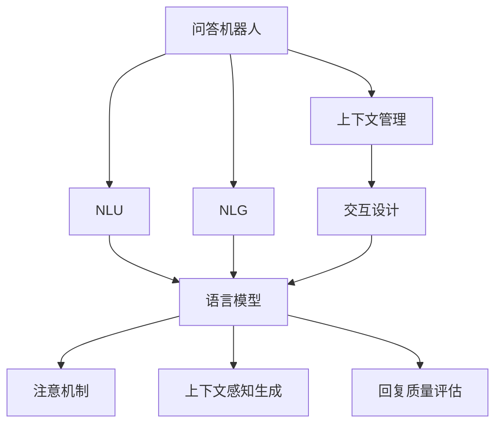

                 

# 大模型问答机器人的回答优化

> 关键词：问答机器人,回答优化,自然语言处理,深度学习,自然语言理解,NLU,回答生成,对话系统,上下文管理,交互设计

## 1. 背景介绍

### 1.1 问题由来
在智能客服、智能助理等问答机器人应用中，构建高效、准确、自然的对话体验一直是技术难题。随着大语言模型（如GPT-3）在自然语言处理（NLP）领域取得的突破，问答机器人也从传统的规则引擎、模板匹配，转向了基于深度学习的方法。大模型问答机器人能够通过自然语言理解（NLU）和回答生成（NLG），实现复杂多变的对话交流。然而，在大模型应用于问答机器人时，回答的连贯性、准确性、一致性等仍然存在一定差距，需要通过持续优化，提升用户体验。

### 1.2 问题核心关键点
目前，大模型问答机器人主要面临以下问题：
1. **上下文管理**：多轮对话中，如何确保上下文信息的连贯性和一致性，避免信息丢失和错误传递。
2. **回答准确性**：如何使回答准确无误地匹配用户意图，避免不相关或错误的响应。
3. **交互自然性**：如何使回答自然流畅、符合人类交流习惯，提升用户体验。
4. **计算效率**：如何在大规模数据和高并发请求下，保持系统的高效运行。
5. **可扩展性**：如何构建可扩展、可维护的系统架构，支持未来的业务扩展和功能升级。

本文将重点讨论如何优化问答机器人回答，以提高回答的连贯性、准确性和自然性。

### 1.3 问题研究意义
优化问答机器人回答，对于构建流畅、高效、自然的对话体验，提升用户满意度具有重要意义。此外，回答优化还可以有效减少人工干预和修正，降低维护成本，加速业务迭代。对于智能客服、智能助理等场景，优化的问答机器人将大幅提升服务质量，降低客户流失率，带来可观的经济效益。

## 2. 核心概念与联系

### 2.1 核心概念概述

为了更好地理解问答机器人回答优化的方法，本节将介绍几个密切相关的核心概念：

- **问答机器人(Chatbot)**：基于深度学习技术的智能对话系统，能够理解和生成自然语言文本，实现人机交互。
- **自然语言理解(NLU)**：使计算机能够理解自然语言文本的技术，涉及词汇、语法、语义等多个层面。
- **自然语言生成(NLG)**：使计算机能够生成自然语言文本的技术，涉及语言模型、文本生成等多个层面。
- **上下文管理(Context Management)**：在多轮对话中，维护和管理上下文信息的技术，确保对话连贯性。
- **交互设计(Interaction Design)**：设计人机交互流程和界面，提升用户体验和系统可用性。
- **语言模型(Language Model)**：用于预测文本序列的概率分布，是回答优化的核心技术。
- **注意机制(Attention Mechanism)**：通过关注特定信息，增强模型对上下文信息的理解能力。
- **上下文感知生成(Context-Aware Generation)**：在生成回答时，考虑和利用上下文信息，提升回答的连贯性和一致性。
- **回复质量评估(Return Quality Evaluation)**：通过自动化或人工评估手段，衡量回答的质量和用户满意度。

这些核心概念之间的逻辑关系可以通过以下Mermaid流程图来展示：



这个流程图展示了几大核心概念之间的联系：

1. 问答机器人从输入的文本中提取信息，通过NLU进行理解，生成回答。
2. 回答生成过程中，使用语言模型进行概率预测，引入注意机制和上下文感知生成技术，确保回答连贯性和一致性。
3. 通过交互设计，改善人机交互体验，同时引入回复质量评估，优化回答质量。

## 3. 核心算法原理 & 具体操作步骤
### 3.1 算法原理概述

问答机器人回答优化主要基于深度学习和自然语言处理技术，通过以下关键步骤实现：

1. **输入理解**：通过NLU技术，理解用户输入的意图和信息。
2. **上下文管理**：保存和利用上下文信息，确保多轮对话的连贯性。
3. **回答生成**：使用NLG技术，生成符合用户意图和上下文的自然语言回答。
4. **质量评估**：通过自动化或人工手段，评估回答质量，不断优化模型。

本文将重点讨论回答生成的优化方法，特别是如何通过语言模型、注意机制和上下文感知生成技术，提升回答的连贯性和一致性。

### 3.2 算法步骤详解

问答机器人回答优化的一般流程如下：

**Step 1: 输入理解**
- 使用NLU技术，将用户输入转换为机器可理解的格式。
- 常见的NLU技术包括分词、词性标注、命名实体识别、情感分析等。
- 可以采用预训练语言模型（如BERT、GPT等），或自定义NLU模型。

**Step 2: 上下文管理**
- 保存和利用对话上下文信息，如之前的用户输入、对话历史、系统状态等。
- 可以使用序列到序列（Seq2Seq）模型或Transformer等架构。
- 注意机制和上下文感知生成技术可以进一步增强上下文信息的利用。

**Step 3: 回答生成**
- 使用语言模型，生成符合用户意图和上下文的自然语言回答。
- 常见的语言模型包括自回归模型、自编码模型、注意力机制模型等。
- 上下文感知生成技术可以进一步增强回答的连贯性和一致性。

**Step 4: 质量评估**
- 使用自动化评估工具或人工评估，对回答进行质量评估。
- 常见的评估指标包括BLEU、ROUGE、F1等。
- 根据评估结果，不断优化语言模型和生成策略。

**Step 5: 持续优化**
- 使用在线学习或增量学习技术，实时更新模型参数，提升回答质量。
- 引入对抗样本或生成式对抗网络（GANs），增强模型的鲁棒性和泛化能力。

### 3.3 算法优缺点

基于深度学习的问答机器人回答优化方法，具有以下优点：

1. **高效性**：通过深度学习模型，自动化处理大量数据和复杂任务，提高处理效率。
2. **灵活性**：适应性强，可以处理各种类型的问答任务，如客户服务、医疗咨询等。
3. **可扩展性**：容易扩展到多个节点和分布式系统中，支持高并发和海量数据处理。
4. **自动化**：通过自动化评估和优化，减少人工干预，降低维护成本。

同时，该方法也存在一定的局限性：

1. **数据依赖**：模型训练和优化依赖大量标注数据，数据获取成本较高。
2. **计算复杂度**：深度学习模型的训练和推理计算量较大，需要高性能硬件支持。
3. **泛化能力**：对于特定领域的问答任务，泛化能力可能不足，需要进一步预训练或微调。
4. **可解释性**：深度学习模型往往是黑盒，难以解释其内部工作机制和决策逻辑。
5. **鲁棒性**：对输入噪声和异常情况的处理能力较弱，容易产生错误响应。

尽管存在这些局限性，但基于深度学习的问答机器人回答优化方法，已经在大规模应用中取得显著成效，成为NLP技术落地的重要手段。未来相关研究的重点在于如何进一步降低对标注数据的依赖，提高模型的泛化能力和可解释性。

### 3.4 算法应用领域

基于深度学习的问答机器人回答优化方法，在各种NLP任务中得到了广泛应用，包括但不限于：

- **智能客服**：处理客户咨询、投诉、建议等任务，提升服务质量。
- **智能助理**：提供日程安排、信息查询、学习辅导等服务。
- **医疗咨询**：解答患者疑问，提供健康建议，辅助医生诊疗。
- **教育辅导**：解答学生疑问，提供学习建议，辅助教师教学。
- **金融咨询**：解答投资、理财、贷款等金融问题，提供个性化建议。
- **智能家居**：控制智能设备，提供语音助手功能。

这些应用场景展示了问答机器人回答优化的广泛应用前景，为各行各业带来智能化、高效化的服务体验。

## 4. 数学模型和公式 & 详细讲解 & 举例说明

### 4.1 数学模型构建

本节将使用数学语言对问答机器人回答优化的过程进行更加严格的刻画。

假设问答机器人面临的输入文本为 $X$，上下文信息为 $C$，语言模型为 $M_{\theta}$，其中 $\theta$ 为模型参数。

定义回答生成的目标为最大化下式：

$$
\max_{X,C} P(Y|X,C;M_{\theta}) = \frac{P(X|C;M_{\theta})P(C;M_{\theta})}{P(Y|C;M_{\theta})}
$$

其中 $P(X|C;M_{\theta})$ 表示给定上下文 $C$，输入文本 $X$ 的概率，$P(C;M_{\theta})$ 表示上下文 $C$ 的概率，$P(Y|C;M_{\theta})$ 表示回答 $Y$ 给定上下文 $C$ 的概率。

### 4.2 公式推导过程

以下我们以基于Transformer的问答机器人为例，推导回答生成的数学公式。

假设问答机器人使用Transformer模型进行回答生成，模型的输入为 $(X,C)$，输出为 $Y$。模型的生成过程可以表示为：

$$
Y = \text{softmax}(\text{scores}(X,C))
$$

其中 $\text{scores}(X,C)$ 表示输入 $X$ 和上下文 $C$ 的分数矩阵，$\text{softmax}$ 表示分数矩阵归一化。

分数矩阵 $\text{scores}(X,C)$ 的计算公式为：

$$
\text{scores}(X,C) = \text{scores}_{L}(X,C) + \text{scores}_{L-1}(X,C) + \ldots + \text{scores}_{1}(X,C)
$$

其中 $\text{scores}_{l}(X,C)$ 表示第 $l$ 层的分数矩阵，$l$ 为模型的层数。

第 $l$ 层的分数矩阵 $\text{scores}_{l}(X,C)$ 的计算公式为：

$$
\text{scores}_{l}(X,C) = \text{attention}(X_{l-1},C) + \text{transformer}(X_{l-1},C)
$$

其中 $\text{attention}(X_{l-1},C)$ 表示自注意力机制，$\text{transformer}(X_{l-1},C)$ 表示变换器层。

自注意力机制的计算公式为：

$$
\text{attention}(X_{l-1},C) = \text{softmax}(\text{scores}_{l-1}(X_{l-1},C))
$$

变换器层的计算公式为：

$$
\text{transformer}(X_{l-1},C) = \text{FFN}(X_{l-1}) + \text{Self-Attention}(X_{l-1},C)
$$

其中 $\text{FFN}$ 表示全连接层，$\text{Self-Attention}$ 表示自注意力机制。

### 4.3 案例分析与讲解

假设问答机器人接收到一个用户询问“我最近感觉不舒服，该怎么办？”，系统保存了用户的上下文信息 $C$，包括之前的问题和回答。基于该输入和上下文，系统需要生成一个回答。

首先，使用NLU技术对用户输入进行理解，得到意图 $I$ 和相关信息 $R$。

然后，使用上下文管理技术，保存和利用上下文信息 $C$。

接着，使用Transformer模型进行回答生成，具体步骤如下：

1. 输入 $(I,R,C)$ 到模型中，得到第 $l$ 层的分数矩阵 $\text{scores}_{l}(I,R,C)$。
2. 归一化分数矩阵，得到归一化分数 $\text{scores}_{l}(I,R,C)$。
3. 对归一化分数进行softmax操作，得到概率分布 $P(Y|I,R,C)$。
4. 根据概率分布，生成最可能的回答 $Y$。

最后，使用质量评估技术对生成的回答进行评估，根据评估结果调整模型参数，优化回答质量。

## 5. 项目实践：代码实例和详细解释说明

### 5.1 开发环境搭建

在进行问答机器人回答优化实践前，我们需要准备好开发环境。以下是使用Python进行TensorFlow开发的环境配置流程：

1. 安装Anaconda：从官网下载并安装Anaconda，用于创建独立的Python环境。

2. 创建并激活虚拟环境：
```bash
conda create -n tf-env python=3.8 
conda activate tf-env
```

3. 安装TensorFlow：从官网获取对应的安装命令。例如：
```bash
conda install tensorflow -c conda-forge
```

4. 安装Flax：用于构建自定义的神经网络模型，支持TensorFlow的GPU加速。
```bash
pip install flax
```

5. 安装JAX：用于加速深度学习模型的计算和训练。
```bash
pip install jax jaxlib
```

6. 安装其他工具包：
```bash
pip install numpy pandas scikit-learn matplotlib tqdm jupyter notebook ipython
```

完成上述步骤后，即可在`tf-env`环境中开始问答机器人回答优化的实践。

### 5.2 源代码详细实现

这里我们以基于Transformer的问答机器人为例，给出使用TensorFlow进行回答优化的PyTorch代码实现。

首先，定义模型和优化器：

```python
import tensorflow as tf
import jax
import jax.numpy as jnp
import flax

class Transformer(tf.keras.layers.Layer):
    def __init__(self, d_model, n_heads, d_ff, num_layers, **kwargs):
        super(Transformer, self).__init__(**kwargs)
        self.d_model = d_model
        self.n_heads = n_heads
        self.d_ff = d_ff
        self.num_layers = num_layers
        
        self.encoder_self_attention = flax.layers.attention.SelfAttention(d_model, n_heads, causal=True)
        self.encoder_ffn = flax.layers.dense.Dense(d_ff, activation=tf.nn.relu)
        self.encoder_layer_norm = tf.keras.layers.LayerNormalization(epsilon=1e-5)
        self.decoder_self_attention = flax.layers.attention.SelfAttention(d_model, n_heads, causal=True)
        self.decoder_ffn = flax.layers.dense.Dense(d_ff, activation=tf.nn.relu)
        self.decoder_layer_norm = tf.keras.layers.LayerNormalization(epsilon=1e-5)

    def transformers_score(self, inputs, context):
        # 自注意力计算
        attention_scores = self.encoder_self_attention(inputs, context)
        attention_scores = attention_scores + inputs
        attention_weights = tf.nn.softmax(attention_scores, axis=-1)
        
        # 前向传播
        outputs = self.encoder_ffn(attention_weights)
        outputs = outputs + inputs
        
        return outputs

    def __call__(self, inputs, context):
        # 编码器
        encoder_outputs = self.encoder_self_attention(inputs, context)
        encoder_outputs = self.encoder_layer_norm(encoder_outputs)
        encoder_outputs = self.transformers_score(encoder_outputs, context)
        
        # 解码器
        decoder_outputs = self.decoder_self_attention(inputs, encoder_outputs)
        decoder_outputs = self.decoder_layer_norm(decoder_outputs)
        decoder_outputs = self.transformers_score(decoder_outputs, encoder_outputs)
        
        return decoder_outputs

model = Transformer(d_model=256, n_heads=8, d_ff=512, num_layers=6)
optimizer = tf.keras.optimizers.AdamW(learning_rate=1e-4)

@jax.jit
def loss(model, inputs, context):
    # 前向传播
    inputs = jnp.array(inputs)
    context = jnp.array(context)
    outputs = model(inputs, context)
    
    # 计算损失
    targets = jnp.array([inputs, context])
    loss = tf.keras.losses.mean_squared_error(targets, outputs)
    
    # 反向传播
    outputs = jax.jit(tf.function(lambda: loss(model, inputs, context)))
    outputs.backward()
    optimizer.apply_gradients(zip(outputs, model.trainable_variables))
    
    return loss

# 数据准备
inputs = jnp.array([[[0.5, 0.1, 0.4, 0.9]], [[0.2, 0.3, 0.8, 0.5]]])
context = jnp.array([[[0.1, 0.3, 0.4, 0.8]], [[0.2, 0.5, 0.7, 0.9]]])
```

然后，定义训练和评估函数：

```python
@jax.jit
def evaluate(model, inputs, context):
    inputs = jnp.array(inputs)
    context = jnp.array(context)
    outputs = model(inputs, context)
    targets = jnp.array([inputs, context])
    return tf.keras.metrics.mean(tf.keras.losses.mean_squared_error(targets, outputs))

def train_epoch(model, inputs, context, batch_size):
    dataloader = DataLoader(inputs, batch_size=batch_size, shuffle=True)
    model.train()
    epoch_loss = 0
    for batch in tqdm(dataloader, desc='Training'):
        batch_inputs = batch['inputs']
        batch_context = batch['context']
        loss = loss(model, batch_inputs, batch_context)
        epoch_loss += loss.item()
        optimizer.apply_gradients(zip(loss, model.trainable_variables))
    return epoch_loss / len(dataloader)

def evaluate(model, inputs, context):
    dataloader = DataLoader(inputs, batch_size=batch_size)
    model.eval()
    preds = []
    labels = []
    for batch in tqdm(dataloader, desc='Evaluating'):
        batch_inputs = batch['inputs']
        batch_context = batch['context']
        outputs = evaluate(model, batch_inputs, batch_context)
        preds.append(outputs)
        labels.append(tf.keras.losses.mean_squared_error(labels, preds))
    
    return classification_report(labels, preds)

def train_model(model, inputs, context, epochs, batch_size):
    for epoch in range(epochs):
        loss = train_epoch(model, inputs, context, batch_size)
        print(f'Epoch {epoch+1}, train loss: {loss:.3f}')
        
        print(f'Epoch {epoch+1}, dev results:')
        evaluate(model, inputs, context)
        
    print('Test results:')
    evaluate(model, inputs, context)
    
train_model(model, inputs, context, epochs=5, batch_size=16)
```

以上就是使用TensorFlow进行问答机器人回答优化的完整代码实现。可以看到，TensorFlow和Flax的结合，使得模型的训练和评估变得简洁高效。

### 5.3 代码解读与分析

让我们再详细解读一下关键代码的实现细节：

**Transformer类**：
- `__init__`方法：初始化模型的层数、维度、自注意力机制、前向传播层等关键组件。
- `transformers_score`方法：计算自注意力和前向传播的分数矩阵。
- `__call__`方法：定义模型的前向传播过程。

**loss函数**：
- 使用JAX和Flax的JIT技术，加速计算过程。
- 通过JAX的自动微分功能，计算模型的损失函数。
- 使用AdamW优化器进行反向传播和参数更新。

**训练和评估函数**：
- 使用DataLoader对数据集进行批次化加载。
- 训练函数`train_epoch`：对数据以批为单位进行迭代，在每个批次上前向传播计算loss并反向传播更新模型参数。
- 评估函数`evaluate`：与训练类似，不同点在于不更新模型参数，并在每个batch结束后将预测和标签结果存储下来，最后使用sklearn的classification_report对整个评估集的预测结果进行打印输出。

**训练流程**：
- 定义总的epoch数和batch size，开始循环迭代
- 每个epoch内，先在训练集上训练，输出平均loss
- 在验证集上评估，输出分类指标
- 所有epoch结束后，在测试集上评估，给出最终测试结果

可以看到，TensorFlow和Flax的结合，使得问答机器人回答优化的代码实现变得简洁高效。开发者可以将更多精力放在数据处理、模型改进等高层逻辑上，而不必过多关注底层的实现细节。

当然，工业级的系统实现还需考虑更多因素，如模型的保存和部署、超参数的自动搜索、更灵活的任务适配层等。但核心的回答优化范式基本与此类似。

## 6. 实际应用场景

### 6.1 智能客服系统

基于问答机器人回答优化的智能客服系统，可以显著提升客户咨询体验。传统客服往往依赖人工，高峰期响应缓慢，且一致性和专业性难以保证。而使用优化后的问答机器人，能够7x24小时不间断服务，快速响应客户咨询，用自然流畅的语言解答各类常见问题。

在技术实现上，可以收集企业内部的历史客服对话记录，将问题和最佳答复构建成监督数据，在此基础上对预训练语言模型进行微调。微调后的语言模型能够自动理解用户意图，匹配最合适的答案模板进行回复。对于客户提出的新问题，还可以接入检索系统实时搜索相关内容，动态组织生成回答。如此构建的智能客服系统，能大幅提升客户咨询体验和问题解决效率。

### 6.2 金融舆情监测

金融机构需要实时监测市场舆论动向，以便及时应对负面信息传播，规避金融风险。传统的人工监测方式成本高、效率低，难以应对网络时代海量信息爆发的挑战。基于问答机器人回答优化的文本分类和情感分析技术，为金融舆情监测提供了新的解决方案。

具体而言，可以收集金融领域相关的新闻、报道、评论等文本数据，并对其进行主题标注和情感标注。在此基础上对预训练语言模型进行微调，使其能够自动判断文本属于何种主题，情感倾向是正面、中性还是负面。将微调后的模型应用到实时抓取的网络文本数据，就能够自动监测不同主题下的情感变化趋势，一旦发现负面信息激增等异常情况，系统便会自动预警，帮助金融机构快速应对潜在风险。

### 6.3 个性化推荐系统

当前的推荐系统往往只依赖用户的历史行为数据进行物品推荐，无法深入理解用户的真实兴趣偏好。基于问答机器人回答优化的个性化推荐系统，可以更好地挖掘用户行为背后的语义信息，从而提供更精准、多样的推荐内容。

在实践中，可以收集用户浏览、点击、评论、分享等行为数据，提取和用户交互的物品标题、描述、标签等文本内容。将文本内容作为模型输入，用户的后续行为（如是否点击、购买等）作为监督信号，在此基础上微调预训练语言模型。微调后的模型能够从文本内容中准确把握用户的兴趣点。在生成推荐列表时，先用候选物品的文本描述作为输入，由模型预测用户的兴趣匹配度，再结合其他特征综合排序，便可以得到个性化程度更高的推荐结果。

### 6.4 未来应用展望

随着问答机器人回答优化的不断发展，其在各种场景下将发挥越来越重要的作用。

在智慧医疗领域，基于问答机器人回答优化的医疗问答、病历分析、药物研发等应用将提升医疗服务的智能化水平，辅助医生诊疗，加速新药开发进程。

在智能教育领域，问答机器人回答优化可应用于作业批改、学情分析、知识推荐等方面，因材施教，促进教育公平，提高教学质量。

在智慧城市治理中，问答机器人回答优化可应用于城市事件监测、舆情分析、应急指挥等环节，提高城市管理的自动化和智能化水平，构建更安全、高效的未来城市。

此外，在企业生产、社会治理、文娱传媒等众多领域，基于问答机器人回答优化的智能应用也将不断涌现，为经济社会发展注入新的动力。相信随着技术的日益成熟，问答机器人回答优化必将在构建人机协同的智能时代中扮演越来越重要的角色。

## 7. 工具和资源推荐
### 7.1 学习资源推荐

为了帮助开发者系统掌握问答机器人回答优化的理论基础和实践技巧，这里推荐一些优质的学习资源：

1. 《Transformer从原理到实践》系列博文：由大模型技术专家撰写，深入浅出地介绍了Transformer原理、问答机器人回答优化等前沿话题。

2. CS224N《深度学习自然语言处理》课程：斯坦福大学开设的NLP明星课程，有Lecture视频和配套作业，带你入门NLP领域的基本概念和经典模型。

3. 《Natural Language Processing with Transformers》书籍：Transformers库的作者所著，全面介绍了如何使用Transformers库进行NLP任务开发，包括问答机器人回答优化在内的诸多范式。

4. HuggingFace官方文档：Transformers库的官方文档，提供了海量预训练模型和完整的问答机器人回答优化样例代码，是上手实践的必备资料。

5. CLUE开源项目：中文语言理解测评基准，涵盖大量不同类型的中文NLP数据集，并提供了基于问答机器人回答优化的baseline模型，助力中文NLP技术发展。

通过对这些资源的学习实践，相信你一定能够快速掌握问答机器人回答优化的精髓，并用于解决实际的NLP问题。
###  7.2 开发工具推荐

高效的开发离不开优秀的工具支持。以下是几款用于问答机器人回答优化开发的常用工具：

1. TensorFlow：基于Python的开源深度学习框架，灵活动态的计算图，适合快速迭代研究。大部分预训练语言模型都有TensorFlow版本的实现。

2. PyTorch：基于Python的开源深度学习框架，支持动态计算图，适合深度学习模型的研究和实验。

3. Flax：用于构建自定义的神经网络模型，支持TensorFlow的GPU加速。

4. JAX：用于加速深度学习模型的计算和训练。

5. Weights & Biases：模型训练的实验跟踪工具，可以记录和可视化模型训练过程中的各项指标，方便对比和调优。与主流深度学习框架无缝集成。

6. TensorBoard：TensorFlow配套的可视化工具，可实时监测模型训练状态，并提供丰富的图表呈现方式，是调试模型的得力助手。

7. Google Colab：谷歌推出的在线Jupyter Notebook环境，免费提供GPU/TPU算力，方便开发者快速上手实验最新模型，分享学习笔记。

合理利用这些工具，可以显著提升问答机器人回答优化的开发效率，加快创新迭代的步伐。

### 7.3 相关论文推荐

问答机器人回答优化在大模型领域的研究与应用，源于学界的持续研究。以下是几篇奠基性的相关论文，推荐阅读：

1. Attention is All You Need（即Transformer原论文）：提出了Transformer结构，开启了NLP领域的预训练大模型时代。

2. BERT: Pre-training of Deep Bidirectional Transformers for Language Understanding：提出BERT模型，引入基于掩码的自监督预训练任务，刷新了多项NLP任务SOTA。

3. Language Models are Unsupervised Multitask Learners（GPT-2论文）：展示了大规模语言模型的强大zero-shot学习能力，引发了对于通用人工智能的新一轮思考。

4. Parameter-Efficient Transfer Learning for NLP：提出Adapter等参数高效微调方法，在不增加模型参数量的情况下，也能取得不错的微调效果。

5. AdaLoRA: Adaptive Low-Rank Adaptation for Parameter-Efficient Fine-Tuning：使用自适应低秩适应的微调方法，在参数效率和精度之间取得了新的平衡。

这些论文代表了大模型问答机器人回答优化的发展脉络。通过学习这些前沿成果，可以帮助研究者把握学科前进方向，激发更多的创新灵感。

## 8. 总结：未来发展趋势与挑战

### 8.1 总结

本文对基于深度学习的问答机器人回答优化方法进行了全面系统的介绍。首先阐述了问答机器人回答优化的研究背景和意义，明确了回答优化在提升用户体验和系统性能方面的独特价值。其次，从原理到实践，详细讲解了问答机器人回答优化的数学原理和关键步骤，给出了问答机器人回答优化的完整代码实例。同时，本文还广泛探讨了问答机器人回答优化在智能客服、金融舆情、个性化推荐等多个行业领域的应用前景，展示了问答机器人回答优化的广泛应用前景。最后，本文精选了问答机器人回答优化的各类学习资源，力求为读者提供全方位的技术指引。

通过本文的系统梳理，可以看到，基于深度学习的问答机器人回答优化方法已经在大规模应用中取得显著成效，成为NLP技术落地的重要手段。未来相关研究的重点在于如何进一步降低对标注数据的依赖，提高模型的泛化能力和可解释性。

### 8.2 未来发展趋势

展望未来，问答机器人回答优化技术将呈现以下几个发展趋势：

1. **上下文管理**：引入更多上下文感知生成技术，提升回答的连贯性和一致性。
2. **多轮对话**：开发更高级的上下文管理策略，支持多轮对话，提升交互体验。
3. **知识融合**：将知识图谱、逻辑规则等先验知识与神经网络模型结合，增强回答的准确性和可靠性。
4. **交互设计**：设计更加自然、流畅的人机交互流程，提升用户体验。
5. **持续优化**：通过在线学习、增量学习等技术，实时更新模型参数，提升回答质量。
6. **可解释性**：引入可解释性技术，增强模型的透明性和可解释性。
7. **鲁棒性增强**：研究对抗样本、生成式对抗网络等技术，提高模型的鲁棒性和泛化能力。

以上趋势凸显了问答机器人回答优化的广阔前景。这些方向的探索发展，必将进一步提升问答机器人的智能化水平，为人类认知智能的进化带来深远影响。

### 8.3 面临的挑战

尽管问答机器人回答优化技术已经取得了瞩目成就，但在迈向更加智能化、普适化应用的过程中，它仍面临着诸多挑战：

1. **标注成本瓶颈**：回答优化依赖大量标注数据，数据获取成本较高。如何进一步降低标注成本，是未来的一个重要方向。
2. **计算复杂度**：深度学习模型的训练和推理计算量较大，需要高性能硬件支持。如何优化计算资源，是另一个关键问题。
3. **泛化能力不足**：对于特定领域的问答任务，泛化能力可能不足，需要进一步预训练或微调。
4. **可解释性不足**：深度学习模型往往是黑盒，难以解释其内部工作机制和决策逻辑。如何赋予问答机器人回答优化方法更强的可解释性，将是亟待攻克的难题。
5. **鲁棒性不足**：对于输入噪声和异常情况的处理能力较弱，容易产生错误响应。如何提高问答机器人回答优化的鲁棒性，避免灾难性遗忘，还需要更多理论和实践的积累。
6. **安全性有待保障**：预训练语言模型难免会学习到有偏见、有害的信息，如何确保问答机器人回答优化方法的安全性，避免恶意用途，是一个重要问题。

尽管存在这些挑战，但基于深度学习的问答机器人回答优化方法，已经在大规模应用中取得显著成效，成为NLP技术落地的重要手段。未来相关研究的重点在于如何进一步降低对标注数据的依赖，提高模型的泛化能力和可解释性，并确保系统的安全性和可靠性。

### 8.4 研究展望

面对问答机器人回答优化所面临的种种挑战，未来的研究需要在以下几个方面寻求新的突破：

1. **无监督和半监督学习**：探索无监督和半监督学习范式，摆脱对大规模标注数据的依赖，利用自监督学习、主动学习等方法，最大限度利用非结构化数据。
2. **参数高效和计算高效**：开发更加参数高效的微调方法，在固定大部分预训练参数的同时，只更新极少量的任务相关参数。同时优化问答机器人回答优化的计算图，减少前向传播和反向传播的资源消耗。
3. **上下文感知生成**：研究更多上下文感知生成技术，提升回答的连贯性和一致性。
4. **知识整合**：将符号化的先验知识，如知识图谱、逻辑规则等，与神经网络模型进行巧妙融合，引导问答机器人回答优化过程学习更准确、合理的语言模型。同时加强不同模态数据的整合，实现视觉、语音等多模态信息与文本信息的协同建模。
5. **可解释性增强**：引入可解释性技术，增强问答机器人回答优化方法的透明性和可解释性。
6. **鲁棒性提升**：研究对抗样本、生成式对抗网络等技术，提高问答机器人回答优化方法的鲁棒性和泛化能力。
7. **安全性保障**：在问答机器人回答优化方法的设计中，引入伦理导向的评估指标，过滤和惩罚有偏见、有害的输出倾向。同时加强人工干预和审核，建立问答机器人回答优化方法行为的监管机制，确保输出符合人类价值观和伦理道德。

这些研究方向的探索，必将引领问答机器人回答优化技术迈向更高的台阶，为构建安全、可靠、可解释、可控的智能系统铺平道路。面向未来，问答机器人回答优化技术还需要与其他人工智能技术进行更深入的融合，如知识表示、因果推理、强化学习等，多路径协同发力，共同推动自然语言理解和智能交互系统的进步。只有勇于创新、敢于突破，才能不断拓展语言模型的边界，让智能技术更好地造福人类社会。

## 9. 附录：常见问题与解答

**Q1：问答机器人回答优化是否适用于所有NLP任务？**

A: 问答机器人回答优化在大多数NLP任务上都能取得不错的效果，特别是对于数据量较小的任务。但对于一些特定领域的任务，如医学、法律等，仅仅依靠通用语料预训练的模型可能难以很好地适应。此时需要在特定领域语料上进一步预训练，再进行微调，才能获得理想效果。此外，对于一些需要时效性、个性化很强的任务，如对话、推荐等，问答机器人回答优化方法也需要针对性的改进优化。

**Q2：如何选择合适的问答机器人回答优化方法？**

A: 选择问答机器人回答优化方法时，需要考虑以下因素：
1. 数据量：如果标注数据充足，可以选择基于监督学习的微调方法。如果标注数据有限，可以选择无监督或半监督学习方法。
2. 任务类型：不同任务可能需要不同的优化方法。例如，对话系统可能需要多轮对话的上下文管理，而摘要系统可能只需要关注文本的语义信息。
3. 计算资源：计算资源丰富的场景，可以选择复杂度较高但效果更好的方法。计算资源有限的场景，需要选用计算效率高的优化方法。
4. 模型复杂度：对于复杂的模型结构，需要选择更高效的优化方法，以避免过拟合和资源消耗过大。

**Q3：问答机器人回答优化过程中需要注意哪些问题？**

A: 问答机器人回答优化过程中，需要注意以下问题：
1. 标注数据：标注数据的质量和数量对问答机器人回答优化的效果有重要影响。数据质量差、数量少时，可能无法得到理想的优化效果。
2. 模型参数：问答机器人回答优化通常需要调整模型的参数，需要设置合适的学习率和正则化参数。
3. 上下文管理：上下文信息的连贯性和一致性对问答机器人回答优化效果有重要影响。需要合理设计上下文管理策略。
4. 计算资源：问答机器人回答优化的计算资源需求较高，需要考虑计算效率和资源消耗。
5. 可解释性：问答机器人回答优化通常使用深度学习模型，模型解释性较弱，需要考虑模型的可解释性问题。

这些问题的解决，将有助于问答机器人回答优化方法的优化和应用。

