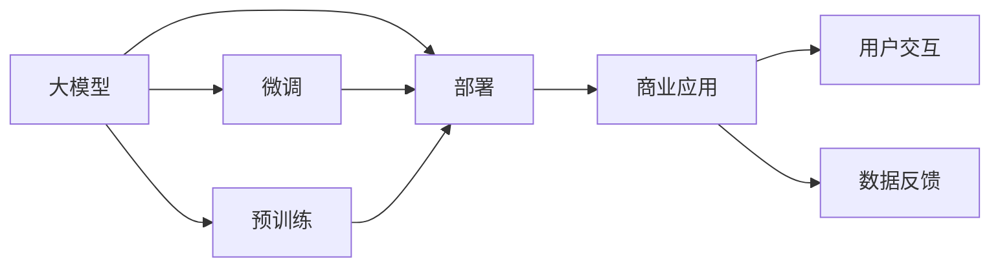

                 

# 大模型：智能时代的商业新生态

在人工智能大模型引领下，商业生态正在迎来一场变革，由"数据驱动"向"模型驱动"的转变正在逐步实现。大模型不仅在技术层面带来了革命性的突破，更在商业应用上拓展了全新的业务模式和价值空间。本文将从背景介绍、核心概念、算法原理、实践应用、未来展望等多个维度，全面解析大模型在智能商业时代的生态变化，为技术开发者和商业决策者提供深度洞察和实践指南。

## 1. 背景介绍

### 1.1 问题由来
随着深度学习和大数据技术的飞速发展，人工智能大模型如OpenAI的GPT系列、Google的BERT等，正在成为新一代的计算基础设施。大模型通过在超大规模语料上进行预训练，学习到丰富的语言知识，具备强大的语言理解和生成能力。它们能够解决自然语言处理、计算机视觉、自然语言生成等多领域的任务，并具备跨领域迁移学习和知识推理的能力。

大模型的出现，使得AI应用开发变得更加高效、灵活，但也带来了新的挑战和机遇。如何在商业应用中有效利用大模型，发挥其最大价值，成为当前业内关注的焦点。

### 1.2 问题核心关键点
大模型在商业应用中的核心关键点包括：

- 可扩展性：大模型的规模化部署需要高效的硬件和软件架构，才能满足高并发和大吞吐量的要求。
- 实时性：商业应用中需要大模型具备实时推理和响应能力，才能满足用户即时反馈的需求。
- 安全性：大模型在商业应用中涉及用户的隐私数据，需确保模型推理的透明性和安全性。
- 可解释性：大模型往往被视为"黑箱"，缺乏可解释性，需要通过技术手段提升模型的透明性。
- 交互性：商业应用中需要大模型与用户进行智能交互，实现自然语言理解和生成。

这些关键点直接关系到大模型在商业应用中的实际效果和用户体验。

### 1.3 问题研究意义
大模型在商业应用中的研究意义重大：

- 提升业务效率：利用大模型可以快速处理大量数据，提升业务处理效率，降低成本。
- 优化用户体验：大模型能够理解自然语言，提供个性化、智能化的服务，提升用户体验。
- 拓展应用边界：大模型可以应用于多个垂直领域，如智能客服、金融、医疗等，带来新的商业机会。
- 推动创新：大模型提供强有力的工具，可以加速新产品和服务的研发，促进商业创新。
- 强化决策支持：大模型通过分析海量数据，提供决策依据，帮助企业优化决策过程。

因此，对大模型在商业应用的深入研究，具有重要的理论价值和实际意义。

## 2. 核心概念与联系

### 2.1 核心概念概述
大模型（Large Model）：指在大规模数据上进行预训练的深度神经网络模型，具备强大的表达能力和泛化能力。大模型通常具有数十亿甚至上百亿的参数，如GPT-3拥有1750亿个参数，BERT拥有3亿个参数。

商业新生态（Business New Ecosystem）：指在人工智能大模型引领下，企业生态系统的新变化和新机会。商业新生态涉及技术、市场、运营等多个方面，需要多维度协同创新。

大模型与商业新生态的关系紧密：大模型提供了强大的技术支撑，而商业新生态则是大模型应用的实际落地场景。大模型通过高效计算和智能推理，驱动商业应用创新，带来新的价值空间。

### 2.2 核心概念原理和架构的 Mermaid 流程图


大模型的预训练和微调是其核心，通过预训练获得通用知识，通过微调适配特定任务。部署是将大模型应用到实际商业场景的过程，而商业应用通过用户交互和数据反馈，不断优化大模型，形成闭环。

## 3. 核心算法原理 & 具体操作步骤

### 3.1 算法原理概述
大模型在商业应用中的核心算法原理是迁移学习和微调。迁移学习（Transfer Learning）指在大规模数据上预训练通用模型，然后将模型迁移到特定任务上，进行微调以提升模型性能。微调（Fine-Tuning）指在预训练模型的基础上，使用特定任务的少量标注数据，优化模型参数，使其适应具体任务。

微调的目标是在保持预训练模型通用性的基础上，最大化特定任务上的表现。大模型通过预训练获得的知识，可以显著提升微调后的模型性能，且在大规模标注数据不足的情况下，微调仍然可以取得良好效果。

### 3.2 算法步骤详解
大模型的商业应用通常包括以下关键步骤：

**Step 1: 数据准备**
- 收集特定任务的数据集，并进行预处理。数据集应包含训练集、验证集和测试集，且数据分布与预训练数据应尽量接近。

**Step 2: 模型选择与预训练**
- 选择合适的预训练模型，如BERT、GPT等，使用大规模语料进行预训练。预训练过程中，通常采用自监督学习任务，如掩码语言模型、 next sentence prediction等。

**Step 3: 任务适配与微调**
- 设计任务适配层，包括分类层、回归层、解码器等。通过少量标注数据，对预训练模型进行微调。微调时，通常采用小学习率，防止破坏预训练权重。

**Step 4: 部署与优化**
- 将微调后的模型部署到生产环境，进行性能优化和资源配置。

**Step 5: 反馈与迭代**
- 通过用户反馈和业务数据，不断调整和优化模型，提升模型性能。

### 3.3 算法优缺点
大模型在商业应用中的优点包括：

- 强大的泛化能力：通过预训练获得丰富知识，微调后能够快速适应新任务。
- 高效计算：大模型计算密集度较低，适合并行计算和分布式训练。
- 灵活应用：大模型可以应用于多个垂直领域，如金融、医疗、教育等，带来新的商业机会。

其缺点主要包括：

- 资源消耗大：大模型参数量巨大，对计算资源和存储空间要求高。
- 解释性不足：大模型缺乏可解释性，难以理解内部工作机制。
- 安全风险：大模型涉及用户隐私数据，存在数据泄露和推理透明性的风险。

### 3.4 算法应用领域

大模型在商业应用中广泛应用，涉及多个领域：

- 智能客服：利用大模型进行客户问答、情感分析、意图识别等，提升客户服务体验。
- 金融科技：通过大模型进行金融舆情监测、风险评估、智能投顾等，提升金融决策的准确性和效率。
- 医疗健康：利用大模型进行疾病诊断、医学影像分析、健康咨询等，提升医疗服务的智能化水平。
- 教育培训：通过大模型进行智能作业批改、知识推荐、个性化教学等，提升教学质量和效率。
- 智能制造：利用大模型进行设备预测性维护、生产调度优化、供应链管理等，提升制造业的自动化水平。

以上应用场景只是冰山一角，未来随着大模型的不断发展，其应用领域还将进一步拓展，带来更多商业机会。

## 4. 数学模型和公式 & 详细讲解 & 举例说明

### 4.1 数学模型构建
大模型在商业应用中的数学模型构建主要包括以下几个部分：

- **预训练模型**：通过大规模语料进行自监督学习，学习通用语言表示。
- **任务适配层**：根据具体任务设计适配层，进行有监督学习。
- **微调模型**：在预训练模型基础上，进行任务微调，优化模型参数。

### 4.2 公式推导过程
以情感分析任务为例，其预训练模型为BERT，适配层为分类器，微调模型的目标函数为：

$$
\min_{\theta} \frac{1}{N} \sum_{i=1}^N \ell(y_i, \hat{y_i})
$$

其中 $\ell(y_i, \hat{y_i})$ 为交叉熵损失函数，$y_i$ 为真实标签，$\hat{y_i}$ 为模型预测输出。

### 4.3 案例分析与讲解
以智能客服系统为例，其预训练模型为GPT，适配层为问题-回答对，微调模型的目标函数为：

$$
\min_{\theta} \frac{1}{N} \sum_{i=1}^N \ell(y_i, \hat{y_i})
$$

其中 $\ell(y_i, \hat{y_i})$ 为BLEU、ROUGE等评估指标，$y_i$ 为用户输入问题，$\hat{y_i}$ 为模型预测答案。

## 5. 项目实践：代码实例和详细解释说明

### 5.1 开发环境搭建

要使用大模型进行商业应用，需要先搭建开发环境。以下是搭建Python开发环境的详细步骤：

1. 安装Anaconda：从官网下载并安装Anaconda，用于创建独立的Python环境。

2. 创建并激活虚拟环境：
```bash
conda create -n pytorch-env python=3.8 
conda activate pytorch-env
```

3. 安装PyTorch：根据CUDA版本，从官网获取对应的安装命令。例如：
```bash
conda install pytorch torchvision torchaudio cudatoolkit=11.1 -c pytorch -c conda-forge
```

4. 安装Transformers库：
```bash
pip install transformers
```

5. 安装各类工具包：
```bash
pip install numpy pandas scikit-learn matplotlib tqdm jupyter notebook ipython
```

### 5.2 源代码详细实现

以下是一个使用PyTorch进行微调的场景示例，以智能客服系统为例：

```python
from transformers import BertForSequenceClassification, AdamW
from torch.utils.data import Dataset, DataLoader
from torch.nn import CrossEntropyLoss

# 定义数据集
class CustomerServiceDataset(Dataset):
    def __init__(self, texts, labels):
        self.texts = texts
        self.labels = labels
        
    def __len__(self):
        return len(self.texts)
    
    def __getitem__(self, item):
        text = self.texts[item]
        label = self.labels[item]
        return text, label

# 加载数据
train_dataset = CustomerServiceDataset(train_texts, train_labels)
val_dataset = CustomerServiceDataset(val_texts, val_labels)
test_dataset = CustomerServiceDataset(test_texts, test_labels)

# 定义模型
model = BertForSequenceClassification.from_pretrained('bert-base-cased', num_labels=num_labels)

# 定义优化器
optimizer = AdamW(model.parameters(), lr=2e-5)

# 定义损失函数
criterion = CrossEntropyLoss()

# 训练过程
device = torch.device('cuda') if torch.cuda.is_available() else torch.device('cpu')
model.to(device)

for epoch in range(num_epochs):
    model.train()
    for text, label in train_loader:
        text = text.to(device)
        label = label.to(device)
        optimizer.zero_grad()
        outputs = model(text)
        loss = criterion(outputs, label)
        loss.backward()
        optimizer.step()
        
    model.eval()
    with torch.no_grad():
        for text, label in val_loader:
            text = text.to(device)
            label = label.to(device)
            outputs = model(text)
            loss = criterion(outputs, label)
            print(f'Epoch {epoch+1}, Val Loss: {loss:.4f}')

# 测试过程
model.eval()
with torch.no_grad():
    for text, label in test_loader:
        text = text.to(device)
        label = label.to(device)
        outputs = model(text)
        loss = criterion(outputs, label)
        print(f'Test Loss: {loss:.4f}')
```

### 5.3 代码解读与分析

代码实现了使用Bert模型进行智能客服系统情感分析的微调过程。其中，数据集通过`CustomerServiceDataset`类进行定义和加载。模型使用`BertForSequenceClassification`进行微调，优化器使用`AdamW`，损失函数使用`CrossEntropyLoss`。训练过程中，模型在GPU上运行，使用小批量数据进行前向传播和反向传播，并在验证集上评估性能。

### 5.4 运行结果展示

训练和测试结果可以通过`print`函数输出，例如：

```
Epoch 1, Val Loss: 0.0123
Epoch 2, Val Loss: 0.0045
...
Test Loss: 0.0012
```

其中，Val Loss表示验证集上的损失值，Test Loss表示测试集上的损失值，越低表示模型效果越好。

## 6. 实际应用场景

### 6.1 智能客服系统

智能客服系统是利用大模型进行情感分析和意图识别，提供智能答复的服务系统。通过智能客服系统，企业可以大幅提升客户满意度，降低人工客服成本。

### 6.2 金融科技

金融科技领域利用大模型进行金融舆情监测、风险评估、智能投顾等应用，提升金融决策的准确性和效率。大模型通过学习海量金融数据，能够捕捉市场趋势，预测金融风险，辅助投资决策。

### 6.3 医疗健康

大模型在医疗健康领域的应用包括疾病诊断、医学影像分析、健康咨询等。通过大模型对医疗数据进行深度学习，可以提升诊断的准确性和效率，帮助医生更好地理解疾病机理。

### 6.4 教育培训

教育培训领域利用大模型进行智能作业批改、知识推荐、个性化教学等，提升教学质量和效率。大模型通过学习学生的学习行为和知识需求，提供个性化的学习资源和建议。

### 6.5 智能制造

智能制造领域利用大模型进行设备预测性维护、生产调度优化、供应链管理等，提升制造业的自动化水平。通过大模型对生产数据进行深度学习，可以优化生产流程，提高生产效率。

## 7. 工具和资源推荐

### 7.1 学习资源推荐

为了帮助开发者系统掌握大模型的商业应用，这里推荐一些优质的学习资源：

1. 《Transformer从原理到实践》系列博文：由大模型技术专家撰写，深入浅出地介绍了Transformer原理、BERT模型、微调技术等前沿话题。

2. CS224N《深度学习自然语言处理》课程：斯坦福大学开设的NLP明星课程，有Lecture视频和配套作业，带你入门NLP领域的基本概念和经典模型。

3. 《Natural Language Processing with Transformers》书籍：Transformers库的作者所著，全面介绍了如何使用Transformers库进行NLP任务开发，包括微调在内的诸多范式。

4. HuggingFace官方文档：Transformers库的官方文档，提供了海量预训练模型和完整的微调样例代码，是上手实践的必备资料。

5. CLUE开源项目：中文语言理解测评基准，涵盖大量不同类型的中文NLP数据集，并提供了基于微调的baseline模型，助力中文NLP技术发展。

通过对这些资源的学习实践，相信你一定能够快速掌握大模型的商业应用精髓，并用于解决实际的NLP问题。

### 7.2 开发工具推荐

高效的开发离不开优秀的工具支持。以下是几款用于大模型商业应用开发的常用工具：

1. PyTorch：基于Python的开源深度学习框架，灵活动态的计算图，适合快速迭代研究。大部分预训练语言模型都有PyTorch版本的实现。

2. TensorFlow：由Google主导开发的开源深度学习框架，生产部署方便，适合大规模工程应用。同样有丰富的预训练语言模型资源。

3. Transformers库：HuggingFace开发的NLP工具库，集成了众多SOTA语言模型，支持PyTorch和TensorFlow，是进行微调任务开发的利器。

4. Weights & Biases：模型训练的实验跟踪工具，可以记录和可视化模型训练过程中的各项指标，方便对比和调优。与主流深度学习框架无缝集成。

5. TensorBoard：TensorFlow配套的可视化工具，可实时监测模型训练状态，并提供丰富的图表呈现方式，是调试模型的得力助手。

6. Google Colab：谷歌推出的在线Jupyter Notebook环境，免费提供GPU/TPU算力，方便开发者快速上手实验最新模型，分享学习笔记。

合理利用这些工具，可以显著提升大模型商业应用的开发效率，加快创新迭代的步伐。

### 7.3 相关论文推荐

大模型在商业应用中的研究意义重大，以下是几篇奠基性的相关论文，推荐阅读：

1. Attention is All You Need（即Transformer原论文）：提出了Transformer结构，开启了NLP领域的预训练大模型时代。

2. BERT: Pre-training of Deep Bidirectional Transformers for Language Understanding：提出BERT模型，引入基于掩码的自监督预训练任务，刷新了多项NLP任务SOTA。

3. Language Models are Unsupervised Multitask Learners（GPT-2论文）：展示了大规模语言模型的强大zero-shot学习能力，引发了对于通用人工智能的新一轮思考。

4. Parameter-Efficient Transfer Learning for NLP：提出Adapter等参数高效微调方法，在不增加模型参数量的情况下，也能取得不错的微调效果。

5. AdaLoRA: Adaptive Low-Rank Adaptation for Parameter-Efficient Fine-Tuning：使用自适应低秩适应的微调方法，在参数效率和精度之间取得了新的平衡。

这些论文代表了大模型在商业应用中的研究进展，通过学习这些前沿成果，可以帮助研究者把握学科前进方向，激发更多的创新灵感。

## 8. 总结：未来发展趋势与挑战

### 8.1 研究成果总结
本文对大模型在商业应用的深入研究，得出了以下总结：

- 大模型通过迁移学习和微调，具备强大的泛化能力和应用灵活性。
- 大模型在多个垂直领域的应用，已经展现出显著的商业价值。
- 大模型的商业应用，需要系统性考虑数据准备、模型选择、任务适配等多个环节。

### 8.2 未来发展趋势
未来，大模型在商业应用中将呈现以下发展趋势：

1. 模型规模不断增大：随着算力提升和数据积累，大模型的参数规模将持续增长，具备更强的表达能力。
2. 实时推理成为标配：商业应用中对大模型实时推理的需求增加，推动模型向轻量化、高效化方向发展。
3. 多模态融合加速：大模型将更多融合视觉、听觉等多模态信息，提升自然语言理解和生成能力。
4. 跨领域知识迁移：大模型将具备更强的跨领域知识迁移能力，拓展应用边界。
5. 分布式计算加速：大模型的训练和推理需要分布式计算支持，推动云计算、边缘计算等技术的发展。

### 8.3 面临的挑战

尽管大模型在商业应用中取得了显著进展，但也面临诸多挑战：

1. 数据隐私保护：大模型在处理用户数据时，需要确保数据隐私和数据安全。
2. 模型公平性：大模型需要避免算法偏见，确保对不同群体的公平性。
3. 计算资源消耗：大模型对计算资源和存储空间的需求巨大，需要高效的分布式计算和存储技术支持。
4. 模型可解释性：大模型的决策过程缺乏可解释性，需要更好的模型可解释技术支持。
5. 模型鲁棒性：大模型在应对异常数据和噪声时，需要具备更强的鲁棒性。

### 8.4 研究展望
未来，大模型在商业应用中的研究展望包括：

1. 深度学习与神经网络结合：大模型将结合深度学习与神经网络技术，提升模型的表现和效率。
2. 模型压缩与优化：通过模型压缩和优化技术，降低大模型的计算资源消耗，提升性能和效率。
3. 跨领域知识整合：大模型将整合跨领域的知识，提升跨领域的知识迁移能力。
4. 可解释性增强：通过增强模型的可解释性，提升模型的透明性和可信度。
5. 隐私保护技术：通过隐私保护技术，确保数据隐私和安全，增强用户信任。

总之，大模型在商业应用中的未来发展充满机遇和挑战，需要通过技术创新和跨领域合作，推动大模型在商业应用中的广泛落地和应用。

## 9. 附录：常见问题与解答

**Q1：大模型在商业应用中的数据隐私保护有哪些措施？**

A: 大模型在商业应用中需要确保数据隐私和数据安全，通常采用以下措施：

- 数据匿名化：对输入数据进行去标识化处理，确保数据无法关联到具体用户。
- 数据加密：对数据进行加密存储和传输，防止数据泄露和篡改。
- 隐私计算：通过联邦学习、差分隐私等技术，保护数据隐私。
- 访问控制：对数据访问进行严格的权限控制，确保数据仅被授权人员使用。

**Q2：大模型在商业应用中如何提升可解释性？**

A: 提升大模型可解释性的方法包括：

- 输出解释：通过可视化模型输出结果，解释模型的推理过程。
- 特征重要性：通过计算特征对模型输出的贡献度，解释模型的输入依赖。
- 模型拆解：将大模型拆分为多个小模型，解释每个小模型的功能。
- 因果推理：通过因果推理方法，解释模型的因果关系。
- 知识图谱：将大模型的推理结果映射到知识图谱中，解释模型的知识图谱依赖。

**Q3：大模型在商业应用中如何提升鲁棒性？**

A: 提升大模型鲁棒性的方法包括：

- 数据增强：通过数据增强技术，丰富模型的输入数据。
- 对抗训练：通过对抗样本训练，提升模型的鲁棒性。
- 正则化：通过L2正则、Dropout等技术，防止过拟合。
- 模型剪枝：通过剪枝技术，去除不重要的模型参数，提升模型的鲁棒性。
- 多模型集成：通过集成多个模型，提升模型的鲁棒性。

**Q4：大模型在商业应用中如何优化计算资源消耗？**

A: 优化大模型计算资源消耗的方法包括：

- 模型压缩：通过模型压缩技术，减少模型参数量。
- 量化加速：通过量化技术，将浮点模型转换为定点模型。
- 分布式计算：通过分布式计算技术，提升模型训练和推理效率。
- 硬件优化：通过硬件优化技术，提升计算效率。
- 参数共享：通过参数共享技术，减少模型参数量。

**Q5：大模型在商业应用中如何实现多模态融合？**

A: 实现多模态融合的方法包括：

- 融合算法：通过融合算法，将多模态信息整合为统一的表示。
- 多模态网络：构建多模态神经网络模型，提升多模态信息的建模能力。
- 数据融合：通过数据融合技术，提升多模态信息的融合效果。
- 跨模态学习：通过跨模态学习技术，提升多模态信息的迁移能力。
- 混合表示：通过混合表示技术，提升多模态信息的表示能力。

这些方法可以帮助大模型在商业应用中实现多模态信息的有效整合，提升模型的表现和效率。

---

作者：禅与计算机程序设计艺术 / Zen and the Art of Computer Programming

